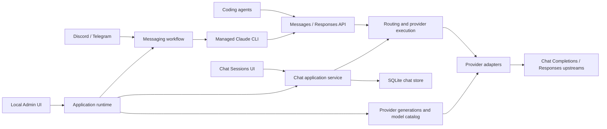

# Architecture

Free Claude Code (FCC) is a local Python/FastAPI gateway between coding agents
and configured AI providers. It preserves the client's public protocol while
routing models, translating requests and streams, and managing upstream failures.

This is the maintainer map. [README.md](README.md) covers installation and user
workflows; [AGENTS.md](AGENTS.md) and [CLAUDE.md](CLAUDE.md) contain identical,
concise development instructions. Source and executable contracts define current
behavior; provider catalogs, client version requirements, and tuning constants
stay with their implementation owners.

## Product Surfaces

- **Inference API:** Anthropic Messages and streaming OpenAI Responses, model
  discovery, token counting, health checks, and task control.
- **Server and desktop:** `fcc-server` and the Windows/macOS `fcc-desktop` shell
  run the same application and expose the local Admin UI.
- **Client launchers:** wrappers prepare client-specific FCC routing. Claude Code,
  Pi, and Aider use Messages; Codex, OpenCode, Cline, Hermes, DeepSeek Harness,
  Grok Build, and Muse Code use Responses.
- **Chat Sessions:** local browser conversations with persisted history,
  reasoning, model fallback, and context compaction.
- **Messaging:** optional Discord/Telegram bridges drive managed Claude Code
  sessions, including reply branches, task control, persistence, and voice input.

Installed commands and packaged assets are defined in
[pyproject.toml](pyproject.toml). Launcher support does not imply that a client is
also available as a messaging-managed backend.



## Package Ownership

All production Python modules live under `src/free_claude_code/`.

| Package | Responsibility | Allowed direct package dependencies |
| --- | --- | --- |
| [core](src/free_claude_code/core/) | Protocol schemas/conversion, canonical failures, diagnostics, shared primitives | None |
| [config](src/free_claude_code/config/) | Settings, source loading, paths, provider metadata, Admin configuration | `core` |
| [application](src/free_claude_code/application/) | Routing, reasoning intent, execution/fallback, model metadata, Chat use cases and ports | `config`, `core` |
| [api](src/free_claude_code/api/) | HTTP adapters, authentication, product handlers, stream commitment, Admin/browser surfaces | `application`, `config`, `core` |
| [providers](src/free_claude_code/providers/) | Provider construction, upstream I/O, discovery, admission, retries and recovery | `application`, `config`, `core` |
| [cli](src/free_claude_code/cli/) | Server commands, desktop shell, client launchers and managed processes | `config`, `core` |
| [messaging](src/free_claude_code/messaging/) | Platform adapters, workflow, conversation trees, rendering and voice orchestration | `core` |
| [runtime](src/free_claude_code/runtime/) | Process composition, lifecycle, provider generations, concrete storage and cross-package wiring | All packages above |

The exact exception is `cli.commands → runtime.bootstrap`: the installed server
command must construct the application. The lightweight `cli.entrypoints`
module handles metadata-only commands without importing the server graph.

[Import-boundary contracts](tests/contracts/test_import_boundaries.py) enforce
the package matrix, exact exception, acyclic static imports, facade ownership,
and optional-dependency owners. External consumers use the public facades of
`core.openai_responses`, `providers.openai_chat`, and `messaging.trees`.
Internal modules do not import their ancestor facade. Dynamic factory loading
also has catalog/factory synchronization checks.

Optional local voice imports belong to `messaging.transcription`; NVIDIA Riva
imports belong to `providers.nvidia_nim.voice`. They are lazy so ordinary
installation, startup, and metadata commands do not require voice extras.

## HTTP And Protocol Flow

[api/app.py](src/free_claude_code/api/app.py) constructs FastAPI around an explicit
`ApiServices` value. Runtime services are published through `app.state.services`;
the app factory does not construct provider resources or load global settings.

| Surface | Current behavior | Owner |
| --- | --- | --- |
| `POST /v1/messages` | Anthropic JSON response or SSE when `stream=true` | [Messages handler](src/free_claude_code/api/handlers/messages.py) |
| `POST /v1/responses` | Responses SSE; omitted/true `stream` accepted, false rejected | [Responses handler](src/free_claude_code/api/handlers/responses.py) |
| `POST /v1/messages/count_tokens` | Local pre-generation token estimate | [Token-count handler](src/free_claude_code/api/handlers/token_count.py) |
| `GET /v1/models` | Claude, direct Messages, and direct Responses catalog views | [Model catalog](src/free_claude_code/api/model_catalog.py) |
| `GET /muse-code/models` | Authenticated compatibility alias for the Responses model view | [Routes](src/free_claude_code/api/routes.py) |
| `GET /`, `GET /health`, `POST /stop` | Status, liveness, and managed-task control; supported endpoints also expose probes | [Routes](src/free_claude_code/api/routes.py) |
| `/admin`, `/admin/api/...` | Local configuration, provider/account operations, diagnostics | [Admin routes](src/free_claude_code/api/admin_routes.py) |
| `/admin/chat`, `/admin/api/chat/...` | Local Chat UI, sessions, operations, preferences and event feed | [Chat routes](src/free_claude_code/api/chat_routes.py) |

The inference path is:

1. HTTP middleware establishes request correlation and disconnect ownership.
2. The route acquires a provider-generation lease and builds its protocol handler.
3. The handler validates the request and applies any protocol-specific product
   policy. `ModelRouter` resolves the public model and reasoning intent.
4. `ProviderExecutor` uses the application-owned `ProviderPort` to preflight and
   stream the selected candidate, applying model fallback when eligible.
5. The provider translates to its upstream transport and returns the ingress
   protocol's SSE. The API owns final HTTP/error framing; non-streaming Messages
   aggregates the same internal stream into JSON.
6. Response finalization closes the body chain before releasing the lease.

The application keeps concrete `MessagesRequest` and `OpenAIResponsesRequest`
types. There is no universal intermediate request schema or
Responses-to-Messages-to-Responses round trip.

| Client ingress | Chat Completions upstream | Responses upstream |
| --- | --- | --- |
| Anthropic Messages | Anthropic-to-Chat conversion; Chat output presented as Anthropic SSE | Messages-to-Responses conversion; Responses output presented as Anthropic SSE |
| OpenAI Responses | Direct Responses-to-Chat conversion; Chat output presented as Responses SSE | Native Responses forwarding with FCC routing/stateless-streaming policy |

[core/anthropic](src/free_claude_code/core/anthropic/) owns Anthropic schemas,
conversion, token estimation, and stream ledgers.
[core/openai_responses](src/free_claude_code/core/openai_responses/) owns direct
Responses conversion, native forwarding, and event/identity helpers.
[Protocol-matrix tests](tests/contracts/test_protocol_matrix.py) exercise all
four cells; [stream contracts](tests/contracts/test_stream_contracts.py) protect
public event lifecycles.

Translation preserves message order, tool declarations and call/result pairing,
images, reasoning replay, public model identity, and usage semantics. Tool-name
encoding is reversible and belongs to
[core/openai_tool_names.py](src/free_claude_code/core/openai_tool_names.py).
Rich tool results are translated into target-representable content while keeping
their call association. Unsupported cross-protocol input, such as an image
represented only by an upstream file ID, is rejected rather than silently lost.
Native Responses forwarding preserves upstream item/call IDs, event order,
extensions, and usage within FCC's supported streaming contract.

## Routing, Reasoning, And Failures

[ModelRouter](src/free_claude_code/application/routing.py) accepts direct
`provider/model` references, encoded gateway IDs, and Claude-family names.
Family overrides fall back to `MODEL`; `MODEL_FALLBACKS` supplies ordered
alternate targets. Routed requests carry the upstream model separately from the
original public model. A fallback on the same provider is valid if it selects a
different model.

[application/reasoning.py](src/free_claude_code/application/reasoning.py) combines
client input and configured preferences into the immutable
[ReasoningPolicy](src/free_claude_code/core/reasoning.py): control, named effort,
and an optional exact token budget. Providers translate documented capabilities;
they do not parse upstream model names or versions to select reasoning behavior.
History replay is independent of the next generation's compute controls.
Output limits are not reasoning budgets. Discovered thinking support informs
model presentation, not request-policy inference.

Failure ownership is deliberately split:

| Owner | Decision |
| --- | --- |
| [core/failures.py](src/free_claude_code/core/failures.py), [core/diagnostics.py](src/free_claude_code/core/diagnostics.py) | Canonical `ExecutionFailure` semantics and safe diagnostics, without transport SDKs |
| [Provider failure policy](src/free_claude_code/providers/failure_policy.py) and specialized adapters | Classify upstream SDK/HTTP errors and qualify retries |
| [Admission](src/free_claude_code/providers/admission.py) and [stream recovery](src/free_claude_code/providers/stream_recovery.py) | Physical attempt budget, coordinated admission/recovery, replay/continuation and commit holdback |
| [ProviderExecutor](src/free_claude_code/application/execution.py) | Ordered model fallback and provider-progress deadline |
| [API response streams](src/free_claude_code/api/response_streams.py) and protocol serializers | HTTP commitment and terminal error serialization |

An executor candidate may advance on a canonical `ExecutionFailure` before its
first non-empty protocol chunk. It closes the abandoned stream and opens the
next target with a fresh request copy, retaining public identity and reasoning.
Provider-local `retryable` metadata does not govern this model transition.
Once a candidate emits output, fallback stops. Ordinary validation errors,
unexpected exceptions, cancellation, and the application progress deadline do
not become additional model retries.

`PROVIDER_PROGRESS_TIMEOUT` bounds waiting for non-empty provider output,
including admission, retries and fallback. Changing attempts/candidates does not
reset the current wait; emitted output renews it. Downstream backpressure is
outside that timer. Provider HTTP timeouts and client deadlines remain separate.

Before HTTP commitment, final inference failures can use non-2xx JSON; after
commitment they must terminate the existing protocol lifecycle. Messages emits
an Anthropic error event; Responses uses `response.failed` with the existing
response ID. Pre-commit execution-error responses include
`x-should-retry: false`. Providers raise canonical failures rather than invent
client error envelopes. Context-window exhaustion is a canonical failure kind;
the Anthropic serializer owns Claude's compaction-trigger wording.

See [execution failure contracts](tests/api/test_execution_failure_contract.py),
[model fallback tests](tests/api/test_model_fallback.py), and
[request lifetime tests](tests/api/test_request_lifetime.py).

## Provider Construction And Discovery

[config/provider_catalog.py](src/free_claude_code/config/provider_catalog.py)
owns provider IDs, authentication/readiness metadata, endpoint defaults, setting
references and proxy metadata. It does not import provider implementations.

[providers/runtime/factory.py](src/free_claude_code/providers/runtime/factory.py)
assigns each provider exactly one construction owner:

- An immutable [OpenAI Chat profile](src/free_claude_code/providers/openai_chat/profiles.py)
  for ordinary request/reasoning/replay policy.
- A specialized adapter for actual provider state, discovery, stream, or retry
  algorithms that profile data cannot describe.
- An injected factory for process-lifetime dependencies, such as connected-account
  authentication.

The construction-owner union must equal the catalog. Within a generation,
[ProviderRuntime](src/free_claude_code/providers/runtime/runtime.py) lazily owns
one provider and admission controller per provider ID.
[ProviderConfig](src/free_claude_code/providers/base.py) contains resolved shared
configuration; provider-specific fields remain in their adapter constructors.

[OpenAIChatProvider](src/free_claude_code/providers/openai_chat/provider.py)
implements the common Chat transport with explicit request policy, reasoning,
tool assembly, usage and recovery collaborators.
[OpenAIResponsesTransport](src/free_claude_code/providers/openai_responses/transport.py)
borrows the owning provider's client/admission resources for standard Responses
execution. It owns neither authentication nor model discovery.

Specialized boundaries include
[OpenCode catalog-selected transports](src/free_claude_code/providers/opencode/),
[NIM tool/retry handling](src/free_claude_code/providers/nvidia_nim/),
[shared Google wire behavior](src/free_claude_code/providers/google_openai/),
[Vertex credentials/catalogs](src/free_claude_code/providers/vertex/), and
[Codex subscription auth/private transport](src/free_claude_code/providers/openai_codex/).
Codex's process-lifetime auth manager owns credentials and refresh; generation
adapters borrow it. Public Responses conversion remains provider-neutral.

Provider admission separates the generation controller, one logical execution,
and each physical attempt. Rate/concurrency admission and coordinated recovery
are shared within that generation. Opening, corrections, replay, continuation,
and repair consume one logical attempt budget; SDK retries do not add a hidden
second budget. [ProviderAttemptScope](src/free_claude_code/providers/http.py)
retains the physical stream/resource and releases its attempt exactly once.
Already-accepted stream recovery stays request-local.

[Discovery](src/free_claude_code/providers/runtime/discovery.py) is provider-owned;
it is not assumed to be an OpenAI `/models` request. The runtime manager owns the
application-lifetime catalog of
[ProviderModelInfo](src/free_claude_code/application/model_metadata.py) values.
Startup warms referenced routing providers, then discovery fills the remaining
configured catalog in the background. Hot replacement retains useful cached
metadata. Catalog membership is not a prerequisite for upstream execution.

[runtime/codex_catalog.py](src/free_claude_code/runtime/codex_catalog.py) projects
the neutral inventory through the Codex launcher adapter and atomically publishes
the managed model-catalog file. Publication failures are nonfatal; the launcher
also synchronizes at launch. Client-side catalog caching remains client-owned.

## Runtime And Resource Lifecycle

[cli.commands.ServerSupervisor](src/free_claude_code/cli/commands.py) owns the
server run/restart loop.
[runtime/bootstrap.py](src/free_claude_code/runtime/bootstrap.py) constructs the
provider manager, connected-account auth, Chat service/store, optional
transcriber, `ApplicationRuntime`, `ApiServices`, and ASGI application.
[runtime/asgi.py](src/free_claude_code/runtime/asgi.py) drives runtime startup and
shutdown through lifespan events.

The supervised `RuntimeServer` first signals `ApplicationRuntime.begin_shutdown`.
Chat stops admitting work and finishes its observer feeds before Uvicorn drains
HTTP connections. Chat operations can still settle and publish internally;
storage and provider resources remain owned until lifespan cleanup completes.

[runtime/provider_manager.py](src/free_claude_code/runtime/provider_manager.py)
alone publishes, retires, and closes provider generations. Each inference request
holds a settings/provider snapshot through a lease. Provider-only Admin Apply
prepares a candidate, commits configuration, then publishes it for new requests.
Existing requests finish on the retired generation, which closes after its last
lease. Failed cleanup remains owned and retryable.

[Request correlation](src/free_claude_code/api/request_ids.py) covers the full
wire send. [Inference lifetime middleware](src/free_claude_code/api/request_lifetime.py)
owns disconnect reception and cancels unfinished inference even before the first
frame or during a silent stream. Response finalization closes the entire body
chain before releasing its generation on success, failure, cancellation or send
failure. Middleware does not use `BaseHTTPMiddleware` to proxy stream bodies.

[ApplicationRuntime](src/free_claude_code/runtime/application.py) shuts down
messaging ingress/work/delivery, Chat work/storage, transcription, providers,
then connected-account resources. Each dependency gate must close before the
next one is released. Failed cleanup retains the ownership graph; ASGI reports
incomplete shutdown, and the supervisor does not start an overlapping replacement.
The supervisor owns force-termination deadlines, not arbitrary inner cleanup
timeouts.

[cli/desktop.py](src/free_claude_code/cli/desktop.py) wraps the same supervisor.
A process lock admits one desktop host, the native tray stays on the main thread,
and a worker runs the server. Tray restart/quit use the shared lifecycle.
Installation and uninstallation own only their documented managed artifacts;
client executables and native client state have separate owners.

Lifecycle behavior is covered by
[runtime tests](tests/runtime/test_application_runtime.py),
[supervised HTTP shutdown tests](tests/cli/test_server_shutdown.py),
[provider-manager tests](tests/runtime/test_provider_manager.py), and
[response-stream tests](tests/api/test_response_streams.py).

## Configuration, Admin Apply, And Authentication

| Owner | Contract |
| --- | --- |
| [settings.py](src/free_claude_code/config/settings.py) | Pure Pydantic types, defaults, normalization and cross-field validation |
| [loader.py](src/free_claude_code/config/loader.py) | Source precedence, provenance, public settings cache |
| [env_migrations.py](src/free_claude_code/config/env_migrations.py) | Locked, atomic consolidation of legacy configuration |
| [paths.py](src/free_claude_code/config/paths.py) | Managed configuration, auth, logs, catalogs, Chat and messaging paths |
| [config/admin](src/free_claude_code/config/admin/) | Catalog-driven fields, presentation, validation and sparse persistence |
| [runtime/application.py](src/free_claude_code/runtime/application.py) | Credential checks, Apply publication/restart decisions and account operations |

Retired provider references are normalized per source before validation by
`config/model_refs.py`. Managed selections are cleared to inherit the default;
process overrides retain their ownership. Startup atomically repairs managed
config and current Chat model selections; Chat history retains its original model
facts. Stale direct request IDs route to the effective default, preserving encoded
reasoning intent. Unknown preserved config values are masked in Admin previews.

Live precedence is defaults, managed `~/.fcc/.env`, then process environment.
The deliberate exception is a non-empty managed `ANTHROPIC_AUTH_TOKEN`, which
wins over an inherited token. Settings loading may perform the one-time legacy
migration; after consolidation, checkout env files and `FCC_ENV_FILE` are not
live sources. [.env.example](.env.example) is documentation only.

Admin updates are sparse: omission preserves values, optional-field removal is
explicit, and masked/blank secret submissions mean unchanged. Process-owned
fields are shown as locked. Provider fields derive from catalog metadata;
new settings must distinguish hot-apply, restart-required, and session-sensitive
behavior according to their runtime owners.

Apply validates prospective settings and checks edited API keys through
[credential_validation.py](src/free_claude_code/providers/credential_validation.py).
Checks use documented non-generating authenticated endpoints and return
`verified`, `rejected`, or `unverified`. Proven rejection blocks Apply;
unsupported probes and inconclusive network failures are not proof of a bad
key. Accepted changes either replace a provider generation or follow the runtime
restart path. Configuration readiness, live provider checks, and discovery are
separate states.

Automatic restart responses identify the old runtime instance. Admin polls the
local status endpoint until a different running instance is ready, then reloads
settings and retains credential warnings. A bounded reconnect failure offers a
retry without resubmitting edits. Status allows reads from validated loopback
origins so this also works when Apply changes the server address.

Authentication is defined in
[api/dependencies.py](src/free_claude_code/api/dependencies.py):

- `PROXY_AUTH_ENABLED` controls enforcement; `ANTHROPIC_AUTH_TOKEN` is the
  retained non-empty credential. Disabling enforcement does not erase it.
- Responses and model-list routes use bearer authorization.
- Anthropic Messages/token-count routes accept bearer authorization or, only
  when Authorization is absent, the proxy token in `x-api-key`. An invalid
  Authorization header does not fall through to `x-api-key`.
- Token comparison is constant-time.
- [Admin security](src/free_claude_code/api/admin_security.py) independently
  requires a loopback client, local Host authority, and a local Origin when
  supplied. It covers configuration and Chat surfaces.

See [config tests](tests/config/), [auth tests](tests/api/test_auth.py),
[credential tests](tests/providers/test_credential_validation.py), and
[Admin tests](tests/api/test_admin.py).

## Chat Sessions

Chat is a separate local product surface that calls the shared application
executor directly; it does not launch a coding agent or call FCC over loopback
HTTP. The composition root injects provider-runtime and storage ports.

| Owner | Responsibility |
| --- | --- |
| [application/chat/service.py](src/free_claude_code/application/chat/service.py) | Session commands, one active operation per session, generation/compaction, cancellation and terminal settlement |
| [application/chat/context.py](src/free_claude_code/application/chat/context.py) | Model options, context estimation, transcript construction and compaction budgets |
| [application/chat/events.py](src/free_claude_code/application/chat/events.py) | Bounded operation event subscriptions |
| [application/chat/ports.py](src/free_claude_code/application/chat/ports.py) | Application-owned storage/subscription interfaces |
| [runtime/chat_sqlite.py](src/free_claude_code/runtime/chat_sqlite.py) | SQLite implementation, transactions, revisions, schema handling and restart repair |
| [api/chat_routes.py](src/free_claude_code/api/chat_routes.py) | Loopback HTTP commands, snapshots and SSE feed |
| [Admin static assets](src/free_claude_code/api/admin_static/) | Browser session UI; [chat_markdown.py](src/free_claude_code/api/chat_markdown.py) renders response Markdown |

Send/retry/regenerate/compact operations validate revisions and retain a provider
lease while work runs. Chat uses the same Messages execution/fallback pipeline.
Context handling includes proactive/manual compaction and bounded reactive
recovery from context-window exhaustion. Mixed fallback failures do not become
an unconditional compaction retry.

Mutations and terminal publication must agree with durable state. Stop, delete,
and shutdown retain operation ownership until settlement finishes; a late
cancellation cannot downgrade an already committed completion. Browser event-feed
disconnect only closes its subscription, not the active generation. Overflow
requests a resync from authoritative snapshots.

SQLite lives under `~/.fcc/chat/` with an exclusive process lock, short
thread-backed transactions, and WAL. Startup handles supported schema state,
removes unpublished generations, and marks visible unfinished generations
interrupted. A storage startup failure leaves Chat unavailable while allowing
the inference gateway to start.

See [Chat service tests](tests/application/test_chat_service.py),
[storage tests](tests/runtime/test_chat_sqlite.py),
[Chat API tests](tests/api/test_chat_routes.py), and
[browser tests](e2e/test_chat_sessions.py).

## Client Launchers And Messaging

[cli/launchers](src/free_claude_code/cli/launchers/) owns client-specific model
projection, argument handling, credential isolation and temporary configuration.
The shared [model catalog adapter](src/free_claude_code/cli/launchers/model_catalog.py)
consumes direct Messages/Responses views; the API owns routable wire identity.
Native client configuration and credentials remain client-owned. Pass-through
commands and unsupported persistent/background modes are decided by each
launcher and covered under [tests/cli](tests/cli/).

[cli/local_http.py](src/free_claude_code/cli/local_http.py) bypasses forward
proxies for local FCC health/catalog calls and adds FCC/loopback hosts to child
`NO_PROXY` settings while retaining outbound proxy configuration.
[cli/claude_env.py](src/free_claude_code/cli/claude_env.py) owns the shared Claude
environment. Codex's launcher owns its generated catalog and command-backed proxy
authentication.

[Aider](src/free_claude_code/cli/launchers/aider.py) projects the Messages catalog
into temporary model-settings/metadata files. Its model names use Aider's
Anthropic transport, and the real proxy token is carried through a unique child
environment variable. The launcher rejects route-file overrides that would
replace its FCC overlay.

Messaging follows a different path:

```text
Discord/Telegram ingress → workflow/turn intake → scoped tree queue
  → node runner → managed Claude CLI → FCC inference API
  → CLI event parser → transcript renderer → platform outbox
```

[ApplicationRuntime](src/free_claude_code/runtime/application.py) wires the
platform, [MessagingWorkflow](src/free_claude_code/messaging/workflow.py),
transcriber and [managed session manager](src/free_claude_code/cli/managed/manager.py).
The platform adapters depend on SDKs; workflow code consumes normalized messages
and platform-neutral ports.

[Turn intake](src/free_claude_code/messaging/turn_intake.py) handles commands and
admission; [node runner](src/free_claude_code/messaging/node_runner.py) owns CLI
work; [trees](src/free_claude_code/messaging/trees/) encapsulates aggregates,
claims, queues and task ownership. Identity includes platform and chat scope.
Opaque execution claims prevent stale runners from mutating cleared or
re-admitted branches. Reply references distinguish logical session ancestry from
the exact prompt/status being replied to.

Global stop, scoped clear, and reply-scoped operations have different boundaries.
State detachment/cancellation and persistence complete before best-effort platform
deletion; platform failures never restore cleared state.
[Session persistence](src/free_claude_code/messaging/session/) uses typed
snapshots and serialized atomic writes. Explicit flush failures remain retryable.

[Platform outbox](src/free_claude_code/messaging/platforms/outbox.py) owns queued
delivery with the runtime's limiter.
[Voice flow](src/free_claude_code/messaging/platforms/voice_flow.py) and
[voice claims](src/free_claude_code/messaging/voice.py) own transcription handoff,
scoped cancellation and temporary-file cleanup. Thread-backed transcription must
finish before its resources are released. Bootstrap selects local Whisper or the
NIM transcriber; messaging never constructs provider adapters.

See [messaging tests](tests/messaging/) for scope, reply-tree, persistence, voice,
delivery and shutdown contracts.

## Local Tools And Diagnostics

[Messages optimizations](src/free_claude_code/api/optimization_handlers.py) handle
configured quota probes, command-prefix detection, titles, suggestions and
filepaths locally. Claude safety-classifier handling is a Messages routing policy:
it adjusts recognized classifier requests and reasoning; it does not fabricate
a verdict.

[api/web_tools](src/free_claude_code/api/web_tools/) owns supported Anthropic
server-tool compatibility. Forced search/fetch can run locally; the supported
automatic-search shape buffers a normal provider decision before emitting local
search results. Other hosted-tool shapes are rejected before upstream execution.
[Web-fetch egress policy](src/free_claude_code/api/web_tools/egress.py) owns allowed
schemes and private-network restrictions.

[core/trace.py](src/free_claude_code/core/trace.py) carries request correlation
across layers; [diagnostics](src/free_claude_code/core/diagnostics.py) redacts
credentials and bounds error detail.
[Logging configuration](src/free_claude_code/config/logging_config.py) owns file
rotation/retention. Raw API payloads, detailed errors and messaging content are
opt-in diagnostics. Construction-time security/logging settings require restart
when their existing owners cannot be updated safely.

## Verification And Extension Map

| Change area | Primary code | Relevant verification |
| --- | --- | --- |
| Provider | Catalog/settings, OpenAI Chat profile or specialized adapter, runtime factory | [Provider tests](tests/providers/), [catalog contracts](tests/contracts/test_provider_catalog_order.py), targeted provider smoke |
| Protocol | `core/anthropic`, `core/openai_responses`, transport presenters | [Protocol matrix](tests/contracts/test_protocol_matrix.py), [stream contracts](tests/contracts/test_stream_contracts.py), API failure/response tests |
| Setting/Admin | Settings, catalog/generated manifest, Apply owner, browser assets | [Config](tests/config/), [Admin API](tests/api/test_admin.py), [e2e](e2e/) |
| Chat | Application service/context/ports, SQLite, Chat routes/assets | [Application](tests/application/), [SQLite](tests/runtime/test_chat_sqlite.py), [Chat e2e](e2e/test_chat_sessions.py) |
| Client/install | Launcher/config projection, entrypoints, installer/uninstaller | [CLI](tests/cli/), [scripts](tests/scripts/), [packaging](tests/contracts/test_packaging_contracts.py) |
| Messaging | Platform ports, workflow/trees, runner/rendering, persistence | [Messaging](tests/messaging/), targeted product smoke |
| Lifecycle | Runtime, provider manager, HTTP lifetime/response owner | [Runtime](tests/runtime/), [request lifetime](tests/api/test_request_lifetime.py), [response streams](tests/api/test_response_streams.py) |

New provider settings feed the catalog-driven Admin manifest where possible.
New clients need launcher/packaging coverage; messaging-managed support is a
separate integration. Shared protocol behavior belongs in core, while provider
quirks stay with their adapter. New imports must satisfy the dependency contract.
Tests protect user behavior and ownership invariants, not obsolete internal
module layouts.

[tests](tests/) is the deterministic suite.
[e2e](e2e/) runs real browser interactions against isolated local state and fake
providers. [smoke](smoke/README.md) separates prerequisite probes from product
scenarios and documents live-service opt-ins; a liveness probe is not proof that
a complete client/tool workflow works.

Runtime release identity comes from installed distribution metadata through
[core/version.py](src/free_claude_code/core/version.py), not by parsing project
files or duplicating version literals.

Local CI is [scripts/ci.ps1](scripts/ci.ps1) on Windows or
[scripts/ci.sh](scripts/ci.sh) on macOS/Linux. Both cover suppression policy,
Ruff formatting/lint, ty, pytest and Playwright. Local Ruff runs repair code;
[GitHub CI](.github/workflows/tests.yml) runs check-only Ruff and requires all
six checks. See [AGENTS.md](AGENTS.md) for commands and subset/dry-run flags.
The trusted dependency-cache workflow populates caches, not validation results.

Update this map when public surfaces, package boundaries, ownership, lifecycle,
configuration or extension paths change. Documentation-only updates need source
accuracy/link checks and do not require a release bump; production changes follow
the versioning rules in the identical instruction files.
