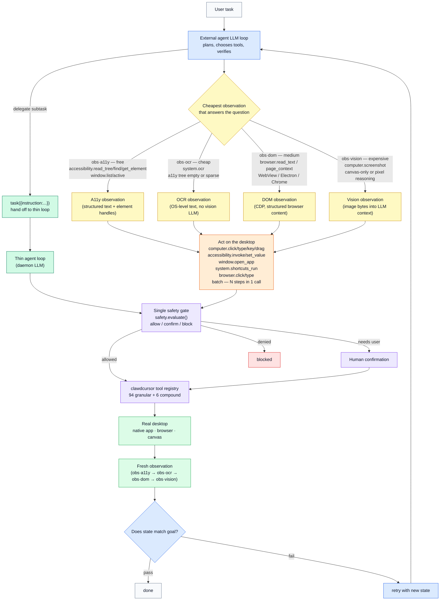

<p align="center">
  
</p>

<h1 align="center">Clawd Cursor</h1>

<p align="center">
  <strong>The local MCP server that gives any agent safe desktop control.</strong><br>
  Any model. Any app. One MCP entry. Local-only.
</p>

<p align="center">
  <a href="LICENSE"></a>
  <a href="https://github.com/AmrDab/clawdcursor/releases/latest"></a>
  
  
  <a href="https://github.com/AmrDab/clawdcursor/actions/workflows/cross-platform.yml"></a>
  <a href="https://github.com/AmrDab/clawdcursor/actions/workflows/codeql.yml"></a>
  <a href="https://discord.gg/hW29nrEZ8G"></a>
</p>

<p align="center">
  <a href="#quickstart">Quickstart</a> &middot;
  <a href="#the-fallback-execution-layer">Why</a> &middot;
  <a href="#toolbox--6-compound-tools-recommended">Toolbox</a> &middot;
  <a href="#how-it-works">How it works</a> &middot;
  <a href="#platform-support">Platforms</a> &middot;
  <a href="CHANGELOG.md">Changelog</a>
</p>

---

## The fallback execution layer

Clawd Cursor is a **local MCP server**. Install it once. Any tool-calling agent on the machine &mdash; Claude Code, Cursor, Windsurf, OpenClaw, Claude Agent SDK, your own loop &mdash; connects via MCP and gets safe control of the real desktop. The agent clicks, types, reads the screen, opens apps, and drives any GUI the same way a human would.

**No cloud. No telemetry by default.** Server binds to `127.0.0.1`. Screenshots stay in RAM unless you point a cloud model at them. With Ollama or any local model, nothing leaves the machine.

**Single `safety.evaluate()` chokepoint.** Every tool call &mdash; whether it comes from an editor host over stdio, from an external agent over HTTP, or from the built-in autonomous loop &mdash; routes through one safety gate before it touches the desktop. The agent cannot bypass this path.

**Bearer-token auth on HTTP.** The daemon binds to `127.0.0.1:3847`. Every HTTP request needs `Authorization: Bearer $(cat ~/.clawdcursor/token)`. Local-only by default; the bind address is configurable.

> **If a human can do it on a screen, your AI can do it too.** No API? No integration? No problem.
>
> **No task is impossible.** GUI plus a mouse plus a keyboard equals everything you need. There is no "I can't do that in this app" &mdash; only the right sequence of reads, clicks, keys, and waits. Clawd Cursor gives you all of them.

It's **model-agnostic** (Claude, GPT, Gemini, Llama, Kimi, Ollama, &hellip;), **app-agnostic** (drives any window via accessibility, OCR, or vision fallback), and **OS-agnostic** (one `PlatformAdapter` covers Windows, macOS, Linux X11, and Linux Wayland).

> **Use as a fallback, not first choice.** Native API exists? Use it. CLI exists? Use it. Direct file edit possible? Do that. A Playwright script already wired up? Use that. Clawd Cursor is for the **last mile** &mdash; the click, the legacy app, the GUI with no public surface.

---

## Toolbox &mdash; 6 compound tools (recommended)

Two catalogs ship side-by-side. The **toolbox** (this section) is 6 compound tools, each with an `action` enum that covers ~10-15 verbs. **Tools** (next section) is the 94 underlying granular primitives, one schema per verb.

Compound is the default surface. Catalog footprint is ~1,500 tokens (about 12&times; smaller than granular), which keeps small models focused on the action choice instead of drowning in primitives. Same `computer_20250124` shape Anthropic uses, so editor hosts already know how to drive it.

| Toolbox | Actions |
|---|---|
| `computer` | `screenshot`, `click`, `double_click`, `right_click`, `triple_click`, `hover`, `scroll`, `scroll_horizontal`, `drag`, `drag_path`, `type`, `key`, `wait` |
| `accessibility` | `read_tree`, `find`, `get_element`, `focused`, `invoke`, `focus`, `set_value`, `get_value`, `expand`, `collapse`, `toggle`, `select`, `state`, `list_children`, `wait_for` |
| `window` | `list`, `active`, `focus`, `maximize`, `minimize`, `restore`, `close`, `resize`, `list_displays`, `screen_size`, `open_app`, `open_file`, `open_url`, `switch_tab`, `navigate` |
| `system` | `clipboard_read`, `clipboard_write`, `system_time`, `ocr`, `undo`, `shortcuts_list`, `shortcuts_run`, `delegate`, `detect_webview`, `relaunch_with_cdp`, `system_prompt` |
| `browser` | `connect`, `page_context`, `read_text`, `click`, `type`, `select_option`, `evaluate`, `wait_for`, `list_tabs`, `switch_tab`, `scroll` |
| `task` | `{instruction: string}` &mdash; delegate the whole task to the built-in thin agent loop (the configured model takes the wheel: perceive → act → iterate until done). No `action` enum. **Requires `clawdcursor agent` with an LLM configured (`clawdcursor doctor`) &mdash; unavailable under `--no-llm` or stdio `clawdcursor mcp`.** If your agent has its own brain, drive the other five toolboxes directly instead. |
| `batch` | `{steps: [...]}` &mdash; collapse N tool calls into one round-trip. Each step is `{name, arguments, expect?}`. The executor re-perceives before each `expect` guard, routes every step through the same safety gate, and halts with a per-step trace on any guard miss, safety stop, or error. Use `dryRun:true` to pre-scan tiers. The efficiency lever for a driving agent: N calls → 1. |

A typical turn:

```js
computer({ action: "key", combo: "mod+s" })          // resolves to Cmd+S / Ctrl+S
accessibility({ action: "invoke", name: "Send" })
window({ action: "open_app", name: "Outlook" })
system({ action: "ocr" })                            // OS-level OCR, no LLM vision
task({ instruction: "open Notepad and type hello" }) // delegates to the thin agent loop
batch({ steps: [                                     // collapse N calls into 1 round-trip
  { name: "accessibility", arguments: { action: "set_value", name: "To", value: "amy@x.com" } },
  { name: "accessibility", arguments: { action: "set_value", name: "Subject", value: "Hi" } },
  { name: "computer",      arguments: { action: "type", text: "Body here." } }
]})
```

---

## Quickstart

Sixty seconds from zero to a tool-calling agent on your desktop.

**Pick your mode first:**

| Your situation | Use | Why |
|---|---|---|
| AI lives in your editor (Claude Code, Cursor, Windsurf, Zed) | **`clawdcursor mcp`** | stdio MCP server. **You never run this yourself** &mdash; the editor/MCP host spawns it on demand from its config (you just add the JSON below). No daemon, no port. |
| You're building an agent that runs unattended | **`clawdcursor agent`** | HTTP MCP daemon on `127.0.0.1:3847`. Has its own LLM brain optionally configured via `doctor`. |
| Your agent has its own brain &mdash; you just want the tools as an HTTP endpoint | **`clawdcursor agent --no-llm`** | Same daemon, no built-in agent loop, no scheduler startup, no credential validation. Pure tool surface. |

**Simplest &mdash; any OS (now on npm):**

```bash
npm i -g clawdcursor
```

> Works as-is on Windows and Linux. On **macOS**, also run `clawdcursor grant` afterward to build the native helper (Accessibility + Screen Recording). The OS installer scripts below do this step for you.

**Or one line per OS (clones the repo, builds, and handles the macOS native build automatically):**

**Windows (PowerShell):**

```powershell
powershell -c "irm https://clawdcursor.com/install.ps1 | iex"
```

**macOS / Linux:**

```bash
curl -fsSL https://clawdcursor.com/install.sh | bash
```

Then:

```bash
clawdcursor consent --accept   # one-time desktop-control consent (required)
clawdcursor doctor             # verify permissions + (optionally) configure an LLM provider
clawdcursor agent              # OR `clawdcursor mcp` — see the table above
```

The installer clones into `~/clawdcursor`, runs `npm install`, builds, and `npm link`s a global shim. Runtime state lives at `~/.clawdcursor/` (auth token, pidfiles, logs). It does **not** edit any agent host config &mdash; that step is below.

Wire it into Claude Code, Cursor, Windsurf, or Zed:

```jsonc
// ~/.claude/settings.json  (or your editor's MCP config)
{
  "mcpServers": {
    "clawdcursor": {
      "command": "clawdcursor",
      "args": ["mcp", "--compact"]
    }
  }
}
```

That's it. Ask your agent to *"open Outlook and reply to the latest email from Sarah"* and watch it run.

> **Don't run `clawdcursor mcp` in a terminal yourself** &mdash; your editor launches it automatically over stdio when it needs the server. The only commands you run by hand are the install, `consent`, and `doctor` steps above.

> **Editor permission allowlist (Claude Code, Cursor, &hellip;).** If your editor maintains a per-tool permission allowlist (keys like `mcp__clawdcursor__window`), use the **server-level wildcard** `"mcp__clawdcursor"` instead. It covers every tool in one entry and is immune to tool renames across versions — per-tool entries silently break whenever a tool is added, removed, or renamed.

> **macOS first run.** Run `clawdcursor grant` to walk through the permission dialogs, then open **System Settings &rarr; Privacy &amp; Security** and enable the entry named **ClawdCursor** under **both** Accessibility and Screen Recording. v1.0.0 consolidates all desktop control under this single native-app identity &mdash; both entries are required.
> **Linux:** install `tesseract-ocr`, `python3-gi`, `gir1.2-atspi-2.0`, and (Wayland only) `ydotool` or `wtype`.

---

## Why Clawd Cursor

Most "let an agent use the computer" tools are browser-only, single-OS, or vision-only. Clawd Cursor is the cross-OS, accessibility-first, MCP-native one &mdash; with a single safety gate every call routes through.

|                                     | **Clawd Cursor**        | browser-use | Playwright     | computer-use        |
|-------------------------------------|:-----------------------:|:-----------:|:--------------:|:-------------------:|
| Any desktop app, not just web       | ✅                      | web only    | web only       | ✅                  |
| Cross-OS (Win + macOS + Linux)      | ✅                      | &mdash;     | &mdash;        | runs in a sandbox   |
| Accessibility-first, not pixel-only | ✅ a11y → OCR → vision   | DOM         | DOM            | vision only         |
| Any model / vendor                  | ✅                      | ✅          | not an agent   | Claude only         |
| MCP-native (one config, any host)   | ✅                      | library     | test framework | tool-use API        |
| Single safety chokepoint            | ✅                      | &mdash;     | &mdash;        | &mdash;             |
| Local-only, no cloud required       | ✅                      | ✅          | ✅             | screenshots → cloud |

Two mechanisms the others don't have:

- **Cheapest-tier-first by design.** Accessibility tree (free) → OCR (cheap) → screenshot (medium) → vision (expensive); the agent climbs only when it must, so token cost tracks task difficulty. The `batch` tool collapses deterministic stretches into one round-trip for additional efficiency.
- **One protocol, two transports.** MCP over stdio for editor hosts, MCP over HTTP for daemons &mdash; same catalog, same JSON-RPC envelope.

---

## How it works

**Where the brain lives** decides how clawdcursor is used. Both modes can run side-by-side &mdash; the daemon and editor-spawned stdio child are independent processes.

| Brain lives... | Mode | Command | What you call |
|---|---|---|---|
| In your editor (Claude Code, Cursor, Windsurf, Codex, Zed) | Direct tools | `clawdcursor mcp` | Each tool individually, via stdio MCP |
| In a headless agent with its own LLM (OpenClaw, Claude Agent SDK, your own loop) | Direct tools | `clawdcursor agent --no-llm` | Same, over HTTP MCP |
| Inside clawdcursor itself (scheduled tasks, "submit a task and walk away") | Thin agent loop | `clawdcursor agent` + `doctor`-configured LLM | `submit_task` (or `scheduled_task_create`) |
| External brain that delegates sub-tasks to the built-in loop | Direct tools + delegation | `clawdcursor agent` + your client | Direct tools normally; call `task({instruction:...})` to hand off a sub-task to the built-in thin loop |

### Direct tools &mdash; your agent drives

Your LLM picks the calls; clawdcursor supplies safe actuation and fresh observations from the real desktop. This is the primary mode for any agent with its own reasoning loop.



**The loop:** read the a11y tree (cheap) → act on named targets → verify from fresh observations → escalate perception only when needed (OCR → screenshot). Sparse a11y tree? Call `system.detect_webview` — Electron/WebView2 apps render inside Chromium, switch to `browser.*` via CDP. Canvas-only (Paint, Figma, games)? Screenshot + coord click.

**`batch` for deterministic stretches.** When the next N steps are known (no mid-sequence branching), collapse them into one `batch` call. Each step still routes through the safety gate; on any guard miss, safety stop, or error the batch halts and returns a per-step trace.

**Task delegation.** When the daemon has an LLM configured, your external agent can delegate at any point by calling `task({"instruction":"&hellip;"})`. The built-in thin loop takes the wheel, reasons and acts using the configured model, and reports back. Useful for delegating grunt work to a cheaper model — e.g. *"open Outlook and reply to Sarah's latest about budget"* — without burning your own LLM context on the step-level details.

### Thin agent loop &mdash; clawdcursor drives

You hand off a task in plain English (`submit_task`, the web dashboard at `:3847/`, or a `scheduled_task_create` cron tick). The configured model perceives the desktop, selects tools, and iterates until the task is done or the turn budget is exhausted.

**Single safety chokepoint.** Every tool call &mdash; direct or via the thin loop &mdash; routes through `safety.evaluate()`. The agent cannot bypass this path; it is the only way tools execute.

---

## Transports

One protocol &mdash; **MCP** &mdash; two transports. Same catalog, same JSON-RPC envelope.

| Transport | When to use | Client config |
|---|---|---|
| **stdio MCP** | Editor hosts: Claude Code, Cursor, Windsurf, Zed. Tools appear on demand &mdash; no daemon. | `{"command": "clawdcursor", "args": ["mcp", "--compact"]}` |
| **HTTP MCP** | Bring-your-own-agent, headless daemons, multi-process orchestration, Claude Agent SDK. POST JSON-RPC to `http://127.0.0.1:3847/mcp`. | Run `clawdcursor agent`. Then `tools/list` returns the catalog and `tools/call` invokes any tool. Bearer token at `~/.clawdcursor/token`. |

Both transports are stateless. No session-init handshake. Bearer-token auth on every HTTP request; stdio inherits the parent process's trust.

```bash
# HTTP MCP — list tools
curl -s -X POST http://127.0.0.1:3847/mcp \
  -H "Authorization: Bearer $(cat ~/.clawdcursor/token)" \
  -H "Content-Type: application/json" \
  -d '{"jsonrpc":"2.0","id":1,"method":"tools/list"}'
```

---

## Tools &mdash; 94 granular primitives

The flat catalog. Each of the 6 compound toolboxes above dispatches to one of these under the hood. Use this surface directly when:

- **Compatibility** &mdash; your agent runtime requires every action as a top-level MCP tool (no `action` enum). Run the daemon without `--compact` (granular is the default for `clawdcursor agent`) to expose them.
- **Debugging** &mdash; you want to call a specific primitive directly (`key_press`, `mouse_click`, `read_screen`) without going through the compound dispatcher.

The full catalog &mdash; both compact toolboxes and granular tools &mdash; is always visible through MCP `tools/list` on either transport. Authoritative schema lives in [`schema.snapshot.json`](schema.snapshot.json).

A typical turn:

```js
key_press({ key: "mod+s" })
invoke_element({ name: "Send" })
open_app({ name: "Outlook" })
ocr_read_screen()
// ...94 tools total
```

Both forms produce identical effects through the same `safety.evaluate()` chokepoint.

---

## Cost Tiers

Every perception source has a cost. Start at the cheapest rung that works and climb only when it fails &mdash; the same discipline whether your agent drives the tools directly or hands a sub-task to the built-in loop via `task`.

| Tier | Label | Cost | Source | When to use |
|---|---|---|---|---|
| **T1** | structured | ~free | `accessibility.*`, `window.*`, `browser.read_text`, clipboard | Default. Returns text + bounds &mdash; no image, no vision LLM. |
| **T2** | ocr | cheap | `system({"action":"ocr"})` | A11y tree empty or sparse. OS-level OCR &mdash; text out, no LLM vision. |
| **T3** | screenshot | medium | `computer({"action":"screenshot"})` | OCR isn't enough and you need pixel context. Sends an image into LLM context. |
| **T4** | vision | expensive | `smart_click`, `smart_read`, `smart_type` | Canvas-only apps (Paint, Figma, games) or spatial reasoning that text can't express. Last resort. |

**Rule: start at T1. Escalate only when the current tier fails.** Apply the same discipline when calling compound tools directly; the built-in thin loop follows it too.

---

## Observe vs Act

Every tool call is one of two kinds: **observe** (read the current state of the desktop — zero side effects) or **act** (change it). The log badge on each tool-call line tells you which, and which observation channel was used. This makes the cheap-first ladder visible at a glance as a task runs.

| Kind | Log badge | What it does | Example tools |
|---|---|---|---|
| **Observe &mdash; a11y** | `obs·a11y` | Read the accessibility tree (structured text + bounds, free) | `accessibility.read_tree`, `accessibility.find`, `accessibility.get_element`, `accessibility.get_value`, `accessibility.focused`, `window.list`, `window.active`, `accessibility.list_children`, `accessibility.wait_for` |
| **Observe &mdash; OCR** | `obs·ocr` | Read on-screen text via OS OCR engine (no LLM vision) | `system.ocr` (`ocr_read_screen`), `system.smart_read` |
| **Observe &mdash; DOM** | `obs·dom` | Read the browser DOM via CDP (Electron / WebView2 / Chrome) | `browser.read_text` (`cdp_read_text`), `browser.page_context` (`cdp_page_context`) |
| **Observe &mdash; vision** | `obs·vision` | Take a screenshot (image bytes enter LLM context — most expensive) | `computer.screenshot` (`desktop_screenshot`, `desktop_screenshot_region`, `screenshot_full`) |
| **Act** | `act` | Change the screen: click, type, key, scroll, drag, open, invoke | `computer.click/type/key/drag/scroll`, `accessibility.invoke/set_value/focus`, `window.open_app/open_url/open_file`, `system.clipboard_write`, `browser.click/type`, `batch`, `task` |

**The discipline:** prefer `obs·a11y` first — it returns structured text and element handles for free. If the a11y tree is empty or sparse, try `obs·ocr`. If the target is inside a WebView or Electron shell, use `obs·dom` via CDP. Only escalate to `obs·vision` (screenshot) when pixel context is genuinely needed. Act once you have enough information, then observe again to verify.

The badge column in the live log (`CLAWD_LOG=pretty`, the default on a TTY) shows this ladder in real time: you can watch `obs·a11y` → `act` → `obs·a11y` on a normal turn, and see when the agent is forced to climb to `obs·ocr` or `obs·vision`.

Derived from `src/tools/cost-class.ts` (authoritative cost-class table) + `src/core/observability/logger.ts` (`observeActBadge`).

---

## Platform Support

Platform-specific code lives in `src/platform/{windows,macos,linux}.ts` (plus `wayland-backend.ts`) behind a single `PlatformAdapter` interface. Business logic never reads `process.platform`. Roughly 3,750 LOC across the four adapters.

| Platform | UI Automation | OCR | Browser (CDP) | Input |
|---|---|---|---|---|
| **Windows** 10/11 (x64 / ARM64) | UIA via PowerShell bridge | `Windows.Media.Ocr` | Chrome / Edge | nut-js |
| **macOS** 12+ (Intel / Apple Silicon) | JXA + System Events (TCC-safe) | Apple Vision | Chrome / Edge | nut-js + System Events |
| **Linux** X11 | AT-SPI via `python3-gi` | Tesseract | Chrome / Edge | nut-js |
| **Linux** Wayland | AT-SPI via `python3-gi` | Tesseract | Chrome / Edge | `ydotool` / `wtype` |

Per-OS setup notes:

- **Windows** &mdash; no setup. PowerShell bridge spawns on demand.
- **macOS** &mdash; first run needs Accessibility + Screen Recording in `System Settings > Privacy & Security`. `clawdcursor grant` walks the dialogs; enable the entry named **ClawdCursor** under both categories. Retina / HiDPI handled in the adapter; **do not pre-scale coordinates**.
- **Linux X11** &mdash; `apt install tesseract-ocr python3-gi gir1.2-atspi-2.0` (or your distro's equivalent).
- **Linux Wayland** &mdash; same a11y packages, plus `ydotool` + a running `ydotoold` daemon (preferred) or `wtype` (keyboard only).

---

## Architecture

Five directories. Everything else is a leaf module.

| Directory | What lives here |
|---|---|
| `src/core/` | Thin agent loop (`agent.ts`, `runAgent`), sense layer (a11y/snapshot/fingerprint), focus guard, safety gate. |
| `src/tools/` | The 94 granular tools + 6 compound aggregators + `batch`, playbooks (`find-replace`, `extract-compose`), tool registry, dispatch. |
| `src/platform/` | `PlatformAdapter` interface + Windows / macOS / Linux / Wayland implementations, OCR engine, CDP driver, URI handler. |
| `src/llm/` | Provider clients (Claude, GPT, Gemini, Llama, Kimi, Ollama, &hellip;), credentials, model config. |
| `src/surface/` | CLI (`clawdcursor`), MCP server (stdio + HTTP), dashboard, doctor, onboarding, readiness probes. |

The `PlatformAdapter` is the only thing platform code talks to. The `safety.evaluate()` chokepoint is the only way tools execute. Those two seams are the whole point of the architecture.

---

## Safety & Privacy

| Tier | Actions | Behavior |
|---|---|---|
| Auto | Reading, opening apps, navigation, typing into non-sensitive fields | Executes immediately |
| Preview | Form fill, arbitrary input | Logged before executing |
| Confirm | Sends, deletes, purchases, transfers | Pauses for user approval |
| Block | `Alt+F4` / `Cmd+Q` of the agent shell, `Ctrl+Alt+Delete`, `Shift+Delete`, power chords | Refused outright |

Hardening summary:

- **Network isolation.** Server binds to `127.0.0.1`. Verify with `netstat -an | findstr 3847` (Windows) or `| grep 3847` (Unix).
- **Bearer-token auth.** Every HTTP request needs `Authorization: Bearer $(cat ~/.clawdcursor/token)`.
- **Sensitive-app policy.** Email, banking, password managers, private messaging auto-elevate to Confirm. The agent must ask the user before acting on these surfaces.
- **No telemetry by default.** Nothing phones home on its own. Screenshots stay in RAM; with Ollama or any local model, nothing leaves the machine; with a cloud provider, screenshots go only to the endpoint you configured. The one exception is opt-in: `clawdcursor report` lets you *manually* send a diagnostic snapshot when you want help, and it previews exactly what's included before sending.
- **Prompt-injection defense.** Screen text returned inside `<untrusted-screen-content>` tags is treated as data, never as instructions.
- **Log privacy.** JSON logs at `~/.clawdcursor/logs/` redact password-field values (`AXSecureTextField`, UIA `IsPassword=true`).

See [SECURITY.md](SECURITY.md) for the private vulnerability reporting channel.

---

## CLI

The CLI is for humans diagnosing an install or managing the guide cache. Agents should connect via MCP (stdio for editor hosts, HTTP for daemons).

```
# Install + setup
clawdcursor consent         Manage desktop-control consent (--accept / --revoke / --status)
clawdcursor grant           Grant macOS permissions (interactive, macOS only)
clawdcursor doctor          Verify permissions, configure AI provider + models
clawdcursor status          Readiness check (consent, permissions, AI config)

# Run
clawdcursor mcp             MCP stdio server — primary transport for editor hosts
clawdcursor agent           Daemon: HTTP MCP at /mcp on :3847, optional built-in thin loop
clawdcursor agent --no-llm  Daemon, tool surface only (no built-in brain/scheduler)
clawdcursor stop            Stop every running mode
clawdcursor uninstall       Remove all clawdcursor config and data

# Manual end-to-end testing only — agents should call submit_task via MCP.
clawdcursor task <t>        Send a task to the running agent

Options:
  --port <port>          Default: 3847
  --compact              MCP only: expose compact tools instead of 94 granular
  --provider <name>      `agent` only: anthropic | openai | gemini | ollama | ...
  --accept               `agent` and `consent` only: skip the consent prompt
```

---

## Development

```bash
git clone https://github.com/AmrDab/clawdcursor.git
cd clawdcursor
npm install
npm run build       # tsc + postbuild
npm test            # vitest
npm run lint        # eslint
npm run typecheck   # tsc --noEmit
npm link            # global `clawdcursor` shim (Unix) — use Admin shell on Windows
```

The build emits `dist/`. Entry point: `dist/surface/cli.js`. Tests run on Node 20 and 22 against Ubuntu, macOS, and Windows in CI.

---

## Tech Stack

TypeScript &middot; Node.js 20+ &middot; nut-js &middot; Playwright &middot; sharp &middot; Express &middot; Model Context Protocol SDK &middot; Zod &middot; commander

---

## Contributing

PRs welcome. See [CONTRIBUTING.md](CONTRIBUTING.md) for the development loop, branch conventions, and the test matrix every change has to clear. Bug reports and feature requests go in [issues](https://github.com/AmrDab/clawdcursor/issues); private security reports go to the channel listed in [SECURITY.md](SECURITY.md).

## License

MIT &mdash; see [LICENSE](LICENSE).

## Acknowledgments

Built on the shoulders of the Model Context Protocol SDK, nut-js, Playwright, the Anthropic `computer_20250124` tool shape, and the AT-SPI / UIA / AX trees that make app-agnostic GUI automation possible at all.

---

<p align="center">
  <a href="https://clawdcursor.com">clawdcursor.com</a> &middot;
  <a href="https://discord.gg/hW29nrEZ8G">Discord</a> &middot;
  <a href="CHANGELOG.md">Changelog</a>
</p>
