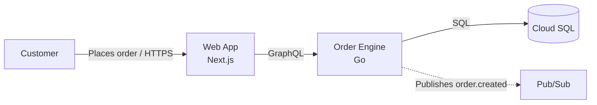

# Export Paths and the Mermaid Fallback

## Getting an image out of the `.drawio`

The spec, validator, renderer, and layout check are plain Python and always run, so the
`.drawio` file and its machine check never depend on tooling. Only the image does. Take the
first path that exists, in this order:

1. **A draw.io MCP tool** in the session (any tool that opens, exports, or edits a
   diagrams.net document). Use it to export PNG or SVG from the rendered file and to open it
   for hand refinement. The `.drawio` on disk stays the source of truth; do not let the MCP
   author shapes from scratch, that bypasses the house style, the legend, and the evidence
   properties.
2. **draw.io Desktop** via `scripts/export_drawio.py` (`DRAWIO_BIN`, then `PATH`, then the
   per-OS install locations). Missing binary: the script exits 1 with an install hint.
3. **Neither available**: deliver the `.drawio` and say so. The specialist's `DIAGRAM:` line
   reads `image: not exported (no draw.io MCP or CLI)`. Never hand-draw SVG or ASCII as a
   substitute; the layout check already proved the picture, the reader opens the file.

## When Mermaid is right

draw.io is the deliverable. Mermaid is correct in exactly three cases:

1. **The diagram has to live inside a file that renders it** — a README, an ADR, a pull
   request description, a Confluence page. Nobody expands a `.drawio` attachment mid-review.
2. **draw.io Desktop is unavailable** and the reader needs a picture now. Write the spec
   anyway, ship the Mermaid, and render the `.drawio` when the CLI is back.
3. **A live interview practice round in chat**, where the candidate is on a whiteboard clock
   and nobody opens a `.drawio` mid-round. Rules in
   `system-design-interview-coaching/references/whiteboard-rules.md`; the model answer after
   the round may go through the pipeline.

Everything else — anything an executive will read, anything that needs official cloud icons,
a legend, a title block, or hand-refinement afterwards — goes through the spec pipeline.

## Rules when you do use it

Same standard, fewer shapes: label every arrow, one level per diagram, expand acronyms,
state the scope and date in the surrounding prose, and mark unproven nodes explicitly since
Mermaid has no UNVERIFIED style.

Dashed means asynchronous here too. Keep the conventions identical across both lanes, or
readers have to learn two visual languages.

## Importing into draw.io

Recent draw.io Desktop can import Mermaid via Arrange > Insert > Advanced > Mermaid, which
converts it to native editable shapes. It is not a shortcut to house style: the result has
no legend, no title block, and no evidence properties, and re-editing the Mermaid source
discards any layout you fixed by hand. Use the renderer instead.
