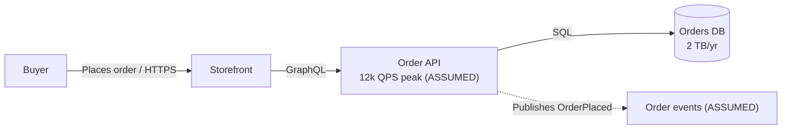

# Whiteboard Rules

A practice round happens in chat, on a clock, and nobody opens a `.drawio` mid-round. The
board is Mermaid. It follows the same visual language as the draw.io house style so the
candidate practises the conventions they will ship.

## What goes on the board per phase

| Phase | Sketch | Never on the board here |
|---|---|---|
| Requirements | bullet list: functional, NFR targets, out of scope, `ASSUMED` | boxes |
| Estimation | a numbers table: QPS avg/peak, storage, bandwidth, shaping quantity | boxes |
| High-level design | one container sketch: client, API, service, store, plus earned boxes | table columns, pod counts |
| Data model | entity list with owner and store, or an ERD sketch | indexes |
| API | signatures: `createOrder(customerId, items[]) -> Order` | request bodies |
| Deep dive | one sequence or dataflow sketch for the riskiest path | a second container sketch |
| Bottlenecks | the container sketch annotated: SPOF marks, the next scaling step | new components |

At most one sketch per phase. Redraw rather than accrete; a board that only grows is the
"everything diagram" anti-pattern in slow motion.

## Mermaid conventions (same as the house style)

- Label every arrow with the protocol or the event: `-->|GraphQL / HTTPS|`.
- Dashed for asynchronous: `-.->|Publishes OrderPlaced|`.
- One level per sketch: no components beside whole systems.
- Expand acronyms on first use.
- Mark unproven boxes: append `(ASSUMED)` to the label; Mermaid has no UNVERIFIED style.
- Put the number on the box when it exists: `API["Order API 12k QPS peak (ASSUMED)"]`.

## After the round: the model answer

- A classic catalog problem (URL shortener, news feed): the model answer stays as Mermaid in
  the debrief. Rendering it adds nothing the candidate can act on.
- A real system behind the practice (the candidate is preparing to design their own): render
  the model answer through `common-architecture-diagramming` so it carries evidence, metrics,
  and a legend, and can be kept.
- Never render the candidate's sketch as if it were confirmed architecture; every box in it
  is `ASSUMED` by definition.
