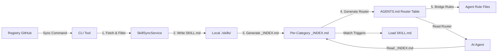
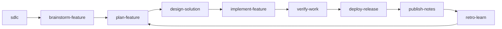

# Architecture & Design Records

This document captures the high-level design, data flow, and key decision records for the `agent-skills-standard` CLI.

## 1. System Overview

The system consists of three main components:

1. **Registry**: A Git repository (or local folder) containing skill definitions (`SKILL.md`) and metadata (`metadata.json`).
2. **CLI**: The setup/sync/validate tool that fetches, validates, and syncs these skills to a project.
3. **Local Project**: The user's codebase where skills and workflows are installed in each agent's native format.

### Data Flow

### Hierarchical Skill Resolution (v2.1+)

AI agents follow a three-step lookup:

1. **AGENTS.md** (~20 lines) — router table maps file extensions to category `_INDEX.md` files.
2. **`_INDEX.md`** (~10-15 lines per category) — tiered trigger table with File Match and Keyword Match sections.
3. **`SKILL.md`** — loaded on-demand only when triggers match.

This replaces the previous flat index (all skills in one list) and reduces scan cost from O(n) to O(1).

## 2. Multi-Agent Compatibility (The "Integration Taxonomy")

This project maintains a standardized bridge for multiple AI agents, each with varying levels of native support for hooks and context injection. The canonical per-agent capability matrix is maintained in `cli/src/capabilities/agentCapabilities.ts` and generated to [docs/agent-capabilities.md](docs/agent-capabilities.md).

| Agent / Tool        | Integration Strategy       | Primary Hook/Config                      | Scope        |
| :------------------ | :------------------------- | :--------------------------------------- | :----------- |
| **VS Code Copilot** | **Prompt Instructions**    | `.github/instructions/*.instructions.md` | Session      |
| **Cursor**          | **MCP + Rules**            | `hooks.json` / `.cursor/rules/`          | Project      |
| **Windsurf**        | **MCP + Rule Persistence** | `.codeium/windsurf/mcp_config.json`      | Project      |
| **Trae**            | **MCP + Rule Persistence** | `.trae/mcp.json`                         | Project      |
| **Roo Code**        | **MCP + Rule Persistence** | `.clinerules` / `.roo/mcp_config.json`   | Project      |
| **Claude Code**     | **Bash Interception**      | `.mcp.json` / `~/.claude/`               | User/Project |
| **Gemini CLI**      | **BeforeTool Middleware**  | `.gemini/settings.json`                  | User/Project |

## 3. SDLC Standards Layer

The registry is a portable standards source, not a daily command runtime. `ags`
initializes, syncs, validates, and wires MCP; users then invoke synced workflows
inside Claude, Codex, Cursor, Gemini, Copilot, Kiro, Antigravity, or another
configured agent.

Canonical lifecycle workflows live in `.agents/workflows`:

Workflow export still follows the agent integration taxonomy:

- Antigravity/Kiro: native markdown workflows
- Claude/Roo/OpenCode: command markdown
- Gemini: TOML commands
- Copilot: prompt files
- Cursor/Trae/Codex: skill folders with `SKILL.md`

Requirement layering is explicit in the SDLC workflow names and outputs:

- `brainstorm-feature` = BRD-lite ("Why")
- `plan-feature` = PRD ("What")
- `design-solution` = SRS/FRS ("How")
- `implementation-readiness` and later phases enforce living traceability updates across BRD-lite -> PRD -> SRS/FRS -> verification evidence
- Core SDLC outputs include an adapter-neutral Outcome Report (`feature_status`, `requirement_trace`, completed evidence, missing evidence, decision needed, recommended next workflow) so runtimes can report whether work is not started, requirements-ready, design-ready, partial, implemented, or blocked without embedding project-specific orchestration concepts.

## 4. Hook-Based Transparency

Inspired by **Rust Token Killer (RTK)**, we aim for a zero-trust, low-overhead context model. This means:

1. **Lazy Loading**: Skills are NOT loaded until a tool call (MCP) or triggered by the router (`AGENTS.md`).
2. **Transparent Interception**: Like RTK's bash hooks, our MCP server aims to intercept file read requests (e.g. `read_file`) and inject relevant skill rules into the output, saving the agent from needing to manually fetch rules.
3. **Token Filtering**: We prioritize high-density information. The `_INDEX.md` model reduces the initial "scouting" tokens by 90% compared to a flat rule list.

## 5. Core Services

### SyncService (`cli/src/services/SyncService.ts`)

The brain of the operation. It orchestrates the synchronization process.

- **Responsibility**: Fetching, filtering/excluding, writing files, generating `_INDEX.md` per category, and generating router-style `AGENTS.md`.
- **Key Dependencies**: `SkillSyncService`, `WorkflowSyncService`, `IndexGeneratorService`, `AgentBridgeService`.
- **Design Principle**: "Ownership Manifest". It classifies every write against `.skills-lock.json` v2, preserves files the user edited, and respects `custom_overrides` in `.skillsrc`.

### IndexGeneratorService (`cli/src/services/IndexGeneratorService.ts`)

Responsible for creating the "Context Bridge" for AI agents. Produces two output formats:

- **Router Index** (`assembleRouterIndex()`): Compact AGENTS.md that maps file extensions to `_INDEX.md` paths (~20 lines).
- **Category Index** (`generateCategoryIndex()`): Per-category `_INDEX.md` with tiered File Match vs Keyword Match sections.
- **Flat Index** (`assembleIndex()`): Legacy flat list format, still used for the registry's own AGENTS.md.
- **Three-Tier Model**: Skills with broad file globs (e.g., `**/*.ts`) are automatically demoted to Keyword Match unless they are the designated `base_language_skills` for that category (defined in `metadata.json`).

### SkillSyncService (`cli/src/services/SkillSyncService.ts`)

Handles fetching and writing skill files from the remote registry.

- **Responsibility**: Downloading SKILL.md + references from GitHub, writing to agent directories, pruning orphaned skills.

### WorkflowSyncService (`cli/src/services/WorkflowSyncService.ts`)

Handles workflow distribution from a single canonical source.

- **Canonical Source**: `.agents/workflows/*.md` remains the authoring surface in this repository.
- **Responsibility**: Fetching canonical workflows from the registry and exporting them into each agent's native invocation format.
- **Export Model**:
  - Antigravity/Kiro: native markdown workflow files
  - Claude/Roo/OpenCode: command markdown
  - Gemini: TOML command files
  - Copilot: prompt files
  - Cursor/Trae/Codex: skill folders (`SKILL.md`)
- **Codex Note**: Codex does not consume `.agents/workflows` directly; it receives transformed workflow skills under `.codex/skills/<workflow>/SKILL.md`.
- **SDLC Note**: Default workflows include the full SDLC spine from `sdlc` through `retro-learn`; teams may sync a subset through `.skillsrc`.
- **Agentic Runtime Note**: Core SDLC workflows emit `Runtime Contract`, `Handoff Payload`, `Blocking Questions`, and `Next Workflow` sections so slash-command agents and channel agents can continue, pause, or delegate with the same artifact shape.

### ConfigService (`cli/src/services/ConfigService.ts`)

Manages the user configuration (`.skillsrc`).

- **Responsibility**: Parsing YAML, validating schema (Zod), and resolving dependency exclusions (e.g. "Don't install React skills if this looks like Vue").

### AgentBridgeService (`cli/src/services/AgentBridgeService.ts`)

Creates agent-specific rule files that point to AGENTS.md.

- **Responsibility**: Generates discovery instructions for each agent (Cursor `.mdc`, Copilot instructions, Claude `CLAUDE.md` protocol, Antigravity/Windsurf/Trae rule files).

### System-Design Diagram Pipeline

System-design methodology owns requirements, capacity, and the HLD → component → LLD → verification trace. Worked production cases stay lazy-loaded under `system-design-case-catalog/references/`; views are selected for a named audience and decision, not as a required checklist.

`common-architecture-diagramming/scripts/` remains the only production renderer. The JSON spec is semantic authority, draw.io is editable presentation, and exported images are derived artifacts. Lifecycle, evidence source kind/confidence, and metric provenance are independent. Compact citation-only nodes remain unverified.

Optional manifests bind scoped views through canonical identities, refinement, ownership, and relationship IDs. Validation reads only bounded regular local files under the manifest directory, compares captured hashes, and reports evidence requiring review without claiming production drift. Generated draw.io content baselines protect manual edits while allowing normal spec updates.

System-design eval assertions are lexical smoke checks. The independent semantic rubric verifies calculations, mechanisms, failure outcomes, and justified simplicity; historical catalog scores are not rewritten to imply unmeasured improvement.

## 6. Token Economy (Design Constraint)

This is a **High-Density** project. Every feature must be evaluated against its impact on the AI's context window.

- **Skill Files**: Must be < 100 lines, averaging ~500 tokens.
- **Router Index**: ~20 lines (~600 tokens) — constant regardless of skill count.
- **Category Index**: ~10-15 lines per category.
- **References**: Heavy content goes to `references/` folder, loaded only on demand.
- **Framework Maps**: Large framework packs may add category-level `references/framework-map.md` for stack-wide routing and official-doc freshness notes without bloating individual `SKILL.md` files.
- **Behavior Guardrails**: Discipline skills may add pressure scenarios, rationalizations, red flags, and behavior assertions in `evals/evals.json`, not by bloating `SKILL.md`.
- **Quality Model**: Treat skill health as four axes: routing accuracy, structural quality, token economy, and behavior-pressure coverage for guardrail skills.

## 7. Metadata Configuration (`skills/metadata.json`)

Registry-level configuration that controls index generation:

- **`file_routing`**: Maps file extensions to skill categories for the router table.
- **`broad_globs`**: List of glob patterns considered "too broad" for auto-triggering (e.g., `**/*.ts`).
- **`base_language_skills`**: One skill per category that keeps the broad glob in File Match. All others are demoted to Keyword Match.
- **`foundational_composite_rules`**: Auto-injected composite triggers based on skill name patterns.
- **`categories`**: Version, tag prefix, and token metrics per category.

## 8. Decision Records

### ADR-001: Local-First Indexing

_Date: 2026-02-07_
**Decision**: `SyncService` should generate the index by scanning the _local_ disk after writing files, rather than using the in-memory list of fetched skills.
**Reason**: This ensures that manual edits or custom local skills created by the user are also included in the index, making the system "User-Extensible" by default.

### ADR-002: Internal Tools Separation

_Date: 2026-02-07_
**Decision**: Documentation scanners and maintenance scripts live in `scripts/` but are NOT bundled into the CLI binary.
**Reason**: Keeps the user-facing CLI binary small and focused.

### ADR-003: Hierarchical Skill Resolution

_Date: 2026-04-04_
**Decision**: Replace the flat AGENTS.md index with a two-level hierarchy: router table + per-category `_INDEX.md` files with tiered trigger sections (File Match vs Keyword Match).
**Reason**: The flat index grew to 238+ entries (~300 lines). LLMs cannot reliably scan a 300-line list to find matching skills. The hierarchical approach reduces scan cost to ~25 lines per lookup regardless of total skill count, and the three-tier model prevents 30+ skills from matching a single file extension.

### ADR-004: Three-Tier Trigger Model

_Date: 2026-04-04_
**Decision**: In `_INDEX.md`, skills are classified into File Match (auto-check against edited file) and Keyword Match (only when user's request mentions the concept). Broad globs are stripped from non-base skills.
**Reason**: Without tiering, editing a `*.ts` file matched 27+ skills simultaneously. With tiering, only 6 genuinely relevant skills match via file pattern. Cross-cutting skills (best-practices, security, performance) activate only when the user explicitly mentions them.

### ADR-005: Standards Registry, Not Command Runtime

_Date: 2026-05-14_
**Decision**: Keep `ags` as a setup/sync/validate tool. Do not add an ECC-style daily command runtime. SDLC workflows are portable repo assets exported into each configured agent's native invocation surface.
**Reason**: The project differentiates through open standards, token-efficient routing, multi-agent sync/export, MCP enforcement, and local customization. Users should own the synced files and invoke them through their existing agent runtime.

### ADR-006: SDLC Workflow Spine

_Date: 2026-05-14_
**Decision**: Ship a compact default SDLC workflow chain: `sdlc`, `brainstorm-feature`, `plan-feature`, `design-solution`, `implementation-readiness`, `implement-feature`, `review-ticket`, `verify-work`, `traceability-audit`, `deploy-release`, `publish-notes`, `session-report`, and `retro-learn`.
**Reason**: Existing workflows covered isolated steps. A visible lifecycle spine makes the repository an SDLC standards layer while preserving token economy through short workflow files and references.

### ADR-007: Specialists Are Native Sub-Agents

_Date: 2026-05-14_
**Decision**: Keep `skills/specialists/*/SKILL.md` as registry source, but sync them directly to native sub-agent folders instead of normal skill folders. Specialists stay compact, budgeted, and focused on one review or automation lens.
**Reason**: Review fanout, Jira/ADO/Zephyr handoffs, traceability, and test generation need role isolation without loading broad skill catalogs into the parent context.

### ADR-008: Immutable v2 Live-Eval Inputs

_Date: 2026-07-11_
**Decision**: Live eval manifests use one shared v2 builder for category and aggregate scopes. A completed run records source hashes and an immutable `inputs.json`; root scripts, the published CLI verifier, and MCP verify against that snapshot. Aggregate reports project the `all` run into category partitions before selecting the newest complete view.
**Reason**: Mutable eval definitions and incompatible aggregate answer paths made historical scores non-reproducible and allowed incomplete or compromised runs to look valid. v1 manifests remain read-only compatible for historical verification.

### ADR-009: Incremental Live-Eval Evidence

_Date: 2026-07-12_
**Decision**: `pnpm evals:baseline` plans normal maintenance runs from the latest complete immutable reference. It creates a selective manifest and copies only compatible evidence: prompt-only answers survive a skill-body change, activation answers survive a body-only change, and assertion-only changes regrade existing transcripts. Changed prompts, descriptions, and activation corpora require fresh applicable answers.
**Reason**: A full catalog run generated 3,220 answers and took roughly 54 minutes. Hash-only invalidation would either rerun too much or reuse the wrong lane. Lane-specific dependency checks preserve reproducibility while making a normal one-skill update practical.

### ADR-010: Outcome-Quality Release Gate

_Date: 2026-07-13_
**Decision**: Keep activation metrics separate from outcome metrics. A skill is
release-ready only when its with-skill case pass rate is strictly above 85%,
with-skill assertion pass rate is at least 85%, outcome delta is non-negative,
and trigger recall and specificity are each at least 90%. Catalog promotion
requires one fresh run with zero reused answers; composite runs remain audit
history only.
**Reason**: Perfect trigger selection does not prove that the loaded skill
produces a correct answer. The previous aggregate report could show 100%
activation while most with-skill cases still failed, so the report and
promotion gate now expose and enforce outcome readiness explicitly.

### ADR-011: SNC Task-Difficulty Routing

_Date: 2026-09-13_
**Decision**: Route autonomy, verification depth, review mode, reviewer fanout,
and model tier by a Spread/Novelty/Centrality score (0-6, summed, never
averaged) rather than by ticket type. `common-task-complexity-routing` owns the
rubric; `specialist-codebase-scout` emits the `SNC:` line; core SDLC workflows
carry `snc_tier` and `model_tier` in their Handoff Payload. `model_tier` is a
runtime-neutral hint (`fast|standard|strong`) that adapters map to their own
model ladder.
**Reason**: "Bug" and "feature" labels say nothing about engineering difficulty.
A one-file typo and a cross-service pricing fix were previously routed through
the same HARD STOP and the same review depth, wasting approval cycles on trivial
work and under-reviewing high-centrality changes.

### ADR-012: Governed Cybersecurity Packages and Evolution

_Date: 2026-09-22_
**Decision**: Add an opt-in cybersecurity category with shared authorization,
evidence and versioned framework mappings; white-team exercise control and
independent adjudication; bounded red-team planning/validation; blue-team
triage/detection/hunting; and paired purple-team validation. Team color does
not determine execution risk. Unsupported host controls block live actions,
not offline analysis.

Treat a skill as a package: preserve binary resources and attribution, reject
incomplete downloads, and stage replacement before changing an installed
package. New eval manifests fingerprint package resources and preserve
immutable input bytes. Legacy evidence remains readable, but cannot substitute
for fresh whole-package evidence at promotion.

Evolution separates observation, redacted proposal, authorized source edit,
held-out comparison, independent review, promotion and rollback. Review names
and hashes are audit data, not authenticated identities or permission grants.
**Reason**: Instructions cannot enforce filesystem/network scope, credential
isolation, cancellation or organizational approval. The registry distributes
standards and verifies artifact integrity; the consuming host and accountable
maintainers must enforce authority. No autonomous self-promotion or production
security efficacy is claimed.

### ADR-013: Decision Discipline and Recorded Approval

_Date: 2026-09-27_
**Decision**: `brainstorm-feature` is one SDLC entry point with a Why lane (solution-free BRD-lite for business operators) and a Direction lane (delivery contract with technical options for technical operators), sized by SNC tier (Quick writes no file). Shared rules live in `common-decision-discipline`, loaded by `brainstorm-feature`, `plan-feature`, `design-solution`, and `system-design-session`: said-vs-assumed write-back, evidence ledger (`confirmed(<path>)`, `assumed`, `unknown`), at most 3 questions per round, option cards only for real choices, and `approval: pending | approved(<who>, <date>) | assumed-autonomous`. `implementation-readiness` blocks `pending`, warns on `assumed-autonomous`, and blocks it only at `tier=high`.
**Reason**: The previous workflow told agents to stay solution-free and to recommend three approaches, never recorded approval before routing on, made unlabeled feasibility claims, and applied a 19-section template to every request. Superpowers and AgentKit showed that right-sizing, grounding, and explicit approval make intake trustworthy without adding questions for small work.

### ADR-014: Single Agent Capability Table

_Date: 2026-09-27_
**Decision**: `cli/src/capabilities/agentCapabilities.ts` (`AGENT_CAPABILITIES`) is the only place per-agent facts live: skill, rule, workflow, specialist, hook, and MCP surfaces plus limits. `getAgentDefinition` is a one-line accessor; `McpConfigService`, `SpecialistTransformer`, and `HookService` read capability fields instead of keeping their own per-agent tables. `docs/agent-capabilities.md` is generated from the table and checked for drift in CI. After sync, each agent's unsupported surfaces are printed once and remembered in `.skills-lock.json` (`disclosed`).
**Reason**: Per-agent behavior was split across four files, so adding or fixing an agent required matching edits in each, and unsupported surfaces were dropped silently. The Codex MCP path bug fixed in T4 came from exactly this split.

### ADR-015: Ownership Manifest and User-Edit Preservation

_Date: 2026-09-27_
**Decision**: `.skills-lock.json` v2 records every whole file `ags sync` writes (skills, workflow exports, specialists, bridge rule files, per-agent `_INDEX.md`) with owner, source, agent, and sha256. Each write is classified against that manifest: new and owned-unchanged files are written; owned files the user edited are kept and reported; files ags does not own are left alone. Files that drop out of the desired set are pruned only when unchanged and only for groups that completed this run, after a backup under `.ags/backups/` (newest 3 kept). `ags sync --dry-run` computes the same plan without touching disk; `--force <path>` overwrites a kept file after backing it up. A v1 lock file is migrated on read; files without a prior record are adopted once during that migration. `ags uninstall` removes only owned-unchanged files (plus MCP entries, hook registrations, and the AGENTS.md index block for `--all`) after a backup; `ags restore` replays a backup (replace-only).
**Packages (reconciled with ADR-012)**: Skill packages are assembled all-or-nothing (every resource, including binary assets and root `LICENSE`/`NOTICE`, must download and pass any release manifest check, or the sync aborts before writing). Hashes are computed over raw bytes. Every path is validated before the first write; files are then written through the ownership manifest one by one instead of replacing the whole package directory, so user-edited and unowned files inside a package survive. A disk failure part-way through a package can leave it mixed; the lock file is not written in that case, and the next sync repairs owned files.
**Managed-path boundary (SEC-01)**: Install writers require the installation root and use `lstat` to reject pre-existing symlink components below it before managed reads, writes, backups, or pruning; skill package resources are preflighted across selected agent destinations before the first package write. Backup destinations under `.ags/` receive the same check. The root itself may be reached through a symlink. These checks do not prevent a concurrent local process from swapping a path component between inspection and the filesystem operation; host permissions and isolation remain the boundary for that race.
**Reason**: Sync previously overwrote user edits silently, recorded only skills, and could not safely prune or uninstall workflows, specialists, or bridge files. AgentKit's ownership model (replace unchanged, preserve modified, never adopt unknown) makes lifecycle operations safe without new prompts.

### ADR-016: Pinned SDLC Assets and Release Manifests

_Date: 2026-09-27_
**Decision**: Workflows and specialists are fetched from release tags (`workflows_ref`, `specialists_ref` in `.skillsrc`, written once from the registry's latest release when absent) instead of the default branch. Every source ref is resolved to a commit and recorded in `.skills-lock.json` `sources`; a tag that later resolves to a different commit is reported. Releases publish `MANIFEST.json` (sha256 per file) with a build-provenance attestation; `ags sync` rejects downloaded files that do not match a release's manifest, and `ags verify --attestation` checks the attestation with the GitHub CLI. `ags verify --strict` fails when any locked ref has moved.
**Reason**: Pinning categories did not pin workflows or specialists, so two installs from the same `.skillsrc` could differ, and the only integrity check (git blob SHA from the same API) protected transport, not the release.

### ADR-017: Warning-First Policy Layer

_Date: 2026-09-28_
**Decision**: Machine-checkable project policy rules live in `.ags/policy.json` (`schema_version: 1`), covering three rule kinds: `protected_path` (`paths`, action `block | warn`), `command` (`executables`, action `block | warn | rewrite`, `rewrite_to`), and `required_check` (`when_changed`, `checks`, action `block | warn`). `ags policy compile` scans project agent docs (`AGENTS.md`, `CLAUDE.md`) line-by-line to propose rules into `.ags/policy-candidates.json`; compiled rules can only `warn` or `rewrite` (never `block`). `ags policy adopt <id...>` activates candidate rules into `.ags/policy.json` after conflict validation. The PreToolUse hook (`HookService`) reads `.ags/policy.json` dependency-free; `block` rules only block when `AGS_HOOK_ENFORCE=1` is set (e.g. `ags hooks install --enforce`), otherwise issuing warnings (warning-first). The MCP server surfaces policy rules advisory-only next to loaded skills. `AGS_POLICY_BYPASS=1` turns decisions into `allow` and reports waived rules. Policy prevents mistakes by cooperating agents; it is not a security boundary.
**Reason**: Agent instructions in markdown files (`AGENTS.md`, `CLAUDE.md`) are advisory and frequently ignored or forgotten during multi-step tasks. Turning deterministic rules into machine-checkable policy enables early warning and hook/MCP enforcement without introducing disruptive hard blocks by default or treating cooperating AI agents as malicious adversaries.
