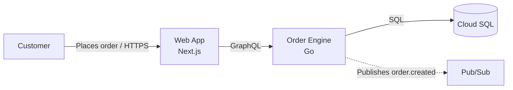

# Mermaid Fallback

draw.io is the deliverable. Mermaid is correct in exactly two cases:

1. **The diagram has to live inside a file that renders it** — a README, an ADR, a pull
   request description, a Confluence page. Nobody expands a `.drawio` attachment mid-review.
2. **draw.io Desktop is unavailable** and the reader needs a picture now. Write the spec
   anyway, ship the Mermaid, and render the `.drawio` when the CLI is back.

Everything else — anything an executive will read, anything that needs official cloud icons,
a legend, a title block, or hand-refinement afterwards — goes through the spec pipeline.

## Rules when you do use it

Same standard, fewer shapes: label every arrow, one level per diagram, expand acronyms,
state the scope and date in the surrounding prose, and mark unproven nodes explicitly since
Mermaid has no UNVERIFIED style.

Dashed means asynchronous here too. Keep the conventions identical across both lanes, or
readers have to learn two visual languages.

## Importing into draw.io

Recent draw.io Desktop can import Mermaid via Arrange > Insert > Advanced > Mermaid, which
converts it to native editable shapes. It is not a shortcut to house style: the result has
no legend, no title block, and no evidence properties, and re-editing the Mermaid source
discards any layout you fixed by hand. Use the renderer instead.
