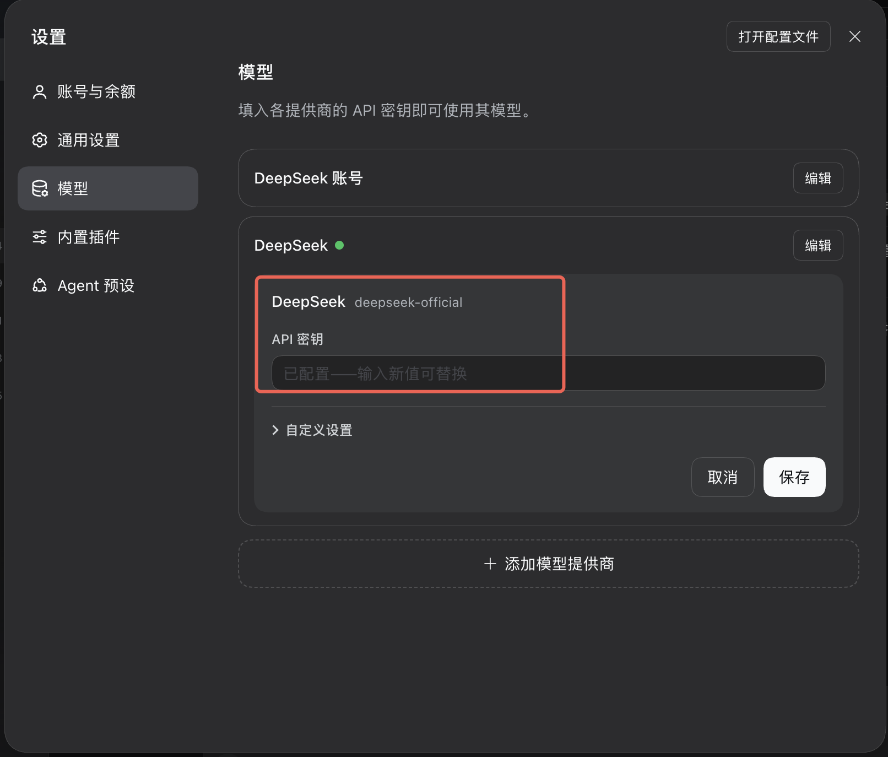

# DeepSeek Harness (dsh)

> agentSource: `dsh` | 协议: **Anthropic Messages** (v0.2+) / OpenAI Chat (v0.1.x)
>
> 本地历史导入 Memory Hub：见 [资产导入手册](./asset-import.md)。

> ⚠️ **2026-09-29 大改**:dsh v0.2.0-rc.1 起换 adapter 协议 + 换配置入口。
> 老 `~/.dsh/settings.yaml` 那套姿势(dsh v0.1.x + setup-proxy.sh)**已作废**,
> 详见下面第 1 节。

---

## 0. dsh v0.1 → v0.2 迁移(2026-09-29 起)

### 0.1 配置纵向对比

同一件事在 dsh 两个大版本下写法完全不同,老 setup-proxy.sh 生成的一套在 v0.2 里
**根本 boot 不起来**(loader 不认 settings.yaml 那种 shape,plugin id 也换名了)。

| 项 | dsh v0.1.x(老) | **dsh v0.2+(现在)** |
|---|---|---|
| 配置入口文件 | `~/.dsh/settings.yaml`(top-level plugin 段) | `~/.dsh/profiles/web/cordis.patch.yml`(loader patch 数组) |
| Plugin id | `@deepseek-ai/dsh-llm-deepseek` | `@deepseek-ai/dsh-llm-deepseek-api-key` |
| 上游协议 | OpenAI Chat Completions | **Anthropic Messages** |
| 请求端点 | `${baseURL}/chat/completions`(不带 /v1) | `${baseURL}/v1/messages`(必带 /v1) |
| Anthropic 头 | 无 | `anthropic-version: 2023-06-01` 固定发 |
| 用户输入载体 | `content: string`(裸文本) | `content: [{type:"text",text}, ...]`(anthropic block array) |
| Tool result 载体 | `role:"tool" + tool_call_id`(消息级) | `role:"user" + content[].type:"tool_result"`(block 级) |
| Credential 存法 | settings.yaml 平铺 | `~/.dsh/.credentials.yaml` 的 `refs:` 段(chmod 600 硬要求) |
| build 要求 | npm install 即可 | 建议 `git pull && pnpm install && pnpm run build`(rc 版本迭代快) |

### 0.2 proxy 侧配套修复(2026-09-29 → 09-30 落地)

上面第一类是 dsh 上游改动。第二类是 **proxy 侧支持没跟上**,只有第一类改对了、dsh
v0.2 真实请求打进 proxy 后才暴露。这轮一共修 5 个坑,已在
`team-proxy@develop_server_team`:

| # | 位置 | 症状 |
|---|---|---|
| 1 | `src/session/dsh/form.ts` | 只有 openai SSE builder,anthropic 客户端解不出 form |
| 2 | `src/session/dsh/form.ts` | ASSET_CONFIRM_YES 半角逗号,和 CB extractor 全角对不上 → 选完循环弹表单 |
| 3 | `src/session/codebuddy/cleaner.ts` | 只认 openai `role:"tool"+tool_call_id`,不认 anthropic `role:"user"+tool_result` → team/agent/task 阶段答复读不出 |
| 4 | `src/agent-adapters/dsh.ts` | `extractUserText` 只接受 string,不认 anthropic content block array → mem 命令识别不出 |
| 5 | `src/anthropicHandler.ts` | 3 处 `buildMemResponse` 返回点漏套 `maybeFixDshStreamTail` → dsh 严格 parser 报 `STREAM_CLOSED` |

第 3、4、5 是 dsh 复用 CB 状态机链上的边缘,proxy 老代码假设 openai wire shape;
现在都补了 anthropic 分支。CC/CB/WB/opencode/codex 完全零影响。

### 0.3 从 v0.1 迁移到 v0.2 的 3 步

1. **拉最新 dsh**:`cd deepseek-harness && git pull && pnpm install && pnpm run build`(至少 `v0.2.0-rc.1`)
2. **备份 + 换配置**:
   ```bash
   TS=$(date +%Y%m%d_%H%M%S)
   cp ~/.dsh/settings.yaml    ~/.dsh/settings.yaml.bak.$TS 2>/dev/null   # 老姿势备份
   cp ~/.dsh/.credentials.yaml ~/.dsh/.credentials.yaml.bak.$TS
   # 按 §1.1 / §1.2 重写 cordis.patch.yml + .credentials.yaml refs 段
   ```
3. **proxy 侧至少到 develop_server_team @2026-09-30**(含上表 5 个 fix)。老 proxy 版本
   跑 dsh v0.2 会依次踩:表单解不出 → 循环弹表单 → 答复读不到 → mem 不生效 → mem 报 STREAM_CLOSED。

---

## 1. 客户端接入配置(dsh v0.2+)

dsh v0.2 起把配置入口从 `~/.dsh/settings.yaml` 迁到 **profile 目录**下的 cordis
patch,并把 credential 单独存到 `~/.dsh/.credentials.yaml`。plugin 内部 id 也从
`dsh-llm-deepseek` 换成 `dsh-llm-deepseek-api-key`(默认 login 变体)。

### 1.1 profile patch 文件

`~/.dsh/profiles/web/cordis.patch.yml`(profile 名默认 `web`,`dsh web` 启动时用):

```yaml
- id: llm-deepseek
  name: "@deepseek-ai/dsh-llm-deepseek-api-key"
  config:
    apiKeyEnv: PROXY_USER_KEY
    # ⚠️ 不带 /v1 —— dsh anthropic adapter 内部拼 `${baseURL}/v1/messages`
    # 见 dsh 源码 packages/llm/llm-deepseek/src/messages-api.ts:14-17
    baseURL: http://<proxy-host>:8096/dsh/<spaceId>
    reasoningEffort: high
    models:
      - id: deepseek-v4-pro
        name: DeepSeek V4 Pro
        contextWindow: 128000
        maxTokens: 8192

- id: agent-default-model
  name: "@deepseek-ai/dsh-agent-default-model"
  config:
    provider: deepseek-official
    model: deepseek-v4-pro
    reasoningEffort: high
```

### 1.2 credential 文件

`~/.dsh/.credentials.yaml`(权限硬要求 chmod 600):

```yaml
version: 1
refs:
  PROXY_USER_KEY: <你的业务 user_key,从平台获取>
```

### 1.3 权限硬要求(dsh 启动时校验)

```bash
chmod 700 ~/.dsh
chmod 600 ~/.dsh/.credentials.yaml
```

### 1.4 请求路径

**dsh v0.2+ 走 Anthropic 协议**,adapter 硬编码 `${baseURL}/v1/messages` +
`anthropic-version: 2023-06-01` header(源码 `packages/llm/llm-deepseek/src/adapter.ts:120-131`)。
proxy 侧命中:

- `POST /dsh/:spaceId/v1/messages` ← dsh v0.2+ 主路径
- `POST /dsh/:spaceId/v1/messages/count_tokens` ← 辅助端点

老 openai 路径(仅 dsh v0.1.x 用户)也保留兼容:
- `POST /dsh/:spaceId/v1/chat/completions`
- `POST /dsh/:spaceId/chat/completions`

### 1.5 启动 & 验证

```bash
cd /path/to/deepseek-harness
git pull                 # 至少到 v0.2.0-rc.1(2026-09 起)
pnpm install && pnpm run build
pnpm dsh web --no-open --port 3081 --host 127.0.0.1
# → dsh web: http://127.0.0.1:3081/?token=xxx
```

浏览器打开该 URL,发一句 "hi",proxy 会返回 session-init 表单(见第 3 节)。

---

## 1.6 桌面版客户端配置(DeepSeek Harness Desktop)

> 2026-10-08 实测:dsh 桌面版 `0.2.1-alpha.1`(Electron 壳 + Node Host 子进程)在 LLM
> 协议层与 CLI/Web 版 **100% 等价** —— `packages/llm/*` 代码共用,Electron 外壳不参与
> 任何 LLM 出站 fetch。所以 **proxy 零改动即可支持桌面版**,只是 UI 配置入口需要走对。

### 1.6.1 配置入口有三种,只能走第二种

桌面版「设置 → 模型」页面里针对 DeepSeek 一类 provider 展示 **三张卡**:



| 卡片 | 内部 plugin | 协议 | header | **proxy 适配状态** |
|---|---|---|---|---|
| ① DeepSeek 账号 | `@deepseek-ai/dsh-llm-deepseek-account` | Anthropic Messages | 不带 `x-deepseek-harness-session-id`(走账号 token 透传,不是我们的接入形态) | ❌ 不适用 |
| ② **DeepSeek (deepseek-official)** ← 红框 | `@deepseek-ai/dsh-llm-deepseek-api-key` | Anthropic Messages | **全套 `x-deepseek-harness-*` 头齐全**(user-id / session-id / compact) | ✅ **只配这一张** |
| ③ 自定义设置 / 添加模型提供商 | `@deepseek-ai/dsh-llm-pi-ai` | OpenAI Chat / Responses / Anthropic 三选一 | ⚠️ **不带任何 `x-deepseek-harness-*` 头**(pi-ai adapter 把它们过滤掉了) | ❌ session_id 丢失 → proxy session-init form 弹不出 |

### 1.6.2 为什么只能走第二种(wire 判据)

桌面版和 CLI/Web 一样,**只有走 `llm-deepseek-api-key` adapter(即「DeepSeek deepseek-official」卡)时,
请求 header 才会带全套 dsh 识别信号**:

```http
POST /dsh/<spaceId>/v1/messages HTTP/1.1
authorization: Bearer <proxy user_key>
anthropic-version: 2023-06-01
x-deepseek-harness-user-id: <匿名 UUID>
x-deepseek-harness-session-id: session-<uuid>      ← ★ proxy session-init 的入口判据
x-deepseek-harness-compact: 1                      ← compaction 请求才带
user-agent: deepseek-harness/0.2.1-alpha.1 (+...)
```

走第三张「自定义设置」卡的话,底层是 `llm-pi-ai` adapter(源码
`packages/llm/llm-pi-ai/src/adapter.ts:204-212`),它的 `requestHeaders`
**只保留 attribution header,把所有 `x-deepseek-harness-*` 系列过滤掉**。于是 proxy 侧:

- `conversationId=null` → `sessionInit` 条件 `conversationId && !isAuxiliary` 不满足
- → `injectedSkipped=true` → 整个 session-init form **永远弹不出来**
- → 全程 passthrough,注入 / 归档 / mem 命令全部跳过

跟 CLI 侧「不要在 `~/.dsh/profiles/web/cordis.patch.yml` 里挂 pi-ai plugin」是同一个坑。

### 1.6.3 配置步骤

1. 点击红框卡上的「**编辑**」按钮
2. **API 密钥**:填平台发给你的 `user_key`(与 CLI 侧 `.credentials.yaml` 里的 `PROXY_USER_KEY` 完全同一个 key)
3. **展开「自定义设置」**(默认折叠),填 baseURL:
   ```
   http://<proxy-host>:8096/dsh/<spaceId>
   ```
   - ⚠️ **不要带 `/v1`** —— dsh anthropic adapter 内部拼 `${baseURL}/v1/messages`(源码
     `packages/llm/llm-deepseek/src/messages-api.ts:14-17`),带了会 double 成 `/v1/v1/messages`
   - `<spaceId>` 填平台分配的 memory 实例 id(通常 `default` 或 `mem-<...>`)
4. 点「**保存**」

### 1.6.4 验证

发一句 "hi",proxy 应该弹出 `ask_user_question` 表单。看 proxy 日志:

```
[identity] userId=... keyId=... custom=[x-api-key,x-deepseek-harness-session-id,x-deepseek-harness-user-id]
[injection-debug] conversationId=session-<uuid> sessionKey=session-<uuid>
                  agentSource=dsh kind=main dshHeadless=false
                  sessionInitEnabled=true injectedSkipped=false ✓
pipeline.forward.start upstream=https://api.deepseek.com/anthropic/v1/messages
pipeline.forward.done status=200
```

关键字段:
- `custom=[...x-deepseek-harness-session-id,x-deepseek-harness-user-id]` ← 走对入口才有
- `agentSource=dsh` ← 路径段 `/dsh/<spaceId>` 判出
- `injectedSkipped=false` ← session-init 条件满足,form 会弹

反例(走第三张「自定义设置」卡时):

```
[identity] custom=[x-api-key,x-stainless-arch,x-stainless-lang,...]   ← pi-ai 的 header,无 dsh 系列
agentSource=dsh injectedSkipped=true                                   ← ★ form 不弹
```

### 1.6.5 桌面 vs CLI/Web 其他差异

**对 proxy 完全透明**(调研出处:`docs/dsh-recon/2026-10-08-dsh-desktop-verification`):

| 维度 | 桌面 | CLI/Web | proxy 影响 |
|---|---|---|---|
| 内置 tool 集合 | Web 全部 + `load_workspace_dependencies` + 3 Office skill | 没有后面几个 | ❌ 无 |
| 首帧 overlay(welcome/credit/purpose/process/done 5 步) | ✅ 有 | ❌ 无 | ❌ 纯 UI 不发 LLM |
| OTEL product-analytics | 默认开 | 默认关 | ❌ 不是 LLM 请求 |
| LLM wire 协议 / header / aux 请求 | 和 CLI 100% 一样 | — | ✅ 零差异 |

### 1.6.6 proxy 侧配套

桌面版默认不会把请求打到 `copilot.tencent.com` —— deepseek-official 走的是
`https://api.deepseek.com/anthropic`。所以 `proxy-service.config.yaml` 的 `upstream.agents` 里
**必须给 `dsh` 显式配 upstream**,否则会 fallback 到外层默认的 `/v2` 返 404(2026-10-08 实测):

```yaml
upstream:
  agents:
    dsh:
      # dsh v0.2+ llm-deepseek-api-key adapter 走 Anthropic Messages,
      # proxy anthropic joinUrl 自动补 /v1 → .../anthropic/v1/messages
      url: https://api.deepseek.com/anthropic
      apiKey: sk-<deepseek 官方 key>   # 配了 apiKey → proxy 覆盖客户端 Bearer 再转发
```


## 2. Session ID

| 优先级 | Header |
|--------|--------|
| 1 | `x-deepseek-harness-session-id` |
| 2 | `x-session-id` |

**发这个 header 的条件**(dsh 源码 `packages/llm/llm-deepseek/src/adapter.ts:129`):
调用方(agent loop)传了 `options.sessionId` 才发,`undefined` 就不发。dsh Web UI
主对话正常每轮都会传,`title-gen` / `compaction` 等辅助请求也会带上(compaction 场景
还带 `x-deepseek-harness-compact: 1`)。

⚠️ **陷阱**:如果 baseURL 配到 `/claude-code/<spaceId>`(蹭 CC 路由)而不是
`/dsh/<spaceId>`,proxy 会按 `agentSource=claude-code` 走 CC 的 form/extractor 分支,
`ask_user_question` schema 对不上导致客户端报 "unknown tool"。永远走独立的 `/dsh/*`。

---

## 3. Session Init(会话初始化 / Form)

### 3.1 机制

dsh 官方在 preset 场景(web-app / cordis / standard 等)自动挂
`@deepseek-ai/dsh-tool-ask-user`(源码 `packages/interaction/tool-ask-user/src/index.ts`),
给主对话 tools 数组加一个 `ask_user_question` 工具。proxy 直接复用这个原生 tool 名
造假 tool_use SSE:

- Tool name: **`ask_user_question`**(snake_case,与 CC 的 PascalCase `AskUserQuestion` 完全不同)
- Tool call id prefix: `call_dsh_session_init_`
- 传输:**Anthropic SSE**(v0.2+,`message_start → thinking → tool_use → message_stop`),
  or OpenAI chat.completion.chunk(v0.1.x 兼容,由 `FormData.protocol` 分派)

### 3.2 ask_user_question schema(dsh 硬约束,与 CC 不兼容)

```jsonc
{
  "questions": [
    {
      "id": "asset_confirm",       // ← dsh 必填,echoed in answer
      "question": "本次对话是否要关联团队资产?",
      "header": "关联资产",
      "options": [
        { "label": "是，关联团队资产", "description": "..." },
        { "label": "否，本次不关联",   "description": "..." }
      ],
      "multi_select": false          // ← snake_case,不是 multiSelect
    }
  ]
}
```

tool_result 回传(dsh 客户端 anthropic 协议下塞在 `role:"user"` 的
`content[]` 里 `type:"tool_result"` block):
```jsonc
{
  "answers": [
    { "id": "asset_confirm", "selected": ["是，关联团队资产"], "custom": "..." }
  ]
}
```

`selected[]` 是**选中的 option label 字符串数组**(不是索引)。`custom` 是用户在
"Other" 里输入的自由文本(含 skip 关键字兜底判据)。

### 3.3 状态机

复用 CB 状态机(`src/session/codebuddy/init.ts`):

```
uninitialized → pending_asset_confirm → pending_team_select →
pending_agent_task → (可选)pending_task_select → initialized
```

- CB / WB / dsh / opencode / codex 共用这条状态机
- 差异(form shape / 传输协议 / tool 名)在 `src/session/index.ts` 里按
  `agentSource === "dsh"` 分支重渲染 `result.response`
- dsh 独立文件在 `src/session/dsh/`(form.ts / __tests__/)

### 3.4 分页

dsh 的 `ask_user_question` UI **无 options 数量上限**(源码
`packages/interaction/tool-ask-user/src/index.ts` + UI QuestionComposer 都直接 map
渲染),因此 dsh form **不分页**,team/agent/task 全量塞。对比:CC 硬限 ≤4 options
必须分页。

### 3.5 Headless Bypass

dsh 有独特的 headless bypass:

- 检查 `body.tools` 数组
- 如果非空但**不包含** `ask_user_question` → proxy 判定 headless,完全跳过 session-init 直接透传

允许 dsh 在 API 直调 / batch 模式(有自定义 tools 但没交互 tool)正常工作。

### 3.6 thinking block 必填(anthropic 分支)

DeepSeek 官方 anthropic 兼容端点在 thinking mode 下**硬校验**历史 assistant 必须
带 `thinking` block,否则 400 `The content[].thinking in the thinking mode must be
passed back to the API`。proxy 生成的假 session-init 响应(Anthropic 分支)会无
条件 emit 一个空 thinking + placeholder signature block,详见
`src/session/dsh/form.ts` 的 `THINKING_SIGNATURE_PLACEHOLDER` 注释。

OpenAI 分支同款问题走 `reasoning_content` placeholder(见同文件 `REASONING_PLACEHOLDER`)。

### 3.7 跳过 Session Init

三种方式:
1. Headless bypass(tools 中无 `ask_user_question`)→ 自动跳过
2. 用户输入 "跳过" / "skip" 走 `custom` 字段
3. 在 asset_confirm 选"否，本次不关联"

---

## 4. 请求分类

dsh 使用独立的分类逻辑(`src/agent-adapters/dsh.ts`):

| 类型 | 识别方式 | 处理 |
|------|----------|------|
| **compact** | `x-deepseek-harness-compact: 1` header | 辅助请求,跳过注入 |
| **title-gen** | Body 特征三合一:无 tools + thinking.disabled + max_tokens≤128 + system 以 "Create a concise title..." 开头 | 辅助请求,跳过注入 |
| **main** | 其他所有 | 完整链路 |

---

## 5. 用户文本提取

dsh 消息 content 通常是**纯字符串**(user 直接输入)或**anthropic content block 数组**
(user 消息里带 tool_result 时)。cleaner 优先扫 `tool_use_id` 匹配
`call_dsh_session_init_` 前缀的 tool_result block,fallback 到最后一条 user 消息的
text block。见 `src/session/codebuddy/cleaner.ts` `getLastUserMessageText`。

---

## 6. 注入 Profile

session-init 完成后,proxy 会在 anthropic 请求的 `system` 段末尾追加:

```xml
<agent_skills>...</agent_skills>
<user_memory>...</user_memory>
<session_context>...</session_context>
<available_skills>...</available_skills>
<tdai_profile_memory>...</tdai_profile_memory>
```

注入点:anthropic `body.system`(dsh v0.2+)。老 openai 分支注入 `messages[0].content`
(system message 字符串内追加,dsh v0.1.x 兼容)。

---

## 7. 特殊行为

- **协议**:v0.2+ = **Anthropic Messages**(硬发 `anthropic-version: 2023-06-01`);
  v0.1.x = OpenAI Chat。由 dsh 上游 adapter 决定,proxy 侧根据请求路径
  `/v1/messages` vs `/v1/chat/completions` 分派到 `handleAnthropicMessages` 或
  `handleChatCompletions`
- **Handler**:v0.2+ 走 `src/anthropicHandler.ts`(和 CC 共享);v0.1.x 走
  `src/handler.ts`(和 CB 共享)
- **Client 指纹 Header**:
  - `user-agent: deepseek-harness/*`
  - `x-deepseek-harness-user-id`(无条件发,匿名 id 或登录账户 id)
  - `x-deepseek-harness-session-id`(有 `options.sessionId` 才发)
  - `x-deepseek-harness-compact: 1`(compaction 场景)
- **Thinking mode**:assistant 消息带 `thinking` block(anthropic) 或 `reasoning_content`
  字段(openai),proxy fake session-init 响应必须匹配上游硬校验(见 3.6)
- **ask_user_question schema 与 CC 完全不兼容**:tool 名蛇形、必填 id、返回 array
  (见 3.2)

---

## 8. 归档触发

- 与 CB / CC 共享归档机制(anthropicHandler / handler 都调 `triggerArchiveHooks`)
- 对话超阈值自动 `skill/conversation/add`
- 支持 `skill/conversation/force-archive`

---

## 9. 环境变量

无 dsh 专属变量。上游路由由 proxy `config.upstream.url` + instance upstream v2 决定
(一般指向 DeepSeek anthropic 兼容端点 / tokenhub)。

---

## 10. 常见问题

**Q: 客户端报 `unknown tool "AskUserQuestion"` 是什么原因?**
A: dsh v0.2 只识别 snake_case `ask_user_question`,不认 CC 的 PascalCase
`AskUserQuestion`。检查 baseURL 是否配到了 `/dsh/<spaceId>`(而不是 `/claude-code/<spaceId>`),
proxy 才会走 dsh form builder 造对的 tool 名。

**Q: 会话初始化一直循环弹「关联资产?」表单?**
A: 三个可能:
1. Redis 里有老 pending_asset_confirm 状态卡住 → 新开一个 dsh 会话
2. proxy 版本太老 → 至少 develop_server_team @2026-09-29 后的 dsh anthropic 补丁
3. dsh baseURL 走了 `/claude-code/*` 导致 agentSource 识别成 CC → 换成 `/dsh/*`

**Q: dsh 和 CB 共享状态机,dsh 会话会串到 CB 那边吗?**
A: 不会。状态机代码是共用的(一套 CB init.ts),但 session key 里包含 `agentSource`
前缀(`dsh:<sid>` vs `codebuddy:<sid>`),Redis 里完全独立。

**Q: dsh headless bypass 什么时候触发?**
A: `body.tools` 非空但不包含 `ask_user_question` 时。典型场景:dsh 在 API 模式
直调(自定义 tools 但无用户交互)。

**Q: 为什么 dsh 需要 thinking / reasoning_content 占位?**
A: DeepSeek 官方 anthropic/openai 兼容端点在 thinking mode 下对 assistant 消息硬
校验 —— 必须有 thinking block / reasoning_content 字段。proxy 生成的 session-init
form 响应也是 assistant 消息,必须带上此字段(值可为空/占位,内容对模型无影响,
因为 fake session-init 不真过模型)。

**Q: 我用的还是 dsh v0.1.x + 老 `~/.dsh/settings.yaml`,还能通吗?**
A: 能。proxy 侧保留了 OpenAI 分支(FormData.protocol 未指定或 "openai" 时走
openai chat.completions SSE builder)。但强烈建议升级 dsh 到 v0.2+ 走 anthropic
协议,那是官方主推方向。

**Q: 客户端报 `DeepSeek Messages stream ended before message_stop / STREAM_CLOSED`?**
A: dsh v0.2 `llm-deepseek-api-key` adapter 的 SSE parser(源码
`packages/llm/llm-deepseek/src/translate.ts:165`)严格判 `\n\n` 结束 event,
proxy 的 mem-command shared response builder 老实现末尾只补一个 `\n`(CC /
Anthropic 官方 SDK parser 宽松不炸,dsh 严格实现就炸)。修法:`anthropicHandler.ts`
的 `maybeFixDshStreamTail` wrapper 只给 `agentSource==="dsh"` 的 stream 响应后补一个
`\n`,shared builder 一根字节不动 —— CC / CB / WB / opencode / codex 零影响。
若升到 develop_server_team @2026-09-30 后仍出现,`grep -n maybeFixDshStreamTail
src/anthropicHandler.ts` 检查该 wrapper 是否覆盖到你踩的那条 `buildMemResponse`
返回点(目前 4 处调用点全覆盖:预拦截 unsupported / 主 mem-command / session
未初始化 / _resetFlowResult 确认响应)。

---

## 11. 与 Claude Code / CodeBuddy / Codex 的差异

| 维度 | Claude Code | CodeBuddy | Codex | **dsh v0.2+** | dsh v0.1.x |
|---|---|---|---|---|---|
| 协议 | Anthropic Messages | OpenAI Chat | OpenAI Responses | **Anthropic Messages** | OpenAI Chat |
| 配置文件 | 环境变量 | `~/.codebuddy/models.json` | `~/.codex/config.toml` | **`~/.dsh/profiles/web/cordis.patch.yml`** + `.credentials.yaml` | `~/.dsh/settings.yaml` + `.credentials.yaml` |
| plugin id | — | — | — | **`@deepseek-ai/dsh-llm-deepseek-api-key`** | `@deepseek-ai/dsh-llm-deepseek` |
| URL 前缀 | `/claude-code/<spaceId>` | `/codebuddy/<spaceId>` | `/codex/<spaceId>` | **`/dsh/<spaceId>`** | `/dsh/<spaceId>` |
| URL 拼接 | `${base}/v1/messages` | `${base}/v1/chat/completions` | `${base}/v1/responses` | **`${base}/v1/messages`** | `${base}/chat/completions`(不带 /v1) |
| Key 传递 | env `ANTHROPIC_AUTH_TOKEN` | JSON `apiKey` | TOML `experimental_bearer_token` | `.credentials.yaml refs.<name>` | `.credentials.yaml refs.<name>` |
| Session init | 自动弹表单 | 自动弹表单 | 首次需切 Plan 模式 | **自动弹表单** | 自动弹表单 |
| UI 表单 tool | `AskUserQuestion`(PascalCase) | `ask_followup_question` | fake `function_call` | **`ask_user_question`**(snake_case) | `ask_user_question` |
| tool schema id | 无 | 无 | 无 | **必填,echoed** | 必填,echoed |
| tool_result 载体 | `role:"user"+tool_result block` | `role:"tool"+tool_call_id` | `function_call_output` in body.input | **`role:"user"+tool_result block`** | `role:"tool"+tool_call_id` |
| answers 结构 | `{q:label}` map | `{q:label}` map | function_call_output | **`[{id,selected:[],custom?}]` array** | `[{id,selected:[],custom?}]` array |
| thinking 占位 | anthropic `thinking` block + signature | 无 | 无 | **anthropic `thinking` block + signature** | openai `reasoning_content` 字符串 |

---

## 12. 当前状态

- ✅ dsh v0.2+ anthropic 分支代码实现完成(2026-09-29 修 5 处 bug 落地)
- ✅ dsh v0.1.x openai 分支保留兼容(FormData.protocol 分派)
- ✅ 本地 proxy(:8096) + dsh web(127.0.0.1:3081)端到端验证通过
- ⚠️ 生产环境暂未大规模验证
