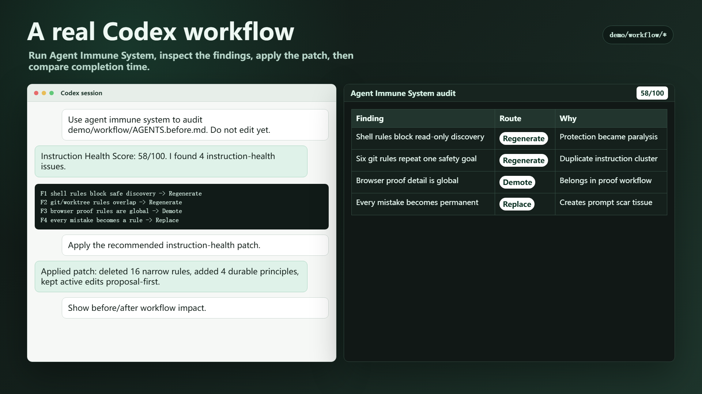
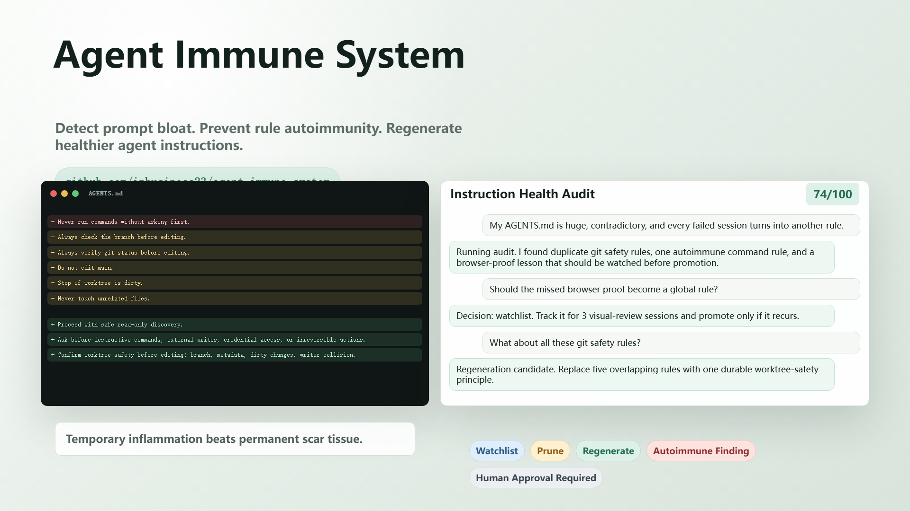
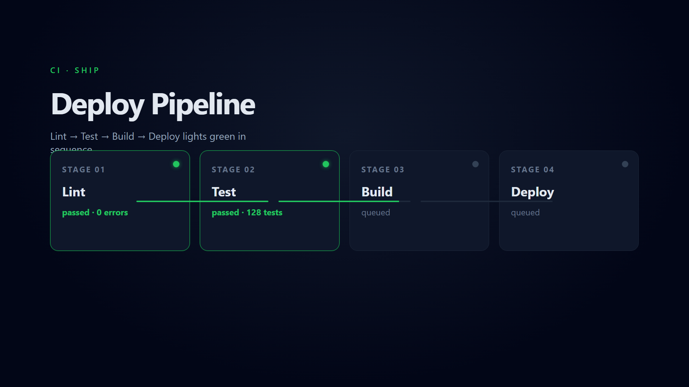
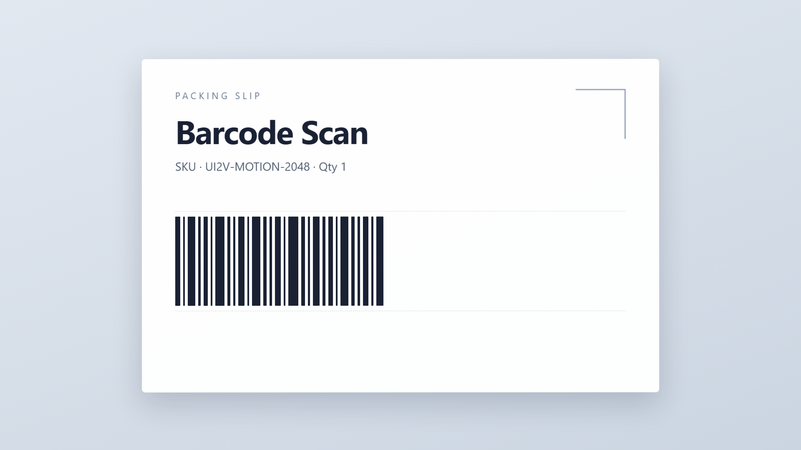

# ui2v-motions

> UI2V 动效库 —— 1,262 个 GSAP 动效包全量离线镜像，演示动画画面层的即插即用素材库

## 简介

ui2v.com（UI-to-video 动效社区）背后 `illli-studio/motions` 仓库的**全量本地镜像**（2026-10-05，9,669 文件 / 641MB，完整性校验零缺失）：**1,262 个动效包**，每个包 = 单文件 HTML + 一条 **paused 的 GSAP 时间轴**（1920×1080 为主，共 1,150 个）。这个"默认暂停"不是缺陷——节奏完全由调用方决定，恰好与自建演示底盘（虚拟时钟 / cue 时间轴 / 可冻结）同构，是给视频演示页、产品页、落地页"画面层"挑现成高质量动效的素材库。

覆盖图表入场、列表滚动、卡片翻转、文字编排、数字滚动、时间线展开、背景循环等 25 大类用途，配套**按"你要讲什么"查件**的用途总览与母版映射索引。

## 核心机制

| 机制 | 说明 |
|------|------|
| **1,262 动效包** | `01_动效库/itelmn/<slug>/`：registry-item.json（元数据）+ index.html（paused GSAP 时间轴）+ assets；1,150 个 1920×1080，112 个竖屏排除 |
| **选型索引** | `03_清单与索引/`：镜头用途总览（25 类 + 1,262 条用途表）、CSV 全量清单（可编程筛）、母版映射（N1–N19/W1–W4 分组短名单）、结合分析（方案+代码+红线） |
| **接入配方** | 摘画面层 + 暂停时间轴挂 cue：`TL.time(p*duration)` 整段映射摊进口播时长，或按口播逐句 `TL.time(秒)` 拆拍 |
| **官方 CLI** | `02_官方CLI与文档/`：ui2v CLI 源码 + 官方 Skill + 中英双语文档 |
| **预览副本** | `04_预览/`：autoplay 注入版双击即播（空格暂停 / r 回零） |

## 使用方式

```
我要做一个产品发布演示页，中间需要一段"三个方案对比"的动效——从 ui2v-motions 里按用途挑 2-3 个
1920×1080 的候选包给我看效果，然后把选中的接入我的 cue 时间轴
```

```
把 demo/shot-03 的列表入场换成 ui2v 动效库里更高级的滚动编排：GSAP 本地化、禁 iframe、
进来先 .pause()，按口播 4 句拆拍 seek，配色字体按我的项目规范重刷
```

## 预览（autoplay 注入 + rAF 泵帧截图生成）

<table>
<tr>
<td align="center" width="33%"><a href="01_动效库/itelmn/agent-immune-codex-workflow/index.html"></a></td>
<td align="center" width="33%"><a href="01_动效库/itelmn/hero-badge-earn/index.html"></a></td>
<td align="center" width="33%"><a href="01_动效库/itelmn/agent-immune-screenflow/index.html"></a></td>
</tr>
<tr>
<td align="center" width="33%"><a href="01_动效库/itelmn/claw-game-release/index.html"></a></td>
<td align="center" width="33%"><a href="01_动效库/itelmn/hero-deploy-pipeline/index.html"></a></td>
<td align="center" width="33%"><a href="01_动效库/itelmn/hero-barcode-scan/index.html"></a></td>
</tr>
</table>

<sub>↑ 6 / 1,262 个动效包截帧（点击打开对应包；直接打开是 paused 冻结帧，播法见下）。</sub>

## 怎么看效果（双击看不到动画不是坏了）

全库统一 `gsap.timeline({paused:true})` 且无 `.play()`，双击只见冻结帧。控制台播放：

```js
window.__timelines[Object.keys(window.__timelines)[0]].play()   // 播
window.__timelines['t1-ov-duallist'].pause(2.4)                 // 定位某帧
```

需联网（GSAP 走 cdn.jsdelivr.net）。

## 四条硬约束 + 红线（接入宿主项目必读）

1. **GSAP 本地化**（禁 CDN；库内 43 个包自带 `gsap-3.14.2.min.js` 可拷）；2. **禁 iframe**（file:// 下 seek 失效，必须内联）；3. **进来先 `.pause()`**；4. 720p 包按 1.5 倍放大。
红线：terminal 类包只借窗口外框弃打字逻辑（禁伪造回显）；示例数字绝不照搬（按白名单填）；配色字体按宿主规范重刷；只用宿主 `__sfx` 不用包内音轨；motions 仓库无 LICENSE，对外发布/商单前回原站确认授权。

## 技术栈

- GSAP 3.14（CDN 或本地化）
- 单文件 HTML（少数多文件包自带 scene 引擎，摘取成本高慎碰）

## 参考

`_先看这里.md`（镜像总指南）· `03_清单与索引/UI2V动效库_结合分析.md`（完整结合方案与代码示例）
