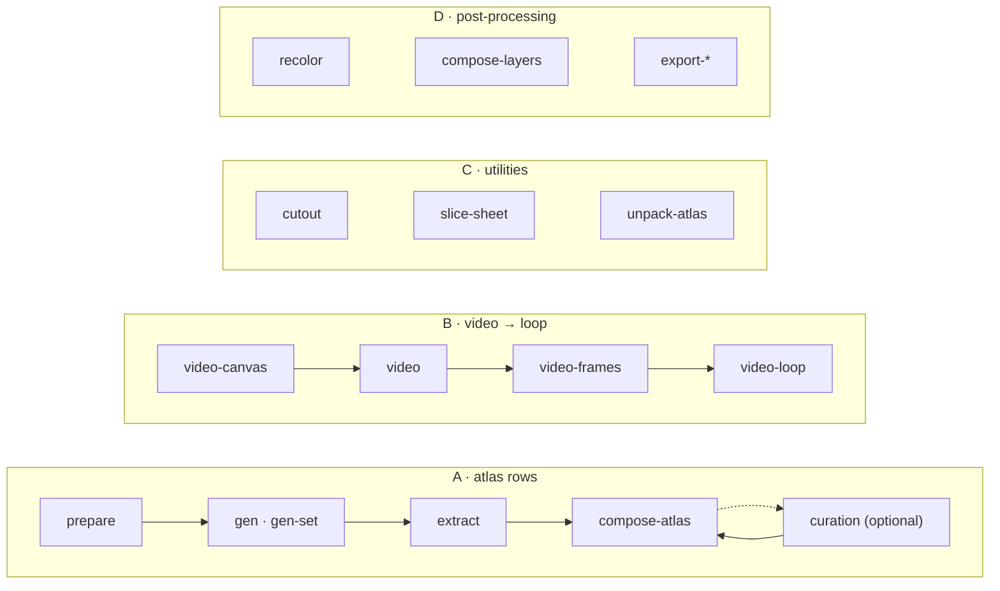

<h1 align="center">sprite-gen</h1>

<p align="center"><b>Entra un dibujo. Salen sprites listos para el juego — como atlas o como bucles de movimiento transparentes.</b></p>

<p align="center">

[English](README.md) · [한국어](README.ko.md) · [日本語](README.ja.md) · [简体中文](README.zh-Hans.md) · **Español** · [Français](README.fr.md)

</p>

<p align="center">
  <a href="https://youtu.be/zVu9YlbPtog"></a>
</p>

<p align="center"><sub>Cada personaje empezó con <b>una sola imagen</b>. Grok Imagine le dio movimiento, sprite-gen extrajo los bucles transparentes y HyperFrames compuso esta escena.</sub></p>

---


Pídele a un modelo de imagen una "sprite sheet" y ya sabes lo que obtienes: un personaje cuya cara cambia en cada fotograma, un fondo que no se recorta, poses que se superponen y se salen de la rejilla, y un PNG que tu motor no puede consumir. Demo bonita, asset inútil.

`sprite-gen` es una skill de Codex/Claude y una CLI de Python que cierra esa brecha. Dale **una imagen base**: dirige la generación fila por fila, fija la identidad del personaje, convierte el fondo croma en alfa real, extrae cada pose como un fotograma transparente limpio y hornea un atlas de runtime **con un `manifest.json.frame_layout` legible por máquina**. Pasa el mismo fotograma a un modelo de vídeo y recibes un bucle transparente sin costura por cada estado de movimiento. Para el último 10 % que la generación nunca acierta, una **webview de curación** te deja comparar, descartar, ajustar y ver el bucle en vivo antes de hornear.

## Empezar con una petición

Pide **sprites** o **una imagen**. El agente comprueba el acceso, pregunta solo por las opciones que faltan y entrega los archivos mediante el proceso existente. La vista de selección es opcional. Puedes guardar valores predeterminados separados para cada uso; una elección puntual no los modifica. [Flujo y preferencias](docs/user-workflow.md).

## Cuatro pipelines, una CLI

Cada verbo funciona solo o como etapa de un pipeline. `sprite-gen --help` imprime este mismo mapa con cada verbo agrupado por dominio.



| Pipeline | Qué entra → qué sale | Docs |
|---|---|---|
| **A · filas de atlas** | un fotograma + lista de estados → `sprite-sheet-alpha.png` + `manifest.json.frame_layout`, con **Breathe** horneado en las poses idle | [run-contract](docs/run-contract.md) · [breathing](docs/breathing.md) |
| **B · vídeo → bucle** | un fotograma → por estado, un GIF / WebP / tira transparente sin costura, animado por Grok Imagine y cortado en su periodo real | [video-pipeline](docs/video-pipeline.md) · [video](docs/video.md) |
| **C · utilidades** | una imagen importada o una hoja en rejilla → recortes transparentes limpios; un atlas terminado → un run listo para curar | [sheet-slicing](docs/sheet-slicing.md) · [curation](docs/curation.md) |
| **D · posprocesado** | una hoja terminada → variantes de color deterministas, compuestos por capas de rig, exportaciones Aseprite / Phaser / Flame | [recolor](docs/recolor.md) · [layer-tracks](docs/layer-tracks.md) · [engine-export](docs/engine-export.md) |

Índice completo: [`docs/README.md`](docs/README.md). Arquitectura con diagramas de dominios y pipelines: [`docs/architecture.md`](docs/architecture.md).

## Lo que realmente obtienes

- **Un atlas de sprites transparente** (`sprite-sheet-alpha.png`): alfa real, sin borde croma residual, verificado sobre fondo blanco ([por qué el extractor desmezcla en vez de pelar](docs/chroma-alpha.md)).
- **Un manifiesto de runtime** (`manifest.json.frame_layout`): rectángulos absolutos por fotograma, fps y bandera de bucle por estado. Tu motor lee rectángulos; nunca adivina una rejilla.
- **Breathe**: un idle fijo se convierte en un bucle vivo; squash & stretch determinista horneado sobre tus fotogramas curados desde un solo campo sidecar, consciente de la anatomía y fiel al píxel ([detalles](docs/breathing.md)).
- **Pixel art que se mantiene en la rejilla**: Backbone Lattice mide una sola rejilla para todo el sujeto y ajusta cada corte a ella ([detalles](docs/pixel-unfake.md)).
- **Bucles de movimiento desde vídeo**: los saltos reciben un lienzo alto, los ataques uno ancho, el punto de bucle es el periodo propio del clip y una acción única se corta rest → action → rest ([detalles](docs/video-pipeline.md)).
- **Variantes de color deterministas**: `recolor` hornea N hojas variantes desde un mapa de paleta; misma entrada, mismos bytes ([detalles](docs/recolor.md)).
- **QA que puedes ver**: GIFs y hojas de contacto por estado, para juzgar el movimiento como movimiento antes de publicar. La locomoción cíclica (walk/run) sigue siendo experimental hasta que el QA de movimiento pasa de verdad.

## Inicio rápido

```bash
# install (Pillow, NumPy) into a fresh virtualenv — the venv is the only supported interpreter
python3 -m venv .venv && source .venv/bin/activate
pip install -e .
sprite-gen --help
```

**A · filas de atlas**: de un fotograma a un atlas de runtime.

```bash
# install (Pillow, NumPy) into a fresh virtualenv — the venv is the only supported interpreter
python3 -m venv .venv && source .venv/bin/activate
pip install -e .
sprite-gen --help
```

**B · vídeo → bucle**: de un fotograma a bucles transparentes (requiere `ffmpeg`, `img2webp` y tu propio login de `grok` o `XAI_API_KEY`).

```bash
# install (Pillow, NumPy) into a fresh virtualenv — the venv is the only supported interpreter
python3 -m venv .venv && source .venv/bin/activate
pip install -e .
sprite-gen --help
```

**C · utilidades**: cada una funciona por separado.

```bash
# install (Pillow, NumPy) into a fresh virtualenv — the venv is the only supported interpreter
python3 -m venv .venv && source .venv/bin/activate
pip install -e .
sprite-gen --help
```

**D · posprocesado**: refina una hoja terminada sin regenerar.

```bash
# install (Pillow, NumPy) into a fresh virtualenv — the venv is the only supported interpreter
python3 -m venv .venv && source .venv/bin/activate
pip install -e .
sprite-gen --help
```

El flujo para agentes, sus gates y contratos viven en [`SKILL.md`](SKILL.md).

## Instalar como skill

```bash
python3 ~/.codex/skills/.system/skill-installer/scripts/install-skill-from-github.py \
  --repo aldegad/sprite-gen --path . --name sprite-gen
```

La generación de imágenes forma parte de este motor (`sprite_gen.gen`, proveedores `codex` y `grok`; la skill general `image-gen` es solo una lanzadera fina sobre ella). El vídeo usa **tu propia** credencial — el login de la CLI `grok` o un `XAI_API_KEY` — y el repositorio no incluye ninguna ([docs/video.md](docs/video.md)).

`sprite-gen` soporta CPython 3.10+; la CI ejecuta 3.10 y 3.14. El inicio rápido necesita un Python con `venv`/`ensurepip` funcionales.

## Atribución

El flujo de filas por componente está inspirado en la skill `hatch-pet` (Apache-2.0), pero apunta a atlas de sprites genéricos para juegos y no incluye paquetes ni activos visuales de mascotas.

Las contribuciones de la comunidad, los experimentos y sus pull requests de origen están documentados en [`CONTRIBUTORS.md`](CONTRIBUTORS.md).

## Licencia

Apache-2.0
