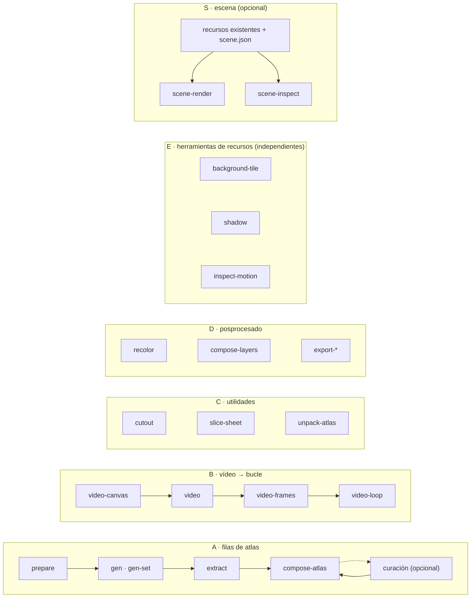

<h1 align="center">sprite-gen</h1>

<p align="center"><b>Un dibujo a la entrada. Sprites listos para el juego a la salida: como atlas o como bucles de movimiento transparentes.</b></p>

<p align="center">

**English** · [한국어](README.ko.md) · [日本語](README.ja.md) · [简体中文](README.zh-Hans.md) · [Español](README.es.md) · [Français](README.fr.md)

</p>

<p align="center">
  <a href="https://youtu.be/zVu9YlbPtog"></a>
</p>

<p align="center"><sub>Cada personaje empezó como <b>una sola imagen fija</b>. Grok Imagine le dio vida; sprite-gen extrajo los bucles transparentes, y HyperFrames montó esta muestra.</sub></p>

<p align="center">
  
</p>

<p align="center"><sub>Una composición de pueblo aparte, hecha con recursos de sprite-gen. Este GIF conserva el vídeo de 10 segundos a 20 fps con una paleta de 256 colores.</sub></p>

---

Pídele a un modelo de imagen una «hoja de sprites» y ya sabes lo que sale: un personaje cuya cara cambia en cada fotograma, un fondo que no se deja recortar, poses que se solapan y se desvían de la cuadrícula, y un PNG que tu motor de juego no puede consumir realmente. Demo mona, recurso inútil.

`sprite-gen` es una skill de Codex/Claude y una CLI de Python que cierra esa brecha. Dale **una imagen base** — dirige la generación fila por fila, fija la identidad del personaje, elimina el fondo de croma hasta obtener alfa real, extrae cada pose como un fotograma transparente limpio y hornea un atlas de runtime **con un `manifest.json.frame_layout` legible por máquina**. O entrega esa misma imagen fija a un modelo de vídeo y recibe un bucle transparente y sin costuras por cada estado de movimiento. Para ese último 10 % que la generación nunca acierta, una **vista web de curación** te permite comparar, descartar, ajustar y ver el bucle en vivo antes de hornear.

## Empieza con una petición

Pide **sprites** o **una imagen**. El agente comprueba el acceso, pregunta solo por las decisiones de proveedor/movimiento que falten, ejecuta el pipeline existente y entrega los archivos. La vista de curación es opcional. Guarda tus elecciones una vez para reutilizar valores por defecto separados para sprites e imágenes; una petición puntual no los sobrescribe. [Flujo de trabajo del usuario y valores por defecto](docs/user-workflow.md).

## Pipelines, herramientas independientes y escenas

Los dos pipelines de sprites son flujos de generación ordenados. Los grupos de herramientas contienen comandos independientes; la creación de escenas es un flujo de trabajo opcional que consume recursos ya terminados. `sprite-gen --help` imprime este mapa y agrupa los comandos por el dominio de código que los posee.



| Pipeline / grupo de herramientas / flujo de trabajo | Qué entra → qué sale | Documentación |
|---|---|---|
| **A · filas de atlas** | una imagen fija + una lista de estados → `sprite-sheet-alpha.png` + `manifest.json.frame_layout`, con **Breathe** horneado en las poses de reposo | [run-contract](docs/run-contract.md) · [breathing](docs/breathing.md) |
| **B · vídeo → bucle** | una imagen fija → por estado, un GIF / WebP / tira transparente sin costuras, animado por Grok Imagine y cortado en su periodo real | [video-pipeline](docs/video-pipeline.md) · [video](docs/video.md) |
| **C · utilidades** | una imagen importada u hoja en cuadrícula → recortes transparentes limpios; un atlas terminado → una ejecución lista para curación | [sheet-slicing](docs/sheet-slicing.md) · [curation](docs/curation.md) |
| **D · posprocesado** | una hoja terminada → combinaciones de color deterministas, composiciones de capas de rig, exportaciones a Aseprite / Phaser / Flame | [recolor](docs/recolor.md) · [layer-tracks](docs/layer-tracks.md) · [engine-export](docs/engine-export.md) |
| **E · herramientas de recursos** | PNG o animaciones independientes → mosaicos repetibles, sombras proyectadas, mediciones de movimiento/contacto | [asset-tools](docs/asset-tools.md) |
| **S · escena** | recursos existentes + colocación, cámara e iluminación → fotogramas PNG, MP4/GIF, metadatos de inspección y colocación | [scene](docs/scene.md) |

Índice completo: [`docs/README.md`](docs/README.md). Arquitectura con diagramas de dominio y pipeline: [`docs/architecture.md`](docs/architecture.md).

## Qué obtienes realmente

- **Un atlas de sprites transparente** (`sprite-sheet-alpha.png`) — alfa real, sin flecos de croma residuales, verificado contra fondos blancos ([por qué el extractor desmezcla en vez de pelar](docs/chroma-alpha.md)).
- **Un manifiesto de runtime** (`manifest.json.frame_layout`) — rectángulos de fotograma absolutos, fps por estado y banderas de bucle. Tu motor muestrea rectángulos; nunca adivina una cuadrícula.
- **Breathe** — un reposo estático se convierte en un bucle vivo, con squash & stretch determinista horneado sobre tus fotogramas curados a partir de un solo campo sidecar, consciente de la anatomía y fiel al píxel ([detalles](docs/breathing.md)).
- **Pixel-art que no se sale de la cuadrícula** — la Backbone Lattice mide una única cuadrícula para todo el sujeto y ajusta cada recorte a ella ([detalles](docs/pixel-unfake.md)).
- **Bucles de movimiento a partir de vídeo** — los saltos reciben un lienzo alto, los ataques uno ancho, el punto de bucle es el propio periodo del clip, y una acción de un solo disparo se corta reposo → acción → reposo ([detalles](docs/video-pipeline.md)).
- **Combinaciones de color deterministas** — `recolor` hornea N hojas variantes a partir de un mapa de paleta; misma entrada, mismos bytes de salida ([detalles](docs/recolor.md)).
- **QA que puedes mirar** — GIF por estado y hojas de contacto, para que el movimiento se juzgue como movimiento antes de publicar nada. La locomoción cíclica (caminar/correr) sigue siendo experimental salvo que el QA de movimiento realmente pase.
- **Herramientas de recursos independientes** — construye fondos repetibles, proyecta sombras desde un ancla de pie e inspecciona el tiempo, las poses duplicadas y la evidencia de contacto. Los pies ambiguos producen una medición no verificada ([detalles](docs/asset-tools.md)).
- **Creación de escenas opcional** — coloca PNG existentes, secuencias de fotogramas externas, tiras de bucle o atlas de runtime en planos con nombre, con movimiento de cámara y proyección de sombra compartida. La generación de sprites puede terminar antes de este paso ([detalles](docs/scene.md)).

## Inicio rápido

```bash
# instala (Pillow, NumPy) en un virtualenv nuevo — el venv es el único intérprete soportado
python3 -m venv .venv && source .venv/bin/activate
pip install -e .
sprite-gen --help
```

**A · filas de atlas** — de una imagen fija a un atlas de runtime.

```bash
sprite-gen prepare --out-dir <run> --character-id <id> --base-image base.png   # petición, guías, prompts
sprite-gen gen-set --run-dir <run> --provider codex                            # cada fila de estado, de 4 en 4
sprite-gen extract --run-dir <run>                                             # croma → fotogramas transparentes
sprite-gen compose-atlas --run-dir <run>                                       # sprite-sheet-alpha.png + manifest.json
sprite-gen curation --run-dir <run>                                            # (opcional) elige, ajusta, respira
```

**B · vídeo → bucle** — de una imagen fija a bucles transparentes (necesita `ffmpeg`, `img2webp` y tu propio login de `grok` o `XAI_API_KEY`).

```bash
sprite-gen video-set --base side=still.png --states idle,walk,run,jump,attack --out-dir set/
# por elemento: video-canvas → video → video-frames → video-loop; set/table.md nombra cada resultado
```

**C · utilidades** — cada una funciona por su cuenta.

```bash
sprite-gen cutout icon.png --white-check              # blanco/marfil → mate, magenta/verde → motor de croma
sprite-gen slice-sheet --sheet sheet.png --chroma-key magenta --grid 3x2   # hoja multifigura → recortes por celda
sprite-gen unpack-atlas --atlas sheet.png             # atlas terminado → ejecución lista para curación (o --pngs-dir folder/)
```

**D · posprocesado** — refina una hoja terminada sin regenerar.

```bash
sprite-gen recolor-palette --base <run>/sprite-sheet-alpha.png --out palette.draft.json
sprite-gen recolor --run-dir <run> --spec recolor.spec.json      # → <run>/variants/
sprite-gen compose-layers --run-dir <run>                        # ejecuciones de rig: pilas declaradas → <run>/layers/
sprite-gen export-aseprite --run-dir <run>                       # JSON de Aseprite para Phaser / Flame
```

**E · herramientas de recursos** — cada una acepta recursos existentes, incluido arte de otras herramientas.

```bash
sprite-gen background-tile --source background.png --period 512 --overlap 32 --out tile.png
sprite-gen shadow --source walk.strip.json --out-dir shadows/
sprite-gen inspect-motion --source walk.strip.json --out motion.json
# Solo con contacto conocido del mismo pie y una ROI de pie aislada:
sprite-gen inspect-motion --source walk.strip.json --contacts 0:4 --foot-box 20,70,32,10 --out stance.json
```

**S · escena** — un flujo de trabajo de composición opcional. El [contrato de escena](docs/scene.md) incluye una especificación completa.

```bash
sprite-gen scene-render --spec scene.json --out-dir render/ --formats png,mp4 --export-layers
sprite-gen scene-inspect --spec scene.json --out scene-check.json
```

El flujo de trabajo orientado al agente, las compuertas y los contratos viven en [`SKILL.md`](SKILL.md).

## Instalar como skill

```bash
python3 ~/.codex/skills/.system/skill-installer/scripts/install-skill-from-github.py \
  --repo aldegad/sprite-gen --path . --name sprite-gen
```

La generación de imágenes forma parte de este motor (`sprite_gen.gen`, proveedores `codex` y `grok`; la skill genérica `image-gen` es una fina lanzadera sobre él). El vídeo usa **tu propia** credencial — el login de la CLI `grok` o una `XAI_API_KEY` — y nada se distribuye con el repositorio ([docs/video.md](docs/video.md)).

`sprite-gen` soporta CPython 3.10+; CI ejecuta 3.10 y 3.14. El inicio rápido necesita un Python con `venv`/`ensurepip` funcionando.

## Atribución

El flujo de trabajo de filas por componente está inspirado en la skill `hatch-pet`, con licencia Apache-2.0, pero apunta a atlas genéricos de sprites de juego y no incluye ningún paquete de mascotas ni recursos visuales de mascotas.

Las contribuciones de la comunidad, los experimentos y sus pull requests de origen están documentados en [`CONTRIBUTORS.md`](CONTRIBUTORS.md).

## Licencia

Apache-2.0