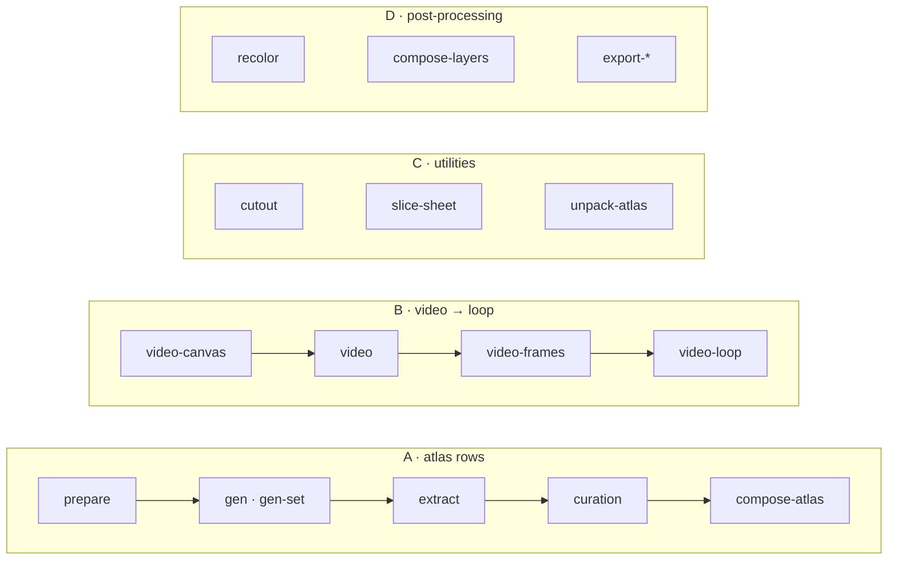

<h1 align="center">sprite-gen</h1>

<p align="center"><b>Un dessin entre. Des sprites prêts pour le jeu sortent — en atlas, ou en boucles de mouvement transparentes.</b></p>

<p align="center">

[English](README.md) · [한국어](README.ko.md) · [日本語](README.ja.md) · [简体中文](README.zh-Hans.md) · [Español](README.es.md) · **Français**

</p>

<p align="center">
  
  
  
  
  
</p>

<p align="center"><sub>Chaque boucle ci-dessus est partie d'<b>une seule image fixe</b> : rembourrée au canevas que son mouvement exige, animée par Grok Imagine, détourée image par image et coupée à sa vraie période en GIF transparent — pipeline B, <code>sprite-gen video-set</code>.</sub></p>

---


Demandez une « sprite sheet » à un modèle d'image et vous savez ce que vous obtenez : un personnage dont le visage change à chaque image, un fond impossible à détourer, des poses qui se chevauchent et sortent de la grille, et un PNG que votre moteur de jeu ne peut pas consommer. Jolie démo, asset inutile.

`sprite-gen` est une skill Codex/Claude et une CLI Python qui comble cet écart. Donnez-lui **une image de base** : elle pilote la génération ligne par ligne, verrouille l'identité du personnage, retire le fond chroma en vrai alpha, extrait chaque pose en une image transparente propre et cuit un atlas d'exécution **avec un `manifest.json.frame_layout` lisible par machine**. Passez la même image fixe à un modèle vidéo et vous recevez une boucle transparente sans raccord par état de mouvement. Pour les 10 % que la génération ne réussit jamais, une **webview de curation** permet de comparer, rejeter, ajuster et regarder la boucle en direct avant de cuire.

## Quatre pipelines, une CLI

Chaque verbe fonctionne seul ou comme étape d'un pipeline. `sprite-gen --help` affiche cette même carte, chaque verbe groupé par domaine.



| Pipeline | Ce qui entre → ce qui sort | Docs |
|---|---|---|
| **A · lignes d'atlas** | une image fixe + une liste d'états → `sprite-sheet-alpha.png` + `manifest.json.frame_layout`, avec **Breathe** cuit sur les poses idle | [run-contract](docs/run-contract.md) · [breathing](docs/breathing.md) |
| **B · vidéo → boucle** | une image fixe → par état, un GIF / WebP / bande transparente sans raccord, animé par Grok Imagine et coupé à sa vraie période | [video-pipeline](docs/video-pipeline.md) · [video](docs/video.md) |
| **C · utilitaires** | une image importée ou une planche en grille → découpes transparentes propres ; un atlas fini → un run prêt à curer | [sheet-slicing](docs/sheet-slicing.md) · [curation](docs/curation.md) |
| **D · post-traitement** | une planche finie → variantes de couleur déterministes, composites de calques de rig, exports Aseprite / Phaser / Flame | [recolor](docs/recolor.md) · [layer-tracks](docs/layer-tracks.md) · [engine-export](docs/engine-export.md) |

Index complet : [`docs/README.md`](docs/README.md). Architecture avec les diagrammes de domaines et de pipelines : [`docs/architecture.md`](docs/architecture.md).

## Ce que vous obtenez vraiment

- **Un atlas de sprites transparent** (`sprite-sheet-alpha.png`) : vrai alpha, aucune frange chroma, vérifié sur fond blanc ([pourquoi l'extracteur démélange au lieu de peler](docs/chroma-alpha.md)).
- **Un manifeste d'exécution** (`manifest.json.frame_layout`) : rectangles absolus par image, fps et drapeau de boucle par état. Votre moteur lit des rectangles ; il ne devine jamais une grille.
- **Breathe** : un idle fixe devient une boucle vivante ; squash & stretch déterministe cuit sur vos images curées depuis un seul champ sidecar, conscient de l'anatomie et fidèle au pixel ([détails](docs/breathing.md)).
- **Du pixel art qui reste sur la grille** : Backbone Lattice mesure une seule grille pour tout le sujet et y aligne chaque découpe ([détails](docs/pixel-unfake.md)).
- **Des boucles de mouvement depuis la vidéo** : les sauts reçoivent un canevas haut, les attaques un canevas large, le point de boucle est la période propre du clip, et une action unique est coupée rest → action → rest ([détails](docs/video-pipeline.md)).
- **Des variantes de couleur déterministes** : `recolor` cuit N planches variantes depuis une carte de palette ; même entrée, mêmes octets ([détails](docs/recolor.md)).
- **Un QA que l'on peut regarder** : GIFs et planches-contact par état, pour juger le mouvement comme mouvement avant de livrer. La locomotion cyclique (walk/run) reste expérimentale tant que le QA de mouvement ne passe pas réellement.

## Démarrage rapide

```bash
# install (Pillow, NumPy) into a fresh virtualenv — the venv is the only supported interpreter
python3 -m venv .venv && source .venv/bin/activate
pip install -e .
sprite-gen --help
```

**A · lignes d'atlas** : d'une image fixe à un atlas d'exécution.

```bash
# install (Pillow, NumPy) into a fresh virtualenv — the venv is the only supported interpreter
python3 -m venv .venv && source .venv/bin/activate
pip install -e .
sprite-gen --help
```

**B · vidéo → boucle** : d'une image fixe à des boucles transparentes (nécessite `ffmpeg`, `img2webp`, et votre propre login `grok` ou `XAI_API_KEY`).

```bash
# install (Pillow, NumPy) into a fresh virtualenv — the venv is the only supported interpreter
python3 -m venv .venv && source .venv/bin/activate
pip install -e .
sprite-gen --help
```

**C · utilitaires** : chacun s'utilise seul.

```bash
# install (Pillow, NumPy) into a fresh virtualenv — the venv is the only supported interpreter
python3 -m venv .venv && source .venv/bin/activate
pip install -e .
sprite-gen --help
```

**D · post-traitement** : affiner une planche finie sans régénérer.

```bash
# install (Pillow, NumPy) into a fresh virtualenv — the venv is the only supported interpreter
python3 -m venv .venv && source .venv/bin/activate
pip install -e .
sprite-gen --help
```

Le flux destiné aux agents, ses gates et ses contrats vivent dans [`SKILL.md`](SKILL.md).

## Installer comme skill

```bash
python3 ~/.codex/skills/.system/skill-installer/scripts/install-skill-from-github.py \
  --repo aldegad/sprite-gen --path . --name sprite-gen
```

La génération d'images fait partie de ce moteur (`sprite_gen.gen`, fournisseurs `codex` et `grok` ; la skill générale `image-gen` n'est qu'une navette fine au-dessus). La vidéo utilise **votre propre** identifiant — le login de la CLI `grok` ou un `XAI_API_KEY` — et rien n'est livré avec le dépôt ([docs/video.md](docs/video.md)).

`sprite-gen` prend en charge CPython 3.10+ ; la CI exécute 3.10 et 3.14. Le démarrage rapide nécessite un Python avec `venv`/`ensurepip` fonctionnels.

## Attribution

Le flux par lignes de composants s'inspire de la skill `hatch-pet` (Apache-2.0), mais vise des atlas de sprites de jeu génériques et n'inclut aucun paquet ni asset visuel d'animal de compagnie.

Les contributions de la communauté, les expériences et leurs pull requests d'origine sont documentés dans [`CONTRIBUTORS.md`](CONTRIBUTORS.md).

## Licence

Apache-2.0
