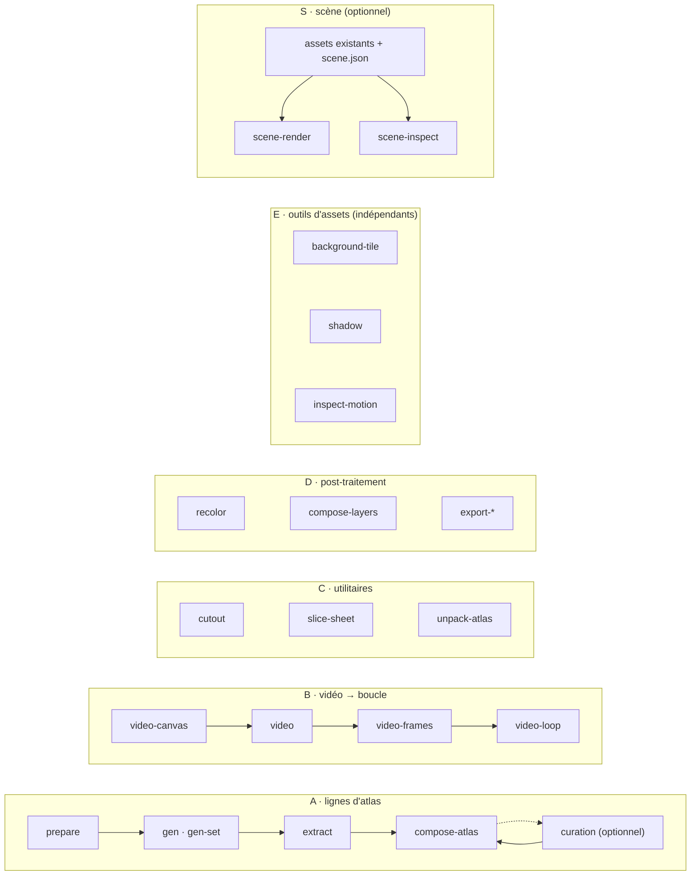

<h1 align="center">sprite-gen</h1>

<p align="center"><b>Un dessin en entrée. Des sprites prêts pour le jeu en sortie — sous forme d'atlas, ou de boucles d'animation transparentes.</b></p>

<p align="center">

[English](README.md) · [한국어](README.ko.md) · [日本語](README.ja.md) · [简体中文](README.zh-Hans.md) · [Español](README.es.md) · **Français**

</p>

<p align="center">
  <a href="https://youtu.be/zVu9YlbPtog"></a>
</p>

<p align="center"><sub>Chaque personnage est parti d'<b>une seule image fixe</b>. Grok Imagine lui a donné vie ; sprite-gen en a extrait les boucles transparentes, et HyperFrames a assemblé cette démonstration.</sub></p>

<p align="center">
  
</p>

<p align="center"><sub>Une composition de village distincte, réalisée à partir d'assets sprite-gen. Ce GIF conserve la vidéo de 10 secondes à 20 fps avec une palette de 256 couleurs.</sub></p>

---

Demandez une « feuille de sprites » à un modèle d'image et vous savez ce que vous obtenez : un personnage dont le visage change à chaque frame, un fond impossible à détourer, des poses qui se chevauchent et dérivent hors de la grille, et un PNG que votre moteur de jeu ne peut pas réellement exploiter. Démo mignonne, asset inutilisable.

`sprite-gen` est une skill Codex/Claude et une CLI Python qui comble cet écart. Donnez-lui **une seule image de base** — elle pilote la génération ligne par ligne, verrouille l'identité du personnage, retire le fond chroma pour obtenir un vrai canal alpha, extrait chaque pose sous forme de frame transparente propre, et cuit un atlas d'exécution **avec un `manifest.json.frame_layout` lisible par la machine**. Ou confiez la même image fixe à un modèle vidéo et récupérez une boucle transparente sans raccord par état d'animation. Pour les derniers 10 % que la génération ne réussit jamais, une **webview de curation** vous permet de comparer, rejeter, ajuster et regarder la boucle en direct avant la cuisson.

## Commencez par une demande

Demandez des **sprites** ou **une image**. L'agent vérifie les accès, ne pose de questions que sur les choix de provider/animation manquants, exécute le pipeline existant et livre les fichiers. La vue de curation est optionnelle. Enregistrez vos choix une fois pour réutiliser des valeurs par défaut distinctes pour les sprites et les images ; une demande ponctuelle ne les écrase pas. [Workflow utilisateur et valeurs par défaut](docs/user-workflow.md).

## Pipelines, outils indépendants et scènes

Les deux pipelines de sprites sont des flux de génération ordonnés. Les groupes d'outils contiennent des commandes indépendantes ; la création de scène est un workflow optionnel qui consomme des assets terminés. `sprite-gen --help` affiche cette carte et regroupe les commandes par domaine de code propriétaire.



| Pipeline / groupe d'outils / workflow | Ce qui entre → ce qui sort | Docs |
|---|---|---|
| **A · lignes d'atlas** | une image fixe + une liste d'états → `sprite-sheet-alpha.png` + `manifest.json.frame_layout`, avec **Breathe** cuit sur les poses idle | [run-contract](docs/run-contract.md) · [breathing](docs/breathing.md) |
| **B · vidéo → boucle** | une image fixe → par état, un GIF / WebP / bande transparent sans raccord, animé par Grok Imagine et coupé à sa véritable période | [video-pipeline](docs/video-pipeline.md) · [video](docs/video.md) |
| **C · utilitaires** | une image importée ou une feuille en grille → des découpes transparentes propres ; un atlas terminé → un run prêt pour la curation | [sheet-slicing](docs/sheet-slicing.md) · [curation](docs/curation.md) |
| **D · post-traitement** | une feuille terminée → des variantes de couleurs déterministes, des composites de couches de rig, des exports Aseprite / Phaser / Flame | [recolor](docs/recolor.md) · [layer-tracks](docs/layer-tracks.md) · [engine-export](docs/engine-export.md) |
| **E · outils d'assets** | des PNG ou animations indépendants → tuiles répétables, ombres projetées, mesures de mouvement/contact | [asset-tools](docs/asset-tools.md) |
| **S · scène** | assets existants + placement, caméra et éclairage → frames PNG, MP4/GIF, métadonnées d'inspection et de placement | [scene](docs/scene.md) |

Index complet : [`docs/README.md`](docs/README.md). Architecture avec diagrammes de domaines et de pipelines : [`docs/architecture.md`](docs/architecture.md).

## Ce que vous obtenez réellement

- **Un atlas de sprites transparent** (`sprite-sheet-alpha.png`) — un vrai canal alpha, aucune frange chroma résiduelle, vérifié sur fond blanc ([pourquoi l'extracteur démélange au lieu de décoller](docs/chroma-alpha.md)).
- **Un manifeste d'exécution** (`manifest.json.frame_layout`) — rectangles de frames absolus, fps et drapeaux de boucle par état. Votre moteur échantillonne des rectangles ; il ne devine jamais une grille.
- **Breathe** — une pose idle statique devient une boucle vivante, un squash & stretch déterministe cuit sur vos frames curées à partir d'un seul champ sidecar, respectueux de l'anatomie et fidèle au pixel ([détails](docs/breathing.md)).
- **Du pixel-art qui reste sur la grille** — le Backbone Lattice mesure une seule grille pour l'ensemble du sujet et y maintient chaque découpe ([détails](docs/pixel-unfake.md)).
- **Des boucles d'animation issues de la vidéo** — les sauts reçoivent un canvas haut, les attaques un canvas large, le point de boucle est la période propre du clip, et une action one-shot est coupée repos → action → repos ([détails](docs/video-pipeline.md)).
- **Des variantes de couleurs déterministes** — `recolor` cuit N feuilles variantes à partir d'une palette de correspondance ; même entrée, mêmes octets en sortie ([détails](docs/recolor.md)).
- **Un QA que vous pouvez regarder** — des GIF et planches contact par état, pour que le mouvement soit jugé en tant que mouvement avant toute livraison. La locomotion cyclique (marche/course) reste expérimentale tant que le QA d'animation n'est pas réellement validé.
- **Des outils d'assets indépendants** — construisez des fonds répétables, projetez des ombres depuis un point d'ancrage au pied, et inspectez le timing, les poses dupliquées et les preuves de contact. Des pieds ambigus produisent une mesure non vérifiée ([détails](docs/asset-tools.md)).
- **Création de scène optionnelle** — placez des PNG existants, des séquences de frames externes, des bandes de boucle ou des atlas d'exécution sur des plans nommés, avec mouvement de caméra et projection d'ombre partagée. La génération de sprites peut se terminer avant cette étape ([détails](docs/scene.md)).

## Démarrage rapide

```bash
# installer (Pillow, NumPy) dans un virtualenv neuf — le venv est le seul interpréteur supporté
python3 -m venv .venv && source .venv/bin/activate
pip install -e .
sprite-gen --help
```

**A · lignes d'atlas** — d'une image fixe à un atlas d'exécution.

```bash
sprite-gen prepare --out-dir <run> --character-id <id> --base-image base.png   # requête, guides, prompts
sprite-gen gen-set --run-dir <run> --provider codex                            # chaque ligne d'état, 4 à la fois
sprite-gen extract --run-dir <run>                                             # chroma → frames transparentes
sprite-gen compose-atlas --run-dir <run>                                       # sprite-sheet-alpha.png + manifest.json
sprite-gen curation --run-dir <run>                                            # (optionnel) choisir, ajuster, breathe
```

**B · vidéo → boucle** — d'une image fixe à des boucles transparentes (nécessite `ffmpeg`, `img2webp`, et votre propre connexion `grok` ou `XAI_API_KEY`).

```bash
sprite-gen video-set --base side=still.png --states idle,walk,run,jump,attack --out-dir set/
# par élément : video-canvas → video → video-frames → video-loop ; set/table.md nomme chaque résultat
```

**C · utilitaires** — chacun est autonome.

```bash
sprite-gen cutout icon.png --white-check              # blanc/ivoire → matte, magenta/vert → moteur chroma
sprite-gen slice-sheet --sheet sheet.png --chroma-key magenta --grid 3x2   # feuille multi-figures → découpes par cellule
sprite-gen unpack-atlas --atlas sheet.png             # atlas terminé → run prêt pour la curation (ou --pngs-dir folder/)
```

**D · post-traitement** — affinez une feuille terminée sans régénérer.

```bash
sprite-gen recolor-palette --base <run>/sprite-sheet-alpha.png --out palette.draft.json
sprite-gen recolor --run-dir <run> --spec recolor.spec.json      # → <run>/variants/
sprite-gen compose-layers --run-dir <run>                        # runs de rig : piles déclarées → <run>/layers/
sprite-gen export-aseprite --run-dir <run>                       # JSON Aseprite pour Phaser / Flame
```

**E · outils d'assets** — chacun accepte des assets existants, y compris des illustrations issues d'autres outils.

```bash
sprite-gen background-tile --source background.png --period 512 --overlap 32 --out tile.png
sprite-gen shadow --source walk.strip.json --out-dir shadows/
sprite-gen inspect-motion --source walk.strip.json --out motion.json
# Uniquement avec un contact du même pied connu et une ROI de pied isolée :
sprite-gen inspect-motion --source walk.strip.json --contacts 0:4 --foot-box 20,70,32,10 --out stance.json
```

**S · scène** — un workflow de composition optionnel. Le [contrat de scène](docs/scene.md) inclut une spécification complète.

```bash
sprite-gen scene-render --spec scene.json --out-dir render/ --formats png,mp4 --export-layers
sprite-gen scene-inspect --spec scene.json --out scene-check.json
```

Le workflow destiné à l'agent, les gates et les contrats se trouvent dans [`SKILL.md`](SKILL.md).

## Installation en tant que skill

```bash
python3 ~/.codex/skills/.system/skill-installer/scripts/install-skill-from-github.py \
  --repo aldegad/sprite-gen --path . --name sprite-gen
```

La génération d'images fait partie de ce moteur (`sprite_gen.gen`, providers `codex` et `grok` ; la skill générique `image-gen` n'en est qu'une fine navette). La vidéo utilise **vos propres** identifiants — la connexion via la CLI `grok` ou une `XAI_API_KEY` — et rien n'est livré avec le dépôt ([docs/video.md](docs/video.md)).

`sprite-gen` supporte CPython 3.10+ ; la CI tourne sur 3.10 et 3.14. Le démarrage rapide nécessite un Python avec `venv`/`ensurepip` fonctionnels.

## Attribution

Le workflow par lignes de composants s'inspire de la skill `hatch-pet` sous licence Apache-2.0, mais vise des atlas de sprites de jeu génériques et n'inclut aucun package de pet ni asset visuel de pet.

Les contributions de la communauté, les expérimentations et leurs pull requests d'origine sont documentées dans [`CONTRIBUTORS.md`](CONTRIBUTORS.md).

## Licence

Apache-2.0