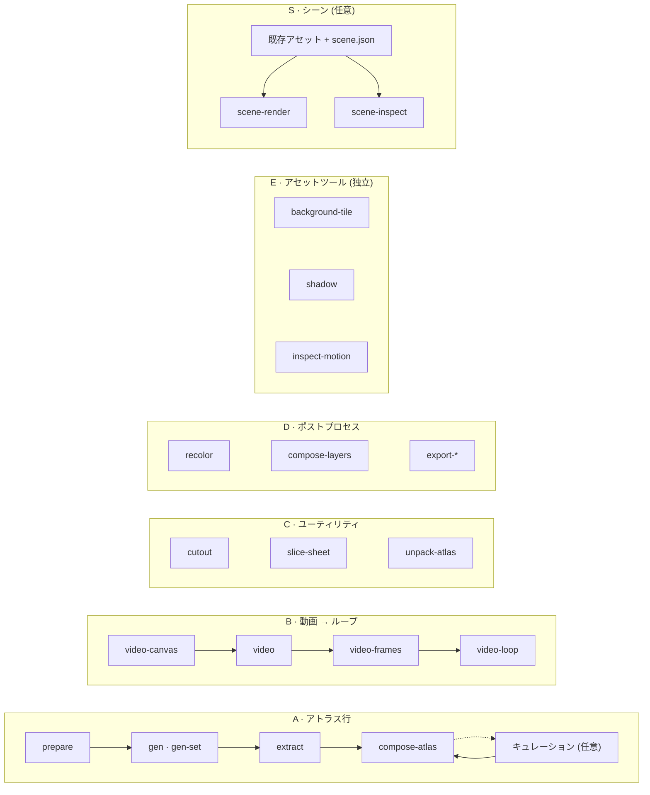

<h1 align="center">sprite-gen</h1>

<p align="center"><b>一枚の絵を入力。ゲームですぐ使えるスプライトを出力 — アトラスとして、あるいは透過モーションループとして。</b></p>

<p align="center">

[English](README.md) · [한국어](README.ko.md) · **日本語** · [简体中文](README.zh-Hans.md) · [Español](README.es.md) · [Français](README.fr.md)

</p>

<p align="center">
  <a href="https://youtu.be/zVu9YlbPtog"></a>
</p>

<p align="center"><sub>それぞれのキャラクターは<b>一枚の静止画</b>から始まりました。Grok Imagine が命を吹き込み、sprite-gen が透過ループを抽出し、HyperFrames がこのショーケースを組み上げました。</sub></p>

<p align="center">
  
</p>

<p align="center"><sub>sprite-gen のアセットで作った別の村のコンポジション。この GIF は 10 秒の動画を 20 fps・256 色パレットで保持しています。</sub></p>

---

画像モデルに「スプライトシート」を頼めば、どうなるかは分かっているはずです。フレームごとに顔が変わるキャラクター、抜けない背景、重なってグリッドから外れていくポーズ、そしてゲームエンジンが実際には読み込めない PNG。デモとしては可愛いが、アセットとしては使えません。

`sprite-gen` は、そのギャップを埋める Codex/Claude スキルであり、Python CLI です。**一枚のベース画像**を渡せば、行ごとに生成を進め、キャラクターのアイデンティティを固定し、クロマ背景を剥がして本物のアルファに変え、各ポーズをきれいな透過フレームとして抽出し、**機械可読な `manifest.json.frame_layout` 付き**でランタイムアトラスを焼き上げます。あるいは同じ静止画を動画モデルに渡せば、モーションステートごとにシームレスな透過ループが返ってきます。生成では決して満たせない最後の 10% のために、**キュレーション用 webview** で比較・却下・微調整を行い、焼き上げる前にループをライブで確認できます。

## リクエストから始める

**スプライト**か**画像**を依頼してください。エージェントがアクセスを確認し、不足しているプロバイダ／モーションの選択だけを尋ね、既存のパイプラインを実行し、ファイルを届けます。キュレーションビューは任意です。選択を一度保存すれば、スプライト用と画像用の既定値を別々に再利用できます。一回限りのリクエストはそれらを上書きしません。[ユーザーワークフローと既定値](docs/user-workflow.md)。

## パイプライン・独立ツール・シーン

2 つのスプライトパイプラインは順序付きの生成フローです。ツールグループには独立したコマンドが含まれ、シーン作成は完成したアセットを利用する任意のワークフローです。`sprite-gen --help` はこのマップを表示し、コマンドを所有するコードドメインごとにグループ化します。



| パイプライン / ツールグループ / ワークフロー | 入力 → 出力 | ドキュメント |
|---|---|---|
| **A · アトラス行** | 一枚の静止画 + ステート一覧 → `sprite-sheet-alpha.png` + `manifest.json.frame_layout`、アイドルポーズには **Breathe** を焼き込み | [run-contract](docs/run-contract.md) · [breathing](docs/breathing.md) |
| **B · 動画 → ループ** | 一枚の静止画 → ステートごとに、Grok Imagine がアニメートし実周期でカットされたシームレスな透過 GIF / WebP / ストリップ | [video-pipeline](docs/video-pipeline.md) · [video](docs/video.md) |
| **C · ユーティリティ** | 取り込んだ画像やグリッドシート → きれいな透過カット。完成したアトラス → キュレーション可能な run | [sheet-slicing](docs/sheet-slicing.md) · [curation](docs/curation.md) |
| **D · ポストプロセス** | 完成したシート → 決定論的カラーウェイ、リグレイヤー合成、Aseprite / Phaser / Flame エクスポート | [recolor](docs/recolor.md) · [layer-tracks](docs/layer-tracks.md) · [engine-export](docs/engine-export.md) |
| **E · アセットツール** | 独立した PNG やアニメーション → 繰り返しタイル、投影された影、モーション／接地の計測 | [asset-tools](docs/asset-tools.md) |
| **S · シーン** | 既存アセット + 配置・カメラ・ライティング → PNG フレーム、MP4/GIF、検査と配置のメタデータ | [scene](docs/scene.md) |

全目次: [`docs/README.md`](docs/README.md)。ドメインとパイプラインの図を含むアーキテクチャ: [`docs/architecture.md`](docs/architecture.md)。

## 実際に手に入るもの

- **透過スプライトアトラス** (`sprite-sheet-alpha.png`) — 本物のアルファ、クロマの縁取りの残りなし、白背景に対して検証済み（[抽出器が剥がすのではなくアンミックスする理由](docs/chroma-alpha.md)）。
- **ランタイムマニフェスト** (`manifest.json.frame_layout`) — 絶対座標のフレーム矩形、ステートごとの fps とループフラグ。エンジンは矩形をサンプリングするだけで、グリッドを推測しません。
- **Breathe** — 静止したアイドルが生きたループになります。一つのサイドカーフィールドから、キュレーション済みのフレームに決定論的なスカッシュ＆ストレッチを焼き込み、解剖学に沿ってピクセル忠実に仕上げます（[詳細](docs/breathing.md)）。
- **グリッドから外れないピクセルアート** — Backbone Lattice が被写体全体に対して一つのグリッドを計測し、すべてのカットをそれに従わせます（[詳細](docs/pixel-unfake.md)）。
- **動画からのモーションループ** — ジャンプには縦長のキャンバス、攻撃には横長のキャンバス、ループ点はクリップ自身の周期、ワンショットのアクションは静止 → アクション → 静止でカットされます（[詳細](docs/video-pipeline.md)）。
- **決定論的カラーウェイ** — `recolor` はパレットマップから N 枚のバリアントシートを焼きます。同じ入力なら同じ出力バイト列（[詳細](docs/recolor.md)）。
- **目で見られる QA** — ステートごとの GIF とコンタクトシートにより、何かを出荷する前にモーションはモーションとして判断されます。周期的な移動（walk/run）は、モーション QA に実際に通らない限り実験的なままです。
- **独立したアセットツール** — 繰り返す背景を作り、足のアンカーから影を投影し、タイミング・重複ポーズ・接地の根拠を検査します。足が曖昧な場合は未検証の計測として出力されます（[詳細](docs/asset-tools.md)）。
- **任意のシーン作成** — 既存の PNG、外部フレームシーケンス、ループストリップ、ランタイムアトラスを名前付きプレーンに配置し、カメラモーションと共有の影投影を加えます。スプライト生成はこのステップの前に完了していて構いません（[詳細](docs/scene.md)）。

## クイックスタート

```bash
# 新しい virtualenv に (Pillow, NumPy) をインストール — サポートされるインタープリタは venv のみ
python3 -m venv .venv && source .venv/bin/activate
pip install -e .
sprite-gen --help
```

**A · アトラス行** — 一枚の静止画からランタイムアトラスへ。

```bash
sprite-gen prepare --out-dir <run> --character-id <id> --base-image base.png   # リクエスト、ガイド、プロンプト
sprite-gen gen-set --run-dir <run> --provider codex                            # 全ステート行を 4 つずつ
sprite-gen extract --run-dir <run>                                             # クロマ → 透過フレーム
sprite-gen compose-atlas --run-dir <run>                                       # sprite-sheet-alpha.png + manifest.json
sprite-gen curation --run-dir <run>                                            # (任意) 選別、微調整、breathe
```

**B · 動画 → ループ** — 一枚の静止画から透過ループへ（`ffmpeg`、`img2webp`、および自分自身の `grok` ログインまたは `XAI_API_KEY` が必要）。

```bash
sprite-gen video-set --base side=still.png --states idle,walk,run,jump,attack --out-dir set/
# 項目ごとに: video-canvas → video → video-frames → video-loop; set/table.md が全結果に名前を付ける
```

**C · ユーティリティ** — それぞれ単独で動作します。

```bash
sprite-gen cutout icon.png --white-check              # 白/アイボリー → マット、マゼンタ/グリーン → クロマエンジン
sprite-gen slice-sheet --sheet sheet.png --chroma-key magenta --grid 3x2   # 複数キャラのシート → セルごとのカット
sprite-gen unpack-atlas --atlas sheet.png             # 完成したアトラス → キュレーション可能な run (または --pngs-dir folder/)
```

**D · ポストプロセス** — 再生成せずに完成したシートを仕上げます。

```bash
sprite-gen recolor-palette --base <run>/sprite-sheet-alpha.png --out palette.draft.json
sprite-gen recolor --run-dir <run> --spec recolor.spec.json      # → <run>/variants/
sprite-gen compose-layers --run-dir <run>                        # リグ run: 宣言されたスタック → <run>/layers/
sprite-gen export-aseprite --run-dir <run>                       # Phaser / Flame 向け Aseprite JSON
```

**E · アセットツール** — それぞれ既存アセットを受け取り、他ツールのアートワークも扱えます。

```bash
sprite-gen background-tile --source background.png --period 512 --overlap 32 --out tile.png
sprite-gen shadow --source walk.strip.json --out-dir shadows/
sprite-gen inspect-motion --source walk.strip.json --out motion.json
# 同じ足の接地が既知で、足の ROI が分離できている場合のみ:
sprite-gen inspect-motion --source walk.strip.json --contacts 0:4 --foot-box 20,70,32,10 --out stance.json
```

**S · シーン** — 任意のコンポジションワークフロー。[シーン契約](docs/scene.md) に完全な仕様があります。

```bash
sprite-gen scene-render --spec scene.json --out-dir render/ --formats png,mp4 --export-layers
sprite-gen scene-inspect --spec scene.json --out scene-check.json
```

エージェント向けのワークフロー、ゲート、契約は [`SKILL.md`](SKILL.md) にあります。

## スキルとしてインストール

```bash
python3 ~/.codex/skills/.system/skill-installer/scripts/install-skill-from-github.py \
  --repo aldegad/sprite-gen --path . --name sprite-gen
```

画像生成はこのエンジンの一部です（`sprite_gen.gen`、プロバイダは `codex` と `grok`。汎用の `image-gen` スキルはその上の薄いシャトルです）。動画には**あなた自身の**認証情報 — `grok` CLI ログインまたは `XAI_API_KEY` — を使い、リポジトリには何も同梱されていません（[docs/video.md](docs/video.md)）。

`sprite-gen` は CPython 3.10+ をサポートし、CI は 3.10 と 3.14 で実行されます。クイックスタートには `venv`/`ensurepip` が動作する Python が必要です。

## クレジット

コンポーネント行のワークフローは Apache-2.0 ライセンスの `hatch-pet` スキルに着想を得ていますが、汎用のゲームスプライトアトラスを対象としており、ペットパッケージやペットのビジュアルアセットは一切含みません。

コミュニティからの貢献、実験、およびその元となったプルリクエストは [`CONTRIBUTORS.md`](CONTRIBUTORS.md) に記録されています。

## ライセンス

Apache-2.0