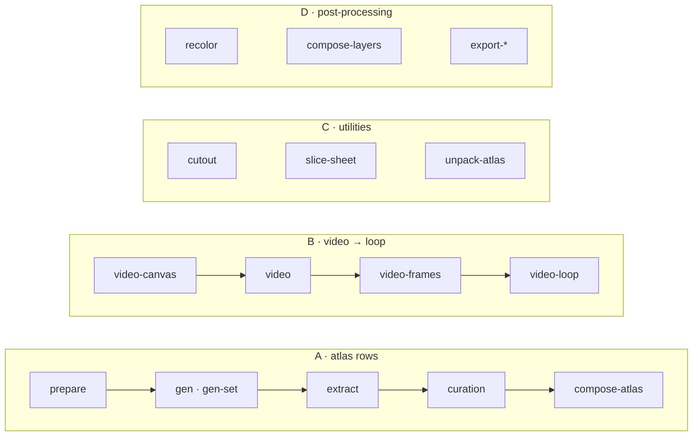

<h1 align="center">sprite-gen</h1>

<p align="center"><b>絵を一枚入れると、ゲームでそのまま使えるスプライトが出てくる — アトラスとしても、透明なモーションループとしても。</b></p>

<p align="center">

[English](README.md) · [한국어](README.ko.md) · **日本語** · [简体中文](README.zh-Hans.md) · [Español](README.es.md) · [Français](README.fr.md)

</p>

<p align="center">
  
  
  
  
  
</p>

<p align="center"><sub>上のループはすべて<b>静止画一枚</b>から生まれた: モーションに合うキャンバスへパディング → Grok Imagine で動かす → フレームごとにキーイング → 真の周期で切って透明 GIF に — パイプライン B、<code>sprite-gen video-set</code>。</sub></p>

---


画像モデルに「スプライトシート」を頼むと結果は分かっている: フレームごとに顔が変わるキャラ、キーアウトできない背景、重なってグリッドから外れるポーズ、ゲームエンジンが読めない PNG。デモとしては可愛く、アセットとしては役に立たない。

`sprite-gen` はその隙間を埋める Codex/Claude スキルであり Python CLI だ。**ベース画像一枚**を渡すと、行ごとに生成を進め、キャラの identity を固定し、クロマ背景を本物のアルファに剥がし、ポーズごとに綺麗な透明フレームを取り出し、**機械可読な `manifest.json.frame_layout`** 付きのランタイムアトラスを焼く。同じ静止画を動画モデルに渡せば、モーション状態ごとに継ぎ目のない透明ループが返ってくる。生成が最後まで合わせられない 10% は**キュレーション Webview** で比較・除外・微調整し、ループを実再生で確かめてから焼く。

## 4 本のパイプライン、1 つの CLI

どの verb も単独でも、パイプラインの一段としても使える。`sprite-gen --help` が同じ地図をドメイン別 verb で表示する。



| パイプライン | 入力 → 出力 | ドキュメント |
|---|---|---|
| **A · アトラス行** | 静止画 1 枚 + 状態リスト → `sprite-sheet-alpha.png` + `manifest.json.frame_layout`、idle には **Breathe** が焼き込まれる | [run-contract](docs/run-contract.md) · [breathing](docs/breathing.md) |
| **B · 動画 → ループ** | 静止画 1 枚 → 状態ごとに継ぎ目のない透明 GIF / WebP / ストリップ。Grok Imagine で動かし、真の周期で切る | [video-pipeline](docs/video-pipeline.md) · [video](docs/video.md) |
| **C · ユーティリティ** | 取り込んだ画像やグリッドシート → 綺麗な透明カット; 完成アトラス → キュレーション用 run | [sheet-slicing](docs/sheet-slicing.md) · [curation](docs/curation.md) |
| **D · 後処理** | 完成シート → 決定的なカラーウェイ、リグのレイヤー合成、Aseprite / Phaser / Flame 書き出し | [recolor](docs/recolor.md) · [layer-tracks](docs/layer-tracks.md) · [engine-export](docs/engine-export.md) |

全体索引: [`docs/README.md`](docs/README.md)。ドメイン図とパイプライン図のあるアーキテクチャ: [`docs/architecture.md`](docs/architecture.md)。

## 実際に得られるもの

- **透明なスプライトアトラス** (`sprite-sheet-alpha.png`) — 本物のアルファ、クロマのフリンジなし、白背景で検証済み ([なぜ剥がさず unmix するのか](docs/chroma-alpha.md))。
- **ランタイムマニフェスト** (`manifest.json.frame_layout`) — 絶対座標のフレーム矩形、状態ごとの fps と loop フラグ。エンジンは矩形を読むだけでグリッドを推測しない。
- **Breathe** — 静止 idle が生きたループになる。サイドカーのフィールド一つで、キュレーション済みフレームの上に決定的な squash & stretch を焼く。解剖学を認識し、ピクセルを保つ ([詳細](docs/breathing.md))。
- **グリッドを守るピクセルアート** — Backbone Lattice が被写体全体で一つのグリッドを測り、すべてのカットをそこに合わせる ([詳細](docs/pixel-unfake.md))。
- **動画からのモーションループ** — ジャンプは縦キャンバス、攻撃は横キャンバス、ループ点はクリップ自身の周期、単発アクションは rest → action → rest で切る ([詳細](docs/video-pipeline.md))。
- **決定的なカラーウェイ** — `recolor` がパレットマップから N 枚の派生シートを焼く。同じ入力、同じバイト ([詳細](docs/recolor.md))。
- **目で見られる QA** — 状態別 GIF とコンタクトシート。出荷前にモーションをモーションとして判定する。周期的ロコモーション(walk/run)はモーション QA を実際に通るまで実験扱い。

## クイックスタート

```bash
# install (Pillow, NumPy) into a fresh virtualenv — the venv is the only supported interpreter
python3 -m venv .venv && source .venv/bin/activate
pip install -e .
sprite-gen --help
```

**A · アトラス行** — 静止画 1 枚からランタイムアトラスへ。

```bash
# install (Pillow, NumPy) into a fresh virtualenv — the venv is the only supported interpreter
python3 -m venv .venv && source .venv/bin/activate
pip install -e .
sprite-gen --help
```

**B · 動画 → ループ** — 静止画 1 枚から透明ループへ (`ffmpeg`, `img2webp`, そして自分の `grok` ログインか `XAI_API_KEY` が必要)。

```bash
# install (Pillow, NumPy) into a fresh virtualenv — the venv is the only supported interpreter
python3 -m venv .venv && source .venv/bin/activate
pip install -e .
sprite-gen --help
```

**C · ユーティリティ** — それぞれ単独で使う。

```bash
# install (Pillow, NumPy) into a fresh virtualenv — the venv is the only supported interpreter
python3 -m venv .venv && source .venv/bin/activate
pip install -e .
sprite-gen --help
```

**D · 後処理** — 再生成せずに完成シートを整える。

```bash
# install (Pillow, NumPy) into a fresh virtualenv — the venv is the only supported interpreter
python3 -m venv .venv && source .venv/bin/activate
pip install -e .
sprite-gen --help
```

エージェント向けのワークフロー・ゲート・契約は [`SKILL.md`](SKILL.md) にある。

## スキルとしてインストール

```bash
python3 ~/.codex/skills/.system/skill-installer/scripts/install-skill-from-github.py \
  --repo aldegad/sprite-gen --path . --name sprite-gen
```

画像生成はこのエンジンの一部だ(`sprite_gen.gen`、プロバイダは `codex` と `grok`; 汎用の `image-gen` スキルはその上の薄いシャトル)。動画は**自分の**資格情報 — `grok` CLI のログインか `XAI_API_KEY` — を使い、リポジトリには何も同梱しない ([docs/video.md](docs/video.md))。

`sprite-gen` は CPython 3.10+ をサポートする。CI は 3.10 と 3.14 を回す。クイックスタートには `venv`/`ensurepip` が動く Python が必要。

## 出典

コンポーネント行ワークフローは Apache-2.0 の `hatch-pet` スキルに着想を得ているが、汎用のゲームスプライトアトラスを対象とし、ペットのパッケージや画像資産は含まない。

コミュニティの貢献・実験とその元 PR は [`CONTRIBUTORS.md`](CONTRIBUTORS.md) に記録している。

## ライセンス

Apache-2.0
