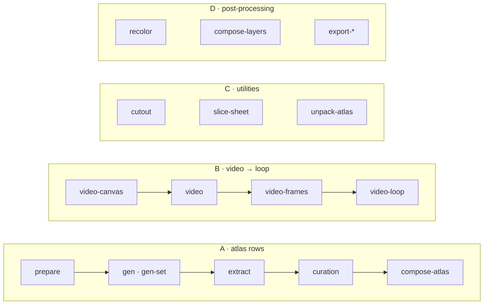

<h1 align="center">sprite-gen</h1>

<p align="center"><b>그림 한 장을 넣으면 게임에 바로 쓰는 스프라이트가 나온다 — 아틀라스로도, 투명 모션 루프로도.</b></p>

<p align="center">

[English](README.md) · **한국어** · [日本語](README.ja.md) · [简体中文](README.zh-Hans.md) · [Español](README.es.md) · [Français](README.fr.md)

</p>

<p align="center">
  
  
  
  
  
</p>

<p align="center"><sub>위 루프는 전부 <b>정지 이미지 한 장</b>에서 나왔다: 모션에 맞는 캔버스로 패딩 → Grok Imagine 으로 움직임 → 프레임마다 키잉 → 진짜 주기에서 잘라 투명 GIF 로 — 파이프라인 B, <code>sprite-gen video-set</code>.</sub></p>

---


이미지 모델에 "스프라이트 시트"를 부탁하면 결과는 뻔하다: 프레임마다 얼굴이 바뀌는 캐릭터, 키잉이 안 되는 배경, 겹치고 격자를 벗어나는 포즈, 게임 엔진이 소비할 수 없는 PNG. 데모로는 귀엽고 에셋으로는 무용지물.

`sprite-gen` 은 그 간극을 메우는 Codex/Claude 스킬이자 파이썬 CLI 다. **베이스 이미지 한 장**을 주면 행 단위로 생성을 몰고, 캐릭터 identity 를 고정하고, 크로마 배경을 진짜 알파로 벗기고, 포즈마다 깨끗한 투명 프레임을 뽑아 **기계가 읽는 `manifest.json.frame_layout`** 이 딸린 런타임 아틀라스를 굽는다. 같은 스틸을 영상 모델에 넘기면 모션 상태별로 이음새 없는 투명 루프가 돌아온다. 생성이 끝내 못 맞추는 마지막 10% 는 **큐레이션 웹뷰**에서 비교·거부·미세조정하고 루프를 실재생으로 본 뒤 굽는다.

## 파이프라인 4종, CLI 하나

모든 verb 는 단독으로도, 파이프라인 단계로도 쓴다. `sprite-gen --help` 가 같은 지도를 도메인별 verb 로 출력한다.



| 파이프라인 | 입력 → 출력 | 문서 |
|---|---|---|
| **A · 아틀라스 행** | 스틸 1장 + 상태 목록 → `sprite-sheet-alpha.png` + `manifest.json.frame_layout`, idle 에는 **Breathe** 가 구워짐 | [run-contract](docs/run-contract.md) · [breathing](docs/breathing.md) |
| **B · 영상 → 루프** | 스틸 1장 → 상태별 이음새 없는 투명 GIF / WebP / 스트립, Grok Imagine 으로 움직이고 진짜 주기에서 자름 | [video-pipeline](docs/video-pipeline.md) · [video](docs/video.md) |
| **C · 유틸** | 가져온 이미지·그리드 시트 → 깨끗한 투명 컷; 완성 아틀라스 → 큐레이션용 run | [sheet-slicing](docs/sheet-slicing.md) · [curation](docs/curation.md) |
| **D · 후처리** | 완성 시트 → 결정론 컬러웨이, 리그 레이어 합성, Aseprite / Phaser / Flame 내보내기 | [recolor](docs/recolor.md) · [layer-tracks](docs/layer-tracks.md) · [engine-export](docs/engine-export.md) |

전체 목차: [`docs/README.md`](docs/README.md). 도메인·파이프라인 다이어그램이 있는 아키텍처: [`docs/architecture.md`](docs/architecture.md).

## 실제로 얻는 것

- **투명 스프라이트 아틀라스** (`sprite-sheet-alpha.png`) — 진짜 알파, 크로마 프린지 없음, 흰 배경 대비 검증 ([왜 벗기지 않고 unmix 하나](docs/chroma-alpha.md)).
- **런타임 매니페스트** (`manifest.json.frame_layout`) — 절대 프레임 사각형, 상태별 fps 와 loop 플래그. 엔진은 사각형을 읽고 격자를 추측하지 않는다.
- **Breathe** — 정지 idle 이 살아 있는 루프가 된다. 사이드카 필드 하나로 큐레이션 프레임 위에 결정론 squash & stretch 를 굽는다. 해부학 인식, 픽셀 보존 ([상세](docs/breathing.md)).
- **격자를 지키는 픽셀아트** — Backbone Lattice 가 피사체 전체에 격자 하나를 재서 모든 컷을 거기에 맞춘다 ([상세](docs/pixel-unfake.md)).
- **영상에서 나오는 모션 루프** — 점프는 세로 캔버스, 공격은 가로 캔버스, 루프 포인트는 클립 자신의 주기, 단발 액션은 rest → action → rest 로 자른다 ([상세](docs/video-pipeline.md)).
- **결정론 컬러웨이** — `recolor` 가 팔레트 맵으로 N 개 변형 시트를 굽는다. 같은 입력, 같은 바이트 ([상세](docs/recolor.md)).
- **볼 수 있는 QA** — 상태별 GIF 와 컨택트 시트. 출하 전에 모션을 모션으로 판정한다. 순환 로코모션(walk/run)은 모션 QA 를 실제로 통과할 때까지 실험 단계다.

## 빠른 시작

```bash
# install (Pillow, NumPy) into a fresh virtualenv — the venv is the only supported interpreter
python3 -m venv .venv && source .venv/bin/activate
pip install -e .
sprite-gen --help
```

**A · 아틀라스 행** — 스틸 1장에서 런타임 아틀라스까지.

```bash
# install (Pillow, NumPy) into a fresh virtualenv — the venv is the only supported interpreter
python3 -m venv .venv && source .venv/bin/activate
pip install -e .
sprite-gen --help
```

**B · 영상 → 루프** — 스틸 1장에서 투명 루프까지 (`ffmpeg`, `img2webp`, 그리고 본인의 `grok` 로그인 또는 `XAI_API_KEY` 필요).

```bash
# install (Pillow, NumPy) into a fresh virtualenv — the venv is the only supported interpreter
python3 -m venv .venv && source .venv/bin/activate
pip install -e .
sprite-gen --help
```

**C · 유틸** — 각각 단독으로 쓴다.

```bash
# install (Pillow, NumPy) into a fresh virtualenv — the venv is the only supported interpreter
python3 -m venv .venv && source .venv/bin/activate
pip install -e .
sprite-gen --help
```

**D · 후처리** — 재생성 없이 완성 시트를 다듬는다.

```bash
# install (Pillow, NumPy) into a fresh virtualenv — the venv is the only supported interpreter
python3 -m venv .venv && source .venv/bin/activate
pip install -e .
sprite-gen --help
```

에이전트용 워크플로우·게이트·계약은 [`SKILL.md`](SKILL.md) 에 있다.

## 스킬로 설치

```bash
python3 ~/.codex/skills/.system/skill-installer/scripts/install-skill-from-github.py \
  --repo aldegad/sprite-gen --path . --name sprite-gen
```

이미지 생성은 이 엔진의 일부다(`sprite_gen.gen`, 프로바이더 `codex`·`grok`; 범용 `image-gen` 스킬은 그 위의 얇은 셔틀). 영상은 **본인의** 자격증명 — `grok` CLI 로그인 또는 `XAI_API_KEY` — 을 쓰고 레포에는 아무것도 들어 있지 않다 ([docs/video.md](docs/video.md)).

`sprite-gen` 은 CPython 3.10+ 를 지원한다. CI 는 3.10 과 3.14 를 돈다. 빠른 시작에는 `venv`/`ensurepip` 가 동작하는 파이썬이 필요하다.

## 출처

컴포넌트-행 워크플로우는 Apache-2.0 `hatch-pet` 스킬에서 영감을 받았지만 범용 게임 스프라이트 아틀라스를 목표로 하며 펫 패키지나 펫 비주얼 자산은 포함하지 않는다.

커뮤니티 기여·실험과 그 원 PR 은 [`CONTRIBUTORS.md`](CONTRIBUTORS.md) 에 기록한다.

## 라이선스

Apache-2.0
