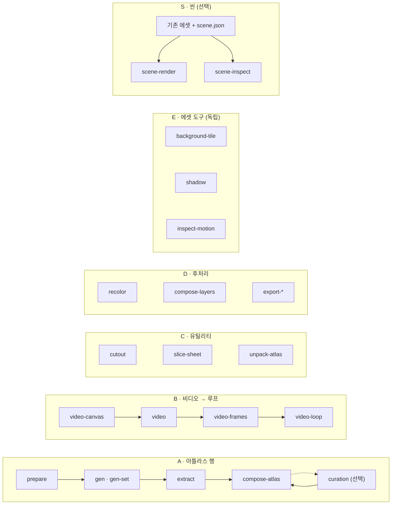

<h1 align="center">sprite-gen</h1>

<p align="center"><b>그림 한 장을 넣으면, 게임에 바로 쓸 수 있는 스프라이트가 나온다 — 아틀라스로, 또는 투명 모션 루프로.</b></p>

<p align="center">

[English](README.md) · **한국어** · [日本語](README.ja.md) · [简体中文](README.zh-Hans.md) · [Español](README.es.md) · [Français](README.fr.md)

</p>

<p align="center">
  <a href="https://youtu.be/zVu9YlbPtog"></a>
</p>

<p align="center"><sub>각 캐릭터는 <b>정지 이미지 한 장</b>에서 시작했다. 그록 이매진(Grok Imagine)이 생명을 불어넣었고, sprite-gen 이 투명 루프를 추출했으며, 하이퍼프레임즈(HyperFrames)가 이 쇼케이스를 조립했다.</sub></p>

<p align="center">
  
</p>

<p align="center"><sub>sprite-gen 에셋으로 만든 별개의 마을 구성. 이 GIF 는 10초 영상을 20fps, 256색 팔레트로 보존한다.</sub></p>

---

이미지 모델에 "스프라이트 시트"를 요청하면 어떤 결과가 나오는지는 이미 알 것이다. 프레임마다 얼굴이 바뀌는 캐릭터, 키잉이 안 되는 배경, 서로 겹치고 그리드에서 벗어나 떠도는 포즈, 그리고 게임 엔진이 실제로는 소비할 수 없는 PNG. 데모로는 귀엽지만 에셋으로는 쓸모없다.

`sprite-gen` 은 그 간극을 메우는 Codex/Claude 스킬이자 Python CLI 다. **기본 이미지 한 장**을 주면 행 단위로 생성을 이끌고, 캐릭터의 아이덴티티를 고정하고, 크로마 배경을 벗겨 진짜 알파로 만들고, 각 포즈를 깨끗한 투명 프레임으로 추출한 뒤, **기계가 읽을 수 있는 `manifest.json.frame_layout`** 과 함께 런타임 아틀라스를 굽는다. 또는 같은 정지 이미지를 비디오 모델에 넘겨 모션 상태별로 이음매 없는 투명 루프를 받을 수도 있다. 생성이 끝내 해결하지 못하는 마지막 10% 를 위해, **큐레이션 웹뷰**가 굽기 전에 비교·거부·미세 조정하고 루프를 실시간으로 확인하게 해준다.

## 요청으로 시작하기

**스프라이트**나 **이미지**를 요청하면 된다. 에이전트가 접근 권한을 확인하고, 빠진 프로바이더/모션 선택만 물어보고, 기존 파이프라인을 실행해 파일을 전달한다. 큐레이션 뷰는 선택 사항이다. 선택을 한 번 저장해 두면 스프라이트와 이미지 기본값을 따로 재사용할 수 있고, 일회성 요청은 그 값을 덮어쓰지 않는다. [사용자 워크플로와 기본값](docs/user-workflow.md).

## 파이프라인, 독립 도구, 씬

두 스프라이트 파이프라인은 순서가 정해진 생성 흐름이다. 도구 그룹은 독립적인 명령들을 담고 있고, 씬 생성은 완성된 에셋을 소비하는 선택적 워크플로다. `sprite-gen --help` 는 이 지도를 출력하고, 명령을 소유한 코드 도메인별로 묶어 보여준다.



| 파이프라인 / 도구 그룹 / 워크플로 | 무엇이 들어가고 → 무엇이 나오는가 | 문서 |
|---|---|---|
| **A · 아틀라스 행** | 정지 이미지 한 장 + 상태 목록 → `sprite-sheet-alpha.png` + `manifest.json.frame_layout`, 아이들 포즈에 **Breathe** 가 구워짐 | [run-contract](docs/run-contract.md) · [breathing](docs/breathing.md) |
| **B · 비디오 → 루프** | 정지 이미지 한 장 → 상태별로 이음매 없는 투명 GIF / WebP / 스트립, 그록 이매진이 움직이고 실제 주기에서 잘라냄 | [video-pipeline](docs/video-pipeline.md) · [video](docs/video.md) |
| **C · 유틸리티** | 가져온 이미지 또는 그리드 시트 → 깨끗한 투명 컷; 완성된 아틀라스 → 큐레이터가 바로 쓸 수 있는 런 | [sheet-slicing](docs/sheet-slicing.md) · [curation](docs/curation.md) |
| **D · 후처리** | 완성된 시트 → 결정론적 컬러웨이, 리그 레이어 합성, Aseprite / Phaser / Flame 익스포트 | [recolor](docs/recolor.md) · [layer-tracks](docs/layer-tracks.md) · [engine-export](docs/engine-export.md) |
| **E · 에셋 도구** | 독립적인 PNG 또는 애니메이션 → 반복 타일, 투영 그림자, 모션/접지 측정 | [asset-tools](docs/asset-tools.md) |
| **S · 씬** | 기존 에셋 + 배치, 카메라, 조명 → PNG 프레임, MP4/GIF, 검사 및 배치 메타데이터 | [scene](docs/scene.md) |

전체 색인: [`docs/README.md`](docs/README.md). 도메인 및 파이프라인 다이어그램이 포함된 아키텍처: [`docs/architecture.md`](docs/architecture.md).

## 실제로 얻는 것

- **투명 스프라이트 아틀라스** (`sprite-sheet-alpha.png`) — 진짜 알파, 남은 크로마 테두리 없음, 흰 배경 대비로 검증됨 ([추출기가 벗겨내는 대신 언믹싱하는 이유](docs/chroma-alpha.md)).
- **런타임 매니페스트** (`manifest.json.frame_layout`) — 절대 프레임 사각형, 상태별 fps 와 루프 플래그. 엔진은 사각형을 샘플링할 뿐, 그리드를 추측하지 않는다.
- **Breathe** — 정지된 아이들이 살아 있는 루프가 된다. 사이드카 필드 하나로 큐레이션한 프레임 위에 결정론적 스쿼시 & 스트레치를 굽고, 해부학을 인지하며 픽셀 단위로 정확하다 ([자세히](docs/breathing.md)).
- **그리드를 벗어나지 않는 픽셀 아트** — 백본 래티스(Backbone Lattice)가 피사체 전체에 대해 하나의 그리드를 측정하고 모든 컷을 거기에 고정한다 ([자세히](docs/pixel-unfake.md)).
- **비디오에서 나온 모션 루프** — 점프에는 세로로 긴 캔버스, 공격에는 가로로 넓은 캔버스가 주어지고, 루프 지점은 클립 자체의 주기이며, 일회성 동작은 대기 → 동작 → 대기로 잘린다 ([자세히](docs/video-pipeline.md)).
- **결정론적 컬러웨이** — `recolor` 가 팔레트 맵으로 N 개의 변형 시트를 굽는다. 같은 입력이면 같은 출력 바이트 ([자세히](docs/recolor.md)).
- **눈으로 확인하는 QA** — 상태별 GIF 와 컨택트 시트로, 무엇이든 출고되기 전에 모션을 모션으로서 판단한다. 주기적 이동(걷기/달리기)은 모션 QA 를 실제로 통과하기 전까지 실험적 상태로 남는다.
- **독립적인 에셋 도구** — 반복 배경을 만들고, 발 앵커에서 그림자를 투영하고, 타이밍·중복 포즈·접지 증거를 검사한다. 발이 모호하면 미검증 측정값이 나온다 ([자세히](docs/asset-tools.md)).
- **선택적 씬 생성** — 기존 PNG, 외부 프레임 시퀀스, 루프 스트립 또는 런타임 아틀라스를 이름 붙인 평면에 배치하고, 카메라 모션과 공유 그림자 투영을 적용한다. 스프라이트 생성은 이 단계 전에 끝나도 된다 ([자세히](docs/scene.md)).

## 퀵스타트

```bash
# 새 virtualenv 에 설치 (Pillow, NumPy) — venv 가 유일하게 지원되는 인터프리터다
python3 -m venv .venv && source .venv/bin/activate
pip install -e .
sprite-gen --help
```

**A · 아틀라스 행** — 정지 이미지 한 장에서 런타임 아틀라스로.

```bash
sprite-gen prepare --out-dir <run> --character-id <id> --base-image base.png   # 요청, 가이드, 프롬프트
sprite-gen gen-set --run-dir <run> --provider codex                            # 모든 상태 행, 한 번에 4개씩
sprite-gen extract --run-dir <run>                                             # 크로마 → 투명 프레임
sprite-gen compose-atlas --run-dir <run>                                       # sprite-sheet-alpha.png + manifest.json
sprite-gen curation --run-dir <run>                                            # (선택) 고르고, 미세 조정하고, breathe
```

**B · 비디오 → 루프** — 정지 이미지 한 장에서 투명 루프로 (`ffmpeg`, `img2webp`, 그리고 본인의 `grok` 로그인 또는 `XAI_API_KEY` 필요).

```bash
sprite-gen video-set --base side=still.png --states idle,walk,run,jump,attack --out-dir set/
# 항목별로: video-canvas → video → video-frames → video-loop; set/table.md 가 모든 결과의 이름을 담는다
```

**C · 유틸리티** — 각각 독립적으로 쓴다.

```bash
sprite-gen cutout icon.png --white-check              # 흰색/아이보리 → 매트, 마젠타/그린 → 크로마 엔진
sprite-gen slice-sheet --sheet sheet.png --chroma-key magenta --grid 3x2   # 다중 인물 시트 → 셀별 컷
sprite-gen unpack-atlas --atlas sheet.png             # 완성된 아틀라스 → 큐레이터용 런 (또는 --pngs-dir folder/)
```

**D · 후처리** — 다시 생성하지 않고 완성된 시트를 다듬는다.

```bash
sprite-gen recolor-palette --base <run>/sprite-sheet-alpha.png --out palette.draft.json
sprite-gen recolor --run-dir <run> --spec recolor.spec.json      # → <run>/variants/
sprite-gen compose-layers --run-dir <run>                        # 리그 런: 선언된 스택 → <run>/layers/
sprite-gen export-aseprite --run-dir <run>                       # Phaser / Flame 용 Aseprite JSON
```

**E · 에셋 도구** — 각각 다른 도구에서 나온 아트워크를 포함해 기존 에셋을 받는다.

```bash
sprite-gen background-tile --source background.png --period 512 --overlap 32 --out tile.png
sprite-gen shadow --source walk.strip.json --out-dir shadows/
sprite-gen inspect-motion --source walk.strip.json --out motion.json
# 같은 발 접지가 확실하고 발 ROI 가 분리되어 있을 때만:
sprite-gen inspect-motion --source walk.strip.json --contacts 0:4 --foot-box 20,70,32,10 --out stance.json
```

**S · 씬** — 선택적 구성 워크플로. [씬 계약](docs/scene.md)에 전체 스펙이 있다.

```bash
sprite-gen scene-render --spec scene.json --out-dir render/ --formats png,mp4 --export-layers
sprite-gen scene-inspect --spec scene.json --out scene-check.json
```

에이전트를 위한 워크플로, 게이트, 계약은 [`SKILL.md`](SKILL.md) 에 있다.

## 스킬로 설치하기

```bash
python3 ~/.codex/skills/.system/skill-installer/scripts/install-skill-from-github.py \
  --repo aldegad/sprite-gen --path . --name sprite-gen
```

이미지 생성은 이 엔진의 일부다 (`sprite_gen.gen`, 프로바이더 `codex` 와 `grok`; 범용 `image-gen` 스킬은 그 위에 얹힌 얇은 셔틀이다). 비디오는 **본인의** 자격 증명 — `grok` CLI 로그인 또는 `XAI_API_KEY` — 을 사용하며, 레포에는 아무것도 함께 배포되지 않는다 ([docs/video.md](docs/video.md)).

`sprite-gen` 은 CPython 3.10+ 를 지원하고, CI 는 3.10 과 3.14 에서 돈다. 퀵스타트에는 `venv`/`ensurepip` 이 동작하는 Python 이 필요하다.

## 출처 표기

컴포넌트 행 워크플로는 Apache-2.0 라이선스의 `hatch-pet` 스킬에서 영감을 받았지만, 범용 게임 스프라이트 아틀라스를 대상으로 하며 펫 패키지나 펫 비주얼 에셋은 포함하지 않는다.

커뮤니티 기여, 실험, 그리고 그 출발점이 된 풀 리퀘스트는 [`CONTRIBUTORS.md`](CONTRIBUTORS.md) 에 기록되어 있다.

## 라이선스

Apache-2.0