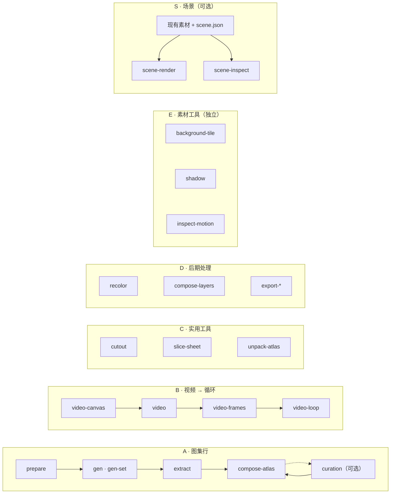

<h1 align="center">sprite-gen</h1>

<p align="center"><b>输入一张画稿，输出可直接用于游戏的精灵图 —— 以图集形式，或以透明动态循环形式。</b></p>

<p align="center">

[English](README.md) · [한국어](README.ko.md) · [日本語](README.ja.md) · **简体中文** · [Español](README.es.md) · [Français](README.fr.md)

</p>

<p align="center">
  <a href="https://youtu.be/zVu9YlbPtog"></a>
</p>

<p align="center"><sub>每个角色都始于<b>一张静态图</b>。Grok Imagine 让它动起来，sprite-gen 提取出透明循环，HyperFrames 组装了这段展示。</sub></p>

<p align="center">
  
</p>

<p align="center"><sub>另一段由 sprite-gen 素材构成的村庄合成。此 GIF 以 20 fps、256 色调色板保留了这段 10 秒视频。</sub></p>

---

向图像模型要一张"精灵表"，结果你心里有数：角色的脸每帧都在变，背景抠不干净，姿势互相重叠又偏离网格，输出的 PNG 你的游戏引擎根本用不了。演示很可爱，素材没法用。

`sprite-gen` 是一个 Codex/Claude 技能，同时也是一个 Python CLI，专门填补这道鸿沟。给它**一张基准图** —— 它会逐行驱动生成、锁定角色身份、把色键背景剥离为真正的 alpha、将每个姿势提取为干净的透明帧，并烘焙出**带有机器可读 `manifest.json.frame_layout`** 的运行时图集。或者把同一张静态图交给视频模型，为每个运动状态取回无缝的透明循环。至于生成永远搞不定的最后 10%，**策展网页视图**让你在烘焙前比较、剔除、微调，并实时观看循环效果。

## 从一个请求开始

你可以要**精灵图**，也可以要**一张图像**。代理会检查访问权限，只询问缺失的提供方/运动选项，运行既有流水线，然后交付文件。策展视图是可选的。保存一次你的选择，即可复用各自独立的精灵图与图像默认值；一次性请求不会覆盖它们。[用户工作流与默认值](docs/user-workflow.md)。

## 流水线、独立工具与场景

两条精灵图流水线是有序的生成流程。工具组包含彼此独立的命令；场景创建是一个消费成品素材的可选工作流。`sprite-gen --help` 会打印这张地图，并按拥有各命令的代码域进行分组。



| 流水线 / 工具组 / 工作流 | 输入什么 → 输出什么 | 文档 |
|---|---|---|
| **A · 图集行** | 一张静态图 + 一组状态列表 → `sprite-sheet-alpha.png` + `manifest.json.frame_layout`，并在待机姿势上烘焙 **Breathe** | [run-contract](docs/run-contract.md) · [breathing](docs/breathing.md) |
| **B · 视频 → 循环** | 一张静态图 → 每个状态一份无缝透明 GIF / WebP / 条带，由 Grok Imagine 驱动动画并按其真实周期裁切 | [video-pipeline](docs/video-pipeline.md) · [video](docs/video.md) |
| **C · 实用工具** | 一张导入图像或网格表 → 干净的透明切片；一份成品图集 → 可供策展的运行目录 | [sheet-slicing](docs/sheet-slicing.md) · [curation](docs/curation.md) |
| **D · 后期处理** | 一份成品表 → 确定性配色方案、骨骼图层合成、Aseprite / Phaser / Flame 导出 | [recolor](docs/recolor.md) · [layer-tracks](docs/layer-tracks.md) · [engine-export](docs/engine-export.md) |
| **E · 素材工具** | 独立的 PNG 或动画 → 可重复平铺图、投影阴影、运动/接地测量 | [asset-tools](docs/asset-tools.md) |
| **S · 场景** | 现有素材 + 摆放、相机与灯光 → PNG 帧、MP4/GIF、检查与摆放元数据 | [scene](docs/scene.md) |

完整索引：[`docs/README.md`](docs/README.md)。含域与流水线示意图的架构说明：[`docs/architecture.md`](docs/architecture.md)。

## 你实际得到什么

- **一张透明精灵图集**（`sprite-sheet-alpha.png`）—— 真正的 alpha，没有残留的色键边缘，并对照白色背景做过验证（[为什么提取器采用解混而非剥离](docs/chroma-alpha.md)）。
- **一份运行时清单**（`manifest.json.frame_layout`）—— 绝对帧矩形、每状态 fps 与循环标志。你的引擎按矩形取样，绝不去猜网格。
- **Breathe** —— 静止的待机变成有生命的循环，基于一个 sidecar 字段在你策展过的帧上烘焙确定性的挤压与拉伸，尊重解剖结构且像素精准（[详情](docs/breathing.md)）。
- **始终贴合网格的像素画** —— Backbone Lattice 为整个主体测量出一套网格，并让每一次切割都严格遵守它（[详情](docs/pixel-unfake.md)）。
- **来自视频的运动循环** —— 跳跃使用高画布，攻击使用宽画布，循环点取自片段自身的周期，而一次性动作按 静止 → 动作 → 静止 裁切（[详情](docs/video-pipeline.md)）。
- **确定性配色方案** —— `recolor` 依据调色板映射烘焙出 N 份变体表；相同输入，相同输出字节。（[详情](docs/recolor.md)）。
- **可以亲眼检验的 QA** —— 每状态 GIF 与contact sheet，让运动在交付前先以运动的方式被评判。除非运动 QA 真正通过，循环式位移（走/跑）始终视为实验性。
- **独立的素材工具** —— 构建可重复的背景、从脚部锚点投射阴影，并检查时序、重复姿势与接地证据。脚部含糊不清时将产出一份未经验证的测量结果（[详情](docs/asset-tools.md)）。
- **可选的场景创建** —— 把现有 PNG、外部帧序列、循环条带或运行时图集摆放到命名平面上，配合相机运动与共享阴影投射。精灵图生成可以在这一步之前就完成（[详情](docs/scene.md)）。

## 快速开始

```bash
# 安装（Pillow、NumPy）到全新虚拟环境 —— venv 是唯一受支持的解释器
python3 -m venv .venv && source .venv/bin/activate
pip install -e .
sprite-gen --help
```

**A · 图集行** —— 从一张静态图到运行时图集。

```bash
sprite-gen prepare --out-dir <run> --character-id <id> --base-image base.png   # 请求、指南、提示词
sprite-gen gen-set --run-dir <run> --provider codex                            # 每个状态行，一次 4 个
sprite-gen extract --run-dir <run>                                             # 色键 → 透明帧
sprite-gen compose-atlas --run-dir <run>                                       # sprite-sheet-alpha.png + manifest.json
sprite-gen curation --run-dir <run>                                            # （可选）挑选、微调、呼吸
```

**B · 视频 → 循环** —— 从一张静态图到透明循环（需要 `ffmpeg`、`img2webp`，以及你自己的 `grok` 登录或 `XAI_API_KEY`）。

```bash
sprite-gen video-set --base side=still.png --states idle,walk,run,jump,attack --out-dir set/
# 每项依次：video-canvas → video → video-frames → video-loop；set/table.md 列出每个结果的名称
```

**C · 实用工具** —— 每个都可独立使用。

```bash
sprite-gen cutout icon.png --white-check              # 白/象牙 → 哑光, 洋红/绿 → 色键引擎
sprite-gen slice-sheet --sheet sheet.png --chroma-key magenta --grid 3x2   # 多角色表 → 逐格切片
sprite-gen unpack-atlas --atlas sheet.png             # 成品图集 → 可供策展的运行目录（或 --pngs-dir folder/）
```

**D · 后期处理** —— 不重新生成即可精修成品表。

```bash
sprite-gen recolor-palette --base <run>/sprite-sheet-alpha.png --out palette.draft.json
sprite-gen recolor --run-dir <run> --spec recolor.spec.json      # → <run>/variants/
sprite-gen compose-layers --run-dir <run>                        # 骨骼运行：声明的图层栈 → <run>/layers/
sprite-gen export-aseprite --run-dir <run>                       # 供 Phaser / Flame 使用的 Aseprite JSON
```

**E · 素材工具** —— 每个都接受现有素材，包括来自其他工具的美术资源。

```bash
sprite-gen background-tile --source background.png --period 512 --overlap 32 --out tile.png
sprite-gen shadow --source walk.strip.json --out-dir shadows/
sprite-gen inspect-motion --source walk.strip.json --out motion.json
# 仅在已知同一只脚接地且脚部 ROI 已隔离时使用：
sprite-gen inspect-motion --source walk.strip.json --contacts 0:4 --foot-box 20,70,32,10 --out stance.json
```

**S · 场景** —— 一个可选的合成工作流。[场景契约](docs/scene.md)包含完整规格。

```bash
sprite-gen scene-render --spec scene.json --out-dir render/ --formats png,mp4 --export-layers
sprite-gen scene-inspect --spec scene.json --out scene-check.json
```

面向代理的工作流、门禁与契约位于 [`SKILL.md`](SKILL.md)。

## 作为技能安装

```bash
python3 ~/.codex/skills/.system/skill-installer/scripts/install-skill-from-github.py \
  --repo aldegad/sprite-gen --path . --name sprite-gen
```

图像生成是本引擎的一部分（`sprite_gen.gen`，提供方 `codex` 与 `grok`；通用的 `image-gen` 技能只是覆在其上的一层薄封装）。视频使用**你自己的**凭据 —— `grok` CLI 登录或 `XAI_API_KEY` —— 仓库中不附带任何凭据（[docs/video.md](docs/video.md)）。

`sprite-gen` 支持 CPython 3.10+；CI 运行 3.10 与 3.14。快速开始需要一个 `venv`/`ensurepip` 可用的 Python。

## 致谢

组件行工作流受 Apache-2.0 许可的 `hatch-pet` 技能启发，但面向通用的游戏精灵图集，不包含任何宠物包或宠物视觉素材。

社区贡献、实验及其来源的 pull request 记录在 [`CONTRIBUTORS.md`](CONTRIBUTORS.md)。

## 许可证

Apache-2.0