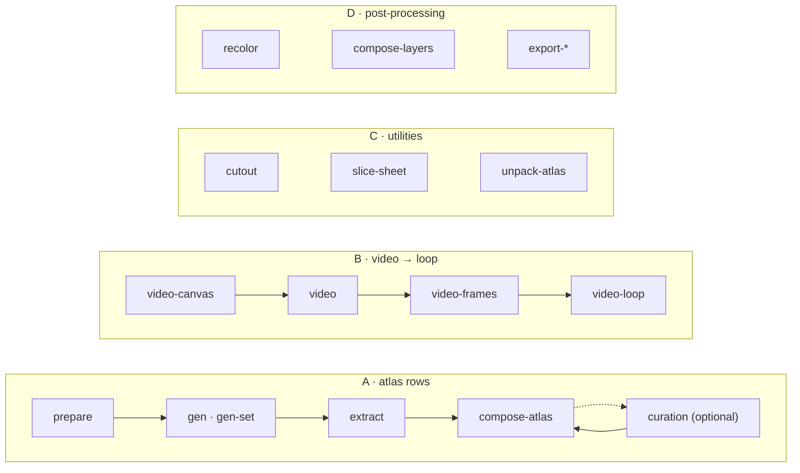

<h1 align="center">sprite-gen</h1>

<p align="center"><b>放进一张画，出来的是游戏可直接使用的精灵 — 既可以是图集，也可以是透明的动作循环。</b></p>

<p align="center">

[English](README.md) · [한국어](README.ko.md) · [日本語](README.ja.md) · **简体中文** · [Español](README.es.md) · [Français](README.fr.md)

</p>

<p align="center">
  <a href="https://youtu.be/zVu9YlbPtog"></a>
</p>

<p align="center"><sub>每个角色都始于<b>一张静态图</b>。Grok Imagine 生成动作，sprite-gen 提取透明循环动画，再由 HyperFrames 合成这一场景。</sub></p>

---


向图像模型要一张“精灵表”，结果可想而知：每帧都在变脸的角色、抠不掉的背景、重叠且偏离网格的姿势、游戏引擎根本无法消费的 PNG。做演示可爱，做资产无用。

`sprite-gen` 是补上这道缺口的 Codex/Claude 技能兼 Python CLI。给它**一张基础图**——它逐行驱动生成、锁定角色 identity、把色键背景剥成真正的 alpha、把每个姿势提取为干净的透明帧，并烘焙出带**机器可读 `manifest.json.frame_layout`** 的运行时图集。把同一张静止图交给视频模型，就能得到每个动作状态一段无缝透明循环。生成永远做不对的最后 10%，交给**策展 Webview**：对比、剔除、微调，实时观看循环后再烘焙。

## 从请求开始

请求**制作精灵图**或**生成图片**。代理检查使用状态，只询问尚未指定的生成工具和动作方式，再通过现有流程交付结果。筛选视图可选。两种用途可分别保存默认设置；单次请求不会覆盖已保存的设置。[请求流程与默认设置](docs/user-workflow.md)。

## 四条流水线，一个 CLI

每个 verb 既能单独使用，也能作为流水线的一环。`sprite-gen --help` 会按领域分组打印同一张地图。



| 流水线 | 输入 → 输出 | 文档 |
|---|---|---|
| **A · 图集行** | 一张静止图 + 状态列表 → `sprite-sheet-alpha.png` + `manifest.json.frame_layout`，idle 上烘焙 **Breathe** | [run-contract](docs/run-contract.md) · [breathing](docs/breathing.md) |
| **B · 视频 → 循环** | 一张静止图 → 每个状态一段无缝透明 GIF / WebP / 条带，由 Grok Imagine 驱动并在真实周期处剪切 | [video-pipeline](docs/video-pipeline.md) · [video](docs/video.md) |
| **C · 工具** | 导入的图片或网格表 → 干净的透明切片；成品图集 → 可策展的 run | [sheet-slicing](docs/sheet-slicing.md) · [curation](docs/curation.md) |
| **D · 后处理** | 成品表 → 确定性配色变体、绑定图层合成、Aseprite / Phaser / Flame 导出 | [recolor](docs/recolor.md) · [layer-tracks](docs/layer-tracks.md) · [engine-export](docs/engine-export.md) |

完整索引：[`docs/README.md`](docs/README.md)。含领域图与流水线图的架构：[`docs/architecture.md`](docs/architecture.md)。

## 你实际得到的

- **透明精灵图集**（`sprite-sheet-alpha.png`）— 真 alpha，无色键残边，已对白底验证（[为何解混而不是剥离](docs/chroma-alpha.md)）。
- **运行时清单**（`manifest.json.frame_layout`）— 绝对帧矩形、每状态 fps 与 loop 标志。引擎读取矩形，从不猜网格。
- **Breathe** — 静止 idle 变成活的循环：一个 sidecar 字段，在策展帧上烘焙确定性的挤压拉伸，识别体态、保持像素（[详情](docs/breathing.md)）。
- **守住网格的像素画** — Backbone Lattice 为整个主体测出一套网格，并让每次切割都对齐它（[详情](docs/pixel-unfake.md)）。
- **来自视频的动作循环** — 跳跃用竖画布，攻击用横画布，循环点是片段自身的周期，单次动作按 rest → action → rest 剪切（[详情](docs/video-pipeline.md)）。
- **确定性配色变体** — `recolor` 用调色板映射烘焙 N 张变体表；同样输入，同样字节（[详情](docs/recolor.md)）。
- **看得见的 QA** — 每状态的 GIF 与联系表，出货前把动作当动作来评判。循环移动（walk/run）在真正通过动作 QA 之前保持实验状态。

## 快速开始

```bash
# install (Pillow, NumPy) into a fresh virtualenv — the venv is the only supported interpreter
python3 -m venv .venv && source .venv/bin/activate
pip install -e .
sprite-gen --help
```

**A · 图集行** — 从一张静止图到运行时图集。

```bash
# install (Pillow, NumPy) into a fresh virtualenv — the venv is the only supported interpreter
python3 -m venv .venv && source .venv/bin/activate
pip install -e .
sprite-gen --help
```

**B · 视频 → 循环** — 从一张静止图到透明循环（需要 `ffmpeg`、`img2webp`，以及你自己的 `grok` 登录或 `XAI_API_KEY`）。

```bash
# install (Pillow, NumPy) into a fresh virtualenv — the venv is the only supported interpreter
python3 -m venv .venv && source .venv/bin/activate
pip install -e .
sprite-gen --help
```

**C · 工具** — 各自独立使用。

```bash
# install (Pillow, NumPy) into a fresh virtualenv — the venv is the only supported interpreter
python3 -m venv .venv && source .venv/bin/activate
pip install -e .
sprite-gen --help
```

**D · 后处理** — 不重新生成即可打磨成品表。

```bash
# install (Pillow, NumPy) into a fresh virtualenv — the venv is the only supported interpreter
python3 -m venv .venv && source .venv/bin/activate
pip install -e .
sprite-gen --help
```

面向 agent 的工作流、门禁与契约见 [`SKILL.md`](SKILL.md)。

## 作为技能安装

```bash
python3 ~/.codex/skills/.system/skill-installer/scripts/install-skill-from-github.py \
  --repo aldegad/sprite-gen --path . --name sprite-gen
```

图像生成是本引擎的一部分（`sprite_gen.gen`，提供方 `codex` 与 `grok`；通用 `image-gen` 技能只是其上的薄壳）。视频使用**你自己的**凭据——`grok` CLI 登录或 `XAI_API_KEY`——仓库不附带任何凭据（[docs/video.md](docs/video.md)）。

`sprite-gen` 支持 CPython 3.10+；CI 运行 3.10 与 3.14。快速开始需要 `venv`/`ensurepip` 可用的 Python。

## 致谢

组件行工作流受 Apache-2.0 许可的 `hatch-pet` 技能启发，但面向通用游戏精灵图集，不包含任何宠物包或宠物视觉资产。

社区贡献、实验及其来源 PR 记录在 [`CONTRIBUTORS.md`](CONTRIBUTORS.md)。

## 许可证

Apache-2.0
