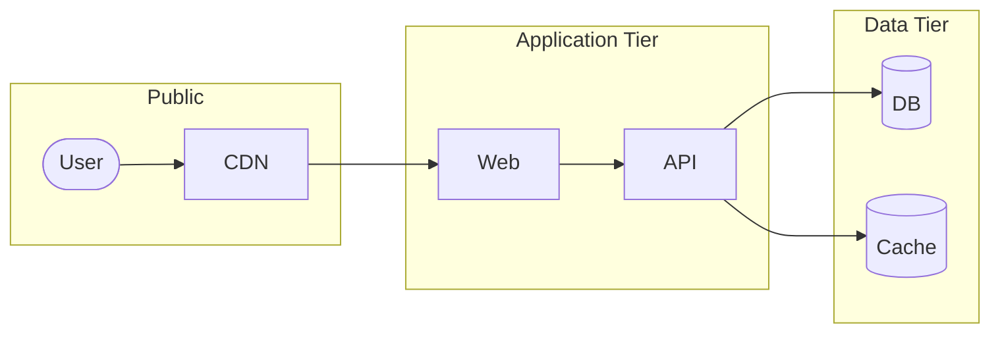

## Diagram type

| Showing | Use |
| - | - |
| Components and how data/requests flow between them | `flowchart` |
| Messages between actors over time | `sequenceDiagram` |
| One entity's lifecycle (states + transitions) | `stateDiagram-v2` |
| Data model / schema | `erDiagram` |
| Pipeline (CI/CD, build, ETL) | `flowchart TB` |
| OO class hierarchy | `classDiagram` |
| User journey through a product | `journey` |
| Project plan | `gantt` |
| Categorical breakdown | `pie` |

Architecture default: `flowchart LR` for service-shaped projects (web app, API + workers +
DB, microservices). `flowchart TB` when progression is the point.

## Shapes

Shape encodes component type, never decoration.

| Syntax | Component |
| - | - |
| `[Service Name]` | Service, application, generic box |
| `([User])` | External actor, user, client |
| `[(Database)]` | Database, persistent store |
| `[[Queue]]` | Queue, message bus, subroutine |
| `>Note]` | Annotation |
| `{Decision?}` | Branch in a pipeline |

## Arrows

| Syntax | Meaning |
| - | - |
| `-->` | Synchronous call / hard dependency |
| `-.->` | Async, optional, or fallback |
| `==>` | Primary / emphasized path |
| `--x` | Failure or terminating path |

Happy path solid; async/optional/fallback paths dotted; failure paths use `--x`.

## Subgraphs

Group by bounded context, deployment unit, or trust boundary. One to three per diagram.



## Limits

- Readable on a phone. Sprawling → split into multiple diagrams.
- System too complex for any single diagram → split, or recommend Structurizr / C4 or
  Excalidraw exports.

## Render targets

| Renders Mermaid | Does not |
| - | - |
| GitHub · GitLab · Bitbucket Cloud · Gitea / Forgejo · VS Code preview · Docusaurus, MkDocs, Hugo (with plugin) | npm package page · PyPI package page · Confluence without a plugin |

Target doesn't render → keep the Mermaid source, and tell the user to render it once to
SVG and commit the SVG as a fallback.

## Troubleshooting

| Symptom | Fix |
| - | - |
| Shows as a literal code block on GitHub | Fence must be exactly ` ```mermaid `; file must be `.md` |
| Syntax error | Validate the diagram with a Mermaid validator tool, or <https://mermaid.live> |
| Label overflow | `<br/>` inside the label, or shorten and move detail to the prose |
| Crossing arrows | Flip direction (`LR` ↔ `TB`) or split the diagram |
