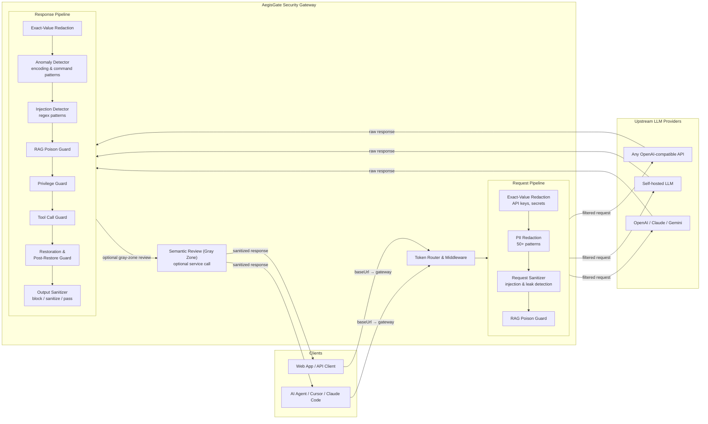

# AegisGate

> **English** | **[中文](README_zh.md)**

**Open-source security gateway for LLM API calls** — sits between your AI agents/apps and upstream LLM providers, enforcing security policies on both request and response sides.

## What is AegisGate?

AegisGate is a self-hosted, pipeline-based security proxy designed to protect LLM API traffic. Point your application's `baseUrl` at the gateway, and it automatically applies PII redaction, prompt injection detection, dangerous command blocking, and output sanitization before forwarding to the real upstream model.

### Key Features

- **Prompt Injection Protection** — Multi-layer detection: regex patterns, optional semantic review (gray-zone gated: `AEGIS_ENABLE_SEMANTIC_MODULE` + `AEGIS_SEMANTIC_SERVICE_URL` + `AEGIS_SEMANTIC_GRAY_LOW/HIGH`), Unicode/encoding attack detection, typoglycemia defense
- **PII / Secret Redaction** — 50+ pattern categories covering API keys, tokens, credit cards, SSNs, crypto wallet addresses/seed phrases, medical records, and infrastructure identifiers. On the three structured LLM routes (`/v1/chat/completions`, `/v1/responses`, `/v1/messages`) a credential-only subset runs by default to avoid corrupting prompts — see [PII Redaction Coverage](#pii-redaction-coverage-50-categories)
- **Dangerous Response Sanitization** — Automatic obfuscation of high-risk LLM outputs (shell commands, SQL injection payloads, HTTP smuggling) with configurable security levels (low/medium/high)
- **OpenAI-Compatible + Anthropic Messages API** — Drop-in routes for `/v1/chat/completions`, `/v1/responses`, `/v1/messages`, and the generic proxy; works with OpenAI-compatible providers and Anthropic-compatible Messages upstreams
- **Anthropic ↔ OpenAI Protocol Conversion** — Token-based `compat` mode converts Anthropic `/v1/messages` requests to OpenAI `/v1/responses` on the fly, enabling Claude Code / Anthropic SDK to talk to OpenAI-compatible upstreams (GPT-5.4, etc.) without code changes
- **MCP & Agent SKILL Support** — Integrates with Cursor, Claude Code, Codex, Windsurf and other AI coding agents via Model Context Protocol
- **Token-Based Routing** — Route requests to multiple upstream providers through a single gateway with per-token upstream mapping and whitelist controls
- **Web Management Console** — Built-in admin UI for configuration, token management, security rules CRUD, key rotation, and real-time request statistics
- **Flexible Deployment** — Docker Compose one-click deploy, supports SQLite/Redis/PostgreSQL backends, Caddy TLS termination

### Use Cases

- **Protect sensitive data** from leaking to LLM providers (PII, API keys, internal URLs)
- **Detect and block prompt injection attacks** in real-time across your AI agent fleet
- **Centralize security policy** instead of implementing protections in every AI application
- **Audit LLM interactions** with structured logging, risk scoring, and dangerous content tracking
- **Secure MCP tool calls** — guard against malicious tool invocations and privilege escalation

### How It Compares

| Feature | AegisGate | LLM Guard | Rebuff | Prompt Armor |
|---------|-----------|-----------|--------|--------------|
| Self-hosted gateway proxy | Yes | Library only | API service | API service |
| Request + Response filtering | Both sides | Both sides | Request only | Request only |
| OpenAI-compatible drop-in | Yes | No | No | No |
| Built-in PII redaction | 50+ patterns | Yes | No | No |
| Web management UI | Yes | No | No | Dashboard |
| MCP / Agent SKILL support | Yes | No | No | No |
| Token-based multi-upstream routing | Yes | N/A | N/A | N/A |
| No external API dependency | Yes (core filters local; semantic service optional) | Yes | No (OpenAI) | No |
| Bilingual (EN/ZH) | Yes | English | English | English |

> Comparison compiled from each project's public documentation, last checked 2026-08. Those projects move independently of this one — verify against their current docs before relying on a row.

> **Quick start:** create `cliproxyapi_default` and `sub2api-deploy_sub2api-network` first, then run `docker compose up -d --build` — gateway runs on port 18080, admin UI login at `http://localhost:18080/__ui__/login`

### Architecture



### Frequently Asked Questions

**What is AegisGate?**
AegisGate is an open-source, self-hosted security gateway that sits between your AI applications and LLM API providers. It inspects and filters both requests and responses in real-time, protecting against prompt injection, PII leakage, and dangerous LLM outputs.

**How does AegisGate detect prompt injection?**
AegisGate uses a multi-layer approach: (1) bilingual regex patterns for known injection techniques (direct injection, system prompt exfiltration, typoglycemia obfuscation), (2) an optional semantic-review stage that is gray-zone gated by `AEGIS_SEMANTIC_GRAY_LOW/HIGH` (enabled by `AEGIS_ENABLE_SEMANTIC_MODULE`, service-backed via `AEGIS_SEMANTIC_SERVICE_URL`), and (3) Unicode/encoding attack detection for invisible characters, bidirectional control abuse, and multi-stage encoded payloads.

**Does AegisGate work with OpenAI, Claude, and other LLM providers?**
Yes. AegisGate provides an OpenAI-compatible API (`/v1/chat/completions`, `/v1/responses`) and a token-based generic HTTP proxy (`/v2/__gw__/t/<token>/...`, with `x-target-url` + `AEGIS_V2_TARGET_ALLOWLIST`). Applications that support a custom `baseUrl` can use the OpenAI-compatible routes as a drop-in proxy, and HTTP tooling can use the v2 token route when a generic proxy is needed. It has been verified with OpenAI, Claude (via compatible proxies), Gemini, and any OpenAI-compatible API.

**What data does AegisGate redact?**
Over 50 PII pattern categories including: API keys and tokens (OpenAI, AWS, GitHub, Slack), credit card numbers, SSNs, email addresses, phone numbers, crypto wallet addresses and seed phrases, medical record numbers, IP addresses, internal URLs, and infrastructure identifiers. Custom exact-value redaction is also supported for arbitrary secrets.
Which of them run depends on the route. `/v1/chat/completions`, `/v1/responses` and `/v1/messages` carry structured conversation payloads, so by default only the credential-only `redaction.relaxed_pii_ids` subset runs there (13 of the 56 shipped patterns — tokens, tokens in URL query strings, JWT, session cookies, PEM private keys, AWS/GitHub/Slack keys, exchange secrets, crypto WIF/xprv/seed phrases). Other `/v1/` routes run the full set, and `/v2/` runs the same relaxed set as the conversation routes. Set `redaction.relaxed_pii_ids: ["*"]` in `security_filters.yaml` to run all patterns everywhere the relaxed set applies. Full breakdown in [PII Redaction Coverage](#pii-redaction-coverage-50-categories).

**Can I use AegisGate with AI coding agents like Cursor, Claude Code, or Codex?**
Yes. AegisGate supports MCP (Model Context Protocol) and Agent SKILL integration. Point your agent's `baseUrl` to the gateway and it will transparently filter all LLM traffic. See [SKILL.md](SKILL.md) for agent-specific setup instructions.

**How does AegisGate handle dangerous LLM responses?**
Responses are scored by multiple filters (injection detector, anomaly detector, privilege guard, tool call guard). Based on the cumulative risk score and configurable security level (low/medium/high), the gateway either passes the response through, sanitizes dangerous fragments (replacing them with safe markers), or blocks the entire response. Streaming responses are checked incrementally and can be terminated mid-stream.

**Does AegisGate require an external AI service for detection?**
Not for baseline protection. Regex-based detection, redaction, response sanitization, and routing safeguards run locally. The optional semantic-review stage is gray-zone gated (by `AEGIS_SEMANTIC_GRAY_LOW/HIGH`); when enabled, the gateway queries `AEGIS_SEMANTIC_SERVICE_URL` only for gray-zone cases. If the URL is empty, those gray-zone cases record `semantic_service_unconfigured` and continue without semantic escalation. The repository still ships local TF-IDF assets and training scripts for offline experiments (not wired into the default gateway path).

**How do I deploy AegisGate?**
The recommended method is Docker Compose. With the stock `docker-compose.yml`, create the referenced external networks first (`cliproxyapi_default` and `sub2api-deploy_sub2api-network`), then run `docker compose up -d --build`. The gateway runs on port 18080 with a built-in web management console at `/__ui__/login`. It supports SQLite (default), Redis, or PostgreSQL as storage backends. For production, place Caddy or nginx in front for TLS termination.


## Getting Started

### Docker Compose (Recommended)

```bash
git clone https://github.com/ax128/AegisGate.git
cd AegisGate
# The stock compose file references these external Docker networks by default.
# Create them first, or override/remove those network attachments for your setup.
docker network create cliproxyapi_default || true
docker network create sub2api-deploy_sub2api-network || true
docker compose up -d --build
```

Health check: `curl http://127.0.0.1:18080/health`

Readiness check: `curl http://127.0.0.1:18080/ready`

The response body carries a `checks` map and a `degraded_checks` list. Two checks are
reported without failing readiness:

- `security_rules` reads `stale: <error>` when the rules file on disk stops parsing.
  The gateway keeps enforcing the last document it loaded successfully, so it is still
  ready to serve — and since every replica reads the same file, failing readiness there
  would drop them all at once and turn a config typo into an outage.
- `risk_gate` reads `unreachable: security_level=… effective_threshold=…` when the
  effective risk threshold has been clamped above every score an `action_map` action
  can assign, which makes every "raise the risk, set no disposition" `block` entry a
  no-op. On `AEGIS_SECURITY_LEVEL=low` that is the definition of the tier, not a fault
  — hence non-gating. It is reported because the *other* way to reach this state is a
  regression, and until now the condition had no outlet anywhere. Filters that set a
  disposition directly are unaffected either way, which is what makes the failure
  partial and easy to miss.

Alert on `degraded_checks` rather than on the status code alone.

Admin UI login: `http://localhost:18080/__ui__/login`

### Gateway Key (admin endpoints + UI login)

The gateway key is generated on first start into `config/aegis_gateway.key` (chmod 600). The same
value authenticates every `/__gw__/*` admin endpoint (as the `gateway_key` JSON field) **and** is the
password for the admin UI — there is no default password.

```bash
# Bare metal / local run
cat config/aegis_gateway.key

# Docker: the file lives inside the container
docker compose exec aegisgate cat config/aegis_gateway.key
```

Override it with `AEGIS_GATEWAY_KEY` for Docker/CI. Rotate it from the console's key-management page
or by replacing the file contents and restarting. See [WEBUI-QUICKSTART.md](WEBUI-QUICKSTART.md) for
the full console guide.

Notes:

- The stock `docker-compose.yml` is not a fully standalone "single container only" compose file: it joins external Docker networks for CLIProxyAPI and Sub2API by default.
- The same compose file also sets `AEGIS_DOCKER_UPSTREAMS=8317:cli-proxy-api,8080:sub2api,3000:aiclient2api`. These startup-injected Docker service mappings take precedence over numeric host-port fallback for the same token.

### Local Development (No Docker)

The repo ships a launcher that creates the venv, installs the project, bootstraps
`config/.env` and the policy YAML, and runs the gateway in the background:

```bash
python aegisgate-local.py install    # create .venv and install
python aegisgate-local.py init       # bootstrap config/.env and default policies
python aegisgate-local.py start      # start in the background
python aegisgate-local.py status     # or: logs --tail 50 / restart / stop / open-ui
```

`start --foreground` runs in the foreground, `start --skip-install` skips the venv
step, and `install --extras semantic,redis` selects optional dependency groups.
The launcher writes its own state and output under `logs/launcher/`, and falls back
to a user-local SQLite path when the default one is not writable. Full command
reference: [WEBUI-QUICKSTART.md](WEBUI-QUICKSTART.md) §2.

Or drive uvicorn yourself:

```bash
python3 -m venv .venv && source .venv/bin/activate
pip install -e ".[dev,semantic]"
uvicorn aegisgate.core.gateway:app --host 127.0.0.1 --port 18080
```

**One worker only.** See [Deployment Model](#deployment-model) — the gateway logs
its pid and instance id at startup and raises an ERROR when the environment
implies more than one worker.

### Changing the Port

Under Docker, the listener follows `AEGIS_PORT`. Change it in three places so the
published mapping, the inter-container address and the listener agree:

```yaml
ports:
  - "127.0.0.1:28080:28080"    # host mapping
expose:
  - "28080"                     # container-to-container
environment:
  AEGIS_PORT: "28080"           # the listener, and the Base URLs the console renders
```

`AEGIS_HOST` is not used for binding inside the container — the image always binds
`0.0.0.0` and the network boundary is the published port mapping. On bare metal,
pass `--host`/`--port` to uvicorn, or let `aegisgate-local.py` read them from `config/.env`.

## Upstream Integration

AegisGate is a standalone security proxy layer — it does **not** manage upstream services. Upstreams run independently per their own documentation; client requests pass through the gateway.

### Verified Upstreams

| Upstream | Description | Default Port |
|----------|-------------|-------------|
| [CLIProxyAPI](https://github.com/router-for-me/CLIProxyAPI) | OAuth multi-account LLM proxy (Claude/Gemini/OpenAI) | 8317 |
| [Sub2API](https://github.com/Wei-Shaw/sub2api) | AI API subscription platform (Claude/Gemini/Antigravity) | 8080 |
| [AIClient-2-API](https://github.com/justlovemaki/AIClient-2-API) | Multi-source AI client proxy (Gemini CLI/Codex/Kiro/Grok) | 3000 |
| Any OpenAI-compatible API | — | — |

### Scenario 1: Co-located Deployment (gateway and upstream on same server)

AegisGate supports two same-host patterns:

- **Host port routing**: numeric token routes such as `/v1/__gw__/t/8317/...` resolve to `http://<local-port-host>:8317/v1` when `AEGIS_ENABLE_LOCAL_PORT_ROUTING=true`. The stock Docker compose enables this by default; bare-metal deployments must enable it explicitly.
- **Docker service mapping**: when `AEGIS_DOCKER_UPSTREAMS` is set, startup injects token -> service-name mappings such as `8317 -> http://cli-proxy-api:8317/v1`. These mappings override numeric host-port fallback for the same token.

Host-port routing shape:

```
Client → http://<gateway-ip>:18080/v1/__gw__/t/{port}/... → localhost:{port}/v1/...
```

| Upstream | Client Base URL |
|----------|----------------|
| CLIProxyAPI | `http://<gateway-ip>:18080/v1/__gw__/t/8317` |
| Sub2API | `http://<gateway-ip>:18080/v1/__gw__/t/8080` |
| AIClient-2-API | `http://<gateway-ip>:18080/v1/__gw__/t/3000` |

- `Authorization: Bearer <key>` is passed through to upstream transparently
- Multiple upstreams can be used simultaneously
- For host-port routing, no token registration is required
- Supports filter mode suffixes: `token__redact` (redaction only) or `token__passthrough` (full passthrough)
  - `token__passthrough` still keeps the OpenAI compatibility layer: gateway-only fields are stripped before forwarding, and Chat/Responses parameter compatibility is preserved
- **Security default:** numeric port tokens (1024–65535, e.g. `/v1/__gw__/t/8317/...`) are treated as internal-only. For public clients, register a random token (recommended) or enable request HMAC auth; override with `AEGIS_ALLOW_PUBLIC_NUMERIC_TOKENS=true`.
- **Security default:** `token__passthrough` is treated as internal-only because it disables all filters; override with `AEGIS_ALLOW_PUBLIC_PASSTHROUGH_MODE=true` (dangerous).

Docker-specific notes:

- The stock compose file already injects `8317:cli-proxy-api`, `8080:sub2api`, and `3000:aiclient2api` via `AEGIS_DOCKER_UPSTREAMS`.
- Those injected mappings only work if the AegisGate container can resolve and reach the upstream service name on a shared Docker network.
- The stock compose file ships external network attachments for CLIProxyAPI and Sub2API only. If you want `3000:aiclient2api` to work as a Docker service mapping, add the appropriate network wiring yourself or override/remove that mapping and use host-port routing instead.

### Scenario 2: Remote Upstream

For remote upstreams, register a token binding via API:

```bash
curl -X POST http://127.0.0.1:18080/__gw__/register \
  -H "Content-Type: application/json" \
  -d '{"upstream_base":"https://remote-upstream.example.com/v1","gateway_key":"<YOUR_GATEWAY_KEY>"}'
```

Use the returned token: `http://<gateway-ip>:18080/v1/__gw__/t/<token>`

Tokens are 24 alphanumeric characters (`a-zA-Z0-9`, no `-`/`_`), and one token binds
exactly one `upstream_base`. `config/gw_tokens.json` is hot-reloaded, so hand-editing
it takes effect without a restart.

All five admin endpoints take `gateway_key` in the JSON body and should be reachable
only from localhost or an internal admin ingress:

| Endpoint | Required fields | Purpose |
|----------|-----------------|---------|
| `POST /__gw__/register` | `upstream_base`, `gateway_key` | Create (or return the existing) token for an upstream. Optional `whitelist_key` list |
| `POST /__gw__/lookup` | `upstream_base`, `gateway_key` | Find the token bound to an upstream |
| `POST /__gw__/unregister` | `token`, `gateway_key` | Delete a token |
| `POST /__gw__/add` | `token`, `gateway_key`, `whitelist_key` (list) | Add redaction-exempt field names. Optional `upstream_base` repoints the token |
| `POST /__gw__/remove` | `token`, `gateway_key`, `whitelist_key` (list) | Remove redaction-exempt field names |

`whitelist_key` names are lowercased and must match `^[A-Za-z0-9_][A-Za-z0-9_.-]{0,63}$`.
**Names that do not match are dropped silently** — the response body's `whitelist_key`
is the normalized set that actually took effect, so check it rather than your request.

### Scenario 3: Caddy + TLS for Public Access

```
Client → https://api.example.com/v1/__gw__/t/<token>/... → Caddy → AegisGate:18080 → localhost:8317
```

For public access, prefer a random registered token. Numeric port tokens and `__passthrough` are blocked for public/non-internal clients by default.

See [Caddyfile.example](Caddyfile.example) for the complete configuration.

## Core Capabilities

### API Endpoints

- **OpenAI-compatible** (full security pipeline): `POST /v1/chat/completions`, `POST /v1/responses`
- **Anthropic Messages**: `POST /v1/messages` — full security pipeline; supports native pass-through to Anthropic-compatible upstreams, or protocol conversion to OpenAI Responses via token `compat` mode
- **v2 Generic HTTP Proxy**: `ANY /v2/__gw__/t/<token>/...` — requires `x-target-url`, and the target host must also be present in `AEGIS_V2_TARGET_ALLOWLIST` because empty allowlist is fail-closed
- **Multipart upload routes**: `POST /v1/files`, `POST /v1/images/edits`, `POST /v1/images/variations` — dedicated handlers registered ahead of the generic pass-through. Form fields go through PII redaction, and the body limit is `AEGIS_MAX_MULTIPART_BODY_BYTES` (60MB) rather than `AEGIS_MAX_REQUEST_BODY_BYTES`
- **Generic pass-through**: `POST /v1/{subpath}` — forwards any other `/v1/` path to upstream; by default it still runs the v1 request/response safety pipeline, and only `__passthrough` or an `AEGIS_UPSTREAM_WHITELIST_URL_LIST` match skips **both** request and response filtering (including PII redaction)
- **Relay-compatible endpoint**: `POST /relay/generate` — disabled by default; enable with `AEGIS_ENABLE_RELAY_ENDPOINT=true`. This endpoint maps relay-style payloads to `/v1/chat/completions` and requires internal `x-upstream-base` and `gateway-key` headers

Operational endpoints (no filter pipeline):

| Endpoint | Purpose |
|----------|---------|
| `GET\|HEAD /health` | Liveness. Returns `status`, plus `pid` and `instance` so two replicas behind one address are distinguishable |
| `GET\|HEAD /ready` | Readiness. Returns `checks` and `degraded_checks`; see [Getting Started](#docker-compose-recommended) for why a stale rules file is reported without failing readiness |
| `GET /metrics` | Prometheus scrape target. Only present with the `observability` extra installed, and it has no dedicated auth layer |
| `POST /__gw__/register\|lookup\|unregister\|add\|remove` | Token administration. Each call takes `gateway_key` in the JSON body; keep them off the public internet |
| `GET /__ui__/...` | Admin console and its JSON API. Loopback-only by default |

Compatibility notes:

- If a client accidentally sends a Responses-style payload (`input`) to `/v1/chat/completions`, AegisGate forwards it upstream as `/v1/responses` but converts the result back to Chat Completions JSON/SSE for the client.
- If a client accidentally sends a Chat-style payload (`messages`) to `/v1/responses`, AegisGate applies the inverse compatibility mapping and returns Responses-shaped output.
- benign or low-risk /v1/chat/completions and /v1/responses outputs should stay in their native client schema. When response-side sanitization is needed, AegisGate keeps operator-visible risk marking in existing `aegisgate` metadata and audit paths instead of switching to a whole-response fallback envelope.
- For direct `/v1/messages`, sanitized non-stream JSON responses preserve Anthropic-native `type/message/content[]` structure and keep risk marks in the existing aegisgate metadata and audit paths instead of returning a `sanitized_text` wrapper.
- For direct `/v1/messages` streaming, sanitized responses keep Anthropic-native SSE events, replace only dangerous text fragments, and continue surfacing operator-visible risk marks through the existing aegisgate metadata and audit paths instead of emitting chat chunks or `[DONE]` fallbacks.
- For `/v2` textual responses, high-risk HTTP attack fragments detected inside the current non-stream path or streaming probe window are replaced in-place and surfaced via response headers instead of forcing a whole-response `403` for every hit. The response-side toggle remains `AEGIS_V2_ENABLE_RESPONSE_COMMAND_FILTER`.

### Protocol Conversion (Anthropic → OpenAI)

When a token is configured with `"compat": "openai_chat"` in `config/gw_tokens.json`, the gateway automatically converts Anthropic `/v1/messages` requests to OpenAI `/v1/responses` format and converts responses back. This enables Claude Code and the Anthropic SDK to use OpenAI-compatible upstreams transparently.

**Setup:**

1. Register a compat token in `config/gw_tokens.json`:
   ```json
   {
     "tokens": {
       "claude-to-gpt": {
         "compat": "openai_chat"
       }
     }
   }
   ```

2. Configure global model mapping in `config/model_map.json`:
   ```json
   {
     "map": {
       "claude-opus-4-20250514": "gpt-5.4",
       "claude-sonnet-4-20250514": "gpt-5.4",
       "claude-haiku-4-5-20251001": "gpt-5.4-mini"
     }
   }
   ```

3. Point your client at the compat token with a local port:
   ```bash
   # Allow compat port routing (fail-closed by default)
   export AEGIS_COMPAT_ALLOWED_PORTS=8317

   # Claude Code / Anthropic SDK
   export ANTHROPIC_BASE_URL=http://gateway:18080/v1/__gw__/t/claude-to-gpt/8317
   ```

**URL patterns:**

| URL | Behavior |
|-----|----------|
| `/v1/__gw__/t/claude-to-gpt/8317/messages` | Messages → Responses → `:8317` → response converted back |
| `/v1/__gw__/t/claude-to-gpt/8317__redact/messages` | Same + PII redaction only |
| `/v1/__gw__/t/claude-to-gpt/8317__passthrough/messages` | Same + skip all filters |
| `/v1/__gw__/t/8317/messages` | Native pass-through (no conversion) |

**Model mapping priority:** token-level `model_map` > global `config/model_map.json` > token-level `default_model` > `gpt-5.4` (default)

**Allowed target models:** `gpt-5`, `gpt-5.2`, `gpt-5.4`, `gpt-5.4-mini`, `gpt-5.2-codex`, `gpt-5.3-codex`

Extend the list without touching code by adding names to `allowed_models` in `config/model_map.json`; the built-in set above is a lower bound, so configuration can only add and can never empty the list. `config/model_map.json` is read at startup only — restart the gateway after editing it.

### Security Pipeline

**Request side** (default policy): exact-value redaction → PII redaction → request sanitizer → RAG poison guard

**Response side** (default policy): exact-value redaction → anomaly detector → injection detector → RAG poison guard → privilege guard → tool call guard → restoration → post-restore guard → output sanitizer

> **`enabled_filters` is a cross-phase list.** A name in it can be constructed on
> one phase only. `anomaly_detector`, `injection_detector` and `privilege_guard`
> are listed in `default.yaml` but `_build_pipeline()` constructs them on the
> **response phase alone** — being on the list does not mean a filter runs on
> both sides.

> Hanging `anomaly_detector` on the request phase first requires isolating the
> request-side score from the `ctx.risk_score` the response gates read (a
> separate field, or a cap below `OutputSanitizer`'s sanitize threshold): the
> shared score would mark a clean answer `response_disposition=sanitize` and cut
> the stream. `privilege_guard` on the request phase first needs an `action_map`
> there — the request side blocks outright today, so a coding agent's system
> prompt that declares "you can run shell commands" would be blocked every time.
> Both are tracked in ROADMAP, not done here.

> `untrusted content guard` and `system prompt guard` are constructed into the pipeline but not part of the default policy's `enabled_filters`; enable them via policy YAML plus the matching feature flag.

> Execution **order** is fixed by `_build_pipeline()` in
> [`aegisgate/adapters/openai_compat/pipeline_runtime.py`](aegisgate/adapters/openai_compat/pipeline_runtime.py);
> a policy YAML's `enabled_filters` only decides *whether* a filter runs, never in what order.
> A filter runs only when it is listed in the policy YAML **and** its matching `enable_<filter>`
> feature flag is on — except `redaction` / `exact_value_redaction`, which the policy engine force-enables
> whenever their flags are on, even if the YAML omits them.

#### Exfiltration-chain rules (`exfil_chain_*`)

These decide on *capability pairs*, not wording: a credential artefact (file, directory,
browser secret store, whole-environment dump) **and** an outbound transfer (`curl -F`, `-T`,
`--data-binary @`, a pipe into `nc`, `Invoke-RestMethod -Method Post`) in the same command.
Either half alone is an everyday developer action and is deliberately not listed — only the
pair is unambiguous. Three boundaries are deliberate: a credential file must be dot-prefixed
(`.env`, not a `/env` URL path segment) and `.env.example`-style templates are excluded;
`scp` / `rsync` are out of scope, because their `-F` / `-T` mean "ssh config" and "temp dir"
rather than "upload"; and the harvest rule requires an actual secret token, not merely a
recursive-looking flag. They live in three groups whose dispositions differ:

| Group | Count | What a hit does |
| --- | --- | --- |
| `tool_call_guard.dangerous_param_patterns` | 6 | `review` on tool-call arguments: raises the risk score and flags for review. Also feeds `router::_tool_call_guard_patterns`, the auto-sanitize tool-call stripper. |
| `sanitizer.command_patterns` | 5 | `response_disposition = sanitize` on the response body. `exfil_chain_secret_in_url_query` is deliberately absent: a documented example URL in prose must not truncate a streaming answer. |
| `sanitizer.force_block_command_patterns` | 2 | The two highest-confidence forms, behind `AEGIS_STRICT_COMMAND_BLOCK_ENABLED` (default `false`). Note this group also feeds `router::_critical_danger_patterns()`, which that switch does **not** gate. |
#### Exfiltration increments

Four unrelated gaps, each closed on its own terms:

- **Decoded payloads are re-scanned.** Multi-stage base64 / hex / URL decoding used to be
  matched against a nine-entry keyword list and nothing else, so wrapping an injection in
  base64 walked past every pattern family that had just scanned the outer text. The
  instruction families (`direct_patterns`, `system_exfil_patterns`,
  `tool_call_injection_patterns`) are re-run over the decoder output, and a hit lands in
  the bucket it would have used as plaintext, labelled `decoded:<rule id>`. Surface-form
  families (`html_markdown`, `remote_content`, `spam_noise`) are deliberately not re-run —
  they describe how text is *written*, which says nothing after a decode.
- **Persistence (`exfil_persist_*`).** An autostart surface (`crontab`, systemd units,
  LaunchAgents, the `Run` key, shell rc files) *plus* a fetch-and-run payload (`curl … | sh`,
  `/dev/tcp/`, `Invoke-Expression`). Both halves required: appending to `~/.bashrc` and
  scheduling a cron job are each ordinary. A third rule covers the agent rewriting its own
  configuration (MCP server definitions, `settings.json`, `CLAUDE.md`, skill files) to reach
  the network.
- **Markdown-image egress (`exfil_egress_markdown_image_secret`).** A markdown image is
  fetched by the renderer, so the URL *is* the request — no click involved. The rule requires
  a secret-shaped value or an AegisGate placeholder in the query, which is why the existing
  `` rule can stay unarmed for ordinary pictures. Listed twice: in
  `injection_detector.html_markdown_patterns` (which has no `action_map` entry, so it only
  feeds the score) and in `sanitizer.unsafe_markup_patterns`, where it is actually removed.
- **Positional criteria on restoration.** `restoration.suspicious_context_patterns` asked
  only whether the *wording* looked suspicious; miss it and restoration unconditionally wrote
  the real credential back into the response. Wording can be rewritten. Three added rules ask
  **where the placeholder sits** — a URL query value, a network command's argument, a
  markdown image URL — which is a position no rephrasing avoids, because it is what makes the
  data leave.

### Error Response Format

AegisGate does not use one single JSON error envelope for every route. Current behavior falls into three families:

```json
{
  "error": "token_not_found",
  "detail": "token invalid or expired"
}
```

```json
{
  "error": {
    "message": "<human-readable reason>",
    "type": "aegisgate_error",
    "code": "<error_code>"
  },
  "error_code": "<error_code>",
  "detail": "<human-readable reason>",
  "request_id": "<request_id>",
  "aegisgate": { "...": "..." }
}
```

The third family is the boundary/admin rejection, which uses the same envelope **without** `request_id`
(`aegisgate/core/gateway_auth.py`):

```json
{
  "error": {
    "message": "<human-readable reason>",
    "type": "aegisgate_error",
    "code": "<error_code>"
  },
  "error_code": "<error_code>",
  "detail": "<human-readable reason>",
  "aegisgate": { "action": "block", "risk_score": 1.0, "reasons": ["<error_code>"] }
}
```

Use HTTP status plus the stable error code fields (`error`, `error.code`, `error_code`) rather than assuming every endpoint returns the same JSON shape.

Common current error codes:

| Code | Meaning |
|------|---------|
| `token_not_found` | Token route is missing, deleted, or not persisted |
| `token_route_required` | Non-token `/v1` or `/v2` access rejected by the security boundary |
| `invalid_filter_mode` | Unrecognized filter-mode token suffix such as `__foo` |
| `gateway_key_invalid` | Admin request supplied the wrong `gateway_key` |
| `missing_params` | Required JSON fields are missing on admin endpoints |
| `request_body_too_large` | Request body exceeds `AEGIS_MAX_REQUEST_BODY_BYTES` |
| `missing_target_url_header` | Current v2 code reused for missing `x-target-url`, malformed target URL, or target host not allowlisted |
| `upstream_unreachable` | Gateway could not connect to the upstream |
| `upstream_http_error` | Upstream returned 4xx/5xx and the gateway forwarded the failure |

Filter pipeline results may also include an `aegisgate` metadata object in successful responses, containing risk scores and disposition information.

### Custom HTTP Headers

| Header | Direction | Description |
|--------|-----------|-------------|
| `x-target-url` | Client -> Gateway | Required on v2 token routes. Must be a complete `http://` or `https://` URL, and the hostname must be allowed by `AEGIS_V2_TARGET_ALLOWLIST`. |
| `x-aegis-request-id` | Gateway -> Upstream | Injected by the gateway into upstream-bound requests for tracing correlation. Not set by clients — appears in upstream headers and gateway logs. |
| `x-aegis-filter-mode` | Gateway internal | Derived from the token URL suffix (`__redact` / `__passthrough`) and re-injected by the gateway. Client-supplied values are stripped before inner handlers run. |
| `x-aegis-redaction-whitelist` | Gateway internal | Derived from token `whitelist_key` bindings and injected by the gateway. Client-supplied values are stripped or ignored. |
| `x-aegis-proxy-token` | Reverse proxy -> Gateway | Optional trust credential between a front reverse proxy and the gateway. Its value is `config/aegis_proxy_token.key` (generated on first start, chmod 600). When it matches, a non-token `/v1/...` or `/v2/...` request is accepted **regardless of client IP** and forwarded to `AEGIS_UPSTREAM_BASE_URL` — i.e. it lifts the internal-only restriction described below. Treat the key as equivalent to opening direct `/v1` access; rotate it like the gateway key and never expose it to clients. See [Caddyfile.example](Caddyfile.example) and `scripts/caddy-entrypoint.sh`. |

### Filter Modes (Passthrough / Redact-Only)

AegisGate supports three filter modes on token routes. Select them with the token URL suffix. Client-supplied `x-aegis-filter-mode` headers are stripped, and direct `/v1/...` mode always uses full protection.

| Mode | Token URL Suffix | Behavior |
|------|-----------------|----------|
| **Full protection** (default) | `/v1/__gw__/t/<token>/...` | All enabled policy filters run on both request and response |
| **Redact-only** | `/v1/__gw__/t/<token>__redact/...` | Only redaction filters run (`exact_value_redaction`, `redaction`, `restoration`); security detection is skipped |
| **Passthrough** | `/v1/__gw__/t/<token>__passthrough/...` | All filters skipped; request/response forwarded as-is to upstream |

**Examples with local port routing:**

```bash
# Full protection (default)
curl http://gateway:18080/v1/__gw__/t/8317/chat/completions ...

# Redact-only — PII/secrets replaced, no injection detection or response blocking
curl http://gateway:18080/v1/__gw__/t/8317__redact/chat/completions ...

# Passthrough — zero filtering, direct upstream forwarding
curl http://gateway:18080/v1/__gw__/t/8317__passthrough/chat/completions ...
```

**Notes:**

1. Filter mode applies per-request only; it does not change the token's registration.
2. Works with both registered tokens and local port routing.
3. Invalid suffixes (e.g., `__foo`) return `400 invalid_filter_mode`.
4. Audit logs record the active filter mode (`filter_mode:redact` or `filter_mode:passthrough` security tag).
5. Direct `/v1/...` mode does not expose a client-settable filter-mode header; use token routes if you need `redact-only` or `passthrough`.
6. **Passthrough** still preserves the minimal protocol compatibility layer: gateway-internal fields are stripped, and Chat/Responses parameter conversion is maintained so upstream does not receive unknown fields.
7. **Security warning:** Passthrough mode skips all security checks. Use only in trusted environments or for debugging.
8. **Public surface:** by default, numeric port tokens (1024–65535) and `__passthrough` mode are blocked for public/non-internal clients. For public use, register a random token (recommended), or enable HMAC / explicit allow flags.

### Dangerous Content Handling

| Risk Level | Action | Examples |
|------------|--------|----------|
| **Safe** | Pass through | Normal conversation |
| **Low risk** | Chunked-hyphen obfuscation (insert `-` every 3 chars) | `dev-elo-per mes-sag-e` |
| **High risk / dangerous commands** | Replace with safety marker | SQL injection, reverse shell, `rm -rf` |
| **Spam noise** | Replace with `[AegisGate:spam-content-removed]` | Gambling/porn spam + fake tool calls |

### PII Redaction Coverage (50+ categories)

- **Credentials**: API keys, JWT, cookies, private keys (PEM), AWS access/secret, GitHub/Slack tokens
- **Financial**: credit cards, IBAN, SWIFT/BIC, routing numbers, bank accounts
- **Network & Devices**: IPv4/IPv6, MAC, IMEI/IMSI, device serial numbers
- **Identity & Compliance**: SSN, tax IDs, passport/driver's license, medical records
- **Crypto**: BTC/ETH/SOL/TRON addresses, WIF/xprv/xpub, seed phrases, exchange API keys
- **Infrastructure** (field-labelled only, i.e. `field: value` / `field=value` form): hostnames, OS versions, container IDs, K8s resources, internal URLs

Request fields covered before forwarding: chat `messages`, Responses `input` and
`instructions`, Anthropic `system`, tool/function definitions (`tools` and the
legacy `functions`), multipart form fields, and the full JSON body on generic
`/v1/<subpath>` provider routes. Tool names, tool-call linkage ids and media
locators (`image_url` / `file_id`) are always forwarded verbatim so upstream
calls keep working.

Which patterns run depends on the route. `/v1/chat/completions`, `/v1/responses`
and `/v1/messages` carry structured conversation payloads where a false positive
corrupts the prompt, so they run the **low-false-positive id set**
(`redaction.relaxed_pii_ids`, credential-only by default, selected by
`is_low_false_positive_route`). Other `/v1/` routes — the generic provider proxy
included — run the full set. Set `redaction.relaxed_pii_ids: ["*"]` to run every
pattern on the three conversation routes as well.

The full picture is six execution surfaces rather than two buckets, because the
scoring pass and the pass that actually rewrites the outbound body do not always
use the same set:

| Surface | Scope | Pattern set |
|---------|-------|-------------|
| Pipeline, conversation routes | `/v1/chat/completions`, `/v1/responses`, `/v1/messages` | relaxed (configurable) |
| Pipeline, other routes | multipart and generic JSON included | full |
| Forward, conversation body / `system` / `instructions` / tool definitions | same three routes | relaxed (configurable) |
| Forward, multipart form fields | `/v1/files`, `/v1/images/*` | full |
| Forward, generic `/v1/<subpath>` JSON | embeddings, rerank, … | full |
| v2 request body | `/v2/__gw__/t/<token>/...` | relaxed (configurable) |

Every surface picks its set from the **route**, and both the scoring pass and
the pass that rewrites the outbound body use the same rule, so the two cannot
disagree. The forward path used to derive it from the message role instead —
which, because every real role was in the "relaxed" set, meant "always relaxed"
regardless of route.

`field_value_patterns` are a separate layer and are **not** gated by
`relaxed_pii_ids` — they run on every surface that runs redaction at all.

The admin console renders all six surfaces per rule, computed server-side — see
[WEBUI-QUICKSTART.md](WEBUI-QUICKSTART.md) §4.3.

Multipart **file contents** are not redacted on any surface; only the form
fields alongside them are.

## Configuration

Key environment variables (set in `config/.env`):

| Variable | Default | Description |
|----------|---------|-------------|
| `AEGIS_HOST` | `127.0.0.1` | Listen address |
| `AEGIS_PORT` | `18080` | Listen port |
| `AEGIS_UPSTREAM_BASE_URL` | _(empty)_ | Direct upstream URL for `/v1/...` from localhost/internal clients only (or from a reverse proxy presenting `x-aegis-proxy-token`) |
| `AEGIS_UPSTREAM_WHITELIST_URL_LIST` | _(empty)_ | Comma-separated upstream bases that **bypass both request and response pipelines, including PII redaction**. Equivalent to `__passthrough` for those upstreams and intended only for fully trusted upstreams. Public clients do not get this bypass unless `AEGIS_ALLOW_PUBLIC_UPSTREAM_WHITELIST=true` |
| `AEGIS_ALLOW_PUBLIC_UPSTREAM_WHITELIST` | `false` | Allow whitelist bypass from public/non-internal clients (dangerous; default: internal-only, same shape as `__passthrough`) |
| `AEGIS_STORAGE_FAILURE_ACTION` | `block` | Behaviour when the storage backend fails: `block` rejects the request. `forward` only skips persisting mapping/audit records; it does not change filter verdicts or response-side block behaviour. Unregistered request filters still fail closed. |
| `AEGIS_SECURITY_LEVEL` | `medium` | Security strictness: `low` / `medium` / `high` |
| `AEGIS_RISK_SCORE_THRESHOLD` | `0.7` | Global risk score threshold (0–1); lower = stricter. A policy YAML that declares `risk_threshold` overrides it per policy, and every shipped policy does (`default`/`permissive` = `0.85`, `strict` = `0.50`), so this value only applies to a policy YAML that omits the key. The resolved value is then scaled by `AEGIS_SECURITY_LEVEL` — see [Security Levels](#security-levels-aegis_security_level) |
| `AEGIS_ENABLE_SEMANTIC_MODULE` | `true` | Enable semantic review (gray-zone gated; see `AEGIS_SEMANTIC_GRAY_LOW/HIGH`) |
| `AEGIS_SEMANTIC_SERVICE_URL` | _(empty)_ | Semantic service endpoint. When empty, gray-zone cases record `semantic_service_unconfigured` and skip semantic escalation |
| `AEGIS_SEMANTIC_GRAY_LOW` | `0.25` | Lower bound for triggering semantic review (only when `risk_score` is between low/high) |
| `AEGIS_SEMANTIC_GRAY_HIGH` | `0.75` | Upper bound for triggering semantic review (only when `risk_score` is between low/high) |
| `AEGIS_STORAGE_BACKEND` | `sqlite` | Storage: `sqlite` / `redis` / `postgres` (`postgresql` also accepted) |
| `AEGIS_ENFORCE_LOOPBACK_ONLY` | `true` | Restrict access to loopback; set `false` for Docker |
| `AEGIS_ENABLE_LOCAL_PORT_ROUTING` | `false` | Enable numeric token host-port fallback such as `/v1/__gw__/t/8317/...` |
| `AEGIS_ALLOW_PUBLIC_NUMERIC_TOKENS` | `false` | Allow numeric tokens (1024–65535) from public/non-internal clients (default: internal-only) |
| `AEGIS_ALLOW_PUBLIC_PASSTHROUGH_MODE` | `false` | Allow `__passthrough` mode from public/non-internal clients (dangerous; default: internal-only) |
| `AEGIS_DOCKER_UPSTREAMS` | _(empty)_ | Startup token -> Docker service mappings; same-name mappings override host-port fallback |
| `AEGIS_ENABLE_V2_PROXY` | `true` | Enable v2 generic HTTP proxy |
| `AEGIS_V2_TARGET_ALLOWLIST` | _(empty)_ | Required hostname allowlist for v2 targets; empty = deny all target hosts |
| `AEGIS_ENABLE_REDACTION` | `true` | Enable PII redaction |
| `AEGIS_ENABLE_INJECTION_DETECTOR` | `true` | Enable prompt injection detection |
| `AEGIS_STRICT_COMMAND_BLOCK_ENABLED` | `false` | Force-block on dangerous command match |
| `AEGIS_MAX_REQUEST_BODY_BYTES` | `12000000` | Maximum JSON request body size in bytes on v1 routes |
| `AEGIS_MAX_MULTIPART_BODY_BYTES` | `60000000` | Maximum body size for the multipart routes (`/v1/files`, `/v1/images/edits`, `/v1/images/variations`) |
| `AEGIS_V2_MAX_REQUEST_BODY_BYTES` | `64000000` | Maximum request body size on v2 token routes (multimodal payloads exceed the v1 JSON limit) |
| `AEGIS_MAX_MESSAGES_COUNT` | `500` | Maximum number of messages allowed in `/v1/chat/completions` |
| `AEGIS_FILTER_PIPELINE_TIMEOUT_S` | `90` | Filter pipeline timeout in seconds |
| `AEGIS_REQUEST_PIPELINE_TIMEOUT_ACTION` | `block` | Action on request pipeline timeout: `block` or `pass` |
| `AEGIS_UPSTREAM_TIMEOUT_SECONDS` | `600` | Upstream request timeout in seconds |
| `AEGIS_STREAM_BOOTSTRAP_RETRIES` | `0` | Streaming retries before first byte is sent to client (retryable upstream errors only); enabling may cause duplicate upstream execution |
| `AEGIS_ENABLE_BUILTIN_COMPAT_TOKENS` | `false` | Auto-inject built-in compat token(s) such as `claude-to-gpt` |
| `AEGIS_COMPAT_ALLOWED_PORTS` | _(empty)_ | Required allowlist for compat token port routing; empty = deny all compat port routing |
| `AEGIS_ENABLE_RELAY_ENDPOINT` | `false` | Enable optional `POST /relay/generate` relay-compatible endpoint |
| `AEGIS_ENABLE_REQUEST_HMAC_AUTH` | `false` | Enable HMAC signature verification for requests |
| `AEGIS_TRUSTED_PROXY_IPS` | _(empty)_ | Comma-separated trusted reverse-proxy IPs/CIDRs for X-Forwarded-For. Behind Caddy on localhost use `127.0.0.1`. Changing this requires a restart; `AEGIS_XFF_STRICT_INTERNAL=false` does **not** undo it |
| `AEGIS_XFF_STRICT_INTERNAL` | `true` | Treat X-Forwarded-For from an untrusted direct peer as a public client (admin, default `/v1`, UI). Set `false` to restore the old checks without setting trusted proxies. Restart required |
| `AEGIS_GATEWAY_KEY` | _(file)_ | Overrides `config/aegis_gateway.key` (Docker/CI). Authenticates every `/__gw__/*` admin call and the console login |
| `AEGIS_ENCRYPTION_KEY` | _(auto)_ | Fernet key for redaction-mapping storage; generated into `config/aegis_fernet.key` (chmod 600) when empty |
| `AEGIS_LOG_LEVEL` | `info` | Log level |
| `AEGIS_LOG_FULL_REQUEST_BODY` | `false` | At DEBUG level, print the full request body (includes function/tool output). Controlled environments only |
| `AEGIS_AUDIT_LOG_PATH` | `logs/audit.jsonl` | Audit log path; empty string disables the audit file |
| `AEGIS_ENABLE_DANGEROUS_RESPONSE_LOG` | `false` | Store response-side dangerous samples (date-split, files older than 10 days pruned) |
| `AEGIS_DANGEROUS_RESPONSE_LOG_PATH` | `logs/dangerous_response_samples.jsonl` | Base path for the dangerous-response sample log |
| `AEGIS_LOCAL_PORT_ROUTING_HOST` | `host.docker.internal` | Target host for numeric-token port routing. **Bare-metal deployments must set this to `127.0.0.1`** |
| `AEGIS_LOCAL_UI_ALLOW_INTERNAL_NETWORK` | `false` | Allow the admin console from internal-network clients (default: loopback only). Restart required |
| `AEGIS_LOCAL_UI_SECURE_COOKIE` | `true` | Issue the UI session cookie with `Secure`. Over plain HTTP on a non-`localhost` host the browser drops it and login bounces back |
| `AEGIS_ADMIN_RATE_LIMIT_PER_MINUTE` | `30` | Admin endpoint rate limit, per client IP |
| `AEGIS_MAX_CONTENT_LENGTH_PER_MESSAGE` | `250000` | Maximum length of a single message |
| `AEGIS_MAX_RESPONSE_LENGTH` | `2000000` | Maximum response length |
| `AEGIS_V2_BLOCK_INTERNAL_TARGETS` | `true` | v2 SSRF protection: reject targets on private/loopback/link-local IPs and cloud metadata endpoints. Restart required |
| `AEGIS_V2_ENABLE_REQUEST_REDACTION` | `true` | v2 request-body redaction |
| `AEGIS_V2_ENABLE_RESPONSE_COMMAND_FILTER` | `true` | v2 response-side HTTP-attack filter |
| `AEGIS_V2_RESPONSE_FILTER_OBVIOUS_ONLY` | `true` | v2 minimum-false-positive mode: only protocol-level signatures (request smuggling / response splitting) |
| `AEGIS_V2_RESPONSE_FILTER_BYPASS_HOSTS` | _(empty)_ | Hosts that skip the v2 response filter. **Not** a target allowlist — that is `AEGIS_V2_TARGET_ALLOWLIST` |
| `AEGIS_V2_RESPONSE_FILTER_MAX_CHARS` | `200000` | v2 response scan limit |
| `AEGIS_V2_SSE_FILTER_PROBE_MAX_CHARS` | `4000` | v2 SSE streaming probe window |

### Security Levels (`AEGIS_SECURITY_LEVEL`)

The level does not change *which* filters run. It scales the resolved `risk_threshold` and the
per-filter score floors (`aegisgate/config/security_level.py`):

| Level | Threshold multiplier | Floor multiplier | Effective threshold with the `default` policy (`0.85`) |
|-------|----------------------|------------------|--------------------------------------------------------|
| `high` | ×0.90 | ×1.05 | `0.765` |
| `medium` (default) | ×1.00 | ×0.85 | `0.85` |
| `low` | ×1.60 | ×0.70 | `1.0` (clamped) |

`medium` is the neutral tier: it uses the policy YAML's declared `risk_threshold` unchanged, and the
other two adjust around it. The scaled value is clamped to `1.0`, which is why `low` on the stock
policies effectively disables **score-based** blocking — the highest score an `action_map` `block`
assigns is `0.95`. Protection at `low` comes from the hard-disposition paths instead:
`injection_detector` and `rag_poison_guard` set a `block` disposition directly, independent of the
threshold, as does `AEGIS_STRICT_COMMAND_BLOCK_ENABLED`.

At `medium` and `high` an `action_map` `block` does reach the threshold, so the score-based path in
`OutputSanitizer` and `RestorationFilter` fires as the console has always shown it doing. `medium`
used to be ×1.30, which clamped to `1.0` on every shipped policy and made `medium` and `low`
identical — see [CHANGELOG.md](CHANGELOG.md) for the before/after numbers.

These categories are force-blocked at every level and are not reduced by research/quotation context
(`action_map.injection_detector` + `non_reducible_categories` in `security_filters.yaml`):
`system_exfil`, `obfuscated`, `unicode_bidi`, `tool_call_injection`, `spam_noise`.

### Deployment Model

AegisGate is **single-process only**. Request statistics, the admin/UI rate-limit windows, the
in-memory HMAC nonce replay cache (`AEGIS_NONCE_CACHE_BACKEND=memory`), the compiled-rule LRU caches
and the background prune worker are all per-process singletons. Running `uvicorn --workers > 1`, or
several instances against one config directory, breaks those semantics silently rather than raising
an error. Scale with a Redis storage/nonce backend and separate config directories, or scale up
rather than out.

Full configuration reference: [`aegisgate/config/settings.py`](aegisgate/config/settings.py) and [`config/.env.example`](config/.env.example).

### Semantic Service Protocol (Optional)

If `AEGIS_ENABLE_SEMANTIC_MODULE=true` and a request falls into the gray-zone gate, the gateway may call `AEGIS_SEMANTIC_SERVICE_URL` with:

```json
{"text":"..."}
```

The semantic service should return a JSON object:

```json
{"risk_score":0.0,"tags":[],"reasons":[]}
```

## Documentation

| Document | Language | Contents |
|----------|----------|----------|
| [README_zh.md](README_zh.md) | ZH | Chinese reference. Deeper than this file on Docker deployment, the local launcher and token administration |
| [WEBUI-QUICKSTART.md](WEBUI-QUICKSTART.md) | ZH | Admin console: login, CSRF/ETag API contract, config center, rules workbench, request-redaction panel, audit explorer, which settings need a restart |
| [UPSTREAM-QUICKSTART.md](UPSTREAM-QUICKSTART.md) | ZH | Connecting CLIProxyAPI / Sub2API / AIClient-2-API, port routing vs Docker service mapping |
| [OTHER_TERMINAL_CLIENTS_USAGE.md](OTHER_TERMINAL_CLIENTS_USAGE.md) | EN | Codex CLI, Cherry Studio, VS Code, Cursor, WSL2 |
| [SKILL.md](SKILL.md) | EN + ZH | Agent-executable install and integration runbook |
| [config/README.md](config/README.md) | ZH | Mounted config directory, hot-reload limits, `model_map.json`, `gw_tokens.json` |
| [CHANGELOG.md](CHANGELOG.md) | ZH | Release history and breaking changes |
| [ROADMAP.md](ROADMAP.md) | ZH | Architectural work not yet done, and known trade-offs |

## Agent Skill

Agent-executable installation and integration guide: [SKILL.md](SKILL.md)

## Development

```bash
pip install -e ".[dev,semantic]"
pytest -q
```

Optional observability support:

```bash
pip install -e ".[observability]"
```

With the observability extra installed, AegisGate exposes `/metrics` for Prometheus scraping and initializes the OpenTelemetry provider/exporter during startup.
Gateway request handling creates `gateway.request` spans. Whether those spans are exported depends on your OpenTelemetry exporter setup; without an OTLP exporter, spans are discarded unless `AEGIS_OTEL_CONSOLE_EXPORTER=true` is set.
`/metrics` does not have a dedicated auth layer; it inherits the gateway's normal network and auth controls, so disabling loopback/HMAC protections may expose it more broadly.

## Troubleshooting

### `sqlite3.OperationalError: unable to open database file`
Check that `AEGIS_SQLITE_DB_PATH` points to a writable path and volume mount permissions are correct.

### Token path returns `token_not_found`
Token not registered, deleted, or `AEGIS_GW_TOKENS_PATH` not persisted across restarts.

### Upstream returns 4xx/5xx
Gateway transparently forwards upstream errors. Verify upstream availability independently first.

### Streaming logs show `upstream_eof_no_done` or `terminal_event_no_done_recovered:*`
Two different cases are logged separately:

- `upstream_eof_no_done`: upstream closed the stream without sending `data: [DONE]`.
- `terminal_event_no_done_recovered:response.completed|response.failed|error`: the gateway already received an explicit terminal event from upstream, but upstream closed before sending `[DONE]`. This is no longer logged as a generic EOF recovery.

Recovery is **not uniform across routes** — only these paths synthesize a terminating event:

| Route | On upstream EOF without `[DONE]` |
|-------|----------------------------------|
| `/v1/chat/completions` | Synthesizes a visible text chunk carrying a disconnect notice |
| `/v1/responses` | Emits `[DONE]`, and synthesizes `response.completed` when no explicit terminal event arrived |
| `/v2/` SSE | Emits `data: [DONE]\n\n` |
| `/v1/messages`, generic `/v1/<subpath>` | **No recovery branch.** The stream ends where upstream ended it, and the client sees a truncated stream |

Adding the missing branch is new behaviour rather than a bug fix — it needs a client-compatibility assessment, so it is tracked in [ROADMAP.md](ROADMAP.md) instead of being slipped into a patch.

For `/v1/responses`, forwarded upstream calls now carry `x-aegis-request-id`, and upstream forwarding logs include the same `request_id`. If gateway logs show repeated `incoming request` entries but only one or two `forward_stream start/connected` entries for matching request IDs, the extra traffic is coming into the gateway as new HTTP requests rather than SSE chunks being split into multiple upstream calls.

Optimization note (2026-03): Responses SSE frames that include explicit `event:` headers are now buffered and forwarded as full event frames instead of line-by-line. This prevents `event:` and `data:` lines from being reordered across `response.output_text.delta`, `response.output_text.done`, and `response.completed`.

### v2 returns `missing_target_url_header`
Current v2 code reuses `missing_target_url_header` for three target-resolution failures:

- the `x-target-url` header is missing or empty
- the header value is not a complete `http://` or `https://` URL
- the target hostname is not present in `AEGIS_V2_TARGET_ALLOWLIST`

Include the full target URL with query string, and make sure the hostname is allowlisted first.

## License

[MIT](LICENSE)
