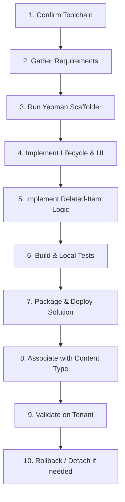

# sharepoint-scaffold-spfx-form-customizer

## Overview

An **SPFx Form Customizer** is a SharePoint Framework Extension (introduced in SPFx 1.15) that replaces the standard New, Edit, or Display form experience for items in a SharePoint Online list or document library.

Unlike page web parts (which reside in canvas zones on modern pages), a Form Customizer attaches directly to a list's **Content Type** via client-side component properties (`NewFormClientSideComponentId`, `EditFormClientSideComponentId`, `DisplayFormClientSideComponentId`).

This skill guides an agent through the complete lifecycle: determining architectural suitability, validating prerequisites, running Yeoman scaffolding, implementing accessible React/Fluent UI components, parsing URL parameters (`?SelectedID=...`) for parent-child relationships, packaging, deploying, associating with content types, validating live on-tenant, and safely rolling back.

> [!CAUTION]
> **HARD GATE — packaging/deploying is NOT completion.** A `.sppkg` build succeeding, or a user confirming "uploaded and added app," does **not** mean the custom form is active. SharePoint will silently continue rendering the out-of-the-box classic/default form until the component GUID is associated with the list's content type (Step 9). An agent MUST NOT report this workflow as done, nor stay silent, after a successful package/deploy step. Immediately after confirming deployment, the agent MUST explicitly prompt the user to run Step 9 (association) — do not wait for the user to notice a missing custom header/styling and ask "why isn't it working?" first. Treat "deployed" and "associated" as two separate, both-required checkpoints, and state which one is outstanding at every status update.

---

## Architectural Suitability Decision

Before scaffolding, verify that a Form Customizer is the correct architectural pattern:

### Use a Form Customizer when:
- You need a customized New, Edit, or Display form attached directly to a SharePoint list or library.
- Form fields must be dynamically initialized from URL query parameters (e.g. `NewForm.aspx?SelectedID=2411`).
- The default SharePoint lookup picker dropdown is inadequate or hits performance bottlenecks against large parent lists.
- You need custom client-side validation, multi-step sections, or conditional field interactions.
- You require controlled save/cancel navigation and validated return redirects (`Source=...`).
- The solution must be maintained in a version-controlled TypeScript codebase with automated CI/CD packaging.

### Do NOT use a Form Customizer when:
- The requirement is a standalone dashboard or multi-list dossier on a modern page (use a **Web Part** such as `scaffold-spfx-react-app` or `scaffold-spfx-master-detail`).
- Simple section reordering, column hiding, or header/footer styling is sufficient (use **JSON Form Formatting**).
- A low-code Power Platform solution was explicitly chosen (use **Power Apps Form**).
- Customization is needed only for single column cells in list views (use **SPFx Field Customizer**).
- Customization is needed only for list command buttons or batch actions (use **SPFx ListView Command Set**).

### Component Comparison Matrix

| Approach | Attachment Target | Scope | Pro-Dev / Code | URL Context Ingestion |
|---|---|---|---|---|
| **SPFx Form Customizer** | List Content Type | Entire Item Form | TypeScript / React | Full (`window.location.search`) |
| **SPFx Web Part** | Modern Page Canvas | Canvas Zone | TypeScript / React | Via Page Context / URL |
| **SPFx Field Customizer** | List / Site Column | Single Table Cell | TypeScript / React | Cell Context Only |
| **SPFx ListView Command** | List Command Bar | Selected Items | TypeScript | Selected Items Context |
| **Power Apps Form** | List Integration | Item Form | Low-Code Formula | Limited / Connector-driven |
| **JSON Form Layout** | List Form Header/Footer | Layout Sections | Declarative JSON | No |

---

## Toolchain & Prerequisites

Verify repository compatibility before installing or scaffolding:

- **Node.js**: LTS version (v18.x or v22.x).
- **SPFx**: 1.20+ (using Heft / Webpack build toolchain; Form Customizers require SPFx 1.15+).
- **Yeoman & Generator**: `yo` and `@microsoft/generator-sharepoint`.
- **PowerShell 7** (`pwsh`) with `PnP.PowerShell` for deployment, association, and validation.
- **Tenant Context**: Non-production test site (`AG-CSB-intRANET-DEV` or Trial Tenancy), target list name, target content type name, and schema internal field names.

---

## Core Workflow



---

### Step 1: Confirm Dependencies

Verify that the required development toolchain is installed and active:

```powershell
pwsh -File scripts/check-spfx-toolchain.ps1
```

If Node.js or npm versions are incompatible, switch to an approved LTS version (e.g. via `nvm use 22`) before proceeding.

---

### Step 2: Gather Form Customizer Requirements

Do not guess form requirements. Collect the following operational parameters:

1. **Solution & Extension Name**: e.g., `narrative-form-customizer` / `NarrativeFormCustomizer`.
2. **Target List & Content Type**: e.g., List `Narratives`, Content Type `Item`.
3. **Applicable Form Modes**: New Form only, Edit Form only, Display Form only, or All.
4. **URL Query Parameters**: e.g., `SelectedID` representing parent item ID.
5. **Parent List & Lookup Field**: Parent list `Persons`, child lookup field internal name `RelatedPerson` (`RelatedPersonId`).
6. **Editable Fields & Validation Rules**: Heading (mandatory, max 100 chars), Narrative text (mandatory), Status.
7. **Return Navigation**: Validated redirect back to originating dossier page.

---

### Step 3: Run the Yeoman Generator

Create the solution folder and run the official generator:

```bash
mkdir <solution-name>
cd <solution-name>
yo @microsoft/sharepoint
```

Select the following options:
- **Solution name**: `<solution-name>` (or accept folder name).
- **Target for component**: `SharePoint Online only (latest)`.
- **Component type**: `Extension`.
- **Extension type**: `Form Customizer`.
- **Form Customizer name**: `PascalCaseName` (e.g. `NarrativeFormCustomizer`).
- **Framework**: `React`.

The generator creates the following core structure:
- `src/extensions/<name>/<Name>FormCustomizer.manifest.json` (contains component GUID `id`).
- `src/extensions/<name>/<Name>FormCustomizer.ts` (inherits `BaseFormCustomizer`).
- `src/extensions/<name>/components/<Name>.tsx` (React root component).

---

### Step 4: Component Lifecycle & Separation of Concerns

Keep data access, state management, and UI rendering cleanly separated:

```
src/extensions/<name>/
├── <Name>FormCustomizer.manifest.json   # Extension manifest & Component ID
├── <Name>FormCustomizer.ts             # Lifecycle host (onInit, render, onDispose)
├── components/
│   ├── <Name>.tsx                      # Main React Form container
│   ├── <Name>.module.scss              # Scoped Fluent UI styling
│   └── ParentSummaryBanner.tsx         # Parent lookup display card
├── models/
│   └── IFormModels.ts                  # Form state and DTO interfaces
├── services/
│   ├── FormValidationService.ts        # Input validation & schema rules
│   └── SharePointDataService.ts        # SPHttpClient / PnPjs list operations
└── utils/
    └── UrlNavigationHelper.ts          # URL parameter & Source redirect validation
```

#### Lifecycle Implementation (`<Name>FormCustomizer.ts`)

```typescript
import * as React from 'react';
import * as ReactDOM from 'react-dom';
import { Log } from '@microsoft/sp-core-library';
import {
  BaseFormCustomizer,
  FormDisplayMode
} from '@microsoft/sp-listview-extensibility';
import { NarrativeFormComponent } from './components/NarrativeFormComponent';
import { INarrativeFormProps } from './models/IFormModels';

export default class NarrativeFormCustomizer extends BaseFormCustomizer<Record<string, unknown>> {

  public onInit(): Promise<void> {
    Log.info('NarrativeFormCustomizer', `Initialized for list: ${this.context.list.title}`);
    return Promise.resolve();
  }

  public render(): void {
    const element: React.ReactElement<INarrativeFormProps> = React.createElement(
      NarrativeFormComponent,
      {
        context: this.context,
        displayMode: this.displayMode,
        onSave: () => this.formSaved(),
        onClose: () => this.formClosed()
      }
    );

    ReactDOM.render(element, this.domElement);
  }

  public onDispose(): void {
    ReactDOM.unmountComponentAtNode(this.domElement);
    super.onDispose();
  }
}
```

---

### Step 5: Implementation Pattern for URL-Driven Related-Item Forms

When creating a child item linked to a parent record via `NewForm.aspx?SelectedID=2411`:

#### 1. Safely Parse and Validate URL Parameters
Treat URL parameters as untrusted user input. Strictly enforce integer validation:

```typescript
export function getValidatedSelectedId(searchQuery: string): number | null {
  const params = new URLSearchParams(searchQuery);
  const rawId = params.get('SelectedID');

  if (!rawId) return null;

  // Enforce positive non-zero integer
  if (!/^[1-9]\d*$/.test(rawId.trim())) {
    return null;
  }

  const parsed = parseInt(rawId.trim(), 10);
  if (isNaN(parsed) || parsed <= 0 || parsed > 2147483647) {
    return null;
  }

  return parsed;
}
```

#### 2. Query Parent Item by ID
Fetch only required fields using `SPHttpClient`:

```typescript
export async function getParentSummary(
  spHttpClient: SPHttpClient,
  webUrl: string,
  parentListTitle: string,
  parentId: number
): Promise<{ id: number; title: string; displayName: string }> {
  const endpoint = `${webUrl}/_api/web/lists/getByTitle('${encodeURIComponent(parentListTitle)}')/items(${parentId})?$select=Id,Title`;

  const res = await spHttpClient.get(endpoint, SPHttpClient.configurations.v1, {
    headers: { 'Accept': 'application/json;odata=nometadata' }
  });

  if (!res.ok) {
    if (res.status === 404) throw new Error(`Parent record (ID ${parentId}) not found.`);
    if (res.status === 403) throw new Error(`Access denied to parent record (ID ${parentId}).`);
    throw new Error(`Failed to load parent record (HTTP ${res.status}).`);
  }

  const data = await res.json();
  return {
    id: data.Id,
    title: data.Title,
    displayName: `${data.Title} (ID: ${data.Id})`
  };
}
```

#### 3. Save Payload with Integer Lookup ID
Save the child record using the internal field name postfixed with `Id` (`RelatedPersonId`):

```typescript
export async function createNarrativeItem(
  spHttpClient: SPHttpClient,
  webUrl: string,
  listTitle: string,
  itemData: { title: string; body: string; relatedPersonId: number }
): Promise<void> {
  const endpoint = `${webUrl}/_api/web/lists/getByTitle('${encodeURIComponent(listTitle)}')/items`;

  const body = JSON.stringify({
    Title: itemData.title,
    NarrativeText: itemData.body,
    RelatedPersonId: itemData.relatedPersonId // Integer ID, NOT display text
  });

  const res = await spHttpClient.post(endpoint, SPHttpClient.configurations.v1, {
    headers: {
      'Accept': 'application/json;odata=nometadata',
      'Content-Type': 'application/json;odata=nometadata'
    },
    body: body
  });

  if (!res.ok) {
    const errText = await res.text();
    throw new Error(`Failed to save item: ${errText}`);
  }
}
```

> [!WARNING]
> Never pass display names, person titles, or GUID strings to SharePoint REST lookup properties. Lookups must receive the integer `Id` of the parent list item.

---

### Step 6: User Interface & Accessibility Discipline

Form Customizers must meet enterprise accessibility standards:

- **Heading Structure**: Render a visible `<h1>` / `<h2>` form title and parent summary banner near the top.
- **Form Labels & ARIA**: Use Fluent UI `TextField`, `Label`, and `aria-required="true"`.
- **Validation Focus**: When validation fails, move keyboard focus to the first invalid control.
- **Save State & Double-Submit Protection**: Disable the Save button immediately upon submission and render a `Spinner`.
- **Cancel & Dismissal**: Provide accessible Cancel and Close buttons calling `this.context.formClosed()`.
- **Safe Output Rendering**: Never inject unescaped strings into `innerHTML`. Use React JSX element bindings.

---

### Step 7: Safe Return & Redirect Handling

To prevent open-redirect vulnerabilities, sanitize `Source` query parameters before navigating:

```typescript
export function navigateToSafeSource(webUrl: string, fallbackUrl?: string): void {
  const params = new URLSearchParams(window.location.search);
  const rawSource = params.get('Source');

  if (!rawSource) {
    window.location.href = fallbackUrl || `${webUrl}/SitePages/Home.aspx`;
    return;
  }

  try {
    const decoded = decodeURIComponent(rawSource);
    // Relative path or same tenant origin only
    if (decoded.startsWith('/') && !decoded.startsWith('//')) {
      window.location.href = decoded;
      return;
    }

    const currentOrigin = new URL(webUrl).origin.toLowerCase();
    const parsed = new URL(decoded, webUrl);
    if (parsed.origin.toLowerCase() === currentOrigin) {
      window.location.href = parsed.href;
      return;
    }
  } catch {
    // Fall through to default
  }

  window.location.href = fallbackUrl || `${webUrl}/SitePages/Home.aspx`;
}
```

---

### Step 8: Build & Solution Packaging

1. **Verify build and tests**:
   ```bash
   npm run build
   ```

2. **Package the production `.sppkg` solution**:
   ```powershell
   pwsh -File ../scripts/package-spfx-solution.ps1 -SolutionPath "."
   ```

3. **Deploy to App Catalog**:
   ```powershell
   pwsh -File ../scripts/deploy-spfx-package.ps1 `
     -PackagePath "./sharepoint/solution/<solution-name>.sppkg" `
     -Scope Site `
     -Install
   ```

> [!CAUTION]
> **Do not stop here.** Deploying/installing the app package makes the extension available on the site, but the content type still points at the default SharePoint form. The custom form will NOT render — SharePoint will silently keep serving the classic/default form with no error — until Step 9 (association) is completed. Proceed directly to Step 9 in the same turn/response; do not end the task or wait for user confirmation that "it worked" before doing so.

---

### Step 9: Associate Form Customizer with Content Type

> [!IMPORTANT]
> Deploying the `.sppkg` does NOT activate the custom form. You must associate the manifest GUID with the list's content type.

1. **Find Manifest Component ID**:
   Read `id` from `src/extensions/<name>/<Name>FormCustomizer.manifest.json`.

2. **Dry-Run Analysis**:
   ```powershell
   pwsh -File scripts/associate-form-customizer.ps1 `
     -ListName "Narratives" `
     -ContentTypeName "Item" `
     -ComponentId "e672956c-38d7-4c8d-b778-9e55b4fa3977"
   ```

3. **Execute Live Association**:
   ```powershell
   pwsh -File scripts/associate-form-customizer.ps1 `
     -ListName "Narratives" `
     -ContentTypeName "Item" `
     -ComponentId "e672956c-38d7-4c8d-b778-9e55b4fa3977" `
     -Modes @("New", "Edit") `
     -Execute
   ```

---

### Step 10: Live Tenant Verification

Run the validation script to verify that the content type properties match the manifest ID:

```powershell
pwsh -File scripts/validate-form-customizer-association.ps1 `
  -ListName "Narratives" `
  -ContentTypeName "Item" `
  -ExpectedComponentId "e672956c-38d7-4c8d-b778-9e55b4fa3977"
```

Then perform manual browser verification using the checklist in `references/validation-checklist.md`:
- Open `NewForm.aspx?SelectedID=2411`. Custom form loads with parent details.
- Submit new item. Record appears in list with parent lookup ID populated.
- Open `EditForm.aspx?ID=<id>`. Form loads existing values.
- Click Cancel. Form closes without saving.

---

### Step 11: Rollback & Removal

To restore standard SharePoint Online out-of-the-box forms:

```powershell
# Detach Form Customizer from content type
pwsh -File scripts/remove-form-customizer-association.ps1 `
  -ListName "Narratives" `
  -ContentTypeName "Item" `
  -Execute
```

Verify that `NewForm.aspx` immediately displays standard SharePoint forms.

---

## Large-List Lookup Guidance

Why this pattern is vital for enterprise SharePoint environments:
1. **Bypasses Large Dropdowns**: Instead of rendering a lookup dropdown containing 10,000+ options (which degrades browser performance or fails threshold limits), the Form Customizer resolves only the single target parent item by ID.
2. **Threshold Limitations**: Does not bypass SharePoint List View Threshold limits on unindexed views; ensure the lookup column is indexed if querying list views by lookup.
3. **Permission Boundaries**: If the current user lacks Read permissions to parent item 2411, the API returns HTTP 403. The Form Customizer must catch this and show an accessible permission error rather than crashing.

---

## Synthetic Worked Example

### Scenario: Persons Dossier -> Narrative Entry

- **Parent List**: `Persons` (Item ID `2411`, Title: `Dr. Evelyn Reed`)
- **Child List**: `Narratives`
- **Lookup Field**: `RelatedPerson` (`RelatedPersonId`)
- **User Navigation Flow**:
  1. Operator views `https://tenant.sharepoint.com/sites/ops/SitePages/Person.aspx?SelectedID=2411`.
  2. Clicks "Add Narrative" button.
  3. Browser opens `https://tenant.sharepoint.com/sites/ops/Lists/Narratives/NewForm.aspx?SelectedID=2411&Source=https%3A%2F%2Ftenant.sharepoint.com%2Fsites%2Fops%2FSitePages%2FPerson.aspx%3FSelectedID%3D2411`.
  4. Form Customizer extracts `SelectedID=2411`, verifies positive integer format.
  5. Queries `Persons` list for item `2411`, retrieves `Title: Dr. Evelyn Reed`.
  6. Displays read-only banner: **Related Person: Dr. Evelyn Reed (ID: 2411)**.
  7. Operator enters Heading: `Initial Assessment`, Narrative: `Assessment completed without exceptions.`.
  8. Operator clicks **Save**.
  9. Form Customizer sends `POST` with `{ Title: "Initial Assessment", NarrativeText: "...", RelatedPersonId: 2411 }`.
  10. On success, calls `this.context.formSaved()` and navigates safely back to `Source` dossier URL.

---

## References & Authoritative Sources

- `references/form-customizer-lifecycle.md` — Complete lifecycle, context APIs, and base class architecture.
- `references/content-type-association.md` — Content type client-side component properties and PnP PowerShell mechanics.
- `references/url-driven-related-item-pattern.md` — Parent/child state management, validation, and OData queries.
- `references/validation-checklist.md` — Comprehensive local and tenant testing matrix.
- [Microsoft Learn: Build your first Form Customizer extension](https://learn.microsoft.com/en-us/sharepoint/dev/spfx/extensions/get-started/building-form-customizer)
- [Microsoft Learn: SharePoint Framework Development Tools and Libraries Compatibility](https://learn.microsoft.com/en-us/sharepoint/dev/spfx/compatibility)
- [PnP PowerShell: Set-PnPContentType Documentation](https://pnp.github.io/powershell/cmdlets/Set-PnPContentType.html)
