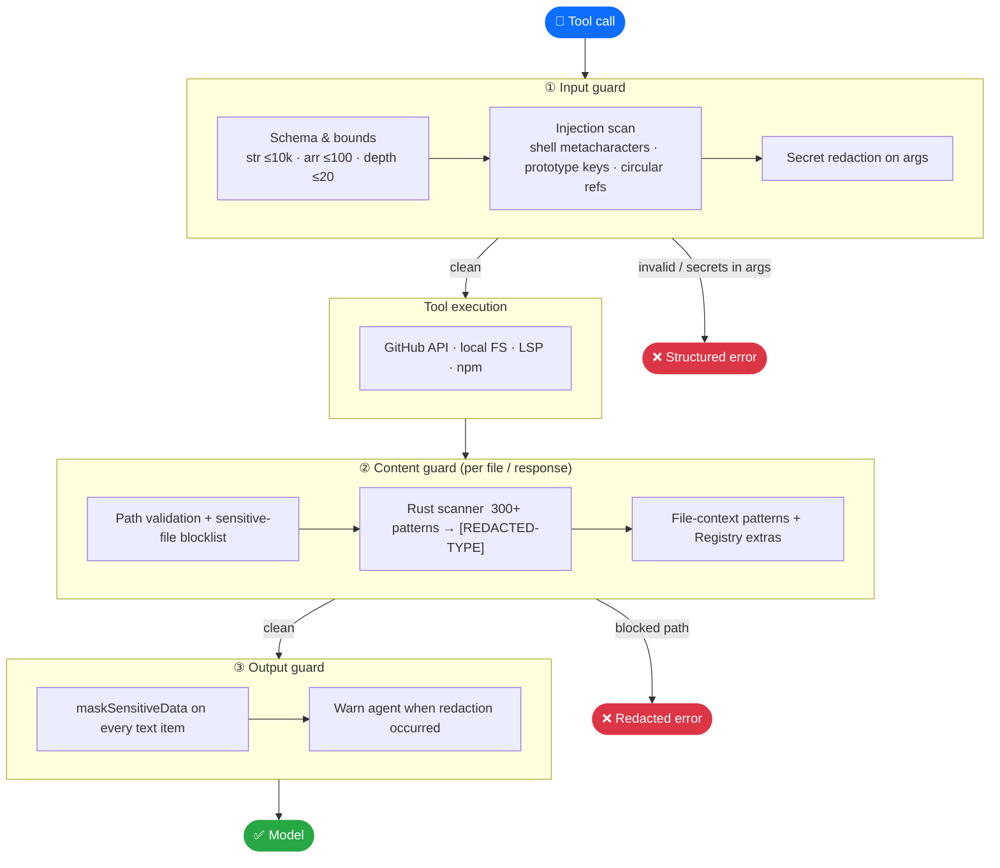
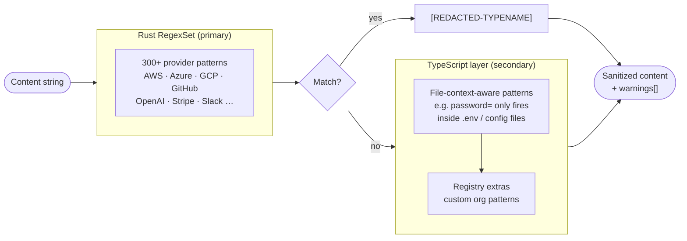
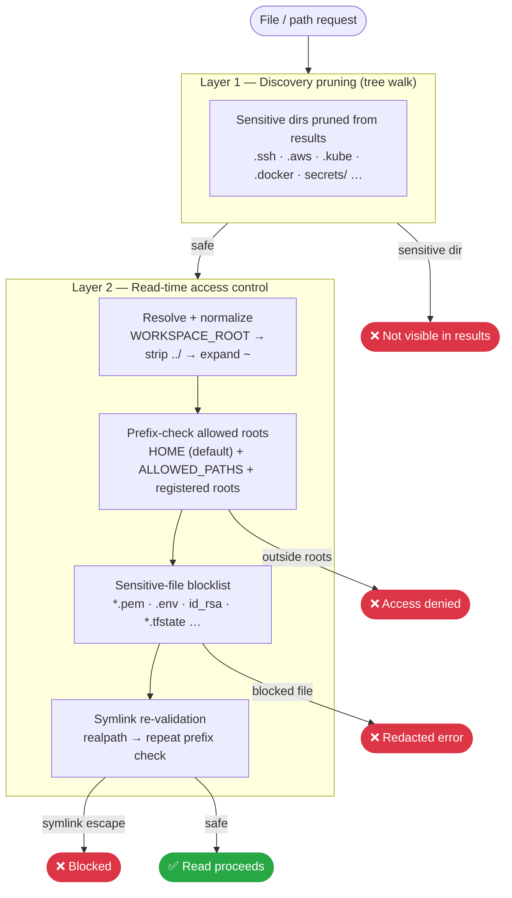
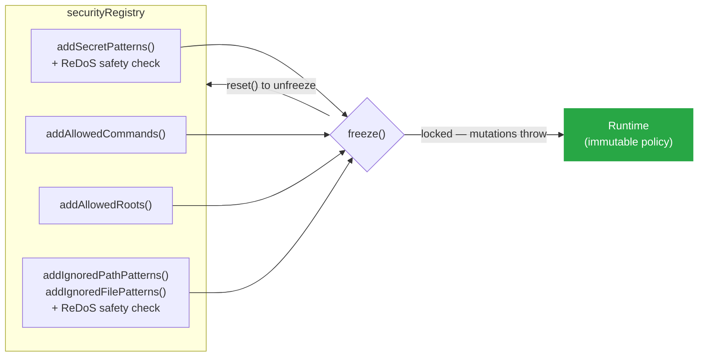

# Security

## Why it matters

An AI agent browsing your codebase runs into `.env` files, `~/.aws/credentials`, private keys, and CI tokens. Without active protection, those secrets flow straight into the LLM context window, where logs capture them, tool call results expose them, or prompt injection exfiltrates them.

Octocode enforces a hard boundary between untrusted content and the model:

> **Every byte is scanned and redacted before it reaches the LLM.** Secrets are stripped on the way *in* (inputs) and on the way *out* (results) — zero configuration required.

You get this by default, for every tool call, over both MCP and CLI.

---

## The pipeline

Three independent redaction stages guard every tool call.



The following table shows what the agent sees after redaction:

| Situation | Output |
|-----------|--------|
| Secret in file content | `[REDACTED-AWSACCESSKEYID]`, `[REDACTED-GITHUBPAT]`, … |
| Secret reaching output boundary | `A*I*S*A*4*1*X*…` (every-other-char masked) |
| Content too large | `[CONTENT-REDACTED-SIZE-LIMIT]` |
| Path blocked | Structured error — path never echoed |

---

## Secret detection

The Rust-native `RegexSet` scanner (with a TypeScript fallback from the same pattern list) covers **300+ patterns** across every major cloud, SaaS, and dev-tool credential format.



The scanner covers these categories:

| Category | Examples |
|----------|---------|
| Cloud | AWS (key ID, secret, session token, ARN), Azure (AD, storage, Cosmos), GCP, Alibaba |
| AI providers | OpenAI, Anthropic, Azure OpenAI, Bedrock, AI21, AssemblyAI |
| SaaS / dev tools | GitHub (PAT, fine-grained, OAuth, app), Slack, Stripe, npm, Atlassian, Auth0, Adyen |
| Generic / structural | JWTs, PEM/SSH keys, bearer tokens, passwords in URLs, DB connection strings, high-entropy strings |

**File-context-aware patterns** avoid false positives in source code: `password =` only fires when the file path matches `.env`, `config`, or `secrets`; Spring Boot credential patterns only apply to `application.yml` / `application.properties`.

---

## Path validation

Local filesystem access passes through two independent layers, so a bypass of one layer still leaves the other guarding sensitive files.



The blocklist matches on file name and directory path, and covers these categories:

| Category | Examples |
|----------|---------|
| Keys and certs | `*.pem`, `*.key`, `*.p12`, `id_rsa`, `id_ed25519`, `.ssh/` |
| Credentials | `.env`, `.env.*`, `.netrc`, `.npmrc`, `.git-credentials`, `*_token`, `client_secret*.json` |
| Cloud and infra | `.aws/credentials`, `.kube/`, `*.tfstate`, `*.tfvars`, `.s3cfg` |
| Secret stores | `.password-store/`, `*.kdbx`, OS keychains, browser login DBs |
| Shell and history | `.bash_history`, `.zsh_history`, `.*_history` |
| Crypto wallets | `wallet.dat`, `.bitcoin/`, `.ethereum/` |
| App secrets | `wp-config.php`, `google-services.json`, `secrets.yml`, `master.key` |

Canonical sources: `packages/octocode-engine/src/security/filePatterns.ts` and `packages/octocode-engine/src/security/pathPatterns.ts`.

`ALLOWED_PATHS` (or `local.allowedPaths` in `.octocoderc`) adds roots on top of the HOME default. To turn local tools off entirely, set `ENABLE_LOCAL=false`.

---

## Command execution

External commands run through `child_process.spawn()` with an argument array — not `exec` — and Octocode rejects shell metacharacters before execution.

| Command | Hardening |
|---------|-----------|
| `rg` | Explicit flag allowlist; `--pre`/`--pre-glob` blocked (arbitrary binary exec). Combined short flags validated char-by-char. |
| `git` | Only `clone` + `sparse-checkout`. `file://`, `git://`, `http://` URLs blocked (HTTPS only). `-c` keys allowlisted to safe config (`advice.detachedHead`, `core.autocrlf`, `http.extraHeader`, …). |
| `find` | `-exec`, `-execdir`, `-ok`, `-delete`, `-printf` and all exec/write operators blocked. |
| `grep` | Shared dangerous-pattern scan (`;&|$()` etc.) applied to all arguments. |

---

## Credentials and tokens

**Resolution order.** `OCTOCODE_TOKEN` → `GH_TOKEN` → `GITHUB_TOKEN` → `GITHUB_PERSONAL_ACCESS_TOKEN` → encrypted on-disk OAuth → `gh` CLI token. The first non-empty value wins; the four environment variables are protected keys that Octocode never reads from `.env` or `.octocoderc`.

**On-disk storage.** AES-256-GCM encrypted under `OCTOCODE_HOME`.

**Output masking.** Output masking covers tokens, so results never echo them.

See [Configuration](https://github.com/bgauryy/octocode/blob/main/docs/CONFIGURATION.md) for token setup and credential architecture.

---

## Input limits and injection guards

| Check | Limit / action |
|-------|---------------|
| String length | ≤ 10,000 chars |
| Array length | ≤ 100 items |
| Object nesting | ≤ 20 levels |
| Prototype pollution | `__proto__`, `constructor`, `prototype` keys → rejected |
| Circular references | WeakSet ancestor tracking → rejected |
| Numeric ranges | depth / context-lines / limits / offsets clamped at schema layer |

---

## Tool timeout and cancellation

Every tool call runs under a 60-second timeout. MCP clients can cancel through `AbortSignal`. Both timeout and cancellation return a structured error, so no partial data leaks through. Override the default in either of these ways:

```ts
configureSecurity({ defaultTimeoutMs: 30_000 })   // process-wide override
withSecurityValidation(name, handler, { timeoutMs: 10_000 })  // per-tool override
```

---

## Extension API

The `securityRegistry` singleton lets you extend security policy before boot — useful for org-specific secrets or multi-tenant deployments.



```ts
import { securityRegistry } from '@octocodeai/octocode-engine/security';

securityRegistry.addSecretPatterns([
  { name: 'my-service-token', regex: /mst_[A-Za-z0-9]{32}/ }
]);
securityRegistry.addAllowedCommands(['my-search-tool']);
securityRegistry.addAllowedRoots(['/mnt/shared-workspace']);
securityRegistry.addIgnoredPathPatterns([/\/internal-vault\//]);
securityRegistry.addIgnoredFilePatterns([/\.company-secret$/]);

securityRegistry.freeze(); // lock — throws on any further mutation
```

Custom patterns pass through these guards:
- A **ReDoS timing heuristic** checks every `regex` value against 50-, 500-, and 2,000-character inputs, and rejects any pattern that takes 200 ms or longer on one of them. Rejection happens before registration.
- Octocode deduplicates repeated names and sources.
- `securityRegistry.version` increments on every mutation — use it for cache invalidation.

---

## Scope and disclosure

Octocode protects the **agent context boundary** — what flows between untrusted content and the model. It does not replace repository secret-scanning, OS-level sandboxing, or network egress controls; run those alongside it.

To report a vulnerability, open a private advisory on the [octocode repository](https://github.com/bgauryy/octocode) rather than a public issue.
