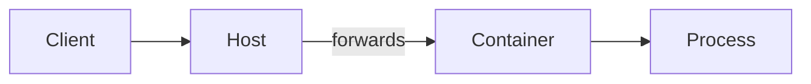

# Lesson Content Rules

Lesson Markdown is generated from a `.plan.yaml`. The plan is the contract — follow its
section order exactly. If the plan seems wrong, report it rather than restructuring silently.

## Document structure

- Exactly one `#` heading, matching `lesson.title` in the plan.
- Immediately after the title: "By the end of this lesson you will be able to:" followed by the
  outcome statements verbatim from `outcomes.yaml`.
- One `##` section per plan section, in plan order. No extra sections, no merged sections.
- Heading levels never skip (`##` before `###`). No heading is left without body text.
- End with a one-paragraph transition to the next lesson, unless it is the final lesson.

## Voice and reading level

The house voice is defined in
[house-style.yaml](../skills/instructional-design/assets/house-style.yaml), with a worked
exemplar and counter-exemplar for lesson prose. Read it before writing. What follows is the
part that is checked automatically.

- Second person, present tense, active voice: "you define a service", not "a service is
  defined". First person plural is allowed only while walking through a worked example
  ("let's trace what happens next"), never to state a fact.
- Target the `learner_profile.experience` level in `audience.yaml`.
- Average sentence length under 20 words. Split anything over 30. Vary the length.
- One idea per paragraph, one to five sentences. A one-sentence paragraph is a device, not a
  defect.
- Say what a thing is for before you say what it is made of.
- No "just", "obviously", "of course". No emojis.
- No claims that a technology is exciting, revolutionary, or the future. Enthusiasm belongs to
  the insight, not to the subject.

## Terminology

- Introduce only terms listed in the plan's `terminology_introduced`.
- Define a term on first use, then reuse it verbatim. No synonyms for a glossed term.
- Every introduced term gets an entry in the lesson's `<lesson>.glossary.yaml` fragment in
  the same turn. The orchestrator merges the fragments into `glossary.yaml`; do not write
  that file.
- Expand every acronym on first use in the course.

## Code and examples

- Every fenced block has a language tag.
- Code must be runnable as written, or explicitly marked as a fragment.
- Placeholders use `<angle-brackets>`, never `foo` or `xxx`.
- Never show credentials, tokens, or real hostnames — even fake-looking ones.
- Prefer one worked example carried through a section over several disconnected snippets.

## Diagrams

Every diagram is a Mermaid block — a fence tagged `mermaid`, and nothing else. No images, no
ASCII art, no linked SVGs. The site renders the fence; a picture file cannot be regenerated
with the lesson.

Draw a diagram wherever the prose describes a structure, a sequence, a state change, or a
relationship between three or more things. Those are the passages a reader has to hold in
their head while assembling a picture, and handing them the picture is why the diagram
exists. Read [diagram-design.md](../skills/instructional-design/references/diagram-design.md)
for which kind to reach for and when a diagram earns its place.

- Render every diagram the plan declares, in its section, and no others. A diagram the plan
  did not ask for goes back to the planner.
- Introduce a diagram in the sentence before it, and say what it shows. A diagram dropped
  between two paragraphs with no lead-in reads as decoration.
- The diagram carries the shape; the prose carries the argument. Never put a claim in a
  diagram that the surrounding text does not also make.

### Labels

Long labels are the defect that makes a generated diagram unreadable: the renderer sizes
nodes to their text, and a sentence in a box shoves the boxes into each other. Label the
node with the *name* of the thing and let the paragraph do the explaining.

- Node labels: 30 characters at most, and 4 words is a good working ceiling. `Kernel` or
  `Image layer`, not `The kernel, which is shared with the host`.
- Edge labels: 24 characters at most, and shorter is better. A verb and a noun — `writes
  layer`, `sends SYN`.
- No sentences, no trailing full stops, no parenthetical asides in a label.
- Nine nodes is a lot. Twelve is too many — split it into two diagrams, each with one point.
- Do not encode meaning in colour or in styling. Both are invisible to some readers and to
  every screen reader.

### Accessibility

Every Mermaid block declares `accTitle` and `accDescr` on its own lines, directly under the
diagram-type keyword:

`accTitle` names the diagram in a few words. `accDescr` states what the diagram shows in one
sentence, so a reader who cannot see it gets the same point. Neither is a caption — they are
read out instead of the picture, not alongside it.

## References and links

- Link with descriptive text, never "click here" or a bare URL.
- Reference earlier lessons by title and id: "as covered in *What is a container?* (m01-l01)".
- Every lesson in the plan's `references_previous` must actually appear in the prose. If a
  reference turns out to be unnecessary, remove it from the plan rather than leaving it unused.
- Only reference lessons listed in the plan's `references_previous`.
- Do not invent URLs, citations, version numbers, or statistics.

## Accessibility

- Every image has meaningful alt text describing its content, not its filename. Every
  diagram carries `accTitle` and `accDescr`, as above.
- Never convey meaning through colour alone.
- Tables have header rows and no merged cells.
