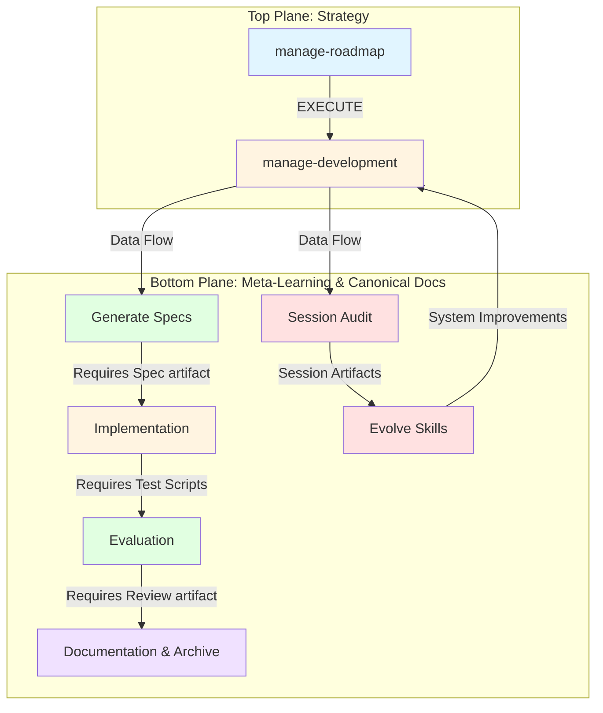
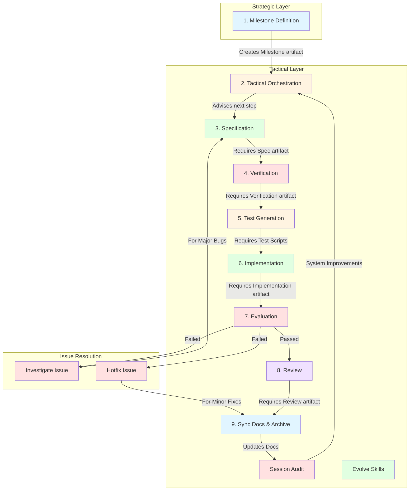
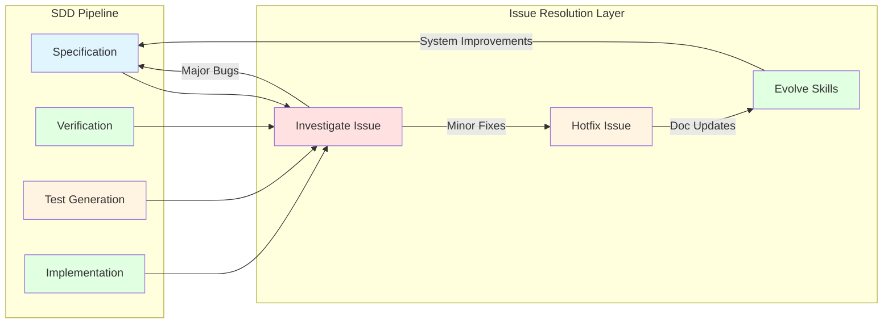
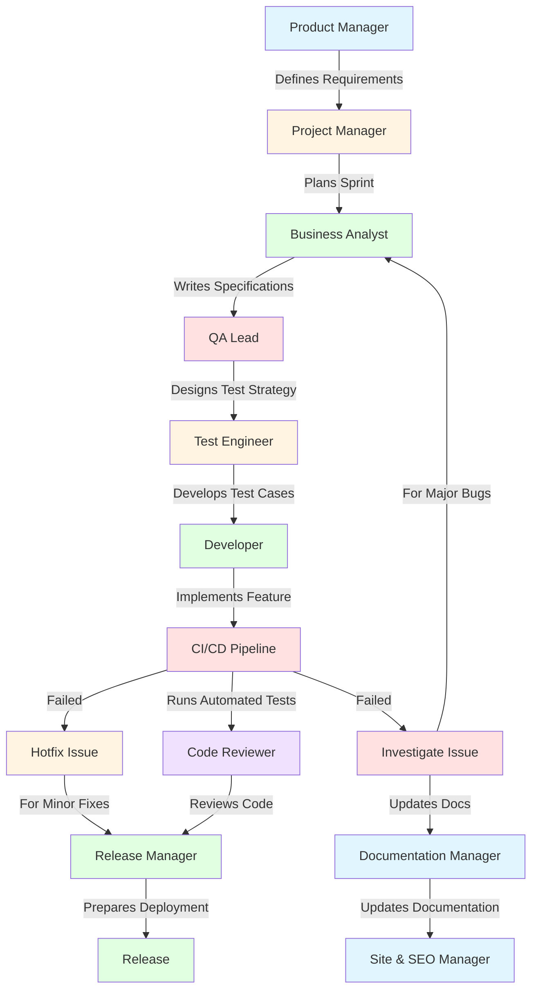
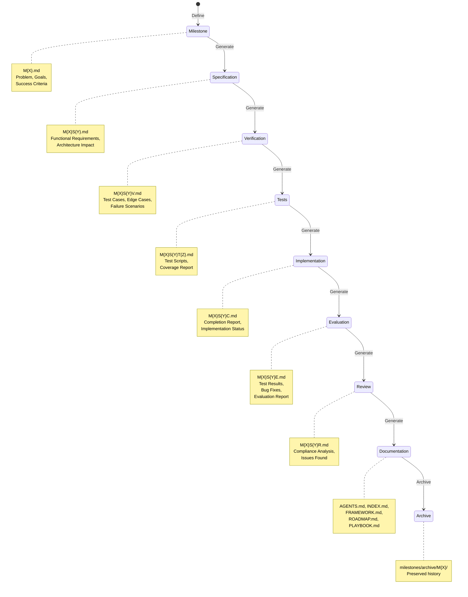

# OhMyPi (OMP) Agentic Engineering Framework (AEF)

> **Production-Grade Spec-Driven Development**


---

## Table of Contents

- [The Problem: Agentic Chaos in Production](#the-problem-agentic-chaos-in-production)
- [System Architecture](#system-architecture)
- [Deterministic Workflow](#deterministic-workflow)
- [Core Principles](#core-principles)
- [The Mechanism: Mechanical Determinism](#the-mechanism-mechanical-determinism-in-agentic-workflows)
- [Lifecycle Skills](#lifecycle-skills)
- [Infrastructure Skills](#infrastructure-skills)
- [Templates & Artifacts](#templates--artifacts)
- [Directory Standards](#directory-standards)
- [Why SDD Wins](#why-sdd-wins)
- [About the Developer & ParlanTech](#about-the-developer--parlantech)

---

## The Problem: Agentic Chaos in Production


Standard agentic systems fail systematically:

| Failure Type          | Example                                                                   |
| --------------------- | ------------------------------------------------------------------------- |
| **CONTEXT_LOST**      | ERR: 0x4F04 — Context lost between agents                                 |
| **WRITE_FAILURE**     | `/src/workflow/agent.py` [OVERWRITTEN] — Agents overwrite without reading |
| **LOOP_DETECTED**     | Infinite loops from non-deterministic logic                               |
| **NON_DETERMINISTIC** | Ambiguous tool selection, unpredictable exits                             |

> **"We need engineering discipline, not just smarter models."**

---

## The Solution: Three Pillars of SDD


### Pillar 1: One Transform at a Time

Single-responsibility skills. Each agent performs exactly one transformation with no cross-cutting concerns.

### Pillar 2: Deterministic Outputs

Pure-function tool invocation. Agents parse and read state before writing — no hidden state mutations.

### Pillar 3: Artifact Persistence

Immutable event sourcing. Each agent writes to new artifacts rather than modifying existing files.

### 💡 Wisdom

These three pillars map directly to foundational software engineering principles:

- **Single Responsibility Principle** (SOLID) — One Transform at a Time
- **Pure Functions / Referential Transparency** — Deterministic Outputs
- **Immutable Event Sourcing** — Artifact Persistence

The genius is applying these _to agent orchestration_ rather than just code. Most agent frameworks treat LLMs as magical black boxes; OMP treats them as components in a rigorous engineering system. The "parse and read state before writing" rule is particularly crucial — it prevents the common failure mode where an agent hallucinates the current state and overwrites working code.

---

## Core Architectural Boundary

### Agents [Strategy] ↔ Tools [Execution]


| **AGENTS [Strategy]**                 | **TOOLS [Execution]**        |
| ------------------------------------- | ---------------------------- |
| - Focuses on **The So What**          | - Focuses on **The What**    |
| - Interprets patterns                 | - Deterministic APIs         |
| - Selects strategies                  | - Precise file parsing       |
| - Handles ambiguity                   | - Exact code execution       |
| - Formulates plans                    | - State-based tool selection |
| - Transforms artifacts between stages | - Write access to files      |
| - Makes high-level decisions          | - Stateless and pure         |

> **"Never overload an agent with tool logic; never let a tool make strategic decisions."**

### 💡 Wisdom

This is the **Strategy Pattern** applied at the architectural level. Agents are the _context-aware deciders_; tools are the _context-free doers_. This boundary prevents two critical anti-patterns:

1. **The Swiss Army Knife Agent** — When an agent contains too much tool logic, it becomes bloated, slow, and unpredictable. Tool selection becomes ambiguous.
2. **The Clever Tool** — When tools make strategic decisions, they become non-deterministic. A tool that "decides" how to parse a file based on context is no longer a tool — it's a hidden agent.

This separation enables **testability**: tools can be unit-tested with perfect reproducibility, while agents can be evaluated on decision quality.

---

## System Architecture



**Dual-Layer Management Architecture**:

| Strategic Layer                                   | Tactical Layer                                      |
| ------------------------------------------------- | --------------------------------------------------- |
| `manage-roadmap`                                  | `manage-development`                                |
| Defines roadmap priorities and creates milestones | Orchestrates the SDD pipeline for active milestones |
| Sets the "What & Why"                             | Guides the "How" execution                          |

**Structural Feedback Loop**:

- Tactical Lifecycle Engine delivers: requirements, constraints, workshop notes, critical points
- Meta-Learning returns: data and action memory as system constraints, patterns, and decision points

> **"A unified, closed-loop system where high-level vision is systematically decomposed into verifiable, executed code."**

### 💡 Wisdom

This is a **hierarchical control system** inspired by:

- **Management hierarchies** (Strategic → Tactical → Operational)
- **Computer architecture** (Application → OS → Hardware)
- **Biological systems** (Brain → Spinal Cord → Reflex Arcs)

The feedback loop is critical — it's not just top-down decomposition. The bottom layer _learns_ from execution and feeds constraints back up. This creates a **self-improving system** where institutional knowledge accumulates in canonical docs rather than being lost in context windows.

The "Spec-Driven Assembly Line" metaphor is deliberate: manufacturing achieved reliability through assembly lines (Ford), not by making individual craftsmen more skilled. Similarly, OMP achieves reliable AI engineering through process, not through better prompting.

---

## Deterministic Workflow



> **"AI agents don't just write code. They advance artifacts through a strict deterministic workflow. Each stage strictly requires the completion of the previous artifact."**

### 💡 Wisdom

This is **Waterfall done right** — not as a rigid methodology, but as a _state machine_. The key insight is that **stages don't proceed until the artifact is complete**. This prevents the "90% done" trap where implementation starts before requirements are understood.

The "strictly requires completion" rule means:

- No coding during specification
- No testing during coding
- No reviewing during testing

This seems slow, but it prevents the **context thrashing** that kills productivity in standard agentic workflows. Each agent enters with a clear mandate and exits with a complete artifact.

### Extended Workflow: Issue Resolution



### 📊 Project Workflow vs Issue Resolution



> **"AI agents don't just write code. They advance artifacts through a strict deterministic workflow. Each stage strictly requires the completion of the previous artifact."**

---

## Core Principles

1. **Agent/Tool Separation** — Strategy vs. Execution
2. **One Transform at a Time** — Single responsibility
3. **Deterministic Outputs** — Pure functions, no hidden state
4. **Artifact Persistence** — Immutable, versioned Markdown
5. **Spec Before Code** — Verification precedes implementation
6. **Disjoint File Edits** — Parallel agents, no race conditions
7. **Read-Only Audit** — Analysis without modification
8. **Investigate Before Patch** — Root cause, not symptom
9. **Skill Evolution & Meta-Learning** — Analyzes project artifacts to improve agent prompts and skill definitions.
10. **Human Checkpoints** — Completion reports, not auto-proceed

---

## The Mechanism: Mechanical Determinism in Agentic Workflows

> **"Never guess what you can prove. Never trust what you can verify. Never pattern-match what you can read."**

The Mechanism is a behavioral enforcement layer embedded into the OMP AEF's canonical architecture. It addresses a fundamental failure mode of LLM-based agents: **forward progress over accuracy**. Agents naturally default to generating output, guessing when uncertain, trusting prior reports over live state, and debugging by pattern-matching from memory.

The Mechanism counters this with six mechanical rules — grep-able, auditable, enforced at the skill and template level:

### 1. The Uncertainty Marker (`#NEEDS-CLARIFICATION`)

Codified in `FRAMEWORK.md`, `AGENTS.md`, and `skills/implement-specification/SKILL.md`. When an agent's confidence in a fact falls below _"I could paste the command that proves this,"_ it MUST emit the literal marker `#NEEDS-CLARIFICATION: <specific missing fact>` and HALT. Guessing is strictly forbidden. This makes uncertainty a **grep-able first-class artifact** rather than a silent gamble.

> **Philosophy**: If you can't paste the command that proves it, you don't know it. Halting on uncertainty is cheaper than debugging a hallucination.

### 2. Zero-Trust Review

Codified in `skills/review-implementation/SKILL.md` and `templates/review_template.md`. The reviewer operates from a separate context with the standing rule: _"Assume the prior report is wrong until proven otherwise. Verify every claim against the live state using bash or read commands."_ The `review_template.md` now includes a **Live State Verification** section requiring claim/command/observed-state entries — empty or self-referential entries are compliance failures.

> **Philosophy**: The completion report is a hypothesis, not a fact. Trust is earned through independent verification, not asserted by the implementer.

### 3. Evidence-Based Debugging

Codified in `skills/investigate-issue/SKILL.md` and `skills/evaluate-implementation/SKILL.md`. Standing rule: _"Debug from evidence, never from memory. The first action on any unfamiliar error is to read the literal message and use the tool's --help or introspection command. Never pattern-match from similar tools."_

> **Philosophy**: Every unfamiliar error is unique until proven otherwise. Pattern-matching from memory is guessing — read the error, use introspection, then reason.

### 4. Raw Evidence Mandate

Codified in `templates/completion_template.md` and `templates/evaluation_template.md`. Every "done" claim MUST ship with the exact terminal command and raw stdout/stderr output that proves it succeeded. The template enforces: `- [ ] <requirement>: \`<command>\` → <raw output>`.

> **Philosophy**: A claim without raw evidence is an opinion, not a deliverable. Commands and their output are the universal language of verification.

### 5. Ground-Truth Utility (`bin/ground-truth-check.sh`)

A strictly read-only POSIX shell utility providing low-friction live-state verification:

- `file-exists <path>` — Check file existence (PASS/FAIL)
- `dir-exists <path>` — Check directory existence
- `command-exists <name>` — Check if a command is on PATH
- `file-contains <path> <pattern>` — Literal grep (no regex injection)
- `git-status [path]` — Check git repository status

Zero dependencies. Zero write operations. Exit code 0 = PASS, 1 = FAIL. Agent-facing surface is `bash` primitive only — no MCP, no Python, no side effects.

> **Philosophy**: A zero-trust reviewer needs low-friction truth access. `ground-truth-check.sh` replaces complex bash one-liners with a single, auditable, read-only command.

### 6. Mechanical Tooling Stack Mandate

Codified in `skills/bootstrap-project/SKILL.md` and `AGENTS.md`. Every bootstrapped project must document its chosen tooling stack covering four categories (project- and language-agnostic):

- **Environment Manager** — Prevents version ambiguity and auto-activates toolchains
- **Fast Linter/Formatter** — Deterministic, auto-fixable code quality gate
- **Pre-commit Framework** — Local gates on every commit without cloud CI
- **Type Checker** — Catches silent type/property mismatches before runtime

No specific brands are prescribed — only the _categories_ are mandated, ensuring applicability across Python, Node.js, Rust, Go, and other ecosystems.

> **Philosophy**: Environment confusion (wrong Python version, missing Node runtime) is the most expensive class of bug — silent, cross-cutting, and invisible to linters. A documented tooling stack makes the implicit explicit.

### Version Bumps

The following skills received version bumps reflecting The Mechanism's enforcement rules:

| Skill                     | Old → New         | Change                                             |
| ------------------------- | ----------------- | -------------------------------------------------- |
| `review-implementation`   | 1.0.0 → **1.1.0** | Zero-trust standing rule + Live State Verification |
| `evaluate-implementation` | 1.0.1 → **1.0.2** | Evidence-based debugging rule                      |
| `investigate-issue`       | 1.0.0 → **1.0.1** | Evidence-based debugging rule (2 placements)       |
| `implement-specification` | 1.0.0 → **1.0.1** | Uncertainty Marker reference                       |
| `bootstrap-project`       | 1.0.1 → **1.0.2** | Mechanical Tooling Stack step                      |

### The Mechanism's Place in the SDD Pipeline

Unlike a skill that executes in sequence, The Mechanism is a **cross-cutting architectural constraint** that affects every stage:

| Pipeline Stage | Mechanism Impact                                     |
| -------------- | ---------------------------------------------------- |
| Specification  | Uncertainty Marker prevents guessing in requirements |
| Verification   | Raw Evidence Mandate ensures verifiable assertions   |
| Implementation | Uncertainty Marker halts guesswork during coding     |
| Evaluation     | Evidence-Based Debugging prevents memory-based fixes |
| Review         | Zero-Trust Review independently verifies every claim |
| Bootstrap      | Mechanical Tooling Stack prevents environment drift  |

---

## Lifecycle Skills

**Strategic Layer** — Define project-level strategies, roadmaps, and governance:

| Skill                | Description                                                              | Handoff                           |
| -------------------- | ------------------------------------------------------------------------ | --------------------------------- |
| `manage-roadmap`     | Strategic PM: Creates milestones from roadmap priorities                 | Hands off to `manage-development` |
| `manage-development` | Tactical EM: Orchestrates SDD pipeline for active milestones             | Advises next skill in sequence    |
| `sync-documentation` | Updates canonical docs, archives milestone                               | Lifecycle complete                |
| `archive-milestone`  | Archives completed milestone artifacts while preserving history          | Lifecycle complete                |
| `evolve-skills`      | Analyzes recent artifacts to learn from mistakes, updates SKILL.md files | Updates framework (optional)      |

**Core Development Layer** — Implement the specification-driven development workflow:

| Skill                     | Description                                                                                                   | Handoff                                        |
| ------------------------- | ------------------------------------------------------------------------------------------------------------- | ---------------------------------------------- |
| `milestone`               | Transforms rough feature ideas into complete milestone documents through interactive requirements elicitation | `generate-spec`                                |
| `generate-spec`           | Transforms milestone → specification                                                                          | `generate-verification`                        |
| `generate-verification`   | Transforms specification → verification                                                                       | `generate-tests`                               |
| `generate-tests`          | Transforms verification → test scripts                                                                        | `implement-specification`                      |
| `implement-specification` | Transforms test scripts → implementation                                                                      | `evaluate-implementation`                      |
| `evaluate-implementation` | Executes tests, fixes bugs, generates evaluation                                                              | `review-implementation` or `investigate-issue` |
| `review-implementation`   | Evaluates implementation against spec                                                                         | `sync-documentation`                           |

**Support Layer** — Assist with specific concerns:

| Skill               | Description                                      | Handoff                                |
| ------------------- | ------------------------------------------------ | -------------------------------------- |
| `investigate-issue` | Analyzes failures, produces investigation report | `generate-spec` (for incremental spec) |
| `hotfix-issue`      | Implements minor fixes directly                  | `sync-documentation`                   |

`archive-docs` archives completed milestone artifacts and infrastructure reports to reduce active context while preserving history. It also provides Cleanup Mode for managing orphaned and duplicate files.

### New Skills Introduced

- **`hotfix-focus`**: Specializes in rapidly addressing and resolving minor issues, streamlining the `hotfix-issue` workflow.
- **`diagrammer`**: Generates visual diagrams of system architecture, data flow, and project structures, aiding comprehension and documentation.
- `~/devcode/aef/agent/sessions/`: Active development sessions and exploratory session audits awaiting formalization.
- `docs/ingest/`: Strictly for external data, research, or third-party codebase ingestion. Not for session tracking.

---

## Infrastructure Skills

**Purpose**: Provide foundational capabilities for understanding, analyzing, and processing the codebase and documentation.

### code-search

**Role**: Semantic search and skeleton generation for understanding code structure without reading files.

**Key Responsibilities**:

- Provides semantic search across the OMP AEF codebase
- Generates tree-sitter skeletons for codebase structure
- Enables fast understanding of patterns without reading files
- Supports framework improvements and consistency checks
- Creates vector embeddings for semantic search (per-project)

**Artifacts**:

- `docs/skeletons/OMP-AEF_skeleton.md` — Tree-sitter extracted signatures and imports
- `code_index_code_search.db` — Vector embeddings for semantic search (per-project)

**Usage Patterns**:

- Find agent handoff patterns across multiple files
- Identify template usage and consistency
- Verify negative guardrails implementation
- Search for milestone progress tracking
- Check code-search integration in skills

**Out of Scope**:

- Detailed implementation review (use LSP instead)
- Running tests or executing code
- Modifying codebase structure
- Generating new features

**Access**:

```bash
# Semantic search (via agent invocation)
task(role: "code-search", assignment: "Search for all milestone-related code")

# CLI usage
python3 ~/devcode/aef/agent/skills/code-search/code_indexer.py --index
python3 ~/devcode/aef/agent/skills/code-search/code_search.sh "milestone" skills/
```

### LadybugDB & Knowledge Graph

**Role**: Graph-based scope validation and dependency mapping for the AEF codebase.

The OMP AEF integrates **LadybugDB** (`lbug` CLI v0.18.3) as a lightweight embedded graph database for modeling project structure — relationships between files, symbols, and imports.

**Key Capabilities**:

- **File-Symbol-Imports Graph**: Nodes represent files and symbols; edges represent import relationships. Enables reachability queries like "what files would be affected by changing this module?"
- **Diff-Scope Verification Gate**: A scripted verification step compares `git diff --name-only` against the set of files reachable from a task's declared scope. Changes touching files outside the reachable set are automatically rejected before review — no LLM judgment involved.
- **Ad Hoc Cypher Queries**: Agents can run direct Cypher queries via `lbug --db <graph.lbug> cypher "MATCH ..."` through the bash tool — no MCP integration, no Python client.
- **V1 Schema**: `File` and `Symbol` node types with `IMPORTS` edge type. V2 will extend to `CALLS` and `RENDERS` edges for deeper dependency analysis.

**Integration**:

- **graph-context Skill**: Injectable skill at `skills/graph-context/SKILL.md` that initializes `.omp/graph/<name>.lbug` and ingests `skeleton.md` output
- **generate-verification Hook**: Integration point for the diff-scope verification gate
- **Pilot Project**: BariaDAO graph initialized at `~/devcode/BariaDAO/.omp/graph/baria.lbug`

> **Philosophy**: A knowledge graph provides mechanical, deterministic scope validation — no agent judgment, no context window loss, no "I think this file is related." The graph is the single source of truth for project structure.

---

## Templates & Artifacts

### Milestone Artifacts

Each milestone produces a set of artifacts tracked in `milestones/M{X}/`:

+- **M{X}.md** — Milestone definition (problem statement, goals, success criteria)
+- **M{X}S{Y}.md** — Specification (functional requirements, architecture impact)
+- **M{X}S{Y}V.md** — Verification protocol (test cases, edge cases)
+- **M{X}S{Y}T{Z}.md** — Test plan documentation
+- **M{X}S{Y}C.md** — Completion report (implementation status)
+- **M{X}S{Y}E.md** — Evaluation report (test results, bug fixes)
+- **M{X}S{Y}R.md** — Review report (compliance analysis)
+- **M{X}SA{Y}.md** — Session audit document
+- **SESSION_CHANGES.md** — Session change log
+- **CHANGELOG_ENTRIES.md** — Changelog entries
+- **MILESTONE_UPDATES.md** — Milestone updates
+- **INGEST_ENTRIES.md** — Ingestion entries for `/docs/ingest/`

### Artifact Lifecycle



## Directory Standards

| Document              | Description                                                                |
| --------------------- | -------------------------------------------------------------------------- |
| `README.md`           | Project overview, design principles, quick start, license                  |
| `AGENTS.md`           | Agent documentation, build/test commands, tool patterns                    |
| `INDEX.md`            | Quick navigation, agent overview, workflow diagrams                        |
| `ROADMAP.md`          | Existing capabilities as completed items and future items                  |
| `FRAMEWORK.md`        | Architectural patterns, module organization, extension guidelines          |
| `PLAYBOOK.md`         | How to run/test/deploy, operational procedures, common tasks               |
| `CHANGELOG.md`        | Chronological record of changes and version history                        |
| `docs/EXPERIENCES.md` | Meta-learning ledger tracking framework friction and applied skill updates |
| `docs/SPEC.md`        | Current system architecture as specification                               |
| `docs/DATA.md`        | Database schema, configuration schema, data flow patterns                  |
| `docs/MILESTONES.md`  | List of active and archived milestones                                     |
| `milestones/`         | Milestone-specific artifacts (specs, tests, implementations)               |
| `milestones/archive/` | Archived completed milestones (read-only)                                  |
| `docs/ingest/`        | Ingestion workflow for documentation processing and archival               |
| `templates/`          | Template files for artifact generation (\*.template.md)                    |
| `skills-lock.json`    | Skill configuration and dependencies                                       |
| `config.yml`          | Model routing and framework configuration                                  |

**Directory Structure**:

- **Root**: Configuration, core documentation, skills
- **docs/**: Framework documentation and reference materials
- **milestones/**: Active milestone work (M{X}/)
- **milestones/archive/**: Completed milestone artifacts
- **docs/ingest/**: Files ready for documentation processing
- **templates/**: Reusable templates for artifact generation
- **skills/**: Agent skill definitions (SKILL.md files)
- **tests/**: Test suites for verification (M{X}/)

**Session Artifacts**: Session audit documents and change logs (SESSION_CHANGES.md, CHANGELOG_ENTRIES.md, MILESTONE_UPDATES.md, INGEST_ENTRIES.md) are generated directly in the milestone folder (`milestones/M{X}/` or `milestones/TEMP/`). The `/docs/ingest/` folder is used for archival after processing by manage-roadmap.

---

## Why SDD Wins


| Dimension     | Standard Agentic AI    | OMP SDD                              |
| ------------- | ---------------------- | ------------------------------------ |
| **Execution** | Ad-hoc prompt chaining | Serialized artifacts                 |
| **Quality**   | Post-generation fixes  | Pre-generation verification          |
| **Debugging** | Localized patches      | Semantic investigation → spec update |
| **Memory**    | Context window loss    | Immutable disk history               |


### Meta-Learning Loop

```mermaid
graph LR
    A[Session Audit] -->|Artifacts| B[Evolve Skills]
    B -->|Skill Updates| C[SKILL.md Files]
    C -->|Framework Improvements| D[Framework Docs]
    D -->|Updated Practices| E[Manage Development]
    E -->|Better Execution| F[Artifacts]

    style A fill:#ffe1e1
    style B fill:#e1ffe1
    style C fill:#e1f5ff
    style D fill:#fff4e1
    style E fill:#e1ffe1
    style F fill:#ffe1e1
```



The session audit and evolve-skills workflow ensures:

- **Continuous Improvement**: Learn from every session
- **Consistency**: Standardized patterns across all skills
- **Traceability**: Full history of decisions and changes
- **Quality**: Systematic reduction of friction

---

### Cleanup Mode Workflow

```bash
# Scan workspace for orphaned files
# Identify duplicates and mislocated files
# Generate cleanup report
# Request user approval
# Execute cleanup (delete or move to .archive_trash/)
# Terminate
```

---

## License

This project is licensed under the **MIT License**.

### MIT License

```
MIT License

Copyright (c) 2024-2026 Barış Parlan

Permission is hereby granted, free of charge, to any person obtaining a copy
of this software and associated documentation files (the "Software"), to deal
in the Software without restriction, including without limitation the rights
to use, copy, modify, merge, publish, distribute, sublicense, and/or sell
The above copyright notice and this permission notice shall be included in all
copies or substantial portions of the Software.

THE SOFTWARE IS PROVIDED "AS IS", WITHOUT WARRANTY OF ANY KIND, EXPRESS OR
IMPLIED, INCLUDING BUT NOT LIMITED TO THE WARRANTIES OF MERCHANTABILITY,
FITNESS FOR A PARTICULAR PURPOSE AND NONINFRINGEMENT. IN NO EVENT SHALL THE
AUTHORS OR COPYRIGHT HOLDERS BE LIABLE FOR ANY CLAIM, DAMAGES OR OTHER
LIABILITY, WHETHER IN AN ACTION OF CONTRACT, TORT OR OTHERWISE, ARISING FROM,
OUT OF OR IN CONNECTION WITH THE SOFTWARE OR THE USE OR OTHER DEALINGS IN THE
SOFTWARE.
```

**Full License**: [https://opensource.org/licenses/MIT](https://opensource.org/licenses/MIT)

### Usage

- **Free to use** in commercial and non-commercial projects
- **Free to modify** and distribute modified versions
- **Open source** — encourages contributions and improvements
- **Permissive** — no attribution required (but appreciated)

---

## About the Developer & ParlanTech

Developed by **[Barış Parlan](https://bparlan.com/)**.

Barış Parlan is an independent technology consultant and Agentic Engineer dedicated to building technology that augments human capability and enhances human agency, rather than increasing dependence.

The OhMyPi (OMP) Agentic Engineering Framework is a core project developed under his independent engineering lab, **ParlanTech**. The framework reflects a deep commitment to exploring how autonomous software can expand developer empowerment through:

- **Local-first AI** — Private, offline-first AI capabilities
- **Specification-driven workflows** — Rigorous process over unguided prompting
- **Robust agent collaboration** — Clear boundaries and deterministic execution

### Consulting & Collaboration

Barış is actively open to consulting opportunities, research collaborations, and builder residencies. His expertise is tailored to help AI companies, developer tool platforms, and open-source ecosystems design, architect, and implement production-grade agentic systems.

If your organization is looking to build stable AI workflows, optimize developer experiences, or transition into agentic architectures, he is available for technical partnership and consulting.

### Support Independent Engineering

This framework—alongside other projects like [Autonomedia](https://github.com/bparlan/autonomedia) and [Baria](https://github.com/bparlan/baria)—is built on a foundational belief in:

- **Open knowledge** — Free, accessible technical documentation
- **Building in public** — Transparent development process
- **Open protocols** — Standards-based, interoperable systems

As an independent developer, sustaining this level of deep, architectural research requires financial stability. If you or your organization derive value from the OMP framework and wish to see it advance, financial contributions and open-source sponsorships are highly welcomed.

Your support directly sustains this independent engineering effort, ensuring the continued development of these critical technological frontiers without the need for traditional gatekeepers.

### External Projects

- **[Autonomedia](https://github.com/bparlan/autonomedia)** — Autonomous media generation and publishing
- **[BariaDAO](https://github.com/bparlan/baria)** — How humans and agents govern shared resources

### Contact

- **Website**: [https://bparlan.com/](https://bparlan.com/)
- **GitHub**: [@bparlan](https://github.com/bparlan)
- **Twitter**: [@bparlan](https://twitter.com/bparlan)

For consulting inquiries, sponsorships, or to offer financial support, please reach out via GitHub or the contact channels provided on the website.

---

## Acknowledgments

This framework draws inspiration from:

- **Software Engineering Principles** — SOLID, Clean Code, Design Patterns
- **AI Research** — Agentic workflows, tool use, multi-agent systems
- **DevOps Practices** — CI/CD, infrastructure as code, monitoring
- **Open Source Communities** — Collaborative development and knowledge sharing

---

## Contributing

While this is primarily an independent project, contributions are welcome:

1. Report issues and bugs
2. Suggest improvements and enhancements
3. Submit pull requests for fixes and features
4. Share your experiences and use cases

See [AGENTS.md](./AGENTS.md) for detailed contribution guidelines.

---

## Resources

- **[Documentation](./docs)** — Comprehensive framework documentation
- **[Roadmap](./docs/ROADMAP.md)** — Project roadmap and feature planning
- **[Example Milestones](./milestones)** — Example milestone artifacts

---

**Last Updated**: 2026-07-26
**Version**: 1.1.0
**Status**: Production-Ready

---

## References

- **[skills.md](./docs/skills.md)** — Comprehensive skill catalog
- **[INDEX.md](./INDEX.md)** — Complete skill catalog
- **[AGENTS.md](./AGENTS.md)** — Framework overview
- **[PLAYBOOK.md](./docs/PLAYBOOK.md)** — Operational workflows
- **[FRAMEWORK.md](./docs/FRAMEWORK.md)** — Architecture patterns
# Post-Approval Orchestration (M5S1)

## New Capabilities

After user approval, `manage-development` autonomously executes the complete post-approval execution chain:

```
approval
    ↓
IMPLEMENT (implements approved specification)
    ↓
EVALUATE (evaluates implementation)
    ↓
┌───────────────────────────────────────┐
│ ROUTING DECISION                      │
├───────────────────────────────────────┤
│ PASS                                  │
│   → REVIEW (automatic)                │
│   → Final Report → USER               │
├───────────────────────────────────────┤
│ MINOR DEFECT                          │
│   → HOTFIX (no approval)               │
│   → EVALUATE (re-run)                 │
│   → ... (loop repeats up to limit)    │
│   → STOP after MAX_AUTO_REPAIR_CYCLES │
├───────────────────────────────────────┤
│ COMPLEX ISSUE                         │
│   → INVESTIGATE                       │
│   → DETECT REQUIREMENT CHANGE?         │
│     YES: spec → verif → tests → readi → approval → implement (NEW CYCLE)
│     NO:  EVALUATE (re-run)             │
├───────────────────────────────────────┤
│ HUMAN ESCALATION                      │
│   → REPORT (evidence-based)           │
│   → WAIT FOR USER DECISION            │
└───────────────────────────────────────┘
```

## New Public Interface Methods

### 1. execute_post_approval_workflow()

**Purpose**: Orchestrates complete post-approval execution chain (implement → evaluate → route → repair/review).

**Parameters**:
  - `milestone_id` (string): Current milestone identifier
  - `spec_id` (string): Specification identifier
  - `implementation_report` (string): Report from implement-specification

**Return Value**: 
  - `SUCCESS`: Workflow completed successfully
  - `REQUIRES_REAPPROVAL`: Requirements changed, need approval
  - `HUMAN_INTERVENTION`: User escalation required
  - `FAILURE`: Fatal error or unresolvable issue

**Behavior**:
  - Chains: implement → evaluate → route → repair/review (automatic)
  - No manual invocation between stages (except escalation)
  - Provides approved artifacts (spec, verif, test plan) to implementation
  - Does not declare success merely because implementation completed

### 2. route_evaluation_result()

**Purpose**: Determine next step based on evaluation outcome (PASS, MINOR, COMPLEX, HUMAN).

**Parameters**:
  - `evaluation_result` (string): Evaluation outcome (PASS, MINOR_IMPLEMENTATION_DEFECT, COMPLEX_OR_UNCLEAR_ISSUE, HUMAN_ESCALATION)
  - `milestone_id` (string): Current milestone identifier
  - `spec_id` (string): Specification identifier
  - `issue_details` (dict, optional): Details about the evaluation issue

**Return Value**: 
  - Evaluation action to take (next step or human gate)

**Behavior**:
  - **PASS path**: evaluate → review-implementation → final report to user
  - **MINOR DEFECT path**: evaluate → hotfix-issue → evaluate again (no approval required, provided root cause clear, defect localized, all criteria valid)
  - **COMPLEX ISSUE path**: evaluate → investigate-issue, then check if requirement/architecture/scope change needed
  - **HUMAN ESCALATION path**: Ask user for intervention with evidence-based report containing current state, root cause, attempted actions, failed tests, proposed options, exact decision required

### 3. auto_repair()

**Purpose**: Execute hotfix-issue for MINOR defects.

**Parameters**:
  - `issue_details` (dict): Details about the MINOR defect
  - `repair_type` (string): Type of repair (MINOR, COMPLEX)

**Return Value**: 
  - Repair report string

**Behavior**:
  - Increments repair attempt counter
  - Stops and reports after MAX_AUTO_REPAIR_CYCLES reached
  - Executes hotfix-issue for MINOR defects
  - Does not require approval for localized scope changes

### 4. investigate_issue()

**Purpose**: Execute investigate-issue for COMPLEX issues.

**Parameters**:
  - `issue_details` (dict): Details about the COMPLEX issue
  - `milestone_id` (string): Current milestone identifier
  - `spec_id` (string): Specification identifier

**Return Value**: 
  - Investigation report

**Behavior**:
  - Executes investigate-issue skill
  - Checks if requirement/architecture/scope must change
  - Returns "REQUIRES_REAPPROVAL" if change needed

### 5. should_return_to_approval_gate()

**Purpose**: Check if repair requires re-approval.

**Parameters**:
  - `issue_details` (dict): Details about the issue

**Return Value**: 
  - True if re-approval required, False otherwise

**Behavior**:
  - Detects requirement changes, architecture changes, approved scope changes, test expectation changes
  - Ensures no repair path bypasses verification → tests → readiness → approval

### 6. enforce_repair_limit()

**Purpose**: Validate MAX_AUTO_REPAIR_CYCLES limit.

**Return Value**: 
  - True if limit not exceeded, False if limit reached

**Behavior**:
  - Checks current repair counter against MAX_AUTO_REPAIR_CYCLES (default 2 or 3)
  - Stops repair loop and reports when limit reached
  - Resets counter on new approval

### 7. trigger_review()

**Purpose**: Automatically invoke review-implementation after PASS.

**Parameters**:
  - `milestone_id` (string): Current milestone identifier
  - `spec_id` (string): Specification identifier

**Return Value**: 
  - Review report

**Behavior**:
  - Automatically invokes review-implementation when evaluation passes
  - Collects and formats final report
  - Returns report to user
  - Does not automatically start new milestone

### 8. human_escalation_report()

**Purpose**: Format and deliver evidence-based escalation report.

**Parameters**:
  - `state` (string): Current workflow state
  - `cause` (string): Root cause/uncertainty
  - `attempted_actions` (list): Actions taken
  - `failed_tests` (list): Failed tests
  - `options` (list): Proposed options
  - `decision` (string): Exact decision required

**Return Value**: 
  - Formatted escalation report string

**Behavior**:
  - Reports include: current state, root cause/uncertainty, attempted actions, failed tests, proposed options, exact decision required
  - Concise but evidence-based format
  - Enables informed user decisions during escalation

## Repair Loop Tracker Module

**Purpose**: Track repair attempts per implementation task.

**State**:
  - `current_implementation_task`: Task identifier
  - `repair_attempt_counter`: Integer (starts at 0)
  - `max_repair_cycles`: Integer (default 2 or 3)

**Operations**:
  - `increment_repair_counter()`: Increment counter by 1
  - `get_repair_cycle_count()`: Get current counter value
  - `reset_repair_counter()`: Reset counter to 0 (on new approval)
  - `check_repair_limit()`: Returns true if counter >= max_repair_cycles

**Lifecycle**:
  - Starts with new approval
  - Resets for each new implementation cycle
  - Tracks per task for isolation
  - Stops repair loop after MAX_AUTO_REPAIR_CYCLES reached

## Approval Gate Protection (M5S1)

### Safety Boundaries

1. **Approval gate from M4 remains non-negotiable**
   - No route from specification → implementation bypasses: verification → tests → readiness → explicit approval
   - All repair paths that change requirements MUST automatically return to approval gate

2. **Hotfix never becomes approval bypass**
   - If repair changes requirements, architecture, approved scope, acceptance criteria, verification criteria, or test expectations:
     - It is NOT a simple hotfix
     - Workflow automatically returns to: specification → verification → tests → readiness → human approval
     - Only after human approval may implementation continue

### Requirement-Change Detection

Detection occurs in:
  - `hotfix-issue`: Detects when requirements or scope change
  - `investigate-issue`: Detects when architecture or scope must change
  - `should_return_to_approval_gate()`: Checks for changes before proceeding

### Limit Enforcement

MAX_AUTO_REPAIR_CYCLES limit (default 2-3) prevents infinite repair loops:
  - Counter increments on each MINOR repair
  - Before each repair, check if counter >= max_cycles
  - Stop, report, and ask human after limit reached
  - Counter resets only on genuinely new approved implementation cycle
  - Each task has its own repair counter (task isolation)

## Test-Driven Completion (M5S1)

### Success Condition

### Test Failures as Real Failures

1. **Test failures prevent final success**
   - Final success condition: implementation completed AND tests pass AND verification passes AND evaluation passes AND review passes
   - Test failures block workflow completion

2. **No test weakening**
   - Orchestrator does NOT weaken, remove, skip, or rewrite tests merely to make pipeline green
   - Test failures treated as real implementation failures
   - If test is genuinely incorrect, identified as specification/verification/test integrity issue

## Review Automation (M5S1)

### Automatic Review After PASS

1. **Review automatically invoked**
   - When evaluation result = PASS
   - Orchestrator automatically calls review-implementation
   - No manual intervention required

2. **Review report includes required fields**
   - What was implemented
   - Specification compliance
   - Verification results
   - Test results
   - Review findings
   - Known limitations
   - Any follow-up technical debt

3. **Report returned to user**
   - Final review report delivered to user
   - Enables informed decision-making
   - No new milestone automatically started

## Full Lifecycle Orchestration (M5S1)

### Pre-Approval Stages

```
generate-spec → generate-verification → generate-tests → readiness → approval
```

### Post-Approval Stages

```
implementation → evaluation → repair/investigate/review
```

### Orchestrator Responsibilities

manage-development owns:
  - **Pre-approval**: Sequencing, state, preconditions, postconditions (existing M4)
  - **Post-approval**: Sequencing, state, routing, repair loop tracking, human gates (new M5)
  - **No duplication**: Individual skills own their domain-specific work
  - **Coordination only**: Orchestrator coordinates, does not rewrite

### Manage-Roadmap Strategic Focus

manage-roadmap remains responsible for:
  - Roadmap state
  - Milestone planning
  - Milestone creation
  - Milestone decomposition
  - Documentation
  - Readiness for development

**Interaction Flow**:
```
manage-roadmap → manage-development → implementation → evaluate → route → repair/review
```

