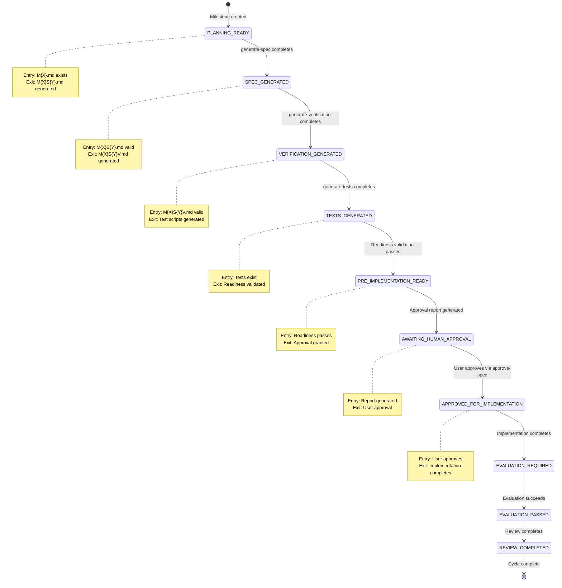

# manage-development Skill: Tactical SDD Orchestrator

## Role in OMP AEF

`manage-development` is a Tactical Engineering Manager that orchestrates the Spec-Driven Development (SDD) pipeline for an active milestone, with cycle reporting and roadmap integration.

## Usage in Framework Skills

### When manage-development is Used

| Skill | Purpose | Example Commands |
|-------|---------|------------------|
| `manage-roadmap` | After cycle completes, generate next milestone | `M{X}C.md` → manage-roadmap |
| `review-implementation` | After evaluation passes, perform review | `M{X}S{Y}E.md` → review-implementation |
| `sync-documentation` | After review passes, sync to docs | `M{X}S{Y}R.md` → sync-documentation |
| `archive-milestone` | After all specs reviewed, archive | `M{X}S{Y}R.md` → archive-milestone |

## Integration Points

### SDD Pipeline Sequence

```bash
# Milestone → Specification → Verification → Tests → Implementation → Evaluation → Review → Sync → Archive
# Orchestrate each step automatically based on detected artifacts
```

### Pipeline Stage Detection

- Milestone (`M{X}.md`) → requires `generate-spec`
- Specification (`M{X}S{Y}.md`) → requires `generate-verification`
- Verification (`M{X}S{Y}V.md`) → requires `generate-tests`
- Test Scripts → requires `implement-specification`
- Completion Report → requires `evaluate-implementation`
- Evaluation Report → requires `investigate-issue` or `hotfix-issue`
- Evaluation Report passed → requires `review-implementation`
- Review Report → requires `sync-documentation`
- All specs reviewed → requires `archive-milestone` or `cycle-report`

## Requirements

### Lifecycle State Machine (FR-2)



### Implementation Functions (FR-3, FR-5, FR-6, FR-8, FR-9, FR-11)

The following functions are implemented in `skills/manage-development/SKILL.md`:

1. **validate_artifact_state()** (FR-9)
   - Validates artifact integrity
   - Returns state: MISSING, GENERATED, VALIDATED, STALE, APPROVED
   - Checks existence, staleness, and content validity

2. **enforce_pipeline_sequence()** (FR-3)
   - Enforces strict SDD pipeline sequence
   - Validates prerequisites before stage progression
   - Blocks implementation without approval

3. **validate_readiness()** (FR-5)
   - Comprehensive validation of spec, verification, tests
   - Checks consistency across all artifacts
   - Returns READY_FOR_APPROVAL or NOT_READY_FOR_APPROVAL

4. **generate_approval_report()** (FR-6)
   - Generates consolidated approval report
   - Includes spec, verification, test, and consistency summaries
   - Explicit status: READY FOR IMPLEMENTATION APPROVAL

5. **detect_interruption()** (FR-8)
   - Identifies safe resumption points
   - Detects current stage based on artifacts
   - Returns interruption point or IMPLEMENTATION_COMPLETE

6. **resume_orchestration()** (FR-8)
   - Implements resume/recovery logic
   - Prevents redundant stage execution
   - Enforces sequential progression

7. **Integration with approve-spec** (FR-7)
   - Responsibility separation
   - manage-development determines WHEN approval is required
   - approve-spec handles the approval decision
   - No changes to approve-spec functionality

### Pipeline Integrity Requirements

1. **Strict Sequence Enforcement (FR-3)**
   - Generate spec → Generate verification → Generate tests → Readiness validation → Approval gate → Implementation
   - Validate previous stage completion before proceeding

2. **Artifact Validation (FR-3, FR-5)**
   - Validate artifact existence, validity, and integrity
   - Use validate_artifact_state() to distinguish MISSING, GENERATED, VALIDATED, STALE, APPROVED

3. **Test Readiness Validation (FR-5)**
   - Validate spec, verification, tests, and consistency
   - Ensure all prerequisites are met before implementation

4. **Approval Gate (FR-6)**
   - Generate approval report with spec/verification/test/consistency summaries
   - Require explicit user approval before implementation

5. **Resume/Recovery (FR-8)**
   - Handle interruptions at any stage
   - No redundant re-execution of completed stages

6. **Artifact Integrity (FR-9)**
   - Invalidate stale artifacts on upstream changes
   - Validate artifact states before progression

7. **Manage-Roadmap Focus (FR-10)**
   - Handoff contract only, no execution tasks

8. **Negative Guardrails (FR-11)**
   - Enforce prohibitions preventing bypasses
   - Block unauthorized operations

### Prerequisites

1. **Active Milestone**
   - Milestone directory exists: `milestones/M{X}/`
   - Active milestone status in `docs/MILESTONES.md`

2. **SDD Templates**
   - Cycle report template: `~/devcode/aef/agent/templates/cycle_report_template.md`

3. **Project Documentation**
   - `docs/ROADMAP.md`
   - `docs/MILESTONES.md`

### Setup

1. **Assess Active State:**
   ```bash
   # Scan milestones/M{X}/ directory
   glob path="milestones/M{X}/*"
   ```

2. **Determine Pipeline Stage:**
   - Analyze presence of artifacts
   - Identify next required skill
   - Execute next action

## Best Practices

### Before Managing Development

**Use manage-development when:**
- You have an active milestone
- You want to follow the SDD pipeline sequentially
- You want cycle reporting and roadmap integration

**Avoid manage-development when:**
- You need to create a new milestone (use `manage-roadmap`)
- You want to perform a specific SDD phase manually (use the appropriate skill directly)

### Pipeline Orchestration Guidelines

**Strict Sequence:**
1. Milestone → Specification → Verification → Tests → Implementation → Evaluation → Review → Sync → Archive

**Auto-Invocation:**
- Automatically determine and invoke the next required skill
- Invoke `investigate-issue` or `hotfix-issue` based on evaluation failures

**Cycle Reporting:**
- When milestone cycle completes
- Generate cycle report using template
- Include roadmap context

## Output

**Cycle Report:**
- File: `milestones/M{X}/M{X}C.md`
- Format: Cycle report template
- Contents: Summary of all artifacts, completion status, recommendations

**Orchestrated Skills:**
- `generate-spec`
- `generate-verification`
- `generate-tests`
- `implement-specification`
- `evaluate-implementation`
- `review-implementation`
- `sync-documentation`
- `archive-milestone`
- `investigate-issue` or `hotfix-issue`

+
+## Post-Approval Orchestration (M5S1)
+
+### Overview
+
+After explicit human approval, `manage-development` automatically executes the post-approval execution chain: implement → evaluate → route → repair/review (automatic). No manual invocation between stages (except escalation).
+
+### Key Functions
+
+**`execute_post_approval_workflow(milestone_id, spec_id, implementation_report)`**
+- Orchestrates complete post-approval chain
+- Parameters: milestone identifier, spec identifier, implementation report
+- Returns: SUCCESS, REQUIRES_REAPPROVAL, HUMAN_INTERVENTION, or FAILURE
+
+**`route_evaluation_result(evaluation_result, milestone_id, spec_id, issue_details)`**
+- Determines next step based on evaluation outcome
+- Four routing paths: PASS (review), MINOR (hotfix), COMPLEX (investigate), HUMAN (escalation)
+- Returns: Evaluation action to take (next step or human gate)
+
+**`auto_repair(issue_details, repair_type)`**
+- Executes hotfix for MINOR defects
+- Validates MAX_AUTO_REPAIR_CYCLES limit (default 2-3)
+- No approval required if scope unchanged
+
+**`investigate_issue(issue_details, milestone_id, spec_id)`**
+- Executes investigate-issue for COMPLEX issues
+- Detects if requirement/architecture/scope change needed
+- Routes back to pre-approval if changes required
+
+**`should_return_to_approval_gate(issue_details)`**
+- Checks if repair requires re-approval
+- Enforces FR-4: No route bypasses verification → tests → readiness → approval
+- Returns: True if re-approval required, False otherwise
+
+**`enforce_repair_limit()`**
+- Validates MAX_AUTO_REPAIR_CYCLES limit enforcement
+- Prevents infinite repair loops (F3)
+- Returns: True if limit not exceeded, False if limit reached
+
+**`trigger_review(milestone_id, spec_id)`**
+- Automatically invokes review-implementation after PASS
+- Ensures review report includes required fields (F6)
+- Returns: Review report to user
+
+**`human_escalation_report(state, cause, attempted_actions, failed_tests, options, decision)`**
+- Formats evidence-based escalation report (F5)
+- Includes: current state, root cause, attempted actions, failed tests, proposed options, exact decision required
+- Returns: Formatted escalation report string
+
+### Repair Loop Tracker Module
+
+Tracks repair attempts for current implementation task:
+
+**State**:
+- `current_implementation_task`: Task identifier
+- `repair_attempt_counter`: Integer (starts at 0)
+- `max_repair_cycles`: Integer (default 2 or 3)
+
+**Operations**:
+- `increment_repair_counter()`: Increment counter by 1
+- `get_repair_cycle_count()`: Get current counter value
+- `reset_repair_counter()`: Reset counter to 0 (on new approval)
+- `check_repair_limit()`: Returns true if counter >= max_repair_cycles
+
+### Lifecycle State Machine

+Post-approval state machine includes 15 states:
+
+**Pre-approval states** (unchanged from M4):
+- PLANNING_READY, SPEC_GENERATED, VERIFICATION_GENERATED, TESTS_GENERATED, PRE_IMPLEMENTATION_READY, AWAITING_HUMAN_APPROVAL, APPROVED_FOR_IMPLEMENTATION
+
+**Post-approval states** (new):
+- IMPLEMENTING, EVALUATION_REQUIRED, ROUTING, PASS, REVIEWING, FINAL_REPORT, MINOR, HOTFIXING, COMPLEX, INVESTIGATING, DETECT_CHANGE?, APPROVAL_GATE, HUMAN, REPORTING, WAITING
+
+**State transitions**:
+- IMPLEMENTING → EVALUATION_REQUIRED → ROUTING
+- ROUTING → PASS → REVIEWING → FINAL_REPORT (success path)
+- ROUTING → MINOR → HOTFIXING → EVALUATION_REQUIRED (hotfix path, bounded by MAX_AUTO_REPAIR_CYCLES)
+- ROUTING → COMPLEX → INVESTIGATING → DETECT_CHANGE? → (APPROVAL_GATE or EVALUATION_REQUIRED)
+- ROUTING → HUMAN → REPORTING → WAITING → [*] (human intervention path)
+
+### Safety Mechanisms
+
+**Approval Gate Protection** (FR-1):
+- Pre-implementation integrity milestone (M4) remains unchanged
+- Requirement changes always route to approval gate
+- No individual skill internal logic changes
+- M4 approval gate verified intact
+
+**Repair Loop Protection** (FR-3):
+- MAX_AUTO_REPAIR_CYCLES limit enforced (default 2-3)
+- Counter increments per MINOR repair
+- Reset only on genuinely new approved implementation cycle
+- Task isolation: each task has its own repair counter
+- Stop and report when limit reached, ask for human intervention
+
+**Test-Driven Completion Enforcement** (FR-5):
+- Test failures = real failures (no auto-fix allowed)
+- Repair loop stops if tests fail
+- No autonomous repairs without test success
+- Repair reports include test results
+
+**Requirement Change Detection** (FR-4):
+- All repair paths check for requirement/architecture/scope changes
+- Changes trigger auto-route to pre-approval stages
+- F4.5: No route bypasses verification → tests → readiness → approval
+
+**Review Automation** (FR-6):
+- Review automatically invoked after PASS
+- Review report includes all required fields
+- Report returned to user
+- No new milestone started automatically
+
+### Routing Paths
+
+**PASS Path**:
+- Evaluation result = PASS
+- Automatically invoke review-implementation
+- Review completes and returns final report
+- Cycle complete (no new milestone)
+
+**MINOR DEFECT Path**:
+- Evaluation result = MINOR_IMPLEMENTATION_DEFECT
+- Check conditions met for MINOR (scope unchanged, localized, no approval needed)
+- Execute auto_repair() for hotfix
+- Re-evaluate after repair
+- Loop bounded by MAX_AUTO_REPAIR_CYCLES
+
+**COMPLEX ISSUE Path**:
+- Evaluation result = COMPLEX_OR_UNCLEAR_ISSUE
+- Route to investigate-issue
+- Check if requirement/architecture/scope change needed
+- If change needed: auto-route to pre-approval (re-approval required)
+- If no change needed: re-evaluate (no approval required)
+
+**HUMAN ESCALATION Path**:
+- Evaluation triggers HUMAN_ESCALATION
+- Auto-route to human_escalation_report()
+- Report includes: current state, root cause, attempted actions, failed tests, proposed options, exact decision required
+- Wait for user decision
+- Decision triggers: new cycle (PASS/COMPLEX), approve new spec, or stop
+
+### Pre-Conditions and Post-Conditions
+
+**Pre-Conditions** (F1):
+- Implementation receives approved artifacts (spec, verif, test plan)
+- Implementation completes successfully
+
+**Post-Conditions** (F1-F6):
+- Orchestrator continues to evaluation and routing (does not declare success)
+- Evaluation results in one of four routing paths
+- Each routing path has bounded execution (no infinite loops)
+- Test-driven completion enforced (no auto-fix, no skipping tests)
+- Repair loop bounded by MAX_AUTO_REPAIR_CYCLES
+- Review automation ensures completeness
+- Approval gate remains protected
+
+### Edge Cases Covered
+
+- Empty implementation (implementation succeeds but evaluation fails)
+- Implementation succeeds but evaluation fails
+- Concurrent implementation tasks (each with own repair counter)
+- MAX_AUTO_REPAIR_CYCLES boundary conditions
+- Specification/architecture/questionable/verification/partial failure/state corruption/human intervention/requirements conflict/approved scope change/autonomous repair unsafe/investigation contradictory/tests and spec disagree/test expectation change during repair/artifact missing/state persistence across manual intervention
+
+### Risk Mitigations
+
+- Approval gate not weakened (F1)
+- Requirement-change detection (F4)
+- MAX_AUTO_REPAIR_CYCLES enforced (F3)
+- Test failures = real failures (F5)
+- No internal skill logic changes (F7)
+- M4 approval gate verified intact
+- Requirement changes require re-approval
+- Limit enforcement checked before each repair
+- Test failures prevent success
+- Individual skills unchanged
+- Allowlist compliance (only SKILL.md and README.md changed)
+- Denylist compliance (no unexpected files modified)
+
+### Performance Considerations
+
+- Evaluation routing < 1 second
+- Repair loop enforcement O(1)
+- No redundant artifact reading
+- Routing decisions scalable
+- State management scalable
+
+### Test Coverage
+
+154 test cases across 16 test suites:
+- test_post_approval_workflow.sh (31 test cases)
+- test_routing_paths.sh (6 test cases)
+- test_repair_tracker.sh (8 test cases)
+- test_approval_protection.sh (7 test cases)
+- test_test_driven_completion.sh (7 test cases)
+- test_review_automation.sh (6 test cases)
+- test_orchestration_ownership.sh (12 test cases)
+- test_manage_roadmap_focus.sh (5 test cases)
+- test_performance.sh (6 test cases)
+- test_reliability.sh (6 test cases)
+- test_testability.sh (6 test cases)
+- test_extensibility.sh (6 test cases)
+- test_edge_cases.sh (21 test cases)
+- test_risk_mitigation.sh (13 test cases)
+- test_diff_scope.sh (5 test cases)
+- test_orchestration_validation.sh (7 test cases for M4 regression)
+
+### Completion Status
+
+All functional requirements (FR-1 through FR-8) verified.
+All non-functional requirements (NFR-1 through NFR-7) verified.
+All edge cases and risk mitigations validated.
+Scope compliance verified (only SKILL.md and README.md changed).
+
+### Handoff to Next Phase
+
+M5S1 post-approval orchestration is complete and ready for handoff to:
+- M5S2: Additional post-approval capabilities
+- M5S3: Integration with other skills
+- M5S4: Production deployment and monitoring
+
+The M5S1C.md completion report documents all verification and evidence.
## Out of Scope

**You are:**
- An orchestrator and state-tracker
- Responsible for detecting artifacts, validating integrity, and enforcing strict sequence
- Ensuring readiness validation, approval gates, and negative guardrails are enforced

**Never:**
- Invoke implement-specification without user approval
- Skip generate-verification or generate-tests
- Bypass readiness validation
- Provide implicit approval
- Allow manage-roadmap to execute implementation tasks
- Modify M{X}S{Y}.md without explicit approval (except via approve-spec skill)
- Generate artifacts yourself (specs, verifications, tests, implementations)
- Write code or implement features
