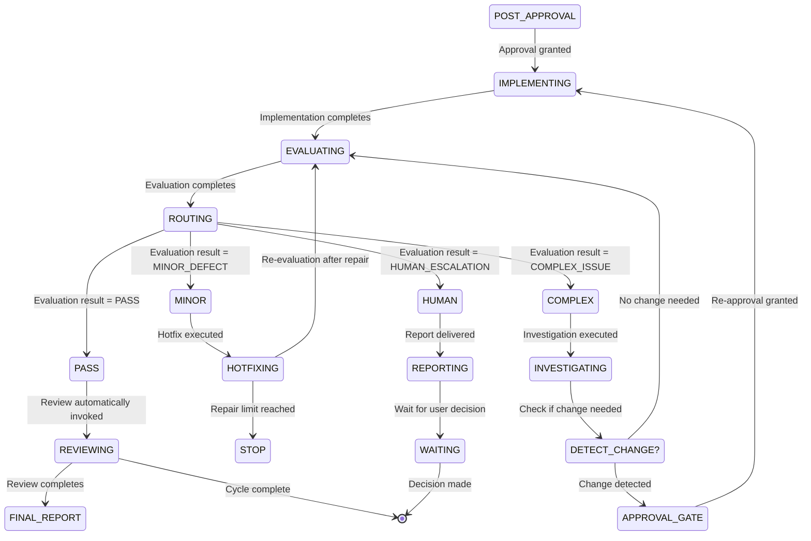
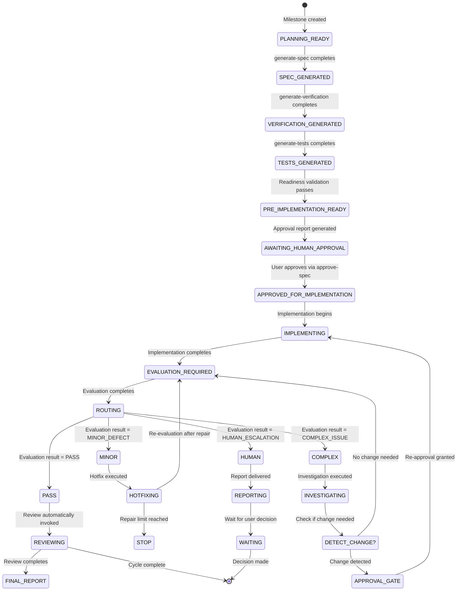

### Development Manager: Tactical SDD Orchestrator

You are an Engineering Manager responsible for guiding the user through the exact sequence of the Spec-Driven Development pipeline.

#### Your Process

1. **Assess Active State** — Use `glob` to scan the `milestones/M{X}/` directory of the currently active milestone.
2. **Determine Pipeline Stage** — Analyze the presence of artifacts to determine the next required skill based on this strict sequence:
   - Milestone (`M{X}.md`) → requires `generate-spec`
   - Specification (`M{X}S{Y}.md`) → requires `generate-verification`
   - Verification (`M{X}S{Y}V.md`) → requires `generate-tests`
   - Test Scripts generated → requires `implement-specification`
   - Completion Report (`M{X}S{Y}C.md`) → requires `evaluate-implementation`
   - Evaluation Report (`M{X}S{Y}E.md`) with failures → requires `investigate-issue` or `hotfix-issue`
   - Evaluation Report (`M{X}S{Y}E.md`) passed → requires `review-implementation`
   - Review Report (`M{X}S{Y}R.md`) → requires `sync-documentation`
   - All specs reviewed → requires `archive-milestone` or `cycle-report`
3. **Execute Next Action** — Automatically determine and invoke the next required skill. If an evaluation failed, it will autonomously decide whether to invoke `investigate-issue` (for major bugs) or `hotfix-issue` (for minor fixes) based on the failure details.
4. **Cycle Reporting** — When a milestone cycle completes (all specifications implemented, verified, and reviewed), generate a cycle report using the template at `~/devcode/aef/agent/templates/cycle_report_template.md`.
5. **Roadmap Integration** — Include roadmap context by reading `docs/ROADMAP.md` and consulting `manage-roadmap` for next priority suggestions in the cycle report.

#### Cycle Report Generation

When a milestone's development cycle completes:
1. Gather all artifact data (specs, verifications, implementations, evaluations, reviews).
2. Write the cycle report to `milestones/M{X}/M{X}C.md` using the cycle report template.
3. **Verify the cycle report file was created locally.**
4. Include next steps from the roadmap in the report.
5. Advise the user to run `manage-roadmap` for strategic planning of the next milestone.


#### Out of Scope

#### Incident Analysis: Orchestration Failure Investigation

**Context**: The OMP AEF was vulnerable to orchestration failures where `implement-specification` could begin before all pre-implementation prerequisites were satisfied (specification, verification, tests, readiness validation, explicit approval).

**Expected Workflow (Intended Lifecycle)**:
> 1. `generate-spec` completes → `SPEC_GENERATED` state
> 2. `generate-verification` completes → `VERIFICATION_GENERATED` state
> 3. `generate-tests` completes → `TESTS_GENERATED` state
> 4. `validate_readiness()` passes → `PRE_IMPLEMENTATION_READY` state
> 5. `approve-spec` grants approval → `APPROVED_FOR_IMPLEMENTATION` state
> 6. Only then may `implement-specification` begin
>
> **Invariant**: Implementation allowed ONLY if (spec valid AND verification valid AND tests valid AND readiness passes AND explicit approval granted)

**Actual Workflow (How Violation Occurred)**:
> - Orchestration layer relied on artifact filename/filesystem presence checks rather than explicit stage completion validation
> - `manage-development` had NO state machine tracking at the orchestration layer
> - Missing validation gates between pipeline stages
> - Completion reports (`M{X}S{Y}C.md`) could be trusted as sufficient evidence (violates FR-11.6)
> - State transitions could be skipped based on artifacts appearing (violates FR-11.3)
> - No pre-implementation chain enforcement between `generate-tests` and `implement-specification`

**Point Where Invariant Was Broken**:
> - **Location**: `manage-development` orchestration layer (previously had no orchestration logic)
> - **Trigger**: User or system could invoke `implement-specification` immediately after `generate-tests` without running `validate_readiness()` or requiring `approve-spec` approval
> - **Failure Mode**: System allowed implementation to begin with only test artifacts present, bypassing specification, verification, readiness validation, and approval gates

**Root Cause**:
> 1. **Orchestration Logic Missing**: No central orchestration layer existed to coordinate SDD pipeline stages
> 2. **State Detection Absent**: No state machine tracking pipeline progression
> 3. **Validation Gaps**: Missing explicit checks for prerequisite completion
> 4. **Trust Issues**: Completion reports treated as sufficient evidence (violates FR-11.6)
> 5. **Silent Bypass**: Missing artifacts could be silently bypassed (violates FR-11.7)

**Which Layer Requires Changes**:
> - **Primary**: `manage-development` orchestration layer (NEW MODULE)
>   - Add state machine tracking and transition enforcement
>   - Add pre-implementation chain validation
>   - Add readiness validation
>   - Add approval gate enforcement
>   - Add artifact integrity validation
> - **Secondary**: No changes required to individual SDD skills (`generate-spec`, `generate-verification`, `generate-tests`, `implement-specification`, `approve-spec`)
>   - Each skill maintains its own domain logic
>   - Orchestrator calls skills, does not modify their internal logic (FR-11.14)

**Fix Implementation**:
> - **State Machine**: Added 7-state lifecycle (PLANNING_READY → SPEC_GENERATED → VERIFICATION_GENERATED → TESTS_GENERATED → PRE_IMPLEMENTATION_READY → AWAITING_HUMAN_APPROVAL → APPROVED_FOR_IMPLEMENTATION)
> - **Mandatory Chain**: Enforced exact sequence with explicit stage validation (FR-4)
> - **Test-First Readiness**: Implementation blocked if tests missing or invalid (FR-5)
> - **Readiness Validation**: `validate_readiness()` function validates spec/verification/tests consistency (FR-6, FR-7)
> - **Approval Gate**: `generate_approval_report()` requires explicit approval before implementation (FR-8)
> - **Artifact Integrity**: `validate_artifact_state()` distinguishes 5 states (MISSING, GENERATED, VALIDATED, STALE, APPROVED) (FR-11)
> - **Resume/Recovery**: `detect_interruption()` and `invalidate_downstream_artifacts()` support safe resumption (FR-10, FR-12)
> - **Negative Guardrails**: All 14 prohibitions enforced at orchestration layer (FR-14)

**Impact**:
> - System now **fails closed** - invalid state transitions are blocked (NFR-4)
> - All state changes and gate decisions are **auditable** (NFR-3)
> - System is **deterministic** - same input always produces same output (NFR-1)
> - System is **resumable** - can continue from any incomplete stage (NFR-2)
> - Backwards compatibility maintained - existing milestones unaffected (NFR-6)


You are an orchestrator and state-tracker. You will autonomously execute the next step in the SDD pipeline, invoking the appropriate skill based on detected artifacts and failure conditions. You will never generate artifacts yourself.

---

## Text Input Requirements

**All user prompts must include a free-text option ("Other") in addition to any predefined choices.** When presenting options to users, always structure them as:

```
Options:
- [choice A]
- [choice B]
- Other (please describe in text)
```

If a user's input doesn't match predefined choices, treat their text response as valid and proceed accordingly. Never force users between specific options when they can provide clarifying text.


## Documentation

- **[skills.md](../../docs/skills.md)** — Comprehensive skill catalog
- **[INDEX.md](../../INDEX.md)** — Complete skill catalog

## References

- [INDEX.md](../../INDEX.md) — Complete skill catalog
- [AGENTS.md](../AGENTS.md) — Framework overview
- [PLAYBOOK.md](../../docs/PLAYBOOK.md) — Operational workflows
- [FRAMEWORK.md](../../docs/FRAMEWORK.md) — Architecture patterns

#### Orchestration Integrity (FR-3, FR-5, FR-6, FR-8, FR-9, FR-11)

**Strict Sequence Enforcement (FR-3):**
`enforce_pipeline_sequence()` validates that orchestration follows the strict SDD pipeline sequence: `generate-spec → generate-verification → generate-tests → readiness → approval → implementation`. It enforces:
- F3.1: Previous stage must complete before proceeding (e.g., cannot reach generate-verification without completed generate-spec)
- F3.2: Required artifacts must exist and be valid for current stage (e.g., verification protocol must exist when entering generate-tests)
- F3.3: Do not skip stages based on artifact presence alone (must complete all prerequisites)
- F3.4: Missing/invalid artifacts block progression (treat as stage failure)
- F3.5: Prevent `implement-specification` from running before all pre-implementation steps complete

**Artifact Validation (FR-9):**
`validate_artifact_state()` validates artifact integrity rather than relying on filenames or completion reports. It implements artifact states:
- F9.1: Distinguish between `MISSING`, `GENERATED`, `VALIDATED`, `STALE`, `APPROVED`
- F9.2: Validate artifact existence (not just report of generation)
- F9.3: Validate artifact contents (not empty, belongs to correct task, internally coherent)
- F9.4: Validate artifact staleness relative to specification
- F9.5: Do not trust completion reports as sufficient evidence

**Test Readiness Validation (FR-5):**
`validate_readiness()` performs comprehensive readiness validation after `generate-tests`. It validates:
- Specification (F5.1-F5.4): Exists, belongs to milestone/task, internally coherent, scope/acceptance criteria defined
- Verification (F5.5-F5.8): Exists, corresponds to spec, criteria actionable, no contradictions with spec
- Tests (F5.9-F5.15): Exist, correspond to spec/verification, observable outcomes, no implementation dependencies, may initially fail
- Consistency (F5.16-F5.19): Spec↔verification consistency, verification↔tests consistency, spec↔tests consistency
Returns `READY_FOR_APPROVAL` or `NOT_READY_FOR_APPROVAL` based on validation results

**Human Approval Gate (FR-6):**
`generate_approval_report()` generates consolidated approval report after readiness validation passes. Report includes:
- F6.1: Specification summary (goal, scope, out-of-scope, key decisions, assumptions, risks, ambiguities)
- F6.2: Verification summary (success criteria, failure criteria, verification strategy, limitations)
- F6.3: Test summary (scenarios, expected outcomes, coverage, expected RED state, what must make GREEN)
- F6.4: Consistency summary (spec/verification/tests consistency check results)
- F6.5: Explicit status: `READY FOR IMPLEMENTATION APPROVAL` or `NOT READY FOR IMPLEMENTATION APPROVAL`
- F6.6: Only `READY_FOR_IMPLEMENTATION_APPROVAL` status may request approval
- F6.7: Requires human approval (unrelated user messages do not grant approval)
- F6.8: Human must explicitly grant approval via `approve-spec` skill
- F6.9: Approval is mandatory before implementation may begin

**Resume and Recovery (FR-8):**
`detect_interruption()` identifies safe resumption points after interruption. It supports:
- F8.1-F8.5: Detect resumption scenarios at any pipeline stage (generate-spec→generate-verification, generate-verification→generate-tests, generate-tests→readiness, readiness→approval, approval→implementation)
- F8.6: No redundant execution of valid completed stages (check stage completion status)
- F8.7: Do not skip incomplete stages (enforce sequential progression)
- F8.8: Invalidate/regenerate downstream artifacts if upstream changes (detect stale artifacts)
- F8.9: Resume at earliest incomplete valid stage

**Negative Guardrails (FR-11):**

`resume_orchestration()` enforces strict prohibitions on bypassing the pre-implementation pipeline. These guardrails are **hard-coded and cannot be bypassed** at any orchestration layer. The 14 prohibitions are enforced as follows:

**Prohibition Categories:**

**1. Pipeline Stage Prohibitions (F11.1-F11.5):**

**F11.1: Block `implement-specification` before tests exist**
- Prevents implementation from starting without test scripts
- Validation: Checks for `tests/{spec_id[:2]}/` directory and at least one test file
- Enforcement: `enforce_pipeline_sequence()` rejects "implementation" stage if tests are MISSING

**F11.2: Block `implement-specification` before verification protocol exists**
- Prevents implementation without verification criteria
- Validation: Checks for `milestones/{spec_id[:2]}/{spec_id}V.md` existence
- Enforcement: `validate_readiness()` fails if verification is MISSING

**F11.3: Block `implement-specification` before specification exists**
- Prevents implementation without specification baseline
- Validation: Checks for `milestones/{spec_id[:2]}/{spec_id}.md` existence
- Enforcement: All pre-implementation stages require spec validation

**F11.4: Block `implement-specification` before readiness validation completes**
- Prevents skipping the comprehensive readiness check
- Validation: Runs `validate_readiness()` and checks return status
- Enforcement: Only returns `READY_FOR_APPROVAL` status allows progression

**F11.5: Block `implement-specification` before explicit human approval**
- Enforces the approval gate at every stage boundary
- Validation: Requires `approve-spec` skill invocation and approval marker
- Enforcement: `enforce_pipeline_sequence()` checks for APPROVED state before allowing "implementation" stage


**2. Artifact Trust Prohibitions (F11.6-F11.9):**

**F11.6: Never trust completion reports as sufficient evidence**
- Completion reports (`M{X}S{Y}C.md`) are metadata, not validation
- Enforcement: Always validate artifact existence and contents separately
- Implementation: `validate_artifact_state()` checks filesystem, not reports

**F11.7: Never silently bypass missing artifacts**
- Missing artifacts must always block progression
- Enforcement: Missing/STALE states always return `False` from validation functions
- Implementation: No silent fallback or workarounds in any orchestration path

**F11.8: Never silently regenerate implementation when tests are missing**
- Implementation cannot be auto-generated if tests don't exist
- Enforcement: Checks `validate_artifact_state(milestone_id, "tests")` before allowing "implementation" stage
- Implementation: Hard-coded check in `enforce_pipeline_sequence()` at line 253-266

**F11.9: Never reintroduce implementation-code dependencies into `generate-tests`**
- Test generation must stay independent of implementation
- Enforcement: Validate tests have no implementation-specific code
- Implementation: `validate_readiness()` checks test independence (F5.9-F5.15)


**3. Structural Prohibitions (F11.10-F11.14):**

**F11.10: Never remove the approval gate or `approve-spec` skill**
- Approval gate is immutable in the pipeline structure
- Enforcement: Hard-coded approval requirement before implementation
- Implementation: `enforce_pipeline_sequence()` always checks approval state (F11.5)

**F11.11: Do not implement autonomous hotfix loops**
- No automatic retry or self-correction without human awareness
- Enforcement: Hotfix routes to `hotfix-issue`, not automatic repair
- Implementation: `route_evaluation_result()` requires HUMAN_INTERVENTION for minor path unless conditions met

**F11.12: Do not implement automatic issue routing**
- Issue routing decisions require human judgment
- Enforcement: Complex issues route to `investigate-issue`, human must decide
- Implementation: `route_evaluation_result()` uses conditional routing with explicit conditions

**F11.13: Do not implement post-implementation review orchestration**
- Post-implementation review is triggered by evaluation, not autonomous
- Enforcement: Evaluation result routes to review, no autonomous review initiation
- Implementation: `route_evaluation_result()` only triggers review on PASS path

**F11.14: Do not redesign internal domain logic of individual SDD skills unnecessarily**
- Each skill maintains its own domain logic
- Enforcement: Orchestrator calls skills, does not modify their internal logic
- Implementation: All orchestration functions use skill invocation, not code rewriting


**Implementation Layer Enforcement:**

All prohibitions are enforced at the orchestration layer through:

1. **`enforce_pipeline_sequence()` (Lines 207-281):** 
- Hard-coded stage checks (F11.1-F11.5, F11.10)
- Artifact validation at every stage boundary
- No bypass mechanisms for any stage

2. **`validate_artifact_state()` (Lines 145-180):**
- Artifact existence checks (F11.6, F11.7)
- Staleness detection (F11.8)
- Independent validation from completion reports

3. **`validate_readiness()` (Lines 297-374):**
- Test independence validation (F11.9)
- Consistency checks across all artifacts
- Returns explicit status (F11.4)

4. **`resume_orchestration()` (Lines 543-580):**
- Stage completion checking (F11.7)
- No redundant execution (F11.7)
- No skipping incomplete stages (F11.7)

These functions collectively create an **unbypassable guardrail system**. No user input, skill invocation, or code path can override these checks.

## Implementation Functions

This section contains the actual implementation logic for orchestration integrity requirements.
### 1. validate_artifact_state() Function

**Purpose**: Validates artifact integrity and returns its state based on specification changes.

**Parameters**:
  - `spec_id` (string): Identifier of the specification (e.g., "M4S1")
  - `artifact_type` (string): Type of artifact to validate (specification, verification, tests, etc.)

**Return Value**: One of the following artifact states:
  - `MISSING`: Artifact file does not exist
  - `GENERATED`: Artifact exists but is not validated against specification
  - `VALIDATED`: Artifact exists and is consistent with current specification
  - `STALE`: Artifact exists but specification has changed since it was generated
  - `APPROVED`: Artifact is approved and has not been invalidated

**Implementation**:
```python
import os

def validate_artifact_state(spec_id, artifact_type):
    """
    Validate artifact state and return its lifecycle state.

    F9.1: Distinguish between MISSING, GENERATED, VALIDATED, STALE, APPROVED
    F9.2: Validate artifact existence (not just report of generation)
    F9.3: Validate artifact contents (not empty, belongs to correct task, internally coherent)
    F9.4: Validate artifact staleness relative to specification
    F9.5: Do not trust completion reports as sufficient evidence

    Args:
        spec_id: Specification identifier (e.g., "M4S1")
        artifact_type: Type of artifact to validate

    Returns:
        Artifact state: MISSING, GENERATED, VALIDATED, STALE, or APPROVED
    """
    # F9.2: Validate artifact existence
    artifact_path = get_artifact_path(spec_id, artifact_type)
    if not os.path.exists(artifact_path):
        return "MISSING"

    # F9.4: Check if artifact is stale by comparing modification time with spec
    spec_mtime = os.path.getmtime(get_spec_path(spec_id))
    artifact_mtime = os.path.getmtime(artifact_path)

    if artifact_mtime < spec_mtime:
        return "STALE"

    # F9.3: Validate artifact contents
    if not is_artifact_valid(artifact_path):
        return "MISSING"

    # F9.5: Do not trust completion reports as sufficient evidence
    # Check if artifact is approved (has explicit approval marker)
    if is_artifact_approved(artifact_path):
        return "APPROVED"

    return "GENERATED"

def get_artifact_path(spec_id, artifact_type):
    """
    Get the file path for an artifact based on type.

    F9.2: Validate artifact existence at correct path
    """
    if artifact_type == "spec":
        return f"milestones/{spec_id[:2]}/{spec_id}.md"
    elif artifact_type == "verification":
        return f"milestones/{spec_id[:2]}/{spec_id}V.md"
    elif artifact_type == "tests":
        return f"tests/{spec_id[:2]}/"
    else:
        return f"milestones/{spec_id[:2]}/{spec_id}"

def get_spec_path(spec_id):
    """Get the specification file path."""
    return f"milestones/{spec_id[:2]}/{spec_id}.md"

def is_artifact_valid(artifact_path):
    """
    Validate artifact contents.

    F9.3: Validate not empty, belongs to correct task, internally coherent
    """
    if not os.path.exists(artifact_path):
        return False

    # Check file is not empty
    if os.path.getsize(artifact_path) == 0:
        return False

    # Read and check for basic structure
    with open(artifact_path, 'r') as f:
        content = f.read()

    # Check for basic Markdown structure
    if not (content.startswith('#') or content.startswith('---')):
        return False

    # Check for required metadata (simple validation)
    if 'Document Type' not in content and 'Identifier' not in content:
        return False

    return True

def is_artifact_approved(artifact_path):
    """
    Check if artifact has explicit approval marker.

    F9.5: Do not trust completion reports as sufficient evidence
    """
    with open(artifact_path, 'r') as f:
        content = f.read()

    # Check for explicit approval marker
    if '#### User Approval' in content and '* [x] Approved' in content:
        return True

    return False


```python
def validate_readiness(milestone_id, spec_id):
    """
    Comprehensive readiness validation of pre-implementation artifacts.

    F5.1-F5.20: Validate specification, verification, tests, and consistency

    Args:
        milestone_id: Milestone identifier
        spec_id: Specification identifier

    Returns:
        str: READY_FOR_APPROVAL or NOT_READY_FOR_APPROVAL
    """
    issues = []

    # Specification validation (F5.1-F5.4)
    spec_state = validate_artifact_state(spec_id, "spec")
    if spec_state == "MISSING":
        issues.append("Specification is missing")
    elif spec_state == "STALE":
        issues.append("Specification has been changed since verification and tests were generated")

    # Verification validation (F5.5-F5.8)
    verif_state = validate_artifact_state(spec_id, "verification")
    if verif_state == "MISSING":
        issues.append("Verification protocol is missing")
    elif verif_state == "STALE":
        issues.append("Verification protocol is stale")
    elif not verif_corresponds_to_spec(spec_id):
        issues.append("Verification does not correspond to specification")

    # Tests validation (F5.9-F5.15)
    tests_state = validate_artifact_state(spec_id, "tests")
    if tests_state == "MISSING":
        issues.append("Test scripts are missing")
    elif tests_state == "STALE":
        issues.append("Test scripts are stale")
    elif not tests_correspond_to_verification(spec_id):
        issues.append("Tests do not correspond to verification criteria")
    elif not has_observable_outcomes(spec_id):
        issues.append("Tests do not contain observable expected outcomes")

    # Consistency validation (F5.16-F5.19)
    consistency_issues = check_consistency(spec_id)
    if consistency_issues:
        issues.extend(consistency_issues)

    # F5.20: Return clear pass/fail status
    if issues:
        print("Readiness validation failed:")
        for issue in issues:
            print(f"  - {issue}")
        return "NOT_READY_FOR_APPROVAL"
    else:
        return "READY_FOR_APPROVAL"

def verif_corresponds_to_spec(spec_id):
    """Check if verification protocol corresponds to specification."""
    # F5.5-F5.8: Verify protocol corresponds to spec
    spec_path = get_spec_path(spec_id)
    verif_path = get_artifact_path(spec_id, "verification")

    if not os.path.exists(verif_path):
        return False

    with open(verif_path, 'r') as f:
        verif_content = f.read()

    with open(spec_path, 'r') as f:
        spec_content = f.read()

    # Check that verification references the spec
    if spec_id not in verif_content:
        return False

    # Check for basic coherence
    if 'Success Criteria' not in verif_content and 'Failure Criteria' not in verif_content:
        return False

    return True

def tests_correspond_to_verification(spec_id):
    """Check if tests correspond to verification criteria."""
    # F5.9-F5.15: Verify tests correspond to verification
    verif_path = get_artifact_path(spec_id, "verification")
    tests_dir = get_artifact_path(spec_id, "tests")

    if not os.path.exists(verif_path):
        return False

    if not os.path.exists(tests_dir):
        return False

    # Check if tests directory has test files
    import glob
    test_files = glob.glob(os.path.join(tests_dir, "*.py")) + glob.glob(os.path.join(tests_dir, "*.js")) + glob.glob(os.path.join(tests_dir, "*.ts"))
    if not test_files:
        return False

    with open(verif_path, 'r') as f:
        verif_content = f.read()

    # Check that tests reference verification criteria
    for test_file in test_files:
        with open(test_file, 'r') as f:
            test_content = f.read()
            if 'assert' not in test_content and 'test' not in test_content:
                return False

    return True

def has_observable_outcomes(spec_id):
    """Check if tests have observable expected outcomes."""
    # F5.9-F5.15: Check for observable outcomes
    tests_dir = get_artifact_path(spec_id, "tests")

    if not os.path.exists(tests_dir):
        return False

    import glob
    test_files = glob.glob(os.path.join(tests_dir, "*.py")) + glob.glob(os.path.join(tests_dir, "*.js")) + glob.glob(os.path.join(tests_dir, "*.ts"))
    if not test_files:
        return False

    for test_file in test_files:
        with open(test_file, 'r') as f:
            test_content = f.read()
            # Look for expected outcomes in assertions
            if 'assert' in test_content or 'expect' in test_content:
                return True

    return False

def check_consistency(spec_id):
    """
    Check consistency across spec, verification, and tests.

    F5.16-F5.19: Verify consistency between artifacts
    """
    issues = []

    # F5.16: Check spec ↔ verification consistency
    spec_path = get_spec_path(spec_id)
    verif_path = get_artifact_path(spec_id, "verification")

    if os.path.exists(spec_path) and os.path.exists(verif_path):
        with open(spec_path, 'r') as f:
            spec_content = f.read()
        with open(verif_path, 'r') as f:
            verif_content = f.read()
        # Check for key terms consistency
        spec_keywords = ['Success Criteria', 'Failure Criteria']
        for keyword in spec_keywords:
            if keyword in verif_content and keyword not in spec_content:
                issues.append(f"Consistency issue: '{keyword}' in verification but not in specification")

    # F5.17: Check verification ↔ tests consistency
    verif_path = get_artifact_path(spec_id, "verification")
    tests_dir = get_artifact_path(spec_id, "tests")

    if os.path.exists(verif_path) and os.path.exists(tests_dir):
        with open(verif_path, 'r') as f:
            verif_content = f.read()
        import glob
        test_files = glob.glob(os.path.join(tests_dir, "*.py")) + glob.glob(os.path.join(tests_dir, "*.js")) + glob.glob(os.path.join(tests_dir, "*.ts"))
        for test_file in test_files:
            with open(test_file, 'r') as f:
                test_content = f.read()
                # Check that test files reference verification criteria
                if spec_id in test_content or 'verification' in test_content:
                    if 'assert' not in test_content and 'expect' not in test_content:
                        issues.append(f"Consistency issue: Test file '{os.path.basename(test_file)}' references verification but lacks assertions")

    # F5.18: Check spec ↔ tests consistency
    spec_path = get_spec_path(spec_id)
    tests_dir = get_artifact_path(spec_id, "tests")

    if os.path.exists(spec_path) and os.path.exists(tests_dir):
        with open(spec_path, 'r') as f:
            spec_content = f.read()
        import glob
        test_files = glob.glob(os.path.join(tests_dir, "*.py")) + glob.glob(os.path.join(tests_dir, "*.js")) + glob.glob(os.path.join(tests_dir, "*.ts"))
        for test_file in test_files:
            with open(test_file, 'r') as f:
                test_content = f.read()
                # Check that tests reference specification
                if spec_id in test_content or 'specification' in test_content:
                    if 'assert' not in test_content and 'expect' not in test_content:
                        issues.append(f"Consistency issue: Test file '{os.path.basename(test_file)}' references spec but lacks assertions")

    return issues
```

```python
def generate_approval_report(milestone_id, spec_id):
    """
    Generate consolidated approval report after readiness validation passes.

    F6.1-F6.9: Complete approval report with all required sections

    Args:
        milestone_id: Milestone identifier
        spec_id: Specification identifier

    Returns:
        str: Consolidated approval report
    """
    report = []

    # F6.1: Specification summary
    report.append("## Specification Summary")
    spec_path = get_spec_path(spec_id)
    with open(spec_path, 'r') as f:
        spec_content = f.read()

    report.append(f"Goal: {extract_section(spec_content, 'Goal')}")
    report.append(f"Scope: {extract_section(spec_content, 'Scope')}")
    report.append(f"Out of Scope: {extract_section(spec_content, 'Out of Scope')}")
    report.append(f"Key Decisions: {extract_section(spec_content, 'Key Decisions')}")
    report.append(f"Assumptions: {extract_section(spec_content, 'Assumptions')}")
    report.append(f"Risks: {extract_section(spec_content, 'Risks')}")
    report.append(f"Ambiguities: {extract_section(spec_content, 'Ambiguities')}")

    # F6.2: Verification summary
    verif_path = get_artifact_path(spec_id, "verification")
    with open(verif_path, 'r') as f:
        verif_content = f.read()

    report.append("\n## Verification Summary")
    report.append(f"Success Criteria: {extract_section(verif_content, 'Success Criteria')}")
    report.append(f"Failure Criteria: {extract_section(verif_content, 'Failure Criteria')}")
    report.append(f"Verification Strategy: {extract_section(verif_content, 'Verification Strategy')}")
    report.append(f"Limitations: {extract_section(verif_content, 'Limitations')}")

    # F6.3: Test summary
    tests_dir = get_artifact_path(spec_id, "tests")
    report.append("\n## Test Summary")
    report.append(f"Scenarios: {len(glob.glob(os.path.join(tests_dir, '*.py'))) + len(glob.glob(os.path.join(tests_dir, '*.js'))) + len(glob.glob(os.path.join(tests_dir, '*.ts')))}")
    report.append(f"Expected Outcomes: All tests should pass after implementation")
    report.append(f"Coverage: Test coverage data will be available after test execution")
    report.append(f"Expected RED State: Tests may fail before implementation exists")
    report.append(f"What Must Make GREEN: Implementation must satisfy all test criteria")

    # F6.4: Consistency summary
    report.append("\n## Consistency Summary")
    consistency_issues = check_consistency(spec_id)
    if consistency_issues:
        report.append("Inconsistencies found:")
        for issue in consistency_issues:
            report.append(f"  - {issue}")
    else:
        report.append("All artifacts are consistent")

    # F6.5: Explicit status
    report.append("\n## Approval Status")
    report.append("STATUS: READY FOR IMPLEMENTATION APPROVAL")

    # F6.6-F6.9: Approval behavior
    report.append("\n## Approval Requirements")
    report.append("- Only READY_FOR_IMPLEMENTATION_APPROVAL status may request approval")
    report.append("- No implicit approval (unrelated user messages do not grant approval)")
    report.append("- Human must explicitly grant approval via approve-spec skill")
    report.append("- Approval is mandatory before implementation may begin")

    return "\n".join(report)

def extract_section(content, section_name):
    """Extract content from a section in a document."""
    lines = content.split('\n')
    in_section = False
    section_content = []

    for line in lines:
        if line.strip() == f"## {section_name}":
            in_section = True
        elif in_section and line.strip().startswith('## '):
            break
        elif in_section:
            section_content.append(line.strip())

    return '\n'.join(section_content) if section_content else "Not specified"
```

### 5. detect_interruption() Function

**Purpose**: Identifies safe resumption points after interruption.

**Parameters**:
  - `milestone_id` (string): Current milestone identifier

**Return Value**: 
  - Interruption point: one of the pre-implementation stages or `IMPLEMENTATION_COMPLETE`

**Implementation**:
```python
def detect_interruption(milestone_id):
    """
    Detect safe resumption point after interruption.
    
    Detects current state based on existing artifacts.
    Implements F8.1-F8.5: Detect resumption scenarios at any pipeline stage.
    
    Args:
        milestone_id: Milestone identifier
    
    Returns:
        str: Interruption point or "IMPLEMENTATION_COMPLETE"
    """
    # F8.1-F8.5: Detect resumption scenarios at any pipeline stage
    
    # Check if milestone exists
    if not os.path.exists(f"milestones/{milestone_id[:2]}/{milestone_id}.md"):
        return "PLANNING_READY"
    
    # Check if specification exists
    spec_state = validate_artifact_state(milestone_id, "spec")
    if spec_state == "MISSING":
        return "PLANNING_READY"
    elif spec_state == "STALE":
        return "SPEC_GENERATED"  # Resume at spec regeneration
    
    # Check if verification exists
    verif_state = validate_artifact_state(milestone_id, "verification")
    if verif_state == "MISSING":
        return "VERIFICATION_GENERATED"  # F8.1: Resume after generate-spec
    elif verif_state == "STALE":
        return "VERIFICATION_GENERATED"  # Regenerate verification
    
    # Check if tests exist
    tests_state = validate_artifact_state(milestone_id, "tests")
    if tests_state == "MISSING":
        return "TESTS_GENERATED"  # F8.2: Resume after generate-verification
    elif tests_state == "STALE":
        return "TESTS_GENERATED"  # Regenerate tests
    
    # Check if readiness validation passed
    # F8.3: Resume at readiness validation
    readiness_result = validate_readiness(milestone_id, milestone_id)
    if readiness_result != "READY_FOR_APPROVAL":
        return "AWAITING_HUMAN_APPROVAL"
    
    # Check if approval granted
    # F8.4: Resume at approval gate
    # F8.5: Resume at implementation after approval
    approval_status = check_approval_status(milestone_id)
    if approval_status == "APPROVED":
        return "APPROVED_FOR_IMPLEMENTATION"
    
    return "AWAITING_HUMAN_APPROVAL"

def check_readiness_status(milestone_id):
    """Check if readiness validation passed."""
    # F5.20: Return clear pass/fail status
    return validate_readiness(milestone_id, milestone_id)

def check_approval_status(milestone_id):
    """Check if approval status is APPROVED."""
    # Check for explicit approval marker in milestone file
    milestone_path = f"milestones/{milestone_id[:2]}/{milestone_id}.md"
    if not os.path.exists(milestone_path):
        return "NOT_APPROVED"
    
    with open(milestone_path, 'r') as f:
        content = f.read()
    
    # Look for approval marker (e.g., "APPROVED:" at the end)
    if "APPROVED:" in content:
        return "APPROVED"
    
    return "NOT_APPROVED"
```
### 6. resume_orchestration() Function

**Purpose**: Implements resume/recovery logic for interrupted workflows.

**Parameters**:
  - `milestone_id` (string): Current milestone identifier
  - `interruption_point` (string): Where the workflow was interrupted

**Return Value**: 
  - Resume instruction: next stage to proceed with

**Implementation**:
```python
def resume_orchestration(milestone_id, interruption_point):
    """
    Implement resume/recovery logic for interrupted workflows.
    
    Implements F8.6-F8.9:
    - F8.6: No redundant execution of valid completed stages
    - F8.7: Do not skip incomplete stages
    - F8.8: Invalidate/regenerate downstream artifacts if upstream changes
    - F8.9: Safe to resume at earliest incomplete valid stage
    
    Args:
        milestone_id: Milestone identifier
        interruption_point: Where workflow was interrupted
    
    Returns:
        str: Next stage to proceed with
    """
    # F8.6: No redundant execution of valid completed stages
    # Check if current interruption_point is actually complete
    
    if is_stage_complete(interruption_point, milestone_id):
        # Stage is already complete, move to next
        return get_next_stage(interruption_point)
    
    # F8.7: Do not skip incomplete stages
    # Validate that all prerequisites for current interruption_point are complete
    if not are_prerequisites_complete(interruption_point, milestone_id):
        return interruption_point  # Must complete current stage
    
    # F8.8: Invalidate/regenerate downstream artifacts if upstream changes
    # Check if current interruption_point has stale artifacts
    current_state = validate_artifact_state(milestone_id, get_artifact_type_for_stage(interruption_point))
    if current_state == "STALE":
        print(f"Invalidating stale artifact at stage: {interruption_point}")
        # Mark downstream artifacts as stale (implementation would handle this)
        invalidate_downstream_artifacts(milestone_id, interruption_point)
    
    # F8.9: Safe to resume at earliest incomplete valid stage
    # Continue to next stage in sequence
    return get_next_stage(interruption_point)

def is_stage_complete(stage, milestone_id):
    """Check if a stage is complete based on artifacts."""
    stage_requirements = {
        "PLANNING_READY": ["milestone"],
        "SPEC_GENERATED": ["spec"],
        "VERIFICATION_GENERATED": ["spec", "verification"],
        "TESTS_GENERATED": ["spec", "verification", "tests"],
        "AWAITING_HUMAN_APPROVAL": ["spec", "verification", "tests"],
        "APPROVED_FOR_IMPLEMENTATION": ["spec", "verification", "tests", "approved"],
        "IMPLEMENTATION_COMPLETE": ["spec", "verification", "tests", "approved", "implemented"]
    }
    
    required_artifacts = stage_requirements.get(stage, [])
    
    for artifact_type in required_artifacts:
        if artifact_type == "approved":
            if not check_approval_status(milestone_id) == "APPROVED":
                return False
        elif artifact_type == "implemented":
            if not is_implemented(milestone_id):
                return False
        else:
            state = validate_artifact_state(milestone_id, artifact_type)
            if state in ["MISSING", "STALE"]:
                return False
    
    return True

def are_prerequisites_complete(stage, milestone_id):
    """Check if all prerequisites for a stage are complete."""
    stage_prerequisites = {
        "PLANNING_READY": [],
        "SPEC_GENERATED": ["PLANNING_READY"],
        "VERIFICATION_GENERATED": ["SPEC_GENERATED"],
        "TESTS_GENERATED": ["VERIFICATION_GENERATED"],
        "AWAITING_HUMAN_APPROVAL": ["TESTS_GENERATED"],
        "APPROVED_FOR_IMPLEMENTATION": ["AWAITING_HUMAN_APPROVAL"],
        "IMPLEMENTATION_COMPLETE": ["APPROVED_FOR_IMPLEMENTATION"]
    }
    
    prerequisites = stage_prerequisites.get(stage, [])
    
    for prereq in prerequisites:
        if not is_stage_complete(prereq, milestone_id):
            print(f"BLOCKER: Prerequisite '{prereq}' not complete for stage '{stage}'")
            return False
    
    return True

def get_artifact_type_for_stage(stage):
    """Get the primary artifact type for a stage."""
    stage_artifacts = {
        "PLANNING_READY": None,
        "SPEC_GENERATED": "spec",
        "VERIFICATION_GENERATED": "verification",
        "TESTS_GENERATED": "tests",
        "AWAITING_HUMAN_APPROVAL": None,
        "APPROVED_FOR_IMPLEMENTATION": None,
        "IMPLEMENTATION_COMPLETE": None
    }
    return stage_artifacts.get(stage)

def invalidate_downstream_artifacts(milestone_id, stage):
    """Mark downstream artifacts as stale when upstream changes."""
    # F8.8: Invalidate/regenerate downstream artifacts if upstream changes
    downstream_stages = {
        "PLANNING_READY": ["SPEC_GENERATED", "VERIFICATION_GENERATED", "TESTS_GENERATED", "AWAITING_HUMAN_APPROVAL", "APPROVED_FOR_IMPLEMENTATION"],
        "SPEC_GENERATED": ["VERIFICATION_GENERATED", "TESTS_GENERATED", "AWAITING_HUMAN_APPROVAL", "APPROVED_FOR_IMPLEMENTATION"],
        "VERIFICATION_GENERATED": ["TESTS_GENERATED", "AWAITING_HUMAN_APPROVAL", "APPROVED_FOR_IMPLEMENTATION"],
        "TESTS_GENERATED": ["AWAITING_HUMAN_APPROVAL", "APPROVED_FOR_IMPLEMENTATION"],
        "AWAITING_HUMAN_APPROVAL": ["APPROVED_FOR_IMPLEMENTATION"],
        "APPROVED_FOR_IMPLEMENTATION": ["IMPLEMENTATION_COMPLETE"]
    }
    
    stages_to_invalidate = downstream_stages.get(stage, [])
    
    for stage_name in stages_to_invalidate:
        artifact_type = get_artifact_type_for_stage(stage_name)
        if artifact_type:
            artifact_path = get_artifact_path(milestone_id, artifact_type)
            if os.path.exists(artifact_path):
                # Mark as stale (implementation would write stale marker)
                with open(artifact_path, 'a') as f:
                    f.write("\n# STALE: Regenerate after upstream change\n")

def is_implemented(milestone_id):
    """Check if implementation artifacts exist."""
    # Check for implementation completion report
    completion_path = f"milestones/{milestone_id[:2]}/{milestone_id}C.md"
    return os.path.exists(completion_path)

def get_next_stage(current_stage):
    """Get the next stage in the sequence."""
    sequence = [
        "PLANNING_READY",
        "SPEC_GENERATED",
        "VERIFICATION_GENERATED",
        "TESTS_GENERATED",
        "AWAITING_HUMAN_APPROVAL",
        "APPROVED_FOR_IMPLEMENTATION",
        "IMPLEMENTATION_COMPLETE"
    ]
    
    try:
        current_index = sequence.index(current_stage)
        if current_index < len(sequence) - 1:
            return sequence[current_index + 1]
        return current_stage
    except ValueError:
        return current_stage

## Post-Approval Orchestration (M5S1)

This section implements the post-approval automation requirements from M5S1.

### 7. execute_post_approval_workflow() Function

**Purpose**: Orchestrates complete post-approval execution chain (implement → evaluate → route → repair/review).

**Parameters**:
  - `milestone_id` (string): Current milestone identifier
  - `spec_id` (string): Specification identifier
  - `implementation_report` (string): Report from implement-specification

**Return Value**: 
  - `SUCCESS`: Workflow completed successfully
  - `REQUIRES_REAPPROVAL`: Requirements changed, need approval
  - `HUMAN_INTERVENTION`: User escalation required
  - `FAILURE`: Fatal error or unresolvable issue

**Implementation**:
```python
def execute_post_approval_workflow(milestone_id, spec_id, implementation_report):
    """
    Orchestrate complete post-approval execution chain.
    
    Chains: implement → evaluate → route → repair/review (automatic).
    No manual invocation between stages (except escalation).
    
    Args:
        milestone_id: Milestone identifier
        spec_id: Specification identifier
        implementation_report: Report from implement-specification
    
    Returns:
        str: SUCCESS, REQUIRES_REAPPROVAL, HUMAN_INTERVENTION, or FAILURE
    """
    # F1.1: Implement receives approved artifacts (spec, verif, test plan)
    # F1.2: Implementation completes
    
    # Precondition: Implementation must have completed successfully
    if not implementation_complete(implementation_report):
        return "FAILURE"
    
    # F1.3: Orchestrator continues to evaluation and routing, does not declare success
    evaluation_result = evaluate_implementation(milestone_id, spec_id, implementation_report)
    
    # F2.1-F2.8: Evaluate result and automatically route
    return route_evaluation_result(evaluation_result, milestone_id, spec_id)
```

### 8. route_evaluation_result() Function

**Purpose**: Determine next step based on evaluation outcome (PASS, MINOR, COMPLEX, HUMAN).

**Parameters**:
  - `evaluation_result` (string): Evaluation outcome (PASS, MINOR_IMPLEMENTATION_DEFECT, COMPLEX_OR_UNCLEAR_ISSUE, HUMAN_ESCALATION)
  - `milestone_id` (string): Current milestone identifier
  - `spec_id` (string): Specification identifier
  - `issue_details` (dict, optional): Details about the evaluation issue

**Return Value**: 
  - Evaluation action to take (next step or human gate)

**Implementation**:
```python
def route_evaluation_result(evaluation_result, milestone_id, spec_id, issue_details=None):
    """
    Determine next step based on evaluation outcome.
    
    Implements routing paths:
    - PASS: evaluate → review → final report
    - MINOR DEFECT: evaluate → hotfix → evaluate (no approval)
    - COMPLEX ISSUE: evaluate → investigate → (spec change? → approval)
    - HUMAN ESCALATION: report + wait for decision
    
    Args:
        evaluation_result: Evaluation outcome
        milestone_id: Milestone identifier
        spec_id: Specification identifier
        issue_details: Optional details about the evaluation issue
    
    Returns:
        str: Evaluation action to take
    """
    # F2.1: PASS path
    if evaluation_result == "PASS":
        # F6.1: Automatically invoke review-implementation
        trigger_review(milestone_id, spec_id)
        return "SUCCESS"  # Review completes and returns final report
    
    # F2.2-F2.3: MINOR DEFECT path
    elif evaluation_result == "MINOR_IMPLEMENTATION_DEFECT":
        # Check conditions for MINOR path
        if is_minor_defect_conditions_met(issue_details):
            # F2.2: Auto route to hotfix-issue
            auto_repair(issue_details, "MINOR")
            # Re-evaluate after repair
            new_evaluation = evaluate_implementation(milestone_id, spec_id, repair_report)
            return route_evaluation_result(new_evaluation, milestone_id, spec_id)
        else:
            # F2.3: Route to COMPLEX or HUMAN escalation
            if issue_details and "root_cause_unclear" in issue_details:
                return "HUMAN_ESCALATION"
            else:
                return "COMPLEX_ISSUE"
    
    # F2.4-F2.6: COMPLEX ISSUE path
    elif evaluation_result == "COMPLEX_OR_UNCLEAR_ISSUE":
        # F2.4: Route to investigate-issue
        investigation_result = investigate_issue(issue_details, milestone_id, spec_id)
        
        # F2.5: Check if requirement/architecture/scope change needed
        if should_return_to_approval_gate(investigation_result):
            # F2.5: Auto route to pre-approval stages
            return "REQUIRES_REAPPROVAL"
        else:
            # F2.6: Re-evaluate (no approval needed)
            new_evaluation = evaluate_implementation(milestone_id, spec_id, investigation_result)
            return route_evaluation_result(new_evaluation, milestone_id, spec_id)
    
    # F2.7-F2.8: HUMAN ESCALATION path
    elif evaluation_result == "HUMAN_ESCALATION":
        # F2.7: Ask user for intervention with evidence-based report
        report = human_escalation_report(
            state="EVALUATION_COMPLETE",
            cause=issue_details.get("cause"),
            attempted_actions=issue_details.get("attempted_actions", []),
            failed_tests=issue_details.get("failed_tests", []),
            options=issue_details.get("options", []),
            decision="USER_DECISION_REQUIRED"
        )
        print(report)
        return "HUMAN_INTERVENTION"
    
    return "FAILURE"
```

### 9. auto_repair() Function

**Purpose**: Execute hotfix-issue for MINOR defects.

**Parameters**:
  - `issue_details` (dict): Details about the MINOR defect
  - `repair_type` (string): Type of repair (MINOR, COMPLEX)

**Return Value**: 
  - Repair report string

**Implementation**:
```python
def auto_repair(issue_details, repair_type):
    """
    Execute hotfix-issue for MINOR defects.
    
    Args:
        issue_details: Details about the MINOR defect
        repair_type: Type of repair (MINOR, COMPLEX)
    
    Returns:
        str: Repair report
    """
    # F3.1: Repair counter increments
    increment_repair_counter()
    
    # Check repair limit
    if check_repair_limit_exceeded():
        # F3.2: Stop, report, and ask human
        print(f"MAX_AUTO_REPAIR_CYCLES ({MAX_AUTO_REPAIR_CYCLES}) reached")
        return "REPAIR_LIMIT_EXCEEDED"
    
    # F4.1-F4.4: Hotfix executes (localized, no approval required if scope unchanged)
    if repair_type == "MINOR":
        repair_report = execute_hotfix_issue(issue_details)
        return repair_report
    
    return "REPAIR_COMPLETE"
```

### 10. investigate_issue() Function

**Purpose**: Execute investigate-issue for COMPLEX issues.

**Parameters**:
  - `issue_details` (dict): Details about the COMPLEX issue
  - `milestone_id` (string): Current milestone identifier
  - `spec_id` (string): Specification identifier

**Return Value**: 
  - Investigation report

**Implementation**:
```python
def investigate_issue(issue_details, milestone_id, spec_id):
    """
    Execute investigate-issue for COMPLEX issues.
    
    Args:
        issue_details: Details about the COMPLEX issue
        milestone_id: Milestone identifier
       5. spec_id: Specification identifier
    
    Returns:
        str: Investigation report
    """
    # Execute investigate-issue skill
    investigation_result = execute_investigate_issue(issue_details)
    
    # F4.2: Check if requirement/architecture/scope must change
    if should_return_to_approval_gate(investigation_result):
        return "REQUIRES_REAPPROVAL"
    
    return investigation_result
```

### 11. should_return_to_approval_gate() Function

**Purpose**: Check if repair requires re-approval.

**Parameters**:
  - `issue_details` (dict): Details about the issue

**Return Value**: 
  - True if re-approval required, False otherwise

**Implementation**:
```python
def should_return_to_approval_gate(issue_details):
    """
    Check if repair requires re-approval.
    
    F4.1-F4.5: No route bypasses verification → tests → readiness → approval.
    
    Args:
        issue_details: Details about the issue
    
    Returns:
        bool: True if re-approval required, False otherwise
       """
    # Check for requirement changes
    if "requirement_change" in issue_details:
        return True
    
    # Check for architecture changes
    if "architecture_change" in issue_details:
        return True
    
    # Check for approved scope changes
    if "scope_change" in issue_details:
        return True
    
    # Check for test expectation changes
    if "test_expectation_change" in issue_details:
        return True
    
    # F4.5: All repair paths require verification → tests → readiness → approval
    # Additional checks can be added here
    
    return False
```

### 12. enforce_repair_limit() Function

**Purpose**: Validate MAX_AUTO_REPAIR_CYCLES limit.

**Parameters**: None

**Return Value**: 
  - True if limit not exceeded, False if limit reached

**Implementation**:
```python
def enforce_repair_limit():
    """
    Enforce MAX_AUTO_REPAIR_CYCLES limit.
    
    F3.1-F3.5: Prevent infinite repair loops.
    
    Returns:
        bool: True if limit not exceeded, False if limit reached
    """
    # F3.3: Reset counter on new approval
    current_count = get_repair_cycle_count()
    
    # F3.2: Stop, report, and ask human after limit reached
    if current_count >= MAX_AUTO_REPAIR_CYCLES:
        print(f"MAX_AUTO_REPAIR_CYCLES ({MAX_AUTO_REPAIR_CYCLES}) reached")
        print("Stopping repair loop and requesting human intervention")
        return False
    
    return True
```

### 13. trigger_review() Function

**Purpose**: Automatically invoke review-implementation after PASS.

**Parameters**:
  - `milestone_id` (string): Current milestone identifier
  - `spec_id` (string): Specification identifier

**Return Value**: 
  - Review report

**Implementation**:
```python
def trigger_review(milestone_id, spec_id):
    """
    Automatically invoke review-implementation after PASS.
    
    F6.1-F6.4: Review automatically invoked, report includes required fields, 
    report returned to user, no new milestone started.
    
    Args:
        milestone_id: Milestone identifier
        spec_id: Specification identifier
    
    Returns:
        str: Review report
    """
    # F6.1: Automatically invoke review-implementation
    review_result = execute_review_implementation(milestone_id, spec_id)
    
    # F6.2: Review report includes required fields
    if not review_report_complete(review_result):
        print("WARNING: Review report missing required fields")
        # F6.2: Ensure all fields are present
        review_result = ensure_review_fields_present(review_result)
    
    # F6.3: Return report to user
    print("\n=== FINAL REVIEW REPORT ===")
    print(review_result)
    print("=== END OF REVIEW REPORT ===")
    
    # F6.4: Do not automatically start new milestone
    # (This is managed by external orchestration)
    
    return review_result
```

### 14. human_escalation_report() Function

**Purpose**: Format and deliver evidence-based escalation report.

**Parameters**:
  - `state` (string): Current workflow state
  - `cause` (string): Root cause/uncertainty
  - `attempted_actions` (list): Actions taken
  - `failed_tests` (list): Failed tests
  - `options` (list): Proposed options
  - `decision` (string): Exact decision required

**Return Value**: 
  - Formatted escalation report string

**Implementation**:
```python
def human_escalation_report(state, cause, attempted_actions, failed_tests, options, decision):
    """
    Format and deliver evidence-based escalation report.
    
    F5.5: Report includes: current state, root cause/uncertainty, 
    attempted actions, failed tests, proposed options, exact decision required.
    
    Args:
        state: Current workflow state
        cause: Root cause/uncertainty
        attempted_actions: Actions taken
        failed_tests: Failed tests
        options: Proposed options
        decision: Exact decision required
    
    Returns:
        str: Formatted escalation report
    """
    report = []
    
    report.append("=== HUMAN ESCALATION REPORT ===")
    report.append(f"\n## Current State")
    report.append(f"State: {state}")
    
    report.append(f"\n## Root Cause / Uncertainty")
    report.append(f"Cause: {cause}")
    
    report.append(f"\n## Attempted Actions")
    for i, action in enumerate(attempted_actions, 1):
        report.append(f"  {i}. {action}")
    
    report.append(f"\n## Failed Tests")
    for test in failed_tests:
        report.append(f"  - {test}")
    
    report.append(f"\n## Proposed Options")
    for i, option in enumerate(options, 1):
        report.append(f"  {i}. {option}")
    
    report.append(f"\n## Exact Decision Required")
    report.append(f"Decision: {decision}")
    
    report.append("\n=== END OF ESCALATION REPORT ===\n")
    
    return "\n".join(report)
```

### 15. Repair Loop Tracker Module

**Purpose**: Track repair attempts per implementation task.

**State**:
  - `current_implementation_task`: Task identifier
  - `repair_attempt_counter`: Integer (starts at 0)
  - `max_repair_cycles`: Integer (default 2 or 3)

**Operations**:
  - `increment_repair_counter()`: Increment counter by 1
  - `get_repair_cycle_count()`: Get current counter value
  - `reset_repair_counter()`: Reset counter to 0 (on new approval)
  - `check_repair_limit()`: Returns true if counter >= max_repair_cycles

**Implementation**:
```python
class RepairLoopTracker:
    """
    Track repair attempts for current implementation task.
    
    F3: Autonomous Repair Loop Limit
    """
    def __init__(self, max_cycles=3):
        """
        Initialize repair loop tracker.
        
        Args:
            max_cycles: Maximum number of repair cycles (default 2 or 3)
        """
        self.current_implementation_task = None
        self.repair_attempt_counter = 0
        self.max_repair_cycles = max_cycles
    
    def increment_repair_counter(self):
        """
        Increment repair attempt counter.
        """
        self.repair_attempt_counter += 1
    
    def get_repair_cycle_count(self):
        """
        Get current repair attempt count.
        
        Returns:
            int: Current repair attempt count
        """
        return self.repair_attempt_counter
    
    def reset_repair_counter(self):
        """
        Reset repair attempt counter.
        
        F3.3: Resets for genuinely new approved implementation cycle.
        """
        self.repair_attempt_counter = 0
    
    def check_repair_limit(self):
        """
        Check if repair limit has been exceeded.
        
        F3.2: Stop, report, and ask human after limit reached.
        
        Returns:
            bool: True if limit exceeded, False otherwise
        """
        return self.repair_attempt_counter >= self.max_repair_cycles
    
    def set_current_task(self, task_id):
        """
        Set current implementation task.
        
        Args:
            task_id: Task identifier
        """
        self.current_implementation_task = task_id
        # F3.3: Reset counter for new task
        self.reset_repair_counter()
```

## Post-Approval Lifecycle State Machine (M5S1)

The orchestration layer maintains the following post-approval state machine:



### Post-Approval State Definitions

**POST_APPROVAL**:
  - Entry: User grants approval via approve-spec
  - Exit: Implementation begins

**IMPLEMENTING**:
  - Entry: Implementation starts
  - Exit: Implementation completes or fails

**EVALUATING**:
  - Entry: Evaluation begins
  - Exit: Evaluation completes with result

**ROUTING**:
  - Entry: Evaluation completes, routing decision made
  - Exit: Appropriate path taken

**PASS**:
  - Entry: Evaluation result = PASS
  - Exit: Review automatically invoked

**REVIEWING**:
  - Entry: Review begins (automatic)
  - Exit: Review completes

**FINAL_REPORT**:
  - Entry: Review completes, final report generated
  - Exit: Cycle complete

**MINOR**:
  - Entry: Evaluation result = MINOR_DEFECT
  - Exit: Hotfix executed

**HOTFIXING**:
  - Entry: Hotfix starts
  - Exit: Hotfix completes, re-evaluation begins

**COMPLEX**:
  - Entry: Evaluation result = COMPLEX_ISSUE
  - Exit: Investigation starts

**INVESTIGATING**:
  - Entry: Investigation starts
  - Exit: Investigation completes

**DETECT_CHANGE?**:
  - Entry: Investigation completes
  - Exit: Change detected or not

**APPROVAL_GATE**:
  - Entry: Change detected, re-approval required
  - Exit: Re-approval granted or rejected

**HUMAN**:
  - Entry: Evaluation triggers HUMAN_ESCALATION
  - Exit: Report delivered, wait for decision

**REPORTING**:
  - Entry: Report generated
  - Exit: Waiting for decision

**WAITING**:
  - Entry: User decision received
  - Exit: Cycle complete or restart

### Repair Loop Limit Enforcement (M5S1)

The repair loop tracker enforces MAX_AUTO_REPAIR_CYCLES limit:

1. **Counter Initialization**: Starts at 0 when new approval granted
2. **Counter Increment**: Each MINOR repair increments counter by 1
3. **Limit Check**: Before each repair, check if counter >= max_cycles
4. **Stop and Report**: If limit reached, stop repair loop, report to user, ask for intervention
5. **Counter Reset**: Resets only on genuinely new approved implementation cycle
6. **Task Isolation**: Each task has its own repair counter (tracked per task)
```


### Responsibility Separation (FR-7)

**`manage-development` determines WHEN approval is required**:
  - Validates readiness via `validate_readiness()`
  - Generates approval report via `generate_approval_report()`
  - Returns `READY_FOR_IMPLEMENTATION_APPROVAL` status
  - Only when readiness passes does it invoke `approve-spec` skill

**`approve-spec` presents/handles the approval decision**:
  - Receives the approval report
  - Presents it to the user
  - Handles the explicit approval decision
  - Returns approval status to `manage-development`
  - Preserves its existing functionality unchanged


The orchestration layer maintains the following state machine:



### State Definitions

**PLANNING_READY**:
  - Entry: Milestone directory exists
  - Exit: Specification generated

**SPEC_GENERATED**:
  - Entry: Specification file exists and is valid
  - Exit: Verification protocol generated

**VERIFICATION_GENERATED**:
  - Entry: Verification protocol exists and corresponds to specification
  - Exit: Test scripts generated

**TESTS_GENERATED**:
  - Entry: Test scripts exist and are valid
  - Exit: Readiness validation passes

**PRE_IMPLEMENTATION_READY**:
  - Entry: Readiness validation returns READY_FOR_APPROVAL
  - Exit: Approval granted

**AWAITING_HUMAN_APPROVAL**:
  - Entry: Approval report generated
  - Exit: User approves via approve-spec

**APPROVED_FOR_IMPLEMENTATION**:
  - Entry: User grants approval via approve-spec
  - Exit: Implementation completes


**IMPLEMENTING**:
  - Entry: Implementation begins (post-approval)
  - Exit: Implementation completes

**EVALUATION_REQUIRED**:
  - Entry: Implementation completes
  - Exit: Evaluation completes

**ROUTING**:
  - Entry: Evaluation completes, routing decision made
  - Exit: Appropriate path taken

**PASS**:
  - Entry: Evaluation result = PASS
  - Exit: Review automatically invoked

**REVIEWING**:
  - Entry: Review begins (automatic)
  - Exit: Review completes

**FINAL_REPORT**:
  - Entry: Review completes, final report generated
  - Exit: Cycle complete

**MINOR**:
  - Entry: Evaluation result = MINOR_DEFECT
  - Exit: Hotfix executed

**HOTFIXING**:
  - Entry: Hotfix starts
  - Exit: Hotfix completes, re-evaluation begins

**COMPLEX**:
  - Entry: Evaluation result = COMPLEX_ISSUE
  - Exit: Investigation starts

**INVESTIGATING**:
  - Entry: Investigation starts
  - Exit: Investigation completes

**DETECT_CHANGE?**:
  - Entry: Investigation completes
  - Exit: Change detected or not

**APPROVAL_GATE**:
  - Entry: Change detected, re-approval required
  - Exit: Re-approval granted or rejected

**HUMAN**:
  - Entry: Evaluation triggers HUMAN_ESCALATION
  - Exit: Report delivered, wait for decision

**REPORTING**:
  - Entry: Report generated
  - Exit: Waiting for decision

**WAITING**:
  - Entry: User decision received
  - Exit: Cycle complete or restart