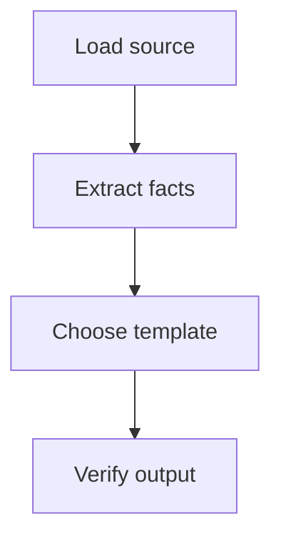
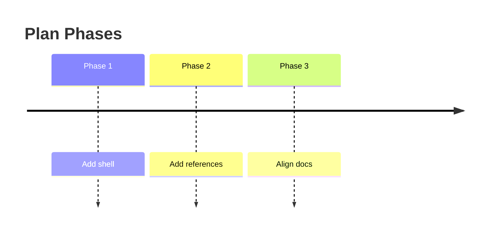
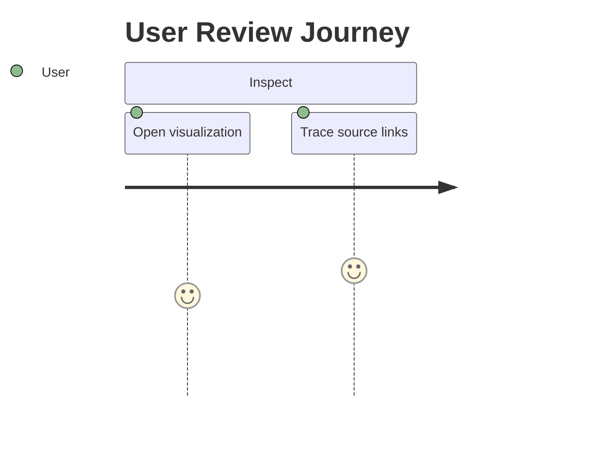
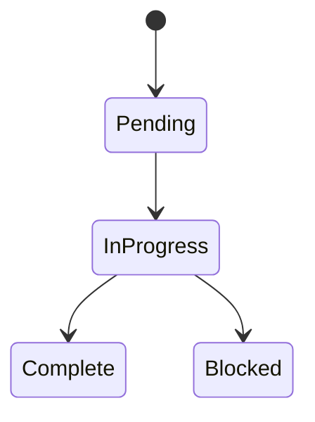
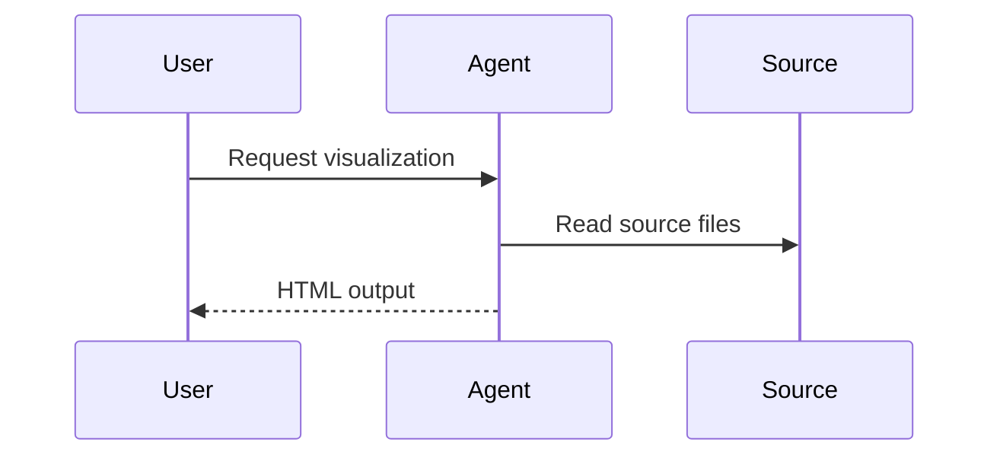
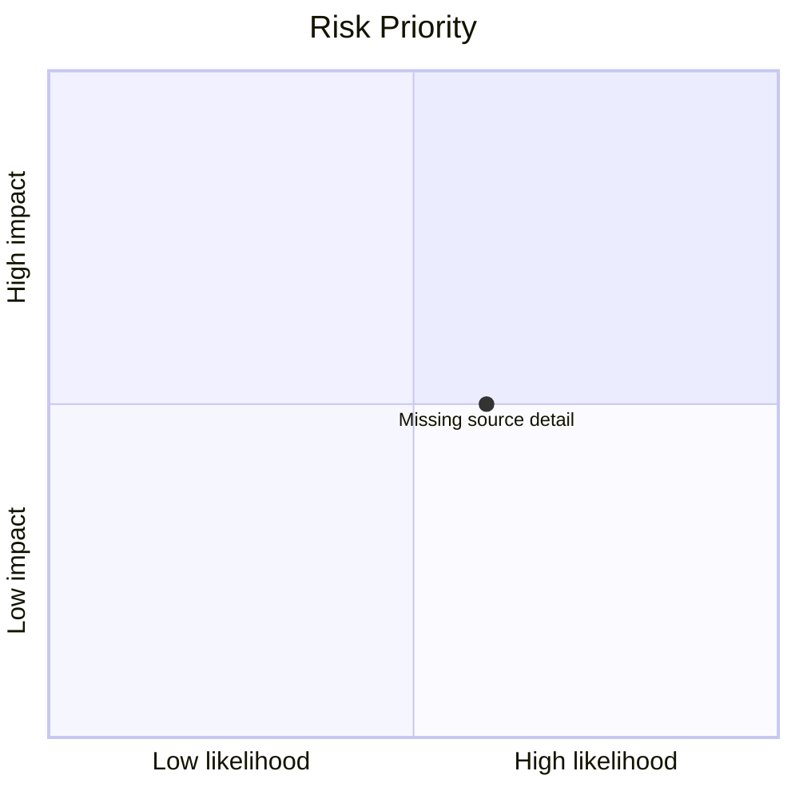

# Mermaid Recipes

Prefer several small diagrams over one dense diagram. Keep labels factual and short. If Mermaid syntax is uncertain, use a readable HTML/CSS block instead.

## Process Flow

## Timeline

## Journey

## Status Transitions

## Actor Or System Interaction

## Priority Or Risk Map

Use a table fallback for risk maps when labels are long or quadrant placement is not source-backed.
