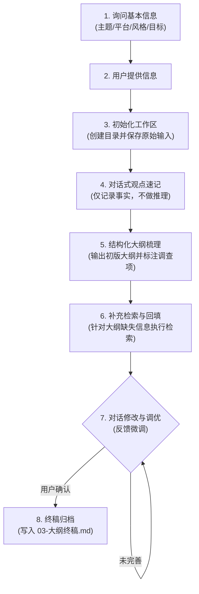

# kol-writer: 自媒体大纲梳理与语料管理

> ⚠️ **内置子技能 (Sub-skills) 加载路径**
> 本技能包含三个依赖子技能，存放在本地 **`sub-skills/`** 目录：
> - `deep-research` ──→ 位于 `sub-skills/deep-research/`
> - `markdown-new` ──→ 位于 `sub-skills/markdown-new/`
> - `agent-browser` ──→ 位于 `sub-skills/agent-browser/`
>
> 必须且只能从相对路径 `sub-skills/` 下读取其 `SKILL.md`，严禁访问全局技能根目录以防冲突。

本技能用于协助创作者，将零散想法、原始素材与检索信息整理为结构化大纲，并归档个人写作资产。

## 1. 核心流程：大纲梳理与迭代

### 1.1 阶段一：初始化工作区
- **1. 询问基本信息**：Agent 主动向用户确认五个维度：主题、发布平台、写作风格、预期目标以及参考样例。
- **2. 用户提供信息**：用户针对提问提供输入。
- **3. 初始化工作区**：创建独立的写作工作目录，将输入保存为 `01-用户原始输入.md`。详见：[01_initialize_project.md](workflows/01_initialize_project.md)

### 1.2 阶段二：观点速记
- **4. 观点速记**：以对话形式记录用户的观点。Agent 需将用户输入保存到 `02-用户想法记录.md` 中，作为大纲整理和文风模仿的素材。详见：[02_quick_notes.md](workflows/02_quick_notes.md)

### 1.3 阶段三：大纲整理与检索
- **5. 结构化大纲梳理**：速记结束后，Agent 检索并调用 `rules/platforms.md` 中对应的平台规范，结合已有想法提炼论点，输出初版大纲。大纲中需使用引用块（`>`）标注待调查或补充的事项。详见：[03_understanding_prompt.md](workflows/03_understanding_prompt.md)
- **6. 补充检索与回填**：针对大纲中标注的待调查项制定检索计划。**等待用户确认计划并选定方案后**，运行检索工具将结果填入大纲。详见：[04_deep_research.md](workflows/04_deep_research.md)

### 1.4 阶段四：大纲微调
- **7. 迭代优化**：根据用户反馈持续修改大纲，更新并覆盖 `03-大纲草稿.md`，直到用户确认满意。详见：[05_iteration_optimization.md](workflows/05_iteration_optimization.md)

### 1.5 阶段五：终稿归档
- **8. 终稿归档**：将最终大纲写入 `03-大纲终稿.md`，输出简短的总结和下一步行动建议。详见：[06_archive_final.md](workflows/06_archive_final.md)

---

## 2. 交互规范

### 2.1 交互询问工具 (ask_user / ask_question) 优先
当执行环境支持 `ask_question` 或 `ask_user` 时，Agent 在关键决策点**必须优先调用对应工具**，避免使用纯文本交互。

**应用场景**：
1. **初始确认 (Step 1)**：选择发布平台、文风及参考样例。
2. **大纲侧重确认 (Step 5)**：确认大纲的方向偏好或调性选择。
3. **检索方案确认 (Step 6.1)**：确认检索计划并选择网页访问方案（如 `markdown-new` 或 `agent-browser`）。

---

## 3. 语料收集流程

用于写作参考的博文、长图文及外部优秀案例，其收集、转写、清洗与归档需遵循统一的流程规范。详见：[07_corpus_collection.md](workflows/07_corpus_collection.md)
