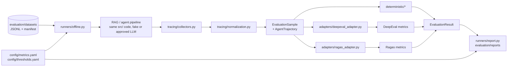

# AI Evaluation Standards (DeepEval, Ragas and deterministic metrics)

These standards define how the unified FastAPI + RAG + Agentic AI backend is evaluated: the
evaluation architecture, the shared Pydantic contracts, the DeepEval and Ragas metric catalogs,
the methodology for RAG, retrieval stages, structured outputs, citations, agents, multi-agent
workflows and conversations, datasets, tracing, execution, regression tiers, thresholds,
reporting, judge calibration and security.

In generated projects, this file lives at `docs/standards/AI_EVALUATION.md`. It works together
with `ASYNC_EXECUTION.md` (offline execution, workers), `PYDANTIC_STANDARDS.md` (contracts,
structured outputs, citations), `API_CONVENTIONS.md` (tests), `GUARDRAILS.md` §11 (guardrail
effectiveness) and `AGENT_SECURITY.md` §8 (adversarial testing).

**Status labels:**

- 🟢 **Convention.** A proposed standard. Follow it by default.
- 🟡 **Needs approval.** An open team decision. Present the options and don't pick one silently.
- ⚪ **Illustrative.** Example code or configuration. It is not an implemented module, and it doesn't choose a judge model, provider or threshold.
- **[CUSTOM]** A custom metric or check. It is **not** a built-in DeepEval or Ragas feature.

**Versions these standards were checked against** (details and conflicts in §16):

| Package | Version | How it was checked |
|---|---|---|
| `deepeval` | **4.1.8** | Installed package source read locally (no imports executed) |
| `deepeval` | **4.2.6** (latest on PyPI, 2026-09-24) | Official docs (`deepeval.com`) and GitHub `main` |
| `ragas` | **0.4.3** (latest on PyPI, 2026-01-13) | Official `stable` docs and GitHub source at tag `v0.4.3` (not installed) |

No evaluation was executed, no LLM or judge API was called and nothing was installed while
writing these standards.

---

## 0. Quick rules for code generation

| # | Rule | Status |
|---|---|---|
| 1 | Evaluation is **offline**. It never runs inside an interactive request, and it never blocks the FastAPI event loop. Large batches use the worker path (ASYNC_EXECUTION §6). | 🟢 |
| 2 | `src/evaluation/` holds only framework-neutral **contracts, the metric registry and adapters**. DeepEval and Ragas are imported lazily inside adapter functions, never at module import, and they live in an optional dependency group 🟡. | 🟢 |
| 3 | Metric suites, datasets, runners, tracing normalization and reports live in the top-level `evaluation/` directory. `tests/evaluation/` tests the evaluation code itself. | 🟢 |
| 4 | Every metric result is an `EvaluationResult` with a typed value: **numeric, binary, categorical or unavailable**. Never coerce a missing or failed score to `0`. | 🟢 |
| 5 | **Deterministic checks never use an LLM judge.** JSON validity, schema compliance, citation IDs, retrieval IDs, tool names and tool-argument schemas are checked in Python (`evaluation/deterministic/`). | 🟢 |
| 6 | Reference-based metrics need **human-authored or human-reviewed** references. LLM-generated references are candidates, never ground truth. | 🟢 |
| 7 | Scores from DeepEval and Ragas metrics with similar names are **not comparable**. Report them separately, with framework and version. | 🟢 |
| 8 | Always pass an explicit, approved judge model. Never rely on a framework's default model. | 🟢 (judge 🟡) |
| 9 | No global pass thresholds without a baseline run and team approval. Thresholds are set per metric, dataset and use case in `evaluation/config/thresholds.yaml`. | 🟢 |
| 10 | Never average unrelated metrics into one quality score. Keep raw per-sample results. | 🟢 |
| 11 | Metric definitions, judge prompts, rubrics and judge configuration are **versioned**. Changing any of them starts a new baseline. | 🟢 |
| 12 | Held-out datasets are never used in prompts, few-shot examples, unit-test fixtures or development tuning. | 🟢 |
| 13 | No real proprietary documents, PII or credentials in datasets, fixtures or docs. Nothing is sent to an external judge or evaluation platform without authorization. | 🟢 |
| 14 | Start small: RAG with faithfulness, answer relevancy, contextual precision and contextual recall. Agents with task completion and tool correctness. Add trajectory, conversational and custom metrics as workflows grow. | 🟢 |
| 15 | Tier 1 (deterministic) runs on every change without LLM calls. Tiers 2 and 3 are opt-in and budgeted (§12). | 🟢 |

### Where the code goes

| Code | Location |
|---|---|
| Shared contracts (`EvaluationSample`, `RetrievedContext`, `AgentTrajectory`, `EvaluationResult`, …) | `src/evaluation/schemas.py` |
| Metric registry (key → framework, class, version, required fields, result kind, direction) | `src/evaluation/registry.py` |
| Contract → DeepEval test cases / Ragas inputs; framework result → `EvaluationResult` | `src/evaluation/adapters/{deepeval_adapter,ragas_adapter}.py` |
| Metric and judge configuration; thresholds | `evaluation/config/{metrics,thresholds}.yaml` |
| Datasets (JSONL + manifest) | `evaluation/datasets/{rag,agents,conversations,golden,guardrails}/` |
| DeepEval suites and custom metrics (G-Eval, DAG, `BaseMetric`, judge model wrapper) | `evaluation/deepeval/{rag,agents,conversations,custom}/` |
| Ragas suites and custom metrics (`DiscreteMetric`, rubrics, judge LLM setup) | `evaluation/ragas/{rag,agents,custom}/` |
| Deterministic metrics | `evaluation/deterministic/{citations,retrieval,structured_output,tool_calls}.py` |
| Trace collection and normalization into `AgentTrajectory` | `evaluation/tracing/{collectors,normalization}.py` |
| Runners and reporting | `evaluation/runners/{offline,regression,report}.py` |
| Small synthetic fixtures for evaluation code | `evaluation/fixtures/` |
| Generated reports (git-ignored 🟡) | `evaluation/reports/` |
| Tests of the evaluation code | `tests/evaluation/{test_schemas,test_adapters,test_deterministic}.py` |
| Guardrail red-team and benign datasets | `evaluation/datasets/guardrails/` (GUARDRAILS §11) |

---

## 1. Evaluation architecture

### 1.1 Two packages, two responsibilities 🟢

| | `src/evaluation/` (runtime package) | `evaluation/` (offline suite) |
|---|---|---|
| Purpose | Contracts shared by the app and the suite, the metric registry, adapters | Datasets, metric suites, custom metrics, deterministic metrics, runners, reports |
| Imported by the app? | Contracts and registry may be imported by `src/` code (e.g. to emit evaluation-ready records). Adapters are imported only by `evaluation/`. | Never |
| Framework imports | Lazy, inside adapter functions only | Allowed |
| In the production image | Yes, without DeepEval or Ragas installed | No 🟡 (packaging decision) |
| Tests | `tests/evaluation/` | `tests/evaluation/` plus the tiers in §12 |

A Tier 1 test asserts that importing `src.main` doesn't import `deepeval` or `ragas`
(`sys.modules` check), so the production container never needs the evaluation dependencies.

### 1.2 Flow



- The runner executes the **same service functions** the API uses (SKILL rule 3). It never starts a second FastAPI app.
- Every sample goes through the deterministic checks first. LLM-judged metrics run only on samples that passed the deterministic checks they depend on (for example, faithfulness isn't judged on an answer that failed schema validation; that sample gets `unavailable` with reason `precondition_failed`).
- Each project may enable DeepEval, Ragas or both **independently**. Nothing requires running both frameworks on every sample. DeepEval's Ragas wrapper (`deepeval.metrics.ragas`) is **not** a second implementation. Don't use it to claim cross-framework coverage (§16).

### 1.3 Shared Pydantic contracts ⚪

Contracts follow PYDANTIC_STANDARDS: `CustomModel` (`extra="forbid"`), `UtcDatetime`, declarative
constraints, discriminated unions. They carry everything both frameworks need, so each adapter
is a pure mapping.

```python
# ⚪ Illustrative content for src/evaluation/schemas.py
from enum import StrEnum
from typing import Annotated, Any, Literal

from pydantic import Field, model_validator

from src.common.schemas.base import CustomModel, UtcDatetime

JsonScalar = str | int | float | bool | None


class EvaluationCategory(StrEnum):
    RAG = "rag"
    RETRIEVAL = "retrieval"
    STRUCTURED_OUTPUT = "structured_output"
    AGENT = "agent"
    MULTI_AGENT = "multi_agent"
    CONVERSATION = "conversation"
    GUARDRAIL = "guardrail"


class DatasetSplit(StrEnum):
    DEVELOPMENT = "development"
    REGRESSION = "regression"
    HELD_OUT = "held_out"


class RetrievalStage(StrEnum):
    SEMANTIC = "semantic"
    BM25 = "bm25"
    RRF = "rrf"
    RERANK = "rerank"
    MMR = "mmr"
    EVIDENCE_FILTER = "evidence_filter"
    FINAL = "final"  # the context actually given to the generator


class ReferenceProvenance(CustomModel):
    kind: Literal["human_authored", "human_reviewed_synthetic", "llm_generated_unreviewed"]
    author: str = Field(description="Person or process ID; never a customer name")
    reviewed_by: str | None = None
    reviewed_at: UtcDatetime | None = None

    @model_validator(mode="after")
    def _review_recorded(self) -> "ReferenceProvenance":
        if self.kind == "human_reviewed_synthetic" and (self.reviewed_by is None or self.reviewed_at is None):
            raise ValueError("reviewed synthetic references need reviewed_by and reviewed_at")
        return self


class RetrievedContext(CustomModel):
    document_id: str = Field(min_length=1)
    chunk_id: str = Field(min_length=1)
    content: str = Field(min_length=1)
    stage: RetrievalStage
    rank: int = Field(ge=1, description="1-based rank within this stage's output")
    score: float | None = Field(default=None, description="Stage-specific; not comparable across stages")
    source_metadata: dict[str, JsonScalar] = Field(default_factory=dict)  # department, collection, index_version…


class ReferenceContext(CustomModel):
    document_id: str = Field(min_length=1)
    chunk_id: str | None = Field(default=None, description="None when labeled at document level")
    content: str | None = None
    relevance: int = Field(default=1, ge=0, le=3, description="0 = not relevant … 3 = essential (graded)")


class ToolCallRecord(CustomModel):
    call_id: str
    tool_name: str
    arguments: dict[str, Any]
    result: dict[str, Any] | str | None = None
    status: Literal["success", "error", "denied", "timeout", "not_executed"]
    error_type: str | None = None


class AgentStep(CustomModel):
    step_index: int = Field(ge=0)
    agent_id: str
    kind: Literal["plan", "reasoning", "tool_call", "handoff", "approval", "message", "final"]
    content: str | None = None
    tool_call: ToolCallRecord | None = None
    handoff_to: str | None = None
    started_at: UtcDatetime
    duration_ms: int | None = Field(default=None, ge=0)

    @model_validator(mode="after")
    def _kind_payload(self) -> "AgentStep":
        if (self.kind == "tool_call") != (self.tool_call is not None):
            raise ValueError("tool_call is required for, and only for, tool_call steps")
        if (self.kind == "handoff") != (self.handoff_to is not None):
            raise ValueError("handoff_to is required for, and only for, handoff steps")
        return self


class ExpectedToolCall(CustomModel):
    tool_name: str
    arguments: dict[str, Any] | None = Field(default=None, description="None = don't check arguments")


class ReferenceTrajectory(CustomModel):
    expected_tool_calls: list[ExpectedToolCall] = Field(default_factory=list)
    ordering_matters: bool = False
    forbidden_tools: list[str] = Field(default_factory=list)
    expected_outcome: str | None = None
    provenance: ReferenceProvenance


class AgentTrajectory(CustomModel):
    task_id: str
    objective: str = Field(min_length=1)
    agent_ids: list[str] = Field(min_length=1)
    steps: list[AgentStep]
    final_output: str | None = None
    status: Literal["completed", "failed", "budget_exceeded", "cancelled", "awaiting_approval"]
    reference: ReferenceTrajectory | None = None

    @model_validator(mode="after")
    def _ordered_steps(self) -> "AgentTrajectory":
        if [s.step_index for s in self.steps] != list(range(len(self.steps))):
            raise ValueError("steps must be ordered and contiguous from 0")
        if any(s.agent_id not in self.agent_ids for s in self.steps):
            raise ValueError("every step's agent_id must be listed in agent_ids")
        return self


class ConversationTurn(CustomModel):
    turn_index: int = Field(ge=0)
    role: Literal["user", "assistant"]
    content: str
    retrieved_contexts: list[RetrievedContext] = Field(default_factory=list)  # assistant turns only
    tool_calls: list[ToolCallRecord] = Field(default_factory=list)            # assistant turns only


class EvaluationSample(CustomModel):
    sample_id: str
    dataset_id: str
    dataset_version: str
    split: DatasetSplit
    category: EvaluationCategory
    user_input: str = Field(min_length=1)
    actual_output: str | None = Field(default=None, description="None until the pipeline has run")
    expected_output: str | None = None
    expected_output_provenance: ReferenceProvenance | None = None
    retrieved_contexts: list[RetrievedContext] = Field(default_factory=list)
    reference_contexts: list[ReferenceContext] = Field(default_factory=list)
    trajectory: AgentTrajectory | None = None
    conversation: list[ConversationTurn] | None = None
    metadata: dict[str, JsonScalar] = Field(default_factory=dict)
    pipeline_version: str
    model_versions: dict[str, str] = Field(default_factory=dict)   # role → model ID
    prompt_versions: dict[str, str] = Field(default_factory=dict)  # prompt name → version

    @model_validator(mode="after")
    def _consistency(self) -> "EvaluationSample":
        if self.expected_output is not None and self.expected_output_provenance is None:
            raise ValueError("expected_output requires expected_output_provenance")
        seen: set[tuple[RetrievalStage, int]] = set()
        for ctx in self.retrieved_contexts:
            if (ctx.stage, ctx.rank) in seen:
                raise ValueError("ranks must be unique within a retrieval stage")
            seen.add((ctx.stage, ctx.rank))
        if self.conversation is not None:
            if [t.turn_index for t in self.conversation] != list(range(len(self.conversation))):
                raise ValueError("conversation turns must be ordered and contiguous from 0")
            if any(t.role == "user" and (t.retrieved_contexts or t.tool_calls) for t in self.conversation):
                raise ValueError("retrieval context and tool calls belong to assistant turns")
        return self

    def final_contexts(self) -> list[RetrievedContext]:
        return sorted((c for c in self.retrieved_contexts if c.stage is RetrievalStage.FINAL), key=lambda c: c.rank)


# --- Results --------------------------------------------------------------------------------

class NumericValue(CustomModel):
    kind: Literal["numeric"] = "numeric"
    score: float
    scale_min: float | None = Field(description="None when the framework documents no bound")
    scale_max: float | None
    higher_is_better: bool


class BinaryValue(CustomModel):
    kind: Literal["binary"] = "binary"
    outcome: bool


class CategoricalValue(CustomModel):
    kind: Literal["categorical"] = "categorical"
    label: str
    allowed_labels: list[str] = Field(min_length=2)

    @model_validator(mode="after")
    def _label_allowed(self) -> "CategoricalValue":
        if self.label not in self.allowed_labels:
            raise ValueError("label must be one of allowed_labels")
        return self


class UnavailableValue(CustomModel):
    kind: Literal["unavailable"] = "unavailable"
    reason: Literal[
        "missing_required_field", "precondition_failed", "not_applicable", "judge_error",
        "parse_error", "timeout", "rate_limited", "cancelled", "budget_exceeded",
    ]


MetricValue = Annotated[NumericValue | BinaryValue | CategoricalValue | UnavailableValue, Field(discriminator="kind")]


class JudgeConfig(CustomModel):
    provider: str
    model: str
    temperature: float | None = None
    judge_prompt_version: str = Field(description="Framework template version or our rubric version")


class CostEstimate(CustomModel):
    input_tokens: int | None = Field(default=None, ge=0)
    output_tokens: int | None = Field(default=None, ge=0)
    amount: float | None = Field(default=None, ge=0)
    currency: str | None = None
    is_estimate: bool = True


class EvaluationError(CustomModel):
    type: str
    message: str = Field(description="Safe message: no sample content, prompts or credentials")


class EvaluationResult(CustomModel):
    evaluation_id: str
    run_id: str
    sample_id: str
    framework: Literal["deepeval", "ragas", "deterministic", "human"]
    framework_version: str | None = None
    metric_name: str = Field(description="Registry key, e.g. 'deepeval.faithfulness'")
    metric_version: str
    value: MetricValue
    interpretation: str | None = None
    threshold: float | str | None = None
    status: Literal["passed", "failed", "not_gated", "unavailable"]
    judge: JudgeConfig | None = None
    reasoning: str | None = None
    error: EvaluationError | None = None
    duration_ms: int = Field(ge=0)
    cost: CostEstimate | None = None
    created_at: UtcDatetime

    @model_validator(mode="after")
    def _status_matches_value(self) -> "EvaluationResult":
        unavailable = self.value.kind == "unavailable"
        if unavailable != (self.status == "unavailable"):
            raise ValueError("status 'unavailable' if and only if value.kind is 'unavailable'")
        if self.status in ("passed", "failed") and self.threshold is None:
            raise ValueError("passed/failed requires a configured threshold")
        if self.value.kind == "numeric":
            v = self.value
            if (v.scale_min is not None and v.score < v.scale_min) or (v.scale_max is not None and v.score > v.scale_max):
                raise ValueError("score outside the metric's documented scale")
        return self
```

**Relationships.** One `EvaluationSample` has 0–1 `AgentTrajectory` or 0–1 conversation, and
produces N `EvaluationResult`s (one per metric). Results link to a run (`run_id`), and the run
report (§13) links datasets, pipeline, framework and judge versions.

**Validation rules worth testing** (`tests/evaluation/test_schemas.py`): expected output without
provenance is rejected; duplicate ranks within a stage are rejected; non-contiguous steps or
turns are rejected; user turns can't carry retrieval context; `unavailable` value ⇔ `unavailable`
status; pass/fail without a threshold is rejected; out-of-scale numeric scores are rejected.

### 1.4 Metric registry ⚪

`src/evaluation/registry.py` declares each metric once. Runners read metric parameters from
`evaluation/config/metrics.yaml`, and the registry says which contract fields a metric needs, so
a sample missing a field yields `unavailable/missing_required_field` instead of a framework
exception.

```python
# ⚪ Illustrative content for src/evaluation/registry.py
from typing import Literal

from src.common.schemas.base import CustomModel


class MetricSpec(CustomModel):
    key: str                                   # "ragas.context_recall"
    framework: Literal["deepeval", "ragas", "deterministic"]
    class_path: str | None                     # "ragas.metrics.collections.ContextRecall"; None for ours
    version: str                               # our version of the metric definition/config
    required_fields: frozenset[str]            # contract fields: "expected_output", "final_contexts", …
    reference_based: bool
    uses_llm_judge: bool
    uses_embeddings: bool
    result_kind: Literal["numeric", "binary", "categorical"]
    scale: tuple[float | None, float | None]
    higher_is_better: bool
    custom_defined: bool = False               # True for [CUSTOM] metrics
```

---

## 2. DeepEval metric catalog

All classes import from `deepeval.metrics`. Test cases import from `deepeval.test_case`.

### 2.1 Test cases, goldens, datasets and execution

**`LLMTestCase`** (verified in 4.1.8 source and 4.2.6 docs): `input` (required), `actual_output`,
`expected_output`, `context`, `retrieval_context` (`list[str]`; 4.x also accepts
`RetrievedContextData(context, source)` items), `tools_called`, `expected_tools`, `metadata`,
`token_cost`, `completion_time`, `name`, `tags`, `flaky`. 4.2.6 adds `expected_labels`.

**`ToolCall`**: `name`, `description`, `reasoning`, `output`, `input_parameters`, `type`
(function or MCP). Use `input_parameters`. Some doc examples pass `input=`, which isn't the field.

**Params enums.** Use `SingleTurnParams` and `MultiTurnParams`. `LLMTestCaseParams` and
`TurnParams` are deprecated aliases that warn.

**`Golden`**: `input`, `expected_output`, `context`, `expected_tools`, `additional_metadata`,
`comments`, `custom_column_key_values` (+ `actual_output`, `retrieval_context`, `tools_called`,
normally left empty). **`ConversationalGolden`**: `scenario` (required), `expected_outcome`,
`context`, `turns`, `additional_metadata`; the user profile field is `user_description` in 4.1.8
and `persona` in 4.2.6 docs (pin a version, §16).

**`EvaluationDataset`** (`deepeval.dataset`): single-turn **or** multi-turn, never both.
`add_golden`, `add_test_case`, `add_goldens_from_{json,jsonl,csv}_file`,
`add_test_cases_from_{json,csv}_file`, `save_as(file_type=..., directory=...)`,
`evals_iterator(...)`. **`push`/`pull` talk to Confident AI and are not used** without approval
(§15). Our source of truth is `evaluation/datasets/`; DeepEval datasets are built from it.

**Execution options:**

- `metric.measure(tc)` / `await metric.a_measure(tc)`, then `.score`, `.reason`, `.is_successful()`, `.error`. **Our runner uses `a_measure` per (sample, metric)** under its own limiter, so DeepEval and Ragas share one concurrency, timeout and cost policy (§11). 🟢
- `evaluate(test_cases, metrics, ..., async_config=AsyncConfig(run_async, throttle_value, max_concurrent), display_config=DisplayConfig(...), cache_config=CacheConfig(write_cache, use_cache), error_config=ErrorConfig(ignore_errors, skip_on_missing_params))`: acceptable for Tier 2 suites 🟡. It needs at least one non-flaky metric with a threshold, and it applies DeepEval's pass/fail, which isn't our threshold config.
- `assert_test(test_case=..., metrics=[...])` and `deepeval test run`: pytest-style suites 🟡 (Tier 2).
- `dataset.evals_iterator(metrics=...)` with `@observe`: **required** for trace-only agent metrics (§2.3, §10).

```python
# ⚪ Illustrative content for src/evaluation/adapters/deepeval_adapter.py
from src.evaluation.schemas import EvaluationSample


def to_llm_test_case(sample: EvaluationSample):
    from deepeval.test_case import LLMTestCase, ToolCall  # lazy: never at module import

    tools_called = None
    if sample.trajectory is not None:
        tools_called = [
            ToolCall(name=s.tool_call.tool_name, input_parameters=s.tool_call.arguments, output=s.tool_call.result)
            for s in sample.trajectory.steps if s.tool_call is not None
        ]
    return LLMTestCase(
        input=sample.user_input,
        actual_output=sample.actual_output,
        expected_output=sample.expected_output,
        retrieval_context=[c.content for c in sample.final_contexts()] or None,
        tools_called=tools_called,
        name=sample.sample_id,
        metadata={"dataset_id": sample.dataset_id, "dataset_version": sample.dataset_version},
    )
```

### 2.2 RAG metrics

Common constructor parameters (4.1.8 source): `threshold=0.5`, `model` (string or
`DeepEvalBaseLLM`), `include_reason`, `async_mode`, `strict_mode` (binary; threshold becomes 1),
`verbose_mode`, `evaluation_template`. **Always pass `model=`**: the framework default is an
external hosted model (the 4.2.6 docs list `gpt-5.4`).

| Metric | Purpose | Required fields | Reference? | Interpretation | Stage |
|---|---|---|---|---|---|
| `AnswerRelevancyMetric` | Does the answer address the query? | `input`, `actual_output` | No | Relevant statements ÷ statements in the answer (0–1, higher better) | Generation |
| `FaithfulnessMetric` | Are the answer's claims supported by the retrieved context? | `input`, `actual_output`, `retrieval_context` | No | Truthful claims ÷ claims (0–1). Extra params: `truths_extraction_limit`, `penalize_ambiguous_claims` | Generation |
| `ContextualRelevancyMetric` | Is the retrieved context relevant to the query? | `input`, `actual_output`, `retrieval_context` | No | Relevant statements in the context ÷ all (0–1) | Final context |
| `ContextualPrecisionMetric` | Are relevant chunks ranked above irrelevant ones? | `input`, `actual_output`, `expected_output`, `retrieval_context` | **Yes** | Rank-weighted precision (0–1); list order matters | Final context (ranking) |
| `ContextualRecallMetric` | Does the context contain what the reference answer needs? | `input`, `actual_output`, `expected_output`, `retrieval_context` | **Yes** | Reference statements attributable to the context ÷ all (0–1) | Final context (coverage) |

**Limitations and debugging:**

- **AnswerRelevancy.** Doesn't check correctness or grounding. It can penalize necessary caveats and **correct abstentions** (missing-evidence scenarios use the abstention check in §4.9 instead). Debug: read `reason`, look at which statements were judged irrelevant, check query classification for that sample.
- **Faithfulness.** Faithful to the context isn't the same as correct: a faithful answer over a wrong or stale chunk still scores high. Claims the context neither supports nor contradicts are "ambiguous" and only penalized with `penalize_ambiguous_claims=True`, which we propose for enterprise grounded answers 🟡. Long contexts can be truncated by `truths_extraction_limit`. Debug: list the unsupported claims from `reason`, check whether the supporting chunk was retrieved (recall@K in §4.3), then check the citation checks (§8).
- **ContextualRelevancy.** Penalizes long chunks that contain some irrelevant text, so chunk size shifts the score. Debug: compare with ID-based precision@K; tune chunking or K.
- **ContextualPrecision.** Depends on the reference answer's quality and on the order of `retrieval_context`; pass the final context **in rank order**. Debug: inspect per-node verdicts; compare pre- and post-rerank order (§4.2).
- **ContextualRecall.** Measures coverage of the *reference* answer; a bad or over-complete reference lowers it. Debug: check reference provenance; compare with ID-based recall@K at every stage to find where the evidence was lost.

### 2.3 Agent metrics

| Metric | Required | Reference? | Trace? | What it scores | Kind |
|---|---|---|---|---|---|
| `TaskCompletionMetric` | Trace (task inferred, or `task=`) | No | Yes (4.1.8 source has a non-trace fallback on `input`, `actual_output`, `tools_called`, marked for deprecation) | Alignment of outcome with the task | LLM |
| `StepEfficiencyMetric` | Trace | No | **Trace only** | Penalizes unnecessary steps | LLM |
| `PlanAdherenceMetric` | Trace | No | **Trace only** | Execution follows the plan (plan read from reasoning in the trace; scores 1 if no plan) | LLM |
| `PlanQualityMetric` | Trace | No | **Trace only** | Plan quality for the task (1 if no plan) | LLM |
| `ToolCorrectnessMetric` | `input`, `tools_called`, `expected_tools` | **Yes** (expected tools) | No | Correct tools ÷ tools called; options `should_consider_ordering`, `should_exact_match`, `evaluation_params=[ToolCallParams.INPUT_PARAMETERS, ToolCallParams.OUTPUT]`, `available_tools` (adds an LLM tool-selection check; final = minimum) | Deterministic unless `available_tools` |
| `ArgumentCorrectnessMetric` | `input`, `tools_called` | No | No | Correct input parameters ÷ tool calls | LLM |

**Limitations.** "No plan ⇒ score 1" means PlanAdherence/PlanQuality look perfect for agents that
don't expose a plan: report them as `unavailable/not_applicable` when the trajectory has no
`plan` step [CUSTOM rule]. TaskCompletion judges alignment, not **verified** completion: pair it
with a deterministic end-state check (§5.3). ArgumentCorrectness is judged, while our argument
**schema** check is deterministic (§7.1) and runs first.

DeepEval also ships `GoalAccuracyMetric`, `TopicAdherenceMetric`, `ToolUseMetric`,
`AgentLoopDetectionMetric`, `ToolPermissionMetric` and MCP metrics (4.1.8 exports). They are not
in the starter suite; adopt them per project after reading their current docs 🟡.

### 2.4 Conversational metrics

Take a `ConversationalTestCase(turns=[Turn(role, content, retrieval_context, tools_called)], scenario, expected_outcome, chatbot_role, ...)`.
They can't run on an `LLMTestCase`, and component-level evaluation isn't available for multi-turn.

| Metric | Needs | Reference? | Scores |
|---|---|---|---|
| `ConversationCompletenessMetric` | turns | No | Satisfied user intentions ÷ all (`window_size`) |
| `TurnRelevancyMetric` ("conversation relevancy") | turns | No | Relevant assistant turns ÷ all (`window_size`) |
| `KnowledgeRetentionMetric` | turns | No | Assistant turns without attrition ÷ all (no `async_mode`) |
| `RoleAdherenceMetric` | turns, `chatbot_role` | No | Turns adhering to the role ÷ assistant turns |
| `TurnFaithfulnessMetric` | turns with `retrieval_context` on assistant turns | No | Mean per-turn faithfulness |
| `TurnContextualRelevancyMetric` | turns with `retrieval_context` | No | Mean per-turn relevancy |
| `TurnContextualPrecisionMetric` / `TurnContextualRecallMetric` | + `expected_outcome` | **Yes** | Mean per-turn precision/recall |

There is no `ConversationRelevancyMetric` export; some doc pages still use that name.

### 2.5 Other built-ins used here

`JsonCorrectnessMetric`, `ExactMatchMetric`, `PatternMatchMetric` exist, but our Tier 1 does these
checks in Python (§7.1). `GEval`, `ConversationalGEval`, `DAGMetric`, `ConversationalDAGMetric`,
`BaseMetric` and `BaseConversationalMetric` are covered in §2.6.

### 2.6 Custom metrics in DeepEval

**G-Eval** (`from deepeval.metrics import GEval`; `from deepeval.metrics.g_eval import Rubric`):
`GEval(name, evaluation_params=[SingleTurnParams...], criteria=... | evaluation_steps=[...], rubric=[Rubric(score_range=(0, 2), expected_outcome="...")], model=..., threshold=...)`.
Give **either** `criteria` or `evaluation_steps` (the docs contradict themselves; one or the other
is safe). Rubric ranges are within 0–10 and must not overlap. The score is a log-probability-weighted
1–10 judgment ÷ 10; custom models need `a_generate_raw_response` for the weighting, otherwise
check the pinned version's behavior (unverified). `ConversationalGEval` scores the whole
conversation with `MultiTurnParams`.

**DAG** (`DAGMetric(name, dag)`; `from deepeval.metrics.dag import DeepAcyclicGraph, TaskNode, BinaryJudgementNode, NonBinaryJudgementNode`):
a decision tree of judgments, useful when a rubric has hard gates. Wire nodes with
`node.add_verdict(verdict=..., score=0..10 | then=<node or metric>)` in 4.2.6 docs; 4.1.8 source
also has `VerdictNode(children=...)`. Pin a version before writing DAGs (§16).

```python
# ⚪ Illustrative content for evaluation/deepeval/custom/abstention_dag.py (4.2.6-style API)
from deepeval.metrics import DAGMetric
from deepeval.metrics.dag import BinaryJudgementNode, DeepAcyclicGraph
from deepeval.test_case import SingleTurnParams

abstained = BinaryJudgementNode(
    criteria="Does the output clearly state that the provided documents don't contain the answer?",
    evaluation_params=[SingleTurnParams.ACTUAL_OUTPUT],
)
abstained.add_verdict(verdict=True, score=10)
abstained.add_verdict(verdict=False, score=0)

def build(judge) -> DAGMetric:
    return DAGMetric(name="custom.abstention", dag=DeepAcyclicGraph(root_nodes=[abstained]), model=judge)
```

**`BaseMetric`** (and `BaseConversationalMetric`): implement `measure`, `async a_measure`,
`is_successful` and a `__name__` property; set `self.score`, `self.success`, optionally
`self.reason` and `self.error`. Use it to wrap a deterministic custom check when a DeepEval
suite needs it inline. The canonical implementation still lives in `evaluation/deterministic/`.

**Judge model.** Subclass `deepeval.models.base_model.DeepEvalBaseLLM` (`load_model`,
`generate(prompt, schema=None)`, `async a_generate`, `get_model_name`) in
`evaluation/deepeval/custom/judge_model.py`, wrapping the approved judge 🟡. With a custom model,
DeepEval's `evaluation_cost` is 0, so tokens and cost are counted by our wrapper (§11).

---

## 3. Ragas metric catalog

### 3.1 Selected API generation 🟢: `ragas.metrics.collections`

| | Legacy (deprecated) | **Collections (selected)** |
|---|---|---|
| Import | `from ragas.metrics import X` (warns in 0.4.3; removal in 1.0) | `from ragas.metrics.collections import X` |
| Judge LLM | `LangchainLLMWrapper(...)` | `llm_factory(model, provider=..., client=...)` → `InstructorBaseRagasLLM` |
| Embeddings | `LangchainEmbeddingsWrapper(...)` | `embedding_factory(provider, model=..., client=..., interface="modern")` |
| Input | `SingleTurnSample` / `MultiTurnSample` | keyword arguments to `await metric.ascore(...)` (`batch_score`/`abatch_score` for lists) |
| Output | `float` | `MetricResult` (`.value`, `.reason`) |
| Runner | `evaluate()` / `aevaluate()` (deprecated), `RunConfig` | our runner (§11); Ragas' own `@experiment` is optional 🟡 |
| Timeouts/retries | `RunConfig(timeout, max_retries, ...)` | **on the LLM client** (per the Ragas docs) |

Consequences:

- Collections metrics aren't accepted by `evaluate()` (it checks for the legacy `Metric` base) — inference from the 0.4.3 source. Our runner calls `ascore` directly.
- Collections metrics reject legacy wrappers; build the judge with `llm_factory`.
- `ascore` is the async entry point. `score()` raises inside a running event loop, so never call it from async code.
- Token cost parsers (`ragas.cost`) are documented only for `evaluate()`; cost tracking is ours (§11).
- ID-based and non-LLM context metrics exist **only** in the legacy API. We don't need them: ID-based precision/recall are computed in `evaluation/deterministic/retrieval.py` (§4.3).

```python
# ⚪ Illustrative content for evaluation/ragas/rag/core_suite.py
from ragas.llms import llm_factory
from ragas.metrics.collections import ContextPrecision, ContextRecall, Faithfulness

from src.evaluation.adapters.ragas_adapter import to_single_turn_kwargs


def build_metrics(client, model: str):
    judge = llm_factory(model, client=client)       # provider, client and model are 🟡
    return {"ragas.faithfulness": Faithfulness(llm=judge),
            "ragas.context_precision": ContextPrecision(llm=judge),
            "ragas.context_recall": ContextRecall(llm=judge)}


async def score_one(metric, sample, fields: set[str]):
    result = await metric.ascore(**to_single_turn_kwargs(sample, fields))
    return result.value, result.reason
```

### 3.2 RAG metrics (collections, 0.4.3)

| Metric | `ascore` inputs | Reference? | Judge | Score |
|---|---|---|---|---|
| `Faithfulness(llm)` | `user_input`, `response`, `retrieved_contexts` | No | LLM | 0–1, higher better |
| `AnswerRelevancy(llm, embeddings, strictness=3)` — legacy name *Response Relevancy* | `user_input`, `response` | No | LLM + embeddings | Mean cosine similarity of generated questions to the input; 0 if all noncommittal; **docs say it can leave 0–1** (`scale=(None, None)`) |
| `ContextPrecision(llm)` (= `ContextPrecisionWithReference`) | `user_input`, `reference`, `retrieved_contexts` | **Yes** | LLM | 0–1, rank-aware |
| `ContextPrecisionWithoutReference(llm)` (= `ContextUtilization`) | `user_input`, `response`, `retrieved_contexts` | No (judged against the response) | LLM | 0–1 |
| `ContextRecall(llm)` | `user_input`, `retrieved_contexts`, `reference` | **Yes** | LLM | 0–1 |
| `ContextEntityRecall(llm)` | `reference`, `retrieved_contexts` | **Yes** | LLM | Shared entities ÷ reference entities |
| `NoiseSensitivity(llm, mode="relevant" \| "irrelevant")` | `user_input`, `response`, `reference`, `retrieved_contexts` | **Yes** | LLM | 0–1, **lower is better** (incorrect claims ÷ claims) |
| `FactualCorrectness(llm, mode="f1", beta=1.0, atomicity="low", coverage="low")` | `response`, `reference` | **Yes** | LLM | 0–1 claim precision/recall/F1 |
| `SemanticSimilarity(embeddings, threshold=None)` | `reference`, `response` | **Yes** | Embeddings only | 0–1 cosine; binary if `threshold` set |

**ID-based precision and recall** (for datasets with verified reference chunk IDs):
precision = |retrieved IDs ∩ reference IDs| ÷ |retrieved IDs|; recall = |retrieved IDs ∩ reference
IDs| ÷ |reference IDs|. These match Ragas' legacy `IDBasedContextPrecision/Recall` definitions,
but we compute them deterministically per stage and K (§4.3) and label them `framework="deterministic"`.

**Reference-free vs reference-based.**

| Reference-free (need a recorded judge config and kept evidence) | Reference-based (need human-reviewed references) |
|---|---|
| Faithfulness, AnswerRelevancy, ContextPrecisionWithoutReference | ContextPrecision, ContextRecall, ContextEntityRecall, NoiseSensitivity, FactualCorrectness, SemanticSimilarity, ID-based P/R |

**Not comparable across frameworks.** Ragas `Faithfulness` and DeepEval `FaithfulnessMetric`
decompose claims with different prompts and verdict rules; Ragas `AnswerRelevancy` uses
embeddings while DeepEval uses statement verdicts; the precision metrics weight ranks differently.
Registry keys are framework-prefixed (`ragas.faithfulness` ≠ `deepeval.faithfulness`), and reports
never put them in the same column.

### 3.3 Mapping our contracts to Ragas

```python
# ⚪ Illustrative content for src/evaluation/adapters/ragas_adapter.py
from src.evaluation.schemas import EvaluationSample


def to_single_turn_kwargs(sample: EvaluationSample, fields: set[str]) -> dict:
    """Only the fields the metric's registry entry asks for; ascore rejects unknown ones."""
    available = {
        "user_input": sample.user_input,
        "response": sample.actual_output,
        "retrieved_contexts": [c.content for c in sample.final_contexts()],
        "reference": sample.expected_output,
    }
    missing = [f for f in fields if available.get(f) in (None, [])]
    if missing:
        raise MissingRequiredField(missing)   # runner records unavailable/missing_required_field
    return {f: available[f] for f in fields}


def to_single_turn_sample(sample: EvaluationSample):
    from ragas.dataset_schema import SingleTurnSample   # import path: verify against the pinned version
    return SingleTurnSample(
        user_input=sample.user_input,
        response=sample.actual_output,
        retrieved_contexts=[c.content for c in sample.final_contexts()],
        retrieved_context_ids=[c.chunk_id for c in sample.final_contexts()],
        reference=sample.expected_output,
        reference_contexts=[r.content for r in sample.reference_contexts if r.content] or None,
        reference_context_ids=[r.chunk_id for r in sample.reference_contexts if r.chunk_id] or None,
    )
```

`SingleTurnSample` fields (all optional): `user_input`, `retrieved_contexts`, `reference_contexts`,
`retrieved_context_ids`, `reference_context_ids`, `response`, `multi_responses`, `reference`,
`rubric`, plus persona/query-style fields. We use it for **interchange and export**, not as the
scoring input of collections metrics.

### 3.4 Agent metrics and `MultiTurnSample`

| Metric | `ascore` inputs | Reference? | Judge | Score |
|---|---|---|---|---|
| `ToolCallAccuracy(strict_order=True)` | `user_input: list[messages]`, `reference_tool_calls: list[ToolCall]` | **Yes** | None (rule-based; exact argument match) | 0–1; misaligned sequence ⇒ 0 in strict order |
| `ToolCallF1()` | same | **Yes** | None | F1 over (name, args) sets; exact match |
| `AgentGoalAccuracy(llm)` (= `…WithReference`) | `user_input`, `reference: str` | **Yes** | LLM | **Binary** 0/1 |
| `AgentGoalAccuracyWithoutReference(llm)` | `user_input` | No (goal inferred) | LLM | **Binary** 0/1 |
| `TopicAdherence(llm, mode="f1")` | `user_input`, `reference_topics: list[str]` | **Yes** (topics) | LLM | 0–1; the docs imply precision is the default, the source says `"f1"` — set `mode` explicitly |

**Messages** (`ragas.messages`): `HumanMessage(content)`, `AIMessage(content, tool_calls=[ToolCall(name, args)])`,
`ToolMessage(content)`; every message has `metadata`. `MultiTurnSample(user_input=[...], reference, reference_tool_calls, reference_topics, rubrics)`.

| Our trajectory element | Ragas representation |
|---|---|
| User objective / user turn | `HumanMessage(content=...)` |
| Assistant message or plan text | `AIMessage(content=...)` |
| Tool call | `AIMessage(content="", tool_calls=[ToolCall(name=..., args=...)])` |
| Tool result | `ToolMessage(content=<serialized typed result>)` |
| Reference tool calls | `reference_tool_calls=[ToolCall(...)]` from `ReferenceTrajectory` |
| Expected outcome | `reference=` (AgentGoalAccuracy) |
| Handoffs, approvals, agent IDs | `metadata` on the message (no native field) |

**LangGraph (optional, never a template dependency).** `ragas.integrations.langgraph.convert_to_ragas_messages(messages, metadata=False)`
skips `SystemMessage`, raises on unsupported types and non-string content, and reads tool calls
from `additional_kwargs["tool_calls"]`, **not** `message.tool_calls`. The official LangGraph how-to
still uses the legacy API. Any other framework (or our own executor) is adapted by
`evaluation/tracing/normalization.py` → `AgentTrajectory` → the mapping above.

### 3.5 Conversations

`MultiTurnSample` has no per-turn `retrieved_contexts` field. For turn-level grounding, the adapter
converts each assistant turn into a single-turn input with **that turn's** contexts and the
preceding turns in `user_input` context 🟡, and keeps the turn index in the result's sample ID
(`<sample_id>#turn<n>`).

### 3.6 Custom metrics in Ragas

- **Aspect-critic style (binary/categorical):** `DiscreteMetric(name=..., allowed_values=["pass", "fail"], prompt="... {response} ...")`, or the `@discrete_metric(name=..., allowed_values=[...])` decorator; call `await m.ascore(llm=judge, response=..., ...)`. The legacy `AspectCritic` is deprecated (the migration guide calls it removed). 🟢 use `DiscreteMetric`.
- **Numeric / ranking:** `NumericMetric`, `RankingMetric`, `@numeric_metric(allowed_values=(0, 1))`, `@ranking_metric`; return `MetricResult(value=..., reason=...)`.
- **Rubrics:** `DomainSpecificRubrics(llm, rubrics={"score1_description": ..., "score5_description": ...}, with_reference=False)` for one rubric across a dataset; `InstanceSpecificRubrics(llm)` with `rubrics=` passed **per sample** for scenario-specific criteria. Both score 1–5 (`scale=(1, 5)`).
- There is no "write your own metric" page in the 0.4.3 docs; the above is taken from the metrics overview, agent tutorial and source.

---

## 4. RAG evaluation methodology

### 4.1 Starter suite 🟢

| Question | Deterministic | DeepEval | Ragas |
|---|---|---|---|
| Is the answer grounded? | Citation structural + reference validity (§8) | `FaithfulnessMetric` | `Faithfulness` |
| Does it answer the question? | — | `AnswerRelevancyMetric` | `AnswerRelevancy` |
| Is the evidence ranked well? | P@K, MRR, NDCG@K (with labels) | `ContextualPrecisionMetric` | `ContextPrecision` |
| Is the evidence complete? | R@K, Hit@K (with labels) | `ContextualRecallMetric` | `ContextRecall` |

Pick one judged framework per project for the starter suite 🟡; the deterministic column always runs.

### 4.2 Stage-by-stage plan

Each stage is evaluated on its **own output**, keyed by stage and K. Stage results are stored as
`RetrievedContext(stage=...)`, so one sample carries the whole funnel.

| # | Stage (`src/rag/…`) | What to measure | Labels needed | Method |
|---|---|---|---|---|
| 1 | Query classification (`router/classifier.py`) | Accuracy, per-class precision/recall/F1, macro-F1, confusion matrix, abstain/fallback rate | Route/department label per query | Deterministic |
| 2 | Query expansion (`preprocessing/query_expansion.py`) | **Downstream** recall@K delta with vs without expansion, everything else fixed; intent drift | Reference chunk IDs; optional drift rubric | Deterministic ablation; drift via G-Eval / `DiscreteMetric` [CUSTOM] |
| 3 | HyDE (`preprocessing/hyde.py`) | Recall@K / MRR delta vs the plain query; HyDE text never reaches the answer | Reference chunk IDs | Deterministic ablation + leak check |
| 4 | Semantic retrieval (`retrieval/semantic_search.py`) | Recall@K and Hit@K at candidate depth, MRR, NDCG@K | IDs (graded for NDCG) | Deterministic |
| 5 | BM25 (`retrieval/bm25.py`) | Same as 4, same K | IDs | Deterministic |
| 6 | RRF (`retrieval/rrf.py`) | Recall@K vs max(semantic, BM25) at the same K (fusion gain); union coverage | IDs | Deterministic |
| 7 | Reranking (`llm/reranker.py` via retrieval) | NDCG@k, MRR, P@k at the final k **on the same candidate set** (rerank can't raise recall beyond its input) | Graded relevance | Deterministic |
| 8 | MMR (`retrieval/mmr.py`) | Recall retained at k vs pre-MMR; redundancy (duplicate documents, near-duplicate chunks) [CUSTOM] | IDs; document IDs | Deterministic |
| 9 | Final context (`generation/context_builder.py`) | P@k, R@k; judged contextual relevancy/precision/recall; context entity recall | IDs + reference answer | Deterministic + DeepEval/Ragas |

**Comparing stages without confusing scores 🟢:**

- Always report metric **and K and stage** (`recall@50/semantic`, `recall@5/final`). Never compare recall at candidate depth with recall at the final k.
- The **recall ceiling** of a stage is the recall of its input. Report "evidence lost at stage N" = recall(input) − recall(output) at a fixed K to find where evidence disappears.
- Retrieval `score` values are stage-specific (cosine, BM25, RRF, reranker logits) and are never compared across stages or used as confidence.
- Judged context metrics apply to the **final** context only, unless a study explicitly evaluates an intermediate stage.

### 4.3 Deterministic retrieval metrics (`evaluation/deterministic/retrieval.py`) [labels required]

With retrieved list `r₁…r_K` and reference set `R` (from `reference_contexts`):

| Metric | Definition | Labels |
|---|---|---|
| Precision@K | \|top-K ∩ R\| ÷ K | Binary IDs |
| Recall@K | \|top-K ∩ R\| ÷ \|R\| (unavailable if \|R\| = 0) | Binary IDs |
| Hit Rate@K | 1 if top-K ∩ R ≠ ∅, else 0; mean over queries | Binary IDs |
| MRR | mean over queries of 1 ÷ rank of the first relevant item (0 if none in the list) | Binary IDs |
| NDCG@K | DCG@K ÷ IDCG@K, DCG = Σᵢ (2^relᵢ − 1) ÷ log₂(i + 1) | **Graded** relevance (0–3) |

- Labels at **chunk** level break when chunking changes. Store document-level labels plus the chunking/index version, and remap or relabel when the index version changes 🟡. A metric computed against a different index version is `unavailable/precondition_failed`.
- Negative queries (no relevant document) are excluded from recall and scored by abstention (§4.9).

### 4.4 Metadata filters and department-aware routing

- **Filter correctness (security invariant, must be 0 violations):** every retrieved chunk at every stage satisfies the request's filters and access scope (tenant, department, collection, document ACL). Deterministic, in Tier 1 with fixtures and in Tier 3 on real runs. A violation is a security defect (API_SECURITY §9), not a quality score.
- **Over-filtering:** relevant reference documents excluded by the filter or by routing ("filter recall loss") — label-based, reported per department.
- **Routing:** per-department precision/recall/F1 and confusion matrix; cross-department leakage rate; handling of multi-department and ambiguous queries against labeled expectations; fallback rate. Dataset strata cover every department, including small ones.

### 4.5 Ingestion and chunking

Deterministic checks on synthetic documents: extraction preserves headings and tables for the
fixtures; no empty or oversized chunks; required metadata present; chunk IDs stable across
re-runs of the same input (idempotency, ASYNC_EXECUTION §6). Quality impact is measured through
retrieval metrics (§4.3) with the index version recorded.

### 4.6 Generation and structured answers

Schema compliance and citation checks first (§7, §8), then faithfulness and answer relevancy,
then reference-based correctness (`FactualCorrectness`, G-Eval completeness) when references exist.

### 4.7 Telling generator failures from retriever failures

| Pattern | Likely cause | Next step |
|---|---|---|
| Low contextual recall / low R@K | Retriever didn't find the evidence (or the reference exceeds the corpus) | Stage funnel (§4.2) to find the losing stage |
| High recall, low faithfulness | **Generator** added or distorted claims | Unsupported claims + citation evidence support |
| OK recall, low contextual precision / MRR | Ranking (RRF weights, reranker, MMR λ) | Pre/post rerank comparison |
| Low contextual relevancy, OK recall | Too much noise (K, chunk size) | Tune K and chunking; check MMR |
| High faithfulness, low answer relevancy | Grounded but off-question (prompt, query understanding) | Classification + expansion drift |
| Low answer and context relevancy together | Wrong route / department | Routing confusion matrix |

### 4.8 Custom rubrics for RAG [CUSTOM]

**Enterprise document-grounded answer** (G-Eval or `DomainSpecificRubrics`, version `grounded_answer.v1`):

- *Criteria:* every factual statement is supported by a cited passage from the supplied evidence; no information from outside the evidence is presented as policy; conflicting passages are acknowledged; the answer states when the evidence is incomplete.
- *Score bands (1–5):* 5 all claims supported and cited, gaps acknowledged; 4 minor unsupported detail that doesn't change the answer; 3 one material unsupported claim; 2 several unsupported claims or a misattributed citation; 1 answer contradicts or ignores the evidence.
- *Expected evidence:* the final context, the citation map, the reference answer when present.
- *Limitations:* the judge may accept paraphrases that change meaning; it can't verify that the evidence itself is current; calibrate against human labels (§14).

**Department-aware routing** (deterministic first; G-Eval only for ambiguous cases, `routing.v1`):

- *Criteria:* the chosen department(s) match the labeled route; multi-department queries hit every required department; no department outside the caller's scope is queried.
- *Evidence:* the routing decision, the caller's scope, the label.
- *Limitations:* labels for ambiguous queries need two annotators and an adjudication rule.

### 4.9 Missing evidence and abstention [CUSTOM]

Missing-evidence samples (no relevant document exists) expect a refusal or "not found" response.
Measure deterministically where the response schema has an explicit status (e.g. an
`answer_status` enum), and with a DAG/`DiscreteMetric` abstention check otherwise. Report the
**false-answer rate** (answered when it should abstain) and the **false-abstention rate**
(abstained when evidence existed) separately.

---

## 5. Agent evaluation methodology

### 5.1 Outcome and trajectory 🟢

Evaluate both what the agent achieved and how it got there. A plausible final response is not
evidence of completion.

| Level | Question | Methods |
|---|---|---|
| Outcome | Was the task completed, verifiably? | Deterministic end-state check against fakes/fixtures [CUSTOM]; DeepEval `TaskCompletionMetric`; Ragas `AgentGoalAccuracy` |
| Trajectory | Right tools, right order, no waste, plan followed? | `ToolCorrectnessMetric`, Ragas `ToolCallAccuracy`/`ToolCallF1`, `StepEfficiencyMetric`, `PlanAdherenceMetric`, `PlanQualityMetric` |
| Component | Was each tool call correct? | Deterministic argument-schema check (§7.1); `ArgumentCorrectnessMetric`; DeepEval span-level metrics via `@observe(metrics=[...])` |

**Full-trajectory vs component-level.** Trajectory metrics consume the whole trace (DeepEval
trace-level metrics, Ragas `MultiTurnSample`). Component metrics attach to a single span (one
tool or LLM call) and are useful for isolating a regressing tool. Both are reported, never merged.

### 5.2 Starter suite 🟢

`TaskCompletionMetric` (or `AgentGoalAccuracy`) + `ToolCorrectnessMetric` (or `ToolCallAccuracy`)
+ the deterministic checks in §5.3. Add step efficiency, plan metrics and custom rubrics later.

### 5.3 Deterministic agent checks (`evaluation/deterministic/tool_calls.py`) [CUSTOM]

- Every tool called exists in the registry and was permitted for the principal (from the trajectory's `denied` statuses and the fixture's permissions).
- Arguments validate against the tool's argument model.
- Required tools called; forbidden tools never called; order respected when `ordering_matters`.
- Repeated identical calls (same tool + argument hash) counted; loops flagged.
- End state: the fake system of record shows the expected effect (e.g. the fake ticket store has one reply).
- Budget and status: `budget_exceeded`, `cancelled` and `awaiting_approval` are outcomes, not errors.

### 5.4 Failure cases every agent dataset includes

| Failure | Sample design | Expected signal |
|---|---|---|
| Unnecessary tool calls | Task answerable without tools, or with one call | Low step efficiency; extra calls in deterministic count; ToolCallF1 precision drop |
| Incorrect arguments | Reference with specific IDs/amounts | Argument schema/ownership failure; ArgumentCorrectness low; ToolCallAccuracy < 1 |
| Incomplete execution | Multi-step task where one step fails | End-state check fails; TaskCompletion low even if the reply sounds complete |
| Repeated actions | Tool that returns a retryable error | Repetition count; loop flag |
| Plan deviation | Plan step followed by a different action | PlanAdherence low (only if a plan exists) |
| Hallucinated success | Tool returns an error, agent claims success | End-state check fails; outcome vs final text mismatch [CUSTOM] |

### 5.5 Custom rubrics for agents [CUSTOM]

**Agent task completion** (`task_completion.v1`): *criteria* — every sub-goal in the objective is
met and verified by a tool result or end state; the final message reports the true status,
including partial completion; no action outside the objective. *Evidence* — objective,
trajectory, end state. *Limitations* — the judge can't see side effects absent from the trace;
the deterministic end-state check is authoritative.

**Tool execution safety** (`tool_safety.v1`, deterministic gates + DAG for judgment): *gates* — no
forbidden tool, no denied call retried with altered arguments, approval present before
approval-required tools, no arguments referencing resources outside the principal's scope. *Judged* —
whether the chosen action was the least-privileged adequate option. *Limitations* — judged part is
advisory; gates decide (AGENT_SECURITY §8).

---

## 6. Multi-agent evaluation

Framework-independent; the orchestrator's trajectory has multiple `agent_ids`, `handoff` steps
and shared-state snapshots in step content or metadata.

| Requirement | Method | Native? |
|---|---|---|
| Individual agent task completion | Per-agent sub-trajectory → TaskCompletion / AgentGoalAccuracy; deterministic sub-goal end state | Native metric on a split trajectory |
| Overall workflow completion | End-state check + TaskCompletion on the full trace | Native + [CUSTOM] |
| Tool-call correctness | ToolCorrectness / ToolCallAccuracy per agent; deterministic registry checks | Native + deterministic |
| Handoff correctness | Expected handoff sequence (from → to, reason category) compared deterministically | [CUSTOM] |
| Shared-state consistency | State snapshots validate against the state model; no agent overwrites a field it doesn't own; final state matches the reference | [CUSTOM] deterministic |
| Repeated or unnecessary work | Same tool + argument hash across agents; duplicate sub-tasks | [CUSTOM] deterministic; StepEfficiency on full trace |
| Failed handoffs | Handoff to unknown agent, handoff loop (A→B→A beyond limit), dropped task | [CUSTOM] deterministic |
| Recovery from tool failures | Injected fake-tool failure; expect bounded retry, fallback or honest failure | [CUSTOM] deterministic + G-Eval on the explanation |
| Human approval checkpoints | Approval-required actions have an `approval` step before them with matching argument hash | [CUSTOM] deterministic |

---

## 7. Structured-output validation

### 7.1 Deterministic (`evaluation/deterministic/structured_output.py`) 🟢 — no LLM judge

| Check | How | Metric |
|---|---|---|
| JSON validity | `json.loads` / `model_validate_json` error type `json_invalid` | invalid-JSON rate |
| Pydantic schema compliance | `Model.model_validate_json(raw)` | schema-failure rate by error `type` and `loc` |
| Required fields | `missing` errors | per-field missing rate |
| Enum constraints | `enum` / `literal_error` errors | per-field violation rate |
| Nested schemas | error `loc` depth > 1 | per-path failure rate |
| Valid document references | referenced document IDs ⊆ documents in this request's evidence | invalid-reference rate |
| Valid citation IDs | cited labels (`E1`…) ⊆ evidence labels (PYDANTIC_STANDARDS §7) | invalid-citation rate (§8) |
| Tool argument schemas | tool's argument model + registry lookup | invalid-argument rate |
| Retries used | from `StructuredOutputError` / retry counters (PYDANTIC_STANDARDS §9) | first-attempt success rate |

The same models and validators the application uses are imported (no parallel schema copies).

### 7.2 Semantic (judged)

Factual correctness (Ragas `FactualCorrectness`, G-Eval with reference), answer completeness
(G-Eval with reference), evidence grounding (faithfulness metrics), instruction adherence (G-Eval
or `DiscreteMetric` with explicit criteria), unsupported claims (faithfulness claim verdicts).
Only run on outputs that passed §7.1.

### 7.3 Structured output correctness rubric [CUSTOM] (`structured_output.v1`)

*Gates (deterministic):* valid JSON, schema-compliant, valid references. *Judged:* each field's
value is correct for the input and evidence; free-text fields don't contradict structured fields;
`null` used only when the evidence lacks the value. *Evidence:* input, evidence, output, reference
object. *Limitations:* the judge sees serialized JSON and may miss numeric or date errors — compare
those fields deterministically against the reference when one exists.

---

## 8. Citation evaluation (`evaluation/deterministic/citations.py` + judged support)

| Check | Question | Method |
|---|---|---|
| 1. Structural validity | Does every citation match the citation schema? | Deterministic (Pydantic) |
| 2. Reference validity | Do the cited document/chunk exist **in the evidence supplied to this generation**? | Deterministic (set membership against the request's evidence map) |
| 3. Evidence support | Does the cited passage support the claim it's attached to? | Human review, LLM judge (G-Eval / `DiscreteMetric` per claim–passage pair) or an NLI-style method 🟡 |

**Metrics** (per sample and aggregate):

- **Citation coverage** = claims with ≥ 1 citation ÷ claims that require one (claim segmentation 🟡: sentence-level by default).
- **Invalid citation rate** = citations failing check 1 or 2 ÷ all citations.
- **Unsupported citation rate** = valid citations judged not supporting their claim ÷ valid citations judged.

A citation is not proof of correctness: a valid, supportive citation over a wrong or outdated
document still yields a wrong answer. Checks 1–2 run in Tier 1; check 3 runs in Tier 2/3.

---

## 9. Dataset design

### 9.1 Layout

```text
evaluation/datasets/
├── rag/<dataset_id>/{manifest.yaml, samples.jsonl}
├── agents/<dataset_id>/…
├── conversations/<dataset_id>/…
├── golden/<dataset_id>/…        # human-authored or human-reviewed references only
└── guardrails/<dataset_id>/…    # red-team + benign pairs (GUARDRAILS §11)
```

Each line of `samples.jsonl` validates as an `EvaluationSample` (without `actual_output`, which is
produced at run time). Framework datasets (`EvaluationDataset`, `SingleTurnSample`) are built from
these files by the adapters; they are never the source of truth.

### 9.2 Manifest ⚪

```yaml
# ⚪ evaluation/datasets/rag/hr-policy-synthetic/manifest.yaml
dataset_id: hr-policy-synthetic
version: 1.2.0                    # semver: major = label/reference changes, minor = added samples
category: rag
split: regression                 # development | regression | held_out
owner: <team>
created_at: 2026-09-27T00:00:00Z
provenance:
  source: synthetic               # synthetic | human_authored | production_sample (needs approval)
  generator: null                 # tool and version if LLM-assisted
  references_reviewed: true
index_version: <required for chunk-ID labels>
sample_types: [answerable, missing_evidence, adversarial, negative]
contains_personal_data: false
access: internal-eval             # dataset access group 🟡
checksum_sha256: <of samples.jsonl>
```

### 9.3 What datasets must cover

Synthetic cases; human-authored goldens; reference answers; reference documents and chunk IDs;
reference tool calls; agent scenarios with fake systems of record; multi-turn conversations;
**negative** cases (off-topic, out-of-scope department); **adversarial** cases (injection in
documents and tool results, AGENT_SECURITY §1); **missing-evidence** cases (§4.9).

### 9.4 Splits, provenance and held-out protection 🟢

- **development:** free to inspect and tune against. **regression:** fixed set for CI tiers; changes need review. **held_out:** only scored in scheduled or release evaluations; never inspected sample-by-sample during development.
- A held-out sample's text must not appear in prompts, few-shot examples, `llm/prompts/`, `tests/` fixtures or `evaluation/fixtures/`. Tier 1 includes a leakage check: hash every held-out `user_input` and reference and fail if any hash (or normalized substring above a length 🟡) appears in those directories.
- LLM-assisted samples (DeepEval `Synthesizer`, Ragas test-set generation) start as `llm_generated_unreviewed` and are excluded from reference-based metrics until a human reviews them.
- Every change bumps the version; results always record `dataset_id` + `version` + checksum.

---

## 10. Tracing requirements

- **Source of truth:** our own execution events (agent steps, tool calls, handoffs, approvals, retrieval stages) emitted by `execution/` and `rag/` through a framework-neutral hook (logging/tracing in `common/`) 🟡. `src/` never imports `deepeval.tracing`.
- `evaluation/tracing/collectors.py` captures those events during an offline run (in-memory sink or exported trace files). `evaluation/tracing/normalization.py` turns them into `AgentTrajectory` and staged `RetrievedContext`s, validating order and IDs.
- **DeepEval trace-only metrics** (StepEfficiency, PlanAdherence, PlanQuality, and TaskCompletion's preferred mode) need a DeepEval trace created **during** the run: the offline harness wraps the agent call in `evaluation/deepeval/agents/` with `@observe(type="agent")` and uses `dataset.evals_iterator(metrics=[...])`, calling `update_current_trace(...)`/`update_current_span(...)` from the collector. Whether DeepEval can score a **pre-recorded** trace without re-running the agent is unverified 🟡.
- Plans must be observable: if an agent plans, its plan is a `plan` step (DeepEval reads plans from reasoning in the trace).
- **Ragas** consumes the normalized trajectory as messages (§3.4); no Ragas tracing is required.
- Traces follow the redaction rules in §15 before they are written anywhere.
- DeepEval's `@observe` exports traces to Confident AI when configured; keep that disabled (§15).

---

## 11. Execution and concurrency

Follows ASYNC_EXECUTION. Evaluation is **offline work** (Path B or a CLI), never in the
interactive request path.

| Concern | Standard 🟢 |
|---|---|
| Async calls | DeepEval `await metric.a_measure(tc)`; Ragas `await metric.ascore(...)`. Never call sync `score()`/`measure()` inside a running loop. |
| Bounded concurrency | One `anyio.CapacityLimiter` per judge provider/model in the runner (size 🟡). DeepEval `AsyncConfig(max_concurrent=...)` only when using `evaluate()`. |
| Rate limits | Respect provider limits with a limiter plus client-side retry on 429 with backoff; record `rate_limited` when retries are exhausted. |
| Judge timeouts | Set on the judge **client** (Ragas documents this for the collections API; DeepEval via the custom `DeepEvalBaseLLM`). An outer `fail_after` is a backstop only. |
| Retries | Bounded (e.g. 2–3 🟡), transport errors only; never retry to get a "better" score. Parse failures → `unavailable/parse_error`. |
| Tokens and cost | Counted in our judge wrappers (DeepEval reports 0 cost for custom models; Ragas cost parsers only work with deprecated `evaluate()`). Recorded in `CostEstimate`. |
| Budgets | Per-run token/cost ceiling 🟡; the runner stops scheduling new work when reached and marks the rest `budget_exceeded`. |
| Cancellation | SIGINT/SIGTERM stops scheduling, lets in-flight calls finish or time out, marks the rest `cancelled`, writes a partial report. |
| Partial failures | One failed metric never fails the run. The report shows counts of `unavailable` by reason. A run with too many unavailable results (🟡 %) is flagged as incomplete, not passed. |
| Caching | DeepEval `CacheConfig(use_cache=...)` off in regression tiers unless the judge config is identical 🟡; caches are git-ignored. |

**When the simple runner is enough.** `evaluation/runners/offline.py` on a laptop or a CI job is
enough for Tier 1 and Tier 2 (hundreds of judged calls). **When to distribute.** Tier 3 runs with
thousands of samples, long agent scenarios or many judge calls move to the ECS worker service:
the runner enqueues one job per shard (dataset slice × metric group) through
`execution/job_scheduler.py`; workers are idempotent (deterministic `evaluation_id`), write results
to storage 🟡 and the report step aggregates. This reuses ASYNC_EXECUTION §6–§7 (DLQ, visibility
timeout, backlog-based scaling). Nothing is deployed in this phase.

---

## 12. Regression testing and CI

| Tier | Contents | LLM calls | When | Duration target |
|---|---|---|---|---|
| **1. Deterministic** | `tests/evaluation/` (schemas, adapters with fakes, deterministic metrics), leakage check, import-isolation check, citation and retrieval-ID checks on fixtures, tool-argument validation, filter-violation checks | **None** | Every push / PR | Minutes |
| **2. Small LLM suite** | Curated regression dataset (tens of samples 🟡), starter metrics only (§4.1, §5.2), approved judge | Yes, budgeted | Label/manual trigger, or on changes to prompts, retrieval, models 🟡 | Tens of minutes |
| **3. Comprehensive offline** | Full RAG and agent datasets, custom rubrics, multi-turn, multi-agent, held-out, stage funnels, run-to-run comparison | Yes, large | Scheduled / pre-release, possibly on ECS workers | Hours |

**Future GitHub Actions integration (not implemented in this phase):** Tier 1 as a required job
with no secrets; Tier 2 as an opt-in job using an approved judge credential from the CI secret
store, a hard cost cap and results uploaded as an artifact; Tier 3 as a scheduled workflow that
triggers the worker path and posts a report link. Gating uses §13 thresholds only after approval;
until then Tiers 2–3 are informational.

---

## 13. Reporting and thresholds

### 13.1 Metric configuration ⚪

```yaml
# ⚪ evaluation/config/metrics.yaml
version: 3
judges:
  default:
    provider: <approved-provider>      # 🟡
    model: <approved-judge-model>      # 🟡 never the framework default
    temperature: 0
    timeout_s: 60
    max_retries: 2
metrics:
  - key: deepeval.faithfulness
    class: deepeval.metrics.FaithfulnessMetric
    version: 1
    judge: default
    params: {include_reason: true, penalize_ambiguous_claims: true}
  - key: ragas.context_recall
    class: ragas.metrics.collections.ContextRecall
    version: 1
    judge: default
  - key: deterministic.recall_at_k
    params: {k: [5, 20, 50], stages: [semantic, bm25, rrf, final]}
    version: 1
```

### 13.2 Thresholds ⚪ — values stay `null` until baselined and approved

```yaml
# ⚪ evaluation/config/thresholds.yaml
version: 1
thresholds:
  - metric: deepeval.faithfulness
    dataset: hr-policy-synthetic        # dataset_id, or "*" for a use-case default
    use_case: rag.grounded_answer
    aggregate: mean                     # mean | p10 | pass_rate — how the gate is computed
    comparator: ">="
    value: null                         # set after a baseline run and team approval
    min_samples: null
    gate: false                         # informational until approved
    approved_by: null
    baseline_run_id: null
  - metric: deterministic.filter_violations
    dataset: "*"
    use_case: rag.*
    aggregate: count
    comparator: "=="
    value: 0                            # security invariant, not a quality threshold
    gate: true
```

Rules: thresholds are keyed by metric **and** dataset **and** use case; direction comes from the
registry (`higher_is_better`); a gate on a metric whose judge or version changed is suspended
until re-baselined; `unavailable` results never count as passes.

### 13.3 Report structure ⚪ (`evaluation/runners/report.py`)

```python
# ⚪ Illustrative report model
class EvaluationRunReport(CustomModel):
    run_id: str
    started_at: UtcDatetime
    finished_at: UtcDatetime | None
    status: Literal["complete", "partial", "cancelled"]
    datasets: list[DatasetRef]                     # id, version, checksum, split
    application: ApplicationVersions               # pipeline, git SHA, model and prompt versions, index version
    frameworks: dict[str, str]                     # {"deepeval": "4.1.8", "ragas": "0.4.3"}
    metric_versions: dict[str, str]
    judges: dict[str, JudgeConfig]
    results_path: str                              # per-sample EvaluationResult JSONL (raw, never discarded)
    aggregates: list[MetricAggregate]              # per metric × dataset × stage/K: n, mean, CI 🟡, pass rate, unavailable by reason
    failure_categories: dict[str, int]             # retriever_miss, unsupported_claim, invalid_citation, wrong_tool, …
    latency: LatencySummary                        # pipeline and judge latency (p50/p95)
    tokens: TokenSummary                           # pipeline vs judge tokens
    cost: CostEstimate
    comparison: RunComparison | None               # previous/baseline run: per-metric delta, per-sample flips
```

- **No blended score.** Aggregates are per metric; any composite needs an approved, documented methodology 🟡.
- Comparisons pair samples by `sample_id` on the **same dataset version and metric version**; otherwise they're flagged as not comparable.
- Show per-sample flips (pass → fail) and failure categories, not just means.

---

## 14. Judge calibration

**Limitations:** non-deterministic scoring; judge-model bias (verbosity, position, self-preference
toward its own model family); sensitivity to prompt and rubric wording; dependence on reference
quality; inconsistent rubric interpretation; silent behavior changes when the judge model or
framework template changes; imperfect human agreement; run-to-run variance.

**Calibration procedure 🟢 (sample sizes 🟡):**

1. Build a **calibration set** per judged metric: a stratified sample (including edge cases and failures) labeled independently by two trained reviewers with the same rubric; adjudicate disagreements.
2. Measure inter-annotator agreement (Cohen's κ for binary/categorical, Spearman/Kendall or Krippendorff's α for ordinal/numeric).
3. Run the judge **N times** (e.g. 3–5) on the calibration set; record mean and variance per sample.
4. Measure judge–human agreement with the same statistics; inspect confusion on the disagreements.
5. Accept the metric for gating only if judge–human agreement is comparable to human–human agreement 🟡 and variance is below an approved bound.
6. Record the result in the registry entry (metric version, judge config, agreement, date).
7. Re-run steps 3–6 whenever the judge model, framework version, template or rubric changes, and periodically 🟡.

Metric definitions, prompts/templates, rubrics and judge configurations are versioned (rule 11).
LLM-judged scores are reported as **estimates**, never as objective ground truth.

---

## 15. Security considerations

- **Sensitive documents and PII.** Datasets are synthetic or approved, de-identified samples. Production samples need data-owner approval, PII removal and a documented purpose 🟡. Never commit real documents.
- **Judge data exposure.** Every judged metric sends the input, output and context to the judge. Only approved judge endpoints (e.g. a model in our own cloud account 🟡) may receive sensitive data. **Don't send sensitive documents to external evaluation providers without authorization.**
- **Framework cloud features are off:** no `deepeval login`, `dataset.push/pull`, `metric.upload()` or Confident AI trace export; no DeepEval `eval_mode="system_one"` (sends data to a third-party model service, `TYPESAFE_API_KEY`) without approval; no Ragas experiment backends that upload data. Framework telemetry is disabled via the frameworks' documented opt-out settings; the exact variable names weren't verified in this phase 🟡.
- **Env loading.** DeepEval auto-loads `.env.local` and `.env`; set `DEEPEVAL_DISABLE_DOTENV=1` in runners so evaluation doesn't pick up application secrets.
- **Tool-call traces and tokens.** Normalization drops authorization headers, tokens, API keys and cookies from tool arguments and results before storage; argument hashes replace sensitive values.
- **Prompt and response logging.** Reports and traces store IDs and redacted text where possible; full text only in access-controlled storage 🟡.
- **Access control.** `evaluation/datasets/` and `evaluation/reports/` have owners and access groups; held-out sets have restricted access.
- **Retention.** Reports and traces have a retention period 🟡; `evaluation/reports/` is git-ignored.
- **Credentials.** Judge credentials come from the CI secret store or the worker's task role, never from files in the repo. Examples in docs are synthetic.

---

## 16. Current API compatibility notes

| Topic | Finding | Action |
|---|---|---|
| Versions | DeepEval 4.1.8 (installed, source-verified) vs 4.2.6 (latest docs); Ragas 0.4.3 | Pin exact versions in the optional `eval` group 🟡; re-verify this section on upgrade |
| DeepEval params enums | `LLMTestCaseParams` → `SingleTurnParams`, `TurnParams` → `MultiTurnParams` (deprecated shims warn) | Use the new names |
| DeepEval `ConversationalGolden` | `user_description` (4.1.8) vs `persona` (4.2.6 docs) | Depends on pinned version |
| DeepEval DAG | `add_verdict(...)` in 4.2.6 docs; `VerdictNode(children=...)` still exported | Pin version before writing DAGs |
| DeepEval `ToolCall` | Field is `input_parameters`; some docs use `input=` | Use `input_parameters` |
| DeepEval G-Eval | Docs say `criteria` **or** `evaluation_steps`, but examples pass both | Pass one |
| DeepEval default judge | External hosted model by default (4.2.6 docs: `gpt-5.4`) | Always pass `model=` |
| DeepEval `threshold=None` | Score-only mode in 4.2.6 docs; not verified in 4.1.8 | Our thresholds live in YAML; don't rely on it |
| DeepEval new options | `eval_mode` (`llm`/`hybrid`/`system_one`), `expected_labels`, `classifiers=` in `evaluate` (4.2.x) | Not used without approval |
| DeepEval TaskCompletion | Trace-based; 4.1.8 non-trace fallback marked for deprecation | Use tracing (§10) |
| DeepEval conversation relevancy | Class is `TurnRelevancyMetric`; `ConversationRelevancyMetric`/`ConversationalRelevancyMetric` aren't exported | Use `TurnRelevancyMetric` |
| DeepEval Ragas wrapper | `deepeval.metrics.ragas.*` needs `ragas` installed, uses LangChain models, and its docs recommend DeepEval's native metrics | Don't use as the Ragas integration |
| DeepEval `DisplayConfig` | Field is `display_option` in source; docs show `display=` | Use `display_option` |
| Ragas API generation | Legacy `ragas.metrics.*` warns and is removed in 1.0; collections recommended | Collections only (§3.1) |
| Ragas `evaluate()`/`RunConfig` | Deprecated (use `@experiment`); `RunConfig` is legacy-only | Our runner; timeouts on the client |
| Ragas collections + `evaluate()` | Collections metrics fail `evaluate()`'s type check (source inference) | Call `ascore` |
| Ragas ID-based / non-LLM context metrics | Legacy only, no collections equivalent | Deterministic implementation (§4.3) |
| Ragas AspectCritic / SimpleCriteria / AnswerSimilarity | Migration guide: removed; 0.4.3 source: still importable with warnings | `DiscreteMetric`, `SemanticSimilarity` |
| Ragas TopicAdherence mode | Docs imply precision; source default `f1` | Set `mode` explicitly |
| Ragas AnswerRelevancy range | Docs say it can fall outside 0–1 | Registry scale `(None, None)` |
| Ragas `SingleTurnSample` import path | `ragas.dataset_schema` assumed; not verified in this phase | Verify on pin |
| Ragas LangGraph converter | Reads `additional_kwargs["tool_calls"]`; how-to uses legacy API | Optional; prefer our normalizer |
| Ragas experimentation page | Example mixes legacy import with new call style | Ignore; use collections |
| Ragas `LangchainLLMWrapper` | Documented as deprecated; runtime warning not confirmed in source | Don't use |
| Unverified | DeepEval scoring of pre-recorded traces; custom-model G-Eval log-prob behavior; framework telemetry variable names; `abatch_score` behavior on collections | Verify before relying on them |

---

## 17. Official documentation references

Checked 2026-09-27.

**DeepEval**

- https://pypi.org/project/deepeval/
- https://deepeval.com/docs/getting-started
- https://deepeval.com/docs/getting-started-rag
- https://deepeval.com/docs/metrics-introduction
- https://deepeval.com/docs/metrics-answer-relevancy · /docs/metrics-faithfulness · /docs/metrics-contextual-relevancy · /docs/metrics-contextual-precision · /docs/metrics-contextual-recall
- https://deepeval.com/docs/metrics-task-completion · /docs/metrics-step-efficiency · /docs/metrics-plan-adherence · /docs/metrics-plan-quality · /docs/metrics-tool-correctness · /docs/metrics-argument-correctness
- https://deepeval.com/docs/metrics-conversation-completeness · /docs/metrics-knowledge-retention · /docs/metrics-role-adherence · /docs/metrics-turn-relevancy · /docs/metrics-turn-faithfulness · /docs/metrics-turn-contextual-relevancy · /docs/metrics-turn-contextual-precision · /docs/metrics-turn-contextual-recall
- https://deepeval.com/docs/metrics-llm-evals (G-Eval) · /docs/metrics-dag · /docs/metrics-custom · /docs/metrics-ragas
- https://deepeval.com/docs/evaluation-test-cases · /docs/evaluation-multiturn-test-cases · /docs/evaluation-datasets
- https://deepeval.com/docs/evaluation-end-to-end-single-turn · /docs/evaluation-unit-testing-in-ci-cd · /docs/evaluation-flags-and-configs · /docs/evaluation-llm-tracing
- https://deepeval.com/guides/guides-using-custom-llms
- https://deepeval.com/llms-full.txt (full docs export used for verification)

**Ragas**

- https://pypi.org/project/ragas/#history
- https://docs.ragas.io/en/stable/
- https://docs.ragas.io/en/latest/concepts/metrics/available_metrics/ (and the `stable` equivalents per metric)
- https://docs.ragas.io/en/stable/concepts/metrics/overview/
- https://docs.ragas.io/en/stable/howtos/migrations/migrate_from_v03_to_v04/
- https://docs.ragas.io/en/stable/references/evaluation_schema/
- https://docs.ragas.io/en/stable/references/evaluate/ · /references/run_config/ · /references/llms/
- https://docs.ragas.io/en/stable/howtos/customizations/customize_models/ · /howtos/customizations/run_config/ · /howtos/applications/_cost/
- https://docs.ragas.io/en/stable/concepts/experimentation/
- https://docs.ragas.io/en/stable/tutorials/agent/
- https://docs.ragas.io/en/stable/howtos/integrations/_langgraph_agent_evaluation/
- Source: https://github.com/explodinggradients/ragas/tree/v0.4.3/src/ragas (`metrics/collections/`, `metrics/__init__.py`, `messages.py`, `integrations/langgraph.py`, `evaluation.py`, `cost.py`)

---

## 18. Decisions still requiring team approval 🟡

1. Which framework(s) each project enables (DeepEval, Ragas or both) and the starter judged suite.
2. Exact pinned versions and the optional `eval` dependency group; whether evaluation deps ship in any image.
3. Judge provider, model and hosting (in-account vs external), and embeddings for Ragas.
4. Whether judge calls go through `src/llm/` (shared governance) or framework-native clients.
5. Thresholds, aggregation (mean, percentile, pass rate), confidence intervals and gating per tier.
6. `penalize_ambiguous_claims` and other metric parameters.
7. Claim segmentation and the evidence-support method for citations.
8. Chunk-ID label maintenance across index versions.
9. Dataset storage, access groups, retention and whether production samples may be used.
10. Tracing hook design in `src/` and DeepEval trace capture for trace-only metrics.
11. Concurrency, retry, token and cost budgets; distributed execution on ECS workers and result storage.
12. Calibration sample sizes, agreement bounds and recalibration cadence.
13. Composite scores (if any) and their methodology.
14. Tier 2 trigger rules and CI secret handling.

---

## Appendix A. `evaluation/README.md` template

Scaffolding writes this file (SKILL.md §11).

```markdown
# Evaluation suite

Offline quality evaluation for this service's RAG, agent and conversational features.
Standards: `docs/standards/AI_EVALUATION.md`. Nothing here runs in the API process.

| Directory | Purpose |
|---|---|
| `config/metrics.yaml` | Enabled metrics, parameters, versions and judge profiles |
| `config/thresholds.yaml` | Thresholds per metric × dataset × use case (null until baselined and approved) |
| `datasets/{rag,agents,conversations,golden,guardrails}/` | Versioned JSONL datasets with manifests; `golden/` holds human-reviewed references only |
| `deepeval/{rag,agents,conversations,custom}/` | DeepEval suites; `custom/` holds G-Eval, DAG, BaseMetric metrics and the judge model wrapper |
| `ragas/{rag,agents,custom}/` | Ragas (collections API) suites; `custom/` holds DiscreteMetric/rubric metrics and judge setup |
| `deterministic/` | Python metrics that never use an LLM: citations, retrieval (P/R/Hit/MRR/NDCG), structured output, tool calls |
| `tracing/` | Collect pipeline events during a run and normalize them into `AgentTrajectory` / staged contexts |
| `runners/` | `offline.py` (run a dataset), `regression.py` (tiers, comparison), `report.py` (reports) |
| `fixtures/` | Tiny synthetic inputs for testing evaluation code (never held-out data) |
| `reports/` | Generated run reports (git-ignored) |

Contracts, the metric registry and framework adapters live in `src/evaluation/`.
Tests for the evaluation code live in `tests/evaluation/`.

Rules: synthetic or approved data only; no live judge calls in Tier 1; always use the approved
judge; never average unrelated metrics; keep raw per-sample results.
```
