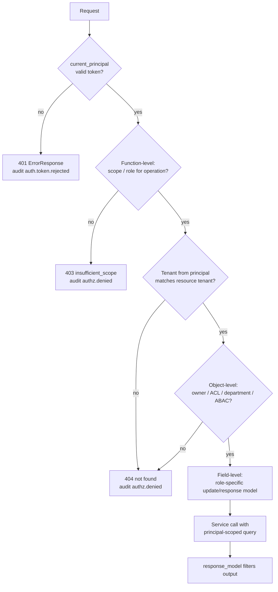
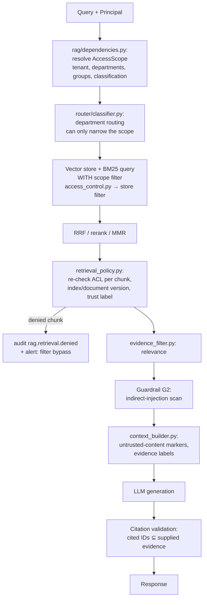

# API Security Standards

These standards secure the unified FastAPI + RAG + Agentic AI backend on AWS ECS Fargate:
authentication, JWT, OAuth 2.0 and OpenID Connect, access control, input and output security,
request processing, rate limiting, RAG and agent security, ECS/AWS controls, monitoring, CI/CD,
security testing, threat modeling and a release checklist.

In generated projects, this file lives at `docs/standards/API_SECURITY.md`. It builds on
`API_CONVENTIONS.md` §2 (dependency-based authorization), `PYDANTIC_STANDARDS.md` (request and
response models, `SecretStr`), `ASYNC_EXECUTION.md` (timeouts, limiters, workers), `GUARDRAILS.md`
(content safety, which runs **after** authorization, never instead of it), `AGENT_SECURITY.md`
(LLM and agent threat catalog, OWASP LLM/Agentic mappings, tool authorization) and
`AI_EVALUATION.md` §15 (evaluation data).

**Status labels:**

- 🟢 **Mandatory convention.** Follow it by default; deviations need a documented exception (§13.3).
- 🟡 **Needs approval.** An open team decision. Present the options and don't pick one silently.
- ⚪ **Illustrative.** Example code or configuration. It isn't an implemented module, contains no real keys or endpoints and doesn't choose a provider.

**References used:** OWASP API Security Top 10 (2023), OWASP Top 10 for LLM Applications (2025),
OWASP ASVS, OWASP cheat sheets, RFC 6749/6750 (OAuth 2.0), RFC 7519 (JWT), RFC 8725 (JWT BCP),
RFC 9068 (JWT access tokens), RFC 7636 (PKCE), RFC 9700 (OAuth 2.0 Security BCP), RFC 8693 (token
exchange), RFC 9449 (DPoP), RFC 8705 (mTLS), OpenID Connect Core 1.0, NIST SP 800-63B, FastAPI
security docs, AWS ECS/IAM docs. Library and AWS details were checked against current docs where
noted; anything else is marked for verification on adoption.

---

## 0. Quick rules for code generation

| # | Rule | Status |
|---|---|---|
| 1 | **Default deny.** Every route declares its authentication and authorization dependency. A route without one fails a Tier 1 test unless it's on the explicit public-route allowlist. | 🟢 |
| 2 | Use a standard protocol (OIDC/OAuth 2.0 via the approved IdP). **No custom authentication protocol, no custom crypto, no authorization server in this service.** | 🟢 (IdP 🟡) |
| 3 | Validate JWTs with **pinned algorithms per issuer**, signature, `iss`, `aud`, `exp`, `nbf`, `typ` and required scopes. Never trust the token's `alg`, `jku`, `x5u` or `jwk` headers. | 🟢 |
| 4 | Authorize **every** object, function and field access server-side, including every client-supplied ID. UUIDs are not authorization. | 🟢 |
| 5 | Tenant and department isolation is enforced in queries and **as a vector-store filter before ranking**, never by the LLM. | 🟢 |
| 6 | Agents act with the **user's effective permissions ∩ the agent's tool profile**. A plan never grants permissions; authorization is re-checked right before each sensitive action. | 🟢 |
| 7 | Request bodies, uploads, pagination and nesting depth have explicit limits. Uploads are checked by size, type, signature and name before storage. | 🟢 |
| 8 | All outbound HTTP from user- or model-influenced URLs goes through the destination policy (§5.7). | 🟢 |
| 9 | Responses use explicit `response_model`s. Errors use `ErrorResponse` with a stable code and no internals, tokens or stack traces. | 🟢 |
| 10 | Security headers are set by `common/security/headers.py`; HSTS at the TLS termination layer. | 🟢 |
| 11 | Rate limits and budgets are **distributed** (shared across ECS tasks), keyed per user, tenant, key, endpoint and IP. | 🟢 (mechanism 🟡) |
| 12 | Secrets come from Secrets Manager / SSM via the task definition or the task role, typed as `SecretStr`. No secret in code, images, prompts, logs or the repo. | 🟢 |
| 13 | Security events are emitted as typed `AuditEvent`s with correlation IDs. Never log tokens, passwords, keys, raw confidential documents or unnecessary PII. | 🟢 |
| 14 | Security tests for BOLA, BFLA, cross-tenant access, JWT validation and unauthorized retrieval exist from day 0 (`tests/security/`). | 🟢 |
| 15 | Model output, retrieved content, tool results and MCP responses are **untrusted input** (AGENT_SECURITY §1). | 🟢 |

### Where the code goes

| Code | Location | Notes |
|---|---|---|
| `current_principal`, `CurrentPrincipal`, `require_<permission>`, scope dependencies | `src/auth/dependencies.py` | Existing file (API_CONVENTIONS §2) |
| JWT/JWKS validation, token types, claim → `Principal` mapping | `src/auth/tokens.py` | Replaces the decoding previously sketched in `auth/service.py` |
| RBAC/ABAC policy evaluation, permission constants | `src/auth/permissions.py` | Permission names live in `auth/constants.py` |
| Password hashing and verification (only if local accounts are approved 🟡) | `src/auth/security.py` | |
| Auth-specific audit emitters (`auth.login.failed`, …) | `src/auth/audit.py` | Uses `common/security/audit_schemas.py` |
| `AuthSettings` (`AUTH_` prefix, issuers, audiences, JWKS URLs, leeway) | `src/auth/config.py` | Existing file |
| Security headers middleware | `src/common/security/headers.py` | Registered in `src/middleware.py` |
| Distributed rate limiter interface and key builders | `src/common/security/rate_limiting.py` | Backend 🟡 |
| Body size, depth, content type, filename and outbound URL validation | `src/common/security/request_validation.py` | |
| `AuditEvent` and related Pydantic models | `src/common/security/audit_schemas.py` | Emitted via `common/logging.py` |
| `AccessScope` model and store-filter translation | `src/rag/security/access_control.py` | Resolved per request in `rag/dependencies.py` |
| File validation for ingestion (type, signature, size, archive and parser limits) | `src/rag/security/document_validation.py` | Structural; G0 content safety stays in `guardrails/` |
| Post-retrieval ACL re-check, trust labels, provenance requirements | `src/rag/security/retrieval_policy.py` | Relevance filtering stays in `retrieval/evidence_filter.py` |
| Tool authorization, execution budgets, approval policy | `src/agents/security/{tool_permissions,execution_policy,approval_policy}.py` | Enforced by `execution/executor.py` (AGENT_SECURITY §4) |
| Security tests | `tests/security/{authentication,authorization,api,rag,agents}/` | Synthetic fixtures only |
| Prompt-injection effectiveness datasets | `evaluation/datasets/guardrails/` | AI_EVALUATION §9, GUARDRAILS §11 |

There is no separate `security/` app or package. Security code lives with the domain it protects,
and cross-domain pieces live in `common/security/`.

---

## 1. Authentication

### 1.1 Choosing the mechanism 🟡

| Client | Mechanism | Notes |
|---|---|---|
| Browser SPA / web app (first-party) | OIDC Authorization Code + PKCE via a **backend-for-frontend (BFF)**; the browser holds an HttpOnly session cookie, not tokens | Needs CSRF protection (§7.4) |
| Mobile / desktop app | OIDC Authorization Code + PKCE (public client), system browser | Refresh-token rotation |
| Other internal services | OAuth 2.0 Client Credentials, or workload identity (IAM/SigV4 behind API Gateway 🟡) | Audience-restricted tokens |
| Agents acting for a user | Token exchange / on-behalf-of with narrowed scope (§4.6) | Never reuse the user's broad token |
| Partner integrations | OAuth client credentials, or API keys only if approved | API keys are identifiers with a secret, not users |

- **JWT bearer tokens are not mandatory everywhere.** A BFF with server-side sessions is the preferred browser pattern; opaque tokens with introspection are acceptable 🟡.
- **Enterprise SSO.** The IdP (e.g. an OIDC/SAML provider, Cognito federation, Entra ID, Okta 🟡) owns login, MFA, password policy, recovery and lockout. This service **validates** what the IdP issues and maps claims to a `Principal`. It doesn't collect enterprise passwords.

### 1.2 If local accounts are approved 🟡

Only when a use case can't use the IdP (e.g. isolated test environments):

- **Password hashing:** Argon2id via a maintained library (FastAPI docs use `pwdlib[argon2]` with `PasswordHash.recommended()`); bcrypt only for legacy. Parameters reviewed against current OWASP guidance. Never MD5/SHA-x, never reversible encryption.
- **Password policy (NIST SP 800-63B):** minimum length (≥ 8, 15 recommended for single-factor 🟡), allow long passphrases (≥ 64 chars), check against breached-password lists, no composition rules or periodic forced rotation.
- Timing-safe verification; identical responses and similar timing for "unknown user" and "wrong password".

### 1.3 Brute force, throttling and lockout 🟢

- Throttle login, token, MFA, recovery and registration endpoints **per account and per IP/client** (§8), with exponential backoff.
- **Avoid lockout DoS:** don't hard-lock accounts on a failure count alone. Use progressive delays, CAPTCHA/step-up after a threshold 🟡, and notify the user; permanent lockout only through the IdP's risk engine.
- Detect credential stuffing (many accounts, one source) and password spraying (one password, many accounts) and alert (§12).

### 1.4 MFA, sessions, logout and recovery 🟢

- MFA is enforced by the IdP for all human users; phishing-resistant factors (WebAuthn/passkeys) for admins 🟡. Step-up (`acr`/`amr` claims) for sensitive operations (approvals, exports, admin).
- **Session expiry:** idle and absolute timeouts 🟡. Server-side sessions are revocable; logout deletes the session and, where supported, revokes the refresh token and triggers IdP logout.
- **Revocation:** short access-token lifetimes; a denylist by `jti` or session ID only for high-risk events (compromise, termination) 🟡.
- **Recovery** is the IdP's flow. If local: single-use, short-lived, high-entropy reset tokens stored hashed; no account enumeration; notify on change; invalidate sessions after reset.

### 1.5 Audit 🟢

Emit `auth.login.succeeded/failed`, `auth.token.rejected` (with reason category), `auth.mfa.*`,
`auth.session.revoked`, `auth.password.changed`, `auth.recovery.*` (§12).

### 1.6 Authentication flow

```mermaid
sequenceDiagram
    autonumber
    participant B as Browser
    participant BFF as BFF / web backend
    participant IdP as Identity provider (🟡)
    participant ALB as ALB (TLS)
    participant API as FastAPI (current_principal)
    participant JW as JWKS cache (auth/tokens.py)

    B->>BFF: Open app
    BFF->>IdP: Authorization request (code, PKCE S256, state, nonce, exact redirect_uri)
    IdP->>B: Login + MFA
    IdP->>BFF: Redirect with code + state
    BFF->>IdP: Token request (code + code_verifier, client auth)
    IdP-->>BFF: ID token + access token (+ refresh token)
    BFF->>BFF: Validate ID token (iss, aud, nonce, exp); create HttpOnly session
    B->>BFF: API call (session cookie + CSRF token)
    BFF->>ALB: Request + Bearer access token
    ALB->>API: Forward (X-Forwarded-* from ALB only)
    API->>JW: Get key by kid (cached, refreshed async)
    API->>API: Verify signature (pinned alg), iss, aud, exp/nbf, typ, scopes
    alt valid
        API->>API: Map claims → Principal
    else invalid
        API-->>ALB: 401 ErrorResponse + WWW-Authenticate; audit auth.token.rejected
    end
```

---

## 2. JWT

### 2.1 Validation rules 🟢 (RFC 8725, RFC 9068)

| Check | Rule |
|---|---|
| Algorithm | Pinned **per issuer** from `AuthSettings` (e.g. `["RS256"]` or `["ES256"]`, 🟡). Pass `algorithms=` explicitly. Never read the algorithm from the token header; reject `none` and any symmetric algorithm for an asymmetric issuer (key-confusion). |
| Key selection | `kid` selects a key **only from the configured issuer's JWKS**. Ignore `jku`, `x5u`, `jwk` and `x5c` headers. |
| Signature | Always verified; decoding without verification is only allowed in tests of the rejection path. |
| `iss` | Exact match against the configured issuer list. The issuer decides the JWKS URL, never the reverse. |
| `aud` | Must contain this API's audience; reject tokens for other audiences (no token reuse across services). |
| `exp`, `nbf`, `iat` | Required; leeway ≤ 60 s 🟡 for clock skew. |
| `typ` | Access tokens must be `at+jwt` (RFC 9068) if the IdP supports it; otherwise distinguish token types by a claim. **Reject ID tokens used as access tokens.** |
| Scopes / roles | Required scopes per route (§3.5); claims mapped to `Principal` in one place. |
| Subject and tenant | `sub` and tenant claim required; tenant claim name 🟡. |
| Size | Reject oversized tokens (e.g. > 8 KB 🟡) before parsing. |

### 2.2 Keys 🟢

- **Asymmetric signing** (RS256/PS256/ES256/EdDSA 🟡) by the IdP. This service holds only public keys (JWKS). HS256 is acceptable only for tokens this service both issues and verifies, with a ≥ 256-bit random secret from Secrets Manager 🟡, and never shared with other services.
- **Rotation:** the IdP publishes new keys before use; the JWKS cache refreshes on schedule and on an unknown `kid` (rate-limited, e.g. at most once per minute 🟡, to stop `kid`-spraying from hammering the IdP).
- **JWKS caching:** keys cached in process with a TTL; refresh happens **off the event loop** (PyJWT's `PyJWKClient` is synchronous — call it via `anyio.to_thread.run_sync` with a limiter, or fetch JWKS with an async HTTP client in a lifespan background task, ASYNC_EXECUTION §3).
- **IdP unavailability:** keep using cached keys up to a maximum staleness 🟡; if no valid key is available, **fail closed** (401/503), never skip verification.
- No production keys in examples, tests or the repo. Tests generate throwaway key pairs at runtime.

### 2.3 Lifetimes, refresh and storage 🟡

- Access tokens short-lived (e.g. 5–15 min). Refresh tokens only for clients that need them, with **rotation and reuse detection** (reuse of an old refresh token revokes the family), and bound to the client.
- Browsers: tokens stay in the BFF; the browser gets an HttpOnly, Secure, `SameSite=Lax/Strict` cookie. **No tokens in `localStorage`/`sessionStorage`.**
- Replay: short lifetimes + TLS; `jti` tracking only for high-value one-time tokens; sender-constrained tokens (DPoP, mTLS) for high-risk clients 🟡.
- **No secrets or sensitive personal data in the payload** — JWTs are signed, not encrypted.

### 2.4 Validation code ⚪

```python
# ⚪ Illustrative content for src/auth/tokens.py (PyJWT API as in the FastAPI docs; library 🟡)
from typing import Any

import anyio
import jwt
from jwt.exceptions import InvalidTokenError

from src.auth.config import AuthSettings
from src.auth.exceptions import InvalidCredentials
from src.auth.schemas import Principal

_jwks_limiter = anyio.CapacityLimiter(4)


async def decode_access_token(token: str, settings: AuthSettings) -> Principal:
    if len(token) > settings.max_token_bytes:
        raise InvalidCredentials(reason="token_too_large")
    try:
        unverified_iss = jwt.decode(token, options={"verify_signature": False}).get("iss")
        issuer = settings.issuers.get(unverified_iss)     # allowlist lookup; the token can't pick its own JWKS
        if issuer is None:
            raise InvalidCredentials(reason="unknown_issuer")
        signing_key = await anyio.to_thread.run_sync(
            issuer.jwks_client.get_signing_key_from_jwt, token, limiter=_jwks_limiter
        )
        claims: dict[str, Any] = jwt.decode(
            token,
            signing_key.key,
            algorithms=issuer.algorithms,                 # pinned per issuer, never from the header
            audience=settings.audience,
            issuer=issuer.issuer,
            leeway=settings.leeway_seconds,
            options={"require": ["exp", "iat", "iss", "aud", "sub"]},
        )
    except InvalidTokenError as exc:
        raise InvalidCredentials(reason="invalid_token") from exc
    if jwt.get_unverified_header(token).get("typ", "").lower() not in issuer.accepted_typ:
        raise InvalidCredentials(reason="wrong_token_type")
    return Principal.from_claims(claims, issuer=issuer)   # one mapping for scopes, roles, tenant, department
```

`API_CONVENTIONS.md` §2's `current_principal` calls `tokens.decode_access_token`. The exception
carries a **reason category** for audit, never the token.

---

## 3. OAuth 2.0 and OpenID Connect

### 3.1 Flows 🟢 (RFC 9700)

| Use | Flow |
|---|---|
| User login (all clients) | **Authorization Code + PKCE (S256)**, confidential client where possible |
| Service to service | Client Credentials (audience-restricted) or workload identity 🟡 |
| Agent / downstream call on behalf of a user | Token Exchange (RFC 8693) or IdP on-behalf-of 🟡 (§4.6) |
| Devices without a browser | Device Authorization Grant 🟡 |
| **Forbidden** | Implicit grant; Resource Owner Password Credentials (FastAPI's `OAuth2PasswordBearer` tutorial flow is a teaching example, not for production IdP login); tokens in URLs |

### 3.2 Client-side protections (BFF / clients) 🟢

- **Exact redirect URI matching**, registered per environment; no wildcards, no open redirectors on redirect paths.
- `state` (CSRF for the callback) bound to the user's pre-login session; `nonce` in OIDC, checked in the ID token; PKCE `code_verifier` stored server-side in the BFF.
- Validate the ID token (`iss`, `aud` = client ID, `exp`, `nonce`, signature) before creating a session. The ID token proves login to the client; it's **not** an API access token.
- Use the IdP's discovery document; pin the issuer.

### 3.3 Resource-server protections (this API) 🟢

- Validate access tokens per §2; enforce `aud` = this API.
- **Least-privilege scopes**: scopes named `<resource>:<action>` (e.g. `documents:read`, `agents:execute`) 🟡; roles and attributes come from claims or the permission store (§4).
- Refresh tokens never reach this API.

### 3.4 Sender-constrained tokens 🟡

DPoP (RFC 9449) or mTLS-bound tokens (RFC 8705) for high-risk clients (admin tools, partner
integrations). Decide per client class.

### 3.5 FastAPI scope dependencies ⚪

```python
# ⚪ Illustrative content for src/auth/dependencies.py (continued)
from typing import Annotated

from fastapi import Depends, Security
from fastapi.security import SecurityScopes

from src.auth.exceptions import InsufficientScope


async def scoped_principal(security_scopes: SecurityScopes, principal: CurrentPrincipal) -> Principal:
    missing = set(security_scopes.scopes) - principal.scopes
    if missing:
        raise InsufficientScope(required=security_scopes.scope_str)   # 403 insufficient_scope (RFC 6750)
    return principal


DocumentReader = Annotated[Principal, Security(scoped_principal, scopes=["documents:read"])]
AgentExecutor = Annotated[Principal, Security(scoped_principal, scopes=["agents:execute"])]
```

- FastAPI's `Security(..., scopes=[...])` + `SecurityScopes` is the supported way to declare scopes and have them in OpenAPI. The FastAPI tutorial returns 401 for missing scopes; RFC 6750 specifies **403 with `error="insufficient_scope"`** — we use 403 🟢.
- Scopes are coarse. Object, tenant and field checks still happen (§4).

---

## 4. Access control

### 4.1 Model 🟢

`Principal` (from `auth/tokens.py`) carries: `user_id` or `service_id`, `tenant_id`, departments,
roles, scopes, attributes (clearance, region), `auth_time`, `acr`, and the token's `jti`/session.
Authorization decisions take **principal + action + resource (+ context)** and return
allow/deny with a reason code, in `auth/permissions.py`.

| Layer | Question | Where |
|---|---|---|
| Function-level (BFLA) | May this principal call this operation at all? | Route dependency (`require_<permission>`, scopes) |
| Object-level (BOLA) | May they act on **this** resource? | `valid_owned_<entity>` / `valid_<entity>_id` dependencies, and in the query itself |
| Tenant | Is the resource in their tenant? | Every query filters by `tenant_id` from the principal, never from the request |
| Department | Is it in a permitted department? | Query filter / RAG `AccessScope` |
| Field-level (BOPLA) | May they read or write this property? | Separate response/update models per role (PYDANTIC_STANDARDS §3); no mass assignment |
| Service-to-service | Is the calling service allowed this operation for this tenant? | Client-credentials scopes + allowlist |

- **RBAC** for coarse functions; **ABAC** for tenant, department, ownership, classification and state 🟡 (policy engine such as OPA/Cedar is 🟡; start with typed Python policies).
- **Default deny:** unknown permission, missing attribute or evaluation error ⇒ deny.
- **Every client-supplied ID** (path, query, body, nested objects, batch lists, file references, citation IDs, `tool` arguments) is authorized. Batch endpoints authorize each item.
- **UUIDs don't replace authorization** — they only make guessing harder.
- Return **404** for resources the caller may not know exist, **403** when existence isn't secret 🟡 (decide per resource, be consistent).

### 4.2 Authorization flow



### 4.3 Mass assignment and field exposure 🟢

- Create/update models list writable fields explicitly (`extra="forbid"`); server-controlled fields (`tenant_id`, `owner_id`, `role`, `status`, `price`) are never in client input models.
- Response models are per audience (`DocumentResponse` vs `DocumentAdminResponse`).

### 4.4 RAG access control

Retrieval filters by the caller's **real** permissions (§9). The `AccessScope` is derived from the
principal and the permission store, not from request parameters (a `department` query parameter
can only **narrow** the scope).

### 4.5 Agent access control

Agent tools use the user's effective permissions ∩ the agent's tool profile (§10, AGENT_SECURITY §4).

### 4.6 Service-to-service and on-behalf-of 🟢 (mechanism 🟡)

- Each service and worker has its own identity; tokens are audience-restricted to the callee.
- When a worker or agent calls another service **for a user**, it obtains a token exchanged for that user with a **narrowed** scope (RFC 8693 `subject_token` + `actor_token`, or IdP OBO) — never forwards the user's original broad token, never uses a shared super-service account.
- Job messages carry the principal **ID** and the requested action, not tokens; the worker re-resolves permissions (API_CONVENTIONS §2).
- Audit records both the user (`subject`) and the acting service/agent (`actor`).

---

## 5. Input security

### 5.1 Schemas and limits 🟢

- Every body, query and header input is a Pydantic model with constraints (`max_length`, `ge/le`, patterns for identifiers, enums, `extra="forbid"`) (PYDANTIC_STANDARDS §2).
- Limits:

| Limit | Where | Default 🟡 |
|---|---|---|
| Request body size | ALB/WAF + `request_validation.py` (reject by `Content-Length` and while streaming) | e.g. 1 MB JSON, larger only for upload routes |
| JSON nesting depth / element count | `request_validation.py` before model validation | e.g. depth 20 |
| String and list lengths | Model constraints | per field |
| Pagination | `limit` capped (e.g. ≤ 100), cursor-based for large sets | `common/schemas/pagination.py` |
| Prompt / message length | RAG and agent input models; token estimate before LLM call | per use case |
| Headers | Uvicorn `h11_max_incomplete_event_size` / ALB limits | defaults reviewed |

### 5.2 Content type 🟢

Require `Content-Type: application/json` for JSON routes (reject others with 415); multipart only
on upload routes. Don't guess content types.

### 5.3 File uploads 🟢

- Allowlist of types per route; verify the **file signature (magic bytes)** and parse-ability, not just the extension or client-supplied content type.
- Size limit enforced while streaming; count and total limits per request.
- **Filenames:** never used as paths. Store under generated IDs; keep a sanitized display name (strip path separators, control characters, length-limit).
- Archives: limits on entry count, uncompressed size and ratio (zip bombs); reject nested archives and entries with `..` or absolute paths 🟡.
- Office/PDF: parse in a constrained worker (timeouts, memory limits); strip or ignore active content; don't render macros.
- Malware scanning 🟡 before a file becomes retrievable (§9.2).
- Files are stored in private storage with server-side encryption; downloads go through authorization, with `Content-Disposition: attachment` and `nosniff`.

### 5.4 Injection 🟢

| Class | Control |
|---|---|
| SQL injection | Parameterized queries / ORM expressions only; never format SQL with input; allowlist dynamic identifiers (sort columns) via enums |
| Command injection | No shell. If a subprocess is unavoidable 🟡: `subprocess.run([...], shell=False)` with fixed argv and allowlisted values |
| Path traversal | Resolve paths under a fixed root and verify the prefix after `resolve()`; reject symlinks leaving the root |
| NoSQL / vector-store filter injection | Build filters from typed values; never pass client JSON as a filter expression |
| Template injection | User and model text are template data, never template source |
| Log injection | Structured JSON logging; control characters escaped |

Validation is by schema and typed parsing, **not regex alone**; regexes are bounded (no
catastrophic backtracking) and anchored.

### 5.5 XML and deserialization 🟢

- XML only if required, parsed with `defusedxml` (no external entities, no DTDs) — XXE and billion-laughs.
- YAML with `yaml.safe_load` only. **No `pickle`, `marshal`, `shelve`, `eval`, `exec`** on untrusted data (including model output and cached objects from shared storage).

### 5.6 Request validation code ⚪

```python
# ⚪ Illustrative content for src/common/security/request_validation.py
import json
from typing import Any

from src.common.exceptions import PayloadTooDeep


def enforce_json_depth(raw: bytes, max_depth: int, max_items: int) -> Any:
    """Parse once with limits, before Pydantic sees the payload."""
    items = 0

    def walk(node: Any, depth: int) -> None:
        nonlocal items
        if depth > max_depth:
            raise PayloadTooDeep()
        if isinstance(node, dict | list):
            items += len(node)
            if items > max_items:
                raise PayloadTooDeep()
            for child in node.values() if isinstance(node, dict) else node:
                walk(child, depth + 1)

    data = json.loads(raw)
    walk(data, 0)
    return data
```

### 5.7 Outbound requests and SSRF 🟢

Applies to webhooks, URL ingestion, agent HTTP tools, MCP servers, link previews and any other
destination influenced by users, documents or models.

- **Allowlist destinations** (scheme `https`, host, port, path prefix) per feature 🟡; deny by default.
- Resolve DNS **once**, validate every resolved IP, then connect to that IP (pinning prevents DNS rebinding).
- Block private, loopback, link-local, multicast, unique-local and reserved ranges (IPv4 and IPv6, including IPv4-mapped IPv6), plus **cloud metadata endpoints**: `169.254.169.254`, `fd00:ec2::254` (EC2 IMDS) and `169.254.170.2` (ECS task metadata / credentials).
- Block internal service names and VPC endpoints unless explicitly allowlisted.
- **Redirects:** disabled, or re-validated at every hop with a hop limit.
- Timeouts, response size limits and content-type checks; no credentials forwarded to allowlisted hosts unless configured per destination.
- Network egress restrictions (§11.4) back this up; application checks alone aren't enough.

---

## 6. Output security

### 6.1 Response data 🟢

- Every route declares `response_model` (PYDANTIC_STANDARDS §3); internal models never serialize directly. No excessive data exposure: return only what the caller's role needs (§4.3).
- Error responses use `ErrorResponse` (`code`, `message`, `request_id`); no stack traces, SQL, file paths, tokens, prompt text, model names or upstream error bodies. Detailed errors go to logs (redacted).
- Correct status codes: 400/422 validation, 401 unauthenticated (with `WWW-Authenticate`), 403 forbidden, 404 hidden or missing, 409 conflict, 413 too large, 415 unsupported type, 429 rate limited (with `Retry-After`), 503 dependency unavailable.
- Correct `Content-Type` on every response (`application/json; charset=utf-8`, `text/event-stream` for SSE).
- Production disables or protects `/docs`, `/redoc` and `/openapi.json` 🟡 (API_CONVENTIONS §9).

### 6.2 Security headers 🟢

| Header | Value for JSON APIs | Notes |
|---|---|---|
| `X-Content-Type-Options` | `nosniff` | All responses |
| `Content-Security-Policy` | `default-src 'none'; frame-ancestors 'none'` | For API responses; HTML surfaces (docs UI) need their own CSP 🟡 |
| `X-Frame-Options` | `DENY` | Legacy complement to `frame-ancestors` |
| `Referrer-Policy` | `no-referrer` | |
| `Cache-Control` | `no-store` on authenticated and sensitive responses | Public cacheable routes opt in explicitly |
| `Cross-Origin-Resource-Policy` | `same-origin` 🟡 | |
| `Strict-Transport-Security` | `max-age=31536000; includeSubDomains` (`preload` 🟡) | Set at **TLS termination** (CloudFront response headers policy or ALB, verify ALB header support 🟡) |
| `Server` | removed | Uvicorn `--no-server-header` / `server_header=False` |
| `X-Powered-By` etc. | not sent | |

- Don't use `X-XSS-Protection` (obsolete; can introduce issues) or rely on any header as a substitute for output encoding and authorization.
- **CORS:** explicit origin allowlist per environment; no `*` with credentials; allowed methods and headers listed; preflight cache bounded. CORS is not access control.

```python
# ⚪ Illustrative content for src/common/security/headers.py (registered in src/middleware.py)
from starlette.types import ASGIApp, Message, Receive, Scope, Send

SECURITY_HEADERS: dict[bytes, bytes] = {
    b"x-content-type-options": b"nosniff",
    b"content-security-policy": b"default-src 'none'; frame-ancestors 'none'",
    b"x-frame-options": b"DENY",
    b"referrer-policy": b"no-referrer",
}


class SecurityHeadersMiddleware:
    """Pure ASGI middleware: safe for streaming responses (no BaseHTTPMiddleware buffering)."""

    def __init__(self, app: ASGIApp, *, no_store: bool = True) -> None:
        self.app, self.no_store = app, no_store

    async def __call__(self, scope: Scope, receive: Receive, send: Send) -> None:
        if scope["type"] != "http":
            await self.app(scope, receive, send)
            return

        async def send_with_headers(message: Message) -> None:
            if message["type"] == "http.response.start":
                headers = [(k, v) for k, v in message.get("headers", []) if k.lower() != b"server"]
                present = {k.lower() for k, _ in headers}
                headers += [(k, v) for k, v in SECURITY_HEADERS.items() if k not in present]
                if self.no_store and b"cache-control" not in present:
                    headers.append((b"cache-control", b"no-store"))
                message["headers"] = headers
            await send(message)

        await self.app(scope, receive, send_with_headers)
```

### 6.3 LLM output 🟢

Model output is untrusted (LLM05): encoded for its rendering context, Markdown rendered without
raw HTML, links allowlisted, citations validated (PYDANTIC_STANDARDS §7), and G3/G6 output
guardrails for disclosure (GUARDRAILS).

---

## 7. Request processing

### 7.1 Order of processing 🟢

1. **Edge** (🟡 WAF / API Gateway / CloudFront): TLS, size limits, managed rules, coarse IP rate limits.
2. **ALB → Uvicorn:** `--proxy-headers` with `--forwarded-allow-ips` restricted to the ALB subnets 🟡, so `X-Forwarded-For` and scheme can't be spoofed by clients.
3. **Middleware** (`src/middleware.py`): request ID / correlation ID, security headers, body-size enforcement, CORS.
4. **Authentication** (`current_principal`).
5. **Rate limiting and budgets** keyed by the authenticated principal (§8); unauthenticated limits by IP happen before step 4.
6. **Validation** (Pydantic, `request_validation.py`).
7. **Authorization** (function, object, tenant, field).
8. **Input guardrails** (GUARDRAILS G1/G2) for LLM routes — after authorization.
9. **Service logic**, with timeouts (ASYNC_EXECUTION §10).
10. **Output validation and guardrails**, `response_model`, headers.
11. **Audit event** for security-relevant actions.

### 7.2 Timeouts and resource isolation 🟢

- Every outbound call has a timeout; the interactive path has an end-to-end deadline; long work moves to the worker path (ASYNC_EXECUTION §6).
- Sync SDKs go through bounded limiters so one feature can't exhaust the thread pool (ASYNC_EXECUTION §3); limiter saturation returns 503/429 rather than queueing unboundedly.

### 7.3 Idempotency and replay 🟢

State-changing endpoints that trigger external effects (agent actions, payments, emails, ingestion)
accept an `Idempotency-Key` 🟡, scoped per principal, and store the result for a bounded time.

### 7.4 CSRF 🟢

- Bearer-token APIs (no cookies) aren't CSRF-exposed.
- Cookie-based (BFF) sessions: `SameSite=Lax` or `Strict`, plus a synchronizer or double-submit CSRF token on state-changing requests, plus an `Origin`/`Referer` check. GET is never state-changing.

### 7.5 Streaming 🟢

SSE/streaming routes authenticate and authorize **before** the first byte, re-check the stream's
time and token budget, and stop on client disconnect (ASYNC_EXECUTION §10). Output guardrails
apply to streamed chunks (GUARDRAILS §6).

### 7.6 Business-flow abuse (API6) 🟢

Identify sensitive flows (bulk export, account creation, approval requests, expensive agent
tasks) and add per-flow limits, step-up authentication or human review.

---

## 8. Rate limiting and resource consumption

### 8.1 What's limited 🟢

| Surface | Keys | Limits 🟡 |
|---|---|---|
| Authentication (login, token, MFA, recovery) | account + IP/client | Attempts per window, progressive delay |
| Public/unauthenticated routes | IP (from the trusted proxy chain) | Requests per window |
| General API | user, tenant, API key, endpoint | Requests per window, concurrent requests |
| RAG query | user, tenant | Requests, concurrency, retrieval K cap, context token cap |
| LLM generation | user, tenant, model | **Token budgets** (input + output), spend per day/month, concurrent streams, max duration |
| Agent execution | user, tenant, agent | Concurrent runs, steps, tool calls, tokens, cost, wall-clock (`execution_policy.py`) |
| Uploads | user, tenant | File size, files per request, bytes per day |
| Batch ingestion | tenant | Jobs in flight, documents per job, queue depth |
| Evaluation endpoints (if any) | admin identity | Jobs in flight, judge spend (AI_EVALUATION §11) |

### 8.2 Mechanisms 🟢

- **Distributed:** limits must hold across all ECS tasks. In-memory counters are only a per-task backstop. Options 🟡: WAF rate-based rules (coarse, per IP), API Gateway usage plans (per key), or a shared store (e.g. a managed Redis/ElastiCache or DynamoDB) behind `common/security/rate_limiting.py`. Installing a backend isn't part of this phase.
- **Algorithm:** token bucket or sliding window 🟡; atomic operations in the shared store.
- **Response:** 429 with `Retry-After` and an `ErrorResponse` code; no information about other tenants.
- **Fail mode** when the limiter store is unavailable 🟡: fail closed for auth and cost-bearing routes (LLM, agents), fail open with local backstop for cheap reads.
- **Backpressure:** bounded queues and limiters; reject early when the worker queue is too deep (ASYNC_EXECUTION §6–§7).
- **Thread-pool saturation:** per-feature `CapacityLimiter`s; alert on saturation (ASYNC_EXECUTION §11).
- **Circuit breakers** around LLM providers, vector store and external APIs 🟡 so failures don't cascade.
- **Spend limits:** per-tenant token/cost budgets checked before each LLM call, recorded after.

```python
# ⚪ Illustrative content for src/common/security/rate_limiting.py
from typing import Protocol

from src.common.schemas.base import CustomModel


class LimitDecision(CustomModel):
    allowed: bool
    retry_after_s: int | None = None
    remaining: int | None = None


class RateLimiter(Protocol):
    """Backed by a shared store so limits hold across ECS tasks (backend 🟡)."""

    async def hit(self, key: str, *, limit: int, window_s: int, cost: int = 1) -> LimitDecision: ...


def limit_key(*, surface: str, tenant_id: str, principal_id: str | None, ip: str | None) -> str:
    return ":".join(["rl", surface, tenant_id, principal_id or f"ip={ip}"])
```

---

## 9. RAG security

### 9.1 Secure retrieval flow



### 9.2 Ingestion 🟢

- Only authorized principals can add to a collection; ingestion jobs carry the uploader's ID and the target collection, checked again by the worker.
- `document_validation.py`: type allowlist, signature check, size and page limits, archive limits, parser timeouts, malware scan 🟡.
- G0 content scanning for embedded instructions and hidden text (GUARDRAILS G0); new sources can be **quarantined** before becoming retrievable 🟡.
- **Provenance** on every chunk: `tenant_id`, `collection_id`, `department`, `document_id`, `version`, `acl` (groups/users or classification), `source`, `ingested_by`, `ingested_at`, `content_hash`. Metadata comes from the system of record, not from the document text.
- **Poisoning:** write access limited; changes versioned and auditable; anomaly checks on sudden bulk changes; rollback by version.

### 9.3 Index and store 🟢

- **Tenant-aware indexing:** separate indexes/namespaces per tenant or a mandatory tenant filter on a shared index 🟡 — either way the tenant filter can't be omitted by callers (the store client in `providers/vector_store/` requires an `AccessScope` argument).
- **Vector-store access control:** the service's credentials are least-privilege; no direct client access to the store; admin and query identities separated.
- **Filter before content reaches the LLM**, and before ranking. Post-filtering after top-K both leaks through scores/timing and loses recall.
- ACL changes and **deletions** propagate: deleting or restricting a document removes or re-labels its chunks and embeddings (and caches) within an agreed SLA 🟡; re-indexing preserves ACLs.

### 9.4 Generation and disclosure 🟢

- Retrieved text is untrusted data, wrapped with markers and never treated as instructions (AGENT_SECURITY §1.1).
- Citation integrity: citations must reference evidence supplied in this request (PYDANTIC_STANDARDS §7; AI_EVALUATION §8).
- G3 output checks for disclosure of secrets, PII and system prompts.
- Cached answers are keyed by `AccessScope` (never shared across users with different scopes).

### 9.5 Required tests (`tests/security/rag/`) 🟢

Cross-tenant retrieval returns nothing; a department outside scope returns nothing even when the
query names it; a `department` parameter can't widen scope; a document revoked from a user
disappears from results; filter omission in the store client raises; citations to non-supplied
IDs are rejected; injected instructions in a fixture document don't change tool calls or
system behavior (AGENT_SECURITY §8).

---

## 10. Agentic AI security

Detailed controls: `AGENT_SECURITY.md` (threat catalog §1, OWASP LLM/ASI mappings §2–§3, tool
security §4, isolation §5, audit §6, release gate §9). The API-level rules:

- **Least privilege:** each agent profile lists allowed tools and side-effect classes; tools require explicit permissions; effective permission = user permissions ∩ agent profile ∩ tenant policy.
- **Separate planning, authorization and execution.** The planner proposes; `agents/security/tool_permissions.py` decides; `execution/executor.py` executes. **A plan can't grant permissions.**
- **Argument validation** against the tool's model plus ownership checks on every ID in the arguments (BOLA applies to tools).
- **Re-authorize immediately before sensitive actions**, not at plan time.
- **Human approval** (`approval_policy.py`) for irreversible, financial, external-send, permission-changing and bulk actions; approvals bind to the argument hash, are single-use and expire.
- **Budgets and limits** (`execution_policy.py`): max steps, tool calls, tokens, cost, wall-clock, concurrency, recursion/delegation depth.
- **External access:** HTTP tools via §5.7; filesystem tools under per-tenant roots; no shell or code execution without an approved sandbox (AGENT_SECURITY §5).
- **Tool and MCP outputs are untrusted**, validated against schemas and labeled; MCP servers are allowlisted, pinned and reviewed.
- **State persistence:** agent state and memory encrypted at rest, scoped per user/tenant/run, schema-validated when loaded, with retention limits.
- **Auditability:** every tool decision and execution emits `agent.tool.*` events (§12).

### 10.1 Tool execution flow

```mermaid
sequenceDiagram
    autonumber
    participant U as User (Principal)
    participant API as agents/router.py
    participant PL as Planner (LLM)
    participant TP as tool_permissions.py
    participant EP as execution_policy.py
    participant AP as approval_policy.py
    participant EX as execution/executor.py
    participant T as Tool / external system
    participant AU as Audit

    U->>API: Task (authenticated, scope agents:execute)
    API->>API: Build AgentExecutionContext (user perms ∩ agent profile ∩ tenant)
    API->>PL: Objective + untrusted-content markers
    PL-->>EX: Proposed tool call (name, args)
    EX->>EX: Validate args against tool schema; authorize every ID in args
    EX->>TP: authorize_tool_call(spec, ctx) — plan is not an input
    TP-->>EX: allow / deny(reason)
    EX->>EP: Check budgets (steps, tokens, cost, time)
    alt requires approval
        EX->>AP: Request approval (args hash)
        AP-->>U: Preview + approve/deny
        U-->>AP: Approve (step-up auth if required)
    end
    EX->>TP: Re-authorize just before execution
    EX->>T: Execute with scoped identity (§4.6), timeout
    T-->>EX: Result (untrusted, schema-validated)
    EX->>AU: agent.tool.executed (args hash, outcome)
    EX-->>PL: Labeled result
```

---

## 11. AWS ECS Fargate security

No Terraform, CloudFormation or AWS resources are created in this phase. These are requirements
for whoever builds the infrastructure.

### 11.1 IAM 🟢

- **Task execution role:** only pulls images from ECR, fetches the secrets referenced in the task definition and writes logs. Nothing else.
- **Task role:** the application's runtime permissions, least-privilege per service (API vs worker have different roles), resource-scoped ARNs, condition keys where possible. No `*` actions or resources.
- No long-lived access keys anywhere; the SDK uses the task role credentials.
- Separate accounts or at least roles per environment; production credentials never in lower environments.

### 11.2 Secrets 🟢

- Secrets Manager (rotation) or SSM Parameter Store SecureString, referenced via the task definition `secrets` field or read at startup through the task role.
- Task-definition secrets are injected at container start: **rotation needs a new task deployment** (or read secrets at runtime with caching 🟡).
- Pydantic settings type them as `SecretStr`; never logged, echoed in errors or placed in prompts.
- `.env.example` contains names and placeholders only.

### 11.3 Network 🟢

- Tasks in **private subnets**; only the ALB (or API Gateway VPC link 🟡) is public.
- Security groups: ALB → task port only; tasks → specific dependencies (DB, vector store, VPC endpoints) only.
- **TLS termination** at CloudFront/ALB with a modern TLS policy; TLS to internal dependencies where supported 🟡 (end-to-end TLS 🟡).
- VPC endpoints for AWS services (ECR, Secrets Manager, SSM, SQS, S3, CloudWatch Logs) to keep traffic private.

### 11.4 Egress 🟢

Restrict outbound traffic: security-group egress rules, NAT with network firewall or proxy
allowlists 🟡 for LLM providers and approved external APIs. Egress control backs up the SSRF
policy (§5.7).

### 11.5 Containers 🟢

- Minimal base image, pinned by digest; **non-root user**; `readonlyRootFilesystem: true` with a writable tmp volume where needed.
- Linux capabilities: drop all (Fargate only allows *adding* `SYS_PTRACE`; don't add it).
- No SSH; **ECS Exec disabled** in production or enabled only with IAM restriction and session logging 🟡.
- Image scanning (ECR enhanced scanning / Amazon Inspector, plus CI scanning §13) with severity gates.
- Health checks don't expose internals.

### 11.6 Data protection 🟢

Encryption in transit (TLS) and at rest (KMS for RDS/S3/SQS/EBS-equivalents, customer-managed keys 🟡).
S3 buckets private with Block Public Access; bucket policies require TLS.

### 11.7 SQS workers 🟢

- Queue policies restrict producers and consumers to specific task roles; deny non-TLS (`aws:SecureTransport`).
- SSE (SQS-managed or KMS) enabled; DLQs with the same encryption and access policy.
- Messages carry IDs and references, not tokens, documents or sensitive content; large payloads in encrypted S3 with authorization on read.
- Workers re-authorize the principal referenced by the job (§4.6); message schemas validated (PYDANTIC_STANDARDS); poison messages go to the DLQ, not logs.

### 11.8 Logging and detection 🟢

CloudTrail enabled for the account; CloudWatch Logs with retention and KMS encryption; log groups
access-restricted. GuardDuty (including ECS runtime monitoring) and Security Hub 🟡.

---

## 12. Monitoring

### 12.1 Events to record 🟢

| Category | Event types |
|---|---|
| Authentication | `auth.login.succeeded/failed`, `auth.token.rejected` (reason: expired, bad_signature, wrong_audience, unknown_issuer, wrong_type, malformed), `auth.mfa.*`, `auth.session.revoked` |
| Authorization | `authz.denied` (function / object / tenant / field), `authz.cross_tenant_attempt` |
| Abuse | `ratelimit.exceeded`, `budget.exceeded`, `upload.rejected`, `ssrf.blocked`, `input.rejected` (depth/size) |
| RAG | `rag.retrieval.denied` (post-retrieval ACL re-check caught a chunk — indicates a filter bug), `rag.ingestion.rejected/quarantined` |
| Agents | `agent.tool.denied`, `agent.tool.executed`, `agent.tool.unexpected` (tool outside the profile was proposed), `agent.approval.*`, `agent.budget.exceeded` |
| LLM | `llm.usage.anomaly` (excessive tokens/spend), `guardrail.blocked` |
| Admin and config | `admin.*` operations, `config.changed`, permission and role changes, key rotations |

### 12.2 Audit event schema ⚪

```python
# ⚪ Illustrative content for src/common/security/audit_schemas.py
from typing import Literal
from uuid import UUID

from pydantic import Field

from src.common.schemas.base import CustomModel, UtcDatetime


class AuditActor(CustomModel):
    kind: Literal["user", "service", "agent", "anonymous"]
    id: str | None = Field(description="Internal ID; never an email or name")
    tenant_id: str | None = None
    on_behalf_of: str | None = Field(default=None, description="User ID when a service/agent acts for a user")


class AuditTarget(CustomModel):
    type: str                                   # "document", "tool", "session", …
    id: str | None = None


class AuditEvent(CustomModel):
    event_id: UUID
    event_type: str = Field(pattern=r"^[a-z_]+(\.[a-z_]+)+$")   # "authz.denied"
    timestamp: UtcDatetime
    request_id: str
    correlation_id: str                          # spans API → worker → agent run
    actor: AuditActor
    action: str                                  # "documents:read", "tool:send_email"
    target: AuditTarget | None = None
    outcome: Literal["success", "denied", "failed", "error"]
    reason: str | None = Field(default=None, description="Reason category, not free text with data")
    source_ip: str | None = None                 # from the trusted proxy chain
    user_agent: str | None = Field(default=None, max_length=256)
    details: dict[str, str | int | bool] = Field(default_factory=dict)   # hashes, counts, versions — no secrets
```

### 12.3 Logging rules 🟢

- **Never log** access/refresh/ID tokens, `Authorization` or `Cookie` headers, passwords, API keys, secrets, raw confidential documents or chunk text, full prompts with user data, or unnecessary PII. Log IDs, hashes and reason categories.
- Redaction is enforced in `common/logging.py` (denylisted keys, token patterns) and tested.
- Audit events go to a separate, access-restricted, tamper-resistant sink 🟡 with retention.

### 12.4 Alerting and investigation 🟡

- Alerts: spikes in auth failures (stuffing/spraying), invalid JWTs by reason, cross-tenant attempts, any `rag.retrieval.denied` (should be zero), unexpected tool proposals, approval anomalies, rate-limit bursts per tenant, spend anomalies, admin/config changes outside change windows.
- Investigation: `correlation_id` links API, worker and agent events; runbooks per alert; retention long enough for incident timelines 🟡.

---

## 13. CI/CD security

No pipelines are created in this phase. Required controls for when CI/CD is set up:

### 13.1 Scanning 🟢 (tools 🟡)

| Control | Purpose | Example tools 🟡 |
|---|---|---|
| Secret scanning | Block committed credentials (pre-commit + CI + repo push protection) | gitleaks, trufflehog, GitHub secret scanning |
| Dependency scanning | Known-vulnerable packages | pip-audit, osv-scanner, Dependabot |
| SAST | Insecure code patterns | ruff `S` (bandit) rules, bandit, semgrep, CodeQL |
| Container image scanning | OS and library CVEs in images | trivy, grype, ECR/Inspector |
| IaC scanning | Misconfigured infrastructure (when IaC exists) | checkov, tfsec/trivy config |
| SBOM | Inventory of components per image/release | syft, CycloneDX |
| Dependency pinning | Reproducible, tamper-evident builds | `uv.lock` with hashes; base images pinned by digest |

### 13.2 Process 🟢

- Protected default branch; required reviews (CODEOWNERS for `auth/`, `common/security/`, `rag/security/`, `agents/security/`); required status checks; signed commits 🟡.
- Separate CI credentials per environment; OIDC federation from CI to AWS (no long-lived keys) 🟡.
- Deployment approvals for production; immutable, signed images 🟡; automated rollback on failed health checks.
- AI supply chain: model, prompt and MCP/tool connector versions reviewed and pinned like code (AGENT_SECURITY ASI04).

### 13.3 Severity handling and exceptions 🟢 (SLAs 🟡)

| Severity | Pipeline behavior | Fix SLA 🟡 |
|---|---|---|
| Critical | Block merge and deploy | Immediately / 24–72 h |
| High | Block deploy to production | 7 days |
| Medium | Warn; ticket | 30 days |
| Low | Report | Backlog |

Exceptions: a documented record (finding, justification, compensating controls, owner, expiry
date, approver from security), reviewed on expiry. No silent suppressions in scanner configs.

---

## 14. Security testing

### 14.1 Test layout

```text
tests/security/
├── authentication/   # JWT validation, OAuth callback/redirect handling in the BFF (if in repo), throttling
├── authorization/    # BOLA, BFLA, BOPLA, cross-tenant, department, service-to-service
├── api/              # headers, CORS, errors, size/depth limits, uploads, SSRF, injection, CSRF, rate limits
├── rag/              # unauthorized/cross-tenant retrieval, ACL revocation, citation integrity, document injection
└── agents/           # tool authorization, argument BOLA, approval bypass, budget, prompt-injection escalation
```

### 14.2 Test catalog 🟢

| Area | Test | Type |
|---|---|---|
| Auth bypass | Every non-allowlisted route rejects missing/invalid tokens (route inventory test over `app.routes`) | Deterministic |
| JWT | `alg=none`; HS256 signed with the public key; wrong `iss`/`aud`; expired; `nbf` in future; ID token as access token; unknown `kid`; `jku`/`x5u` header ignored; oversized token | Deterministic (throwaway keys generated in fixtures) |
| JWKS | Unknown `kid` triggers at most one refresh per interval; IdP down ⇒ cached keys used until max staleness, then fail closed | Deterministic (fake JWKS) |
| OAuth redirects | Redirect URI mismatch rejected; missing/mismatched `state` and `nonce` rejected (BFF) | Deterministic |
| CSRF | Cookie-authenticated POST without CSRF token or with foreign `Origin` rejected | Deterministic |
| BOLA | User A requests user B's resource by ID, in path, query, body, nested and batch fields ⇒ 404/403 | Deterministic |
| BFLA | Non-admin calls admin routes; read scope calls write route ⇒ 403 | Deterministic |
| BOPLA | Update with server-controlled fields rejected; responses omit admin-only fields | Deterministic |
| Cross-tenant | Every tenant-scoped route with tenant B's IDs from tenant A | Deterministic |
| Rate limits | Exceeding limits ⇒ 429 + `Retry-After`; limits shared across two app instances against the same fake store | Deterministic / integration |
| Uploads | Wrong magic bytes, oversized, zip bomb, path in filename, polyglot | Deterministic |
| SSRF | Private, loopback, link-local, metadata IPs (v4/v6/mapped), DNS rebinding (resolver fake), redirect to internal | Deterministic |
| Injection | SQL metacharacters in all string params; sort field allowlist; XML with external entity; YAML tags | Deterministic / integration (DB) |
| Disclosure | Errors contain no stack traces/SQL/tokens; `Server` header absent; headers present | Deterministic |
| Prompt injection | Fixture documents/tool results with instructions don't change tool calls or scope (scripted fake LLM) | Deterministic; effectiveness in AI_EVALUATION datasets |
| Agent escalation | Tool outside profile, user lacking permission, argument with foreign ID, approval replay or changed args ⇒ denied | Deterministic |
| Unauthorized RAG | §9.5 tests | Deterministic / integration (vector store) |

- **Deterministic** tests run with fakes (`app.dependency_overrides`, fake IdP/JWKS, fake vector store, scripted LLM) in every CI run. **Integration** tests (real DB, real vector store, local containers 🟡) run in a separate job.
- All fixtures are synthetic; generated keys are created at test time and never committed.
- DAST/penetration tests only against our own environments with written authorization; **no testing of external systems without authorization.**

```python
# ⚪ Illustrative content for tests/security/authorization/test_bola.py
import pytest

pytestmark = pytest.mark.anyio


async def test_user_cannot_read_other_tenants_document(client, token_for, seed_document):
    doc = await seed_document(tenant_id="tenant-b", owner_id="user-b")
    response = await client.get(f"/api/v1/documents/{doc.id}", headers={"Authorization": f"Bearer {token_for('user-a', tenant='tenant-a')}"})
    assert response.status_code == 404
    assert response.json()["code"] == "document_not_found"
```

---

## 15. Threat modeling

- **When:** for each new domain, each new external integration, each new agent tool or side-effect class, and each change to authentication or tenancy. Recorded in `docs/decisions/` 🟡.
- **Method:** STRIDE per data-flow element, plus the OWASP API Top 10, LLM Top 10 and Agentic Top 10 as checklists (AGENT_SECURITY §2–§3, §10).
- **Trust boundaries** for this template: client ↔ edge; edge ↔ API; API ↔ IdP/JWKS; API ↔ DB/vector store; API ↔ LLM provider; API ↔ worker (SQS); agent executor ↔ tools/MCP/external APIs; ingestion ↔ document sources; evaluation ↔ judge providers.

| STRIDE | Example in this system | Primary controls |
|---|---|---|
| Spoofing | Forged JWT, spoofed `X-Forwarded-For`, spoofed agent message | §2, §7.1, AGENT_SECURITY ASI07 |
| Tampering | Modified tool arguments after approval, poisoned documents | Approval hash binding, §9.2 provenance |
| Repudiation | "The agent did it" | Audit events with subject + actor (§12) |
| Information disclosure | Cross-tenant retrieval, verbose errors, prompt leakage | §4, §6, §9 |
| Denial of service | Token floods, huge uploads, agent loops | §5.1, §8, execution budgets |
| Elevation of privilege | BFLA, mass assignment, agent using service account | §4, §10, §4.6 |

Outputs: data-flow diagram, threats with risk rating, mapped controls, test IDs from §14, owners
and open 🟡 decisions.

---

## 16. Security checklist

**Note on sources.** The Phase 5 request mentions "the controls from the supplied image". No image
was included, so this checklist maps the supplied text checklist instead: the LLM Agent Security
Audit Checklist (also in `AGENT_SECURITY.md` §9–§10), the Phase 5 controls, the OWASP API
Security Top 10 (2023) and the OWASP Top 10 for LLM Applications (2025). If the image turns up,
add any controls it has that are missing here.

**M** = mandatory 🟢, **D** = team decision 🟡 (the control is mandatory; its mechanism or values need approval).

| # | Control | Purpose | Responsible component | Verification | OWASP | M/D |
|---|---|---|---|---|---|---|
| 1 | Default-deny route inventory | No unauthenticated route by accident | `auth/dependencies.py`, route allowlist | Route inventory test (§14) | API2, API5 | M |
| 2 | Standard IdP protocol (OIDC/OAuth), no custom auth | Proven protocols | IdP + `auth/tokens.py` | Design review | API2 | M (IdP D) |
| 3 | JWT validation (pinned alg, sig, iss, aud, exp, nbf, typ) | Reject forged/misused tokens | `auth/tokens.py` | JWT test suite | API2 | M |
| 4 | JWKS caching, rate-limited refresh, fail closed | Rotation without outage or bypass | `auth/tokens.py` | Fake JWKS tests | API2 | M (TTLs D) |
| 5 | Short access-token lifetime; refresh rotation + reuse detection | Limit stolen-token value | IdP config, BFF | IdP config review | API2 | D |
| 6 | Auth Code + PKCE, exact redirects, state, nonce; no implicit/ROPC | Secure login flows | BFF / clients | Callback tests; IdP client review | API2 | M |
| 7 | MFA (phishing-resistant for admins), step-up for sensitive ops | Account takeover resistance | IdP, `require_<permission>` with `acr` | IdP policy review; step-up test | API2 | M (factors D) |
| 8 | Login/recovery throttling without lockout DoS | Brute-force and stuffing resistance | IdP, `rate_limiting.py` | Rate-limit tests | API2, API4 | M |
| 9 | Argon2id password hashing (only if local accounts) | Credential protection | `auth/security.py` | Unit test; review | API2 | D |
| 10 | Function-level authorization (scopes/roles) | Stop BFLA | `auth/dependencies.py`, `auth/permissions.py` | BFLA tests | API5 | M |
| 11 | Object-level authorization on every client-supplied ID | Stop BOLA | `<domain>/dependencies.py`, queries | BOLA tests | API1 | M |
| 12 | Tenant and department isolation in every query | Stop cross-tenant access | services, `rag/security/access_control.py` | Cross-tenant tests | API1, LLM02, LLM08 | M |
| 13 | Field-level models; no mass assignment | Stop BOPLA | Pydantic request/response models | BOPLA tests | API3 | M |
| 14 | Service identities and on-behalf-of with narrowed scope | No shared super-accounts | `auth/tokens.py`, workers, IdP | Design review; worker re-auth test | API5, ASI03 | M (mechanism D) |
| 15 | Input schemas, size, depth, pagination limits | Stop malformed and oversized input | Pydantic models, `request_validation.py`, ALB/WAF | Limit tests | API4, API8 | M (values D) |
| 16 | Upload validation (signature, size, name, archive limits, scan) | Stop malicious files | `request_validation.py`, `rag/security/document_validation.py` | Upload tests | API4, API8, LLM04 | M (scanner D) |
| 17 | Parameterized queries; no shell; safe parsers (defusedxml, safe_load, no pickle) | Stop injection and deserialization attacks | services, providers | Injection tests; SAST | API8, LLM05 | M |
| 18 | SSRF destination policy + egress restrictions | Stop internal/metadata access | `request_validation.py`, network egress | SSRF tests; network review | API7, API10 | M (allowlists D) |
| 19 | Response models; safe errors; correct status codes | Stop data exposure | routers, `src/exceptions.py` | Disclosure tests | API3, API8 | M |
| 20 | Security headers; HSTS at TLS edge; no `Server` header; CORS allowlist | Browser-side hardening | `common/security/headers.py`, ALB/CloudFront | Header tests; edge config review | API8 | M |
| 21 | CSRF protection for cookie sessions | Stop cross-site actions | BFF, middleware | CSRF tests | API2, API8 | M |
| 22 | Trusted proxy configuration | Correct client IP and scheme | Uvicorn flags, ALB | Config review; spoofed header test | API8 | M |
| 23 | Distributed rate limits and quotas per user/tenant/key/endpoint/IP | Stop abuse and resource exhaustion | `rate_limiting.py`, WAF/API Gateway | Rate-limit tests (multi-instance) | API4, API6, LLM10 | M (backend D) |
| 24 | Token, cost, concurrency and duration budgets for LLM/agents | Stop unbounded consumption | `execution_policy.py`, `llm/` | Budget tests | API4, LLM10 | M (values D) |
| 25 | Backpressure, limiter saturation handling, circuit breakers | Stop cascading failure | ASYNC_EXECUTION components | Load tests; limiter tests | API4, ASI08 | M (breaker D) |
| 26 | Sensitive business-flow protections | Stop automated abuse of flows | per-flow limits, step-up | Flow review | API6 | M |
| 27 | RAG filter before ranking; post-retrieval ACL re-check | No unauthorized content to the LLM | `rag/security/*`, `providers/vector_store/` | §9.5 tests; zero `rag.retrieval.denied` | API1, LLM02, LLM08 | M |
| 28 | Secure ingestion with provenance, quarantine, versioning | Stop poisoning | `rag/ingestion.py`, `document_validation.py`, G0 | Ingestion tests; audit | LLM04, LLM08 | M (quarantine D) |
| 29 | ACL change and deletion propagation to indexes and caches | Revocations take effect | ingestion workers | Revocation test | LLM02, LLM08 | M (SLA D) |
| 30 | Citation integrity | No spoofed evidence | `rag/generation/validation.py` | Citation tests | LLM09 | M |
| 31 | Retrieved/tool/MCP content treated as untrusted | Stop indirect injection | `context_builder.py`, G2, executor | Injection fixtures | LLM01, ASI01 | M |
| 32 | Agent tool allowlist + per-user authorization, re-checked before execution | Stop excessive agency | `agents/security/tool_permissions.py`, `executor.py` | Agent escalation tests | LLM06, ASI02, ASI03 | M |
| 33 | Tool argument schema + ownership validation | Stop tool-based BOLA | tool argument models, executor | Argument tests | API1, LLM05, ASI02 | M |
| 34 | Human approval bound to argument hash, single-use | Stop approval bypass | `approval_policy.py` | Approval replay tests | LLM06, ASI09 | M (which tools D) |
| 35 | Sandbox for code/file/network tools | Contain execution | `execution_policy.py`, sandbox | Sandbox review | ASI05 | D |
| 36 | Secure agent state and memory | Stop memory poisoning and leakage | `cognition/memory/` | Isolation tests | ASI06, LLM02 | M |
| 37 | No secrets in prompts; prompt secrecy not a control | Stop prompt leakage impact | `llm/prompts/`, G3 | Prompt review; disclosure tests | LLM07 | M |
| 38 | Output guardrails and encoding for model output | Stop improper output handling | `guardrails/`, renderers | Guardrail tests | LLM05, LLM02 | M |
| 39 | ECS task vs execution role least privilege | Limit credential blast radius | IAM (infra) | IAM review; access analyzer 🟡 | API8 | M |
| 40 | Secrets Manager/SSM, `SecretStr`, rotation | Protect credentials | settings, task definition | Secret scan; config review | API8 | M (rotation D) |
| 41 | Private subnets, SGs, VPC endpoints, TLS, encryption at rest | Network and data protection | infra | Infra review; IaC scan | API8 | M |
| 42 | Non-root, read-only root FS, dropped capabilities, ECS Exec controlled | Container hardening | Dockerfile, task definition | Image/task review | API8 | M |
| 43 | SQS least privilege, SSE, TLS-only, DLQ, no sensitive payloads | Secure async processing | queues, workers | Policy review; message schema tests | API8 | M |
| 44 | Structured audit events for security actions | Detection and forensics | `common/security/audit_schemas.py`, `auth/audit.py` | Event emission tests | API2, API5, LLM06 | M |
| 45 | Log redaction; no tokens/passwords/keys/raw docs | Stop log leakage | `common/logging.py` | Redaction tests | LLM02, API8 | M |
| 46 | Alerting and runbooks | Timely response | monitoring stack | Alert tests / game days | API2, API4 | D |
| 47 | Secret, dependency, SAST, image, IaC scanning; SBOM; pinning | Supply-chain security | CI/CD | Pipeline evidence | API8, LLM03, ASI04 | M (tools D) |
| 48 | Protected branches, reviews, CODEOWNERS for security paths, deploy approvals, rollback | Change control | repo settings | Settings review | LLM03 | M |
| 49 | API inventory: versioned routes, OpenAPI, no shadow/deprecated endpoints in prod | Know the attack surface | `api/v1/router.py`, OpenAPI | Route inventory test; docs review | API9 | M |
| 50 | Validate and bound third-party API/LLM/MCP responses | Safe consumption of upstream APIs | `providers/*` clients | Contract tests with malformed responses | API10, LLM05 | M |
| 51 | Threat model per new domain, tool or integration | Find design flaws early | `docs/decisions/` | Review record | All | M |
| 52 | Security test suite in CI (§14) | Prevent regressions | `tests/security/` | CI results | All | M |
| 53 | Agent release gate | Safe agent launches | AGENT_SECURITY §9 | Gate checklist sign-off | LLM01–10, ASI01–10 | M |

---

## 17. Decisions still requiring team approval 🟡

1. Identity provider, token format (JWT vs opaque + introspection) and JWT library.
2. Signing algorithms per issuer, leeway, JWKS TTL and maximum staleness.
3. Access/refresh lifetimes, refresh rotation settings, revocation/denylist strategy.
4. BFF for browser clients; cookie and CSRF details.
5. Whether local accounts exist at all (and then password policy parameters).
6. Scope naming, role catalog, and whether a policy engine (OPA/Cedar) is adopted.
7. 404 vs 403 policy per resource type.
8. On-behalf-of mechanism (RFC 8693 vs IdP-specific) and sender-constrained tokens (DPoP/mTLS).
9. Size, depth, pagination, upload and prompt limits.
10. Malware scanning and document quarantine.
11. Outbound destination allowlists and the egress control mechanism.
12. Rate-limit backend (WAF, API Gateway, shared store), algorithm, limits and fail mode.
13. Circuit breaker library/pattern and budgets per tenant.
14. Vector-store tenancy model (index per tenant vs mandatory filter) and ACL propagation SLA.
15. Human-approval tool list and approval UX.
16. Sandbox technology for code/file tools, if any.
17. TLS end-to-end vs termination at the ALB; KMS key ownership.
18. ECS Exec policy; GuardDuty/Security Hub adoption.
19. Audit sink, retention and tamper resistance.
20. CI scanning tools, severity SLAs and the exception approval process.
21. `/docs` exposure in production.
