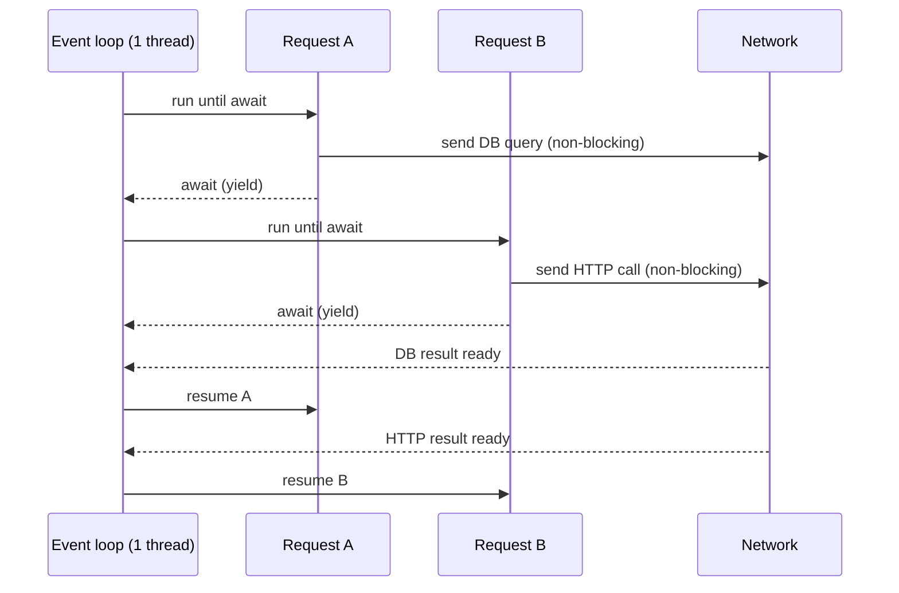
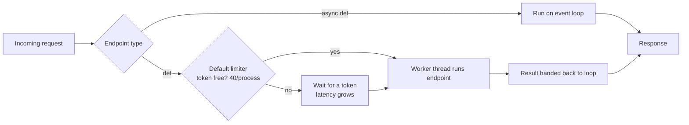
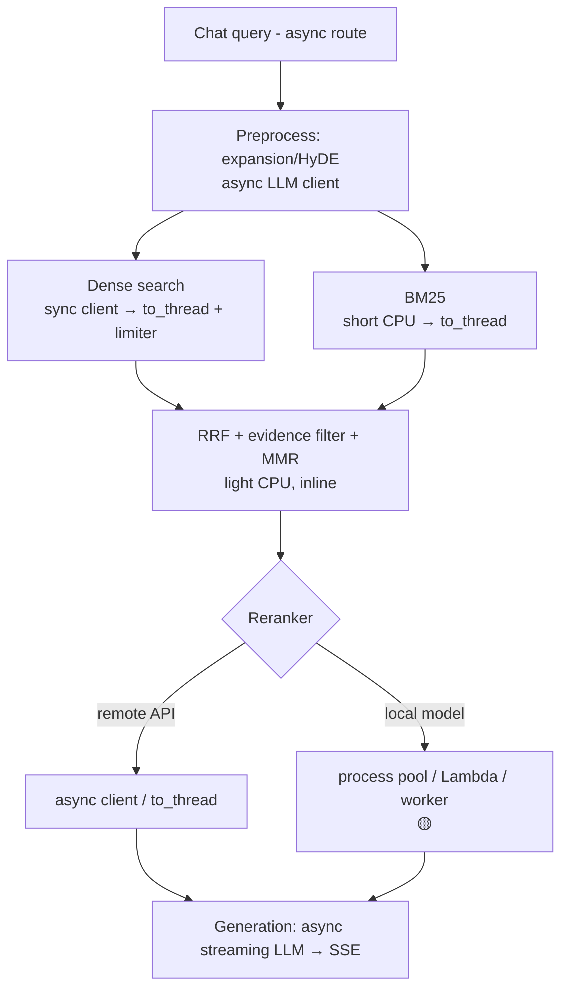
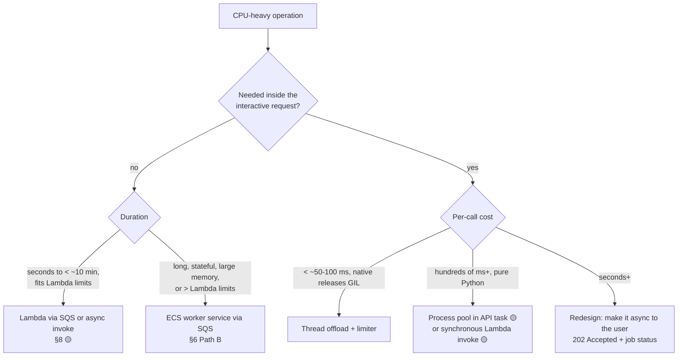
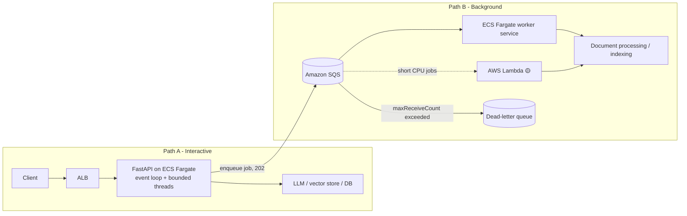
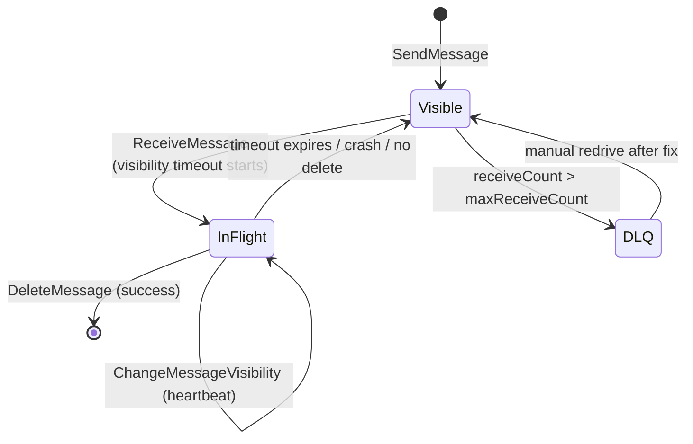

# Async Execution and Background Processing Standards

These standards cover event-loop discipline, thread-pool offloading, CPU-bound work and
background processing for the unified FastAPI + RAG + Agentic AI backend on AWS ECS Fargate,
with AWS Lambda as an offload target.

In generated projects, this file lives at `docs/standards/ASYNC_EXECUTION.md`.

**Status labels used throughout:**

- 🟢 **Convention.** Proposed standard. Follow it by default.
- 🟡 **Needs approval.** An architectural choice the team hasn't made yet. Present the options and don't pick one silently.
- ⚪ **Illustrative.** Example code showing a pattern. It is not an implemented dependency and not a mandated library choice.

---

## 0. Quick rules for code generation

Read this section before writing any route, service, client, tool or worker.

| # | Rule | Status |
|---|---|---|
| 1 | Use `async def` only when the whole call chain awaits genuinely asynchronous libraries. | 🟢 |
| 2 | Use `def` for routes whose work is dominated by synchronous blocking I/O and has no async alternative. | 🟢 |
| 3 | **Never** call blocking code (sync HTTP, sync DB/vector clients, `time.sleep`, file parsing, heavy CPU) directly inside `async def`. | 🟢 |
| 4 | Never make a sync function "async" just by adding `async` to its definition. That blocks the loop and hides the problem. | 🟢 |
| 5 | Offload unavoidable sync I/O from async code with `anyio.to_thread.run_sync` (bounded with a `CapacityLimiter`) or `starlette.concurrency.run_in_threadpool`. | 🟢 |
| 6 | Put timeouts on the **underlying network client**. Wrapping a thread in `asyncio.timeout` or `anyio.fail_after` does not stop the thread. | 🟢 |
| 7 | Threads do not make CPU-bound pure-Python code faster. Route CPU-heavy work using §5 (process pool, Lambda or worker service). | 🟢 |
| 8 | Anything longer than one interactive request, anything durable and anything retryable goes through a queue (Path B). It never runs inside the API task. | 🟢 |
| 9 | CPU-intensive jobs that finish in well under 15 minutes may be offloaded to AWS Lambda (§8). | 🟡 |
| 10 | Every queued job is idempotent, has a bounded retry count and has a dead-letter queue. | 🟢 |
| 11 | Don't create a custom thread pool or executor until measurements justify one. Reserve `src/execution/threadpool.py` for that. | 🟢 |
| 12 | Don't use FastAPI `BackgroundTasks` for ingestion, indexing, evaluation or anything that must survive a restart. | 🟢 |

**Where the code goes (within the unified structure):**

| Concern | Location |
|---|---|
| Thread-offload helpers, limiters, and future executors | `src/execution/threadpool.py` |
| Queue consumer and job dispatch loop | `src/execution/background_worker.py` |
| Enqueueing and scheduling jobs | `src/execution/job_scheduler.py` |
| Action execution, errors, and control flow | `src/execution/{executor,controller,error_handler,action_resolver}.py` |
| Queue, Lambda and other AWS service clients | `src/providers/external/` (or a new `src/providers/<service>/` 🟡) |
| Business logic that jobs run (ingestion, indexing, evaluation) | The owning module, e.g. `src/rag/ingestion.py`. Workers **call** this logic and never copy it. |

Do not create a separate worker application, a second `src/` or a second FastAPI app. The API
service, the ECS worker service and any Lambda function are **different entry points into the
same codebase** 🟡 (the packaging and entry-point layout still needs approval).

---

## 1. Python event-loop fundamentals

An `asyncio` event loop runs on **one thread**. It executes one coroutine at a time until that
coroutine hits an `await` on something that isn't ready yet, such as a socket read, a timer or a
lock. Then it switches to another ready coroutine.

- **Concurrency** means many tasks make progress by interleaving on one thread. The event loop provides concurrency.
- **Parallelism** means work executes at the same instant on multiple CPU cores. The event loop never provides parallelism. Threads provide it only when the code releases the GIL. Processes provide it for any code.



**What blocks the loop:** any code that doesn't yield. This includes sync network or database
calls, `time.sleep`, reading or parsing large files, JSON-encoding huge payloads, regex over big
text, tokenization, local model inference, BM25 scoring over large corpora and tight Python loops.

**While the loop is blocked, nothing else runs in that worker process.** Other requests,
streaming responses, health checks and timeouts all stall.

```python
# ❌ Blocks the event loop for every request in this process.
@router.get("/bad")
async def bad():
    time.sleep(2)                  # blocking
    return requests.get(URL).json()  # blocking sync HTTP

# ✅ Genuinely async end to end.
@router.get("/good")
async def good(client: httpx.AsyncClient = Depends(get_http_client)):
    await anyio.sleep(2)
    response = await client.get(URL)
    return response.json()
```

**Detecting blocking in development** 🟢: run with `PYTHONASYNCIODEBUG=1` (or
`asyncio.run(..., debug=True)`). asyncio then logs any callback that holds the loop longer than
`loop.slow_callback_duration` (default 100 ms).

---

## 2. FastAPI sync and async routes

| Declared as | Where FastAPI runs it | Use when |
|---|---|---|
| `async def` route | Directly on the event loop | Everything it awaits is non-blocking (async DB driver, `httpx.AsyncClient`, async SDKs) |
| `def` route | In a worker thread (AnyIO thread pool), awaited by the loop | The work is sync blocking I/O and has no async alternative |
| `def` dependency | Also in the thread pool, even when the route is `async def` | Sync setup such as a sync session factory |
| `async def` dependency | On the event loop | Async setup |
| Sync generator in `StreamingResponse` | Each `next()` runs in the thread pool | Streaming from a sync source |

FastAPI (through Starlette) calls sync endpoints with `anyio.to_thread.run_sync`. Every call borrows
a token from AnyIO's **default capacity limiter, which has 40 tokens per event loop**, so a single
worker process runs at most 40 sync routes, sync dependencies and offloaded calls at once. The 41st
waits. It isn't rejected, and it doesn't fail fast.



### Keep the call chain consistent 🟢

The mode chosen for a route must match its service and its client:

```text
async route  →  async service  →  async client        ✅
def route    →  sync service   →  sync client         ✅ (runs in thread pool)
async route  →  sync service   →  sync client         ❌ blocks the loop
async route  →  await run_sync(sync service)          ✅ explicit offload (§3)
def route    →  asyncio.run(async service)            ❌ never start a new loop per request
```

- Don't mix sync and async variants of the same client in one module without a clear boundary.
- An `async def` service method must not call blocking code internally. If it has to, it offloads explicitly.
- A route that does 1 ms of CPU work and awaits async I/O should be `async def`. A `def` route that calls only async-capable libraries through sync wrappers wastes a thread.

### Thread-pool limitations 🟢

- **Bounded capacity.** 40 tokens per process by default, shared by *all* sync routes, sync dependencies, sync streaming iteration and `run_in_threadpool` calls. One slow dependency can starve every other sync path.
- **Hidden queueing.** When the tokens run out, requests wait silently. Latency climbs with no errors, until clients or the load balancer time out.
- **No cancellation.** A running thread can't be killed. See §10.
- **Memory.** Every thread has its own stack, plus whatever it allocates. Raising the limit to hundreds of threads trades latency for memory pressure and GIL contention.
- **GIL.** Threads parallelize only while they're blocked in I/O or inside native code that releases the GIL. See §5.
- **Separate pools.** `asyncio.to_thread` and `loop.run_in_executor(None, ...)` use *asyncio's* default executor, not AnyIO's limiter. Mixing them creates two uncoordinated pools. 🟢 **Use AnyIO (or Starlette's wrapper) consistently.**
- **Per process.** With N Uvicorn workers per ECS task, each worker has its own loop and its own 40-token limiter.

Changing the default limit is possible, but it is a tuning decision 🟡 that must be backed by
measurements:

```python
# ⚪ Illustrative. The value needs load-test evidence and team approval.
@asynccontextmanager
async def lifespan(app: FastAPI):
    anyio.to_thread.current_default_thread_limiter().total_tokens = 60
    yield
```

---

## 3. Thread-pool offloading from async code

When an `async def` route has to call a sync library, offload it explicitly.

```python
from fastapi import APIRouter
from starlette.concurrency import run_in_threadpool

router = APIRouter()

def sync_retrieve(query: str):
    return sync_vector_client.search(query)

@router.get("/search")
async def search(query: str):
    results = await run_in_threadpool(
        sync_retrieve,
        query,
    )
    return {"results": results}
```

⚪ `sync_vector_client` is an **illustrative placeholder**. It is not an implemented dependency
and not a chosen vector-store library.

`run_in_threadpool(fn, *args, **kwargs)` is a thin wrapper over
`anyio.to_thread.run_sync(fn, *args)` that uses the **default** limiter. Call AnyIO directly
when a call needs its own bound:

```python
# ⚪ Illustrative: a dedicated bound for one dependency, created inside the running loop.
import anyio
from anyio import CapacityLimiter
from functools import partial

@asynccontextmanager
async def lifespan(app: FastAPI):
    app.state.vector_limiter = CapacityLimiter(8)   # 🟡 value needs tuning
    yield

async def retrieve(request: Request, query: str, top_k: int):
    limiter: CapacityLimiter = request.app.state.vector_limiter
    return await anyio.to_thread.run_sync(
        partial(sync_vector_client.search, query, top_k=top_k),  # kwargs need partial
        limiter=limiter,
    )
```

A dedicated limiter caps how many threads this dependency can occupy. It does **not** create a
new pool, and the threads still come from AnyIO's worker threads. This is not a custom executor,
so it is allowed under Rule 11.

---

## 4. Synchronous RAG execution

RAG stages differ widely in cost, so classify each stage before choosing how to run it:

| Stage | Typical nature | Default execution | Notes |
|---|---|---|---|
| Remote embedding API (sync SDK) | I/O-bound | Thread offload with a bounded limiter | Prefer an async SDK if one exists |
| Remote reranker API | I/O-bound | Thread offload / async client | Set a timeout on the client |
| Vector DB query (remote, sync client) | I/O-bound | Thread offload with a bounded limiter | Check whether the client is thread-safe |
| Vector DB query (embedded or local index) | Mixed. Often CPU plus disk | Thread offload. Measure it. | Native index code may release the GIL |
| BM25 over a small in-memory corpus | CPU, but short | Thread offload | Measure p99 |
| BM25 over a large corpus | CPU-bound, pure Python | Process pool or precomputed index | Threads won't parallelize it |
| Document extraction (PDF/DOCX parsing) | CPU plus memory, sometimes long | **Background path (§6 Path B)** or Lambda (§8) | Never inline in a chat request |
| Semantic chunking and metadata enrichment | LLM I/O plus CPU | Background path | Part of ingestion |
| Local cross-encoder reranking | CPU-heavy (native) | Measure it. Then a process pool, Lambda or worker | See §5 |
| Local embedding inference | CPU-heavy (native) | Worker service or Lambda. Batch it. | Fargate has no GPU |
| Prompt assembly, citation validation | Light CPU | Inline | Keep it cheap |
| LLM generation (remote, streaming) | I/O-bound, long-lived | Async client plus SSE | Needs timeouts and a disconnect check |

### Safeguards 🟢

1. **Limit concurrent blocking operations.** Give each heavy sync dependency its own `CapacityLimiter` so one slow backend can't take all 40 default tokens.
2. **Apply timeouts to the underlying network calls.** Set connect and read timeouts in the client configuration itself. ⚪ Examples: `httpx.Client(timeout=httpx.Timeout(10.0, connect=2.0))`, or `botocore.config.Config(connect_timeout=2, read_timeout=10, retries={"max_attempts": 3, "mode": "standard"})`. An outer `asyncio.timeout` only stops *waiting*. See §10.
3. **Use backpressure when capacity runs out.** Fail fast with `503 Service Unavailable` and a `Retry-After` header instead of queueing unboundedly:

   ```python
   # ⚪ Illustrative soft admission check (the token is acquired inside run_sync).
   if limiter.borrowed_tokens >= limiter.total_tokens:
       raise HTTPException(503, "Retrieval capacity exhausted", headers={"Retry-After": "2"})
   ```

   For strict admission control, gate requests with an `anyio.Semaphore` that has a short `fail_after` acquire timeout, in front of the limiter.
4. **Monitor thread-pool utilization.** Export `limiter.borrowed_tokens`, `limiter.statistics().tasks_waiting` and wait time for each limiter (§11).
5. **Don't share non-thread-safe clients across concurrent requests.** Check each library's documentation. For example, boto3 low-level *clients* are documented as thread-safe, but boto3 `Session` and `resource` objects are not. `requests.Session` has no thread-safety guarantee. When in doubt, use one client per thread (`threading.local`) or a client pool, created at startup and reused.
6. **Don't assume that cancelling the awaiting coroutine stops the thread.** The thread runs to completion and holds its limiter token and connections until it finishes. See §10.
7. **Distinguish I/O-bound retrieval from CPU-intensive local reranking or embedding.** I/O-bound stages scale with threads. CPU-bound stages scale with cores, and belong in §5.
8. **Keep one mode per pipeline stage.** A RAG pipeline may be `async` overall with explicit offload points. Document each offload point in a comment at the call site.



---

## 5. CPU-intensive workloads

### Why threads aren't the general answer

- In standard CPython, the **GIL** lets only one thread execute Python bytecode at a time. CPU-bound pure-Python code in N threads runs no faster than in one thread, and often slower.
- CPU-bound threads also **compete with the event-loop thread for the GIL**, so they add latency to *every* async request in that process, even though they're "offloaded".
- Thread pools remain a good fit for **I/O waits**, and for **native code that releases the GIL**.

### Don't assume every CPU-heavy library behaves the same way 🟢

| Library behavior | Effect in threads | What to do |
|---|---|---|
| Pure Python (tokenizers written in Python, BM25 in Python loops, custom parsers) | No parallelism. Contends with the loop. | Process pool, Lambda or worker |
| Native code that releases the GIL (many NumPy ops, ONNX Runtime, PyTorch ops, some PDF libraries) | Real parallelism is possible | Threads may be fine. Measure it. |
| Native code with **internal thread pools** (BLAS/OpenMP, PyTorch intra-op threads, ONNX Runtime) | Oversubscription: N request threads × M internal threads on few vCPUs | Cap internal threads (e.g. `OMP_NUM_THREADS`, `torch.set_num_threads`) to fit the task's vCPU 🟡 |
| Memory-heavy models | Each process loads its own copy | Count RAM per process before scaling out |
| Free-threaded CPython builds (3.13t+) | May remove the GIL limit | **Don't assume.** Not approved and not verified for our dependencies. 🟡 |

Check **actual resource requirements** under load (CPU seconds per call, peak RSS, p99 latency),
not the library's reputation.

### Options, in order of preference



**Process-based parallelism** (`concurrent.futures.ProcessPoolExecutor`) runs Python code in
parallel across cores. It adds costs:

- Arguments and results are **pickled**. Send IDs or paths, not large objects.
- Each process uses its own **memory**, and loaded models are duplicated per process.
- Processes are **per Uvicorn worker**: *Uvicorn workers × pool size* processes compete for the task's vCPUs.
- Start the pool once in the lifespan, and shut it down there.

```python
# ⚪ Illustrative, and adoption needs approval 🟡.
from concurrent.futures import ProcessPoolExecutor
import asyncio

@asynccontextmanager
async def lifespan(app: FastAPI):
    app.state.cpu_pool = ProcessPoolExecutor(max_workers=2)  # ≤ vCPUs available
    yield
    app.state.cpu_pool.shutdown(wait=True, cancel_futures=True)

async def rerank(request: Request, query: str, passage_ids: list[str]):
    loop = asyncio.get_running_loop()
    return await loop.run_in_executor(request.app.state.cpu_pool, rerank_cpu, query, passage_ids)
```

**Use a separate worker service or Lambda instead of in-process parallelism when any of these hold:**

- The work runs longer than an acceptable request latency.
- It needs far more CPU or memory than an API task should hold.
- It must be retried durably.
- It would degrade interactive latency on shared vCPUs.

---

## 6. Interactive vs background processing

There are two independent execution paths. They share one codebase but run as separately
deployed, separately scaled services 🟡.



### Path A: interactive requests

- This path is for latency-sensitive RAG queries, chat, agent turns with short tool calls, and CRUD APIs.
- Async operations run on the event loop, and sync blocking I/O is offloaded to **bounded** thread pools.
- Work must finish within the request's latency budget and **below the ALB idle timeout** (default 60 s, configurable 🟡). For SSE and chat streams, send data or heartbeats often enough to stay under it.
- If an operation might exceed the budget, return `202 Accepted` with a job ID, enqueue the work to Path B and expose a job-status endpoint or push notification 🟡.

### Path B: background processing

- This path is for ingestion, re-indexing, batch evaluation, bulk embedding, long agent runs and scheduled jobs. Offline evaluation runs (AI_EVALUATION.md §11) use it when they outgrow a single runner; queue and worker security is in API_SECURITY.md §11.7.
- It is **durable**: the job survives API restarts, deployments and scale-in.
- The API only validates the request, stores large inputs in S3, and enqueues a small message that holds IDs and S3 keys. SQS has a per-message size limit, so never put documents in messages.
- The API service and the worker service **scale independently** (§7).

### Why not FastAPI `BackgroundTasks`?

`BackgroundTasks` runs in the same process after the response is sent. It has no persistence, no
retries and no visibility, and it is lost when ECS stops the task. It is acceptable only for tiny,
best-effort side effects, such as emitting a log or metric 🟢. The decision table and the "would you
page someone?" rule are in API_CONVENTIONS §7.

### Queue semantics you must design for 🟢

| Concern | Standard |
|---|---|
| **Delivery** | SQS standard queues are *at-least-once*, and messages may be duplicated or reordered. FIFO queues add ordering and deduplication within a 5-minute window, with lower throughput limits 🟡. |
| **Idempotency** | Every job has a stable `job_id` or idempotency key. Handlers check-and-record completion (for example a DB row with a unique constraint or a conditional write) and must be safe to run twice. Indexing uses deterministic chunk IDs and upserts. |
| **Visibility timeout** | Set it above the expected processing time (default 30 s, max 12 h). For long jobs, extend it with `ChangeMessageVisibility` heartbeats while working. |
| **Retries** | A message that isn't deleted reappears after the visibility timeout. Distinguish **transient** errors (let it retry, with backoff) from **permanent** ones (record the failure, delete the message or send it to the DLQ). |
| **Dead-letter queue** | Configure a redrive policy with `maxReceiveCount` (proposed 3–5 🟡). Alarm when DLQ depth > 0. Document the redrive procedure. |
| **Poison messages** | Validate the message schema first. Malformed messages go straight to failure handling, without retry loops. |
| **Ordering** | Don't depend on it unless you're using FIFO with a message group. |
| **Retention** | Set queue retention above the maximum expected outage plus recovery time (max 14 days). |



### Graceful shutdown and task protection 🟢

- On stop (deployment, scale-in, Spot interruption), ECS sends **SIGTERM** to the container, waits for `stopTimeout` (default 30 s, max 120 s on Fargate), then sends **SIGKILL**.
- **API service.** Uvicorn drains in-flight requests on SIGTERM, and the ALB deregistration delay must allow draining 🟡. Long streams must tolerate being cut off, and clients reconnect.
- **Worker service.** On SIGTERM, stop receiving new messages, finish or abandon the current job within `stopTimeout`, and never delete a message whose work didn't complete. An abandoned message becomes visible again and is retried, which is why jobs must be idempotent.
- **Protection against scale-in during active work.** Use **ECS task scale-in protection**. A worker enables protection when it starts a job (`PUT $ECS_AGENT_URI/task-protection/v1/state` with `protectionEnabled: true` and an `expiresInMinutes` bound; the default is 120, the max is 2880) and disables it when idle. Protected tasks are skipped by service scale-in, but still receive SIGTERM on deployments and infrastructure events.
- Jobs longer than `stopTimeout` must **checkpoint** progress, for example per document or per batch, so that a retry resumes instead of restarting.

```python
# ⚪ Illustrative native SQS worker loop (not an approved implementation).
import signal

stopping = False
def _on_sigterm(*_):
    global stopping
    stopping = True
signal.signal(signal.SIGTERM, _on_sigterm)

while not stopping:
    resp = sqs.receive_message(QueueUrl=QUEUE_URL, MaxNumberOfMessages=1,
                               WaitTimeSeconds=20, VisibilityTimeout=300)  # long polling
    for msg in resp.get("Messages", []):
        job = JobMessage.model_validate_json(msg["Body"])      # poison check
        with task_protection():                                # scale-in protection on/off
            if not job_store.already_done(job.job_id):         # idempotency
                run_job(job, heartbeat=lambda: extend_visibility(msg))
                job_store.mark_done(job.job_id)
        sqs.delete_message(QueueUrl=QUEUE_URL, ReceiptHandle=msg["ReceiptHandle"])
```

---

## 7. ECS Fargate scaling

Autoscaling **is not automatic**. ECS Service Auto Scaling (Application Auto Scaling) must be
explicitly configured for every service, with min/max task counts, policies and cooldowns 🟡.
None of that infrastructure is defined in this phase.

### API service (Path A)

- Candidate policies 🟡: target tracking on average CPU, on `ALBRequestCountPerTarget`, or on a custom p95-latency or thread-limiter-saturation metric.
- **Scaling is not instantaneous.** It takes metric aggregation (≥ 1 min), alarm evaluation, task placement, image pull, app startup and health-check grace. Expect **minutes**. Keep headroom through minimum task count and CPU targets below saturation.
- **More tasks do not fix event-loop blocking.** A blocked loop blocks every request in that process whatever the task count. Blocked tasks also fail health checks, get replaced, and put more load on the survivors, which is a cascading failure. Fix the code first (§1–§5).
- Size vCPU and memory per task, and the Uvicorn worker count per task, from load tests 🟡. Each Uvicorn worker has its own loop, limiter and memory footprint.

### Worker service (Path B): scale on backlog per task

`ApproximateNumberOfMessagesVisible` alone is a poor metric because it ignores how many tasks are
already working. Use **backlog per task**:

```text
backlog_per_task  = ApproximateNumberOfMessagesVisible / RunningTaskCount
target_per_task   = acceptable_queue_latency / average_processing_time_per_message
```

Example: acceptable latency 600 s ÷ 30 s average processing = **target 20 messages per task**.
Publish `backlog_per_task` as a custom CloudWatch metric, for example from a scheduled Lambda,
and use a target-tracking policy on it 🟡.

- Account for **concurrency per task**: if one task processes k messages at once, the target is `k × latency / duration`.
- **Scale to zero or from zero** 🟡. With zero running tasks, backlog per task is undefined, so pair target tracking with a step-scaling alarm on `ApproximateNumberOfMessagesVisible > 0`.
- Alarm on `ApproximateAgeOfOldestMessage` exceeding the latency objective, since that is the user-visible symptom.
- SQS metrics are approximate and published about once a minute. Don't tune for second-level reactions.
- Use task scale-in protection (§6) so scale-in never kills a task mid-job.

---

## 8. Offloading CPU-intensive work to AWS Lambda 🟡

AWS Lambda is a candidate offload target for **CPU-intensive, stateless, short-to-medium jobs that
reliably finish well under 15 minutes**. Examples:

- Document extraction and conversion
- Per-document chunking and metadata computation
- Thumbnailing and OCR preprocessing
- Batch embedding or reranking with small CPU models
- Evaluation shards
- Computationally heavy agent tools

### Hard limits to design around

| Limit | Value | Implication |
|---|---|---|
| Max execution time | **15 minutes (900 s)** | Design for ≤ ~10 min p99 to leave margin. Split larger jobs into batches or shards. |
| Memory | 128 MB – 10,240 MB | CPU is allocated in proportion to memory, **up to 6 vCPUs** at the maximum memory setting |
| Ephemeral `/tmp` | 512 MB – 10,240 MB | Stage large documents in `/tmp` and stream from or to S3 |
| Synchronous invoke payload | 6 MB request / 6 MB response | Pass S3 keys, not documents |
| Asynchronous invoke / event payloads | Much smaller than synchronous | Always pass references |
| GPU | None | GPU inference needs another service 🟡 |
| Concurrency | Regional account quota, shared by all functions | Set **reserved concurrency** so a batch can't starve other functions or overload downstream systems |
| Cold starts | Hundreds of ms to seconds, worse with large images or models | Don't put Lambda on the interactive critical path unless latency allows. Consider provisioned concurrency 🟡. |

### Invocation patterns

| Pattern | Use for | Retry and failure behavior |
|---|---|---|
| **SQS → Lambda event source mapping** (preferred for batch and ingestion) | Durable background jobs | Failed messages return to the queue after the visibility timeout, and after `maxReceiveCount` they go to the **DLQ**. Set the queue visibility timeout to **≥ 6× the function timeout**. Return `batchItemFailures` (enable `ReportBatchItemFailures`) so that one bad message doesn't retry the whole batch. Cap concurrency with the mapping's maximum concurrency. |
| **Asynchronous invoke** (`InvocationType=Event`) | Fire-and-forget from the API or a worker | Lambda retries up to 2 times by default. Configure on-failure **destinations** or a DLQ and a maximum event age. Results must be written somewhere (S3 or DB) and surfaced through job status. |
| **Synchronous invoke** (`RequestResponse`) | A CPU step in an interactive request only when p99 latency (including cold start) fits the request budget | Caller-side timeouts and retries. **Never** call a blocking SDK `invoke` directly in an `async def` route. Use an async client or thread offload with a limiter (§3). |
| **Step Functions** orchestrating Lambdas | Jobs longer than 15 minutes that can be split into steps | Built-in retries per state. Requires approval as additional infrastructure. |

### Choosing between Lambda and the ECS worker service

| Choose **Lambda** when | Choose **ECS Fargate worker** when |
|---|---|
| p99 duration is comfortably under 15 min | Jobs may exceed 15 min, or can't be sharded |
| The work is stateless per message | Long-lived state, warm caches or large loaded models per process |
| Bursty, spiky volume, and scale-to-zero cost matters | Steady high throughput where always-on tasks are cheaper |
| ≤ 10 GB memory and ≤ 6 vCPU per unit of work is enough | Needs more CPU or memory per unit (Fargate tasks go up to 16 vCPU / 120 GB) |
| The dependency and image size are acceptable for cold starts | Heavy native dependencies or startup cost |

### Code organization rules 🟢

- The Lambda handler is a **thin adapter**. It parses the event, calls the same service functions the ECS worker calls (e.g. `src.rag.ingestion`), and maps results and failures. It contains no business logic.
- It uses the same message schema as the SQS worker, so a job can move between Lambda and ECS without changing producers.
- The same idempotency, timeout, checkpointing and DLQ rules apply as in §6.
- Handler file location and packaging (zip vs container image, shared image with ECS) need approval 🟡. Don't create a separate application.

```python
# ⚪ Illustrative SQS-triggered handler (thin adapter, partial batch failures).
def handler(event, context):
    failures = []
    for record in event["Records"]:
        try:
            job = JobMessage.model_validate_json(record["body"])
            if not job_store.already_done(job.job_id):
                run_job(job, deadline_ms=context.get_remaining_time_in_millis() - 30_000)
                job_store.mark_done(job.job_id)
        except PermanentJobError:
            job_store.mark_failed(job.job_id)          # don't retry
        except Exception:
            failures.append({"itemIdentifier": record["messageId"]})  # retry this one
    return {"batchItemFailures": failures}
```

---

## 9. Celery vs native SQS workers 🟡

Both are valid. **Neither has been selected.** Don't install Celery, Redis, RabbitMQ or an AWS SDK
until the team decides.

| Aspect | Celery + broker (SQS, Redis or RabbitMQ) | Native SQS consumer on ECS Fargate |
|---|---|---|
| **Programming model** | `@app.task`, chains, groups and chords, rate limits, periodic tasks (celery beat) | A hand-written poll loop, or a small internal library, calling service functions |
| **Retries** | Task-level `autoretry_for`, `retry_backoff`, `max_retries`. Retries republish the message. | SQS redelivery after the visibility timeout, plus `maxReceiveCount` → DLQ. Backoff through `ChangeMessageVisibility`. |
| **Failure semantics** | With `acks_late`, a crash causes redelivery. By default, a task that *raises* is still acknowledged, so SQS DLQ redrive mainly catches crashes, not exceptions. Configure deliberately. | You choose explicitly when to delete, retry or dead-letter. |
| **Results** | Needs a separate result backend (DB, Redis, S3…). SQS can't be one. | Write job status and results to your own DB or S3 |
| **Monitoring** | Flower and Celery events. **With the SQS broker, remote control, broadcast and events aren't supported**, so Flower and `celery inspect` visibility is limited. | CloudWatch SQS metrics (depth, age, DLQ), plus your own structured logs and metrics |
| **Operational dependencies** | Celery and Kombu versions, the broker (Redis or RabbitMQ need their own HA, patching and scaling), a result backend, and beat if scheduled | SQS (managed), IAM and CloudWatch only |
| **SQS-specific limitations** | ETA and countdown are bounded by the visibility timeout (otherwise redelivered and duplicated). Visibility-timeout settings must exceed the longest task. The prefetch multiplier interacts with visibility. FIFO support depends on the Kombu version. | The per-message size limit (use S3 references). At-least-once delivery. |
| **Autoscaling** | On queue depth (SQS metrics) or broker metrics. Worker concurrency (prefork) must match the task's vCPU. | On backlog per task (§7). Straightforward. |
| **Graceful shutdown** | A warm shutdown on SIGTERM finishes current tasks. It still has to fit ECS `stopTimeout`, and task protection is still needed. | Implemented directly (§6) |
| **Lambda compatibility** | Celery workers don't run on Lambda | The same message schema can feed ECS workers or Lambda (§8) |
| **Best when** | Complex task graphs, heavy use of Celery primitives, or existing Celery expertise | AWS-native simplicity, few job types, and Lambda or ECS interchangeability |

Decision inputs to gather:

- Number of job types
- Need for workflows such as chains, chords and schedules
- Monitoring expectations
- Team familiarity
- Whether Lambda offload (§8) is adopted
- Tolerance for running a broker

---

## 10. Cancellation, timeouts and resource management

### Cancellation facts 🟢

- **A thread can't be cancelled.** `anyio.to_thread.run_sync` shields the call by default: if the awaiting task is cancelled, cancellation is **deferred until the thread returns**. With `abandon_on_cancel=True` (AnyIO ≥ 4.1), the coroutine stops waiting, but **the thread keeps running** and keeps holding its limiter token, sockets and memory.
- `starlette.concurrency.run_in_threadpool` uses the default, so it waits for the thread.
- Client disconnects don't reliably cancel a running handler. For `StreamingResponse`, Starlette detects the disconnect and stops iterating. For long async work, check `await request.is_disconnected()` between stages.
- Consequently, `asyncio.timeout(5)` or `anyio.fail_after(5)` around an offloaded call is **not a timeout on the work**. Put the timeout on the network client or the library call itself (§4 safeguard 2).
- Async code must handle cancellation correctly: don't swallow `asyncio.CancelledError` (re-raise it after cleanup), and clean up with `try/finally` or `async with`.

### Timeout layering 🟢

Every outer layer must wait longer than the one inside it:

```text
network client timeout  <  service/stage budget  <  request handler budget
    <  ALB idle timeout  <  client timeout
job step timeout  <  SQS visibility timeout (with heartbeats)  <  retention
Lambda function timeout (≤ 900 s)  ×6  ≤  SQS visibility timeout (event source mapping)
worker drain time  <  ECS stopTimeout (≤ 120 s)
```

### Resource management 🟢

- **Create long-lived clients once** in the FastAPI `lifespan` (HTTP clients, DB pools, vector clients, limiters, process pools), share them through dependencies, and close them on shutdown. Don't create a client per request.
- **Bound everything**: connection pools, limiters, queue receive batch sizes, in-flight streams per process and process-pool size.
- **Match pools to limits.** The size of a DB or HTTP connection pool must be ≥ the limiter tokens that use it, or the threads just wait on the pool.
- **Memory.** Stream large files to and from S3 and `/tmp` instead of holding them in memory. Watch RSS per process. An ECS task that exceeds its memory is OOM-killed (exit code 137).

---

## 11. Monitoring and production failure scenarios

### Signals to collect 🟢 (tooling 🟡)

| Layer | Metrics and signals |
|---|---|
| Event loop | Loop lag (scheduled vs. actual wake-up), slow-callback warnings, time spent in sync code |
| Thread pools | `borrowed_tokens` / `total_tokens` per limiter, `tasks_waiting`, wait time before a thread starts |
| Requests | p50/p95/p99 latency per route, 5xx and 503 (backpressure) rates, SSE disconnects |
| Dependencies | Latency, timeouts and error rates per external client (LLM, vector store, DB) |
| ECS | CPU and memory utilization per service, running vs. desired tasks, task stop reasons, OOM exits (137), health-check failures |
| SQS | `ApproximateNumberOfMessagesVisible`, `ApproximateAgeOfOldestMessage`, `NumberOfMessagesNotVisible`, DLQ depth |
| Workers | Jobs started, succeeded and failed, duration histogram, retries, idempotent skips, visibility extensions |
| Lambda | `Duration` (vs. timeout), `Errors`, `Throttles`, `ConcurrentExecutions`, `IteratorAge` or queue age, init duration (cold starts) |

### Failure scenarios

| Scenario | Symptom | Cause | Prevention and response |
|---|---|---|---|
| Blocking call in `async def` | Every route in a task slows at once, and health checks fail | Sync client or CPU work on the loop | Rules 3–5. Asyncio debug in development. A loop-lag alarm. |
| Thread-pool exhaustion | Latency climbs with no errors, then timeouts | A slow sync dependency holds all 40 tokens | Per-dependency limiters, client timeouts, 503 backpressure |
| Hung threads after timeout | Tokens never return, and capacity shrinks over time | Outer timeout only; the network call has none | Client-level timeouts are mandatory |
| CPU work in threads | Async routes slow down under load | GIL contention with the loop thread | Move the work to a process pool, Lambda or worker (§5) |
| Native thread oversubscription | High CPU with low throughput | Internal BLAS or OpenMP threads × request threads | Cap internal threads to the vCPU count |
| Scaling doesn't help | More tasks, the same latency | Loop blocking or a downstream bottleneck | Fix the code and protect the downstream (limits and backpressure) |
| Cascading restarts | Tasks cycle unhealthy | Blocked loops fail health checks, and the load shifts to survivors | Separate lightweight health endpoints, adequate headroom, fixed blocking |
| Duplicate processing | Documents indexed twice | At-least-once delivery, visibility expiry mid-job | Idempotency keys, deterministic IDs, heartbeats |
| Poison message loop | The same message fails repeatedly | Malformed input or a permanent error | Schema validation, permanent-error handling, DLQ |
| DLQ silently fills | Data never ingested | No alarm | An alarm on DLQ depth > 0, and a redrive runbook |
| Work killed on scale-in or deploy | Partial jobs, and retries from scratch | SIGKILL after `stopTimeout` | Task protection, checkpointing, graceful drain |
| Lambda timeout at 15 min | Repeated retries with no progress | The job is too large for one invocation | Shard or batch, use a deadline check, move to ECS or Step Functions |
| Lambda throttling | Rising queue age, `Throttles` > 0 | Concurrency quota or reserved limit reached | Reserved concurrency sizing, event-source max concurrency |
| Downstream overload from bursts | Vector DB or LLM 429s and 5xx | Lambda or worker fan-out is too high | Cap concurrency, retry with backoff and jitter |
| OOM kill | Task exit code 137 | Large documents in memory, duplicated models | Stream through S3 and `/tmp`, right-size memory, fewer processes per task |
| SSE cut at 60 s | Chat answers truncated | ALB idle timeout | Heartbeat events, a tuned idle timeout |

---

## 12. Decisions still requiring team approval 🟡

1. **Thread limiter sizes.** The default limiter size, plus per-dependency limiter sizes.
2. **Process pools.** Whether any in-process pool is allowed in the API service.
3. **Lambda offload.** Whether to adopt it, plus invocation patterns, packaging (zip vs container, shared image), handler location and reserved concurrency.
4. **Background worker implementation.** Celery (and which broker) vs a native SQS consumer.
5. **Queue topology.** Standard vs FIFO queues, the number of queues (per job type or priority), and `maxReceiveCount`.
6. **Job status and results.** The storage model, and the status API or notification mechanism.
7. **Scaling policies.** Metrics, targets, min/max counts, scale-to-zero, and the custom backlog-per-task metric publisher.
8. **Task sizing.** Uvicorn worker count, vCPU and memory per ECS service, ALB idle timeout and deregistration delay.
9. **Step Functions.** Whether to use it for jobs longer than 15 minutes.
10. **Tooling.** The observability stack and its metric names.
11. **Python runtime.** The Python version, and whether free-threaded builds are ever considered.

Everything else marked 🟢 is a proposed convention. It applies by default until the team amends it.
