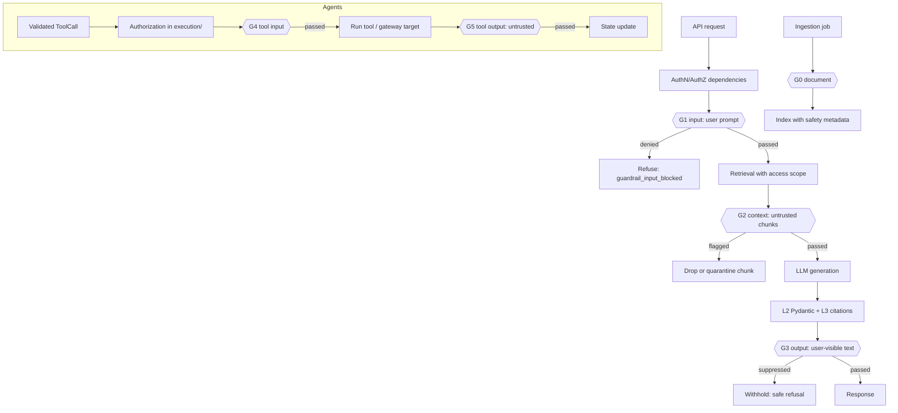

# Guardrails and Content Safety Standards

These standards cover content-safety guardrails for the unified FastAPI + RAG + Agentic AI
backend: what guardrails are for, where they are enforced (gateway policy, in-app checks,
ingestion), how checks are wired into the RAG and agent pipelines, what happens when a check
fires or can't run, and how guardrails are tested, observed and evaluated.

In generated projects, this file lives at `docs/standards/GUARDRAILS.md`. It works together with
`ASYNC_EXECUTION.md`, `PYDANTIC_STANDARDS.md` and `API_CONVENTIONS.md` in `docs/standards/`.

**Status labels:**

- 🟢 **Convention.** A proposed standard. Follow it by default.
- 🟡 **Needs approval.** An open team decision. Present the options and don't pick one silently.
- ⚪ **Illustrative.** Example code or policy showing a pattern. It is not an implemented module, and it doesn't mandate a provider, library or threshold.

**Guardrail technologies referenced here** (none is chosen yet 🟡):

- **Amazon Bedrock Guardrails enforced in AgentCore Policy.** Cedar policies attached to an AgentCore Gateway call Bedrock Guardrails safeguards on the input and output of gateway targets (AgentCore Runtime agents, Lambda-backed MCP tools). Enforcement happens outside application code.
- **Amazon Bedrock Guardrails called from the application** (the `ApplyGuardrail` API). The same managed safeguards, invoked by our code at the checkpoints we choose.
- **Guardrails AI.** A Python library of validators (regex, PII, toxicity, competitor mentions…) combined into input/output guards, running inside our process or as a separately deployed server.

---

## 0. Quick rules for code generation

| # | Rule | Status |
|---|---|---|
| 1 | Guardrails check **content risk** (harmful content, PII, prompt injection, off-topic, denied topics). They don't replace Pydantic validation, citation checks or authorization. | 🟢 |
| 2 | Every LLM-facing surface has an **input** checkpoint before the model/backend runs and an **output** checkpoint before anything reaches the user. | 🟢 |
| 3 | Untrusted text that enters the model's context (retrieved chunks from untrusted sources, web/MCP tool results) is checked too, as data, never as instructions. | 🟢 |
| 4 | Guardrail logic lives in the shared `src/guardrails/` layer. Vendor clients live in `src/providers/guardrails/`. RAG and agents **call** the layer and never embed their own checks. | 🟢 |
| 5 | Every check returns a typed `GuardrailVerdict`: `passed`, `denied`, `suppressed`, `redacted` 🟡 or `not_evaluated`. | 🟢 |
| 6 | **Fail closed.** If a check can't run (timeout, throttling, provider error), the request is refused. Fail-open needs explicit approval per surface. | 🟢 |
| 7 | An input denial stops the pipeline: no retrieval, no LLM call, no tool execution. An output suppression withholds the whole reply, never a partial one. | 🟢 |
| 8 | Denials are **not retried**. Only transport failures of the guardrail call itself get a bounded retry. | 🟢 |
| 9 | Clients and users get a stable error code and a safe message. Categories, scores and thresholds stay in logs. | 🟢 |
| 10 | Thresholds, categories and enforcement mode are configuration (`GUARDRAILS_` settings or policy), versioned and reviewed, never literals in pipeline code. | 🟢 (values 🟡) |
| 11 | New or changed guardrails run in **log-only / shadow mode** first, then switch to enforce. | 🟢 |
| 12 | Every tool and agent path has exactly one declared enforcement point (gateway or in-app). No path is left unguarded, and no path pays for the same check twice by accident. | 🟢 |
| 13 | Guardrail calls follow ASYNC_EXECUTION: sync SDKs and local ML validators are offloaded with a limiter, and timeouts go on the client. | 🟢 |
| 14 | Never log the full text that triggered a PII or safety finding. Log IDs, categories, scores and the verdict. | 🟢 |
| 15 | Guardrail effectiveness (false positives and negatives) is measured with red-team and benign datasets in `evaluation/datasets/guardrails/` (AI_EVALUATION.md §9). Unit tests use fake checkers. | 🟢 |

### Where the code goes

| Code | Location |
|---|---|
| Verdict, finding, phase and outcome models | `src/guardrails/schemas.py` |
| Orchestration: run the configured checks for a phase and decide the outcome | `src/guardrails/service.py` |
| Which checks apply to which surface and phase (the in-app policy map) | `src/guardrails/policies.py` |
| Deterministic, in-house validators (regex, allow/deny lists, length) | `src/guardrails/validators/` |
| Settings (`GUARDRAILS_` prefix) | `src/guardrails/config.py` |
| `GuardrailBlocked`, `GuardrailUnavailable` | `src/guardrails/exceptions.py` |
| Accessor for the lifespan-created guardrail service | `src/guardrails/dependencies.py` |
| Bedrock `ApplyGuardrail` client, Guardrails AI adapter, remote guardrail server client | `src/providers/guardrails/client.py` (one file per provider if it grows) |
| Calls at RAG checkpoints | `rag/generation/service.py`, `rag/ingestion.py`, `rag/retrieval/evidence_filter.py` |
| Calls at agent checkpoints | `execution/executor.py` (tool input/output), `agents/service.py` (task input, final response) |
| AgentCore Gateway Cedar policies 🟡 | Infrastructure-as-code, outside `src/`. Location and tooling need approval. This skill never generates IaC. |
| Red-team and benign datasets, effectiveness reports | `evaluation/datasets/guardrails/`, `evaluation/reports/` (synthetic only) |

---

## 1. What guardrails are, and what they aren't

Guardrails are one layer in a defence-in-depth stack. Each layer answers a different question:

| Layer | Question | Where |
|---|---|---|
| Authentication and authorization | *May this caller do this, on this resource?* | `auth/`, dependencies, `execution/` (API_CONVENTIONS §2) |
| Pydantic validation (level 2) | *Is the data well-formed?* | Schemas (PYDANTIC_STANDARDS §5) |
| Application validation (level 3) | *Do references (citations, tools, plan steps) match runtime facts?* | `rag/generation/validation.py`, `execution/` |
| **Guardrails** | ***Is this content acceptable to process or release?*** | `src/guardrails/`, gateway policy |
| Evaluation | *Is the system faithful, helpful and safe on average?* | `evaluation/` |

Rules 🟢:

- **A guardrail pass is not a correctness signal.** A safe answer can still be ungrounded or wrong. Keep all three validation levels.
- **A guardrail pass is not authorization.** A non-toxic request to read another tenant's document is still forbidden. AgentCore Policy can express both authorization and guardrail conditions in Cedar, but in-app authorization remains mandatory: the gateway only sees what passes through it.
- **Guardrails are probabilistic.** Classifier scores have false positives and false negatives. Design the UX for both: a clear refusal for blocked benign requests, and monitoring for missed harmful ones.
- **The system prompt is not a guardrail.** "Never reveal PII" in a prompt is advice to the model, not enforcement.

### Risk categories to consider per surface 🟡

Content filters (hate, insults, sexual, violence, misconduct), prompt attacks and injection,
denied topics, sensitive information (PII, credentials, account numbers), custom words and
regexes, off-topic or competitor mentions, and, for RAG answers, grounding and relevance. Which
categories apply to which surface, and at what threshold, is a product and compliance decision.

---

## 2. Enforcement points

### Options

| | **A. Gateway policy** (Bedrock Guardrails in AgentCore Policy) | **B. In-app checks** (`src/guardrails/` → Bedrock `ApplyGuardrail`, Guardrails AI, in-house validators) | **C. Ingestion-time checks** (Path B jobs) |
|---|---|---|---|
| Covers | Traffic to AgentCore Gateway targets: AgentCore Runtime agents (HTTP targets with an OpenAPI schema) and Lambda-backed MCP tools (tool schemas) | Anything our code sees: API requests, retrieved chunks, LLM outputs, in-process tools, final responses | Documents before they are indexed |
| Bypass risk | Can't be skipped by application code | Must be called on every path; enforced by convention and tests | None at query time; flags are stored with chunks |
| Granularity | Per gateway target and action, input and output phases, fields declared in the target schema | Any field, any stage, including intermediate context | Per document or chunk |
| Latency | Added to each gateway call; one guardrail check per safeguard call in the policy | Added where we call it; can run checks in parallel | Off the interactive path |
| Availability | Limited AWS Regions (at publication: us-east-1, eu-west-2, eu-north-1, ap-southeast-2, ap-northeast-1). Check current docs. | Wherever the chosen provider runs | Same as B |
| Fits this template when | Agents or tools are deployed behind AgentCore Gateway 🟡 | Always: API, RAG and in-process agents run in our ECS service | Any RAG corpus with untrusted or user-uploaded content |

### Rules 🟢

- **Layer them, don't pick one.** B is required for our FastAPI surfaces, because the API and in-process RAG don't pass through a gateway. A is added for tools and agents that sit behind AgentCore Gateway. C is added for corpora that aren't fully trusted.
- **Declare the enforcement point per tool.** Each entry in `agents/tools/tool_registry.py` declares whether its input/output guardrails are enforced by the gateway or in-app. `execution/` refuses to run a tool without a declaration, and tests assert every registered tool has one.
- **Don't double-check blindly.** If the gateway already enforces the same safeguard on a tool's input and output, don't repeat it in-app unless a stricter in-app rule is approved. Do still check what the gateway can't see (for example, the combined context before the final LLM call).
- **Never let the LLM route around a guardrail.** A tool call that the model proposes is checked like any other input, whichever enforcement point it uses.

---

## 3. Checkpoints in the pipelines



| Checkpoint | Phase | Text checked | On trigger | Status |
|---|---|---|---|---|
| **G0** document | `context` | Extracted document text during ingestion (Path B) | Store flags on chunks (`contains_pii`, `injection_suspect`); quarantine or redact per policy | 🟢 (policy 🟡) |
| **G1** request input | `input` | User prompt and any free-text request fields | Deny before retrieval or any LLM call | 🟢 |
| **G2** retrieved context | `context` | Chunks from untrusted sources not already cleared at G0 | Drop the chunk and log it; never pass it "with a warning" | 🟢 |
| **G3** answer output | `output` | The user-visible fields of the validated answer (`answer` text, not JSON syntax), after citation checks | Suppress the reply | 🟢 |
| **G4** tool input | `tool_input` | Free-text tool arguments after Pydantic validation and authorization | Return a `ToolResult` with status `denied_by_guardrail`; don't execute | 🟢 |
| **G5** tool output | `tool_output` | Tool results before they re-enter the model context, especially web, search, file and MCP tools | Replace with a safe `ToolResult` error; the agent may continue without it | 🟢 |
| **G6** final agent response | `output` | `FinalAgentResponse` user-visible text | Suppress the reply | 🟢 |

Rules 🟢:

- **Order.** Output guardrails run **after** Pydantic and application validation, on the text the user would actually see. Checking unparsed JSON wastes a call and can miss content in string fields.
- **Conversation history.** Input checks cover the new user turn. Earlier turns were already checked when they arrived; don't re-check the whole history every turn unless a check needs context (for example, multi-turn prompt attacks) 🟡.
- **Background paths are guarded too.** Batch generation, evaluation runs that publish results and long agent runs on the worker service call the same `src/guardrails/` service. A job has no user waiting, so a trigger marks the job result `blocked` rather than raising an HTTP error.

---

## 4. Verdict contract

```python
# ⚪ Illustrative content for src/guardrails/schemas.py
from enum import StrEnum

from pydantic import Field, model_validator

from src.common.schemas.base import CustomModel, UtcDatetime


class GuardrailPhase(StrEnum):
    INPUT = "input"
    CONTEXT = "context"
    TOOL_INPUT = "tool_input"
    TOOL_OUTPUT = "tool_output"
    OUTPUT = "output"


class GuardrailOutcome(StrEnum):
    PASSED = "passed"
    DENIED = "denied"                # input side: the backend/model never ran
    SUPPRESSED = "suppressed"        # output side: it ran, the reply is withheld
    REDACTED = "redacted"            # 🟡 content masked and released
    NOT_EVALUATED = "not_evaluated"  # the check couldn't run; fail mode decides


class GuardrailFinding(CustomModel):
    check: str = Field(description="Stable check ID, e.g. 'content_filter.violence', 'pii.us_ssn'")
    category: str
    score: float | None = Field(default=None, ge=0, le=1)
    threshold: float | None = Field(default=None, ge=0, le=1)
    triggered: bool


class GuardrailVerdict(CustomModel):
    phase: GuardrailPhase
    outcome: GuardrailOutcome
    enforced: bool                   # False in log-only / shadow mode
    findings: list[GuardrailFinding] = Field(default_factory=list)
    released_text: str | None = None # only for REDACTED
    policy_version: str              # which config/policy produced this verdict
    evaluated_at: UtcDatetime

    @model_validator(mode="after")
    def _redaction_consistent(self) -> "GuardrailVerdict":
        if (self.outcome is GuardrailOutcome.REDACTED) != (self.released_text is not None):
            raise ValueError("released_text is required for, and only for, redacted outcomes")
        return self
```

- `GuardrailVerdict` is an **internal** model. It is logged and attached to traces, and never returned to clients as-is.
- Findings carry scores and thresholds so decisions can be audited and thresholds tuned from logs.
- `policy_version` ties every verdict to the exact thresholds and categories in force.

### Mapping outcomes to responses 🟡 (proposal)

| Outcome | Interactive API (Path A) | Background job (Path B) | Agent tool step |
|---|---|---|---|
| `denied` | 🟡 `400` or `422` with `ErrorResponse(code="guardrail_input_blocked")` | Job result `blocked`, no retry | `ToolResult(status="denied_by_guardrail")` |
| `suppressed` | 🟡 `200` with a standard refusal body, or an error status with `code="guardrail_output_blocked"` | Job result `blocked` | Safe `ToolResult` error |
| `redacted` 🟡 | Normal response with masked text | Normal result with masked text | Masked result |
| `not_evaluated` | `503` + `Retry-After`, `code="guardrail_unavailable"` (fail closed) | Retry the job with backoff; DLQ after the limit | Tool step fails; agent stops or asks for retry |

- The client message is generic ("This request can't be processed"). It doesn't name the category or score, which would help attackers tune around the check.
- Streaming answers 🟡: either buffer the answer and release it after G3 passes (safer, slower first token), or check chunks incrementally and send a terminating SSE event that retracts the partial answer. Never stream unchecked text and "check later".

---

## 5. The in-app guardrail layer (`src/guardrails/`)

### Provider-neutral interface 🟢

```python
# ⚪ Illustrative content for src/guardrails/service.py
from typing import Protocol

from src.guardrails.config import GuardrailsSettings
from src.guardrails.exceptions import GuardrailBlocked
from src.guardrails.schemas import GuardrailFinding, GuardrailOutcome, GuardrailPhase, GuardrailVerdict

_BLOCKING = {GuardrailOutcome.DENIED, GuardrailOutcome.SUPPRESSED, GuardrailOutcome.NOT_EVALUATED}


class GuardrailChecker(Protocol):
    name: str

    async def check(self, texts: list[str], *, phase: GuardrailPhase) -> list[GuardrailFinding]:
        """Return findings. Raise GuardrailUnavailable if the check couldn't run."""


class GuardrailService:
    def __init__(self, checkers: dict[GuardrailPhase, list[GuardrailChecker]], settings: GuardrailsSettings):
        self._checkers = checkers
        self._settings = settings

    async def enforce(self, phase: GuardrailPhase, texts: list[str]) -> GuardrailVerdict:
        verdict = await self._evaluate(phase, texts)       # runs checkers concurrently, bounded
        log_verdict(verdict)                               # IDs, categories, scores; never the text
        if verdict.enforced and verdict.outcome in _BLOCKING:
            raise GuardrailBlocked(verdict)
        return verdict
```

- **One service instance**, built in the lifespan from settings and injected via `src/guardrails/dependencies.py`. Checkers are built once, with models loaded once (§8).
- **Checkers for one phase run concurrently** (task group, bounded). The verdict is the most severe outcome across checkers; one `not_evaluated` means the verdict is `not_evaluated`.
- **Pipelines call `enforce`, not individual checkers**, so enforcement mode, fail mode, logging and metrics are applied uniformly.
- `GuardrailBlocked` is a domain exception. The API maps it to `ErrorResponse` (API_CONVENTIONS §1). Workers and `execution/` catch it and record a typed result.

### Settings 🟢 (values 🟡)

```python
# ⚪ Illustrative content for src/guardrails/config.py
class GuardrailsSettings(BaseSettings):
    model_config = SettingsConfigDict(env_prefix="GUARDRAILS_", env_nested_delimiter="__", extra="ignore")

    enabled: bool = True
    mode: Literal["enforce", "log_only"] = "log_only"    # new policies start in log_only
    fail_mode: Literal["closed", "open"] = "closed"       # "open" needs approval per surface
    policy_version: str
    check_timeout_s: float = Field(gt=0)
    max_concurrent_checks: int = Field(ge=1)
    bedrock_guardrail_id: str | None = None                # when the Bedrock provider is approved
    bedrock_guardrail_version: str | None = None           # a published version, never the draft
    thresholds: dict[str, float] = Field(default_factory=dict)   # check ID → 0..1
```

- Pin a **published guardrail version** in production. A working draft can change underneath a running service.
- Startup validation (PYDANTIC_STANDARDS §4) fails if guardrails are enabled but the chosen provider isn't configured.

### Deterministic validators first 🟢

Cheap, deterministic checks (length limits, regexes for secrets and identifiers, allow/deny
lists) live in `src/guardrails/validators/` and run before model-based checks. They are fast,
free and explainable, and they cut the load on ML or managed checks.

---

## 6. Gateway enforcement with Bedrock Guardrails in AgentCore Policy 🟡

Applies when agents or tools are deployed as AgentCore Gateway targets. The policy engine
evaluates Cedar policies attached to the gateway:

1. The client signs the request (SigV4) and sends it to the gateway.
2. **Input phase.** The engine evaluates input-phase policies, calling the guardrail checks once for each safeguard call in the policy. If one fires, the request is **denied** and the target is never invoked.
3. **Output phase.** After the target replies, output-phase policies run. If one fires, the reply is **withheld**; otherwise the caller receives it.

### Policy shape ⚪

```cedar
// Input phase: deny when the prompt scores above the violence threshold.
forbid (
  principal,
  action == AgentCore::Action::"<target-name>___<tool-name>",
  resource == AgentCore::Gateway::"<GATEWAY_ARN>"
)
when guardrails {
  BedrockGuardrails::ContentFilter(["VIOLENCE"], [context.input.prompt])
    ["VIOLENCE"].confidenceScore.greaterThan(decimal("<threshold>"))
};

// Output phase: withhold replies containing a sensitive identifier.
suppressOutput (
  principal,
  action == AgentCore::Action::"<target-name>___<tool-name>",
  resource == AgentCore::Gateway::"<GATEWAY_ARN>"
)
when guardrails {
  BedrockGuardrails::SensitiveInformation(["<PII_TYPE>"], [context.output.result])
    .maxConfidenceScore().greaterThan(decimal("<threshold>"))
};
```

### Rules 🟢

- **Data paths come from the target's declared schema.** `context.input.<field>` and `context.output.<field>` resolve only if the field exists in the target's schema: an OpenAPI document for HTTP (runtime) targets, `inputSchema`/`outputSchema` for MCP tools. Action names are derived from the target and operation (for example `<target>___<tool>`, or `<target>___POST:/invocations` for a runtime's invocation endpoint).
- **Generate target schemas from our Pydantic models** (`model_json_schema()` of the tool's argument and result models, PYDANTIC_STANDARDS §8). A hand-written schema drifts, and a policy referencing a field that no longer exists can't be evaluated.
- **Schema-contract test** 🟡: fail CI if a policy references a data path that isn't in the generated schema.
- **Interpret responses by body, not by status alone.** Gateway outcomes differ by target type:

  | Outcome | HTTP (runtime) target | MCP tool target |
  |---|---|---|
  | Denied on input | `403`, "Request Denied…" | `200` with JSON-RPC error `-32002`, "Tool Execution Denied…" |
  | Suppressed on output | `403`, "Output blocked by policy…" | `403`, "Output blocked by policy…" |
  | Passed | `200` with the result | `200` with a JSON-RPC result |
  | Not evaluated | Either status, message says the policy "could not be evaluated" | Same |

  The gateway client in `src/providers/` maps these to `GuardrailVerdict` outcomes and typed `ToolResult`s. A JSON-RPC `-32002` under HTTP 200 is a **denial**, not a success. Don't retry denials, and don't feed the raw denial text back to the model; give it a short, safe status.
- **Not evaluated means fail closed.** When a policy can't be evaluated, the gateway refuses everything, benign requests included. A sudden spike of refusals for benign prompts is the signature of this state, not of a working guardrail. Alarm on it (§10).
- **Roll out in log-only mode.** Deploy new or changed policies with the log-only enforcement mode, review the recorded decisions, then switch to enforce.
- **Region check.** Guardrails in AgentCore Policy are available only in some Regions. Confirm the deployment Region supports them before relying on this layer.
- **Decisions are observable.** Enable log delivery for gateway and policy decisions to CloudWatch, and correlate them with our request IDs. Records can take a minute or two to arrive, so they are for audit and debugging, not for request-time logic.
- **Policies are infrastructure.** They are reviewed like code, versioned, and deployed with the gateway. This skill doesn't generate IaC; where policies live is 🟡.
- Treat public sample deployments of this pattern as **non-production** references. Hardening (least-privilege IAM, network controls, key management) is a separate review with security.

---

## 7. Guardrails AI validators in the application 🟡

If the team adopts Guardrails AI, it is used **only as a validator library behind a checker**
in `src/providers/guardrails/`. It is not a second structured-output pipeline and not a second
application.

```python
# ⚪ Illustrative content for src/providers/guardrails/guardrails_ai.py (library adoption is 🟡)
import anyio
from guardrails import Guard, OnFailAction
from guardrails.errors import ValidationError as GuardFailed   # verify against the pinned version
from guardrails_ai.regex_match import RegexMatch               # validator installed as its own PyPI package


class RegexGuardChecker:
    name = "guardrails_ai.regex"

    def __init__(self, pattern: str, limiter: anyio.CapacityLimiter) -> None:
        # Built once in the lifespan, never per request.
        self._guard = Guard().use(RegexMatch, regex=pattern, on_fail=OnFailAction.EXCEPTION)
        self._limiter = limiter

    async def check(self, texts: list[str], *, phase: GuardrailPhase) -> list[GuardrailFinding]:
        # Guard.validate is synchronous library code: keep it off the event loop.
        return [await anyio.to_thread.run_sync(self._check_sync, t, limiter=self._limiter) for t in texts]

    def _check_sync(self, text: str) -> GuardrailFinding:
        try:
            self._guard.validate(text)
            return GuardrailFinding(check=self.name, category="format", triggered=False)
        except GuardFailed:
            return GuardrailFinding(check=self.name, category="format", triggered=True)
```

Rules 🟢:

- **Install validators as pinned PyPI packages** (for example `guardrails-ai-regex-match`) and import them from `guardrails_ai.<validator>`. The hosted hub CLI is deprecated and hosted remote inference is being discontinued (planned cutoff 25 August 2026). Don't use `hub://` URIs, hub tokens (`guardrails configure`) or remote inference.
- **Treat validators as third-party code.** Pin versions, review licences, and scan them like any dependency. Some download ML models; record which, and where the weights come from.
- **Don't use `Guard.for_pydantic(...)` or let a guard call the LLM.** Structured output has one pipeline: `llm/structured_output.py` (PYDANTIC_STANDARDS §6). A guard that calls the model would bypass our retry budget, provider adapters and logging.
- **Use `OnFailAction.EXCEPTION` (or inspect the validation outcome) and map it to a finding.** On-fail actions that rewrite content, filter it or re-ask the model change behaviour silently. They need approval 🟡.
- **Don't run the Guardrails Flask server inside our app.** If a central guardrail server is wanted 🟡, it is deployed separately, and we call it through a client in `src/providers/guardrails/` like any external service.
- **ML validators are CPU-heavy and synchronous.** Offload them (§8), size ECS tasks for the model memory, and load models once at startup.

---

## 8. Async execution and latency

- **Bedrock `ApplyGuardrail` via a sync SDK** (`boto3`) is blocking I/O. Call it through `anyio.to_thread.run_sync` with a dedicated `CapacityLimiter`, and set connect/read timeouts and retry limits on the client config (ASYNC_EXECUTION §3, §10). An async AWS client is 🟡.
- **Local ML validators** (toxicity, PII models) are CPU-bound. Short checks may use a thread with a limiter only if the library releases the GIL (measure first). Otherwise use the options in ASYNC_EXECUTION §5. At G0 (ingestion), they run on the worker service.
- **Deterministic validators** (regex, length, lists) run inline. They are microseconds.
- **Run independent checks for one phase concurrently**, bounded by `max_concurrent_checks`. Don't run G1 and retrieval in parallel to save time unless approved 🟡: retrieval would then run for requests that are about to be denied.
- **Latency budget.** Each checkpoint adds a network or model call. Measure p50/p95 per checkpoint, keep the whole request under the ALB idle timeout, and prefer G0 at ingestion over G2 at query time for trusted-but-sensitive corpora.
- **Caching verdicts** 🟡: only for identical text and the same `policy_version`, never across tenants.

---

## 9. Failures, retries and fail modes

| Failure | Retry? | Result |
|---|---|---|
| Check fires (denied / suppressed) | **No.** Regenerating until the output passes is prompt-level jailbreaking of our own guardrail. | Block per §4 |
| Guardrail call timeout, throttling, 5xx | Yes, bounded (small count, backoff, inside the request deadline) | `not_evaluated` → fail closed after the budget |
| Misconfiguration (unknown guardrail ID, policy data path missing) | No | `not_evaluated` + alert. Fix config; don't fall back to "no guardrail". |
| Provider quota exhausted | No immediate retry | `503` + `Retry-After`; alert on the rate |

- **Fail open** (let content through when a check can't run) is only allowed for a named surface with written approval 🟡, and never for PII output, tool inputs with side effects, or unauthenticated traffic.
- **Regenerate after an output suppression** 🟡: at most once, counted against the structured-output retry budget, with a generic instruction ("answer without including personal data"), never with the flagged text or scores.
- **Don't feed finding details to the model.** Categories and scores in the prompt teach the model, and anyone reading its output, what the thresholds are.

---

## 10. Observability and privacy

Signals to collect 🟢 (tooling 🟡):

- Per checkpoint and check: evaluations, block rate, `not_evaluated` rate, latency (p50/p95/p99).
- Per enforcement point: gateway decisions (from policy decision logs) and in-app verdicts, correlated by request ID and trace.
- Shadow-mode deltas: how many requests *would* have been blocked.

Alarms 🟢:

- `not_evaluated` above a small baseline (a fail-closed outage in progress).
- Block-rate changes beyond an agreed band after a deploy or threshold change (false-positive spike or a missed-detection drop).
- Benign-prompt refusals in synthetic canary traffic.

Privacy rules 🟢:

- Log check IDs, categories, scores, thresholds, outcome, phase, `policy_version` and request ID. **Never log the triggering text**, and never log prompts or outputs in which PII was found.
- If samples are needed for tuning, store them only in an approved, access-controlled location with retention limits 🟡, and never in application logs.
- Guardrail verdicts are part of the audit trail for agent actions. Keep them with the `AgentExecutionState` history.

---

## 11. Testing and evaluation

**Unit and API tests** (`tests/guardrails/`, mirrored module tests) 🟢:

- Use a **fake `GuardrailChecker`** that returns scripted findings, or raises `GuardrailUnavailable`. No live guardrail, model or AWS calls, and no credentials.
- Override the guardrail service accessor with `app.dependency_overrides` (API_CONVENTIONS §12).
- Cover, for each surface: pass, deny on input (assert the LLM/retriever/tool fake was **never called**), suppress on output (assert nothing of the reply is returned), `not_evaluated` (assert fail closed), and log-only mode (assert it passes but logs a would-block verdict).
- Assert every registered tool declares an enforcement point (§2).
- Assert error responses carry the stable code and no category or score.

```python
# ⚪ Illustrative.
async def test_input_denial_never_calls_llm(client, fake_guardrails, fake_llm):
    fake_guardrails.script(GuardrailPhase.INPUT, triggered=["content_filter.violence"])
    resp = await client.post("/api/v1/conversations/c1/messages", json={"content": "<unsafe prompt>"})
    assert resp.json()["code"] == "guardrail_input_blocked"
    assert fake_llm.calls == 0


async def test_guardrail_outage_fails_closed(client, fake_guardrails):
    fake_guardrails.unavailable(GuardrailPhase.INPUT)
    resp = await client.post("/api/v1/conversations/c1/messages", json={"content": "hello"})
    assert resp.status_code == 503 and resp.json()["code"] == "guardrail_unavailable"
```

**Effectiveness evaluation** (`evaluation/datasets/guardrails/`, run by `evaluation/runners/`, AI_EVALUATION.md) 🟢:

- Maintain paired datasets: prompts and outputs that **should** trip each check, and benign **control** prompts that must pass (including near-misses: medical, legal and security questions that mention sensitive terms).
- Report false-positive and false-negative rates per check, per threshold and per `policy_version`. Threshold changes ship with the report.
- Include indirect prompt-injection cases in retrieved documents and tool outputs, not only direct user prompts.
- Datasets are synthetic or approved for use. Never copy production prompts containing personal data.
- Guardrails are one layer. Authorization, tool permissions and approval tests live in `tests/security/` (API_SECURITY.md §14, AGENT_SECURITY.md §8).

---

## 12. Decisions still requiring team approval 🟡

1. **Technology.** Bedrock Guardrails (via AgentCore Policy, `ApplyGuardrail`, or both), Guardrails AI validators, in-house validators, or a combination.
2. **Gateway adoption.** Whether agents or tools are deployed behind AgentCore Gateway, which targets, and where Cedar policies live in IaC.
3. **Categories and thresholds** per surface and phase, and who owns them (product, security, compliance).
4. **Response mapping.** Status codes and bodies for denied and suppressed outcomes, and the refusal wording.
5. **Redaction.** Whether masked output (`redacted`) is ever released, and for which PII types.
6. **Fail-open exceptions.** Any surface allowed to fail open.
7. **Streaming.** Buffer-then-release vs incremental checks with retraction.
8. **Regeneration** after output suppression.
9. **Ingestion policy.** Quarantine, redact or reject documents flagged at G0.
10. **History checks.** Whether multi-turn conversation context is checked.
11. **Clients.** Async AWS client, and a central guardrail server.
12. **Caching** of verdicts.
13. **Sample retention** for threshold tuning.
14. **Region.** Deployment Region, if gateway guardrails are adopted.
