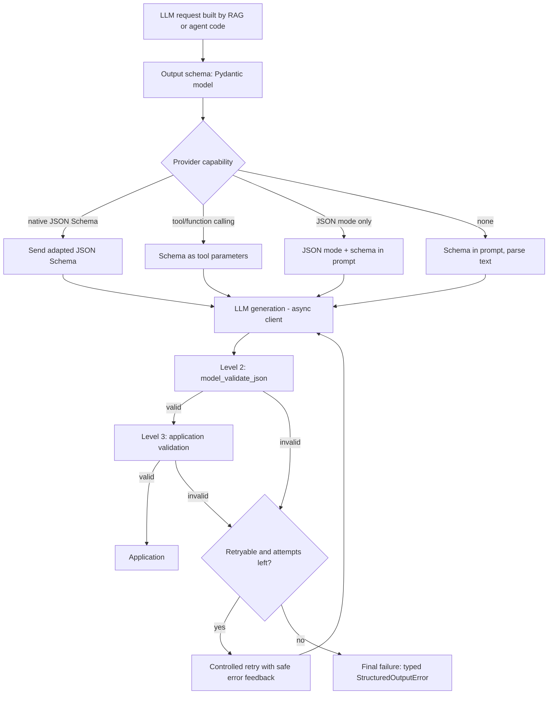
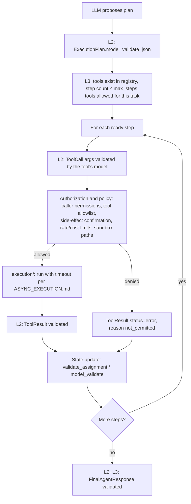

# Pydantic Standards and Structured LLM Outputs

These standards make Pydantic v2 the validation and serialization layer for the unified FastAPI +
RAG + Agentic AI backend: API schemas, configuration, structured LLM outputs and internal data
contracts.

In generated projects, this file lives at `docs/standards/PYDANTIC_STANDARDS.md`. It works together
with `docs/standards/ASYNC_EXECUTION.md` and `docs/standards/API_CONVENTIONS.md`.

**Status labels:**

- 🟢 **Convention.** A proposed standard. Follow it by default.
- 🟡 **Needs approval.** An open team decision. Present the options and don't pick one silently.
- ⚪ **Illustrative.** Example code showing a pattern. It is not an implemented module, and it doesn't mandate a provider.

**Origin tags:**

- **[FBP]** Adopted from the FastAPI best-practices guidance: use Pydantic extensively, a custom base model, decoupled settings, and knowing how `response_model` serializes.
- **[NEW]** Proposed specifically for this template's RAG and Agentic AI systems.

---

## 0. Quick rules for code generation

Read this section before writing any schema, settings class, LLM call, tool or validator.

| # | Rule | Origin | Status |
|---|---|---|---|
| 1 | Use Pydantic v2 for API request/response schemas, settings, LLM outputs and internal contracts that cross a trust boundary. | FBP | 🟢 |
| 2 | Prefer declarative constraints (`Field(ge=, le=, min_length=, max_length=, pattern=)`, `Literal`, `StrEnum`, `EmailStr`, `HttpUrl`, `AwareDatetime`) over hand-written validators. | FBP | 🟢 |
| 3 | Every model inherits from the shared `CustomModel` (`src/common/schemas/base.py`) unless it is a `BaseSettings` class. | FBP | 🟢 |
| 4 | Every timestamp field uses `UtcDatetime`. Naive datetimes are **rejected** at boundaries and never silently assumed to be UTC. | NEW | 🟢 |
| 5 | Keep API schemas, settings and LLM-output schemas as **separate models**, even when they look alike. | NEW | 🟢 |
| 6 | Each domain owns its schemas (`<domain>/schemas.py`) and settings (`<domain>/config.py`). There is no giant global settings class. | FBP | 🟢 |
| 7 | Settings are created lazily through cached getters, never at import time, and only for enabled components. Secrets are `SecretStr`. | NEW | 🟢 |
| 8 | LLM output is **never trusted**. It is validated by Pydantic, then by application-level checks, before use. | NEW | 🟢 |
| 9 | Validation retries are **bounded**. Required values are never replaced with fabricated defaults. | NEW | 🟢 |
| 10 | Citations must reference evidence that was actually retrieved for this request. Checking this is application validation, not Pydantic. | NEW | 🟢 |
| 11 | Tool-call arguments are validated **before** execution. Validation is **not** authorization. | NEW | 🟢 |
| 12 | Serialize models with `model_dump(mode="json")` / `model_dump_json()`. Keep `jsonable_encoder` for non-model structures. | NEW (deviates from FBP) | 🟢 |
| 13 | Error messages raised in validators must be safe to show to clients **and** to send back to an LLM. | FBP + NEW | 🟢 |
| 14 | Don't offload ordinary validation to threads. Profile it first (§10). | NEW | 🟢 |
| 15 | Schema tests use synthetic data and never call a live LLM or need real credentials. | NEW | 🟢 |

### Where the code goes

| File | Holds |
|---|---|
| `src/common/schemas/base.py` | `CustomModel` and shared annotated types (`UtcDatetime`, `NonEmptyStr`, …) |
| `src/common/schemas/responses.py` | Shared API response shapes: the error response and a message response |
| `src/common/schemas/pagination.py` | Page and pagination-parameter **models**. The pagination *logic* stays in `src/pagination.py`. |
| `src/<domain>/schemas.py` | That domain's API request/response schemas and internal contracts |
| `src/config.py` | Application-wide settings only |
| `src/<domain>/config.py`, `src/llm/config.py` | Domain- and component-specific settings |
| `src/llm/schemas.py` | Provider-neutral structured-output contracts: modes, capabilities, request/result envelopes, the failure-kind enum |
| `src/llm/structured_output.py` | The provider-independent structured generation → validation → bounded retry flow, schema adaptation and safe error feedback |
| `src/rag/schemas.py` | RAG API schemas and cross-stage RAG contracts (e.g. `RetrievedEvidence`) |
| `src/rag/generation/schemas.py` | LLM-output contracts for answer generation (`GeneratedAnswer`, `Citation`) |
| `src/rag/generation/validation.py` | Application-level validation of generated answers (citation existence, evidence rules) |
| `src/rag/<stage>/schemas.py` | LLM-output schemas used by only one stage (semantic metadata, classification, expansion). Created when that stage is implemented. |
| `src/agents/schemas.py` | Agent API schemas and internal contracts (`AgentTask`, `ToolResult`, `AgentExecutionState`) |
| `src/agents/structured_output.py` | LLM-produced agent contracts (`ExecutionPlan`, `ToolCall` union, `FinalAgentResponse`) and plan/tool-call application checks |
| `src/agents/tools/<tool>.py` | That tool's own argument model |
| `src/common/validation.py` | Small reusable validators shared across domains (not domain rules) |
| `src/common/serialization.py` | Serialization of non-model values (e.g. `TypeAdapter` dumps) |
| `src/evaluation/schemas.py` | Framework-neutral evaluation contracts (`EvaluationSample`, `EvaluationResult`, …), AI_EVALUATION.md §1.3 |
| `evaluation/` | Offline suites, judge output schemas and reports (outside `src/`) |
| `src/common/security/audit_schemas.py` | `AuditEvent` models for security events (API_SECURITY.md §12) |

---

## 1. Pydantic v2 conventions

**Version** 🟡: Pydantic ≥ 2.11 is proposed, because this document uses the `validate_by_name`
and `validate_by_alias` config names. On older 2.x releases, use `populate_by_name=True`.
Settings require `pydantic-settings`, and `EmailStr` requires `email-validator`. Nothing is
installed in this phase.

### Core API: which to use and when

| API | Use for | Rules |
|---|---|---|
| `BaseModel` (via `CustomModel`) | Every schema | Don't subclass `BaseModel` directly in domain code |
| `Field(...)` | Constraints, defaults, aliases, descriptions | Use `default_factory` for mutable defaults. **Write a `description` on every LLM-output field**, because it becomes part of the generation contract. |
| `ConfigDict` | Model behavior | Set it once in `CustomModel`, and override per model only with a comment explaining why |
| `field_validator` | A rule on one field that built-in constraints can't express | Use `mode="after"` (the default) for typed values, and `mode="before"` only to normalize raw input |
| `model_validator(mode="after")` | Relationships between fields | Return `self`. Raise `ValueError` with a safe message. |
| `field_serializer` / `model_serializer` | Output shape that must differ from the stored value | Only when the default serialization is wrong. Datetimes, enums, UUIDs and URLs already serialize correctly. |
| `model_validate(obj)` / `model_validate_json(data)` | Untrusted input | Prefer `model_validate_json` for raw JSON (LLM output, queue messages). It is faster and reports `json_invalid`. |
| `model_dump()` / `model_dump(mode="json")` / `model_dump_json()` | Output | `mode="python"` keeps Python types. `mode="json"` gives JSON-safe primitives. |
| `TypeAdapter(T)` | Validating or serializing non-model types (`list[Chunk]`, `dict[str, float]`, unions) | Build adapters **once at module level**, because construction is expensive |
| `model_json_schema()` | Exporting output contracts for LLMs and docs | Adapt the result per provider (§6) |

### Types and constraints

```python
# ⚪ Illustrative.
from datetime import date
from enum import StrEnum
from typing import Annotated, Literal
from uuid import UUID
from pydantic import EmailStr, Field, HttpUrl, StrictBool

class DocumentType(StrEnum):
    POLICY = "policy"
    GUIDE = "guide"
    FORM = "form"

Score = Annotated[float, Field(ge=0.0, le=1.0)]
PageSize = Annotated[int, Field(ge=1, le=100)]
Slug = Annotated[str, Field(min_length=1, max_length=64, pattern=r"^[a-z0-9]+(?:-[a-z0-9]+)*$")]

class ExampleFields(CustomModel):
    id: UUID
    kind: DocumentType                      # enum: rejects unknown values
    status: Literal["draft", "published"]   # small closed set without a named enum
    owner_email: EmailStr
    source_url: HttpUrl | None = None       # HttpUrl is NOT a str: use str(url) for clients
    effective_date: date | None = None
    relevance: Score
    archived: StrictBool = False            # rejects "yes", 1, "true"
    tags: list[Slug] = Field(default_factory=list, max_length=20)
```

**Strictness policy** 🟢: the default is lax mode. Standard coercion from JSON strings, such as
`"2025-01-01T00:00:00Z"` to a datetime, is useful. Use `Strict*` types or `Field(strict=True)`
where coercion would hide bugs: booleans, IDs and money. Model-wide `strict=True` is allowed with
a comment explaining why.

**Discriminated unions** 🟢. Use them for anything with several possible shapes, such as chat
results, final agent responses or tool calls. Each variant carries a `Literal` tag:

```python
# ⚪ Illustrative.
class AnswerResult(CustomModel):
    type: Literal["answer"]
    answer: str

class ClarificationResult(CustomModel):
    type: Literal["clarification"]
    question: str

class RefusalResult(CustomModel):
    type: Literal["refusal"]
    reason: Literal["out_of_scope", "insufficient_evidence", "policy"]

ChatResult = Annotated[AnswerResult | ClarificationResult | RefusalResult, Field(discriminator="type")]
```

A discriminator gives clear errors, one per variant, where a plain union reports every variant's
failures, and it produces a `oneOf` JSON schema with a mapping.

### Avoid redundant work 🟢

- **[FBP]** When a route returns a model and also declares `response_model`, FastAPI serializes and **validates the data again** against `response_model`, so your validators run twice. Keep validators pure, deterministic and cheap. Either return the model or declare `response_model`/the return type once, and don't manually convert to a dict first. When bypassing this is justified, and what it costs, is covered in API_CONVENTIONS §5.
- Don't convert model → dict → model between layers. Pass model instances.
- `model_construct()` **skips validation**. Use it only for data you already validated, such as rehydrating your own stored records in hot paths, and add a comment saying so.
- `model_copy(update=...)` **does not validate** the update. For state transitions, use `validate_assignment=True` or `Model.model_validate({**m.model_dump(), **changes})`.
- Don't use `assert` in validators, because it is stripped under `python -O`. Raise `ValueError`.

---

## 2. Shared base model: `src/common/schemas/base.py`

```python
# ⚪ Illustrative content for src/common/schemas/base.py
from datetime import datetime, timezone
from typing import Annotated, Any
from pydantic import AfterValidator, AwareDatetime, BaseModel, ConfigDict, Field

def _to_utc(value: datetime) -> datetime:
    return value.astimezone(timezone.utc)

UtcDatetime = Annotated[AwareDatetime, AfterValidator(_to_utc)]
"""Timezone-aware datetime normalized to UTC. Naive input is rejected with `timezone_aware`."""

NonEmptyStr = Annotated[str, Field(min_length=1)]

class CustomModel(BaseModel):
    """Shared base for all non-settings schemas."""

    model_config = ConfigDict(
        validate_by_name=True,    # accept field names ...
        validate_by_alias=True,   # ... and aliases on input
        extra="forbid",           # unknown fields are errors by default (see policy table)
    )

    def to_json_dict(self, **kwargs: Any) -> dict[str, Any]:
        """JSON-compatible dict using Pydantic's own JSON serializers."""
        return self.model_dump(mode="json", **kwargs)
```

### Policy decisions

| Topic | Policy | Status |
|---|---|---|
| **Name vs alias input** | Accept both. Aliases exist for external field names (e.g. `camelCase` API clients, provider payloads). | 🟢 |
| **Output by alias** | Snake_case field names by default. A project-wide camelCase API (`alias_generator=to_camel`, `by_alias=True`) needs approval. | 🟡 |
| **Unknown fields: API requests** | `extra="forbid"`, which catches client typos and mass-assignment attempts | 🟢 |
| **Unknown fields: API responses, internal contracts** | `extra="forbid"`, since we construct them | 🟢 |
| **Unknown fields: third-party/provider payloads** | `extra="ignore"` (tolerates upstream additions). Declare it on the model with a comment. | 🟢 |
| **Unknown fields: LLM outputs** | `extra="forbid"` is proposed, to detect schema drift and match `additionalProperties: false` in native structured-output modes. `ignore` is the alternative for prompted JSON. | 🟡 |
| **Unknown fields: settings** | `extra="ignore"`, so a shared `.env` can hold other domains' variables | 🟢 |
| **Datetime input** | Timezone-aware only (`UtcDatetime`). Naive values are rejected with a 422 or a validation error. | 🟢 |
| **Datetime normalization** | Aware values are converted to UTC on validation | 🟢 |
| **Datetime output** | ISO 8601 with offset. Pydantic already emits UTC as `2025-01-01T12:00:00Z`, so **no custom serializer** is needed. | 🟢 |
| **Naive datetimes from trusted internal sources** (DB driver, SDK) | Convert **explicitly at that boundary**, with the source's documented timezone and a comment (e.g. `dt.replace(tzinfo=timezone.utc)` only when the column is documented as UTC). Never convert implicitly in the base model. | 🟢 |
| **Creating "now"** | `datetime.now(timezone.utc)`. Never `datetime.utcnow()`, which is naive and deprecated. | 🟢 |

### `model_dump(mode="json")` vs `jsonable_encoder`

| | `model.model_dump(mode="json")` | `fastapi.encoders.jsonable_encoder(obj)` |
|---|---|---|
| Works on | Pydantic models (and, via `TypeAdapter(...).dump_python(mode="json")`, any typed value) | Arbitrary Python objects: dicts, lists, dataclasses, models, datetimes… |
| Engine | pydantic-core (Rust). Fast, and respects `field_serializer`, aliases, `exclude`, `SecretStr` masking | FastAPI's recursive Python encoder (it calls `model_dump` for models) |
| Type-driven | Yes. Serializes according to declared field types. | No. Inspects runtime values. |
| Use when | Serializing our own models: logs, queue messages, cache entries, LLM prompts | Untyped mixed structures, or legacy code. Prefer a `TypeAdapter` instead where possible. |

**[FBP] deviation:** the reference base model builds its serializable dict with
`jsonable_encoder`. This template uses `model_dump(mode="json")` because it is faster,
type-driven and the native Pydantic v2 mechanism. Routes normally return models directly, so
FastAPI handles response serialization, and neither helper is needed there.

### No base class per domain 🟢

Don't create `AuthBaseModel`, `RagBaseModel` and so on unless a domain genuinely needs a
different shared config. Reuse `CustomModel` and the shared annotated types.

---

## 3. Domain schemas: request, response, internal and persistence

Each domain owns `schemas.py`. Separate the models when their responsibilities differ:

| Kind | Naming | Purpose | Notes |
|---|---|---|---|
| Create request | `<Entity>Create` | Client input to create | Required fields only. No server-owned fields (`id`, `created_at`, `owner_id`). |
| Update request | `<Entity>Update` | Partial update (PATCH) | All fields optional. Apply with `model_dump(exclude_unset=True)`, so that "not sent" is distinguished from "sent as null". |
| Response | `<Entity>Response` | Public output | Never includes secrets or internal flags. Uses `from_attributes=True` only when built from ORM objects. |
| Internal | `<Entity>Internal` / descriptive name | Service-layer contracts, queue messages | May include internal fields. Never returned from routes. |
| Persistence | ORM model in `<domain>/models.py` | Database mapping | **Not Pydantic.** Convert at the service boundary. |
| LLM output | `<Purpose>Output` / descriptive name | Generation contract | Separate from API schemas (§5) |

```python
# ⚪ Illustrative content for src/example_domain/schemas.py
from uuid import UUID
from pydantic import ConfigDict, Field
from src.common.schemas.base import CustomModel, NonEmptyStr, UtcDatetime

class Address(CustomModel):                      # nested, reusable within the domain
    city: NonEmptyStr
    country_code: str = Field(pattern=r"^[A-Z]{2}$")

class ItemCreate(CustomModel):
    name: str = Field(min_length=1, max_length=120)
    priority: int = Field(default=3, ge=1, le=5)
    address: Address | None = None

class ItemUpdate(CustomModel):
    name: str | None = Field(default=None, min_length=1, max_length=120)
    priority: int | None = Field(default=None, ge=1, le=5)

class ItemResponse(CustomModel):
    model_config = ConfigDict(from_attributes=True)   # built from ORM rows
    id: UUID
    name: str
    priority: int
    address: Address | None
    created_at: UtcDatetime
```

**Shared response schemas** (`src/common/schemas/responses.py`, `src/common/schemas/pagination.py`):

```python
# ⚪ Illustrative.
from typing import Generic, TypeVar
T = TypeVar("T")

class ErrorDetail(CustomModel):
    loc: list[str | int] = Field(default_factory=list)
    message: str
    code: str

class ErrorResponse(CustomModel):
    code: str                      # stable, machine-readable
    message: str                   # safe for clients
    details: list[ErrorDetail] = Field(default_factory=list)

class PageParams(CustomModel):
    limit: int = Field(default=20, ge=1, le=100)
    offset: int = Field(default=0, ge=0)

class Page(CustomModel, Generic[T]):
    items: list[T]
    total: int = Field(ge=0)
    limit: int
    offset: int
```

The following are still open 🟡:

- Whether successful responses are wrapped in an envelope (the proposal is no: return the resource or a `Page[T]` directly).
- Whether FastAPI's default `{"detail": [...]}` 422 body is re-shaped into `ErrorResponse`.
- Cursor-based versus offset-based pagination.

**[FBP] Validation using dependencies.** Checks that need I/O, such as "does this resource exist"
or "does the caller own it", belong in FastAPI dependencies, not in Pydantic validators.
Validators must never do I/O. Dependency patterns (typed returns, chaining, caching, access scopes) are in
API_CONVENTIONS §1–§3.

**[FBP] `ValueError` in validators.** A `ValueError` raised in a validator becomes a
`ValidationError`, and FastAPI returns it as a 422 with your message. Messages must name the rule
("must be unique"), not internals (table names, stack details, secrets). See API_CONVENTIONS §8 for stable error types.

---

## 4. Domain-specific settings (`pydantic-settings`)

```python
# ⚪ Illustrative content for src/config.py (global) and src/llm/config.py (component)
from enum import StrEnum
from functools import lru_cache
from pydantic import BaseModel, Field, HttpUrl, SecretStr
from pydantic_settings import BaseSettings, SettingsConfigDict

class Environment(StrEnum):
    LOCAL = "local"
    TEST = "test"
    STAGING = "staging"
    PRODUCTION = "production"

class AppSettings(BaseSettings):
    model_config = SettingsConfigDict(env_prefix="APP_", env_file=".env", extra="ignore")
    environment: Environment                    # required: startup fails if missing
    debug: bool = False
    rag_enabled: bool = True                    # 🟡 feature-flag names need approval
    agents_enabled: bool = True

@lru_cache
def get_app_settings() -> AppSettings:
    return AppSettings()

class LLMTimeouts(BaseModel):                   # nested (plain BaseModel inside settings)
    connect_seconds: float = Field(default=2.0, gt=0)
    read_seconds: float = Field(default=30.0, gt=0)

class LLMSettings(BaseSettings):
    model_config = SettingsConfigDict(
        env_prefix="LLM_", env_nested_delimiter="__", env_file=".env", extra="ignore",
    )
    base_url: HttpUrl
    api_key: SecretStr                          # required; masked in repr/logs/dumps
    timeouts: LLMTimeouts = LLMTimeouts()       # LLM_TIMEOUTS__READ_SECONDS=45
    max_structured_attempts: int = Field(default=3, ge=1, le=5)

@lru_cache
def get_llm_settings() -> LLMSettings:
    return LLMSettings()
```

| Topic | Standard | Status |
|---|---|---|
| **Scope** | `src/config.py` holds only app-wide settings. Each domain or component has its own class in `<module>/config.py`. | 🟢 |
| **Prefixes** | One unique `env_prefix` per class (`APP_`, `AUTH_`, `RAG_`, `AGENTS_`, `LLM_`) | 🟢 (names 🟡) |
| **Required vs default** | Values that differ per environment, and credentials, are **required** (no default). Safe tuning values get defaults. Never default a secret. | 🟢 |
| **Validation** | Use the same constraints as schemas (`gt`, `ge`, `HttpUrl`, enums). An invalid env value fails fast. | 🟢 |
| **Nested config** | Nested `BaseModel` fields with `env_nested_delimiter="__"` | 🟢 |
| **Secrets** | `SecretStr`. Call `.get_secret_value()` only at the point of use (inside the provider client). Never log a settings object or dump it with secrets revealed. | 🟢 |
| **Secret sources in AWS** | ECS task-definition `secrets` injected from Secrets Manager or SSM Parameter Store as env vars | 🟡 |
| **`.env` files** | Local development only. `.env` is git-ignored. `.env.example` has comments and placeholder names only. | 🟢 |
| **Caching** | Use one `@lru_cache` getter per settings class. Import the **getter**, never a module-level instance. | 🟢 |
| **Import time** | Never instantiate settings at import time. A missing `LLM_API_KEY` must not break importing `src.auth`. | 🟢 |
| **Startup validation** | In the FastAPI lifespan, call the getters for **enabled** components only, so misconfiguration fails at boot instead of on the first request. Workers and Lambda handlers do the same for the components they use. | 🟢 |
| **Access in routes** | Inject with `Depends(get_llm_settings)` so tests can override it | 🟢 |

**Testing with overridden settings:**

```python
# ⚪ Illustrative.
def test_llm_settings_require_api_key(monkeypatch):
    monkeypatch.delenv("LLM_API_KEY", raising=False)
    monkeypatch.setenv("LLM_BASE_URL", "https://llm.example.test")
    with pytest.raises(ValidationError) as exc:
        LLMSettings(_env_file=None)                 # ignore any local .env
    assert {"loc": ("api_key",), "type": "missing"}.items() <= exc.value.errors()[0].items()

@pytest.fixture
def llm_settings() -> LLMSettings:
    return LLMSettings(_env_file=None, base_url="https://llm.example.test", api_key="test-key")

@pytest.fixture
def client(llm_settings):
    app.dependency_overrides[get_llm_settings] = lambda: llm_settings
    yield TestClient(app)
    app.dependency_overrides.clear()

@pytest.fixture(autouse=True)
def _clear_settings_cache():
    yield
    get_llm_settings.cache_clear()                  # env changes don't leak between tests
```

---

## 5. Three levels of LLM output validation

There are three levels. All three are needed, because each solves a different problem.

| Level | What it does | Catches | Can't catch |
|---|---|---|---|
| **1. Generation constraints** | Ask the provider to produce output conforming to a JSON Schema: native structured output, JSON mode or tool-call arguments | Malformed JSON, wrong top-level shape (when supported) | Anything the provider's schema subset can't express. Semantic errors. |
| **2. Pydantic validation** | `model_validate_json` against the output model | Missing or extra fields, wrong types, ranges, enums, patterns and cross-field relationships (`model_validator`) | Whether the values are **true**, **grounded** or **permitted** |
| **3. Application-level validation** | Code that checks results against runtime facts | Fabricated citations, unknown tools, plans that reference missing steps, unauthorized actions, business rules | Whether cited evidence actually *supports* the claim (that needs evaluation or human review) |

Never skip level 2 because level 1 is "guaranteed". Providers differ, degrade and change. Never
skip level 3 because level 2 passed.

Content safety (harmful content, PII, prompt injection) is **not** one of these levels. It is a
separate guardrail checkpoint that runs after levels 2 and 3, on the user-visible text
(GUARDRAILS.md §3).

---

## 6. Structured LLM output generation (provider-independent)



### Output mode (`src/llm/schemas.py`)

```python
# ⚪ Illustrative content for src/llm/schemas.py
class StructuredOutputMode(StrEnum):
    NATIVE_SCHEMA = "native_schema"   # provider enforces a JSON Schema
    TOOL_CALL = "tool_call"           # schema passed as tool/function parameters
    JSON_MODE = "json_mode"           # provider guarantees JSON syntax, not the schema
    PROMPTED = "prompted"             # schema described in the prompt; parse text

class StructuredOutputFailure(StrEnum):
    INVALID_JSON = "invalid_json"
    SCHEMA_INVALID = "schema_invalid"
    MISSING_FIELDS = "missing_fields"
    SEMANTIC_INVALID = "semantic_invalid"
    INVALID_CITATION = "invalid_citation"
    TRUNCATED = "truncated"
    REFUSED = "refused"
    UNSUPPORTED_SCHEMA = "unsupported_schema"
    PROVIDER_ERROR = "provider_error"

class ProviderCapabilities(CustomModel):
    modes: frozenset[StructuredOutputMode]
    supports_string_constraints: bool = False   # minLength/maxLength/pattern
    supports_numeric_constraints: bool = False  # minimum/maximum
    supports_optional_properties: bool = False  # else every property must be required (nullable)
    supports_refs: bool = False                 # $defs/$ref
    max_schema_depth: int | None = None
```

### Rules 🟢

1. **The Pydantic model is the contract.** Export it with `Model.model_json_schema()`. Field `description`s are instructions to the model, so write them for the LLM.
2. **Don't assume every provider supports the same JSON Schema features.** Providers differ on:
   - Optional properties (some require every property listed as `required`, and "optional" becomes nullable)
   - `additionalProperties`
   - String and numeric constraints
   - `oneOf`/`anyOf` and discriminators
   - `$ref`/recursion, depth and size limits
   - Formats such as `date-time`

   `llm/structured_output.py` **adapts** the exported schema to the provider's `ProviderCapabilities`. It may inline `$defs` and strip unsupported keywords, and it rejects the schema with `UNSUPPORTED_SCHEMA` when a feature can't be expressed.
3. **Constraints stripped from the generation schema are still enforced by Pydantic.** Level 2 always validates against the full model.
4. **Prefer the strongest available mode**, in this order: `NATIVE_SCHEMA`, then `TOOL_CALL`, then `JSON_MODE`, then `PROMPTED`. The mode for each provider and model is configuration 🟡, not code branching scattered across RAG and agents.
5. **In `PROMPTED`/`JSON_MODE`, parse conservatively.** Accept exactly one JSON object. Strip at most a single surrounding code fence, then call `model_validate_json`. Never `eval`, and never regex-scrape fields out of prose.
6. **Keep output schemas small and flat.** Deeply nested or huge unions increase failures and cost. Split a hard task into several structured calls rather than one giant schema.
7. **LLM-output models are separate from API models.** `GeneratedAnswer` (what the LLM returns) isn't `ChatAnswerResponse` (what the client receives). The API response is built from validated, application-checked data.
8. **Check the finish reason.** A length-truncated output is `TRUNCATED` and is not parsed as-is. A refusal is `REFUSED` and is surfaced as a refusal, not retried blindly.

### Controlled generation loop (`src/llm/structured_output.py`)

```python
# ⚪ Illustrative, and not implemented in this phase. LLMClient is a placeholder interface.
from collections.abc import Awaitable, Callable
from typing import TypeVar
from pydantic import BaseModel, ValidationError

M = TypeVar("M", bound=BaseModel)
SemanticCheck = Callable[[M], list[str]]          # returns safe problem descriptions

class StructuredOutputError(Exception):
    def __init__(self, kind: StructuredOutputFailure, attempts: int, schema: str):
        super().__init__(f"{schema}: {kind} after {attempts} attempt(s)")
        self.kind, self.attempts, self.schema = kind, attempts, schema

def classify(exc: ValidationError) -> StructuredOutputFailure:
    types = {e["type"] for e in exc.errors()}
    if "json_invalid" in types:
        return StructuredOutputFailure.INVALID_JSON
    if types == {"missing"}:
        return StructuredOutputFailure.MISSING_FIELDS
    return StructuredOutputFailure.SCHEMA_INVALID

def safe_feedback(exc: ValidationError, limit: int = 10) -> str:
    """Correction hint for the LLM: locations, messages and types only, never raw input."""
    lines = []
    for err in exc.errors(include_url=False, include_input=False, include_context=False)[:limit]:
        loc = ".".join(str(p) for p in err["loc"]) or "<root>"
        lines.append(f"- {loc}: {err['msg']} ({err['type']})")
    return "The previous output did not match the required schema:\n" + "\n".join(lines)

async def generate_structured(
    llm: "LLMClient",
    request: "StructuredOutputRequest",
    output_type: type[M],
    *,
    semantic_check: SemanticCheck | None = None,
    max_attempts: int = 3,                         # 🟡 default needs approval
) -> M:
    feedback: str | None = None
    kind = StructuredOutputFailure.SCHEMA_INVALID
    for attempt in range(1, max_attempts + 1):
        raw = await llm.generate(request, output_type, feedback=feedback)  # transport retries live in the client
        if raw.finish_reason == "length":
            kind, feedback = StructuredOutputFailure.TRUNCATED, "The output was truncated. Be more concise."
            continue
        try:
            result = output_type.model_validate_json(raw.text)
        except ValidationError as exc:
            kind, feedback = classify(exc), safe_feedback(exc)
            log_failure(kind, attempt, output_type.__name__, exc)          # no raw output by default
            continue
        problems = semantic_check(result) if semantic_check else []
        if not problems:
            return result
        kind = StructuredOutputFailure.SEMANTIC_INVALID
        feedback = "The previous output was structurally valid but violated these rules:\n" + "\n".join(
            f"- {p}" for p in problems[:10]
        )
    raise StructuredOutputError(kind, max_attempts, output_type.__name__)
```

### How it fits the async RAG pipeline

- The LLM call is async I/O. It follows `ASYNC_EXECUTION.md` (async client, client-level timeouts, cancellation-safe).
- Validation runs inline after the response arrives. It is sync, but fast for normal outputs (§10).
- **Streaming answers.** A structured object can't be validated until it is complete. For chat UX, stream the answer text as it is generated, then validate the complete `GeneratedAnswer` (or citation markers) at the end. Emit the citations event only after level-3 validation passes. Partial-JSON validation (Pydantic's experimental partial mode) is not adopted 🟡.
- Bulk structured extraction during ingestion (metadata, segmentation) runs on the background path (ECS worker or Lambda), never in an interactive request.

---

## 7. RAG structured outputs (illustrative schemas)

These are ⚪ illustrative contracts. Field names are 🟡 until a stage is implemented.

```python
# ⚪ src/rag/semantic/schemas.py (created when the stage is implemented): document metadata extraction
class ExtractedDocumentMetadata(CustomModel):
    title: str = Field(min_length=1, max_length=300, description="Document title as written in the text.")
    document_type: DocumentType = Field(description="Closest matching document category.")
    language: str = Field(pattern=r"^[a-z]{2}$", description="ISO 639-1 language code.")
    summary: str = Field(min_length=1, max_length=1200, description="Neutral summary, no new facts.")
    keywords: list[str] = Field(min_length=1, max_length=15)
    effective_date: date | None = Field(default=None, description="Only if explicitly stated; else null.")

# ⚪ src/rag/semantic/schemas.py: semantic chunk metadata (LLM-proposed sections)
class ChunkSection(CustomModel):
    heading: str = Field(min_length=1, max_length=200)
    first_block: int = Field(ge=0)
    last_block: int = Field(ge=0)

    @model_validator(mode="after")
    def _ordered(self) -> "ChunkSection":
        if self.last_block < self.first_block:
            raise ValueError("last_block must be >= first_block")
        return self

class SegmentationOutput(CustomModel):
    sections: list[ChunkSection] = Field(min_length=1, max_length=200)
    # Level 3 (application): sections cover every block exactly once, with no gaps or overlaps.

# ⚪ src/rag/router/schemas.py: query classification
class QueryClassification(CustomModel):
    label: KnowledgeArea = Field(description="Primary knowledge area for the query.")   # StrEnum 🟡
    alternatives: list[KnowledgeArea] = Field(default_factory=list, max_length=3)
    needs_clarification: bool = Field(description="True if the query is too ambiguous to answer.")

# ⚪ src/rag/preprocessing/schemas.py: query expansion
class QueryExpansion(CustomModel):
    queries: list[str] = Field(min_length=1, max_length=5, description="Alternative phrasings; same intent.")

    @field_validator("queries")
    @classmethod
    def _unique(cls, v: list[str]) -> list[str]:
        normalized = [q.strip() for q in v if q.strip()]
        if len({q.casefold() for q in normalized}) != len(normalized):
            raise ValueError("queries must be unique and non-empty")
        return normalized
```

```python
# ⚪ src/rag/schemas.py: retrieved evidence (internal, produced by retrieval, NOT by the LLM)
class RetrievedEvidence(CustomModel):
    evidence_id: str = Field(pattern=r"^E\d{1,3}$")   # short label shown to the LLM
    document_id: str
    chunk_id: str
    text: str
    score: float
    rank: int = Field(ge=1)
    retrieval_method: Literal["semantic", "lexical", "hybrid"]
```

```python
# ⚪ src/rag/generation/schemas.py: generated answer with citations (LLM output)
class SelfReportedConfidence(StrEnum):
    LOW = "low"
    MEDIUM = "medium"
    HIGH = "high"

class Citation(CustomModel):
    evidence_id: str = Field(pattern=r"^E\d{1,3}$", description="ID of a provided evidence passage, e.g. E2.")
    quote: str | None = Field(default=None, max_length=500, description="Short verbatim supporting quote.")

class GeneratedAnswer(CustomModel):
    answer: str = Field(min_length=1, max_length=8000, description="Markdown answer grounded only in evidence.")
    citations: list[Citation] = Field(default_factory=list, max_length=20)
    insufficient_evidence: bool = Field(description="True if the evidence does not answer the question.")
    self_reported_confidence: SelfReportedConfidence | None = Field(
        default=None, description="Model's own estimate. NOT a calibrated probability."
    )

    @model_validator(mode="after")
    def _citations_required(self) -> "GeneratedAnswer":
        if not self.insufficient_evidence and not self.citations:
            raise ValueError("an answer must cite at least one evidence passage")
        return self
```

**Confidence** 🟢: an LLM's self-reported confidence is **not** a calibrated probability. Use a
coarse enum rather than a float. Never show it to users as a probability, and never use it alone
for gating decisions. Calibrated confidence needs evaluation data 🟡.

**Citation validation (level 3)** 🟢, in `src/rag/generation/validation.py`:

```python
# ⚪ Illustrative.
def citation_problems(answer: GeneratedAnswer, evidence: Sequence[RetrievedEvidence]) -> list[str]:
    by_id = {e.evidence_id: e for e in evidence}
    problems = []
    for c in answer.citations:
        source = by_id.get(c.evidence_id)
        if source is None:
            problems.append(f"{c.evidence_id} is not one of the provided evidence passages")
        elif c.quote and c.quote.casefold() not in source.text.casefold():
            problems.append(f"quote attributed to {c.evidence_id} does not appear in that passage")
    return problems
```

The rules for citations:

- The LLM cites **short evidence labels** (`E1`, `E2`, …) that were assigned by retrieval. It never cites raw database IDs, which are easy to fabricate. The application maps labels back to `document_id`/`chunk_id`.
- Every cited label must exist in **this request's** retrieved evidence. Optional quotes must appear verbatim, after normalization, in the cited passage.
- Pydantic validates the **structure** of a citation. It can't establish that the evidence *supports* the claim. Faithfulness and evidence support are measured offline (AI_EVALUATION.md §4 and §8), not asserted at runtime.
- A fabricated citation is never shown to the user. The policy after retries run out is to return a controlled "couldn't produce a verified answer" result. Stripping invalid citations and keeping the answer is an option only with an explicit "unverified" flag 🟡.

**Judge outputs** (custom judges in `evaluation/`; the shared result contract is `EvaluationResult` in `src/evaluation/schemas.py`, AI_EVALUATION.md §1.3):

```python
# ⚪ Illustrative LLM-as-judge output.
class JudgeVerdict(CustomModel):
    faithfulness: int = Field(ge=1, le=5, description="Are all claims supported by the evidence?")
    relevance: int = Field(ge=1, le=5)
    unsupported_claims: list[str] = Field(default_factory=list, max_length=20)
    rationale: str = Field(max_length=1500)
```

---

## 8. Agent structured outputs (illustrative schemas)

```python
# ⚪ src/agents/tools/<tool>.py: each tool owns its argument model
class CalculatorArgs(CustomModel):
    tool: Literal["calculator"]
    expression: str = Field(min_length=1, max_length=200, pattern=r"^[0-9+\-*/(). ]+$")

class SearchArgs(CustomModel):
    tool: Literal["search"]
    query: str = Field(min_length=1, max_length=500)
    top_k: int = Field(default=5, ge=1, le=20)

class FileReadArgs(CustomModel):
    tool: Literal["file_read"]
    path: str = Field(min_length=1, max_length=500)   # shape only: sandboxing is enforced at execution
```

```python
# ⚪ src/agents/structured_output.py: LLM-produced agent contracts
ToolCall = Annotated[CalculatorArgs | SearchArgs | FileReadArgs, Field(discriminator="tool")]
# 🟡 In practice this union is assembled from tool_registry.py rather than hand-listed.

class PlanStep(CustomModel):
    step_id: str = Field(pattern=r"^s\d{1,3}$")
    description: str = Field(min_length=1, max_length=500)
    tool_call: ToolCall | None = None
    depends_on: list[str] = Field(default_factory=list, max_length=10)

class ExecutionPlan(CustomModel):
    goal: str = Field(min_length=1, max_length=1000)
    steps: list[PlanStep] = Field(min_length=1, max_length=20)

    @model_validator(mode="after")
    def _valid_dependencies(self) -> "ExecutionPlan":
        seen: set[str] = set()
        for step in self.steps:
            if step.step_id in seen:
                raise ValueError(f"duplicate step_id {step.step_id}")
            unknown = [d for d in step.depends_on if d not in seen]
            if unknown:
                raise ValueError(f"step {step.step_id} depends on unknown or later steps {unknown}")
            seen.add(step.step_id)                   # earlier-only dependencies => acyclic
        return self

class CompletedResponse(CustomModel):
    type: Literal["completed"]
    answer: str = Field(min_length=1)
    used_steps: list[str] = Field(default_factory=list)

class NeedsInputResponse(CustomModel):
    type: Literal["needs_input"]
    question: str = Field(min_length=1)

class FailedResponse(CustomModel):
    type: Literal["failed"]
    reason: Literal["tool_error", "step_limit", "not_permitted", "cannot_complete"]

FinalAgentResponse = Annotated[
    CompletedResponse | NeedsInputResponse | FailedResponse, Field(discriminator="type")
]
```

```python
# ⚪ src/agents/schemas.py: API and internal contracts (not produced by the LLM)
class AgentTask(CustomModel):                       # API request
    goal: str = Field(min_length=1, max_length=2000)
    max_steps: int = Field(default=10, ge=1, le=50)

class ToolResult(CustomModel):                      # produced by tool execution
    step_id: str
    status: Literal["success", "error"]
    output: JsonValue | None = None
    error: str | None = Field(default=None, max_length=1000)
    duration_ms: int = Field(ge=0)

    @model_validator(mode="after")
    def _error_iff_failed(self) -> "ToolResult":
        if (self.status == "error") != (self.error is not None):
            raise ValueError("error must be set if and only if status is 'error'")
        return self

class AgentExecutionState(CustomModel):
    model_config = ConfigDict(validate_assignment=True)   # state updates are re-validated
    task_id: UUID
    status: Literal["planning", "running", "waiting_input", "completed", "failed"]
    plan: ExecutionPlan | None = None
    results: dict[str, ToolResult] = Field(default_factory=dict)
    step_count: int = Field(default=0, ge=0)
    updated_at: UtcDatetime
```

### Validation boundaries 🟢



- **Planning boundary.** A validated plan is still only a proposal. Check it against the registry and the task's limits before running anything.
- **Tool-execution boundary.** Arguments are validated **before** any external action. **Validation isn't authorization.** A perfectly valid `FileReadArgs(path="../../etc/passwd")` must still be rejected by path sandboxing at execution time. Permission checks, allowlists, human confirmation for destructive actions and rate limits live in `execution/` and the tool, not in Pydantic.
- **Tool output boundary.** Tool output is untrusted input too, especially from web or search tools. Validate its shape, and treat its content as data, never as instructions. Guardrail checkpoints G4 (tool input) and G5 (tool output) sit at these boundaries (GUARDRAILS.md §3).
- **State boundary.** State changes go through validated models (`validate_assignment=True`, or re-validation). Never `model_copy(update=...)` or `model_construct` on untrusted data.

---

## 9. Validation failures and retries

| Failure | How it is detected | Retry? | Handling |
|---|---|---|---|
| **Invalid JSON** | `ValidationError` of type `json_invalid` from `model_validate_json` | Yes (within budget) | Safe feedback asking for one valid JSON object |
| **Schema validation failure** | Other `ValidationError` types | Yes (within budget) | Safe feedback listing loc, msg and type |
| **Missing required fields** | All errors are `missing` | Yes (within budget) | Feedback naming the fields. **Never fill them with invented defaults.** |
| **Unsupported structured-output schema** | Provider rejects the schema (4xx), or the adapter can't express it | **No** | Configuration or programming error. Fix the schema or the mode. Alert. |
| **Semantically invalid output** | Level-3 check returns problems (e.g. a plan references unknown tools, sections overlap) | Yes, limited (1–2) | Rule-level feedback, then a typed failure |
| **Invalid or fabricated citation** | `citation_problems()` returns problems | Yes, once, with the list of valid evidence IDs | Final failure means a controlled "no verified answer". Never display the fabricated citation. |
| **Truncated output** | Finish reason = length | Once, with a conciseness hint or a larger token budget 🟡 | Don't parse partial JSON |
| **Refusal** | Provider refusal signal / refusal field | No | Surface it as a refusal result |
| **Provider timeout / network / 5xx / 429** | Transport exceptions and status codes | Yes, in the **client** layer: exponential backoff with jitter, honoring `Retry-After` | Has a separate budget from validation retries |
| **Auth / quota / bad request (401, 403, 400)** | Status codes | No | Fail fast and alert |

### Rules 🟢

- **Budgets are bounded.** Validation attempts per call: 3 by default (🟡). Transport retries are bounded separately in the client. Everything sits inside the overall request or job deadline (`ASYNC_EXECUTION.md` §10). Never retry indefinitely.
- **Final failures are typed.** Raise `StructuredOutputError(kind, attempts, schema)`. Routes map it to a controlled response. Workers mark the job failed and don't retry forever, so the message goes to the DLQ.
- **No fabricated defaults.** Defaults are allowed only where "absent" is a legitimate answer declared in the schema (e.g. `effective_date: date | None = None`). Never patch a missing required field in code.
- **Logging.** Log the failure kind, attempt, schema name, model identifier, error `loc`/`type` and request ID. Don't log raw LLM output, prompts or retrieved content by default, because they may contain personal or confidential data. A redacted-sample policy needs approval 🟡.
- **Error propagation.** Clients see a stable `ErrorResponse` code (e.g. `llm_output_invalid`), never raw validation dumps, prompts or model output.

### Handling `ValidationError`

```python
# ⚪ Illustrative.
from pydantic import ValidationError

try:
    plan = ExecutionPlan.model_validate_json(raw_text)
except ValidationError as exc:
    for err in exc.errors(include_url=False, include_input=False):
        logger.warning("plan_validation_failed", extra={"loc": err["loc"], "type": err["type"]})
    feedback = safe_feedback(exc)       # safe to send back to the LLM
```

### Safe correction feedback 🟢

Correction prompts sent back to an LLM:

- **Include only** error locations, Pydantic messages, error types, allowed enum values and valid evidence IDs.
- **Exclude** raw input values (`include_input=False`), system prompts, secrets or settings values, stack traces, internal IDs, other users' or tenants' data, and retrieved content beyond what the request already contained.
- Custom validator messages are written to be safe for this channel: they describe the rule, never internal state.

---

## 10. Async compatibility

- Pydantic validation is **synchronous CPU work** (pydantic-core, written in Rust). It follows `ASYNC_EXECUTION.md`.
- **Normal API schemas and LLM outputs:** validate inline. They take microseconds to low milliseconds. Don't wrap them in `run_in_threadpool`.
- **Large workloads**, such as validating thousands of chunk records, multi-MB payloads or huge `TypeAdapter(list[...])` batches:
  1. **Profile first.** Measure the time per call on the event loop.
  2. If validation holds the loop for a meaningful time (roughly > 10–20 ms on a hot path 🟡), move that work to the **background path** (worker or Lambda), where most bulk validation belongs anyway.
  3. Thread offload keeps the loop responsive, but gives **no parallelism**, because validation builds Python objects while holding the GIL. Use it only as a stopgap.
- Use `model_validate_json(bytes)` directly on raw payloads rather than `json.loads` followed by `model_validate`. It is one pass, and faster.
- Build `TypeAdapter`s and JSON-schema exports **once** at import or startup, not per request.
- Don't do I/O inside validators, sync or async. I/O-based checks belong in dependencies or services.

---

## 11. Testing conventions

- Schema tests are **pure unit tests**: synthetic data, no network, no LLM, no real credentials, and `_env_file=None` for settings.
- They live in `tests/<mirrored module>/test_schemas.py` and similar files. Shared synthetic fixtures (evidence sets, raw LLM outputs) go in `tests/fixtures/`.
- Structured-output **flow** tests use a fake LLM client that returns scripted strings: invalid JSON first, then valid.
- Each test asserts on error `type` and `loc`, not on message text, which can change between Pydantic versions.
- Structured-output and citation **quality** (schema-failure rates, invalid and unsupported citation rates) is measured on datasets in `evaluation/` (AI_EVALUATION.md §7–§8). Tests here check behavior on fixed inputs.

```python
# ⚪ Illustrative tests.
import pytest
from datetime import datetime, timezone
from pydantic import ValidationError

# Valid and invalid request payloads, field constraints
@pytest.mark.parametrize("payload, loc, err_type", [
    ({"name": "", "priority": 3}, ("name",), "string_too_short"),
    ({"name": "ok", "priority": 9}, ("priority",), "less_than_equal"),
    ({"name": "ok", "unknown": 1}, ("unknown",), "extra_forbidden"),
])
def test_item_create_rejects_invalid(payload, loc, err_type):
    with pytest.raises(ValidationError) as exc:
        ItemCreate.model_validate(payload)
    assert (loc, err_type) in {(e["loc"], e["type"]) for e in exc.value.errors()}

# Nested models
def test_nested_address_validated():
    with pytest.raises(ValidationError) as exc:
        ItemCreate.model_validate({"name": "ok", "address": {"city": "X", "country_code": "usa"}})
    assert exc.value.errors()[0]["loc"] == ("address", "country_code")

# Timezone handling and serialization
def test_naive_datetime_rejected():
    with pytest.raises(ValidationError) as exc:
        ItemResponse.model_validate({**ITEM, "created_at": "2025-01-01T12:00:00"})
    assert exc.value.errors()[0]["type"] == "timezone_aware"

def test_datetime_normalized_to_utc_and_serialized_iso():
    item = ItemResponse.model_validate({**ITEM, "created_at": "2025-01-01T14:00:00+02:00"})
    assert item.created_at == datetime(2025, 1, 1, 12, tzinfo=timezone.utc)
    assert item.to_json_dict()["created_at"] == "2025-01-01T12:00:00Z"

# Guard: every datetime field in the codebase uses UtcDatetime (catches plain `datetime`)
def test_no_plain_datetime_fields(all_models):
    for model in all_models:
        for name, field in model.model_fields.items():
            assert field.annotation is not datetime, f"{model.__name__}.{name} must use UtcDatetime"

# Structured LLM outputs: malformed and missing fields
def test_generated_answer_invalid_json():
    with pytest.raises(ValidationError) as exc:
        GeneratedAnswer.model_validate_json('{"answer": "x", ')
    assert exc.value.errors()[0]["type"] == "json_invalid"

def test_answer_without_citations_rejected():
    with pytest.raises(ValidationError):
        GeneratedAnswer.model_validate({"answer": "x", "insufficient_evidence": False, "citations": []})

# Invalid citation references (level 3)
def test_fabricated_citation_detected(evidence_e1_e2):
    answer = GeneratedAnswer.model_validate(
        {"answer": "x", "insufficient_evidence": False, "citations": [{"evidence_id": "E7"}]}
    )
    assert citation_problems(answer, evidence_e1_e2) == ["E7 is not one of the provided evidence passages"]

# Invalid agent tool arguments
@pytest.mark.parametrize("args", [
    {"tool": "calculator", "expression": "__import__('os')"},
    {"tool": "search", "query": "q", "top_k": 500},
    {"tool": "delete_everything"},
])
def test_invalid_tool_args_rejected(args):
    with pytest.raises(ValidationError):
        TypeAdapter(ToolCall).validate_python(args)

def test_plan_with_forward_dependency_rejected():
    with pytest.raises(ValidationError):
        ExecutionPlan.model_validate({"goal": "g", "steps": [
            {"step_id": "s1", "description": "a", "depends_on": ["s2"]},
            {"step_id": "s2", "description": "b"},
        ]})

# Retry flow with a fake LLM (no live calls)
async def test_structured_retry_then_success(fake_llm):
    fake_llm.script(['{"answer": ', VALID_ANSWER_JSON])
    result = await generate_structured(fake_llm, REQUEST, GeneratedAnswer, max_attempts=2)
    assert fake_llm.calls == 2 and "json_invalid" in fake_llm.last_feedback
```

Schema-contract tests 🟡: snapshot `model_json_schema()` for each LLM-output model, and assert it
is expressible under every configured provider's `ProviderCapabilities`, so that a schema change
that would break generation fails in CI.

---

## 12. Decisions still requiring team approval 🟡

1. **Versions.** The minimum Pydantic version (≥ 2.11 proposed), plus the `pydantic-settings` and `email-validator` dependencies.
2. **API aliases.** The field-naming convention (snake_case, or camelCase via `alias_generator`) and `by_alias` output.
3. **Unknown LLM fields.** `extra` policy for LLM-output models: `forbid` vs `ignore`.
4. **Responses.** Whether to use a success-response envelope, how to shape 422 errors, and the `ErrorResponse` code catalogue.
5. **Pagination.** Offset vs cursor.
6. **Settings conventions.** Settings prefixes, feature-flag names, and the secret source (Secrets Manager vs SSM).
7. **Structured-output setup.** The mode for each provider and model, the `ProviderCapabilities` values, and the schema adaptation rules.
8. **Retry budgets.** Validation retry budget, truncation handling and semantic-retry limits.
9. **Citations and confidence.** The citation-failure policy (hard fail vs "unverified" flag), and whether and how confidence is displayed.
10. **Logging.** Policy for logging and redacting LLM outputs.
11. **Streaming validation.** Whether partial-JSON streaming validation is adopted.
12. **Tool registry.** How the `ToolCall` union is built from the registry.
13. **Offload threshold.** The profiling threshold for moving validation off the event loop.
14. **Schema-contract testing** in CI.
