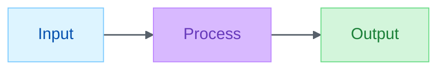

# Markdown & Mermaid

Author Mermaid that renders cleanly on first attempt and doesn't drift from the project's visual identity. LLMs generate correct Mermaid syntax natively; this skill adds the two things they don't have:

1. **The project's palette + linkStyle + classDef vocabulary** (from `.github/config/brand-palette.json`, shared with the illustrator plugin's svg-banner + illustrator agent + flint-chart)
2. **Renderer-specific pitfalls** (colons breaking timeline/gitGraph/gantt parsers, unicode escapes, reserved-word handling; the footguns native gen trips on)

Unified 2026-07-30: palette values moved from the retired `mermaid-init.json` into the shared `brand-palette.json`. One file, all visual layers.

## Init directive (always required)

Every diagram starts with an init directive derived from `.github/config/brand-palette.json`. Values come from the `semantic` section (classDef fills/strokes/text), the `brand.muted` value (edge / link color), and the `typography.linkStroke` / `linkStrokeWidth` values. Default (Alex ACT 6-role semantic palette):

````markdown

````

**Three components, one source**:

- `%%{init: ...}%%` themeVariables derived from `brand-palette.json` (edgeLabelBackground = white constant; other theme colors track the palette)
- `classDef <name> fill:... color:... stroke:...` for each entry in `semantic` (blue / green / purple / gold / red / neutral)
- `linkStyle default <spec>` from `typography.linkStroke` + `linkStrokeWidth`

To override the palette for a project, edit `.github/config/brand-palette.json` (rebrands mermaid + the illustrator plugin's svg-banner + illustrator + flint at once). To use a different palette for one diagram, override the init directive inline (rare; usually you want fleet-wide consistency).

## Semantic classDef vocabulary

Apply `:::<class>` to every node. Semantic roles ship with the default config:

| Class        | Role                              | Example                 |
| ------------ | --------------------------------- | ----------------------- |
| `:::blue`    | Input, source, start              | `A[Audio file]:::blue`  |
| `:::green`   | Output, result, success           | `C[Transcript]:::green` |
| `:::purple`  | Processing, model, transformation | `B[WhisperX]:::purple`  |
| `:::gold`    | Decision, condition, gate         | `D{Valid?}:::gold`      |
| `:::red`     | Error, warning, failure           | `E[Retry]:::red`        |
| `:::neutral` | Context, optional, out-of-scope   | `F[Cache]:::neutral`    |

Consistency across the fleet matters more than clever per-diagram creativity — a reader who has seen one Alex-brand diagram should recognize the second immediately.

## Mode fragility (renderer footguns)

Several Mermaid modes fail silently on colons and special characters. Default to `flowchart` for arbitrary text.

| Mode              | Status  | Constraint                               |
| ----------------- | ------- | ---------------------------------------- |
| `flowchart`       | Safe    | None — handles any content               |
| `sequenceDiagram` | Safe    | Standard message format                  |
| `classDiagram`    | Safe    | Standard notation                        |
| `erDiagram`       | Safe    | Standard notation                        |
| `stateDiagram`    | Caution | Colons in state names break parsing      |
| `journey`         | Caution | Score format is sensitive                |
| `timeline`        | Fragile | Colons in events (`:` is separator)      |
| `gitGraph`        | Fragile | Long chains with quoted colon-tags break |
| `gantt`           | Fragile | `dateFormat HH:mm` mis-parses task lines |

**Rule**: If your labels contain colons, times (`HH:MM`), or complex text — use `flowchart` with subgraphs.

**Debug silent failure**: check browser console; simplify content; test incrementally; try `flowchart` — if it works there, the mode was the problem.

Full pitfall catalog (P1–P9, unicode/emoji failures, layout patterns, classDiagram + architecture-beta gotchas, reserved-word handling, cross-diagram compatibility matrix) in [`references/pitfalls.md`](references/pitfalls.md) — 844 lines of renderer-specific gotchas that LLM native generation reliably trips on.

## Multi-line labels

Use `<br/>` for line breaks, **NOT** `\n`. `\n` renders as literal text. This is the single most common defect in LLM-generated Mermaid.

```mermaid
%% Correct
A[Line one<br/>Line two]:::blue

%% Wrong — renders "Line one\nLine two" as one string
A[Line one\nLine two]:::blue
```

## Size the graph and its frame together

Author the source so the diagram has a readable natural shape before relying on a renderer:

- Prefer `TD` for sequential flows with several steps or multi-line labels.
- Split diagrams wider than 4:1 unless horizontal comparison is the point.
- Keep labels short enough that a node communicates one idea.
- Do not combine `width: 100%` with a fixed or capped SVG height. That creates a page-wide viewport with a small graph centered inside it.

The Alex docs-shell applies one deterministic fit after Mermaid renders:

1. Crop once to the root graph bounds plus 16–32px of padding.
2. Derive the ideal SVG width from the cropped viewBox and source font size, targeting 16px labels.
3. Shrink-wrap compact diagrams instead of stretching every SVG to page width.
4. Use contained horizontal scrolling only when the graph cannot preserve a 13px desktop or 11px mobile label floor inside the available width.

Runtime fitting removes wasted viewport space; it does not repair an over-dense source diagram. Refactor the Mermaid source first when the graph still needs scrolling or extreme height after fitting.

## Diagram-tool selection

| Showing                          | Best tool                               | Why                                  |
| -------------------------------- | --------------------------------------- | ------------------------------------ |
| Process, workflow, decision tree | Mermaid flowchart                       | Native GitHub, wide renderer support |
| System architecture (technical)  | Mermaid flowchart + subgraphs           | Same                                 |
| System architecture (executive)  | D2 (external)                           | Cleaner, less busy                   |
| Sequence / API interactions      | Mermaid sequenceDiagram                 | Native                               |
| Class relationships              | Mermaid classDiagram                    | Native                               |
| Timeline / roadmap               | Mermaid gantt (but see fragility above) | Native but fragile                   |
| Free-form / whiteboard           | Excalidraw (external)                   | LLM cannot generate; user draws      |
| Data / metrics                   | flint-chart plugin                      | Real chart rendering, not diagram    |
| Brand / hero banner              | `Alex_ACT_Illustrator_Plugin` svg-banner | Not a diagram; different domain      |

For Mermaid alternatives (D2, PlantUML, Graphviz, WaveDrom) with syntax examples and VS Code extension setup, see [`references/tool-ecosystem.md`](references/tool-ecosystem.md).

## VS Code 1.109+ native chat rendering

The `renderMermaidDiagram` chat tool (deferred; `tool_search` for "mermaid" to load) renders diagrams interactively in Copilot Chat — pan, zoom, fullscreen, copy source. Use it for iterative design in chat; use fenced code blocks for docs that live in `.md` files.

## References

Bulk content lives in `references/` — loaded on demand:

- [`references/pitfalls.md`](references/pitfalls.md) — parser pitfalls P1–P9, unicode/emoji, reserved words, cross-diagram compatibility
- [`references/tool-ecosystem.md`](references/tool-ecosystem.md) — Mermaid / D2 / PlantUML / Excalidraw comparison + VS Code setup
- [`references/diagram-reference.md`](references/diagram-reference.md) — diagram types, node shapes, edge styles, per-diagram theming
- [`references/markdown-best-practices.md`](references/markdown-best-practices.md) — document structure, figure/table conventions, Shields.io

## Related

- [`lint-clean-markdown`](../lint-clean-markdown/SKILL.md) — writing markdown that passes `markdownlint` on the first attempt. Reach for it when the concern is lint compliance rather than diagram rendering.

## Falsifiability

Revisit by **2026-10-30** (90 days) or sooner if any of the following fires:

- Diagrams authored per this skill fail to render in GitHub or VS Code preview ≥3 times in a quarter (skill guidance out of date)
- The mode-fragility warnings stop applying because Mermaid.js fixed the underlying parser bugs (check mermaid.js changelog)
- A heir configures a brand override in `.github/config/brand-palette.json` and reports the config schema is too tight (missing a field they need) ≥2 times in a quarter
- The default palette + built-in fallback (if we add one to a future renderer helper) drift out of sync
- The trim itself was wrong: diagrams start rendering without the palette because the skill body was doing more work than it looked (the always-loaded palette section carried the discipline; the config-pointer doesn't)
