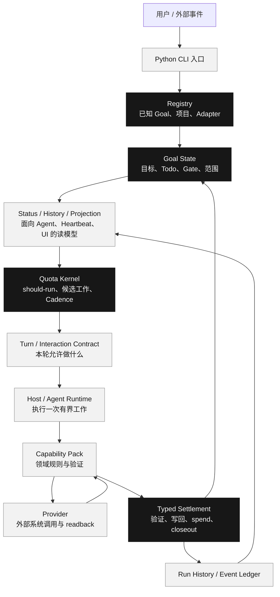
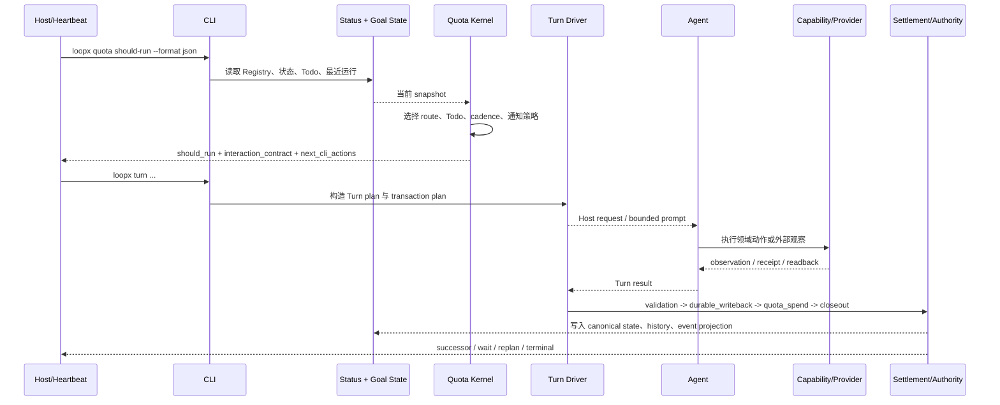
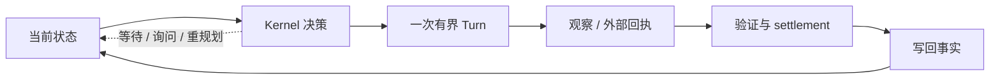

# LoopX 项目代码导读：从一次目标到下一轮执行

> 面向第一次阅读 LoopX 的开发者。本文基于当前仓库源码编写，重点解释项目的主干架构、一次目标执行的完整链路，以及每个关键概念在代码中的落点。

## 一句话概括

LoopX 是一个运行在 Codex、Claude Code、Cursor 等 Agent harness 之上的**长程任务控制面**：它把目标、Todo、权限、配额、证据、调度和恢复状态保存到模型上下文之外，再把当前状态编译成一次有界的 Agent Turn。

你可以把它理解成“面向长程 Agent 的可执行看板”：

- **看板上的卡片**是 Todo、Gate、Monitor 和 Handoff；
- **卡片能否移动**由类型化状态转换、权限和回执决定；
- **Agent**负责完成一次具体工作；
- **LoopX Kernel**负责决定下一步是否合法、是否需要等待、是否需要询问人，以及如何从中断中恢复。

本文讲的是“项目怎样工作”，不是逐个枚举所有 CLI 命令。仓库的命令面很大，第一次阅读应先抓住主干，再按需要深入能力包和扩展。

## 业务背景：为什么需要一个控制面

一次性任务可以把目标、上下文和结果都放在一个对话里。长程任务却会跨越多个 session、多个 Agent、多个外部系统和多天时间，期间还会发生：

- 目标或验收标准变化；
- CI、PR、外部实验或数据源状态变化；
- Agent 交接、租约到期和主机重启；
- 一次外部写入成功但本地还没有确认；
- 没有真正进展，却被定时器反复唤醒并继续消耗额度。

LoopX 因此把“下一步能不能做”从模型的临时记忆中抽出来，形成可读、可校验、可恢复的状态。核心闭环是：

```text
目标 / Issue / 项目
        │
        ▼
持久状态：Goal + Todo + Authority + Evidence + Quota + Cadence
        │
        ▼
quota should-run：本轮是否运行、运行什么、是否通知、是否花费配额
        │
        ▼
Turn packet：给 Agent/Host 的一次有界执行合同
        │
        ▼
外部观察或动作 + 验证 + 回执
        │
        ▼
写回 canonical state，生成下一张“可执行卡片”
```

关键点是：LoopX 不要求同一个模型上下文永远在线。它要求每次中断后都能根据已经提交的事实重新计算 frontier（当前可推进的边界）。

## 项目全景图



这张图有一个阅读方法：箭头向下表示“本轮执行”，回到左上表示“状态写回后重新计算”。不要把 `Status`、`History` 或 Dashboard 当成第二套事实源；它们是从持久状态和运行记录派生出来的 projection（投影读模型）。

> 📦 **额外知识：Projection 是什么？**
>
> Projection 可以理解成“为了某个读者整理出的快照”。它可以为了 CLI、Dashboard 或 Agent prompt 压缩字段、排序和聚合，但不能反过来成为唯一事实源。看到一个字段时，继续追问它来自哪个 canonical state、event 或外部 readback。

## 技术栈速览

| 维度 | 选型 | 大白话解释 |
| --- | --- | --- |
| 主要语言 | Python 3.11+ | 负责 CLI、文件状态、能力包组合和 Host 适配。 |
| 控制面核心 | Python + TypeScript | Python 适合应用编排；TypeScript 保存更严格的协议、状态转换和 settlement 逻辑。 |
| CLI | `argparse` + `loopx` console script | 用户、Heartbeat 和自动化都通过同一个命令入口读写控制面。 |
| 状态存储 | 项目 Registry、Goal State、Run History，以及可插拔 Authority Store | 默认本地优先；外部存储必须遵守相同的 authority contract。 |
| 运行时 | Codex、Claude Code、Cursor、DSH 等 Host | Host 执行 Agent 的一次工作，LoopX 负责它前后的约束和回执。 |
| 进程通信 | JSON payload、Unix/本地 runtime、TypeScript effect runtime | 用显式 schema 传递请求、观察结果和错误。 |
| 扩展机制 | Capability Registry + Extensions/Providers | Capability 描述调用者结果，Provider 执行具体外部操作。 |
| 验证 | pytest、TypeScript contract tests、architecture tests、canary | 既验证函数，也验证跨模块边界和真实运行路径。 |

## 目录地图：先看哪些地方

```text
loopx/
├── entrypoint.py              # 最外层 console 入口，处理版本和少数 native follow-up
├── cli.py                     # 注册全部命令并按命令分派 handler
├── cli_runtime.py             # 全局参数、Registry 解析、公共命令分派
├── bootstrap.py               # 将项目接入 LoopX，创建/更新 Goal State 与 Registry
├── control_plane/
│   ├── goals/                 # Goal 生命周期、目标边界、接受与暂停
│   ├── todos/                 # Todo 语义、解析、投影和写回
│   ├── quota/                 # should-run、候选工作、spend、settlement
│   ├── scheduler/             # heartbeat、monitor cadence、调度状态
│   ├── turn_driver/           # Turn plan、Host 执行、结果验证与恢复
│   ├── coordination/          # Authority Store、claim、lease、handoff
│   ├── runtime/               # event ledger、run history、状态投影
│   └── effect_program.ts      # effect interpreter 与 typed settlement 原语
├── capabilities/              # provider-neutral 的产品能力包
├── extensions/                # 可选 Provider 的安装与生命周期
└── presentation/              # Markdown、Dashboard 和面向用户的投影
```

### 核心模块按重要性排序

| 模块 | 一句话职责 | 生活类比 | 优先级 |
| --- | --- | --- | --- |
| `control_plane/goals` | 管理一个 Goal 的目标、生命周期和接受边界 | 项目章程与总负责人 | ⭐⭐⭐ 必看 |
| `control_plane/todos` | 把任务拆成可认领、可等待、可完成的工作项 | 看板上的卡片 | ⭐⭐⭐ 必看 |
| `control_plane/quota` | 决定本轮是否运行、选哪个工作、如何结算额度 | 值班调度员 | ⭐⭐⭐ 必看 |
| `control_plane/turn_driver` | 将一次决策变成 Host 请求，并验证结果 | 现场执行单与验收单 | ⭐⭐⭐ 必看 |
| `control_plane/coordination` | 处理 claim、lease、authority 和多 Agent 竞争 | 工位/锁/签字台 | ⭐⭐ 建议看 |
| `control_plane/scheduler` | 管理 heartbeat、monitor 和下次唤醒时间 | 日历与提醒器 | ⭐⭐ 建议看 |
| `control_plane/runtime` | 维护运行历史、事件分类和 compact projection | 项目日志与仪表盘数据源 | ⭐⭐ 建议看 |
| `capabilities/` | 把 Issue Fix、Explore、Periodic Report 等领域接入 Kernel | 专业工种 | ⭐⭐ 按场景看 |
| `extensions/` | 安装、启用、停用可选 Provider | 插件市场与驱动 | ⭐ 用到再看 |
| `presentation/` | 将状态渲染为 Markdown、Dashboard 或其他界面 | 报表和看板视图 | ⭐ 用到再看 |

## 四种运行责任：不要把边界读混

LoopX 的目录分类和运行责任不是同一个维度。阅读一条调用链时，先问“谁拥有哪一类事实”：

| 角色 | 负责什么 | 明确不负责什么 |
| --- | --- | --- |
| **Agent** | 规划、分析、工具调用和一次有界执行 | 不拥有 Goal 生命周期，也不能自行扩大权限或写入未授权状态。 |
| **Provider** | 调用外部系统，返回 observation、effect result 和 readback | 不决定通用 Todo 生命周期，也不直接改 Kernel 状态。 |
| **Capability** | 领域规则、Provider 输出归一化、验证和 typed transition proposal | 不拥有 claim、quota、scheduler 或 durable write。 |
| **LoopX Kernel** | Goal、Todo、claim、gate、monitor、quota、写回、恢复和调度 | 不替领域做推理，也不实现具体外部 Provider。 |

两条方向相反的路径可以这样记：

```text
执行路径：Agent -> Capability -> Provider -> 外部系统
控制路径：Provider readback -> Capability proposal -> Kernel transition
恢复路径：Kernel -> next Todo / Gate / Monitor / Turn -> Agent
```

Domain State、Evidence、Receipt 和 Projection 都是这些角色交换或派生的工件，不会因为出现了新名词就变成新的 authority owner。

## 从命令行进入：`loopx` 的启动路径

### 第 1 跳：最外层入口

- 文件：[entrypoint.py](../../loopx/entrypoint.py#L66-L84)
- 关键函数：`main`
- 做了什么：处理 `--version`，识别少数带回执的原生 scheduler follow-up，然后把其余命令交给 CLI runtime。

这里的设计意图是保持最外层很薄。`loopx --version` 不需要加载整个命令注册表；scheduler 的 `ack-current` / `fail-current` 只有在参数带有 Host facts 和 Turn instance 绑定时，才会转给 TypeScript follow-up。

### 第 2 跳：建立统一参数语法

- 文件：[cli_runtime.py](../../loopx/cli_runtime.py#L116-L168)
- 关键函数：`build_cli_parser`、`resolve_cli_registry`
- 做了什么：声明 `--registry`、`--runtime-root`、`--format`，并决定使用项目 Registry 还是全局 Registry。

`resolve_cli_registry` 的重点不是“找到一个 JSON 文件”，而是保证命令的状态来源稳定：用户明确传入 `--registry` 时必须使用它；未传入时才允许按命令类型和默认 runtime root 回退。

### 第 3 跳：注册和分派命令

- 文件：[cli.py](../../loopx/cli.py#L246-L363)
- 关键函数：`build_parser`
- 做了什么：把 status、quota、todo、turn、capability、extension 以及各个 Capability Pack 注册到同一个 parser。

真正执行时，[`main`](../../loopx/cli.py#L366-L531) 先解析参数、解析 Registry、处理通用命令，再按顺序将命令交给对应 handler。这个文件很长，但它主要是“组装层”，第一次阅读不要把所有业务逻辑都放在这里找。

## 项目接入：Bootstrap 产生什么

LoopX 接入一个项目时，首先要把“这个项目由哪个 Goal 负责、状态存在哪里、谁是 Adapter、写入范围是什么”记录下来。

- 文件：[bootstrap.py](../../loopx/bootstrap.py#L116-L190)
- 关键函数：`render_state_markdown`
- 文件：[bootstrap.py](../../loopx/bootstrap.py#L197-L245)
- 关键函数：`build_goal_entry`
- 文件：[bootstrap.py](../../loopx/bootstrap.py#L298-L430)
- 关键函数：负责实际 bootstrap 的服务函数

默认生成的 Goal State 是 Markdown front matter + 结构化章节，至少表达：

```text
status: active
owner_mode: goal
objective: ...
updated_at: ...
adapter_id: ...
```

后面还有 Authority Sources、Operating Contract、Non-Goals、User Todo、Agent Todo、Next Action 和 Progress Ledger。它不是普通笔记，而是后续 Agent tick 要读取的持久状态。

Bootstrap 还会维护 Registry 条目。Registry 记录 Goal id、项目路径、adapter、状态文件、authority source、spawn policy、write scope 等信息。注意这里的 `write_scope` 是边界声明，不是自动授予外部系统权限。

## 一次典型场景：从 Goal 到下一轮 Turn

下面用“一个 Agent 继续推进一个有待办任务的 Goal”作为主干场景。Issue Fix、Auto Research 和 Periodic Report 只是把领域判断换成不同的 Capability；Kernel 主流程不变。

### 全链路图



### 第 1 步：`quota should-run` 先决定要不要动

- 文件：[should_run.py](../../loopx/control_plane/quota/should_run.py#L149-L263)
- 文件：[should_run.py](../../loopx/control_plane/quota/should_run.py#L264-L380)
- 文件：[should_run_prepare.py](../../loopx/control_plane/quota/should_run_prepare.py#L115-L200)

`should-run` 不等于一个简单的布尔判断。它至少要回答：

1. Goal 是否健康、是否已停止或 quota 是否暂停？
2. 是否存在 receipt-bound 的恢复、监控或 replan 义务？
3. 当前 Agent 能看到哪些 Todo，哪个 Todo 真的可执行？
4. 是否需要先做 workspace、boundary 或 capability repair？
5. 这次是正常交付、监控、等待、询问用户，还是 terminal closeout？
6. Host 应该多久后再次唤醒，是否需要通知用户，是否允许 spend？

`build_quota_paused_should_run_payload` 展示了硬暂停的完整合同：`should_run=false`、所有 delivery/repair 权限为 false、`DONT_NOTIFY`、不产生 quota spend，同时保留明确的 pause cause。这样可以避免只改一个字段却让下游仍然误以为可以运行。

`should_run_prepare.py` 的 `_QuotaDecisionPreparation` 则把准备阶段的事实集中起来：status、quota、agent identity、Todo summary、receipt-bound phase、workspace guard、capability gate、scheduler context 等。它的作用类似“先把审计材料放到桌上，再做决定”。

> 📦 **额外知识：为什么不直接返回一个 `action` 字符串？**
>
> 因为“运行”同时包含权限、对象、通知、cadence、spend 和恢复义务。把这些内容压成一个字符串，调用方就会靠猜测补字段；结构化 packet 则能让 CLI、Heartbeat、Host 和 UI 共享同一份解释结果。

### 第 2 步：把决定编译成 Interaction Contract

- 文件：[should_run_packet.py](../../loopx/control_plane/quota/should_run_packet.py#L708-L850)
- 文件：[should_run_packet.py](../../loopx/control_plane/quota/should_run_packet.py#L1120-L1240)
- 文件：[interaction_contract.py](../../loopx/control_plane/work_items/interaction_contract.py)

Quota 结果会被压缩成一个面向 Host/Agent 的 packet。关键字段通常包括：

| 字段 | 含义 |
| --- | --- |
| `decision` | `run`、`skip` 等高层结果。 |
| `effective_action` | 具体可执行动作，如正常运行、监控、等待、repair。 |
| `should_run` | 本轮是否允许启动 Agent。 |
| `work_lane_contract` | 当前选择的领域/工作泳道，以及它的义务。 |
| `interaction_contract` | Host 如何与 LoopX 交互、下一条 CLI 动作是什么。 |
| `scheduler_hint` | 唤醒动作、cadence、ACK 和 failure follow-up。 |
| `capability_gate` | 是否需要领域能力、用户批准或额外检查。 |
| `todo_write_hint` | Todo 写回时需要遵守的最小协议。 |

这些字段是“当前 snapshot 的编译结果”，不是新的事实源。下一次运行仍应从 Registry、Goal State、Authority Store 和运行历史重新生成。

### 第 3 步：构造 Turn Plan

- 文件：[driver.py](../../loopx/control_plane/turn_driver/driver.py#L429-L561)
- 关键函数：`build_loopx_turn_plan`

Turn Driver 把 quota packet 转成 Host 可以执行的计划，主要绑定：

- `goal_id`、`agent_id`、`todo_id` 和 `turn_instance_id`；
- Host 类型和执行模式；
- 当前 action 是正常工作、monitor、replan 还是 repair；
- scheduler execution context；
- 子 Agent 的上下文与允许的 child operation；
- 后续 transaction plan 和 settlement identity。

这里有一个重要原则：**Turn plan 是一次执行的合同，不是执行结果。** 计划中写了要做什么，结果必须回来后再经过 schema、phase 和 identity 校验。

### 第 4 步：Host 执行有界工作

- 文件：[executor.py](../../loopx/control_plane/turn_driver/executor.py#L120-L330)
- 关键函数：`build_loopx_turn_host_request`、`validate_loopx_turn_host_result`
- 文件：[executor.py](../../loopx/control_plane/turn_driver/executor.py#L1203-L1360)
- 关键函数：`run_loopx_turn_once`

Host request 会携带本轮允许的上下文、工作目录边界、执行模式和回调合同。Host 返回后，`validate_loopx_turn_host_result` 会检查：

- schema version 是否匹配；
- `turn_key` 是否和计划一致；
- completed phases 是否是合法的有序前缀；
- failed phase 是否确实是下一个未完成阶段；
- material result 是否经过 validation；
- 不需要 spend 的结果是否错误地写入了 quota spend；
- durable completion 是否指向了预期 Todo，以及 continuation 是否为 successor、active goal 或 no-followup。

`run_loopx_turn_once` 再按阶段运行 Host、任务 validator 和 typed settlement。它的返回值不是“模型说完成了”，而是带有可追溯 identity、完成阶段和结果类型的结构化结果。

> 📦 **额外知识：bounded Turn 的边界在哪里？**
>
> Turn 不是“模型的一次回答”这么简单，而是从某个 snapshot 出发、绑定一个执行身份、接受有限工作范围、产出可验证结果并完成写回的最小过程单元。session 可以重启，Turn identity 和 settlement receipt 仍要保持可追踪。

### 第 5 步：Settlement 按阶段提交

- 文件：[effect_program.ts](../../loopx/control_plane/effect_program.ts#L93-L208)
- 文件：[effect_program.ts](../../loopx/control_plane/effect_program.ts#L831-L905)
- 文件：[transaction.py](../../loopx/control_plane/turn_driver/transaction.py#L240-L330)

LoopX 将一次 Turn 的结算拆成有序阶段：

```text
validation
  -> durable_writeback
  -> quota_spend
  -> terminal_closeout（条件阶段）
```

每个 settlement identity 至少绑定 Goal、Agent、Todo、Turn instance 和 effect id。TypeScript 的 `settlementNextAction` 会找出第一个尚未完成的阶段；`commitStepPayload` 在回执有效时追加 receipt，并把 completed phases 更新为有序前缀。

这样做是为了处理“中途崩溃”和“外部结果不确定”：

- validation 已提交，下一次不能假装还没验证；
- durable writeback 已提交，恢复时不能重复写入同一事实；
- quota spend 已提交，closeout 失败时不能把额度退回成未花费；
- 外部 effect 结果未知时，要先 readback/reconcile，再决定 retry 或 successor。

> 📦 **额外知识：Idempotency（幂等）怎么理解？**
>
> 同一个带 identity 的提交重复到达时，系统应识别“这是同一件事的重试”，而不是再创建一份新的事实。LoopX 通过 effect id、Todo/Turn 绑定、completed phase 和 receipt 来实现这种判断，而不是依赖“最近一次运行看起来像成功”。

### 第 6 步：写回运行历史与事件投影

- 文件：[event_ledger.py](../../loopx/control_plane/runtime/event_ledger.py#L90-L156)
- 文件：[run_history.py](../../loopx/control_plane/runtime/run_history.py#L58-L144)

Run History 保存每次运行的紧凑记录，Event Ledger 再按 accounting、decision、evidence、state、work 五类聚合最近 24 小时和 7 天的事件。它们服务于 status、dashboard、heartbeat 和后续 Agent 上下文，不替代 Goal State 或 Authority Store。

`compact_run`、`compact_goal_semantic_history` 等函数会限制投影体积，避免每一轮把完整 transcript 或原始日志重新塞给 Agent。

## Effect Interpreter：为什么代码里有这么多 packet 和 result

LoopX 把 Agent Loop 看成一个 effectful program：模型提出 effect request，Host/Runtime 解释它，返回 observation，系统再决定 next effect。

- 文件：[effect_program.ts](../../loopx/control_plane/effect_program.ts#L30-L91)
- 关键类型：`EffectRequest`、`EffectInterpretation`、`EffectObservation`、`EffectNext`、`EffectTurn`
- 文件：[effect_program.ts](../../loopx/control_plane/effect_program.ts#L285-L344)
- 关键函数：`interpretQuotaShouldRunPacket`

这几个类型把一轮执行拆成四部分：

```text
request        = 谁在什么上下文中请求什么
interpretation = Kernel 如何解释这个请求
observation    = 当前状态允许/拒绝了什么
next_effect    = Host 下一步应该执行什么
```

`interpretQuotaShouldRunPacket` 将 Python 生成的 packet 解释为统一的 EffectTurn；`interpretTurnResultPacket` 则把 Host 结果转成同一套 algebra。这样 Python、TypeScript、CLI 和 Host 不需要各自发明一套“运行/跳过/失败”的隐式约定。

## Authority、Claim 和 Lease：多 Agent 如何避免抢写

多 Agent 协作时，`claimed_by`、`actor_agent_id`、lease 和 write scope 不能混成一个 owner 字段。

- 文件：[todo_claim.ts](../../loopx/control_plane/coordination/todo_claim.ts#L38-L90)
- 关键接口：`CoordinationTodoClaimInput`
- 文件：[todo_claim.ts](../../loopx/control_plane/coordination/todo_claim.ts#L144-L200)
- 关键规则：Agent 必须已注册、actor 与 claimed_by 要匹配、多 Agent 场景必须提供 actor。
- 文件：[authority_store.ts](../../loopx/control_plane/coordination/authority_store.ts#L1-L187)
- 关键接口：`AuthorityStore`

Claim 解决“谁在处理这张卡”；Lease 解决“谁在某个时间窗口内拥有执行占用”；Lifecycle authority 解决“谁能完成、转交或 supersede 这张卡”。

这也是为什么 Kernel 不使用一个 `is_owner` 布尔值解决全部问题。不同动作有不同的 authority、scope 和 expected revision，非法状态应在类型化决策阶段被拒绝。

## Capability 与 Extension：新增能力应该放在哪里

### Capability 是调用者结果合同

- 文件：[capabilities/README.md](../../loopx/capabilities/README.md#L1-L24)
- 文件：[registry.py](../../loopx/capabilities/registry.py#L1-L70)
- 文件：[registry.py](../../loopx/capabilities/registry.py#L72-L172)

Capability 关注“调用者想得到什么可验证结果”，例如：

- Issue Fix：把公开 Issue/PR 信号推进为可审阅修复；
- Explore：保存问题、假设、实验和发现的连续探索；
- Periodic Report：生成带来源、归档和交付回执的报告；
- Reliability Diagnostics：只观察长程运行并返回诊断投影。

Registry 分开注册三类对象：

1. **Provider**：执行具体操作，拥有 `declared / installed / enabled / ready` 状态；
2. **Capability**：稳定的 provider-neutral 结果合同；
3. **Implementation**：某个 Provider 如何实现该 Capability 的协议。

注册时会检查 origin、visibility、provider 是否存在、文档元数据、重复 capability 和实现协议。这样“目录里有一个文件”不会自动变成可用能力。

> 📦 **额外知识：Provider 与 Capability 的反向依赖**
>
> 执行方向是 `Capability -> Provider`，事实回流方向却是 `Provider -> Capability -> Kernel`。这让同一个能力可以替换 Provider，也让 Kernel 不必知道 GitHub、实验平台或 Lark 的细节。

### Extension 只是交付边界

Extension 可以安装一个可选 Provider，但安装它不会自动获得 Kernel authority。若一个新能力只是为了让某个插件可安装，不应把它提升为新的 built-in capability；应把生命周期机制放在 `loopx/extensions/`，把独立版本的实现放在对应 `packages/` 或独立分发包中。

一个实用判断是：

```text
稳定、provider-neutral 的调用者结果？ -> capabilities/<capability>
可选 Provider 的安装/启停/升级？     -> extensions/ 或 packages/<package>
通用 claim/quota/gate/recovery？       -> control_plane/
只服务一个模块的私有 helper？          -> 最近的 owning module
```

## 领域泳道与 Kernel 生命周期

Capability 可以展示领域阶段，但不能在 Kernel 外面造第二套 Todo 或 scheduler。比如 Issue Fix 可以有：

```text
feasibility -> patch -> checks -> review -> merge
```

实验能力可以有：

```text
hypothesis -> execute -> evaluate -> promote / retire
```

这些是 Capability-owned domain state。真正影响 claim、quota、gate、monitor、terminal closure 的变化，必须转成 Kernel 能理解的 typed transition。

## 新手最容易误读的几个点

1. **把 `status` 当成事实源。** `status` 是展示和决策输入的 projection；需要改状态时，要找到 canonical state 或 authority owner。
2. **把 `should_run=false` 当成“系统坏了”。** 它可能是正常等待、用户 gate、monitor cadence、quota pause 或 terminal closure。
3. **把 Provider 成功调用当成业务进展。** Provider 只返回 observation/readback，Capability 验证后还要由 Kernel 接受 transition 并写回。
4. **把 `recommended_action` 当成强制白名单。** 推荐是 steering guidance；真正限制必须出现在 typed gate、authority 或 transition contract 中。
5. **把一次 Turn 的失败当成所有效果都未发生。** 先看 completed phases 和 settlement receipt，已提交阶段不能重复执行。
6. **把一个长文件当成一个职责。** `cli.py` 主要是组装和分派；真正的状态规则通常在 `control_plane/<bounded-context>/`。
7. **把 extension 当成第五种运行责任。** Extension 是交付和生命周期边界，不会因为安装了 Provider 就拥有 Kernel 写权限。
8. **把没有变化的 monitor 轮询当成进展。** observation fingerprint 没有 material change 时，应保持 quiet/cadence，不制造新的工作或 quota spend。

## 推荐阅读顺序

| 顺序 | 文件/目录 | 为什么先看 | 预计耗时 |
| --- | --- | --- | --- |
| 1 | [README.zh-CN.md](../../README.zh-CN.md) | 先理解 LoopX 解决的产品问题和用户入口。 | 10 分钟 |
| 2 | [docs/architecture.md](../architecture.md) | 建立六类持久控制面和 Agent/Provider/Capability/Kernel 边界。 | 20 分钟 |
| 3 | [control-plane-course/README.md](control-plane-course/README.md) | 用课程视角把 Goal、Todo、Quota、Turn、Evidence 串成生命周期。 | 20 分钟 |
| 4 | [entrypoint.py](../../loopx/entrypoint.py) + [cli.py](../../loopx/cli.py) | 确认命令从哪里进入、如何注册和分派。 | 15 分钟 |
| 5 | [bootstrap.py](../../loopx/bootstrap.py) | 看到项目如何被注册为 Goal，以及状态文件长什么样。 | 20 分钟 |
| 6 | `control_plane/goals/`、`todos/` | 理解事实源、Todo 语义和生命周期。 | 30 分钟 |
| 7 | [should_run.py](../../loopx/control_plane/quota/should_run.py) + `should_run_prepare.py` | 理解每轮为什么运行、等待、repair 或跳过。 | 30 分钟 |
| 8 | [turn_driver/driver.py](../../loopx/control_plane/turn_driver/driver.py) + [executor.py](../../loopx/control_plane/turn_driver/executor.py) | 跟一轮 bounded Turn 的计划、执行和结果验证。 | 30 分钟 |
| 9 | [effect_program.ts](../../loopx/control_plane/effect_program.ts) + `settlement.ts` | 理解 receipt、phase、idempotency 和 crash recovery。 | 30 分钟 |
| 10 | `capabilities/issue_fix/` 或你实际负责的 Capability | 把通用 Kernel 映射到具体业务。 | 按场景 |

### 三条不同目标的阅读路径

- **只想理解架构：** 1 → 2 → 3 → 4 → 7 → 8。
- **要修改一个业务能力：** 1 → 2 → 7 → 10 → 回看 8、9 的写回合同。
- **要修改 Kernel：** 2 → 3 → 6 → 7 → 8 → 9，再读对应 architecture tests 和 smoke。

## 新手排错五步法

### 1. 先确认现象属于哪一层

```text
命令没注册？          -> entrypoint.py / cli.py
找不到 Goal 或项目？    -> registry / bootstrap / paths
should-run 选择奇怪？   -> quota / todo projection / gate
Turn 执行失败？         -> turn_driver / host adapter
写回或恢复失败？        -> settlement / authority / transaction
页面显示旧数据？        -> runtime projection / history / presentation
```

### 2. 先读 JSON/Markdown 读回，不要只猜代码

建议先运行：

```bash
loopx status --format json
loopx quota should-run --format json
loopx history --format json
loopx capability list --format json
```

命令名或参数随版本变化时，先运行：

```bash
loopx commands --format json
```

### 3. 检查 identity 和 phase

遇到重复执行、错误 spend 或恢复异常时，优先检查：

- `goal_id`、`agent_id`、`todo_id`、`turn_instance_id`；
- `effect_id` 和 source ref；
- `completed_phases` 是否是有序前缀；
- failed phase 是否正好是下一个未完成阶段；
- 外部 effect 是否已经有 readback receipt。

### 4. 区分“等待”与“失败”

`monitor_due`、`blocked_wait`、`operator_gate_notify`、`quota_skip`、`terminal_no_followup` 都可能使 `should_run=false`，但恢复路径不同。不要只看一个布尔值，要结合 `effective_action`、`reason`、`scheduler_hint`、`requires_user_action` 和 `next_cli_actions`。

### 5. 最后再追实现

从输出中的 `source`、`recommended_action`、`work_lane_contract` 或 `capability_gate` 反向搜索字段名，通常比从仓库根目录盲读更快：

```bash
rg -n "effective_action|work_lane_contract|completed_phases|settlement_identity" loopx tests
```

## 动手试试

### 练习 A：找到一次 `should-run` 的决策来源

1. 在测试 fixture 或本地示例中找到一个 active Goal。
2. 运行 `loopx quota should-run --format json`。
3. 记录 `effective_action`、`todo_id`、`scheduler_hint.action` 和 `interaction_contract.cli_channel.next_cli_actions`。
4. 用 `rg` 搜索这些字段，找到 `should_run_packet.py` 中的组装位置。
5. 反查它依赖的 Todo summary、quota state 和 gate。

**验证问题：** 如果当前没有可执行 Todo，系统是直接报错，还是会返回等待/monitor/repair？你能从哪个字段看出原因？

### 练习 B：跟一条 Turn 的 settlement

1. 在 [executor.py](../../loopx/control_plane/turn_driver/executor.py#L1203-L1360) 找到 `run_loopx_turn_once`。
2. 画出 Host、validator、writeback、spend、closeout 的调用顺序。
3. 在 [transaction.py](../../loopx/control_plane/turn_driver/transaction.py#L240-L330) 找到结果类型和 completed phase 校验。
4. 思考：如果 `terminal_closeout` 失败，为什么不能把 quota spend 当成未发生？

### 练习 C：照着已有 Capability 找入口

1. 打开 [capabilities/README.md](../../loopx/capabilities/README.md#L41-L77)，挑一个你要负责的能力。
2. 找它的 `catalog_entry.py`、`cli.py`、README 和 smoke。
3. 画出 `CLI -> Capability -> Provider -> proposal -> Kernel` 的五个节点。
4. 标出哪一个函数只返回 proposal，哪一个函数真正提交 durable state。

## 最后记住这张小图



LoopX 的复杂度主要来自“谁拥有事实、谁有权改变事实、一次变化怎样留下回执、失败后从哪里继续”。阅读任何新模块时，先回答这四个问题，再看具体函数，通常就不会迷路。

## 验证理解与下一步

💡 **验证理解：** 如果一个 PR 的 CI 没有变化、当前也没有新的 review，为什么下一轮可能仍然被调度，但不应该产生新的 quota spend？请结合 `effective_action`、`scheduler_hint` 和 `material_change` 说说你的判断。

🧭 **下一步可以选：**

1. 深入 `control_plane/quota`，逐个拆解一次 `should-run` 的决策分支。
2. 追踪 `control_plane/turn_driver`，把一次 Turn 的 request、result、validation 和 recovery 画成时序图。
3. 选择一个 Capability（例如 `issue_fix` 或 `explore`），从 CLI 入口一路读到 Provider 和 Kernel proposal。

## 源码索引

| 主题 | 入口 |
| --- | --- |
| CLI 最外层 | [entrypoint.py](../../loopx/entrypoint.py#L20-L84) |
| CLI 注册与分派 | [cli.py](../../loopx/cli.py#L246-L363) · [cli.py](../../loopx/cli.py#L366-L531) |
| 参数与 Registry 解析 | [cli_runtime.py](../../loopx/cli_runtime.py#L116-L168) |
| Goal Bootstrap | [bootstrap.py](../../loopx/bootstrap.py#L116-L190) · [bootstrap.py](../../loopx/bootstrap.py#L197-L245) |
| Quota should-run | [should_run.py](../../loopx/control_plane/quota/should_run.py#L149-L263) · [should_run.py](../../loopx/control_plane/quota/should_run.py#L264-L380) |
| Quota packet | [should_run_packet.py](../../loopx/control_plane/quota/should_run_packet.py#L708-L850) |
| Turn plan | [driver.py](../../loopx/control_plane/turn_driver/driver.py#L429-L561) |
| Host request/result | [executor.py](../../loopx/control_plane/turn_driver/executor.py#L120-L330) |
| Turn execution | [executor.py](../../loopx/control_plane/turn_driver/executor.py#L1203-L1360) |
| Settlement algebra | [effect_program.ts](../../loopx/control_plane/effect_program.ts#L93-L208) · [effect_program.ts](../../loopx/control_plane/effect_program.ts#L831-L905) |
| Turn receipt validation | [transaction.py](../../loopx/control_plane/turn_driver/transaction.py#L240-L330) |
| Todo claim | [todo_claim.ts](../../loopx/control_plane/coordination/todo_claim.ts#L144-L200) |
| Capability registry | [registry.py](../../loopx/capabilities/registry.py#L72-L172) |
| Run history | [run_history.py](../../loopx/control_plane/runtime/run_history.py#L58-L144) |
| Event ledger | [event_ledger.py](../../loopx/control_plane/runtime/event_ledger.py#L90-L156) |

💡 **一句话记住：** LoopX 不是替 Agent 做完所有事情，而是把长程任务中必须跨 Turn 保持正确的状态、权限、证据和恢复路径外置，再让 Agent 在每一轮只执行当前被验证过的一小段工作。
