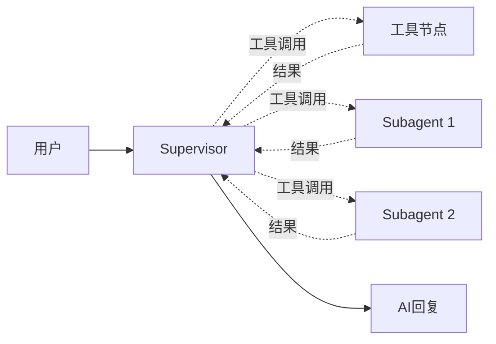

# 监督者模式

[多智能体系统](https://docs.langchain.com/oss/python/langchain/multi-agent)（MAS, Multi-Agent Systems）有多种模式，例如 Subagents、Handoffs、Skills、Router 和自定义工作流。

监督者（Supervisor）由一个主 Agent 维护会话上下文，并把边界清晰的任务委派给作为工具暴露的子 Agent：

1. 主 Agent 判断是否需要委派，并只把完成任务所需的上下文传给子 Agent
2. 子 Agent 在隔离的上下文中执行任务，把结果返回给主 Agent
3. 主 Agent 继续编排或整合最终回复



官方当前推荐直接使用 [subagents-as-tools](https://docs.langchain.com/oss/python/langchain/multi-agent/subagents#basic-implementation) 模式。旧的 supervisor 封装层主要用于迁移旧项目；新项目直接使用工具，以更精确地控制上下文、并行调用和错误处理。


```python
import os

from dotenv import load_dotenv
from langchain_openai import ChatOpenAI
from langchain.agents import create_agent
from langchain.tools import tool

# 加载模型配置
_ = load_dotenv()

# 加载模型
llm = ChatOpenAI(
    api_key=os.getenv("DASHSCOPE_API_KEY"),
    base_url=os.getenv("DASHSCOPE_BASE_URL"),
    model="qwen3.7-flash",
    temperature=0.7,
)


@tool
def add(a: float, b: float) -> float:
    """Add two numbers."""
    return a + b


@tool
def multiply(a: float, b: float) -> float:
    """Multiply two numbers."""
    return a * b


@tool
def divide(a: float, b: float) -> float:
    """Divide two numbers."""
    return a / b
```

## 使用 subagents-as-tools 实现

我们首先使用 `create_agent` 创建 `subagent1` 和 `subagent2`，分别用于计算两数相加和两数相乘。然后用 `@tool` 将它们包装成边界清晰的工具。每次调用只传入当前任务，并且只把子 Agent 的最后一条消息返回给监督者，从而隔离无关上下文。


```python
# 创建subagent1：用于计算两数相加
subagent1 = create_agent(
    model=llm,
    tools=[add],
    name="subagent-1",
)


@tool("subagent-1", description="可以准确地计算两数相加")
def call_subagent1(query: str):
    output = subagent1.invoke({"messages": [{"role": "user", "content": query}]}, version="v2")
    return output.value["messages"][-1].content


# 创建subagent2：用于计算两数相乘
subagent2 = create_agent(
    model=llm,
    tools=[multiply],
    name="subagent-2",
)


@tool("subagent-2", description="可以准确地计算两数相乘")
def call_subagent2(query: str):
    output = subagent2.invoke({"messages": [{"role": "user", "content": query}]}, version="v2")
    return output.value["messages"][-1].content
```

现在，我们可以将 `call_subagent1`、`call_subagent2`、`divide` 作为工具，直接传入 `supervisor_agent`。


```python
# 创建supervisor agent
supervisor_agent = create_agent(
    model=llm,
    tools=[call_subagent1, call_subagent2, divide],
    name="supervisor-agent",
    system_prompt="提示：如遇两数相减仍可用两数相加工具实现，只需将一个数加上另一个数的负数",
)
```

下面，我们来计算 `38462 + 378 / 49 * 83723 - 123`，看它能否正确地使用所有工具。


```python
output = supervisor_agent.invoke(
    {"messages": [{"role": "user", "content": "计算 38462 + 378 / 49 * 83723 - 123 的结果"}]},
    version="v2",
)
result = output.value

for message in result["messages"]:
    message.pretty_print()
```


```python
# 验证结果是否正确
38462 + 378 / 49 * 83723 - 123
```


    684202.1428571428


别看现在它们都算对了，实际上这是我试了好几遍，并调整了 system prompt 的结果。你多次尝试应该也能 roll 出错误的结果。多智能体会增加模型调用、延迟和失败面，只在单 Agent 已经被工具选择、上下文或专业化瓶颈卡住时才值得引入。

### 模式选择

| 需求 | 首选模式 |
| --- | --- |
| 工具数量和上下文都可控 | [单 Agent](https://docs.langchain.com/oss/python/langchain/agents) |
| 主 Agent 保持会话与决策权，专家只返回结果 | [Subagents](https://docs.langchain.com/oss/python/langchain/multi-agent/subagents) |
| 专家需直接接管当前对话 | [Handoffs](https://docs.langchain.com/oss/python/langchain/multi-agent/handoffs) |
| 先分类或并行分发，再汇总结果 | [Router](https://docs.langchain.com/oss/python/langchain/multi-agent/router) |
| 能力很多，但每次只需按需加载少量指令 | [Skills](https://docs.langchain.com/oss/python/langchain/multi-agent/skills) |
| 路由、并行、确定性步骤和 Agent 决策混合 | [Custom workflow](https://docs.langchain.com/oss/python/langchain/multi-agent/custom-workflow) |

选型前先用 [官方多智能体概览](https://docs.langchain.com/oss/python/langchain/multi-agent) 确认两件事：哪个组件需要看见哪些上下文，以及哪个组件拥有下一步决策权。
