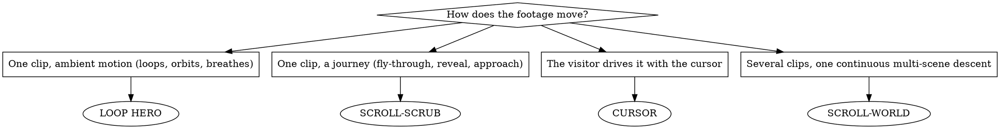

# Cinematic sites

**The video is the product; the site is the premium chrome around it.** One clip
→ a fullscreen cinematic hero. A few clips → a scroll experience. This skill owns
the whole loop: get the footage → build to an Awwwards bar → verify it moves →
write it back out as a reusable prompt.

If the page looks like a template, it failed.

---

## What you need

**Node 18+.** That is the whole install. You copy a ready-made scaffold
(`templates/base`) — no boilerplate to hand-write — then `npm install` once
inside the new site folder.

Everything else is optional: a video model if you want new footage, `ffmpeg` if
you want frame strips, Chrome-for-Testing if you want headless verification.

---

## The five steps

```
1. PICK THE MECHANIC   → how does the footage move? (decision tree below)
2. GET THE FOOTAGE     → reuse a hosted clip, or generate one — 16:9, self-hosted
3. BUILD THE SITE      → copy templates/base, wire the mechanic, text diet
4. VERIFY              → screenshot it headlessly, open the PNGs, confirm it moves
5. WRITE THE PROMPT    → distil the build back into one pasteable block (optional)
```

---

## ⚠️ Four rules that are NOT optional

Nearly every ugly result traces back to one of these.

1. **16:9 landscape, always.** Every clip and every poster still is 16:9,
   rendered full-bleed `object-cover`. **Never portrait, never
   `object-contain`, never black bars.** Do not wait to be told "make it
   landscape" — it is the default here.
2. **Get the footage BEFORE building.** A "video site" that fades between still
   images is a broken slideshow. And **download the clip into the site's
   `public/`** — never hotlink someone's CDN in production.
3. **Every generation prompt ends with:** `one continuous shot, no cuts, no
   on-screen text, no watermarks`. On-screen text and hard cuts ruin a hero, and
   AI-rendered lettering is always garbled.
4. **Seamless loop or it looks cheap.** A plain `<video loop>` hard-cuts from the
   last frame back to the first. Use crossfade / ping-pong / play-once-freeze
   (Seamless-loop law below). This is invisible in a screenshot, which is exactly
   why it survives review and ships.

---

## Step 1 — Pick the mechanic

This is the make-or-break decision. Everything downstream follows from it.



- **LOOP HERO** — the video plays fullscreen, premium UI floats over it. Best for
  brand / product / agency heroes. **The default choice** — it is the most
  reliable and it is what most "cinematic site" requests actually mean.
- **SCROLL-SCRUB** — scroll drives the frame position of a fly-through or reveal.
  Best for "scroll through the car / product / world."
  **The scrubbed video IS the hero — never build an autoplay hero above it.** The
  sticky stage is the first element on the page, the video never autoplays, you
  never call `.play()`, and frame 0 is the landing state. A video that plays by
  itself on load means you built two sections instead of one.
- **CURSOR** — the pointer drives the film, or an object tracks the cursor.
  Memorable, but it does nothing on touch — always ship a fallback.
- **SCROLL-WORLD** — several clips joined into one flight through a sequence of
  scenes. The advanced path; see "Multi-clip" below before attempting it.

Full copy-paste code for every mechanic: **references/hero-recipes.md**.

---

## Step 2 — Get the footage

Three ways, cheapest first. All three end the same way: **an mp4 in the site's
`public/`.**

### A · Reuse a clip that already exists (free, instant)

Every prompt in this repo ships with a hosted, working video URL. If one of those
worlds fits the brief, take it:

```bash
curl -sfL -o public/hero.mp4 "<video URL from any prompts/*.md>"
```

Ideal for prototypes, and for anyone without video-model access. The
`prompts/` gallery doubles as a footage library.

### B · Generate one with any video model

Seedance, Veo, Kling, Sora, Runway, Higgsfield — the model matters far less than
the prompt. **Open `references/prompt-bank.md`** (the 5-part formula plus ~37
proven clip prompts), pick the closest one to the brand, swap the subject.

Even when the user says only "build me a site for X" and never mentions video,
**you** write the clip prompt. They will almost never phrase it well, and casual
wording is what produces the over-saturated "AI slop" look.

**PROMPT GATE — do not generate until the prompt has all of these:**

- [ ] a **specific subject in a specific place** (not "abstract", not "futuristic background")
- [ ] a **named light** (backlit, god-rays, rim light, street lamps…)
- [ ] an **explicit colour grade** (dark blue, warm amber, desaturated teal…)
- [ ] **exactly ONE slow camera move**, spelled out (never "dynamic", never two moves)
- [ ] a **reference register** ("premium car commercial", "luxury perfume ad")
- [ ] ends with `shallow depth of field, one continuous shot, no cuts, no on-screen text, no watermarks`
- [ ] **NO** "8k / hyper-detailed / vibrant / masterpiece" tags — they cause the AI look

**Keyframe first when generation costs money.** A still is roughly an order of
magnitude cheaper than a clip, and the clip **inherits the look of its start
frame** — so approving a still is not just cost control, it locks composition,
lighting and grade before you spend. Generate the still with the *same* prompt,
show the user, and only then pass it as the video's start frame.

Tool-level detail for the Higgsfield MCP — models, cost preflight, polling,
download, and the failure table — is in **references/generating-video.md**.

### C · The user hands you a URL

`curl` it into `public/`. Self-host it. Never hotlink in production.

### Always: a poster still

```bash
ffmpeg -i public/hero.mp4 -vframes 1 -vf scale=1600:-2 public/hero.webp
```

That is what paints before the video decodes. Without it the hero flashes empty
on first load.

---

## Step 3 — Build the site

**Start from the bundled scaffold — never hand-roll boilerplate.**

```bash
cp -R <skill>/templates/base <project>/<site-name>
cd <project>/<site-name> && npm install
# put the clip at public/hero.mp4 and the poster at public/hero.webp
npm run dev
```

The scaffold is a complete React 18 + Vite 5 + Tailwind 3 + TypeScript app
(package.json, vite/ts/tailwind/postcss config, index.html, main.tsx, App.tsx,
index.css). Set a fixed dev port in `vite.config.ts`. Then:

- Drop in the mechanic from **references/hero-recipes.md**.
- **Full-bleed hero** — 100vw / 100svh, `object-cover`, cinematic scrim +
  vignette, type floating over the film. Never box the hero in a card.
- **Text diet** — hero = brand + one ≤7-word line + ≤1 CTA. Below the fold, ≤2–3
  visual beats. Delete spec tables, feature grids and paragraphs. The motion
  carries it; words dilute it.
- **Scrim before type.** A headline over raw footage is unreadable the moment the
  footage brightens. A bottom-up gradient from the page background — opaque at
  0%, ~0.55 at 26%, transparent by 50% — is not decoration, it is what keeps the
  page legible as the video moves underneath.
- Fonts: Google Fonts chosen per world (a serif display + a modern sans is the
  house look), loaded with the two `preconnect` tags.
- Reveals animate the standalone `translate` property, **not** `transform` —
  `transform` clobbers Tailwind's centring utilities.
- Ship a `prefers-reduced-motion` switch. Under it, drop the entrances and settle
  to a static readable page; for smooth-scroll, track the input 1:1 rather than
  disabling scrolling.

For scroll-driven builds, `lib/scrubber.ts` and `lib/smooth.ts` are drop-in and
documented — see "Scroll-driven builds" below.

---

## Step 4 — Verify (don't ship blind)

```bash
npm run dev                                    # background it
SHOT_DIR=/tmp/shots node <skill>/verify.mjs <port> <site-name>
# multi-stop, for scroll work:
SHOT_DIR=/tmp/shots node <skill>/capture-stops.mjs <port> <site-name> "0,0.4,0.75"
```

**Then open the PNGs and look.** A 200 OK is not success.

- Full-bleed? No black bars (16:9 confirmed)? Type legible over the footage?
- SCROLL / CURSOR: frames must actually **change** between stops. If they don't,
  the mechanic is not wired — no amount of styling fixes that.
- LOOP HERO has no scroll motion, so to prove the video is *playing* rather than
  frozen on a poster, pass two near-identical stops (`"0,0.02"`) — the shots must
  differ.
- Both harnesses auto-create `SHOT_DIR` and drive Chrome-for-Testing from
  `~/.cache/puppeteer` (`npx puppeteer browsers install chrome` once if missing;
  `npm install` in the skill dir once for `puppeteer-core`). A lone `favicon.ico`
  404 is expected and ignorable.

Verification is optional polish — but if the screenshots show a still image or
black bars, you violated Rule 1 or Rule 2, not a styling detail.

---

## Step 5 — Write the prompt (optional)

If the point of the build is to be **reproduced by someone else** — a repo entry,
a template, a handoff — distil it into one self-contained block that regenerates
the site from nothing.

The format, and the rules for what must be written down (exact hex values, easing
curves, z-index order, the loop paragraph, the hosted video URL) are in
**references/writing-prompts.md**. Every prompt in this repo's `prompts/` folder
was produced that way; read one alongside it.

---

## Scroll-driven builds

Two files in `lib/` do the heavy lifting. Both are dependency-free.

**`lib/scrubber.ts` — frame-strip scrubbing.** For scroll-scrub, do **not** seek a
`<video>`: browsers cannot seek smoothly enough and it stutters on every frame.
Extract to a webp strip and draw it on a `<canvas>`:

```bash
ffmpeg -i public/hero.mp4 -vf "fps=14,scale=1512:-2" -c:v libwebp -quality 78 \
  public/frames/frame-%04d.webp
```

~110 frames for an 8-second clip; set `FRAME_COUNT` to the printed count. The
class loads every 6th frame first so coarse scrubbing works immediately, fills
the gaps in batches of 12, always draws the nearest already-loaded frame, and
eases the drawn index (`current += (target - current) * 0.14`) so a fast flick
does not strobe.

**`lib/smooth.ts` — inertial scroll + reveals.** Keeps the real scrollbar: the true
page height goes on `document.body`, the content wrapper is fixed at top-left, and
each frame a value eases toward `window.scrollY` (lerp `0.085` is the sweet spot;
below ~0.05 feels laggy, above ~0.3 the inertia disappears). Snap to the target
within 0.06px or sub-pixel drift keeps the compositor awake forever.

`revealAmount()` is deliberately **not** IntersectionObserver. IO fires once at a
threshold and hands off to a CSS transition running on its own clock, so a fast
flick strands a trail of half-finished animations. Reading
`getBoundingClientRect` every frame ties every element to the same scroll value,
and the whole page moves as one object.

**Approach and depth must be exponential.** Apparent size goes as 1/distance, so
scale something being approached with `0.09 * Math.pow(17, t)`, not a linear ramp.
Linear reads as a zoom effect; exponential reads as travel.

---

## Multi-clip: joining scenes without a visible cut

A seam is only visible where there is **detail to misalign**. Two clips that both
end and begin on the same flat colour join invisibly with no cross-fade at all —
that is the cheapest, most reliable multi-clip technique there is. Sample the last
frame's colour, paint the page background that exact hex, and bridge the two
canvases with a sheet of it.

If the scenes are detailed, pick one of:

- **Crossfade scenes (reliable).** N independent full-bleed clips, crossfaded on
  scroll, one kinetic word per world. No morphing risk, fully parallel to
  generate. Prefer this unless a continuous flight is essential.
- **True chain (expensive, fragile).** Each leg's start frame is the *previous
  leg's actual extracted last frame* — never the original still, since every
  render differs and a still at the seam pops. One model for the whole chain;
  mixing models pops render character. End each leg "settling into slow forward
  drift" and begin the next "continuing that drift"; never reverse direction at a
  seam. Re-state every visible element each leg — anything you omit gets randomly
  reinvented.
  **Re-state the world, never the framing:** naming a composition gives the model
  licence to recompose and it will override your start frame.

Be realistic about the ceiling: on current models a start frame **conditions** the
next leg, it does not lock frame 0. Truly invisible chained seams over detailed
footage are not reliably achievable — budget for the crossfade fallback.

For a full config-driven scroll-world engine (dive-in clips, connectors, phone
hardening), see **github.com/oso95/scroll-world** (MIT) — it is not bundled here.

---

## Stack pins

React 18.3 + Vite 5 + Tailwind 3 + TypeScript. `react@^18.3.1 react-dom@^18.3.1`;
dev `vite@^5.4.11 @vitejs/plugin-react@^4.3.4 tailwindcss@^3.4.15 postcss
autoprefixer typescript @types/react @types/react-dom`. `build` = `vite build`
(esbuild, no typecheck) — run `npx tsc -p tsconfig.json` separately for types. No
new dependencies unless a recipe needs them. All of this is already in
`templates/base`.

**Never name a Tailwind colour `base`, `sm`, `lg` or `xl`.** Those shadow the
built-in font-size utilities, so `md:text-base` silently resolves to the *colour*
instead of the size — painting text the background colour, with no error and no
warning.

## Seamless-loop law

Plain `loop` hard-cuts back to frame 1. Instead:

- **Crossfade** two stacked `<video>`s — B starts ~1s before A ends, dissolve
  ~900ms, swap roles *after* the dissolve completes (not on `ended`, which pops).
  The safe default for any clip you have not watched.
- **Ping-pong** a webp frame strip (0→N→0) for rotating / oscillating / breathing
  subjects — seamless by construction.
- **Play-once-freeze** (no loop, hold the last frame) for a moment that ENDS.

## Common mistakes → fixes

| Mistake | Fix |
|---|---|
| Portrait / black bars beside the hero | generate 16:9, render `object-cover`, never `object-contain` (Rule 1) |
| "No video, it just fades between pictures" | you skipped Step 2 — get the clip, then wire it (Rule 2) |
| Hotlinking a CDN url in production | `curl` it into `public/`, self-host |
| Plain `<video loop>` hard-cut | crossfade / ping-pong / freeze (Seamless-loop law) |
| Headline unreadable when the footage brightens | add the bottom-up scrim; measure the *rendered page*, not the raw clip |
| Seeking a `<video>` on scroll, and it stutters | frame strip on a `<canvas>` (`lib/scrubber.ts`) |
| Reveals half-finished after a fast flick | rAF + `getBoundingClientRect`, not IntersectionObserver |
| Boxing the hero in a card | full-bleed, type over a scrim |
| Brochure copy | text diet: brand + 1 line + 1 CTA |
| Prompt yields on-screen text or a cut | append "one continuous shot, no cuts, no on-screen text, no watermarks" |
| Text painted the background colour | you named a Tailwind colour `base` — rename it |

## References

- **references/prompt-bank.md** — the video-prompt formula plus ~37 proven,
  copy-paste clip prompts. Start here for every clip.
- **references/hero-recipes.md** — full code for every mechanic: liquid-glass nav,
  crossfade and ping-pong players, scroll-scrub canvas, cursor seeker, entrances.
- **references/generating-video.md** — the Higgsfield MCP pipeline: params, cost
  preflight, polling, download, frame extraction, and every generation gotcha.
- **references/writing-prompts.md** — how to distil a finished build into one
  self-contained, reproducible prompt.
- **lib/scrubber.ts**, **lib/smooth.ts** — drop-in scroll engines.
- **templates/base/** — the ready-to-copy React + Vite + Tailwind scaffold.
- **verify.mjs**, **capture-stops.mjs** — the headless screenshot harness.
