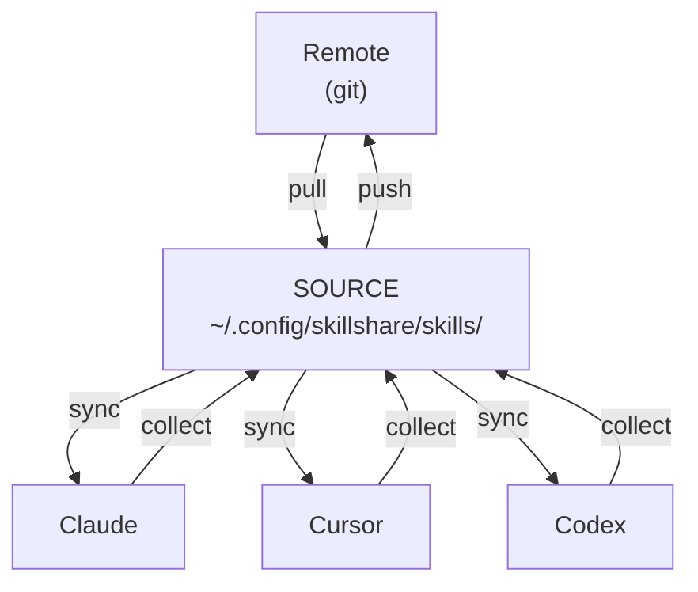
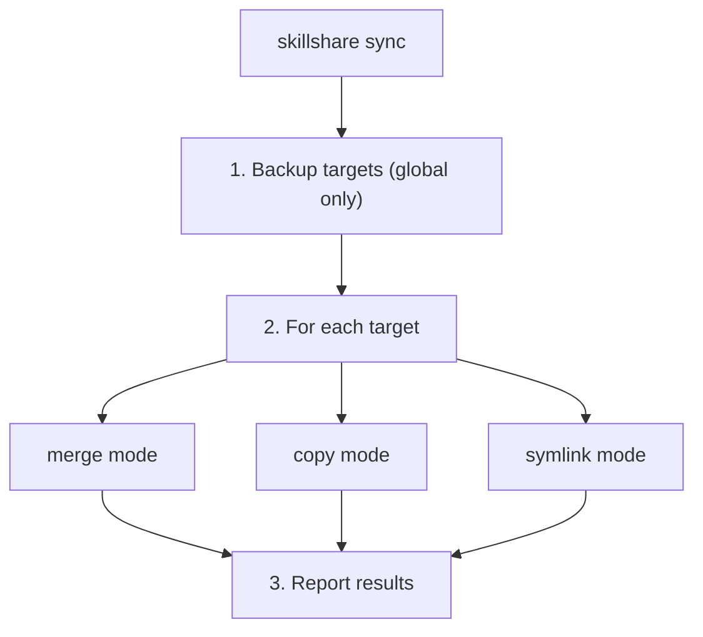
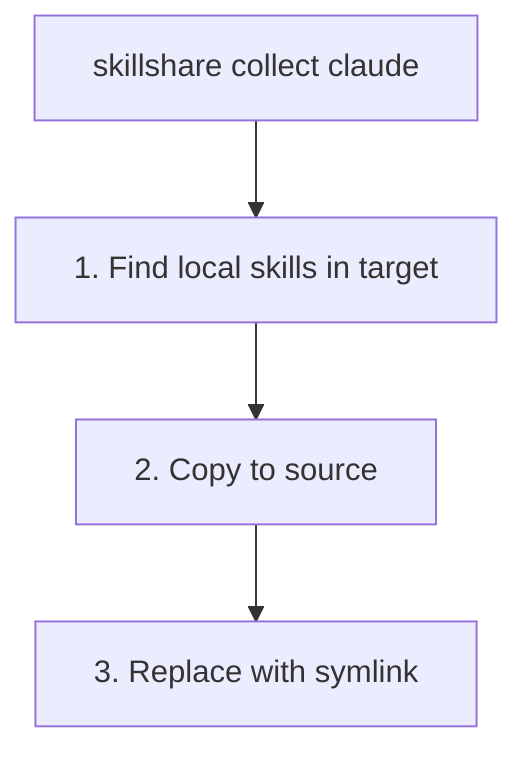
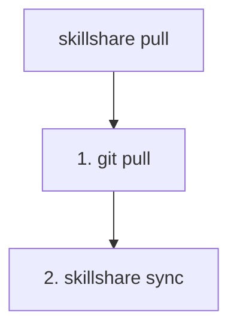
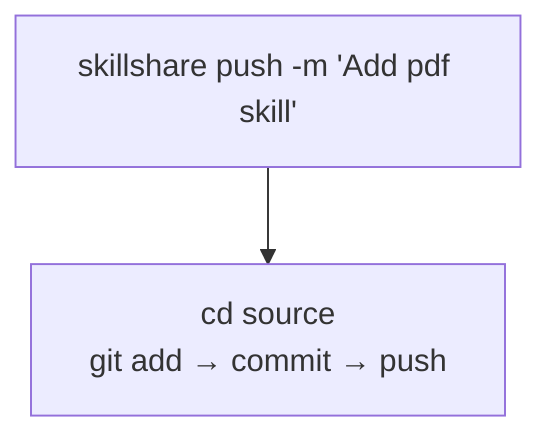
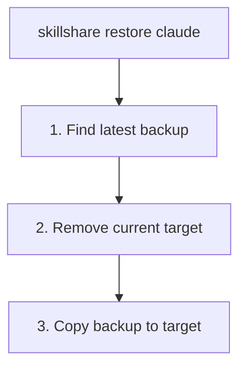
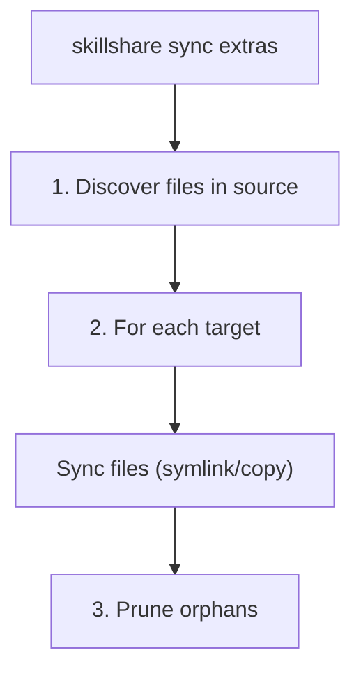

# sync

Skill を source からすべての targets にプッシュします。

MCP 接続設定には `skillshare sync mcp` を、skills、agents、extras、MCP をまとめて含めるには
`skillshare sync --all` を使用してください。MCP の同期は skill のシンボリックリンクではなく、
エントリの所有権とコンフリクトチェックを使用します。[mcp](/docs/reference/commands/mcp) を参照してください。

:::info sync はなぜ独立したコマンドなのか？
`install` や `uninstall` のような操作は source のみを変更します — sync は targets に反映します。これにより、変更をバッチ処理し、`--dry-run` でプレビューし、targets が更新されるタイミングを制御できます。[Why Sync is a Separate Step](/docs/understand/source-and-targets#why-sync-is-a-separate-step) を参照してください。
:::

## 使うタイミング

- Skill をインストール、uninstall、編集した後 — 変更をすべての targets に反映する
- target の sync mode を変更した後 — 新しい mode を適用する
- 定期的に、すべての targets が sync されていることを確認する

## コマンド概要

| タイプ | コマンド | 方向 |
|------|---------|-----------|
| **Local sync** | `sync` / `collect` | Source ↔ Targets |
| **Remote sync** | `push` / `pull` | Source ↔ Git Remote |

- `sync` = Source から Targets へ配布
- `collect` = Targets から Source へ収集
- `push` = git remote へプッシュ
- `pull` = git remote からプルして sync

## 概要



| コマンド | 方向 | 説明 |
|---------|-----------|-------------|
| `sync` | Source → Targets | Skill をすべての targets にプッシュ |
| `collect <target>` | Target → Source | target から source へ skill を収集 |
| `push` | Source → Remote | git にコミットしてプッシュ |
| `pull` | Remote → Source → Targets | git からプルし、その後 sync |

---

## Project Mode

カレントディレクトリに `.skillshare/config.yaml` が存在する場合、sync は project mode を自動検出します。

```bash
cd my-project/
skillshare sync          # 自動検出された project mode
skillshare sync -p       # 明示的な project mode
```

**Project sync** はデフォルトで merge mode（skill ごとのシンボリックリンク）になりますが、`skillshare target <name> --mode copy -p` によって各 target を copy または symlink mode に設定できます。バックアップは作成されません（project の targets は source から再現可能なため）。

```
.skillshare/skills/                 .claude/skills/
├── my-skill/          ────────►    ├── my-skill/ → (symlink)
├── pdf/               ────────►    ├── pdf/      → (symlink)
└── ...                             └── local/    (preserved)
```

---

## Sync

Skill を source からすべての targets にプッシュします。

```bash
skillshare sync              # skill をすべての targets に sync
skillshare sync agents       # agents のみを sync
skillshare sync --all        # skills + agents + extras + MCP を sync
skillshare sync --dry-run    # 変更をプレビュー
skillshare sync -n           # 短縮形
skillshare sync --force      # 管理対象のすべての skill を上書き
skillshare sync -f           # 短縮形
```

| フラグ | 短縮形 | 説明 |
|------|-------|-------------|
| `--all` | | skills の後に agents、extras、MCP も sync（plugins は除く） |
| `--dry-run` | `-n` | 書き込まずに変更をプレビュー |
| `--force` | `-f` | チェックサムに関わらず管理対象のすべてのエントリを上書き（copy mode）、または既存のディレクトリをシンボリックリンクに置き換え（merge mode） |
| `--json` | | JSON として出力 |
| `--quiet` | `-q` | トークンサマリーと budget 警告を抑制 |

### JSON 出力

```bash
skillshare sync --json
```

```json
{
  "targets": 3,
  "linked": 12,
  "local": 2,
  "updated": 0,
  "pruned": 1,
  "ignored_count": 2,
  "ignored_skills": ["_team/vendor/lib", "test-draft"],
  "dry_run": false,
  "duration": "0.234s",
  "details": [
    {
      "name": "claude",
      "mode": "merge",
      "linked": 8,
      "local": 2,
      "updated": 0,
      "pruned": 1
    },
    {
      "name": "cursor",
      "mode": "merge",
      "linked": 4,
      "local": 0,
      "updated": 0,
      "pruned": 0
    }
  ],
  "context_cost": {
    "groups": [
      {
        "targets": ["claude", "cursor"],
        "always_loaded_tokens": 12400,
        "on_demand_tokens": 58200
      }
    ]
  }
}
```

`ignored_count` と `ignored_skills` フィールドは、`.skillignore`（および存在する場合は `.skillignore.local`）によって除外された skill を示します。これらは discovery 時にフィルタリングされ、どの target にも到達しません。`.skillignore.local` が有効な場合、テキスト出力には `.local` の source ヒントが含まれます。パターンの構文については [.skillignore](/docs/reference/appendix/file-structure#skillignore-optional) を参照してください。

### 実行内容



### 出力例

<p>
  
</p>

---

## Collect

target から source へ skill を収集します。

```bash
skillshare collect claude           # Claude から収集
skillshare collect claude --dry-run # プレビュー
skillshare collect --all            # すべての targets から収集
```

**使うタイミング**: target（例: `~/.claude/skills/`）で直接 skill を作成/編集し、それを source に取り込みたい場合。



**収集後:**
```bash
skillshare collect claude
skillshare sync  # ← 他の targets に配布
```

---

## Pull

git remote からプルし、すべての targets に sync します。

```bash
skillshare pull              # git remote からプル
skillshare pull --dry-run    # プレビュー
```

**使うタイミング**: 別のマシンから変更をプッシュし、ここで sync したい場合。



---

## Push

source をコミットして git remote にプッシュします。

```bash
skillshare push                  # 自動生成されたメッセージ
skillshare push -m "Add pdf"     # カスタムメッセージ
```



**コンフリクトの処理:**
- remote が進んでいる場合、`push` は失敗します → 先に `pull` を実行してください

---

## Dotfiles マネージャーとの互換性 {#dotfiles-manager-compatibility}

source または target ディレクトリをシンボリックリンクする dotfiles manager（GNU Stow、chezmoi、yadm、bare-git）を使用している場合、skillshare は透過的に処理します。

```
# Dotfiles manager creates:
~/.config/skillshare/skills/ → ~/dotfiles/ss-skills/     # symlinked source
~/.claude/skills/            → ~/dotfiles/claude-skills/  # symlinked target
```

- **シンボリックリンクされた source** — すべてのコマンド（`sync`、`update`、`uninstall`、`list`、`diff`、`install`）は walk する前にシンボリックリンクを解決するため、skill は正しく検出されます。連鎖したシンボリックリンク（リンク → リンク → 実ディレクトリ）も動作します。
- **シンボリックリンクされた target** — `sync` は target のシンボリックリンクが skillshare によって作成された**ものではない**ことを検知し、それを保持します。Skill は解決されたディレクトリに sync されます。
- **Status/collect** — `status` と `collect` は、コンフリクトを報告する代わりに外部の target シンボリックリンクをたどります。

:::info sync の判定方法
target ディレクトリがシンボリックリンクである場合、sync はそれが skillshare の source ディレクトリを指しているかどうかを確認します。mode 変換時に削除されるのは skillshare 自身の symlink mode によって作成されたシンボリックリンクのみです — 外部のシンボリックリンク（dotfiles manager によるもの）は常に保持されます。
:::

---

## Sync モード

| Mode | 動作 | ユースケース |
|------|----------|----------|
| `merge` | 各 skill が個別にシンボリックリンクされる | **デフォルト。**ローカルの skill を保持します。 |
| `copy` | 各 skill が実体ファイルとしてコピーされる | 互換性優先のセットアップ、skill を project リポジトリに vendoring する場合、またはシンボリックリンクの挙動が信頼できない環境。 |
| `symlink` | ディレクトリ全体が 1 つのシンボリックリンクになる | どこでも完全なコピーにする場合。 |

target ごとの override が主要な調整手段であることに変わりありません。

```bash
skillshare target <name> --mode copy
skillshare sync
```

互換性のヒントは `sync` ではなく [`doctor`](./doctor.md) によって表示されます。そのサンプル target は次の優先順位で選ばれます:
`cursor` → `antigravity` → `copilot` → `opencode`。
これらの target がいずれも存在しない場合（またはすでに `copy` を実行している場合）、互換性のヒントは表示されません。

中立的な判断マトリックスについては [Sync Modes](/docs/understand/sync-modes) を参照してください。

### ターゲットごとの include/exclude フィルター {#per-target-includeexclude-filters}

merge および copy mode では、各 target は config 内で `include` / `exclude` パターンを定義できます。

```yaml
targets:
  codex:
    path: ~/.codex/skills
    include: [codex-*]
  claude:
    path: ~/.claude/skills
    exclude: [codex-*]
```

- マッチングは flat target 名（例: `team__frontend__ui`）に対して行われます
- `include` が最初に適用され、その後 `exclude` が適用されます
- `diff`、`status`、`doctor`、および UI の drift 検出はすべてフィルター済みの期待セットを使用します
- symlink mode では、フィルターは無視されます
- copy mode では、フィルターは merge mode と同じように動作します
- `sync` は、除外されるようになった既存の source-linked または管理対象のエントリを削除します

詳細は [Configuration](/docs/reference/targets/configuration#include--exclude-target-filters) を参照してください。

:::tip
これは 3 つあるフィルタリング層のうちの 1 つに過ぎません。`.skillignore`、SKILL.md の `targets`、target フィルターを網羅した完全なガイドは [Filtering Skills](/docs/how-to/daily-tasks/filtering-skills) を参照してください。
:::

### フィルター動作の例 {#filter-behavior-examples}

source に以下が含まれるとします。
- `core-auth`
- `core-docs`
- `codex-agent`
- `codex-experimental`
- `team__frontend__ui`

#### `include` のみ

```yaml
targets:
  codex:
    path: ~/.codex/skills
    include: [codex-*, core-*]
```

`sync` 後、codex は以下を受け取ります。
- `core-auth`
- `core-docs`
- `codex-agent`
- `codex-experimental`

target が厳選されたサブセットのみを受け取るべき場合に使用します。

#### `exclude` のみ

```yaml
targets:
  claude:
    path: ~/.claude/skills
    exclude: [codex-*, *-experimental]
```

`sync` 後、claude は以下を受け取ります。
- `core-auth`
- `core-docs`
- `team__frontend__ui`

target が特定のグループを除いて「ほぼすべて」を受け取るべき場合に使用します。

#### `include` + `exclude`

```yaml
targets:
  cursor:
    path: ~/.cursor/skills
    include: [core-*, codex-*]
    exclude: [*-experimental]
```

`sync` 後、cursor は以下を受け取ります。
- `core-auth`
- `core-docs`
- `codex-agent`

`codex-experimental` はまず include され、その後 exclude によって除去されます。

#### フィルター変更時に削除されるもの

フィルターが更新されて `sync` が実行されると:
- 除外されるようになった source-linked エントリ（シンボリックリンク/junction）は削除されます
- target にすでに存在するローカルの非シンボリックリンクフォルダは保持されます

### Merge Mode（デフォルト）

```
Source                          Target (claude)
─────────────────────────────────────────────────────────────
skills/                         ~/.claude/skills/
├── my-skill/        ────────►  ├── my-skill/ → (symlink)
├── another/         ────────►  ├── another/  → (symlink)
└── ...                         ├── local-only/  (preserved)
                                └── .skillshare-manifest.json
```

### Copy Mode

```
Source                          Target (cursor)
─────────────────────────────────────────────────────────────
skills/                         ~/.cursor/skills/
├── my-skill/        ────copy►  ├── my-skill/    (real files)
├── another/         ────copy►  ├── another/     (real files)
└── ...                         ├── local-only/  (preserved)
                                └── .skillshare-manifest.json
```

merge mode と copy mode はどちらも、管理対象の skill を追跡するために `.skillshare-manifest.json` を書き込みます。copy mode では、チェックサムによって差分 sync が可能です（変更のない skill はスキップされます）。`--force` はすべてを上書きします。

### Symlink Mode

```
Source                          Target (claude)
─────────────────────────────────────────────────────────────
skills/              ────────►  ~/.claude/skills → (symlink to source)
├── my-skill/
├── another/
└── ...
```

### Mode の変更

```bash
skillshare target claude --mode merge
skillshare target claude --mode copy
skillshare target claude --mode symlink
skillshare sync  # 変更を適用
```

### 安全に関する警告

> **symlink mode では、target 経由で削除すると source が削除されます！**
> ```bash
> rm -rf ~/.claude/skills/my-skill  # ❌ SOURCE から削除される
> skillshare target remove claude   # ✅ 安全なリンク解除方法
> ```

---

## Backup

バックアップは `sync` と `target remove` の前に**自動的に**作成されます。

場所: `~/.local/share/skillshare/backups/<timestamp>/`

スナップショットは**ローカルの** target コンテンツのみをキャプチャします。merge mode のシンボリックリンクはスキップされます — それらは source を指しており、`sync` がそれらを再作成するためです — そのため、skill がどれだけ大きくてもスナップショットは小さいままです。保持ポリシーは、各 sync の後に自動的に適用されます。[What Gets Backed Up](/docs/reference/commands/backup#what-gets-backed-up) と [Backups & Disk Space](/docs/reference/commands/backup#backups--disk-space) を参照してください。

### 手動バックアップ

```bash
skillshare backup              # すべての targets をバックアップ
skillshare backup claude       # 特定の target をバックアップ
skillshare backup --list       # すべてのバックアップを一覧表示
skillshare backup --cleanup    # 古いバックアップを削除
skillshare backup --dry-run    # プレビュー
```

### 出力例

```
$ skillshare backup --list

Backups
─────────────────────────────────────────
  2026-01-20_15-30-00/
    claude/    5 skills, 2.1 MB
    cursor/    5 skills, 2.1 MB
  2026-01-19_10-00-00/
    claude/    4 skills, 1.8 MB
```

---

## Restore

バックアップから targets を復元します。

```bash
skillshare restore claude                              # 最新のバックアップ
skillshare restore claude --from 2026-01-19_10-00-00   # 特定のバックアップ
skillshare restore claude --dry-run                    # プレビュー
```



---

## Agent の Sync {#agent-sync}

Agents は skills とは別に sync されます。agents のみを sync するには `sync agents` を、skills、agents、extras、MCP をまとめて含めるには `sync --all` を使用してください。

```bash
skillshare sync              # skills のみを sync（デフォルト）
skillshare sync agents       # agents のみを sync
skillshare sync --all        # skills + agents + extras + MCP を sync
```

Agent sync は 3 つすべての mode（merge、copy、symlink）をサポートし、target に設定された mode に一致します。`agents` パス定義を持つ target のみが agent sync を受け取ります — 現在は Claude、Cursor、OpenCode、Augment です。全リストは [Agents — Supported Targets](/docs/understand/agents#supported-targets) を参照してください。

Orphan のクリーンアップ、`.agentignore` フィルタリング、target ごとの include/exclude フィルターはすべて skills と同じように動作します。

---

## Plugin の Sync

`sync plugins [name]` は [`plugin sync`](./plugin.md) のエイリアスです。Plugins は
`sync --all` から**除外され**、skill sync mode の代わりにネイティブなインストール操作を使用します。

```bash
skillshare sync plugins --dry-run --json
skillshare sync plugins demo --target claude --no-tui
```

`plugin enable` と `plugin disable` は target の選択のみを保存します。次の plugin
sync は選択されたバインディングをインストールし、選択解除されたものを定義を保持したまま
uninstall します。管理対象外の plugins は影響を受けません。Plugin sync は `--target`、
`--dry-run`、`--json`、`--no-tui`、`--revision`、mode フラグを受け付けます。`--force`、
`--quiet`、`--all` のような通常の sync オプションは適用されません。ネイティブクライアントの要件、
project スコープ、部分的な失敗からの復旧については [plugin](./plugin.md) を参照してください。

## Extras の Sync {#sync-extras}

非 skill リソース（rules、commands、prompts など）を任意のディレクトリに sync します。Extras は skills とは別に設定され、独自の source ディレクトリを持ちます。

```bash
skillshare sync extras            # 設定済みのすべての extras を sync
skillshare sync extras --dry-run  # 変更をプレビュー
skillshare sync extras --force    # コンフリクトするファイルを上書き
skillshare sync --all             # skills + agents + extras + MCP を sync
```

| フラグ | 短縮形 | 説明 |
|------|-------|-------------|
| `--dry-run` | `-n` | 書き込まずに変更をプレビュー |
| `--force` | `-f` | target 上のコンフリクトするファイルを上書き |

:::info 両方の mode をサポート
`sync extras` は global mode と project mode の両方で動作します。skills、agents、extras、MCP をまとめて sync するには `sync --all` を、extras のみを sync するには `sync extras` を使用してください。project mode では、extras の source は `.skillshare/extras/<name>/` です。
:::

### 設定

config（global の場合は `~/.config/skillshare/config.yaml`、project の場合は `.skillshare/config.yaml`）に `extras` セクションを追加します。

```yaml
extras:
  - name: rules
    targets:
      - path: ~/.claude/rules
      - path: ~/.cursor/rules
        mode: copy
  - name: commands
    targets:
      - path: ~/.claude/commands
```

各 extra は以下を持ちます:
- **`name`** — config ディレクトリ内の `extras/` 配下のディレクトリ名
- **`targets`** — オプションの `mode` を持つ target パスのリスト

Source ファイルは `extras/` サブディレクトリ配下に置かれます。

```
~/.config/skillshare/
├── config.yaml
├── skills/              ← skill source
└── extras/              ← extras source root
    ├── rules/           ← extras: rules
    │   ├── coding.md
    │   └── testing.md
    └── commands/        ← extras: commands
        └── deploy.md
```

### Sync モード

| Mode | 動作 |
|------|------|
| `merge` | source から target へのファイルごとのシンボリックリンク**（デフォルト）** |
| `copy` | ファイルごとのコピー |
| `symlink` | source ディレクトリ全体が target パスにシンボリックリンクされる |

merge mode では、シンボリックリンクのみが削除されます — target にあるユーザー作成のローカルファイルは保持されます。

### 実行内容



1. source ディレクトリ（`~/.config/skillshare/extras/<name>/`）を walk する
2. 各 target について、設定された mode に従ってシンボリックリンクまたはコピーを作成する
3. source に存在しなくなった target 内の orphan ファイルを削除する

### 出力例

```
$ skillshare sync extras

Rules
  ✔ ~/.claude/rules  2 files linked (merge)
  ✔ ~/.cursor/rules  2 files copied (copy)

Commands
  ✔ ~/.claude/commands  1 files linked (merge)
```

---

## コンテキストコスト {#context-cost}

sync 後、skillshare はトークンコストのサマリーを表示します。

```
✔ Synced 47 skill(s) to 4 target(s) in 312ms
  Context: ~12.4K always-loaded · ~58.2K on-demand (claude, cursor, codex, opencode)
```

- **Always-loaded**: frontmatter の name + description（すべてのリクエストで読み込まれる）
- **On-demand**: skill の本文（トリガーされたときに読み込まれる）

トークン数が同じ targets は 1 行にまとめられます。

### 予算の警告

config で警告のしきい値を設定します。

```yaml
context_budget:
  warn_always_loaded_tokens: 10000   # デフォルト; 0 = 無効
  warn_on_demand_tokens: 100000      # デフォルト; 0 = 無効
```

しきい値を超えると、上位 3 件の要因とともに警告が表示されます。

```
! Always-loaded context is ~50,123 tokens (budget: 10,000)
   Top 3:
     • my-big-skill                    ~8,200 tokens
     • another-verbose-skill           ~6,400 tokens
     • chatgpt-system-prompt           ~5,100 tokens
   Run `skillshare analyze` for details.
```

### Quiet モード

トークンサマリーと budget 警告を抑制するには `--quiet` または `-q` を使用します。

```bash
skillshare sync --quiet
```

JSON 出力（`--json`）には、`--quiet` に関わらず常に `context_cost` が含まれます。

---

## 関連項目

- [status](/docs/reference/commands/status) — sync の状態を表示
- [diff](/docs/reference/commands/diff) — 差分を表示
- [Targets](/docs/reference/targets) — targets を管理
- [Cross-Machine Sync](/docs/how-to/sharing/cross-machine-sync) — コンピューター間で sync
- [install](/docs/reference/commands/install) — Skill をインストール
- [Configuration](/docs/reference/targets/configuration#extras) — Extras 設定リファレンス
