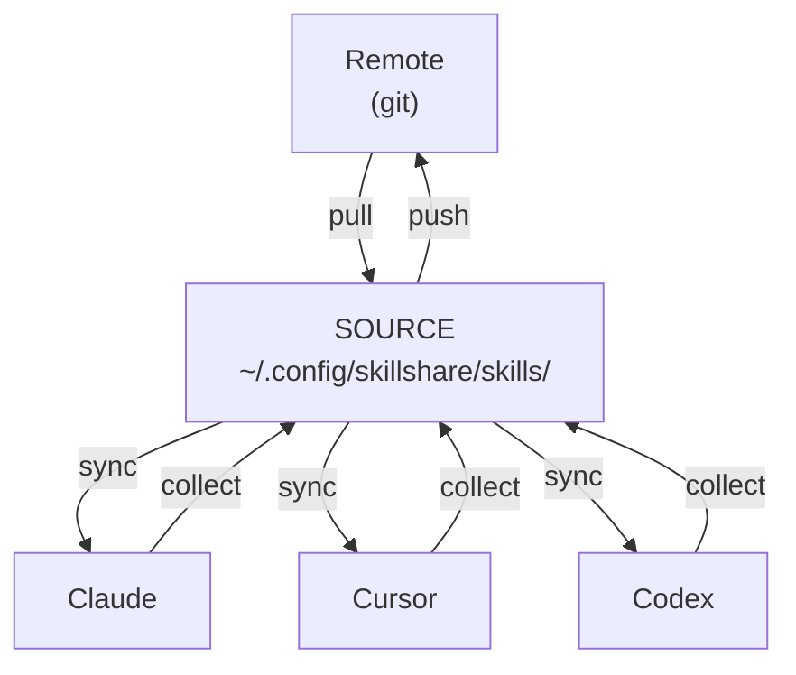
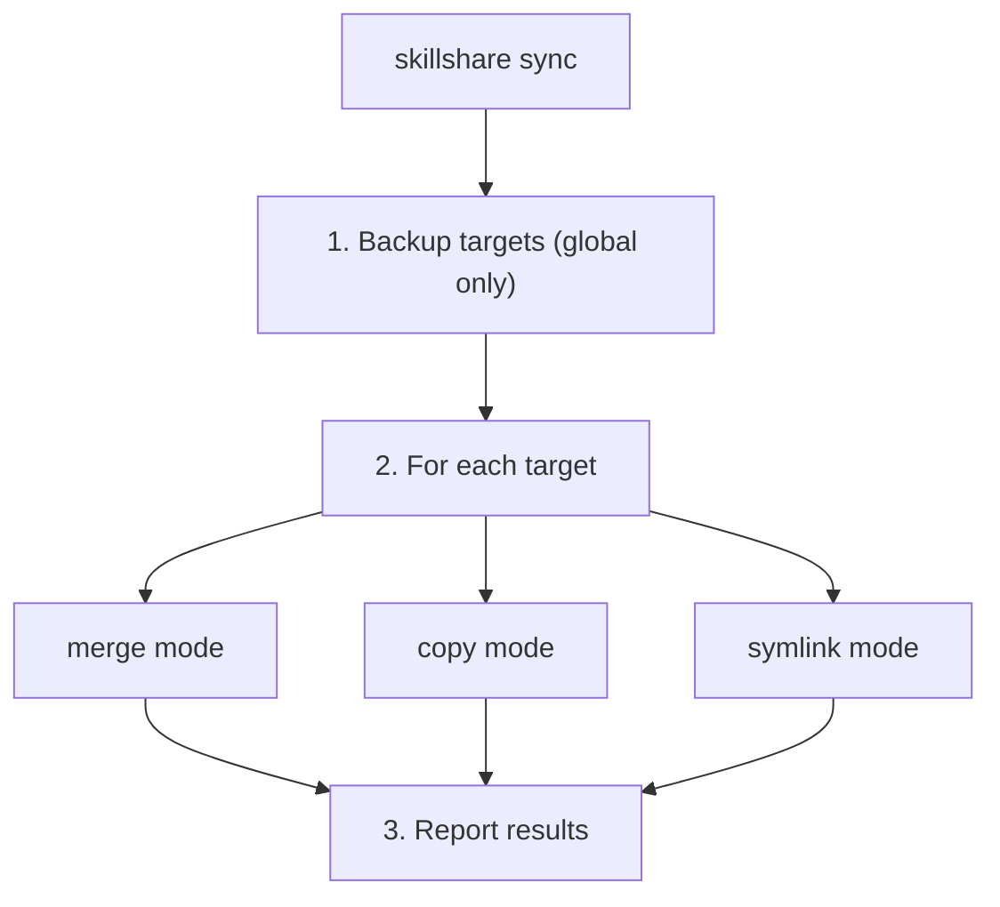
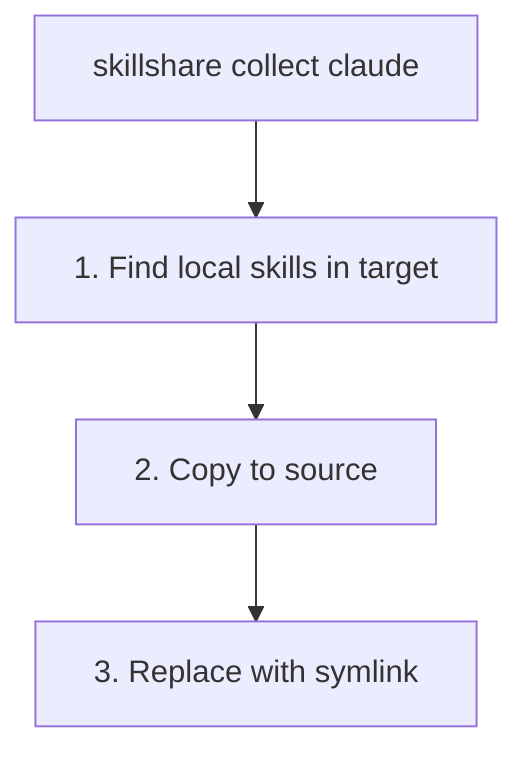
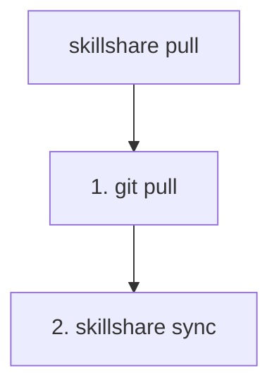
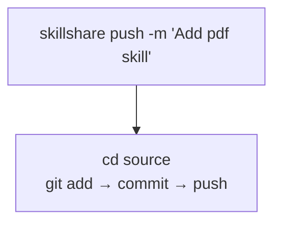
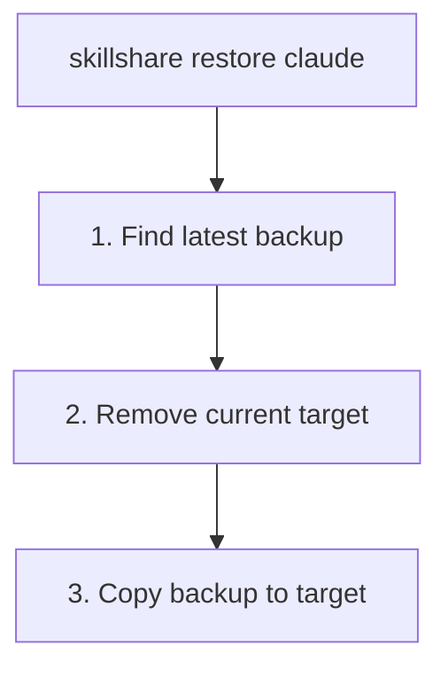
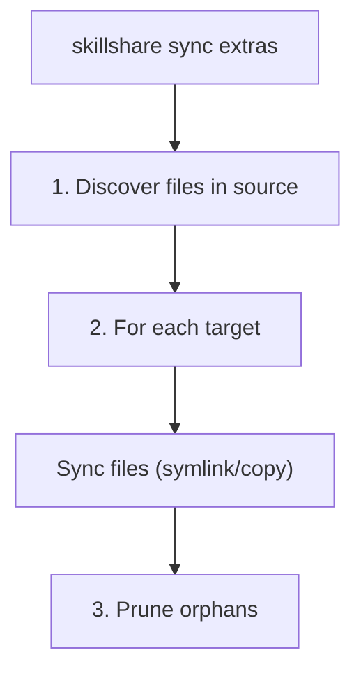

# sync

Source에서 모든 Target으로 skill을 push합니다.

MCP 연결 설정은 `skillshare sync mcp`를 사용하고, skill, agent, extras, MCP를
모두 포함하려면 `skillshare sync --all`을 사용하세요. MCP synchronization은
skill symlink 대신 entry ownership과 conflict check를 사용합니다. [mcp](/docs/reference/commands/mcp)를
참고하세요.

:::info sync가 별도 command인 이유는 무엇인가요?
`install`, `uninstall` 같은 작업은 source만 수정하며 — sync가 target으로 전파합니다. 덕분에 변경 사항을 모아서 처리하고, `--dry-run`으로 미리 보고, target이 업데이트되는 시점을 제어할 수 있습니다. [Why Sync is a Separate Step](/docs/understand/source-and-targets#why-sync-is-a-separate-step)를 참고하세요.
:::

## 사용 시점

- skill을 설치, 제거, 편집한 후 — 변경 사항을 모든 target에 전파
- target의 sync mode를 변경한 후 — 새 mode를 적용
- 모든 target이 sync 상태를 유지하도록 주기적으로

## Command 개요

| 종류 | Command | 방향 |
|------|---------|-----------|
| **Local sync** | `sync` / `collect` | Source ↔ Targets |
| **Remote sync** | `push` / `pull` | Source ↔ Git Remote |

- `sync` = Source에서 Target으로 배포
- `collect` = Target에서 Source로 수집
- `push` = git remote로 push
- `pull` = git remote에서 pull하고 sync

## 개요



| Command | 방향 | 설명 |
|---------|-----------|-------------|
| `sync` | Source → Targets | 모든 target에 skill을 push |
| `collect <target>` | Target → Source | target에서 source로 skill을 수집 |
| `push` | Source → Remote | git에 commit하고 push |
| `pull` | Remote → Source → Targets | git에서 pull한 뒤 sync |

---

## Project Mode

현재 디렉터리에 `.skillshare/config.yaml`이 존재하면 sync는 project mode를 자동으로 감지합니다.

```bash
cd my-project/
skillshare sync          # 자동 감지된 project mode
skillshare sync -p       # 명시적 project mode
```

**Project sync**는 기본적으로 merge mode(skill별 symlink)를 사용하지만, 각 target은 `skillshare target <name> --mode copy -p`를 통해 copy 또는 symlink mode로 설정할 수 있습니다. Backup은 생성되지 않습니다(project target은 source로부터 재현 가능하기 때문입니다).

```
.skillshare/skills/                 .claude/skills/
├── my-skill/          ────────►    ├── my-skill/ → (symlink)
├── pdf/               ────────►    ├── pdf/      → (symlink)
└── ...                             └── local/    (preserved)
```

### 기본 경로가 이동한 후의 정리 {#project-path-cleanup}

Project config는 경로가 아니라 target 이름을 저장하므로, 각 target은 자신의 built-in 기본 경로를 따라갑니다. 어떤 도구가 그 기본값을 변경하면 — goose와 openhands가 `.agents/skills`를 채택했을 때처럼 — skillshare가 이전 디렉터리에 썼던 skill이 그대로 남고, 그 도구는 두 위치를 모두 읽어 모든 skill을 두 번씩 나열합니다.

Project sync는 이를 제거합니다. 명시적인 `path:`가 없는 각 target에 대해 해당 target의 runtime이 함께 scan하는 디렉터리를 살펴보고, 그중 구성된 어떤 target도 쓰지 않는 디렉터리에서 skillshare가 만든 항목을 제거합니다. 사용자가 직접 만든 폴더와 project 바깥을 가리키는 symlink는 절대 건드리지 않습니다.

```
→ Cleaned 1 leftover skill(s) from .goose/skills: the default path for 'goose' moved to .agents/skills
```

target에 명시적인 `path:`를 설정하면 해당 target은 이 정리에서 제외되며, `--dry-run`은 아무것도 변경하지 않고 제거될 항목만 미리 보여줍니다.

---

## Sync

Source에서 모든 target으로 skill을 push합니다.

```bash
skillshare sync              # 모든 target에 skill을 sync
skillshare sync agents       # agent만 sync
skillshare sync --all        # skill + agent + extras + MCP를 sync
skillshare sync --dry-run    # 변경 사항 미리보기
skillshare sync -n           # 축약형
skillshare sync --force      # 관리 중인 모든 skill을 덮어쓰기
skillshare sync -f           # 축약형
```

| Flag | 축약형 | 설명 |
|------|-------|-------------|
| `--all` | | skill 이후 agent, extras, MCP도 함께 sync(plugin은 제외) |
| `--dry-run` | `-n` | 실제로 쓰지 않고 변경 사항 미리보기 |
| `--force` | `-f` | checksum과 무관하게 관리 중인 모든 항목을 덮어쓰기(copy mode) 또는 기존 디렉터리를 symlink로 교체(merge mode) |
| `--json` | | JSON으로 출력 |
| `--quiet` | `-q` | token summary와 budget warning을 표시하지 않음 |

### JSON 출력

```bash
skillshare sync --json
```

```json
{
  "targets": 3,
  "linked": 12,
  "local": 2,
  "updated": 0,
  "pruned": 1,
  "ignored_count": 2,
  "ignored_skills": ["_team/vendor/lib", "test-draft"],
  "dry_run": false,
  "duration": "0.234s",
  "details": [
    {
      "name": "claude",
      "mode": "merge",
      "linked": 8,
      "local": 2,
      "updated": 0,
      "pruned": 1
    },
    {
      "name": "cursor",
      "mode": "merge",
      "linked": 4,
      "local": 0,
      "updated": 0,
      "pruned": 0
    }
  ],
  "context_cost": {
    "groups": [
      {
        "targets": ["claude", "cursor"],
        "always_loaded_tokens": 12400,
        "on_demand_tokens": 58200
      }
    ]
  }
}
```

`ignored_count`와 `ignored_skills` 필드는 `.skillignore`(및 존재하는 경우 `.skillignore.local`)에 의해 제외된 skill을 보여줍니다. 이 항목들은 discovery 시점에 필터링되어 어떤 target에도 도달하지 않습니다. `.skillignore.local`이 적용 중일 때는 text 출력에 `.local` source 힌트가 포함됩니다. 패턴 문법은 [.skillignore](/docs/reference/appendix/file-structure#skillignore-optional)를 참고하세요.

### 동작 방식



### 출력 예시

<p>
  
</p>

---

## Collect

Target에서 skill을 source로 다시 수집합니다.

```bash
skillshare collect claude           # Claude로부터 수집
skillshare collect claude --dry-run # 미리보기
skillshare collect --all            # 모든 target에서 수집
```

**사용 시점**: target(예: `~/.claude/skills/`)에서 직접 skill을 만들거나 편집했고, 이를 source로 가져오고 싶을 때.



**수집 후:**
```bash
skillshare collect claude
skillshare sync  # ← 다른 target으로 배포
```

---

## Pull

git remote에서 pull하고 모든 target으로 sync합니다.

```bash
skillshare pull              # git remote에서 pull
skillshare pull --dry-run    # 미리보기
```

**사용 시점**: 다른 머신에서 변경 사항을 push했고 이를 여기서 sync하고 싶을 때.



---

## Push

Source를 commit하고 git remote로 push합니다.

```bash
skillshare push                  # 자동 생성된 message
skillshare push -m "Add pdf"     # 사용자 지정 message
```



**Conflict 처리:**
- remote가 앞서 있으면 `push`는 실패합니다 → 먼저 `pull`을 실행하세요

---

## Dotfiles Manager 호환성 {#dotfiles-manager-compatibility}

source나 target 디렉터리를 symlink로 연결하는 dotfiles manager(GNU Stow, chezmoi, yadm, bare-git)를 사용한다면, skillshare는 이를 투명하게 처리합니다.

```
# Dotfiles manager가 생성:
~/.config/skillshare/skills/ → ~/dotfiles/ss-skills/     # symlink된 source
~/.claude/skills/            → ~/dotfiles/claude-skills/  # symlink된 target
```

- **Symlink된 source** — 모든 command(`sync`, `update`, `uninstall`, `list`, `diff`, `install`)는 순회하기 전에 symlink를 resolve하므로 skill이 올바르게 발견됩니다. 연쇄된 symlink(link → link → real dir)도 작동합니다.
- **Symlink된 target** — `sync`는 target symlink가 skillshare에 의해 생성되지 **않았음**을 감지하고 이를 보존합니다. skill은 resolve된 디렉터리로 sync됩니다.
- **Status/collect** — `status`와 `collect`는 conflict를 보고하는 대신 외부 target symlink를 따라갑니다.

:::info sync의 판단 방식
target 디렉터리가 symlink인 경우, sync는 그것이 skillshare source 디렉터리를 가리키는지 확인합니다. skillshare 자체의 symlink mode로 생성된 symlink만 mode 변환 중에 제거됩니다 — dotfiles manager로부터의 외부 symlink는 항상 보존됩니다.
:::

---

## Sync Mode

| Mode | 동작 | 사용 사례 |
|------|----------|----------|
| `merge` | 각 skill이 개별적으로 symlink됨 | **기본값.** local skill을 보존합니다. |
| `copy` | 각 skill이 실제 파일로 복사됨 | 호환성 우선 환경, project repo에 skill을 vendoring하는 경우, 또는 symlink 동작이 불안정한 환경. |
| `symlink` | 전체 디렉터리가 하나의 symlink | 모든 곳에서 정확히 동일한 사본. |

Target별 override는 여전히 주요 조정 수단입니다.

```bash
skillshare target <name> --mode copy
skillshare sync
```

호환성 힌트는 `sync`가 아니라 [`doctor`](./doctor.md)가 출력합니다. 예시 target은 다음 우선순위로 선택됩니다.
`cursor` → `antigravity` → `copilot` → `opencode`.
이 target들이 하나도 존재하지 않거나(또는 이미 `copy`로 동작 중이면) 호환성 힌트는 표시되지 않습니다.

중립적인 결정 매트릭스는 [Sync Modes](/docs/understand/sync-modes)를 참고하세요.

### Target별 include/exclude filter {#per-target-includeexclude-filters}

merge 및 copy mode에서는 각 target이 config에서 `include` / `exclude` 패턴을 정의할 수 있습니다.

```yaml
targets:
  codex:
    path: ~/.codex/skills
    include: [codex-*]
  claude:
    path: ~/.claude/skills
    exclude: [codex-*]
```

- 매칭은 flat target 이름(예: `team__frontend__ui`)을 기준으로 합니다
- `include`가 먼저 적용되고, 그다음 `exclude`가 적용됩니다
- `diff`, `status`, `doctor`, 그리고 UI drift는 모두 필터링된 expected set을 사용합니다
- symlink mode에서는 filter가 무시됩니다
- copy mode에서 filter는 merge mode와 동일하게 동작합니다
- `sync`는 이제 제외된 기존 source-linked 또는 managed entry를 제거합니다

자세한 내용은 [Configuration](/docs/reference/targets/configuration#include--exclude-target-filters)을 참고하세요.

:::tip
이는 세 가지 필터링 계층 중 하나일 뿐입니다. `.skillignore`, SKILL.md의 `targets`, target filter를 모두 다루는 전체 가이드는 [Filtering Skills](/docs/how-to/daily-tasks/filtering-skills)를 참고하세요.
:::

### Filter 동작 예시 {#filter-behavior-examples}

source에 다음이 있다고 가정합니다.
- `core-auth`
- `core-docs`
- `codex-agent`
- `codex-experimental`
- `team__frontend__ui`

#### `include`만 있는 경우

```yaml
targets:
  codex:
    path: ~/.codex/skills
    include: [codex-*, core-*]
```

`sync` 후, codex는 다음을 받습니다.
- `core-auth`
- `core-docs`
- `codex-agent`
- `codex-experimental`

target이 엄선된 subset만 받아야 할 때 사용합니다.

#### `exclude`만 있는 경우

```yaml
targets:
  claude:
    path: ~/.claude/skills
    exclude: [codex-*, *-experimental]
```

`sync` 후, claude는 다음을 받습니다.
- `core-auth`
- `core-docs`
- `team__frontend__ui`

target이 특정 그룹을 제외한 "거의 전부"를 받아야 할 때 사용합니다.

#### `include` + `exclude`

```yaml
targets:
  cursor:
    path: ~/.cursor/skills
    include: [core-*, codex-*]
    exclude: [*-experimental]
```

`sync` 후, cursor는 다음을 받습니다.
- `core-auth`
- `core-docs`
- `codex-agent`

`codex-experimental`은 먼저 include되었다가 `exclude`에 의해 제거됩니다.

#### filter 변경 시 제거되는 것

filter가 업데이트되고 `sync`가 실행되면:
- 이제 필터링되어 제외된 source-linked entry(symlink/junction)는 pruning됩니다
- target에 이미 존재하는 local non-symlink 폴더는 보존됩니다

### Merge Mode(기본값)

```
Source                          Target (claude)
─────────────────────────────────────────────────────────────
skills/                         ~/.claude/skills/
├── my-skill/        ────────►  ├── my-skill/ → (symlink)
├── another/         ────────►  ├── another/  → (symlink)
└── ...                         ├── local-only/  (preserved)
                                └── .skillshare-manifest.json
```

### Copy Mode

```
Source                          Target (cursor)
─────────────────────────────────────────────────────────────
skills/                         ~/.cursor/skills/
├── my-skill/        ────copy►  ├── my-skill/    (real files)
├── another/         ────copy►  ├── another/     (real files)
└── ...                         ├── local-only/  (preserved)
                                └── .skillshare-manifest.json
```

merge와 copy mode 모두 관리 중인 skill을 추적하기 위해 `.skillshare-manifest.json`을 씁니다. copy mode에서는 checksum이 incremental sync를 가능하게 합니다(변경되지 않은 skill은 건너뜀). `--force`는 모두 덮어씁니다.

### Symlink Mode

```
Source                          Target (claude)
─────────────────────────────────────────────────────────────
skills/              ────────►  ~/.claude/skills → (symlink to source)
├── my-skill/
├── another/
└── ...
```

### Mode 변경

```bash
skillshare target claude --mode merge
skillshare target claude --mode copy
skillshare target claude --mode symlink
skillshare sync  # 변경 사항 적용
```

### 안전 경고

> **symlink mode에서는 target을 통해 삭제하면 source도 삭제됩니다!**
> ```bash
> rm -rf ~/.claude/skills/my-skill  # ❌ SOURCE에서 삭제됨
> skillshare target remove claude   # ✅ 안전하게 연결 해제하는 방법
> ```

---

## Backup

`sync`와 `target remove` 전에 backup이 **자동으로** 생성됩니다.

위치: `~/.local/share/skillshare/backups/<timestamp>/`

스냅샷은 **local** target 콘텐츠만 캡처합니다. merge-mode symlink는 건너뛰는데 — source를 가리키고 있고 `sync`가 이를 다시 생성하기 때문입니다 — 그래서 skill이 아무리 커도 스냅샷은 작게 유지됩니다. 각 sync 후 retention이 자동으로 적용됩니다. [What Gets Backed Up](/docs/reference/commands/backup#what-gets-backed-up)과 [Backups & Disk Space](/docs/reference/commands/backup#backups--disk-space)를 참고하세요.

### 수동 Backup

```bash
skillshare backup              # 모든 target을 backup
skillshare backup claude       # 특정 target을 backup
skillshare backup --list       # 모든 backup을 나열
skillshare backup --cleanup    # 오래된 backup을 제거
skillshare backup --dry-run    # 미리보기
```

### 출력 예시

```
$ skillshare backup --list

Backups
─────────────────────────────────────────
  2026-01-20_15-30-00/
    claude/    5 skills, 2.1 MB
    cursor/    5 skills, 2.1 MB
  2026-01-19_10-00-00/
    claude/    4 skills, 1.8 MB
```

---

## Restore

Backup으로부터 target을 복원합니다.

```bash
skillshare restore claude                              # 최신 backup
skillshare restore claude --from 2026-01-19_10-00-00   # 특정 backup
skillshare restore claude --dry-run                    # 미리보기
```



---

## Agent Sync {#agent-sync}

Agent는 skill과 별도로 sync됩니다. agent만 sync하려면 `sync agents`를 사용하고, skill·agent·extras·MCP를 모두 포함하려면 `sync --all`을 사용하세요.

```bash
skillshare sync              # skill만 sync(기본값)
skillshare sync agents       # agent만 sync
skillshare sync --all        # skill + agent + extras + MCP를 sync
```

agent sync는 세 가지 mode(merge, copy, symlink) 모두를 지원하며, target에 설정된 mode와 일치합니다. `agents` path 정의가 있는 target만 agent sync를 받습니다 — 현재는 Claude, Cursor, OpenCode, Augment입니다. 전체 목록은 [Agents — Supported Targets](/docs/understand/agents#supported-targets)를 참고하세요.

Orphan cleanup, `.agentignore` 필터링, target별 include/exclude filter는 모두 skill과 동일하게 동작합니다.

---

## Sync Plugins

`sync plugins [name]`은 [`plugin sync`](./plugin.md)의 alias입니다. Plugin은
`sync --all`에서 **제외**되며 skill sync mode 대신 native installation
작업을 사용합니다.

```bash
skillshare sync plugins --dry-run --json
skillshare sync plugins demo --target claude --no-tui
```

`plugin enable`과 `plugin disable`은 target 선택만 저장합니다. 다음 plugin
sync는 선택된 binding을 설치하고 선택 해제된 binding을 제거하되 그 정의는
유지합니다. 관리되지 않는 plugin은 영향을 받지 않습니다. Plugin sync는
`--target`, `--dry-run`, `--json`, `--no-tui`, `--revision`, mode flag를
받습니다. `--force`, `--quiet`, `--all` 같은 일반 sync 옵션은 적용되지
않습니다. native client 요구 사항, project scope, 부분 실패 복구에
대해서는 [plugin](./plugin.md)을 참고하세요.

## Sync Extras {#sync-extras}

non-skill 리소스(rule, command, prompt 등)를 임의의 디렉터리로 sync합니다. Extras는 skill과 별도로 구성되며 자체 source 디렉터리를 가집니다.

```bash
skillshare sync extras            # 구성된 모든 extras를 sync
skillshare sync extras --dry-run  # 변경 사항 미리보기
skillshare sync extras --force    # 충돌하는 파일을 덮어쓰기
skillshare sync --all             # skill + agent + extras + MCP를 sync
```

| Flag | 축약형 | 설명 |
|------|-------|-------------|
| `--dry-run` | `-n` | 실제로 쓰지 않고 변경 사항 미리보기 |
| `--force` | `-f` | target에서 충돌하는 파일을 덮어쓰기 |

:::info 두 mode 모두 지원
`sync extras`는 global mode와 project mode 양쪽에서 작동합니다. skill·agent·extras·MCP를 함께 sync하려면 `sync --all`을, extras만 sync하려면 `sync extras`를 사용하세요. project mode에서 extras source는 `.skillshare/extras/<name>/`입니다.
:::

### 설정

config(`~/.config/skillshare/config.yaml`은 global용, `.skillshare/config.yaml`은 project용)에 `extras` 섹션을 추가합니다.

```yaml
extras:
  - name: rules
    targets:
      - path: ~/.claude/rules
      - path: ~/.cursor/rules
        mode: copy
  - name: commands
    targets:
      - path: ~/.claude/commands
```

각 extra는 다음을 가집니다.
- **`name`** — config 디렉터리의 `extras/` 아래 디렉터리 이름
- **`targets`** — 선택적 `mode`를 포함한 target 경로 목록

Source 파일은 `extras/` 하위 디렉터리에 있습니다.

```
~/.config/skillshare/
├── config.yaml
├── skills/              ← skill source
└── extras/              ← extras source root
    ├── rules/           ← extras: rules
    │   ├── coding.md
    │   └── testing.md
    └── commands/        ← extras: commands
        └── deploy.md
```

### Sync mode

| Mode | 동작 |
|------|------|
| `merge` | target에서 source로 파일별 symlink **(기본값)** |
| `copy` | 파일별 복사 |
| `symlink` | 전체 source 디렉터리를 target 경로로 symlink |

merge mode에서는 symlink만 pruning되며 — target에 사용자가 만든 local 파일은 보존됩니다.

### 동작 방식



1. source 디렉터리(`~/.config/skillshare/extras/<name>/`)를 순회합니다
2. 각 target에 대해 구성된 mode에 따라 symlink를 만들거나 복사합니다
3. source에 더 이상 존재하지 않는 target 내 orphan 파일을 제거합니다

### 출력 예시

```
$ skillshare sync extras

Rules
  ✔ ~/.claude/rules  2 files linked (merge)
  ✔ ~/.cursor/rules  2 files copied (copy)

Commands
  ✔ ~/.claude/commands  1 files linked (merge)
```

---

## 컨텍스트 비용 {#context-cost}

sync 후 skillshare는 token cost summary를 표시합니다.

```
✔ Synced 47 skill(s) to 4 target(s) in 312ms
  Context: ~12.4K always-loaded · ~58.2K on-demand (claude, cursor, codex, opencode)
```

- **Always-loaded**: frontmatter의 name + description(모든 요청마다 로드됨)
- **On-demand**: skill 본문(트리거될 때 로드됨)

token 수가 동일한 target은 한 줄로 그룹화됩니다.

### Budget 경고

config에서 경고 임계값을 설정할 수 있습니다.

```yaml
context_budget:
  warn_always_loaded_tokens: 10000   # 기본값; 0 = 비활성화
  warn_on_demand_tokens: 100000      # 기본값; 0 = 비활성화
```

임계값이 초과되면 상위 3개 원인과 함께 경고가 표시됩니다.

```
! Always-loaded context is ~50,123 tokens (budget: 10,000)
   Top 3:
     • my-big-skill                    ~8,200 tokens
     • another-verbose-skill           ~6,400 tokens
     • chatgpt-system-prompt           ~5,100 tokens
   Run `skillshare analyze` for details.
```

### Quiet 모드

token summary와 budget warning을 표시하지 않으려면 `--quiet` 또는 `-q`를 사용하세요.

```bash
skillshare sync --quiet
```

JSON 출력(`--json`)은 `--quiet` 여부와 무관하게 항상 `context_cost`를 포함합니다.

---

## 참고

- [status](/docs/reference/commands/status) — sync 상태 표시
- [diff](/docs/reference/commands/diff) — 차이점 표시
- [Targets](/docs/reference/targets) — target 관리
- [Cross-Machine Sync](/docs/how-to/sharing/cross-machine-sync) — 여러 컴퓨터 간 sync
- [install](/docs/reference/commands/install) — skill 설치
- [Configuration](/docs/reference/targets/configuration#extras) — extras config 참고 자료
