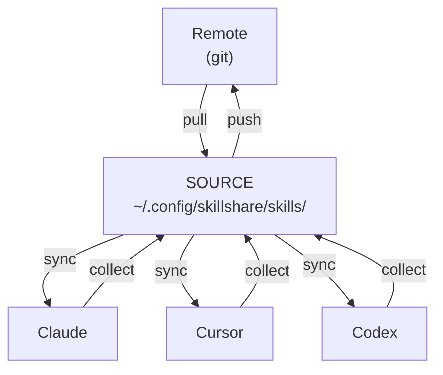
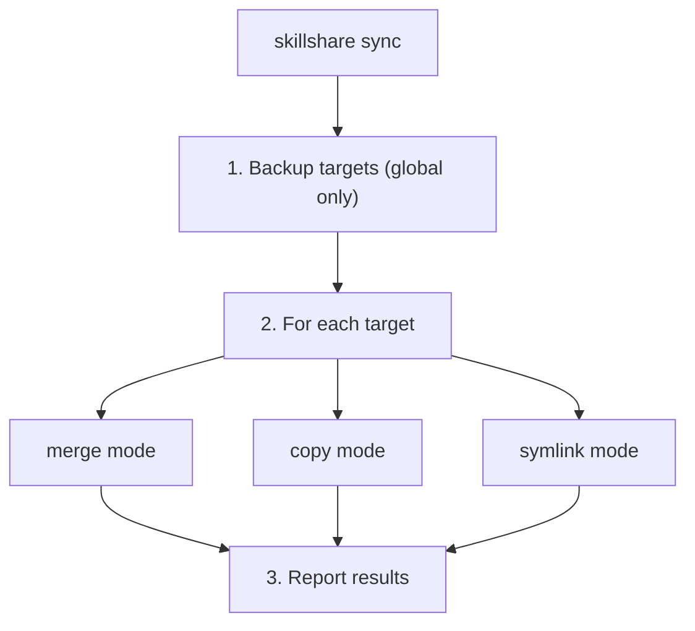
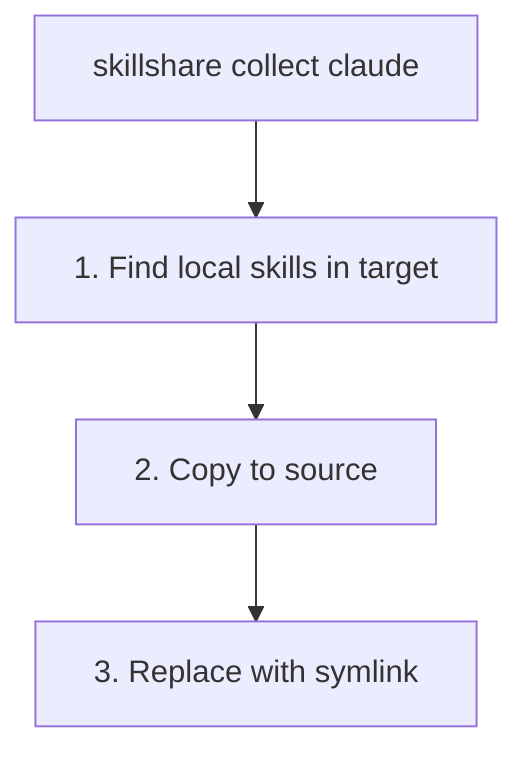
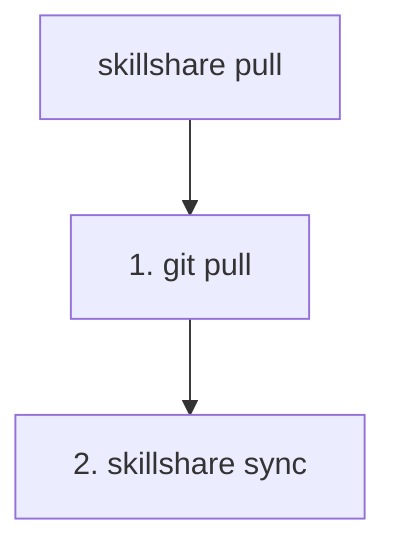
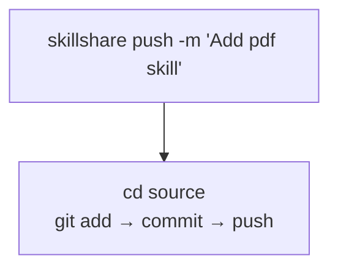
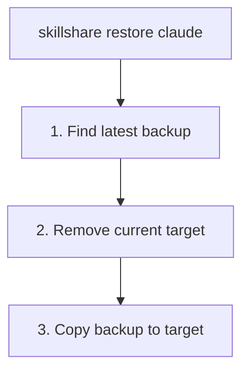
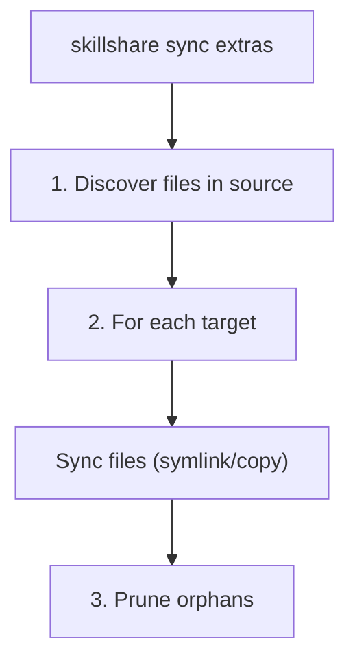

# sync

把 skills 从 Source 推送到所有 Target。

使用 `skillshare sync mcp` 处理 MCP 连接设置，或使用 `skillshare sync --all`
以包含 skills、agents、extras 和 MCP。MCP 同步使用条目所有权和冲突检查，
而非 skill symlink。参见 [mcp](/docs/reference/commands/mcp)。

:::info 为什么 sync 是一个独立命令？
`install` 和 `uninstall` 这类操作只修改 Source —— sync 才会把变更传播到 Target。这样你可以批量修改、用 `--dry-run` 预览，并自己控制 Target 何时更新。参见 [Why Sync is a Separate Step](/docs/understand/source-and-targets#why-sync-is-a-separate-step)。
:::

## 何时使用

- 在安装、卸载或编辑 skills 之后 —— 把变更传播到所有 Target
- 在修改某个 Target 的 sync 模式之后 —— 应用新模式
- 定期执行，确保所有 Target 保持同步

## 命令总览

| 类型 | 命令 | 方向 |
|------|---------|-----------|
| **本地同步** | `sync` / `collect` | Source ↔ Targets |
| **远程同步** | `push` / `pull` | Source ↔ Git Remote |

- `sync` = 从 Source 分发到 Targets
- `collect` = 从 Targets 收集回 Source
- `push` = 推送到 git remote
- `pull` = 从 git remote 拉取并同步

## 概览



| 命令 | 方向 | 说明 |
|---------|-----------|-------------|
| `sync` | Source → Targets | 把 skills 推送到所有 Target |
| `collect <target>` | Target → Source | 把 skills 从 Target 收集回 Source |
| `push` | Source → Remote | 提交并推送到 git |
| `pull` | Remote → Source → Targets | 从 git 拉取，然后同步 |

---

## Project mode

当当前目录存在 `.skillshare/config.yaml` 时，sync 会自动检测为 project mode：

```bash
cd my-project/
skillshare sync          # 自动检测为 project mode
skillshare sync -p       # 显式指定 project mode
```

**Project sync** 默认使用 merge 模式（逐个 skill symlink），但可以通过
`skillshare target <name> --mode copy -p` 把每个 Target 单独设置为 copy 或
symlink 模式。不会创建 Backup（project Target 可以从 Source 重新生成）。

```
.skillshare/skills/                 .claude/skills/
├── my-skill/          ────────►    ├── my-skill/ → (symlink)
├── pdf/               ────────►    ├── pdf/      → (symlink)
└── ...                             └── local/    (preserved)
```

---

## Sync

把 skills 从 Source 推送到所有 Target。

```bash
skillshare sync              # 把 skills 同步到所有 Target
skillshare sync agents       # 只同步 agents
skillshare sync --all        # 同步 skills + agents + extras + MCP
skillshare sync --dry-run    # 预览变更
skillshare sync -n           # 简写形式
skillshare sync --force      # 覆盖所有受管理的 skills
skillshare sync -f           # 简写形式
```

| Flag | 简写 | 说明 |
|------|-------|-------------|
| `--all` | | 在 skills 之后额外同步 agents、extras 和 MCP（不含 plugins） |
| `--dry-run` | `-n` | 预览变更但不写入 |
| `--force` | `-f` | 无视 checksum 覆盖所有受管理条目（copy 模式），或用 symlink 替换现有目录（merge 模式） |
| `--json` | | 以 JSON 格式输出 |
| `--quiet` | `-q` | 不显示 token 汇总和预算警告 |

### JSON 输出

```bash
skillshare sync --json
```

```json
{
  "targets": 3,
  "linked": 12,
  "local": 2,
  "updated": 0,
  "pruned": 1,
  "ignored_count": 2,
  "ignored_skills": ["_team/vendor/lib", "test-draft"],
  "dry_run": false,
  "duration": "0.234s",
  "details": [
    {
      "name": "claude",
      "mode": "merge",
      "linked": 8,
      "local": 2,
      "updated": 0,
      "pruned": 1
    },
    {
      "name": "cursor",
      "mode": "merge",
      "linked": 4,
      "local": 0,
      "updated": 0,
      "pruned": 0
    }
  ],
  "context_cost": {
    "groups": [
      {
        "targets": ["claude", "cursor"],
        "always_loaded_tokens": 12400,
        "on_demand_tokens": 58200
      }
    ]
  }
}
```

`ignored_count` 和 `ignored_skills` 字段显示因 `.skillignore`
（若存在 `.skillignore.local` 则一并计入）而被排除的 skills。这些会在发现阶段被过滤掉，
永远不会到达任何 Target。当 `.skillignore.local` 生效时，文本输出会包含 `.local`
来源提示。模式语法参见 [.skillignore](/docs/reference/appendix/file-structure#skillignore-optional)。

### 执行流程



### 示例输出

<p>
  
</p>

---

## Collect

把 skills 从某个 Target 收集回 Source。

```bash
skillshare collect claude           # 从 Claude 收集
skillshare collect claude --dry-run # 预览
skillshare collect --all            # 从所有 Target 收集
```

**何时使用**：你直接在某个 Target 中创建/编辑了 skill（例如 `~/.claude/skills/`），
并想把它带回 Source。



**收集之后：**
```bash
skillshare collect claude
skillshare sync  # ← 分发到其他 Target
```

---

## Pull

从 git remote 拉取并同步到所有 Target。

```bash
skillshare pull              # 从 git remote 拉取
skillshare pull --dry-run    # 预览
```

**何时使用**：你在另一台机器上推送了变更，现在想在这里同步它们。



---

## Push

把 Source 提交并推送到 git remote。

```bash
skillshare push                  # 自动生成的提交信息
skillshare push -m "Add pdf"     # 自定义提交信息
```



**冲突处理：**
- 如果 remote 领先，`push` 会失败 → 先运行 `pull`

---

## Dotfiles Manager Compatibility {#dotfiles-manager-compatibility}

如果你使用会对 Source 或 Target 目录做 symlink 的 dotfiles manager
（GNU Stow、chezmoi、yadm、bare-git），skillshare 会透明地处理：

```
# Dotfiles manager 创建：
~/.config/skillshare/skills/ → ~/dotfiles/ss-skills/     # symlinked source
~/.claude/skills/            → ~/dotfiles/claude-skills/  # symlinked target
```

- **Symlinked source** —— 所有命令（`sync`、`update`、`uninstall`、`list`、`diff`、`install`）
  在遍历之前都会先解析 symlink，因此 skills 能被正确发现。链式 symlink
  （link → link → 真实目录）同样可行。
- **Symlinked target** —— `sync` 会检测到该 target symlink **并非**由 skillshare 创建，
  并保留它。skills 会被同步到解析后的目录中。
- **Status/collect** —— `status` 和 `collect` 会跟随外部的 target symlink，
  而不是报告冲突。

:::info sync 如何判断
当一个 target 目录是 symlink 时，sync 会检查它是否指向 skillshare 的 source 目录。
只有由 skillshare 自身的 symlink 模式创建的 symlink 才会在模式转换时被移除——
来自 dotfiles manager 的外部 symlink 一律会被保留。
:::

---

## Sync Modes

| 模式 | 行为 | 使用场景 |
|------|----------|----------|
| `merge` | 每个 skill 单独 symlink | **默认。** 保留本地 skills。 |
| `copy` | 每个 skill 复制为真实文件 | 兼容性优先的场景、把 skills vendor 进项目仓库，或 symlink 行为不可靠的环境。 |
| `symlink` | 整个目录是一个 symlink | 处处保持完全一致的副本。 |

Per-target override 仍是主要的调节手段：

```bash
skillshare target <name> --mode copy
skillshare sync
```

兼容性提示由 [`doctor`](./doctor.md) 打印，而非由 `sync` 打印。其示例 target
按以下优先级选取：
`cursor` → `antigravity` → `copilot` → `opencode`。
如果这些 target 都不存在（或它们已经是 `copy` 模式），则不会显示兼容性提示。

参见 [Sync Modes](/docs/understand/sync-modes) 获取中立的决策对照表。

### Per-target include/exclude filters {#per-target-includeexclude-filters}

在 merge 和 copy 模式下，每个 target 都可以在 config 中定义
`include` / `exclude` pattern：

```yaml
targets:
  codex:
    path: ~/.codex/skills
    include: [codex-*]
  claude:
    path: ~/.claude/skills
    exclude: [codex-*]
```

- 匹配的是扁平化的 target 名称（例如 `team__frontend__ui`）
- `include` 先应用，然后是 `exclude`
- `diff`、`status`、`doctor` 以及 UI drift 检测都使用过滤后的预期集合
- 在 symlink 模式下，filters 会被忽略
- 在 copy 模式下，filters 的行为方式与 merge 模式相同
- `sync` 会移除已被排除、但之前是 source-linked 或受管理的条目

完整细节参见 [Configuration](/docs/reference/targets/configuration#include--exclude-target-filters)。

:::tip
这只是三层过滤机制中的一层。完整指南参见 [Filtering Skills](/docs/how-to/daily-tasks/filtering-skills)，
其中涵盖 `.skillignore`、SKILL.md 的 `targets` 以及 target filters。
:::

### Filter behavior examples {#filter-behavior-examples}

假设 source 中包含：
- `core-auth`
- `core-docs`
- `codex-agent`
- `codex-experimental`
- `team__frontend__ui`

#### 仅 `include`

```yaml
targets:
  codex:
    path: ~/.codex/skills
    include: [codex-*, core-*]
```

`sync` 之后，codex 会收到：
- `core-auth`
- `core-docs`
- `codex-agent`
- `codex-experimental`

适用于 target 只应收到精选子集的场景。

#### 仅 `exclude`

```yaml
targets:
  claude:
    path: ~/.claude/skills
    exclude: [codex-*, *-experimental]
```

`sync` 之后，claude 会收到：
- `core-auth`
- `core-docs`
- `team__frontend__ui`

适用于 target 应获得“几乎所有内容”、只排除特定分组的场景。

#### `include` + `exclude`

```yaml
targets:
  cursor:
    path: ~/.cursor/skills
    include: [core-*, codex-*]
    exclude: [*-experimental]
```

`sync` 之后，cursor 会收到：
- `core-auth`
- `core-docs`
- `codex-agent`

`codex-experimental` 先被 include 纳入，再被 exclude 移除。

#### filter 变更后会移除什么

当 filter 被更新且运行 `sync` 时：
- 现在被过滤掉的 source-linked 条目（symlink/junction）会被清理
- target 中已存在的本地非 symlink 文件夹会被保留

### Merge Mode（默认）

```
Source                          Target (claude)
─────────────────────────────────────────────────────────────
skills/                         ~/.claude/skills/
├── my-skill/        ────────►  ├── my-skill/ → (symlink)
├── another/         ────────►  ├── another/  → (symlink)
└── ...                         ├── local-only/  (preserved)
                                └── .skillshare-manifest.json
```

### Copy Mode

```
Source                          Target (cursor)
─────────────────────────────────────────────────────────────
skills/                         ~/.cursor/skills/
├── my-skill/        ────copy►  ├── my-skill/    (real files)
├── another/         ────copy►  ├── another/     (real files)
└── ...                         ├── local-only/  (preserved)
                                └── .skillshare-manifest.json
```

merge 和 copy 模式都会写入 `.skillshare-manifest.json` 来追踪受管理的 skills。
在 copy 模式下，checksum 支持增量同步（未变更的 skills 会被跳过）；`--force` 会覆盖全部。

### Symlink Mode

```
Source                          Target (claude)
─────────────────────────────────────────────────────────────
skills/              ────────►  ~/.claude/skills → (symlink to source)
├── my-skill/
├── another/
└── ...
```

### 更改模式

```bash
skillshare target claude --mode merge
skillshare target claude --mode copy
skillshare target claude --mode symlink
skillshare sync  # 应用变更
```

### 安全警告

> **在 symlink 模式下，从 target 删除会连带删除 source！**
> ```bash
> rm -rf ~/.claude/skills/my-skill  # ❌ 从 SOURCE 中删除
> skillshare target remove claude   # ✅ 安全地取消关联
> ```

---

## Backup

Backup 会在 `sync` 和 `target remove` 之前**自动**创建。

位置：`~/.local/share/skillshare/backups/<timestamp>/`

一次快照只捕获**本地**的 target 内容。merge 模式的 symlink 会被跳过——
它们指向你的 source，`sync` 会重新创建它们——因此无论你的 skills 有多大，
快照都能保持很小。每次 sync 之后都会自动应用 Retention 策略。
参见 [What Gets Backed Up](/docs/reference/commands/backup#what-gets-backed-up)
和 [Backups & Disk Space](/docs/reference/commands/backup#backups--disk-space)。

### 手动 Backup

```bash
skillshare backup              # 备份所有 Target
skillshare backup claude       # 备份指定 Target
skillshare backup --list       # 列出所有 Backup
skillshare backup --cleanup    # 移除旧的 Backup
skillshare backup --dry-run    # 预览
```

### 示例输出

```
$ skillshare backup --list

Backups
─────────────────────────────────────────
  2026-01-20_15-30-00/
    claude/    5 skills, 2.1 MB
    cursor/    5 skills, 2.1 MB
  2026-01-19_10-00-00/
    claude/    4 skills, 1.8 MB
```

---

## Restore

从 Backup 恢复 Target。

```bash
skillshare restore claude                              # 最新的 Backup
skillshare restore claude --from 2026-01-19_10-00-00   # 指定的 Backup
skillshare restore claude --dry-run                    # 预览
```



---

## Agent Sync {#agent-sync}

Agents 与 skills 分开同步。使用 `sync agents` 只同步 agents，或使用 `sync --all`
以包含 skills、agents、extras 和 MCP：

```bash
skillshare sync              # 只同步 skills（默认）
skillshare sync agents       # 只同步 agents
skillshare sync --all        # 同步 skills + agents + extras + MCP
```

Agent sync 支持全部三种模式（merge、copy、symlink），与 target 的配置模式一致。
只有定义了 `agents` path 的 target 才会收到 agent 同步——目前是 Claude、Cursor、
OpenCode 和 Augment。完整列表参见
[Agents — Supported Targets](/docs/understand/agents#supported-targets)。

Orphan 清理、`.agentignore` 过滤，以及 per-target include/exclude filters
的工作方式与 skills 完全相同。

---

## Sync Plugins

`sync plugins [name]` 是 [`plugin sync`](./plugin.md) 的别名。Plugins 会
**被排除在 `sync --all` 之外**，并使用原生安装操作而非 skill sync 模式。

```bash
skillshare sync plugins --dry-run --json
skillshare sync plugins demo --target claude --no-tui
```

`plugin enable` 和 `plugin disable` 只保存 target 选择。下一次 plugin sync
会安装被选中的绑定，并卸载被取消选中的绑定，同时保留它们的定义。未受管理的
plugins 不受影响。plugin sync 接受 `--target`、`--dry-run`、`--json`、`--no-tui`、
`--revision` 以及模式相关的 flag；普通 sync 的选项如 `--force`、`--quiet`、`--all`
不适用。原生客户端要求、project scope 以及部分失败恢复参见 [plugin](./plugin.md)。

## Sync Extras {#sync-extras}

把非 skill 资源（rules、commands、prompts 等）同步到任意目录。Extras 与
skills 分开配置，拥有自己的 source 目录。

```bash
skillshare sync extras            # 同步所有已配置的 extras
skillshare sync extras --dry-run  # 预览变更
skillshare sync extras --force    # 覆盖冲突的文件
skillshare sync --all             # 同步 skills + agents + extras + MCP
```

| Flag | 简写 | 说明 |
|------|-------|-------------|
| `--dry-run` | `-n` | 预览变更但不写入 |
| `--force` | `-f` | 覆盖 target 上冲突的文件 |

:::info 两种模式都支持
`sync extras` 在 global mode 和 project mode 下都能运行。使用 `sync --all`
一起同步 skills、agents、extras 和 MCP，或使用 `sync extras` 只同步 extras。
在 project mode 下，extras source 位于 `.skillshare/extras/<name>/`。
:::

### 配置

在你的 config 中（全局为 `~/.config/skillshare/config.yaml`，
project 为 `.skillshare/config.yaml`）添加一个 `extras` 段：

```yaml
extras:
  - name: rules
    targets:
      - path: ~/.claude/rules
      - path: ~/.cursor/rules
        mode: copy
  - name: commands
    targets:
      - path: ~/.claude/commands
```

每个 extra 包含：
- **`name`** —— config 目录下 `extras/` 里的目录名
- **`targets`** —— 带可选 `mode` 的 target path 列表

Source 文件存放在 `extras/` 子目录下：

```
~/.config/skillshare/
├── config.yaml
├── skills/              ← skill source
└── extras/              ← extras source root
    ├── rules/           ← extras: rules
    │   ├── coding.md
    │   └── testing.md
    └── commands/        ← extras: commands
        └── deploy.md
```

### Sync modes

| 模式 | 行为 |
|------|------|
| `merge` | 从 target 到 source 逐文件 symlink **（默认）** |
| `copy` | 逐文件复制 |
| `symlink` | 整个 source 目录 symlink 到 target path |

在 merge 模式下，只有 symlink 会被清理——用户在 target 上自行创建的本地文件会被保留。

### 执行流程



1. 遍历 source 目录（`~/.config/skillshare/extras/<name>/`）
2. 对每个 target，按配置的模式创建 symlink 或复制
3. 移除 target 中在 source 内已不存在的 orphan 文件

### 示例输出

```
$ skillshare sync extras

Rules
  ✔ ~/.claude/rules  2 files linked (merge)
  ✔ ~/.cursor/rules  2 files copied (copy)

Commands
  ✔ ~/.claude/commands  1 files linked (merge)
```

---

## Context Cost {#context-cost}

同步之后，skillshare 会显示一个 token 开销汇总：

```
✔ Synced 47 skill(s) to 4 target(s) in 312ms
  Context: ~12.4K always-loaded · ~58.2K on-demand (claude, cursor, codex, opencode)
```

- **Always-loaded**：frontmatter 的 name + description（每次请求都会加载）
- **On-demand**：skill 正文（被触发时才加载）

token 数相同的 Target 会被合并显示在同一行。

### Budget Warnings

在你的 config 中配置警告阈值：

```yaml
context_budget:
  warn_always_loaded_tokens: 10000   # 默认值；0 = 停用
  warn_on_demand_tokens: 100000      # 默认值；0 = 停用
```

当超过阈值时，会显示一条警告并列出前 3 名消耗者：

```
! Always-loaded context is ~50,123 tokens (budget: 10,000)
   Top 3:
     • my-big-skill                    ~8,200 tokens
     • another-verbose-skill           ~6,400 tokens
     • chatgpt-system-prompt           ~5,100 tokens
   Run `skillshare analyze` for details.
```

### Quiet Mode

使用 `--quiet` 或 `-q` 来不显示 token 汇总和预算警告：

```bash
skillshare sync --quiet
```

JSON 输出（`--json`）无论是否带 `--quiet` 都始终包含 `context_cost`。

---

## 另请参阅

- [status](/docs/reference/commands/status) —— 显示同步状态
- [diff](/docs/reference/commands/diff) —— 显示差异
- [Targets](/docs/reference/targets) —— 管理 Target
- [Cross-Machine Sync](/docs/how-to/sharing/cross-machine-sync) —— 跨机器同步
- [install](/docs/reference/commands/install) —— 安装 skills
- [Configuration](/docs/reference/targets/configuration#extras) —— Extras 配置参考
