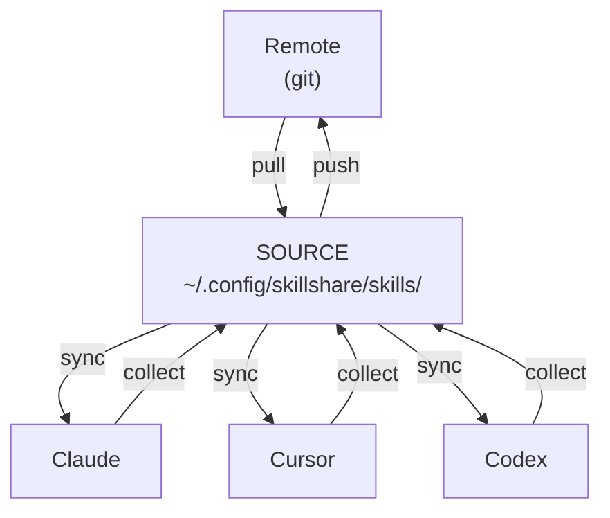
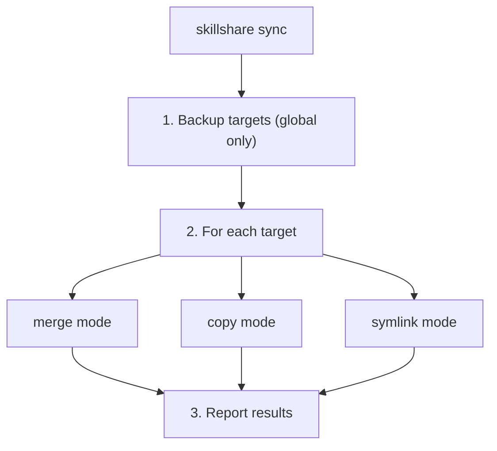
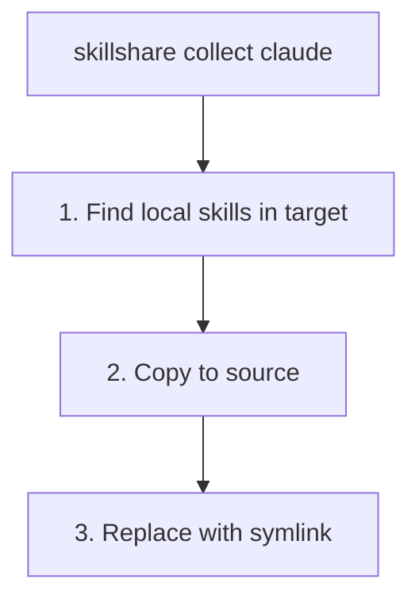
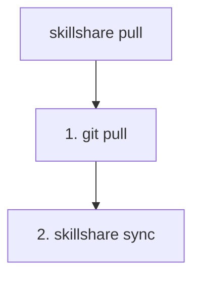
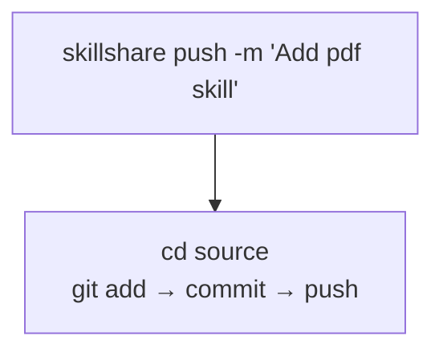
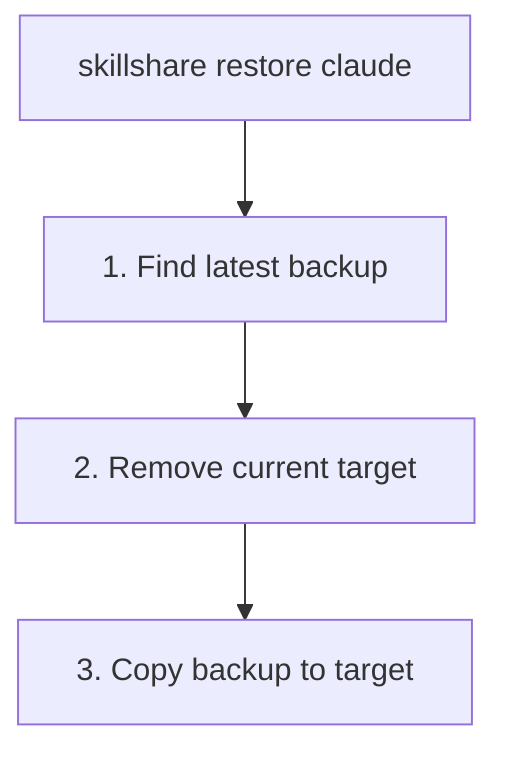
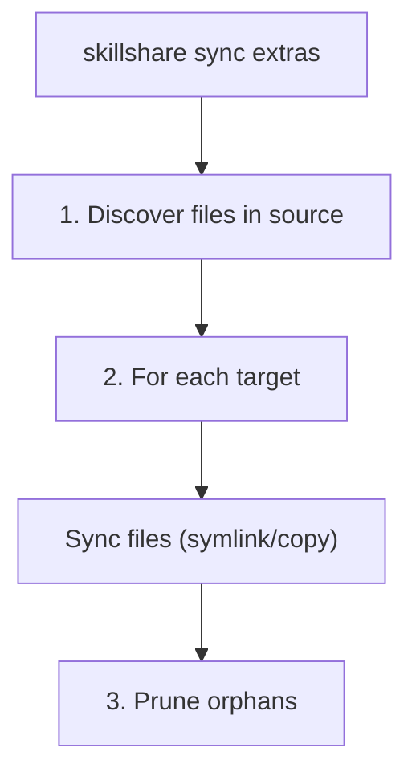

# sync

把 skills 從 source 推送到所有 targets。

MCP 連線設定請用 `skillshare sync mcp`，或用 `skillshare sync --all`
一併包含 skills、agents、extras 與 MCP。MCP 同步使用的是條目
所有權與衝突檢查，而非 skill symlinks。見 [mcp](/docs/reference/commands/mcp)。

:::info 為什麼 sync 是獨立指令？
`install` 與 `uninstall` 之類的操作只會修改 source — sync 才會傳播到 targets。這讓你可以批次處理變更、用 `--dry-run` 預覽，並控制 targets 何時更新。見 [Why Sync is a Separate Step](/docs/understand/source-and-targets#why-sync-is-a-separate-step)。
:::

## 何時使用

- 在安裝、解除安裝或編輯 skills 後 — 把變更傳播到所有 targets
- 在變更某個 target 的 sync mode 後 — 套用新的 mode
- 定期執行以確保所有 targets 保持同步

## 指令總覽

| 類型 | 指令 | 方向 |
|------|---------|-----------|
| **本地同步** | `sync` / `collect` | Source ↔ Targets |
| **遠端同步** | `push` / `pull` | Source ↔ Git Remote |

- `sync` = 從 Source 分發到 Targets
- `collect` = 從 Targets 收集回 Source
- `push` = 推送到 git remote
- `pull` = 從 git remote 拉取並同步

## 總覽



| 指令 | 方向 | 說明 |
|---------|-----------|-------------|
| `sync` | Source → Targets | 把 skills 推送到所有 targets |
| `collect <target>` | Target → Source | 把 skills 從 target 收集回 source |
| `push` | Source → Remote | 提交並推送到 git |
| `pull` | Remote → Source → Targets | 從 git 拉取，然後同步 |

---

## Project Mode

當目前目錄存在 `.skillshare/config.yaml` 時，sync 會自動偵測 project mode：

```bash
cd my-project/
skillshare sync          # 自動偵測為 project mode
skillshare sync -p       # 明確指定 project mode
```

**Project sync** 預設使用 merge mode（逐 skill symlink），但每個 target 都可以透過 `skillshare target <name> --mode copy -p` 設為 copy 或 symlink mode。不會建立備份（專案 targets 可從 source 重新產生）。

```
.skillshare/skills/                 .claude/skills/
├── my-skill/          ────────►    ├── my-skill/ → (symlink)
├── pdf/               ────────►    ├── pdf/      → (symlink)
└── ...                             └── local/    (preserved)
```

### 預設路徑變更後的清理 {#project-path-cleanup}

Project config 儲存的是 target 名稱而不是路徑，因此每個 target 都會沿用它的內建預設路徑。當某個工具改變了這個預設路徑——例如 goose 與 openhands 改用 `.agents/skills`——skillshare 先前寫進舊目錄的 skills 會留在原地，該工具就會同時讀取兩個位置，把每個 skill 都列出兩次。

Project sync 會把它們清掉。對於每個沒有明確指定 `path:` 的 target，它會檢查該 target 的 runtime 同樣會掃描的目錄，並在其中沒有任何已設定 target 會寫入的目錄裡，移除由 skillshare 建立的條目。你自己建立的資料夾，以及指向專案外部的 symlinks，都不會被動到。

```
→ Cleaned 1 leftover skill(s) from .goose/skills: the default path for 'goose' moved to .agents/skills
```

為某個 target 明確設定 `path:` 就能讓它排除在這項清理之外；`--dry-run` 只會預覽將被移除的內容，不會實際變更任何東西。

---

## Sync

把 skills 從 source 推送到所有 targets。

```bash
skillshare sync              # 同步 skills 到所有 targets
skillshare sync agents       # 只同步 agents
skillshare sync --all        # 同步 skills + agents + extras + MCP
skillshare sync --dry-run    # 預覽變更
skillshare sync -n           # 簡寫
skillshare sync --force      # 覆蓋所有受管理的 skills
skillshare sync -f           # 簡寫
```

| 旗標 | 縮寫 | 說明 |
|------|-------|-------------|
| `--all` | | 在 skills 之後也同步 agents、extras 與 MCP（不含 plugins） |
| `--dry-run` | `-n` | 預覽變更而不實際寫入 |
| `--force` | `-f` | 不論 checksum 一律覆蓋所有受管理的條目（copy mode），或以 symlink 取代既有目錄（merge mode） |
| `--json` | | 以 JSON 輸出 |
| `--quiet` | `-q` | 隱藏 token 摘要與預算警告 |

### JSON 輸出

```bash
skillshare sync --json
```

```json
{
  "targets": 3,
  "linked": 12,
  "local": 2,
  "updated": 0,
  "pruned": 1,
  "ignored_count": 2,
  "ignored_skills": ["_team/vendor/lib", "test-draft"],
  "dry_run": false,
  "duration": "0.234s",
  "details": [
    {
      "name": "claude",
      "mode": "merge",
      "linked": 8,
      "local": 2,
      "updated": 0,
      "pruned": 1
    },
    {
      "name": "cursor",
      "mode": "merge",
      "linked": 4,
      "local": 0,
      "updated": 0,
      "pruned": 0
    }
  ],
  "context_cost": {
    "groups": [
      {
        "targets": ["claude", "cursor"],
        "always_loaded_tokens": 12400,
        "on_demand_tokens": 58200
      }
    ]
  }
}
```

`ignored_count` 與 `ignored_skills` 欄位顯示被 `.skillignore`（若存在 `.skillignore.local` 也包含在內）排除的 skills。這些是在 discovery 階段就被篩掉的，永遠不會到達任何 target。當 `.skillignore.local` 生效時，文字輸出會包含 `.local` 來源提示。pattern 語法見 [.skillignore](/docs/reference/appendix/file-structure#skillignore-optional)。

### 發生了什麼



### 輸出範例

<p>
  
</p>

---

## Collect

把 skills 從 target 收集回 source。

```bash
skillshare collect claude           # 從 Claude 收集
skillshare collect claude --dry-run # 預覽
skillshare collect --all            # 從所有 targets 收集
```

**何時使用**：你直接在 target 中（例如 `~/.claude/skills/`）建立/編輯了一個 skill，想把它帶回 source。



**收集之後：**
```bash
skillshare collect claude
skillshare sync  # ← 分發到其他 targets
```

---

## Pull

從 git remote 拉取並同步到所有 targets。

```bash
skillshare pull              # 從 git remote 拉取
skillshare pull --dry-run    # 預覽
```

**何時使用**：你從另一台機器推送了變更，想在這裡同步它們。



---

## Push

提交並把 source 推送到 git remote。

```bash
skillshare push                  # 自動產生訊息
skillshare push -m "Add pdf"     # 自訂訊息
```



**衝突處理：**
- 如果 remote 領先，`push` 會失敗 → 請先執行 `pull`

---

## Dotfiles Manager 相容性 {#dotfiles-manager-compatibility}

如果你使用會把 source 或 target 目錄 symlink 的 dotfiles manager（GNU Stow、chezmoi、yadm、bare-git），skillshare 會透明地處理它：

```
# Dotfiles manager creates:
~/.config/skillshare/skills/ → ~/dotfiles/ss-skills/     # symlinked source
~/.claude/skills/            → ~/dotfiles/claude-skills/  # symlinked target
```

- **Symlinked source** — 所有指令（`sync`、`update`、`uninstall`、`list`、`diff`、`install`）在走訪前都會先解析 symlink，因此 skills 能被正確發現。連鎖 symlinks（link → link → 實際目錄）也能運作。
- **Symlinked target** — `sync` 會偵測到該 target symlink**不是**由 skillshare 建立的，並予以保留。Skills 會同步進解析後的目錄。
- **Status/collect** — `status` 與 `collect` 會跟隨外部 target symlinks，而不是回報衝突。

:::info sync 如何判斷
當 target 目錄是 symlink 時，sync 會檢查它是否指向 skillshare 的 source 目錄。只有由 skillshare 自身 symlink mode 建立的 symlinks，才會在 mode 轉換時被移除 — 外部的 symlinks（來自 dotfiles managers）一律會被保留。
:::

---

## Sync Modes

| Mode | 行為 | 使用情境 |
|------|----------|----------|
| `merge` | 每個 skill 個別建立 symlink | **預設。** 保留本地 skills。 |
| `copy` | 每個 skill 以真實檔案複製 | 以相容性優先的設定、把 skills vendoring 進專案 repo，或 symlink 行為不穩定的環境。 |
| `symlink` | 整個目錄是單一個 symlink | 各處都是完全相同的副本。 |

Per-target 覆寫仍是主要的調整手段：

```bash
skillshare target <name> --mode copy
skillshare sync
```

相容性提示是由 [`doctor`](./doctor.md) 印出的，而不是由 `sync` 印出。其範例 target 依以下優先順序選出：
`cursor` → `antigravity` → `copilot` → `opencode`。
如果這些 targets 都不存在（或它們已經是 `copy` mode），就不會顯示相容性提示。

中立的決策矩陣見 [Sync Modes](/docs/understand/sync-modes)。

### 逐 Target 的 include/exclude filters {#per-target-includeexclude-filters}

在 merge 與 copy modes 中，每個 target 都可以在設定檔中定義 `include` / `exclude` patterns：

```yaml
targets:
  codex:
    path: ~/.codex/skills
    include: [codex-*]
  claude:
    path: ~/.claude/skills
    exclude: [codex-*]
```

- 比對的對象是扁平化的 target 名稱（例如 `team__frontend__ui`）
- `include` 先套用，然後才套用 `exclude`
- `diff`、`status`、`doctor` 與 UI drift 都使用篩選後的預期集合
- 在 symlink mode 中，filters 會被忽略
- 在 copy mode 中，filters 的運作方式與 merge mode 相同
- `sync` 會移除現在已被排除、但先前是 source-linked 或受管理的條目

完整細節見 [Configuration](/docs/reference/targets/configuration#include--exclude-target-filters)。

:::tip
這只是三層篩選機制之一。完整指南（涵蓋 `.skillignore`、SKILL.md 的 `targets`，以及 target filters）見 [Filtering Skills](/docs/how-to/daily-tasks/filtering-skills)。
:::

### Filter 行為範例 {#filter-behavior-examples}

假設 source 包含：
- `core-auth`
- `core-docs`
- `codex-agent`
- `codex-experimental`
- `team__frontend__ui`

#### 只有 `include`

```yaml
targets:
  codex:
    path: ~/.codex/skills
    include: [codex-*, core-*]
```

`sync` 之後，codex 會收到：
- `core-auth`
- `core-docs`
- `codex-agent`
- `codex-experimental`

當某個 target 應該只收到精選子集時使用此方式。

#### 只有 `exclude`

```yaml
targets:
  claude:
    path: ~/.claude/skills
    exclude: [codex-*, *-experimental]
```

`sync` 之後，claude 會收到：
- `core-auth`
- `core-docs`
- `team__frontend__ui`

當某個 target 應該收到「幾乎所有東西」、只排除特定群組時使用此方式。

#### `include` + `exclude`

```yaml
targets:
  cursor:
    path: ~/.cursor/skills
    include: [core-*, codex-*]
    exclude: [*-experimental]
```

`sync` 之後，cursor 會收到：
- `core-auth`
- `core-docs`
- `codex-agent`

`codex-experimental` 先被 `include` 納入，再被 `exclude` 移除。

#### 當 filters 變更時會移除什麼

當 filter 被更新且執行 `sync` 時：
- 現在被篩掉的 source-linked 條目（symlink/junction）會被清除
- target 中既有的本地非 symlink 資料夾會被保留

### Merge Mode（預設）

```
Source                          Target (claude)
─────────────────────────────────────────────────────────────
skills/                         ~/.claude/skills/
├── my-skill/        ────────►  ├── my-skill/ → (symlink)
├── another/         ────────►  ├── another/  → (symlink)
└── ...                         ├── local-only/  (preserved)
                                └── .skillshare-manifest.json
```

### Copy Mode

```
Source                          Target (cursor)
─────────────────────────────────────────────────────────────
skills/                         ~/.cursor/skills/
├── my-skill/        ────copy►  ├── my-skill/    (real files)
├── another/         ────copy►  ├── another/     (real files)
└── ...                         ├── local-only/  (preserved)
                                └── .skillshare-manifest.json
```

Merge 與 copy modes 都會寫入 `.skillshare-manifest.json` 以追蹤受管理的 skills。在 copy mode 中，checksum 讓增量同步成為可能（未變更的 skills 會被跳過）；`--force` 會覆蓋全部。

### Symlink Mode

```
Source                          Target (claude)
─────────────────────────────────────────────────────────────
skills/              ────────►  ~/.claude/skills → (symlink to source)
├── my-skill/
├── another/
└── ...
```

### 變更 Mode

```bash
skillshare target claude --mode merge
skillshare target claude --mode copy
skillshare target claude --mode symlink
skillshare sync  # 套用變更
```

### 安全警告

> **在 symlink mode 中，透過 target 刪除會連 source 一起刪除！**
> ```bash
> rm -rf ~/.claude/skills/my-skill  # ❌ Deletes from SOURCE
> skillshare target remove claude   # ✅ Safe way to unlink
> ```

---

## Backup

備份會在 `sync` 與 `target remove` 之前**自動**建立。

位置：`~/.local/share/skillshare/backups/<timestamp>/`

快照只擷取 **local** 的 target 內容。Merge-mode symlinks 會被跳過 — 它們指向你的 source，`sync` 會重新建立它們 — 因此不論你的 skills 有多大，快照都能保持精簡。每次 sync 後都會自動套用保留期限。見 [What Gets Backed Up](/docs/reference/commands/backup#what-gets-backed-up) 與 [Backups & Disk Space](/docs/reference/commands/backup#backups--disk-space)。

### 手動備份

```bash
skillshare backup              # 備份所有 targets
skillshare backup claude       # 備份特定 target
skillshare backup --list       # 列出所有備份
skillshare backup --cleanup    # 移除舊備份
skillshare backup --dry-run    # 預覽
```

### 輸出範例

```
$ skillshare backup --list

Backups
─────────────────────────────────────────
  2026-01-20_15-30-00/
    claude/    5 skills, 2.1 MB
    cursor/    5 skills, 2.1 MB
  2026-01-19_10-00-00/
    claude/    4 skills, 1.8 MB
```

---

## Restore

從備份還原 targets。

```bash
skillshare restore claude                              # 最新備份
skillshare restore claude --from 2026-01-19_10-00-00   # 特定備份
skillshare restore claude --dry-run                    # 預覽
```



---

## Agent 同步 {#agent-sync}

Agents 與 skills 是分開同步的。用 `sync agents` 只同步 agents，或用 `sync --all` 一併包含 skills、agents、extras 與 MCP：

```bash
skillshare sync              # 只同步 skills（預設）
skillshare sync agents       # 只同步 agents
skillshare sync --all        # 同步 skills + agents + extras + MCP
```

Agent sync 支援全部三種 modes（merge、copy、symlink），會依照 target 已設定的 mode 進行。只有定義了 `agents` 路徑的 targets 才會收到 agent 同步 — 目前是 Claude、Cursor、OpenCode 與 Augment。完整清單見 [Agents — Supported Targets](/docs/understand/agents#supported-targets)。

孤兒清理、`.agentignore` 篩選，以及 per-target include/exclude filters，運作方式都與 skills 相同。

---

## Sync Plugins

`sync plugins [name]` 是 [`plugin sync`](./plugin.md) 的別名。Plugins
**不包含在 `sync --all` 中**，而是使用原生安裝操作，而非 skill sync modes。

```bash
skillshare sync plugins --dry-run --json
skillshare sync plugins demo --target claude --no-tui
```

`plugin enable` 與 `plugin disable` 只會儲存 target 選擇。下一次 plugin
sync 會安裝已選取的綁定並解除安裝已取消選取的，同時保留它們的
定義。未受管理的 plugins 不受影響。Plugin sync 接受 `--target`、
`--dry-run`、`--json`、`--no-tui`、`--revision` 以及 mode 旗標；一般的 sync 選項
如 `--force`、`--quiet` 與 `--all` 則不適用。原生客戶端需求、專案範圍與
部分失敗的復原方式，見 [plugin](./plugin.md)。

## 同步 Extras {#sync-extras}

把非 skill 資源（rules、commands、prompts 等）同步到任意目錄。Extras 與 skills 分開設定，並有自己的 source 目錄。

```bash
skillshare sync extras            # 同步所有已設定的 extras
skillshare sync extras --dry-run  # 預覽變更
skillshare sync extras --force    # 覆蓋衝突的檔案
skillshare sync --all             # 同步 skills + agents + extras + MCP
```

| 旗標 | 縮寫 | 說明 |
|------|-------|-------------|
| `--dry-run` | `-n` | 預覽變更而不實際寫入 |
| `--force` | `-f` | 覆蓋 target 上衝突的檔案 |

:::info 兩種 mode 都支援
`sync extras` 在 global 與 project mode 中都能運作。用 `sync --all` 一起同步 skills、agents、extras 與 MCP，或用 `sync extras` 只同步 extras。在 project mode 中，extras source 為 `.skillshare/extras/<name>/`。
:::

### 設定

在你的設定檔中加入 `extras` 區段（global 用 `~/.config/skillshare/config.yaml`，project 用 `.skillshare/config.yaml`）：

```yaml
extras:
  - name: rules
    targets:
      - path: ~/.claude/rules
      - path: ~/.cursor/rules
        mode: copy
  - name: commands
    targets:
      - path: ~/.claude/commands
```

每個 extra 都有：
- **`name`** — 設定目錄下 `extras/` 中的目錄名稱
- **`targets`** — 目標路徑清單，可選填 `mode`

Source 檔案位於 `extras/` 子目錄下：

```
~/.config/skillshare/
├── config.yaml
├── skills/              ← skill source
└── extras/              ← extras source root
    ├── rules/           ← extras: rules
    │   ├── coding.md
    │   └── testing.md
    └── commands/        ← extras: commands
        └── deploy.md
```

### Sync modes

| Mode | 行為 |
|------|----------|
| `merge` | 從 target 到 source 逐檔案 symlink**（預設）** |
| `copy` | 逐檔案複製 |
| `symlink` | 整個 source 目錄 symlink 到 target 路徑 |

在 merge mode 中，只有 symlinks 會被清除 — target 上使用者自建的本地檔案會被保留。

### 發生了什麼



1. 走訪 source 目錄（`~/.config/skillshare/extras/<name>/`）
2. 為每個 target 依設定的 mode 建立 symlinks 或複製
3. 移除 target 中已不存在於 source 的孤兒檔案

### 輸出範例

```
$ skillshare sync extras

Rules
  ✔ ~/.claude/rules  2 files linked (merge)
  ✔ ~/.cursor/rules  2 files copied (copy)

Commands
  ✔ ~/.claude/commands  1 files linked (merge)
```

---

## Context 成本 {#context-cost}

同步後，skillshare 會顯示 token 成本摘要：

```
✔ Synced 47 skill(s) to 4 target(s) in 312ms
  Context: ~12.4K always-loaded · ~58.2K on-demand (claude, cursor, codex, opencode)
```

- **Always-loaded**：frontmatter 的 name + description（每次請求都會載入）
- **On-demand**：skill 主體內容（觸發時才載入）

Token 數量相同的 targets 會合併顯示在同一行。

### 預算警告

在你的設定檔中設定警告門檻：

```yaml
context_budget:
  warn_always_loaded_tokens: 10000   # 預設值；0 = 停用
  warn_on_demand_tokens: 100000      # 預設值；0 = 停用
```

超過門檻時，會顯示警告並列出前 3 名占用最多的項目：

```
! Always-loaded context is ~50,123 tokens (budget: 10,000)
   Top 3:
     • my-big-skill                    ~8,200 tokens
     • another-verbose-skill           ~6,400 tokens
     • chatgpt-system-prompt           ~5,100 tokens
   Run `skillshare analyze` for details.
```

### 安靜模式

用 `--quiet` 或 `-q` 隱藏 token 摘要與預算警告：

```bash
skillshare sync --quiet
```

JSON 輸出（`--json`）不論是否加 `--quiet`，都一律包含 `context_cost`。

---

## 另見

- [status](/docs/reference/commands/status) — 顯示同步狀態
- [diff](/docs/reference/commands/diff) — 顯示差異
- [Targets](/docs/reference/targets) — 管理 targets
- [Cross-Machine Sync](/docs/how-to/sharing/cross-machine-sync) — 跨電腦同步
- [install](/docs/reference/commands/install) — 安裝 skills
- [Configuration](/docs/reference/targets/configuration#extras) — Extras 設定參考
